# Chapter 4: Setting the Stage: the Precursors and Boundaries for a New Aesthetic Art

To the best of our knowledge, there is not a single sustained instance
of critics or commentators using the parameters of the New Aesthetic to
identify New Aesthetic objects as examples of art. Writing about the
effect of technology on art practices is becoming increasingly
sophisticated, but it’s surprising how uneven the progression has been,
and this has been especially true of New Aesthetic objects. Often,
writings about art and the digital have focused on a limited range of
considerations. In many cases, the use value and the impact on our lives
is the primary focus, and if any consideration is given towards beauty,
taste, impact or evaluative considerations of the objects as objects
it’s directed towards the design of the graphic user interface rather
than on some underlying notion of an inherent status as art. In other
cases, the technological and the digital are superficially acknowledged
as merely tools leading to the creation of art objects, and the deeper
implications of the use of digital and technological tools is ignored.
The recent publications of *Postdigital Aesthetics* (2015), edited by
David M. Berry and Michael Dieter, and *Postdigital Artisans* (2015), by
Jonathan Openshaw, while excellent books (including Łukasz Mirocha’s own
essay in *Postdigital Aesthetics*), are good examples of these different
but inadequate strategies at a theoretical level matched by the
inadequacy of recent exhibitions such as *Crafted Objects in Flux*
(2015-16) at the Museum of Fine Arts in Boston, USA; in the case of the
work by the theorists there’s been very little discussion of actual art
while in the case of the exhibitions there’s been almost no discussion
of the theory.

Perhaps even more importantly, the New Aesthetic has not been treated in
an *art historical* fashion but has existed as a topic for discussion
and analysis almost solely amongst philosophers, critics, artists,
designers and others who are interested in the effects of the
digitalization of the world. Certainly art history as a discursive
practice has always been a little slow to acknowledge contemporary
artistic practices, and we hope that what follows will rectify that at
least a little bit. More than just setting out our belief in the
timeliness and importance of this book, we believe that our
interdisciplinary approach is crucial to understanding the entirety of
the effect of the New Aesthetic. An illuminating example is Christian
Ulrik Andersen’s and Søren Bro Pold’s treatment of Aram Bartholl’s
*Dropping the Internet* (2014). {Fig. 43} 

   
Fig. 43 Aram Bartholl, *Dropping the
Internet* (2014)

Borrowing uncritically from
Bartholl’s own website,[^04-Chap4_1] Andersen and Pold describe the photographic
triptych in terms of the security concerns and sense of crisis in the
post-Snowden era, placing an emphasis on the work’s presentation of the
‘internet’ as inherently fragile. At the same time Andersen and Pold
engage in a little aesthetic analysis that seems to go quickly awry.

> Bartholl’s work seems deliberately lightweight, pointing towards the
> banality through both its form and its iconography. Looking closely,
> one realizes that the high-teach iconography consists only of
> cardboard, candlelight and people acting according to strange
> behavioral scripts: pointing to how the big utopias become banal and
> mundane, including how they control sharing, communication and
> perception.[^04-Chap4_2]

In many ways, this is an illuminating analysis of the effect of the
work, reading it as symbolic of the wrenching, almost existential
transformation of the internet that occurred after Snowden revealed the
extent to which our privacy and the secrets of governments had been
compromised; almost immediately the general public’s understanding of
the internet as an interactive source of data and method of
communication went from a blind acceptance of it as a freely used tool
to thinking about it as an adversarial and nefarious intrusion into
everyone’s lives. Bartholl intended his work to evoke a sense of violent
dislocation and excessive centralization, contrary to the early days of
the internet with its engineered decentralization as a means of
surviving nuclear war, but returning to Andersen’s and Pold’s
description of the work it’s clear that other things are going on, and
that Andersen and Pold may be ill-equipped to acknowledge them. Bartholl
readily acknowledges his appropriation of Ai Weiwei’s famous work
*Dropping a Han Dynasty Urn* (1995)[^04-Chap4_3] {Fig. 44} but why don’t Andersen
and Pold mention it? 

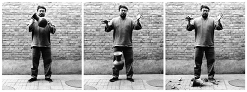   
Fig. 44 Ai Wei Wei, *Dropping a Han
Dynasty Urn* (1995)

Ai Weiwei’s work engages with China’s difficult
relationship to the past, shattering any expectations of reverence for
ancient artifacts that substantiate China’s image of itself as a nation
while at the same time setting in motion a deconstructive turn that
subverts Ai Weiwei’s own powers as an artist to actuate change in
Chinese society. Bartholl’s iconography, though, is itself a subversion
of the appropriation process, with what appears to be a digital picture
frame symbolically and almost mischievously (despite Bartholl’s saddened
statement that the internet as he once knew it is gone) representing
computational devices, and with a touch of irony in the color choices
and the need to literally spell out ‘internet’. In both Ai Weiwei’s and
Bartholl’s works the iconography involves a radical break with the past,
Ai Weiwei is ‘post-Chinese’ while Bartholl is ‘postdigital,’ that does
far more than Andersen and Pold suggest: Bartholl’s work is
participating in a tradition of breaking with the past and is,
therefore, less radical of a break than is implied. We will return to
Bartholl’s work later in the chapter – he is, after all, one of the most
important artists working in in this context – but we wanted to make
clear what is revealed through more than just an examination of the
postdigital, and that this is only apparent in an interdisciplinary
fashion. In this chapter to investigate New Aesthetic art becomes an
important means of furthering the definition of this set of phenomena in
its entirety.

Importantly, the very term ‘New Aesthetic’ implies a specific
relationship to aesthetics as the philosophy of art. For much of its
history, at least until recently, aesthetics has been focused on
questions regarding such things as the nature and purpose of art, the
means of identifying art objects as distinct from everyday objects, the
definition of beauty, and the relationship between ‘fine’ art and craft
(if there is a distinction between the two). Reading through the
literature, however, it’s been apparent that the use of the term
‘aesthetic’ in ‘New Aesthetics’ has been more akin to the way it was
used prior to Alexander Gottlieb Baumgarten’s transformation of its
meaning. Beginning in 1735 and culminating in Baumgarten’s *Reflections
on Poetry* (1750), aesthetics shifted from a philosophical concern with
the experience of sense perception to analyses of ideas of taste and
beauty and concerns about ontologically driven questions on the nature
of art. From our perspective, discussions of the New Aesthetics has a
pre-Baumgartenian flavor. Most of the recent discussions of New
Aesthetic objects have never been about their nature as art per se, even
though this would be a fruitful line of inquiry; focusing on their
digital existence, they seem less entangled in the past 250+ years and
more concerned with the pre-Baumgartenian notion of aesthetics that
focuses on how things are for our perception, how they feel, how they
impact our comfort or discomfort in our relationship to the world. In
many respects, Baumgarten’s ideas have been taken up in phenomenological
investigations but what is particularly valuable in making this
connection between primarily 21st century phenomena and an 18th century
philosopher’s important but flawed modern interpretation of the term
‘aesthetics’ is Baumgarten’s insistence that aesthetic appreciation
functions within the locus of truth and the presentation of perfection,
aiming towards an extensive clarity with various affects. The parallels
to any discussion of the efficiency of a GUI are striking. Baumgarten
writes in his *Meditationes*:

> Since affects are more notable degrees of pain and pleasure, their
> sensible representations are given in representing something to
> oneself confusedly as good or bad, and thus they determine poetic
> representations, and *to arouse affects is poetic*.[^04-Chap4_4]

The effect of these affects is sensible cognition, not only as the
physical embodiment of the presentation of ideas but as the aesthetic
perfection of those ideas, an obvious driving force in apps like *Waze*.
For Baumgarten: ‘The aim of aesthetics is the perfection of sensible
cognition as such, that is, beauty, while its imperfection as such, that
is, ugliness, is to be avoided.’[^04-Chap4_5] Colin McQuillian describes
Baumgarten’s position nicely.

> When the objects of sensible cognition agree with one another, then
> sensible cognition is perfectly ordered, so it is beautiful. The
> beauty of signification is also a perfection of sensible cognition,
> because we cannot represent the beauty of the objects of sensible
> cognition and their order without signs. When the signs we use to
> represent sensible perfection agree with one another, then sensible
> cognition expresses itself eloquently, and it is beautiful.[^04-Chap4_6]

What is interesting here is how appropriate this is when discussing New
Aesthetic objects and, by extension, New Aesthetic art; Baumgarten’s
enlightened rationalism is outdated in so many different ways, but the
notion that aesthetics is about the analysis of the perfection of the
presentation of ideas, making them available for sensible cognition such
that their truth is seemingly irrefutable, ties in nicely with New
Aesthetic objects’ presentation of their own autonomy and
self-sufficient, self-generated and self-perfected state despite
inherent and unavoidable glitches, errors and pervasive manipulations of
the experiences and understanding of the consumers of the New Aesthetic
objects.

Taking a Baumgartenian perspective complicates the very foundations of
this chapter. If New Aesthetic objects are the presentation of their own
self-determined perfection then the only criteria we could employ when
critically engaging with them is the degree to which they achieve that
sense of presented perfection, that sense of being natural objects that
appear to be natural part of our environments. In fact, the only
criteria that we could then use to distinguish between non-New Aesthetic
and New Aesthetic objects, to take this line of thought to an absurd
conclusion, would be to note that objects seemingly recognizable as the
later are, in fact, not such objects, simply because their lack of
perfection means that their inherent artificiality is apparent. Of
course, that’s ridiculous, but it’s instructive when thinking about them
generally in that it is the manifestations, theoretical underpinnings,
and the attitude which generates New Aesthetic objects that further a
complicated and increasingly complicated reception while confounding our
ability to accurately and critically engage with the world. This
increasingly complicated means of seeing the world through the New
Aesthetic can be seen readily in the digitalization of the art
experience.

The Google Art Project states that it has three aims: 1) to provide the
experience of art in museums and other cultural institutions digitally
so that people can see them from a distance, see objects in greater
detail (often in greater detail than they would if they were actually in
the museums looking at the objects themselves), and share the experience
of art; 2) to provide a means to safeguard and protect history and
cultural heritage; 3) to serve as a lab to allow for cross-disciplinary
creative activities between curators, historians, artists, designers and
educators.[^04-Chap4_7] In all three cases, as much as it might seem like the
Google Art Project is an effort to extend the opportunities to
appreciate art in museums, in its narrowing of the aesthetic experience,
it is far more an opportunity to appreciate the art at a distance, the
objects transformed from their state as physical objects to being merely
digital artifacts, to the point that Walter Benjamin’s warnings about
the loss of aura seems very much like reality. In particular, the second
aim is the most difficult to come to terms with, in that the
preservation of the objects cannot, by definition of the efforts as
digital, be an actual preservation of the objects but only the
preservation of their appearance. Notwithstanding Plato’s admonishment
against aesthetic experiences being twice removed as a danger to the
very fabric of social structures, this just seems odd, a reification of
the collecting impulse extended to the point that the physicality of
objects disappears. This is not as absurd as it sounds, as evidenced in
the artwork of João Enxuto and Erica Love and their ongoing art project
*Anonymous Paintings* (2011-).[^04-Chap4_8] {Fig. 45} 

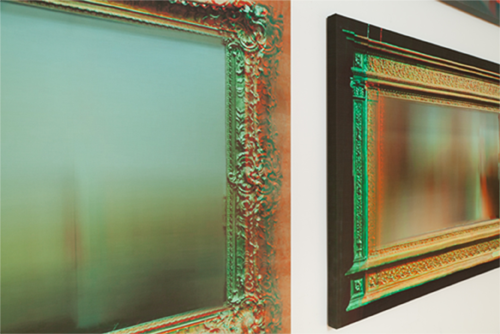   
Fig. 45 João Enxuto, and Erica Love,
*Anonymous Paintings* (2013)

Given the obvious copyright
issues involved with the Google Art Project, Enxuto and Love have been
producing inkjet prints on stretched canvases of blurred images
appropriated from Google’s website. Describing the work, as the artists
do, as ‘censored’ might seem extreme but their artworks have a singular
and stunning effect:

> The censored artworks are like the blurred individuals caught in the
> path of Google’s omnipresent Street View camera where occlusion
> denotes an identity and subjecthood. Our Anonymous Paintings use
> abstraction as a code for autonomy and withdrawal from Google’s
> comprehensive visual record.[^04-Chap4_9]

Making the analogy between the paintings and the blurred images of human
faces in Google Street View pushes this sense of a complex autonomy to
the forefront of aesthetic issues. Such autonomy is now couched almost
in nefarious terms, with the press release from the Carriage Trade
Gallery’s exhibition of Enxuto’s and Love’s work stating:

> With the growth of Internet activity producing previously unimaginable
> amounts of personal data that has recently been revealed to be freely
> accessible to government agencies, the convenience associated with
> online activity has increasingly been shadowed by the surveillance of
> its users \[…\] Derived from the remnants of pixelated art works that
> have returned to the world of objects, the *Anonymous Paintings* seem
> to exist between an artwork as memory, and an assertion of the
> indispensable nature of a tangible space, where meaning is derived
> from a conscious encounter between subject and object.[^04-Chap4_10]

What left’s is nothing but the distortion of a work, perhaps almost an
apocalyptic manifestation of Benjamin’s loss of aura. Or perhaps we’re
being too drastic here? These are enlarged reproductions of the images
found on Google, after all, and further the images are themselves often
works on loan or less frequently exhibited pieced of contemporary art,
meaning that the legal ramifications of breaking copyright are what
drives their manner of presentation. Is negotiating the conceptual space
sufficiently valid as art or as the New Aesthetic? In our opinion,
absolutely. Enxuto and Love point out that ‘Google is single-handedly
redefining the public sphere of art spectatorship in much the same way
that it is redefining the mapping of public space.’[^04-Chap4_11] The
unquestionable positive artistic value notwithstanding, we only disagree
on an aesthetic level with one thing in this statement, but we disagree
with it strongly. For us, it’s not Google that is single-handedly
redefining the experience of art but the very parameters, the
paradigmatic and almost metaphysical shift that is doing so. The Google
Art Project is not the cause but merely one of many symptoms.

Given the strange nature of the New Aesthetic, its products and its
objects, it might seem difficult if not impossible to imagine it as more
than a category of digital manifestation but as a category of actual
instances of art. To that end, we’ve divided our discussion of the
related art across two chapters and into four sections: 1) a discussion
of artists working in the early history of digital art whose work is a
prelude to the development of New Aesthetic art; 2) a detailed
presentation of artists whose work is clearly aligned with the
principles of New Aesthetic art but which is, in the final analysis,
insufficiently autonomous to be full examples; 3) a presentation of
artists whose work we do consider examples of the New Aesthetic, often
exhibiting autonomous elements and aesthetic strategies and results that
are markedly a manifestation of the paradigm; and 4) most
controversially, a small set of aesthetic objects that have arisen out
of the paradigm without the direction of human agency that we believe
can be labeled ‘art’. To this end we’ve decided to take a concentric
rather than a linear approach; pure, autonomous, self-generating
examples of New Aesthetic art objects are at the center of our
exploration, with each section of this chapter shifting from one layer
to the next closing in on that target. It’s our belief that the New
Aesthetic didn’t just appear as an end result or a product of specific
set of necessary technological innovations but that it’s been nascent in
the very of idea of the digital for a long time, perhaps even embryonic
in the very idea of mathematics and the beauty of mathematics.

## Setting the Stage for New Aesthetic Art: Early Figures in the History of Digital Art

It might seem strange to start with Malcom Morley’s painting *The School
of Athens* (1972), if for no other reason that in many ways it appears
to be a painting in a very traditional sense and especially because of
it’s subject matter, namely a reproduction of Raphael’s *The School of
Athens* (1509-11), but we promise there’s a good reason. {Fig. 46}

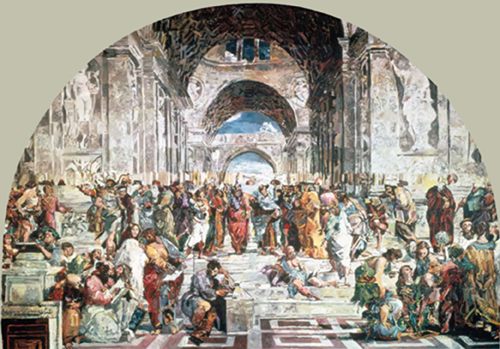   
Fig. 46 Malcolm Morley, *School of Athens*
(1972)

Raphael’s painting is a masterpiece of the Italian Renaissance, the
‘perfect embodiment of the classical spirit of the Renaissance’[^04-Chap4_12]
marking the dialectical relationship between Aristotle’s theories and
the ideas of Plato. Malcolm Morley’s painting is a reproduction of
photograph of Raphael’s painting; that second step is important – Morley
is copying a photograph rather than the actual painting – because it
highlights Morley’s career as a photorealist painter, his use of
technology in his specific technique of using projected grids of the
Raphael in the reproduction process, and the fact that Morley mistakenly
shifted the grids one space over thus creating a glitch in the
reproduction.

> Morley never makes corrections – once it’s done it stays done – and
> every bit leads to the next. “Even if a mistake gets made, I turn it
> into something positive. For example, I made a painting of Raphael’s
> ‘School of Athens’ and I got one grid in the wrong place. So for Plato
> and Aristotle the skull is over here and the rest of the head here; I
> said I lobotomised Greek philosophy. The wit comes from the
> unconscious. As somebody put it to me, you make friends with your
> unconscious life, as a collaborator.”[^04-Chap4_13]

It may be a simple point, but it bears repeating that Morley used a
glitch in his reproduction of a photograph of Raphael’s painting in an
almost teleological fashion, with the subsequent effects generating
specific aesthetic impacts. Given Morley’s artistic strategies in a
long, fascinating, and masterful but often unjustifiably overlooked
career, the fact that he’s embraced ‘mistakes’ as part of the creative
process falls in line with both modernist traditions and postmodern
assimilations and reconfigurations of modernism. At the same time, we
would argue that Morley’s passively embraced concession to the faults
produced by the margins of error connected to the technology is evidence
of the impact that the New Aesthetic will have in subsequent years.

In a similar fashion, certain recent examples of infographic art also
conceptually set the stage for New Aesthetic objects to have a genuine
artistic existence and function. In 2014 graphic design artists and
illustrators Tom Whalen and Kevin Tong held a joint exhibition at the
Phone Booth Gallery in Long Beach, California.[^04-Chap4_14] {Fig. 47}

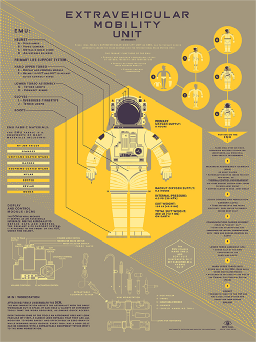   
Fig. 47 Tom Whalen and Kevin Tong, *Spacesuit* (2014)
 
The
content of the work ranged through a disparate set of subjects such as
leaf cutter ants, the P-51D Mustang fighter plane, Nikola Tesla and an
example of an extravehicular mobility unit or, simply, a spacesuit; the
consistent and organizing force of the exhibition was evidently the
utilization of broad stylistic similarities that hark back to utopian
flavored 1950s science fiction and a clear impetus to utilize the
aesthetic potential of infographic methodology. While producing visually
very interesting work, Whalen’s and Tong’s prints are nostalgically
indebted to an era in the history of graphic design in which high
modernism’s impulses to guide and correct social development were
themselves understood as fundamental design considerations, practices
and aesthetic strategies; Whalen cites Jan Tschichold, Saul Bass and
Milton Glaser as influences on his website[^04-Chap4_15], figures who
unquestionably strove to use graphic design in a transformative fashion.
A first response – or a second response, since the rich, lush colors and
bold layout of Whalen’s and Tong’s work are the first aspects of their
images that catch the viewer’s attention – is to think of these designs
as evidence of the continuation of postmodern impulses, particularly in
light of the evident, if consciously and effectively contrived,
nostalgia running through all of the design decisions; regardless of the
state of the debate about postmodernism’s definition and continuing
existence (if it ever existed at all), a general tendency is to identify
the apparent appropriations, quotations and evocations from an earlier
era in these works as an active but parenthetical engagement with
modernist longings. Still, there’s something different going on here,
fitting these works almost into a New Aesthetic status, and that’s the
use of infographics as a technology. Infographics is a well-established
means of representing complicated information; Charles Minard’s 1861
representation of Napoleon’s invasion of and retreat from Russia is one
of the most well known examples, and Otto Neurath’s development of the
Vienna Method in the 1920s and 1930s, Edward Tufte’s *The Visual Display
of Quantitative Information* (1983), and Peter Sullivan’s use of
infographics in the New York Times from the 1970s to the 1990s were
instrumental in establishing its viability and shifting its
conceptualization towards data visualization. Today, infographics and
data visualization have become so diverse and powerfully implemented
that we cannot fully discuss their impact here, but one aspect is
crucial: the assumption, often made uncritically, that the best
presentation of data is an aesthetic presentation. In some respects,
that may seem indisputable, in that it seems logical that aesthetic
visual content drives, for instance, best practices in the communication
of information in the context of social media, but at the same time
something else is going on. There’s a fine line between infographics and
data visualization, precisely because they are both methods presenting
data visually, converging towards the same goals, but in both cases
there’s an underlying assumption regarding the veracity of the data sets
and the effectiveness of the presentation methods; infographics and data
visualization put the viewer into the role of a passive consumer of
information, and even more insidiously puts the graphic designer into
the role of a passive accomplice. What makes Whalen’s and Tong’s work
intriguing in the context of this intertwined perspective on
infographics, data visualization and the New Aesthetic is their use of
visual nostalgia, which has two effects. First, it eases the
presentation and consumption of the information in such a way that the
effect becomes less about the actual information per se and more about
the process of learning. Second, the visual nostalgia facilitates a
historicized context of the data itself, as if the methods of presenting
establish a continuity of data, substantiating the methodology’s
manifestation much to the expense of the veracity of the data itself.
There is a striking conceptual similarity between the work of Otto
Neurath and Whalen’s and Tong’s images, despite the glaringly obvious
differences in appearance, in that the underlying methodology, the
encoded pathways of presentation that are prearranged similarly to
programmed instructions, are treated in a fashion that assumes a natural
form of appearance. We will return to two projects by Lev Manovich –
*Selfiecity* (2015) and *On Broadway* (2014-2016) – later in this
chapter to pick up on the pervasive presence of data, its relationship
to its own interpretative methodology and how these issues can
specifically emerge in artistic production.

If painterly glitches and infographics set the stage for a preliminary
consideration of New Aesthetic art, a consideration of artists who have
been producing digital art that uses software and hardware, programming
and data visualization with a clear aesthetic goal of producing art is
even more important. In 1965, Frieder Nake, A. Michael Noll and Georg
Nees may have been the first artists exhibiting drawings that were
entirely computer-generated in art galleries, and the similarity of
their work reveals not only shared working methods and concerns but also
the limitations of their aesthetic explorations. Georg Nees is a German
pioneer of computer and art and generative graphic, and was probably the
first artist to display art that was entirely dependent on digital
technology in Stuttgart, where he was educated and had been a student of
Max Bense, an important pioneer in the field of information aesthetics
and the integration of the humanities and natural sciences. Importantly,
Nees served as the scientific advisor for *SEMIOSIS*, an international
journal devoted to issues of semiotics, technology and aesthetics, whose
title is derived from Charles Sanders Peirce describing a process
(potentially artistic) that understands signs as self-referentially
operative. Nees’ work began at Siemens:

> In 1959, he began to program digital computers. In 1965, he procured
> for his department at Siemens a table-sized, punched tape-operated
> drawing automaton constructed by Konrad Zuse, the “Zuse-Graphomat”,
> which could move a descendible drawing pencil in two right-angled axes
> over a page of drawing paper. Nees recalls: “There it was, the great
> temptation for me, for once not to represent something technical with
> this machine but rather something ‘useless’ – geometrical
> patterns.”[^04-Chap4_16]

Nees’ work is innovative simply because of the new medium that he
started using, but equally so because it was simple in its visual
appearance. {Fig. 48} 

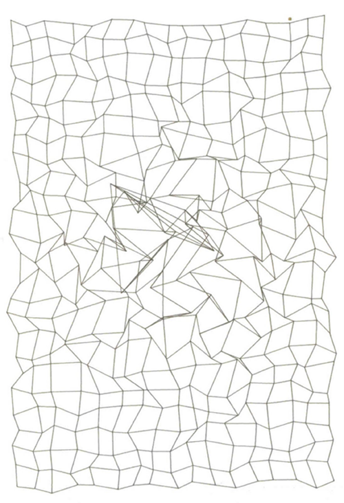   
Fig. 48 Georg Nees, Computer art
produced between 1965–1968

In part this is because of Nees’ development of
generative design, wherein a set of parameters would be provided to the
software and the image was created as the software controlled the
hardware, a process that in the early 21st century seems rather
primitive but in the 1960s would have been astonishing. What’s
interesting about generative design is that there are two different sets
of aesthetic choices an artist can make when using this method. First,
they can choose between providing predetermined values for the software
or randomly generated numbers, a choice that firmly places Nees’ ideas
in the same context as the types of decisions being made by Jasper Johns
and Robert Rauschenberg in the early years of their careers,
particularly when they were making art at Black Mountain College in
North Carolina when a predetermined and programmatic approach was
central to their experimentation deeply influenced by Marcel Duchamp, as
well as different aesthetic strategies employed by performance and
conceptual artists across the world in the 1960s. In this respect, Nees’
work bears a strong resemblance to Karl Otto Götz, a German artist whose
paintings were based on ‘“statistic-metric modulations” with grids
filled with black and white rectangles’.[^04-Chap4_17] Second, and much more
importantly for us, Nees’ generative design method sets into place an
aesthetic decision, evaluative and judgmental in nature, regarding the
output; given that the imagery was produced on a flatbed graphing
machine, which at the time had instructions provided by punch card and
which was primarily designed for scientific and military purposes, it is
without question that some images would be produced with unintended
effects, whether through error in the instructions, in the hardware’s
implementation of those instructions or simply in a lack of familiarity
with the flatbed drawing machine. It’s clear that Nees must have had to
choose to accept the possibilities and the limitations of his methods,
but it’s also clear that Nees didn’t think of the technology merely as a
tool that he could fully control. At the 1965 exhibition in Siemens, he
states:

> A number of artist-professors from the Stuttgart Staatliche Akademie
> der Bildenden Künste attended the opening. One of them asked Georg
> Nees whether he could make his computer (a program) to draw the same
> manner the artist was drawing (“Duktus”). Nees’ answer is a classic.
> After a short hesitation he replied: “Yes, of course, I can do this.
> Under one condition: you must tell me how you draw.” – In the ensuing
> irritation, Max Bense spontaneously coined the word “Artificial
> Art”.[^04-Chap4_18]

This has two implications: Nees is obviously recognizing that an
artist’s draughtsmanship could be reproduced through computer
technology, but Nees is also implying (or, perhaps, was prompted by
Bense) that the programming itself could be taught to draw, in the
active sense of the word, in a way that was more than just reproduction.
While acknowledging the practical limitations involved with the
technology, we also want to strongly disagree with the Victoria & Albert
Museum’s explanation for the limited content in Nees’ art:

> Many of the earliest practitioners programmed the computer themselves.
> At this time, there was no “user interface”, such as icons or a mouse,
> and little pre-existing software. By writing their own programs,
> artists and computer scientists were able to experiment more freely
> with the creative potential of the computer.
>
> Early output devices were also limited. One of the main sources of
> output in the 1960s was the plotter, a mechanical device that holds a
> pen or brush and is linked to a computer that controls its movements.
> The computer would guide the pen or brush across the drawing surface,
> or, alternatively, could move the paper underneath the pen, according
> to instructions given by the computer program.[^04-Chap4_19]

Writing about the computer ‘guiding’ the pen, brush or even the paper
betrays a subtle, almost unspoken notion that the process was entirely
controlled by the artist. To what extent this represents a high
modernist faith in an infinite set of capabilities of technology is
indeterminable, but that Nees at least seemed to agree with if not
advocate for the notion of an artificial art production is without
doubt.

A. Michael Noll is an American engineer and professor emeritus with the
University of Southern California who has been active in the development
of everything from security protocols to the invention of video
conferencing, a biography that would make him seem an unlikely candidate
to the second computer artist except for the fact that his was the
second exhibition of computer art, taking place in New York City just
two months after Nees’ exhibition (though he claims, with some evidence,
to have produced computer art as early as 1962).[^04-Chap4_20] Whereas Nees’ work
seems to have been focused on the potential of the hardware, Noll’s work
was always focused more narrowly on the aesthetic value of the output.
{Fig. 49} 

   
Fig. 49 Noll, A. Michael, *Vertical-
Horizontal Number 3* (1964)

Consisting of images whose visual appeal is based on
contrasting vertical and horizontal relationships or Gaussian-Quadratic
equations, Noll’s work is less random and more premeditated but still
bears all the hallmarks of an attitude exploring and finding value in
art that is distinctively digital in its appearances. Even more than
Nees, some of Noll’s art and his writings show a sense of faith in
technology as an equivalent source of aesthetic value; in 1964 Noll
produced a computer generated image that mimicked closely *Composition
with Lines* by Piet Mondrian which was preferred by viewers over the
actual paintings as well as mistakenly identified as a drawing by
Mondrian himself. This resulted in Noll’s paper ‘Human or Machine: A
Subjective Comparison of Piet Mondrian’s “Composition with Lines” and a
Computer-Generated Picture’[^04-Chap4_21] in which he described the methods used
to produce the image as well as the psychological experiment gauging the
responses of a hundred people, and in which he also asserted that the
‘randomness’ was determinative in the aesthetic response. In short,
despite claiming that ‘an indistinguishable pair could be achieved’,
there’s the implication that there’s something superior about the art
that is computer-generated.

Frieder Nake’s work is derived primarily from his research as a
mathematician; a work like *Hommage à Paul Klee 13/9/65 Nr.2* (1965)
{Fig. 50} displays concerns and influence similar to Noll’s interest in
Mondrian but at the same time it is far more conceptually assertive of
the distinct nature and independence of computer art in relation to its
inspiration. 

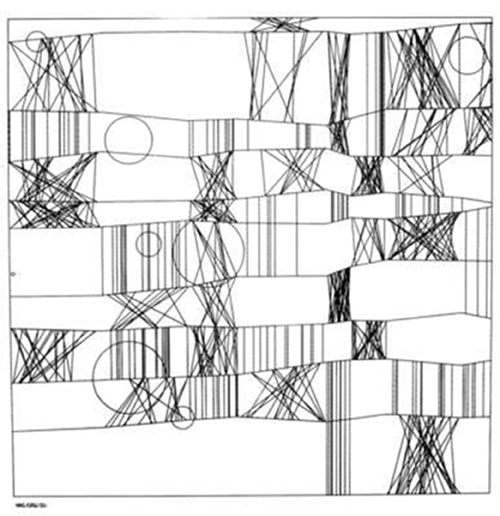   
Fig. 50 Frieder Nake, 13/9/65 Nr. 2
(*"Hommage à Paul Klee”*) (1965)

Continuing to add further levels of complexity to his work,
Nake has explored series of matrix multiplications as a means of
generating imagery, detailing in his book *Ästhetik als
Informationsverarbeitung* (1974) a belief in the inherent aesthetic
relationship between aesthetics and mathematics. Nake has also been
upfront about trying to find a shared communality amidst the explosion
of different art forms in the 1960s; ‘it seems to me what they share is,
starting with Marcel Duchamp, going beyond the confines of traditional
art. Each one of these movements in some other way denied art as it was
known’[^04-Chap4_22] even if he stopped making art in the 1970s after writing an
article titled ‘There Should Be No Computer-Art’[^04-Chap4_23] for *Page*, the
bulletin of the Computer Arts Society, and later accusing other computer
artists of being technocratic Dadaists. Such a position places Nake
firmly in the realm of the art world, unlike Nees and Noll who seem to
have been engineers and programmers first and artists second. His exit
from making computer art indicates even further an awareness of the
increasingly pervasive nature of the digital realm into artistic
practice; Nake, like Nees and Noll, had accepted a research position to
use computing devices that were also booked by military and corporate
entities, at a time when computing power was expensive and access was
limited, and he had decided that it was immoral to participate in a
method of art production that paralleled these entities’ destruction of
society. The editors of Wikipedia have summarized Nake’s position
nicely:

> The involvement of computer technology in the Vietnam War and in
> massive attempts by capital to automate productive processes and,
> thereby, generate unemployment, should not allow artists to close
> their eyes and become silent servants of the ruling classes by
> reconciling high technology with the masses of the poor and
> suppressed.[^04-Chap4_24]

Other artists have pioneered computer art in ways that set the stage for
New Aesthetic objects. Hiroshi Kawano, who may have been the first
programmer to produce computer art in 1964 (though not exhibited, and
unrecognized perhaps because he wrote about his work in Japanese)
studied aesthetics at the University of Tokyo and later taught it at the
Metropolitan College of Air Technology. His first forays into computer
art varied in output – lyrics, music, sculpture and two-dimensional
visual art – but influenced by Max Bense’s *Programmierung des Schönen*
(1960) he began focusing on the use of algorithms, cybernetics and
artificial intelligence to develop a position that sought increasing
degrees of autonomy in computer art production. {Fig. 51} 

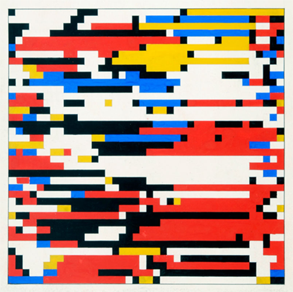   
Fig. 51 Hiroshi Kawano, *Design 3-1*, Color
Markov Chain Pattern, 1964

While the
result of this is that Kawano’s work often looked more like facsimiles
of Mondrian’s paintings than original work, nevertheless there was an
effort to work within the limitations (for the time) of digital creative
processes. For Kawano ‘a computer artist should be a programmer who can
teach his computer to produce works of art by itself, and furthermore
know about the digital computing behavior of his computer in detail. It
is never a computer artist, but a computer itself that produces works of
art; a computer artist only helps his computer acting as a
programmer.’[^04-Chap4_25] Clearly, for Kawano, the human imagination was still
of primary importance as an originating point, but how long could this
last when his programmatic abstraction would, inevitably, be susceptible
to the internal consistency of the programming?

Jean-Pierre Hébert is our final important figure from these early years.
Born in France, and exposed to art at an early age when summering in
Vence, Provence where he was given access to the Galerie Alphonse
Chave’s collection as well as seeing work there by Matisse, Chagall,
Picasso, Man Ray, Léger and many others, Hébert started programming in
Fortran in 1959 and worked on some of the first Hewlett-Packard lab
computers in the 1970s but he maintained an interest in producing
art.[^04-Chap4_26] Moving to California, Hébert became the founder of the
Algorists, a loose association of computer artists and pioneered the use
of code to produce images in a range of materials beyond paper such as
sand, water and as installations that would be proofed by algorithms. He
explains: ‘The principle behind my work has always been pretty simple
\[…\] It consists of putting together a process that creates
instructions for a tool. It’s all computer-driven motion of a tool on a
surface.’[^04-Chap4_27] {Fig. 52} 

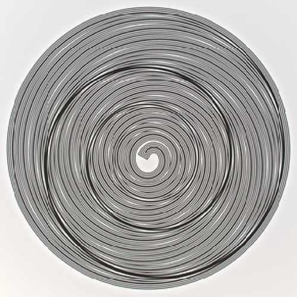   
Fig. 52 Jean-Pierre Hébert, computer art, 1970s

What’s especially interesting from our
perspective, is Hébert’s emphasis on drawing: ‘I draw because I love to
draw and always had a passion for drawings \[…\] the seventies, I have
been working with the conviction that to gain power and beauty, drawing
should become a pure mental activity, rather than a mere gestural skill.
I have endeavored to make it so by banning the physical side of
drawing.’[^04-Chap4_28] In essence, Hébert is advocating a rational approach to
drawing, a notion that algorithms in and of themselves are sufficiently
aesthetically valid, especially if they function as mediators between
natural origins and natural output as evidenced in his recent use of
spirals as prevalent and, seemingly, independently and universally
artistic;[^04-Chap4_29] while Hébert may not be pushing for the eventual complete
expulsion of the physical artist, what he has established is that
programming is potentially sufficient at a fundamental level at the cost
of drawing as a practice based on direct observation or free
association.

Where we’ve ended up is with a group of artists who’ve embraced the use
of digital technology but haven’t called it into question, with the
exception of Nake, or have utilized it so seamlessly that its presence
is subsumed under the primary medium or disregarded in favor of digital
output. Over the course of the last fifty years digital art has become
increasingly sophisticated but the digital as a medium hasn’t gone
through the same reflective evaluation the other mediums have over the
course of modernism. There have been a few exceptions. Artists such as
Vera Molnár, one of the founders of the Groupe de Recherche d’Art
Visuel (GRAV) in 1961, advocated a computational approach based on
Victor Vasarely’s notion that the individual artist was outdated. Claude
Shannon, Ken Knowlton, Leon Harmon, Lillian Schwartz, Charles Csuri, A.
Michael Noll, Edward Zajec, Desmond Paul Henry, Billy Klüver, Paul
Brown, Kenneth Snelson, Joseph Nechvatal and James Faure Walker have all
taken leading roles in pushing what could be done (often out of Bell
Labs, when Klüver and Rauschenberg created E.A.T. (Experiments in Art)
in 1967). {Fig 53} 

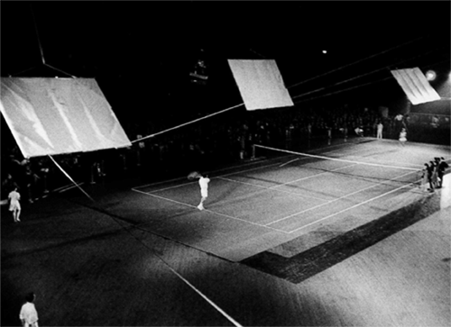   
Fig. 53 Robert Rauschenberg, Open Score
(1966), with Frank Stella and Mimi
Kanarek, performance at the E.A.T.
(Experiments in Art and Technology)
forum, Bell Laboratories, Murray Hill, NJ

The increasingly dominant presence of the digital,
however, has started to become naturalized. Along with the digital means
of reproducing the appearances of traditional art forms, which has been
continually accelerating to the point that handcrafted objects are, in
some instances, seen as almost a rebellion against the use of digital
technology, digital art has become accepted as normal or equivalent to
other art forms. At the same time, as a number of artists have taken
digital tools in a different direction, shouldn’t we be questioning the
digital’s pervasive presence while at the same time refusing to eschew
their usefulness? Frieder Nake’s position is once again illuminating
here, particularly his position that

> it was not before the first exhibitions of computer produced pictures
> were held (1965) that a greater public took notice of this threat, as
> some said, – progress, as others thought. The threat and the progress
> being the use of an extremely complicated, sophisticated, expensive
> and rational machine in the arts, i.e. in one of the last refuges of
> the irrational.[^04-Chap4_30]

A representative set of these artists were included in the exhibition
*Painting After Technology* at the Tate Modern in London in 2015, among
them Christopher Wool, Albert Oehlens and Laura Owens.[^04-Chap4_31] The
exhibition takes as its starting point a brief view into the effect of
technology on the practice of painting, with the central premise that
‘rather than simply celebrating such technologies, however, the artists
in this room are often interested in the errors, glitches and
misregistrations that can result from them.’[^04-Chap4_32] Wool’s *Untitled*
(2009) is representative of his use of computer technology. Working with
digital photographs of his own paintings, Wool rearranges them and then
silkscreens the imagery onto the paper that is then fixed onto canvas.
Oehlens’ *Loa* (2007) {Fig. 54} quotes phrases and lyrics from Scooter,
a German techno band, and is a good example of his own description of
his practice as ‘post-non-representational’.

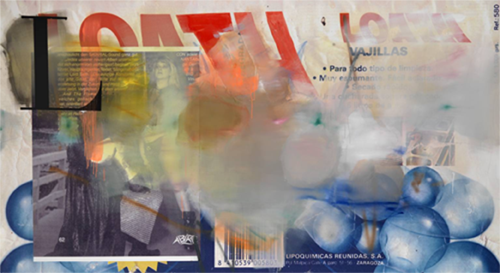   
Fig. 54 Albert Oehlen, *Loa* (2007)
 
Owens’ *Untitled* (2012)
{Fig. 55} is part of her series ‘Pavement Karaoke’, a set of seven
‘paintings’ first created in Photoshop and then projected onto the
canvas in a manner similar to the Photorealists but with a continual
sense of deconstructing the very process of image making. 

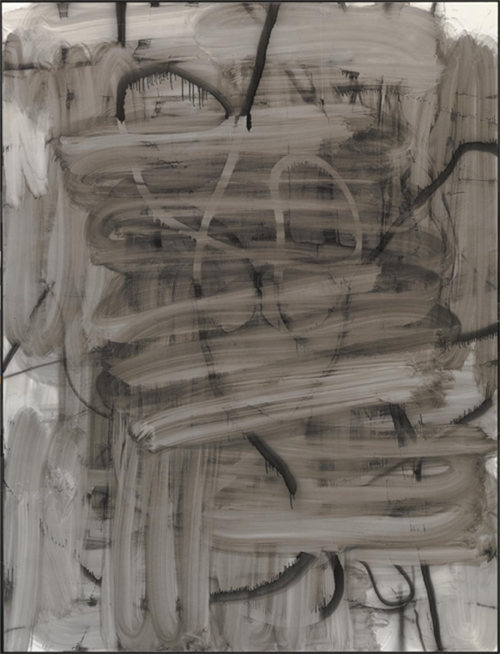   
Fig. 55 Albert Oehlen, *Loa* (2007)

Described by
curator Mark Godfrey as a ‘selection of work \[reflecting\] one of the
urgent conversations around painting today’[^04-Chap4_33] the exhibition
certainly had a sense of urgency about it, albeit a laconic one, that
suggested that the intersection between traditional media and digital
technology is increasingly becoming an uneasy place. In many respects
Godfrey’s curatorial choices, equally reflected in his Artforum article
‘Statements of Intent’[^04-Chap4_34] that serves as an external curatorial
statement for the Tate exhibition, complicates the matter further with
its emphasis on abstract art. The artists included in the exhibition and
discussed in the article are presented as clearly negotiating a position
between the inherent value of pure formal elements in abstraction,
vis-à-vis Abstract Expressionism, and the facility that digital
technology brings in the production of images; quite simply, it’s almost
as if the contemporary shift to abstraction is a regressive, if also
revealing, effort against the seduction of technology itself, with these
artists trading one set of autonomous aesthetic values for another. We
would argue, however, that the autonomy of digital art production is
more seductive and stubborn and that regressive strategies have limited
efficacy.

## Almost, but not Quite, New Aesthetic Artists and Artworks

Right from the beginning, let us be clear that this second section isn’t
about artists who have tried to be New Aesthetic artists and failed.
Nothing further could be from our minds, as every one of the artists we
will subsequently discuss are ones whose work we admire and appreciate,
that we’ve shared with each other through text messaging links and on
social media in our efforts to understand these new forms and phenomena
as a cultural shift and metaphysical paradigm, and that has given us
many an occasion to think about what the New Aesthetic is as both an
attitude and a strategy. Rather, each of the artists discussed in this
section have been producing work that feels like a New Aesthetic object,
which exhibits many of the characteristics of these digital forms, but
in the final analysis their artistic output is not sufficient to be
considered as actual objects and are, at best, products. This isn’t a
failure of the art (far from it) but the implementation of a criterion
that involves a multiplicity of necessary elements. In some respects the
work of these artists has been setting the stage, with increasing
potential, for New Aesthetic art to fully emerge, and for that reason
we’ve dealt with these artists in a progressive fashion, with their work
getting closer and closer to a New Aesthetic object status. What follows
is a presentation of artists whose work is unquestionably worth extended
and serious consideration as a valuable or crucial layer in our
concentric exploration towards our target.

Kohei Nawa[^04-Chap4_35] is a professor at Kyoto University of Art and Design,
and has been producing fascinating works that are manipulations of the
intersection of material and digital means. Nawa’s first appearance in a
specific New Aesthetic context emerged out of his association with the
*Sandwich* space in Kyoto.[^04-Chap4_36] *Polygon Double Deer \#2* (2011)[^04-Chap4_37]
{Fig. 56} is a work that obviously draws on the growing translation of
real world objects into polygonal forms for game design and digital
simulations and was featured on Bridle’s blog, but other works by Nawa
are even more fascinating and breath-taking. 

   
Fig. 56 Kohei Nawa, *Polygon-Double-
Deer #2* (2011)

For example, works in his
*Pixcell* (2009-2011) series and his *Liquid* (2007-2011) pieces utilize
a range of chemical and physical effects to simulate the digital in
fascinating ways; his *Trans* (2012-13) work applies surface
manipulation techniques to 3D scanned models, resulting in fluid and
otherworldly figurative apparitions; and *Biota* (2013) and *Manifold*
(2013) {Fig. 57} are massive representations in sculptural form of
simulations of evolution, mysticism and gravity. 

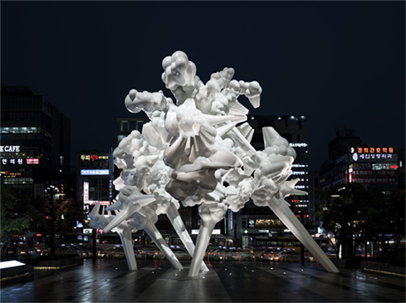   
Fig. 57 Kohei Nawa, *Manifold* (2013)

This primacy of the
simulation is important because of the inherently seductive nature of
simulations; what Nawa’s work does is set up the apparent integration of
data across sensuous and embodied forms which are seemingly evolving as
an opportunity for aesthetic appreciation but at the same time
confounding the viewer’s ability to make a free aesthetic judgment
through their coherence as an environmental system. To put it another
way, it’s just as much the nature of the systems that Nawa employs that
direct the aesthetic experience as are the artistic choices, and it’s
the system itself that begins to become aesthetically self-sustaining
through Nawa’s aesthetic strategies.

Matthew Plummer-Fernandez[^04-Chap4_38] is a British-Columbian artist who has
also been mentioned in the context of the New Aesthetic. Like some of
Nawa’s work, Plummer-Fernandez has been borrowing digital techniques to
respond to conditions of the world, particularly the artificiality of
the conditions of our experience of the world. One of his most
well-known artworks *is* *sekuMoi Mecy* (2012), {Fig. 58} a 3D modeling
of the shape of the iconic Mickey Mouse (the title is an anagram) that
has been deconstructed randomly so that it has returned to being a
digital model merely recollecting its original form. *sekuMoi Mecy*, as
a result of the custom software Plummer-Fernandez has created for 3D
printers, has been described as a liberator for future work entangled
with the complexities of intellectual property law. 

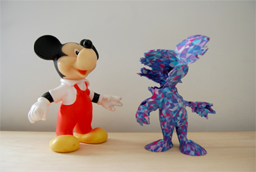   
Fig. 58 Matthew Plummer-Fernandez,
*sekuMoi Mecy No. 2* (2012)

Stephen Fortune
writes:

> Matthew Plummer Fernandez holds the honour of firing the first shot at
> those who would seek to control what files can and can’t be shared.
> His free software, Disarming Corruptor, is what he terms
> “circumvention software”. It scrambles a 3D printed file, encrypting
> it in such a way that the user will be greeted with a glitched-out
> visual treat if it is loaded into any 3D editing software. If you’ve
> got the decryption keys, you get to see the object’s true form. It’s
> hiding in plain sight, thumbing its pixel-bled nose at the Mary
> Whitehouses of physible culture.[^04-Chap4_39]

More than just an engagement with a character, this work tears into the
notion of intellectual property, copyright and trademark law, suggesting
an alignment with the growing perspective that outdated legal structures
are broken in the digital age. Plummer-Fernandez notes:

> The Disney Corporation fascinates me for paradoxically pioneering
> remix culture by creating their own versions of public domain
> characters such as Snow White and Cinderella, and yet the company take
> a hostile approach against any attempts to copy their own creations.
> In 1976 Disney and others sued Sony for developing the betamax video
> tape recorder for being a device that could be used for copyright
> infringement. Mickey has been trademarked as well as copyrighted to
> ensure it will never have the freedoms of a public domain character,
> and the corporation have strongly lobbied and secured the Copyright
> Term Extension Act (known as the Mickey Mouse Protection Act). A
> Disney insider also revealed that the design of Mickey is constantly
> updated (such as the disappearance of the tail) to continually reset
> the copyright timer.[^04-Chap4_40]

Plummer-Fernandez’s point is an intriguing one – by noting that there’s
a history or an evolution to the form of Mickey Mouse that
‘necessitates’ new intellectual and trademark filings Plummer-Fernandez
is elucidating an almost biological set of flowing relations between an
outdated legal structure and its mismatched digital encompassment – at
the same time the reciprocal, dialectical relationships between legal
concepts and digital formatting doesn’t quite achieve New Aesthetic
object status but remains a product in its incorporation of various
digital transformations of the original subject matter. This is glitch
art, and even more so this is glitch with a serious purpose, but it’s
not quite New Aesthetic art per se.

The shift towards a heightened awareness of the presence of the digital
is clear in the work of both Nawa and Plummer-Fernandez, but there have
been many other artists who have brought out this characteristic of
their work and made it a defining part of their stylistic strategies. In
line with this, Bridle noted in his 2012 presentation at SWSX that:

> One of the core themes of the New Aesthetic has been our collaboration
> with technology, whether that’s bots, digital cameras or satellites
> (and whether that collaboration is conscious or unconscious), and a
> useful visual shorthand for that collaboration has been glitchy and
> pixelated imagery, a way of seeing that seems to reveal a blurring
> between “the real” and “the digital”, the physical and the virtual,
> the human and the machine. It should also be clear that this “look” is
> a metaphor for understanding and communicating the experience of a
> world in which the New Aesthetic is increasingly pervasive.[^04-Chap4_41]

As interesting as this was, we find it problematic, excusably so in the
context of the early history of the New Aesthetic but still problematic
especially when it comes to New Aesthetic art. Bridle is suggesting a
few specific things. First, New Aesthetic objects are collaborations
with technology; what Bridle means by this is that designers work with
the underlying structure of digital tools and methods of analysis as
partners, whether consciously or not. Given the propensity of many of
the objects we’ve presented so far, it’s clear that the digital is far
less collaborative than wished for. Second, Bridle is suggesting that
glitchy and pixelated imagery is collaborative while also being a means
of productively denoting a blurred distinction between the real and the
digital, an experiential breakdown between the two; what’s become
increasingly clear is that a complete different process has taken place,
whereby the digital assumes the nature of the real rather than being
situated in a liminal relationship with the real. Third, Bridle suggests
that New Aesthetic objects conform to a ‘look’, apparently meaning that
they are simply pixelated and blocky in appearance, like something out
of Minecraft; in some cases, this is correct, but Bridle’s other notion
of the New Aesthetic as an attitude is even more accurate, in that a
style is often insufficient to determine the New Aesthetic nature of an
object, particularly an artwork. A number of specific examples
illustrate the point we’re trying to make.

The work of Ferruccio Laviani,[^04-Chap4_42] specifically his cabinet *Good
Vibrations* (2013),[^04-Chap4_43] {Fig. 59} has become a rather famous example of
work that stylistically similar to what one might anticipate New
Aesthetic objects would appear like, showing up in many print
publications and exhibitions over the last few years, being a
fascinating example of craft at the highest level. 

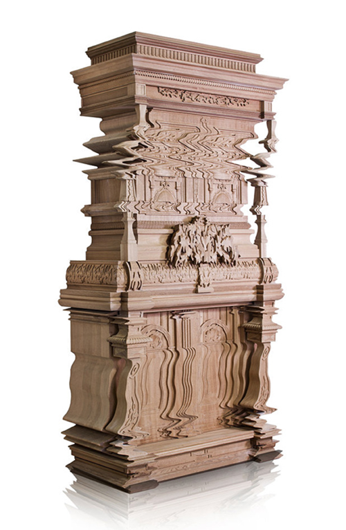   
Fig. 59 Feruccio Laviani, *Good Vibrations*
(2012)

At first glance, as
every writer notes, it looks like a distorted photograph, an example of
a glitch. It’s only after you recognize that it’s been made to look that
way that its artistry really becomes strikingly evident. At a
superficial level it seems to be a perfect representation of the New
Aesthetic, but we’re inclined to differ with that response at a more
critical level; in many ways, perhaps it’s one of the best examples
representing Bridle’s theories of New Aesthetic art at a stylistic
level, in the way that we’ve described as product, but its inadequacies
as a digital artifact (not, we would clarify, its superlative nature as
a physical object) or as an example of an autonomous digital process
precludes it from being an example the New Aesthetic. Designed for the
Italian company Boffi, it’s appearance as a distorted object is merely a
simulation of glitch distortions, purposively imitating an apparent
breakdown of the object’s integrity, but it’s also a crafted object with
the effect that its use value, its practicality, quickly disables the
continuation of an appreciation of or interaction with its digital
origins. Many pieces by Laviani are amazingly clever, and *Good
Vibrations* is a virtuosic masterpiece of woodcarving, craft and design,
but its glitchiness is only imitative rather than an engaged response to
the digital presence.

This sense of finding a space between the real and the digital is
present in an equally interesting fashion in the work of Matthieu
Tremblin,[^04-Chap4_44] a French street artist. Seemingly borrowing certain
artistic strategies from a tradition of artists going back to Kurt
Schwitters coupled with an acute sense of the functionality of the urban
environment, Tremblin’s work can best be described as urban
interventions. *Rainwater Popsicles* (2014) uses discarded popsicle
sticks and collected rainwater in a lyrical fashion to return the
pleasure back to the environment; *Sourires Volés (Stolen Smiles)*
(2014) consists of smiles removed from ubiquitous political posters
redisplayed in a more congenial fashion; *Copying Van Gogh* (2013) and
*Hakim* (2015) are re-appropriations of found graffiti tags that
simultaneously question and assert the authenticity of street art. For
our purposes, however, Tremblin’s most important work is *Watermark*
(2013).[^04-Chap4_45] {Fig. 60} 

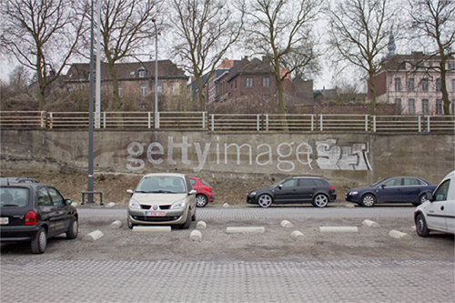   
Fig. 60 Mathieu Tremblin, *Watermark* (2013)

An initial observation sees the image appearing
as a watermarked digital photograph, similar in style to that found in
the Getty Images library, but further investigations reveals that the
watermark is carefully spray-painted onto the wall of the car park.
Tremblin has noted that most of his interventions have had an almost
curious banal quality to them, as if any ordinary citizen could have
arranged the objects involved in a way that wouldn’t be art at all, but
*Watermark* is obviously something different; the image on Tremblin’s
website, the appearance of the graffiti in the photograph, all speak to
a carefully planned execution that exemplifies what Tremblin refers to
as ‘a certain dynamic using photography, graffiti and site-specific
installation to end up with this attitude where we’re making forms of
art in symbiosis with the context of its creation or diffusion, turning
everyday life spaces in experimental art spaces’.[^04-Chap4_46] Almost every
artwork by Tremblin can be understood within the context of this
statement, but *Watermark* is something more; as Tremblin noted, the
work came out of his criticism of the city of Mons’ attempt to control
its imagery in anticipation of its designation as a ‘European Capital of
Culture’ in 2015, which Tremblin saw as being contrary to the
representation of the identities of its ordinary citizens. The sense
that this is close to the New Aesthetic lies readily in this last point:
Tremblin’s work not only highlights the growing usurpation and economic
colonization of the public sphere (and literally of public spaces)
through increasingly draconian interpretations and applications of
copyright and intellectual property laws, in the confusion generated by
the seeming dichotomy of its appearance there’s a clear sense that the
primary means of such encroachment into the lives of ordinary human
beings is not only facilitated by the digital but driven by the digital.
Therein lies the even greater impact of *Watermark*: Plato’s artist,
imitating the world and thereby making art simply by holding up a mirror
to everything around him or her, doesn’t just imitate the world but ends
up owning the images and, thereby, owning the world; the lyrically
horrifying effect of *Watermark* is rooted in a heightened awareness
that the digital presence visible here, in an almost ghostly fashion, is
a means of taking possession of the world in the same fashion in a way
normally unseen but still, as an unseen watermark, very much present in
its representation. In effect, everything that can be digitally
photographed is now owned by the possibility of those photographs being
digitally watermarked by Getty Images.

In contrast to the fascinating work above – fascinatingly contrasting
precisely because of its radical sense of reversion to traditional
craft, rather than usurpation of craft into the digital – one of the
most interesting artists that is a part of this setting of the stage for
New Aesthetic art is Faig Ahmed. Coming from Azerbaijan, Ahmed’s
education in the Azerbaijan State Academy of Fine Art in Baku exposed
him not only to contemporary means of artistic production but also to
the rich tradition of Azeri art, most importantly the long history of
intricate rugs and other forms of fiber art. Ahmed’s work is a result of
the relationship between the past, in a deeply rooted traditional sense
that he notes as extending back to the ‘beginning of times’, and the
present as an opportunity for poignant fractures and
reconfigurations.[^04-Chap4_47] Looking at Ahmed’s work it’s immediately obvious
why it’s relevant here: with work like *Ledge* (2011), *Oiling* (2012),
*Liquid* (2014) and, especially, *Tradition in Pixel* (2010), {Fig. 61}
the fields of liminality he explores between traditional carpet design
and digital effects and patterns are evidently experimental ventures
broaching normally opposing forms of art practices. 

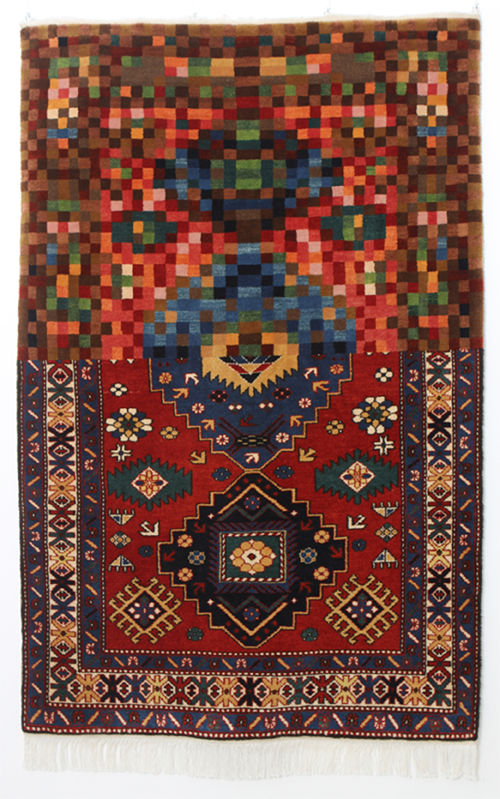   
Fig. 61 Faig Ahmed, *Tradition in Pixel*
(2010)

Much of Ahmed’s
carpets are woven in a traditional fashion, but the alterations that
make them appear as if they were expanded through a digital loupe in a
digital photo library organizer, manipulated into a design that looks
like it’s been smeared in an image editor on an iPad, expanded and
strained to create an object almost sublime in its deconstruction of the
traditional carpet format and transformed by reducing sections of the
carpets into pixelated fields colors, all speak to the necessity of
Ahmed’s artistic practices being situated at the intersection of craft
and technology. In many respects, Flusser’s ideas are appropriate as a
guide when thinking about Ahmed’s wonderful art, in that it’s clear that
technological innovations are driving these crafted manifestations, and
Ahmed’s own statements back this up:

> I explore ancient traditions, cults and cultures, I make my own
> research and as I communicate with it, I create art. My carpets,
> installations and embroideries are the result of this interplay. It is
> fascinating to observe the process of such an easy transformation of
> such ancient and stable objects.[^04-Chap4_48]

It is Ahmed’s assertion of the ease of the transformation that’s just as
intriguing as the objects themselves. Why is it easy? Not just because
of the evident mark of the digital tools that Ahmed is using in the
design of his art but also in their appearance as pixelated rather than
pixelized. Pixelated is usually understood as the unwanted appearance of
pixels, often betraying the digital nature of the image, while pixelized
is the intentional use of pixels to obscure details of the image.
*Tradition in Pixel* operates in both processes in a powerful way. Ahmed
writes:

> The carpet is a symbol of invincible tradition of the East, it’s a
> visualization of an undestroyable icon. In my art I see the culture
> differently. This is more of expectation of a reaction because it’s
> exactly the change of the points of view that changes the world.
> Slight changes in the form of a carpet dramatically change it’s
> structure and maybe make it more suitable for the modern life. The
> Eastern culture is very rich visually. I cover it all in minimalistic
> forms, destroying the stereotypes of the tradition and creating new
> modern boundaries. A man can widen the borders and change them but no
> one has ever dare to break our spirit.[^04-Chap4_49]

Understanding the carpet as a symbol of invincible tradition, Ahmed’s
pixelating reinforces its digital transformation as an alteration,
forcing a reconsideration of the original source tradition, while at the
same time the pixelization of the work conceptually censors the rigid
effect of tradition as a stereotype in a refusal to avoid the modern.
What makes Ahmed’s work so interesting is the dialectical interplay
between a determinative and reflective position, sourced in the
intractable foundations of the history of Azeri carpets and the equally
unavoidable transformative power of the digitalization of the world. The
influence of the New Aesthetic is clearly affecting the work; the pixels
are not slight changes that set into motion the recollection of
tradition but activated elements redefining the invincibility of
tradition.

The appearance of a glitch aesthetic does not necessarily indicate the
use of the New Aesthetic in an artist’s work but certainly represents an
attitude or an awareness of the significant shift at an almost epistemic
level. One of the best examples of this is the use of glitch effects in
the photography of Sabato Visconti, a Brazilian born artist trained and
working in the United States. According to Visconti’s website it was a
defective memory card that prompted his experimentation with glitch
photography in 2011.[^04-Chap4_50] Visconti’s art puts him at the forefront of
glitch photography; using deliberately executed errors which Visconti
refers to as ‘breaking the image’, he tries to strike a balance between
a complete collapse of the image into digital errors and
incomprehensible artifacts and straight photography, ‘trying to find
this really fine balance where something doesn’t break fully, but breaks
just to the point that you can see it breaking’.[^04-Chap4_51] {Fig. 62}

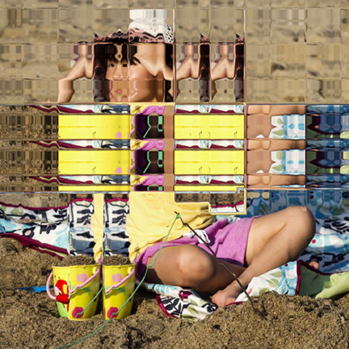   
Fig. 62 Sabato Visconti, *Peeper (11th
Iteration)* (2014), from the *Little Monsters*
series

More
than just nostalgia for 8-bit graphics, Visconti’s art clearly takes the
glitch as a starting point for manipulating the image almost to the
point of surrealism, a connection that is evident in the control that he
tries to maintain over the final product. In fact, it’s clear that there
is a thread of art historical referentiality, particularly with certain
images that show a strong influence from other artists like René
Magritte[^04-Chap4_52] and André Kertész, even if art history permeates only at
the most superficial level. {Fig. 63} 

   
Fig. 63 Sabato Visconti, *Untitled* (2011),
from the *Images Adrift* series

For Visconti, an awareness of the
code that drives image manipulation programs is what sets his
parameters.

> You get an idea more or less of what you’re going to get, but you
> can’t really predict it. And that’s part of the charm  –  you don’t
> have control over what you’re doing, you kind of rely on the machine
> \[…\] If I wanted to do a lot of squares and fractal squares I’ll
> probably want to do a ‘cash smash’ glitch, because those tend to
> produce squares. If you want to have a kind of wavy distortion that’s
> almost like a super warped-out VHS effect, you’re going to want to use
> an audio program for that \[…\] It’s definitely more satisfying
> sometimes when you get down and dirty with the code and kind of just
> finesse something out.[^04-Chap4_53]

The balance that Visconti is trying to strike here is clearly twofold:
on the one hand his efforts are directed towards producing an image that
is aesthetically interesting, with a sufficient level of recognizable
references to fix a viewer’s focus, while on the other hand there’s also
an effort to encode the visuality of the image precisely to reveal its
digital origins through the manipulation, both controlled and
uncontrolled, of its appearance.

Visconti’s work, however, isn’t fully New Aesthetic art. Reading through
various interviews and articles about his photographs, it becomes clear
that his process is a combination of deliberate utilization of various
image manipulation tools coupled with a limited degree of randomness,
all the while primarily driven by an expressionist and symbolic intent.
What’s amazing about Visconti work is the variety of techniques he uses:

> In the last few years, Visconti has created static-filled images by
> editing a photo with audio equipment. He’s opened raw files through
> WordPad and saved them so the encoding would produce strange
> characters in the final image. He’s embraced cachemashing, and
> distorted photos by converting them to vectors then databending the
> file. The point being: There are plenty of ways to glitch a
> photo.[^04-Chap4_54]

At the same time, what brings Visconti’s work back into the realm of
normal art production is the virtuosity with which he uses the digital
tools he’s familiarized himself with most. In the end, the result is
that ‘glitch photography transcends the idea of simply altering
something and becomes a medium in its own right, replete with a digital
toolbox of tricks and best practices’.[^04-Chap4_55] Clearly there’s a concern on
Visconti’s part to produce the best possible image, the most successful
example of art, and to that end he’s quite upfront about continuing to
have control over the final images.

> I’m not sure if focusing on unpredictability is the most meaningful
> way to critically engage with glitch art. I think it feeds this
> misconception that glitch artists simply stumble on these happy
> accidents without any thought or effort. Creating glitch art can be as
> labor intensive as any other art form. Glitching is the careful
> simulation of malfunction. It’s an absurd scheme that requires some
> finesse, because some glitches will break a file beyond recognition
> and other glitches will have no effect at all.[^04-Chap4_56]

Visconti uses Pixel-Drifter,[^04-Chap4_57] a program written by Dmitriy
Krotevich, in much of his work. Pixel-Drifter works by taking the
‘power’ of each pixel, gauged by its luminosity and screen position, and
putting it into conflict with its neighboring pixels in parameters set
into place by the user. As much as we like Visconti’s art, this need to
control the final outcome, to successfully wrestle with the algorithms,
and to labor in a productive and ordered fashion towards an intended
final product indicates that Visconti’s work is only related to the New
Aesthetic. As noted by Margaret Rhodes:

> In the beginning, glitch art was the appreciation of how software
> hiccups can distort an image. Depending on who you asked, glitch art
> only qualified as glitch art if the aesthetic cracks happened by
> accident. Then the medium evolved, and some digital artists began to
> force those errors by editing code and manipulating pixels.[^04-Chap4_58]

It is here that we draw a distinction between art informed by the New
Aesthetic as product and actual New Aesthetic art objects as artistic
embodiments.

Antoine Geiger’s work is also heavily dependent on the aesthetic
strategy that image manipulation revealing the digital origins of the
work transforms our perception of the work itself but also effects
reconfigured social awareness. With a quote from Walter Benjamin’s 1935
essay ‘The Work of Art in the Age of Mechanical Reproduction’, Geiger’s
series of manipulated photographs *Sur-Fake* (2015) seems to be a
flag-bearer for the impending apocalypse. {Fig. 64} 

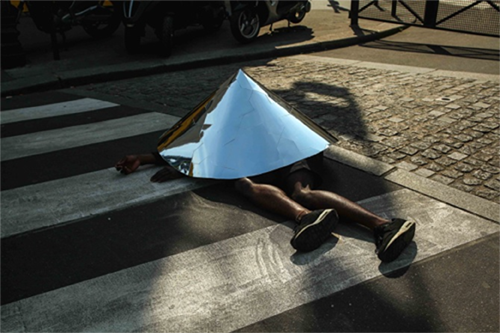   
Fig. 64 Antoine Geiger, from the *Sur-Face*
project (2014)

Benjamin’s words –
‘Mankind, which in Homer’s time was an object of contemplation for the
Olympian gods, is now one for itself. Its self-alienation has reached
such a degree that it can experience its own destruction as aesthetic
pleasure of the first order’ – bear out in Geiger’s images of people
willingly sucked into the screens of their smartphone. {Fig. 65} 

   
Fig. 65 Antoine Geiger, from the *Sur-Fake*
project (2014)

Geiger
notes about the project that it’s a continuation of *Sur-Face* (2014),
wherein his images of people with their head covered by mirrors evoked a
need for privacy in our ever-present state of facial recognition, but
what makes *Sur-Fake* even more interesting is the apparent willingness
of the participants to relinquish their identities to their
technological mediators.[^04-Chap4_59] Geiger writes: ‘What interests me in this
texture of sucked faces, is that the over-exposure gradually allows a
very organic dimension, as well as digital, to render something quite
disturbing.’[^04-Chap4_60]

Ralf Brueck’s work bears some resemblance to that of Geiger, but there
are crucial differences that only come out through a closer inspection.
A German artist, Brueck trained at the Kunstakademie Düsseldorf and
belongs to what has been sometimes referred to as the Düsseldorf School
of Photography, a group of artists that includes Andreas Gursky, Candida
Höfer, Thomas Ruff and Thomas Struth. These artists not only share
similar backgrounds, influences and educations but their work often
necessitates an increased sense of participation of the viewer to
acknowledge their complicit role in creating a completed aesthetic
experience. While the other photographers, particularly Gursky, use
digital tools, Brueck includes the presence of the digital to such an
extent that it overwhelms the presence of his subjects in his
compositions. In 2011 Brueck started his *Distortion* series, a set of
photographs whose subjects, ranging from the interior of Gothic
cathedrals and urban landscapes to highways and desert vistas, are
heavily manipulated through the extraction of tonal elements in order to
enhance the presentation of their digital origins by premeditated
manipulations; images such as *Golden Cage* (2011) and *Twin Peaks*
(2011) {Fig. 66} contain sufficiently recognizable details with specific
aspects drawn out to set a dynamic visual contrast that redirects the
viewer back to the production and manipulation or editing methods. 

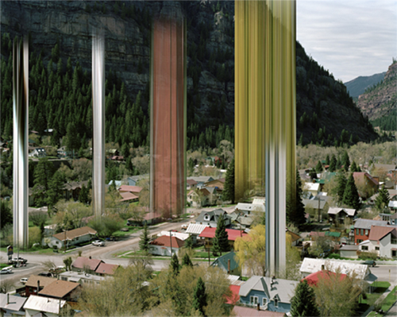   
Fig. 66 Ralf Brueck, *Twin Peaks* (2011)

Often
noted as appearing to be bar codes, the work of the *Distortion* series
perhaps looks more like extensions of DNA testing markers, which is more
in line with some of Brueck’s statements attesting to his consistent
interest in the fundamental elements of the photographic medium. By
2015, with his *Dekonstruktion* (2015) series, the level of recognizable
elements has been dramatically curtailed, so that images like *Home
sweet home* (2014) {Fig. 67} and *Shopping with grandma Elisabeth*
(2015) are startling in their evocation of the implied but non-existent
presence of the viewer, an obfuscation built into the necessary
cooperative aesthetic engagement. 

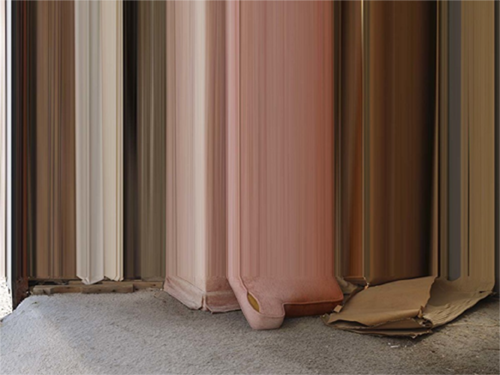   
Fig. 67 Ralf Brueck, *Home sweet home*
(2014)

Like in so many instances of
postdigital analysis, there are often strange interpretations of
Brueck’s work, with one article in *Wired* describing the *Distortion*
series thus:

> IT’S FINALLY HAPPENED – ALIENS are among us.
>
> Ralf Brueck’s images transform daily life into a sci-fi wonderland.
> Distorted shapes and glitches disrupt otherwise normal landscapes,
> making it easy to imagine paranormal activity or a good old-fashioned
> beaming up. In his series Dekonstruktion and Distortion, Brueck brings
> the unnatural closer to home.[^04-Chap4_61]

We’re not sure where the aliens are – Brueck notes that there’s been
almost a constant tendency to look at this work in a science fiction
context[^04-Chap4_62] – but the disjunctive relationship between the familiar and
the otherworldly presses our aesthetic sensibilities into a
consideration of the medium. Brueck works with a 4x5 analog camera and
is self-taught in the use of digital manipulation software. He notes:
‘One of the ideas behind my work is to manipulate the DNA of the
picture, to let it mutate. Every detail you see originates only from the
one sole photo.’[^04-Chap4_63] From this, we would suppose that, despite the
initial analog origins, the presence of digital manipulation is almost
teleological, a position substantiated by Amani Olu’s and Jon
Feinstein’s curated photography website, which states: ‘Ralf Brueck
manipulations of images are not geared towards pointing out that
contemporary digital photography is deficient in its representation of
reality but argues that a photograph constitutes its own reality.’[^04-Chap4_64]

The use of distortions by digital manipulation software has often been
noted as a readily identifiable manifestation of the influence of the
New Aesthetic, if not an example in its own right. Artists like Mishka
Henner have produced work like *Dutch Landscapes* (2011)[^04-Chap4_65] {Fig. 68}
that explore the concessions that Google makes to government censorship
and its ‘need’ for secrecy, and Helmut Smits’ *Dead Pixel in Google
Earth* (2008-10)[^04-Chap4_66] {Fig. 69} borrows from Land Art techniques to
aesthetically contrast our expectations and experiences in the
digitizing of our landscapes. 

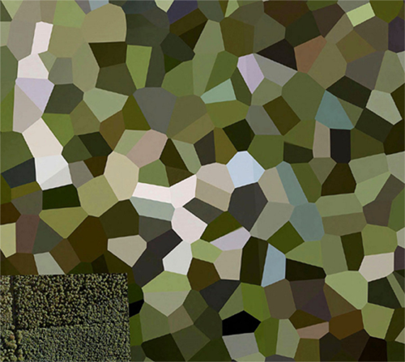   
Fig. 68 Mishka Henner, *De Peel Patriot
Missile Site*, Dutch Landscapes (2011)

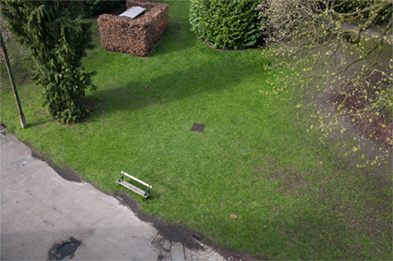   
Fig. 69 Helmut Smits, *Dead Pixel in
Google Earth* (2008–2010)

Similar to the work of Visconti and Geiger
is that of Kim Asendorf, though the similarities are set off by the
different directions these artists have taken. Asendorf is one of the
first digital artists to start using pixel sorting, a technique wherein
pixels in an image are sorted along certain parameters, and Asendorf’s
release of his own programming code for pixel sorting quickly sparked a
wide range of emulators and imitators.[^04-Chap4_67] With images like those in
the series *Mountain Tour* (2010)[^04-Chap4_68] {Fig. 70} and an example of his
work processing source code,[^04-Chap4_69] Asendorf is clearly subverting the
conventions of landscape while at the same articulating divergent
aesthetic parameters. 

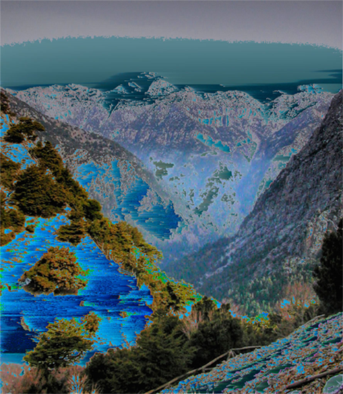   
Fig. 70 Kim Asendorf, from the *Mountain
Tour* series (2010)

More than just glitch art, Asendorf’s artistic
efforts explore the assumptions users make when employing digital tools
at a level that is more like conceptual art. *KIM ASENDORF* *TTF* (2013)
is exactly what it sounds like – a TrueType font family – but with
disruptive consequences, since it substitutes ‘Kim Asendorf’ as the only
visible characters.

*Sandbox* (2009), by Erwin Driessens & Maria Verstappen, is another
example of a powerful and interesting artwork that brings up a sense of
the New Aesthetic but is not fully participating in its attitude. {Fig.
71} Installed at *The Power of Things* exhibition at the DEAF (Dutch
Electronic Art Festival) in 2012, *Sandbox* is an elaborate skillful
recreation of a desert environment, with a diorama enclosing only sand
and wind.[^04-Chap4_70] 

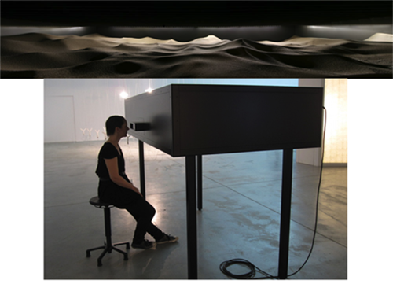   
Fig. 71 Erwin Driessens and Maria
Verstappen, *Sandbox* (2009)

Looking at the imitation of natural forces as they are
mimicked inside of the diorama, a viewer might be inclined to think of
this as no more than an elaborate science project or display typically
found in a science museum, but this work by Driessens & Verstappen does
far more than that; V2, the ‘Institute for Unstable Media’ describes the
team of artists as producing ‘e-volved’ imagery based on scientific
principles, resulting in an exploration of ‘the possibilities that
physical, chemical and computer algorithms offer for the development of
image-generating processes’.[^04-Chap4_71] What differentiates the work by
Driessens & Verstappen from a being merely a display of scientific
principles is the governing, systematic structure of control digitally
implemented in their work; as they note about their own work:

> They attempt an art in which spontaneous phenomena are created
> systematically. Art that is not entirely determined by the subjective
> choices of a human being, but instead is generated by autonomously
> operating processes. In addition to working with natural generative
> processes, the couple develops computer programs for artificial growth
> and evolution. An important source of inspiration at this are the
> self-organising processes in our natural surroundings: the complex
> dynamics of all kinds of physical processes and the
> genetic-evolutionary system of organic life that continuously creates
> new and original forms.[^04-Chap4_72]

The emphasis on natural growth puts their work very close to being New
Aesthetic, but at the same time we’re not so certain about the
naturalness in that there’s little apparent autonomy to the programming.
The series of images *E-volved Cultures* (2005-2011) {Fig. 72} and
*Formulae E-volver* (2015)[^04-Chap4_73] get even closer – perhaps genuinely
closer to the New Aesthetic than anything we’ve discussed so far – but
their dependency on complex mathematical formulas, with the
predetermined pathways of visual development that maintain a viable
structure imposed on the objects by the artists, puts them more in
parallel (in an updated manner) to the work of 1960s computer artists.

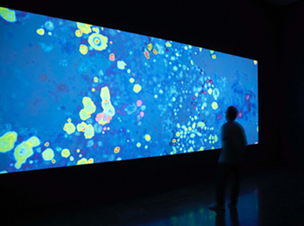   
Fig. 72 Erwin Driessens and Maria
Verstappen, *E-volved Cultures* (2005-11)

A final consideration in this section appears in two different examples
and involves an approach that is more installation-oriented: *Project
Blinkenlights* (2001-02) and Ryoji Ikeda’s *supersymmetry* (2015). At
first it would seem that the works are very mismatched. *Project
Blinkenlights* {Fig. 73} was a project executed by the German Chaos
Computer Club, whose members can rightfully be described as hackers in
the broadest sense. 

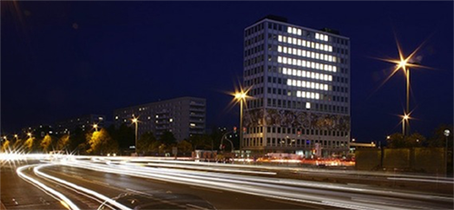   
Fig. 73 Chaos Computer Club, *Project
Blinkenlights* (2001–2002)

It started on September 11th 2001 at the Haus des
Lehrers in Alexanderplatz, Berlin, and lasted until February 23rd 2002.
Consisting of 144 lamps arranged behind the windows of the Haus des
Lehrers, it displayed various patterns that increased in complexity over
the course of the installation as planned but also incorporated love
letters, the classic video game Pong, and submitted patterns from users
through the Blinkenpaint software program written specifically for user
to participate in and contribute to a growing social occasion as its
popularity increased almost nightly. Was *Project Blinkenlights* art?
That’s debatable, especially given its hacker origins with an emphasis
on engineering rather than artistic success. Nevertheless, the effect of
*Project Blinkenlights* clearly was artistic at a very deep level,
especially given the title’s origin in the hacker neologism for
diagnostic lights used in old computer mainframes and the ironic effect
of the lack of failure in the project’s display. Ryoji Ikeda’s
*supersymmetry* {Fig. 74} is a project of a very different nature from
*Project Blinkenlights*, but certain similarities do exist. 

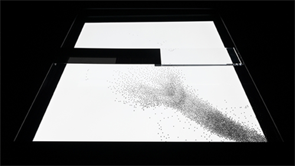   
Fig. 74 Ryoji Ikeda, *supersymmetry* (2014),
Studio A

Taking as
its starting point the theory of particle physics that attempts to
reconcile the incompatible models of quantum mechanics and general
relativity, Ikeda’s installation, atop the Brewer Street Car Park in
London, as part of a series supported by The Vinyl Factory, was a
disorienting experience divided into two sections and that is ‘an
artistic vision of the reality of nature through an immersive and
sensory experience to the visitors’.[^04-Chap4_74] In the first section of
*supersymmetry*, large numbers of balls roll across moving platforms
that are sometimes illuminated by strobe lighting and scanned *in situ*;
in the second section, the data produced by the balls is projected onto
forty computer screens, with correlations and divergences in the data
that is mapped and analyzed emphasized visually. {Fig. 75} 

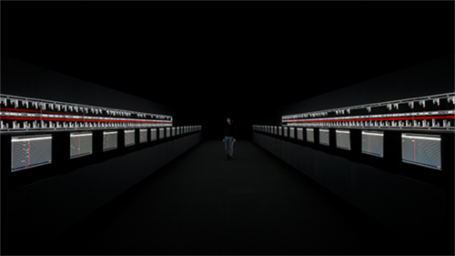   
Fig. 75 Ryoji Ikeda, *supersymmetry* (2014),
Studio B

In an
unjustifiably dismissive review, Jonathan Jones provided some a clear
starting point to understanding Ikeda’s intentions:

> There’s a giveaway when the pulses are replaced by streaming text: the
> words flowing across batteries of screens are deliberate nonsense. I
> see this as the artist’s view of physics, just a different language
> that makes no sense at all.
>
> Art and science, we feel, should have something to say to each other.
> But perhaps they speak different languages after all. I don’t speak
> the language of science too well, either, but I do know one thing: it
> is concerned with the wonder of nature. There is a depressing lack of
> wonder in this technically sophisticated but intellectually and
> emotionally empty art.[^04-Chap4_75]

Regardless of Jones’ inability to see the wonder,
his observation that Ikeda is focusing on the language of science and is
conflating it with the language of art is quite astute. The theory of
supersymmetry is an attempt, still unproven, to explain why particles
have mass, and both *Project Blinkenlights* and *supersymmetry* have
artistic goals that are very analogous to each other: namely, the
visible presentation of the effect of mass, in both social or cultural
and physically experimental ways. Both projects visually consist of
blinking lights, but it’s more important to recognize that these utterly
different projects still retain a faith in the systems that sustain
their manifestations; it’s not just that a digital language is necessary
to realize the works, but even more so it’s inherent that the
pervasiveness of that language be employed while simultaneously going
unrecognized. This attitude – uncritically embracing the digital as
almost a natural language, thereby giving it an autonomous function
determining artistic productivity – is not fully realized in either
*Project Blinkenlights, supersymmetry* or any of the other projects
mentioned in this section, but we believe that they set the stage for
other artists to fully work within the restrictions and opportunities of
the New Aesthetic and create New Aesthetics artistic objects.

These last embodiments, delineations and demarcations in their
particular form are what mark, for us, examples of art that are so close
to being New Aesthetic that they in turn help us define what New
Aesthetic art is. Curiously, the common characteristic (the only one, in
fact) that unites all of them – Erwin Driessens & Maria Verstappen,
*Project Blinkenlights*, and Ryoji Ikeda – is the immersiveness of their
projects, the use of installations and the creation of environments that
fundamentally alter the experience of the viewer. *Sandbox* creates
unseen vistas firmly grounded in our understanding of the world which
are continually being renewed as otherworldly, *Project Blinkenlights*
took a public space and made it even more public while at the same time
transforming participation into an entirely private matter, and Ikeda’s
work transforms our understanding of our place in the universe into a
sequence of lights and sounds that reduces our ability to differentiate
our experiences, our lives and our language into the mathematical and
thereby into something immensely depersonalized. Tremblin’s *Watermark*
achieves the same effect, though in a lyrical rather than immersive
fashion. It’s when these and other examples of art, immersive and all
encompassing, affect us that the categorical conditions of existence of
New Aesthetic art are revealed.

[^04-Chap4_1]: Aram Bartholl, ‘Dropping the Internet’, *Datenform*, 2014,
    <http://datenform.de/dropping-the-internet-eng.html>.

[^04-Chap4_2]: Christian Ulrik Andersen and Søren Bro Pold, ‘Aesthetics of the
    Banal – “New Aesthetics” in an Era of Diverted Digital Revolutions’,
    in David M. Berry and Michael Dieter (eds) *Postdigital Aesthetics:
    Art, Computation and Design*, New York: Palgrave MacMillan, 2015, p.
    286.

[^04-Chap4_3]: Aram Bartholl, ‘Dropping the Internet’.

[^04-Chap4_4]: Alexander Baumgarten, Paetzold, Heinz (ed.) *Meditationes
    philosophicae de nonnullis ad poema pertinentibus/Philosophische
    Betrachtungen über einige Bedingungen des Gedichtes*, Hamburg: Felix
    Meiner Verlag, 1983. p. 24

[^04-Chap4_5]: Alexander Baumgarten, Aesthetica/Ästhetik, Dagmar Mirbach (ed), 2
    vols.,Hamburg: Felix Meiner Verlag, 2007. (*Aesthetica*, §14)

[^04-Chap4_6]: J. Colin McQuillian, “Baumgarten on Sensible Perfection”
    *Philosophica*, 44, Lisboa, 2014, pp. 53-54.

[^04-Chap4_7]: Google Cultural Institute,
    <https://www.google.com/culturalinstitute/about/>.

[^04-Chap4_8]: João Enxuto and Erica Love, ‘Anonymous Paintings (2011-)’,
    *theoriginalcopy.net*, 2011,
    <http://www.sept6.info/anonymous-paintings/>.

[^04-Chap4_9]: Enxuto and Love, ‘Anonymous Paintings (2011-)’.

[^04-Chap4_10]: ‘Enxuto & Love, Anonymous Paintings’, (Press Release), Carriage
    Trade Gallery, October 2013,
    <http://www.carriagetrade.org/article82,82>.

[^04-Chap4_11]: Peter Brook, ‘See Some Art While You Can – Google Will Eventually
    Replace Museums’, *Wired.com*, September 2013,
    <http://www.wired.com/2013/09/see-some-art-whir-you-can-google-will-eventually-replace-museums/>.

[^04-Chap4_12]: So much so that Scott wrote that without realizing he was using
    the same exact phrase quote on the Wikipedia article about the
    painting <https://en.wikipedia.org/wiki/The\_School\_of\_Athens>,
    which quotes Janson’s *History of Art: The Western Tradition*. Which
    itself is a quotation from various other sources.

[^04-Chap4_13]: Andrew Lambirth, ‘Welcome home, Malcolm Morley’, *The Spectator*,
    26 October 2013,
    <http://new.spectator.co.uk/2013/10/malcolm-morley-the-last-wild-man-of-modern-art/>.

[^04-Chap4_14]: Ben Marks, ‘Art in the Infographic Age’, 22 August 2014, *Boing Boing*, <http://boingboing.net/2014/08/22/art-in-the-infographic-age.html>.

[^04-Chap4_15]: Strong Stuff, Tom Whalen Illustrations-Design,
    <http://www.strongstuff.net/about-flatiron/>.

[^04-Chap4_16]: ZKM Exhibitions, August 2006, ‘Georg Nees – The Great Temptation:
    Early generative computer graphics’, *ZKM*,
    <http://on1.zkm.de/zkm/stories/storyReader\$5255>.

[^04-Chap4_17]: Thomas Dreher, ‘Computer Graphics’, *History of Computer Art*,
    September 2013,
    <http://iasl.uni-muenchen.de/links/GCA-III.2e.html\#Computergrafik>.

[^04-Chap4_18]: compArt database Digital Art (daDA), ‘Georg Nees:
    Computergrafik’, <http://dada.compart-bremen.de/item/exhibition/164>.

[^04-Chap4_19]: Victoria & Albert Museum, ‘A History of Computer Art’,
    <http://www.vam.ac.uk/content/articles/a/computer-art-history/>.

[^04-Chap4_20]: A. Michael Noll, <http://noll.uscannenberg.org/>.

[^04-Chap4_21]: A. Michael Noll, ‘Human or Machine: A Subjective Comparison of
    Piet Mondrian’s ‘Composition with Lines’ and a Computer–Generated
    Picture,’ *The Psychological Record*, Vol. 16. No. 1, January 1966,
    pp. 1-10.

[^04-Chap4_22]: DAM Berlin, ‘Artist’s Statement: Frieder Nake in conversation
    with Wolf Lieser at the DAM GALLERY Berlin, November 2010’, November
    2010,
    <http://dam.org/artists/phase-one/frieder-nake/artist-s-statement>.

[^04-Chap4_23]: *Page* No. 18, October 1971, pp. 1-2. Reprinted in Arie Altena,
    Lucas van der Velden (eds) *The anthology of computer art*,
    Amsterdam: Sonic Acts 2006, pp. 59-60.

[^04-Chap4_24]: Wikipedia contributors. ‘Frieder Nake’, 26 February 2016,
    <https://en.wikipedia.org/w/index.php?title=Frieder_Nake&oldid=688732078>.

[^04-Chap4_25]: compArt database Digital Art (daDA), ‘Hiroshi Kawano’,
    <http://dada.compart-bremen.de/item/agent/234>.

[^04-Chap4_26]: Index for jean-pierre hébert, ‘Biography’,
    <http://jeanpierrehebert.com/docs/bio1209.pdf>.

[^04-Chap4_27]: compArt database Digital Art (daDA), Jean-Pierre Hébert’,
    <http://dada.compart-bremen.de/item/agent/549>.

[^04-Chap4_28]: ‘The Work of Jean-Pierre Hébert’, *Juxtapoz*, May 22 2015,
    <http://www.juxtapoz.com/current/the-work-of-jean-pierre-hebert>.

[^04-Chap4_29]: Thoma Foundation, ‘There Are Spirals Everywhere,’ Says Computer
    Artist Jean-Pierre Hébert’, (Press release), July 25 2015,
    <http://thomafoundation.org/there-are-spirals-everywhere-says-computer-artist-jean-pierre-hebert/>.

[^04-Chap4_30]: *Page* No. 18, October 1971, pp. 1-2. Reprinted in Arie Altena,
    Lucas van der Velden (eds) *The Anthology of Computer Art*, pp.
    59-60.

[^04-Chap4_31]: Tate, ‘Painting After Technology’, March, 2015,
    <http://www.tate.org.uk/whats-on/tate-modern/display/painting-after-technology>.

[^04-Chap4_32]: Tate, ‘Painting After Technology’.

[^04-Chap4_33]: Tate, ‘Painting After Technology’.

[^04-Chap4_34]: Mark Godfrey, ‘Statements of Intent: Mark Godfrey on the Art of
    Jacqueline Humphries, Laura Owens, Amy Sillman, and Charline von
    Heyl’, *Artforum*, April 2014,
    <http://owenslaura.com/wp-content/uploads/2014/11/LO\_2014\_Apr\_Artforum\_small.pdf>.

[^04-Chap4_35]: Kohei Nawa, <http://kohei-nawa.net/>.

[^04-Chap4_36]: Sandwich: Creative Platform for Contemporary Art,
    <http://sandwich-cpca.net/.

[^04-Chap4_37]: artnet, ‘Kohei Nawa, SCAI The Bathhouse’,
    <http://www.artnet.com/artists/kohei-nawa/polygon-double-deer-2-a-iODzN9ohK0\_WbjhUoeM5OQ2>.

[^04-Chap4_38]: Matthew Plummer-Fernandez, <http://www.plummerfernandez.com>.

[^04-Chap4_39]: Stephen Fortune, ‘Disarming Corruptor will encrypt your 3D
    creations’, *Dazed*, 2014,
    <http://www.dazeddigital.com/artsandculture/article/18019/1/disarming-corruptor-will-encrypt-your-3d-creations>.

[^04-Chap4_40]: Plummer-Fernandez, ‘sekuMoi-Mecy’,
    <http://www.plummerfernandez.com>.

[^04-Chap4_41]: James Bridle, ‘Report from Austin, Texas, on the New Aesthetic
    panel at SXSW’, *booktwo.org*, March 15 2012,
    <http://booktwo.org/notebook/sxaesthetic/>.

[^04-Chap4_42]: Studio Laviani APFL, <http://www.laviani.com/>.

[^04-Chap4_43]: Studio Laviani APFL,
    <http://www.laviani.com/\#!good-vibrations/cq2s>.

[^04-Chap4_44]: Matthieu Tremblin, Demo De Tous Les Jours,
    <http://demodetouslesjours.free.fr/>.

[^04-Chap4_45]: Matthieu Tremblin, Demo De Tous Les Jours,
    <http://demodetouslesjours.free.fr/watermark/>.

[^04-Chap4_46]: Mark Byrnes, ‘This Is Not a Watermark: Meet French Street Artist
    Mathieu Tremblin’, *The Atlantic, Citylab*, 15 July 2013,
    <http://www.citylab.com/design/2013/07/not-watermark-meet-french-street-artist-mathieu-tremblin/6083/>.

[^04-Chap4_47]: Faig Ahmed, <http://www.faigahmed.com/about/info/>.

[^04-Chap4_48]: Faig Ahmed, <http://www.faigahmed.com/about/info/>.

[^04-Chap4_49]: Faig Ahmed, *artworks catalog*,
    <http://www.faigahmed.com/site/assets/files/1017/faig\_ahmed\_artworks\_catalogue.pdf>.

[^04-Chap4_50]: Sabato Visconti, <http://www.sabatobox.com/about>.

[^04-Chap4_51]: Douglas Bierend, ‘Breaking Things On Purpose, Glitch Art’s
    Pixel-mixing Algorithms’, *Medium.com*, 26 August 2014,
    <https://medium.com/re-form/breaking-things-on-purpose-14f413bdf2ce\#.sdbpsxsmt>.

[^04-Chap4_52]: Liz Stinson, ‘Wonderfully Twisted Photos from a Glitch Art Guru’,
    *Wired.com*, 10 September 2014,
    <http://www.wired.com/2014/10/wonderfully-twisted-photos-glitch-art-guru/\#slide-8>.

[^04-Chap4_53]: Bierend, ‘Breaking Things On Purpose, Glitch Art’s Pixel-mixing
    Algorithms’.

[^04-Chap4_54]: Liz Stinson, ‘Wonderfully Twisted Photos From a Glitch Art Guru’.

[^04-Chap4_55]: Stinson, ‘Wonderfully Twisted Photos From a Glitch Art Guru’.

[^04-Chap4_56]: Lital Khaikin, ‘The Radical Capacity of Glitch Art: Expression
    through an Aesthetic Rooted in Error’, *REDEFINE*, 5 February 2014,
    <http://www.redefinemag.com/2014/glitch-art-expression-through-an-aesthetic-rooted-in-error/>.

[^04-Chap4_57]: Dmitriy Krotevich, *Pixel-Drifter*,
    <http://pixeldrifter.tumblr.com/>.

[^04-Chap4_58]: Margaret Rhodes ,’This Glitch Art is Made of Pixels Powered by
    Their Own AI’, *Wired.com*, 7 August 2014,
    <http://www.wired.com/2014/08/this-glitch-art-is-made-of-pixels-powered-by-their-own-ai>.

[^04-Chap4_59]: Kate Sierzputowski, ‘The Attention-Sucking Power of Digital
    Technology Displayed Through Photography by Antoine Geiger’,
    *Colossal*, 11 November 2015,
    <http://www.thisiscolossal.com/2015/11/cellphone-attention-antoine-geiger/?src=footer>.

[^04-Chap4_60]: Antoine Geiger, *Sur-Fake*,
    <http://files.cargocollective.com/440813/SUR-FAKE--translated-.pdf>.

[^04-Chap4_61]: Alyssa Coppelman, ‘Distorted Photos Show the Alien Side of
    Suburban Life’, *Wired.com*, 1 March 2015,
    <http://www.wired.com/2015/03/ralf-brueck-distortion/>.

[^04-Chap4_62]: Michael Corbin, ‘Ralf Brueck: Surreal Distortion’, *ArtBookGuy*,
    <http://artbookguy.com/ralf-brueck-surreal-distortion\_433.html>.

[^04-Chap4_63]: Alyssa Coppelman, ‘Distorted Photos Show the Alien Side of
    Suburban Life’.

[^04-Chap4_64]: group show 42: *Occultisms* The Artists, Humble Arts Foundation,
    <http://hafny.org/group-show-42-occultisms-statements-and-bios/>.

[^04-Chap4_65]: Mishka Henner, ‘Dutch Landscapes’, *mishkahenner.com*, February
    2011, <http://mishkahenner.com/filter/works/Dutch-Landscapes>.

[^04-Chap4_66]: Helmut Smits, ‘Dead Pixel in Google Earth’, *helmutsmits.com*,
    2010, <http://helmutsmits.nl/work/dead-pixel-in-google-earth-2>.

[^04-Chap4_67]: Kim Assendorf, *Kim Assendorf Up and Running*,
    <http://kimasendorf.com/www/>.

[^04-Chap4_68]: ‘Mountain Tour (2010) by Kim Asendorf ‘, *Prosthetic Knowledge
    blog*, 25 August 2012,
    <http://prostheticknowledge.tumblr.com/post/30196185509/mountain-tour-2010-by-kim-asendorf-one-of-the>.

[^04-Chap4_69]: Kim Asendorf, ‘Processing Source Code’, 5 October 2012,
    *kimasendorf blog*,
    <http://kimasendorf.tumblr.com/post/32936480093/processing-source-code>.

[^04-Chap4_70]: Erwin Driessens & Maria Verstappen, ‘Sandbox’, 2009,
    <http://notnot.home.xs4all.nl/sandbox/sandbox.html>.

[^04-Chap4_71]: V2\_Institute for the Unstable Media, ‘Sandbox’,
    <http://v2.nl/archive/works/sandbox>.

[^04-Chap4_72]: Erwin Driessens & Maria Verstappen, ‘Bio’,
    <http://notnot.home.xs4all.nl/text/shortBio.html>.

[^04-Chap4_73]: Erwin Driessens & Maria Verstappen, ‘E-volved Images’,
    <http://notnot.home.xs4all.nl/evolvedimages/evolvedimages.html>.

[^04-Chap4_74]: Ryoji Ikeda, ‘supersymmetry’, *Ryoji Ikeda*, 2014,
    <http://www.ryojiikeda.com/project/supersymmetry/>.

[^04-Chap4_75]: Jonathan Jones, ‘Should art respond to science? On this evidence,
    the answer is simple: no way’, *The Guardian*, 23 April 2015,
    <http://www.theguardian.com/artanddesign/jonathanjonesblog/2015/apr/23/art-respond-science-cern-ryoji-ikeda-supersymmetry>.  

    
    

