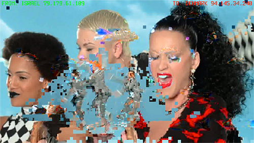
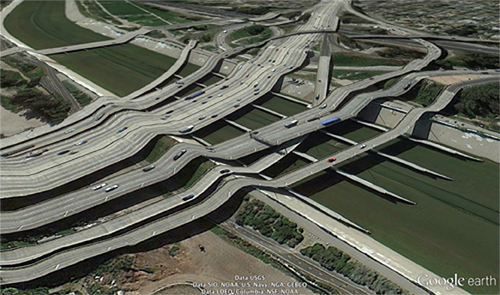

# Chapter 3: Glitch Ontology and the New Aesthetic 

In order to critically examine the cultural impact of the latest
computational technologies and to follow the critical approach to the
computational advocated by the protagonists of the New Aesthetic, we
need to turn to studying the computational in a state of failure.

In this chapter we are elaborating on glitch theory, which will be used
in the subsequent chapters devoted to studying glitches in digital
media, consumer software and hardware ecosystems, artistic interventions
and works of art. {Fig. 40} 

   
Fig. 40 Nicolas Maigret, *The Pirate
Cinema* (2014)

The glitch is a result of the ‘attitude’
(Bridle’s characterization) that drives the New Aesthetic; it is a
fundamental aspect of New Aesthetic objects, the means by which they are
apparent and recognizable to the user. We argue that glitches are one of
the key constituents and manifestations of the New Aesthetic both on the
conceptual and on the aesthetic level.

In *Software Studies, A Lexicon* in the chapter entitled ‘Glitch’, Olga
Goriunova and Alexei Shulgin write that

> In electrical systems, a glitch is a short-lived error in a system or
> machine. A glitch appears as a defect (a voltage-change or signal of
> the wrong duration – a change of input) in an electrical circuit.
> Thus, a glitch is a short-term deviation from a correct value and as
> such the term can also describe hardware malfunctions.[^03-Chap3_03-Chap3_1]

From the aesthetic perspective glitches can be ‘claimed to be a
manifestation of genuine software aesthetics’ as they reveal the
computational nature of the digital image.[^03-Chap3_03-Chap3_2] There is even a sense
that the glitch is a challenge to the moral or ethical status of the
digital object’s use, in that it manifests an incorrect value
contradicting the user’s expectations. Glitch aesthetics has been
discussed as a form of transmedial narratives, and has even been
frequently linked to a nostalgic form of 8-bit game design, to cite one
example, but in the case of New Aesthetic objects there is something
more. Both low-res pixelated images and glitches are rather marginal
phenomena in comparison to common contemporary aesthetics (images
displayed in high resolution with millions of colors). However they
allow us to break away from the screen-centric approach and make the
softwarization of the digital image clearly visible. The glitch, being a
direct and natural result of an algorithmic error, unveils the degree of
the software’s influence on the aesthetics of digital image:

> Just as digital technologies and software mediate our experience and
> engagement with the world, often invisibly, so the “digital” and
> “software” is itself mediated and made visible through the
> representational forms of pixelation and glitch.[^03-Chap3_03-Chap3_3]

In this sense, glitches are more than just a manifestation of a coding
error or the result of inputted data from the user; they are both an
opportunity and an encouragement for us to reconsider the myth of total
immediacy of computational imagery, particularly when images are
perceived as parts of software structure e.g. graphical user interface.
The very notion of mediation is important because it creates a
dialectical relationship between user and object, necessitating
interaction or, at the very least, reaction. In *Transcoding the
Digital: How Metaphors Matter in New Media* Marianne van den Boomen
gives examples of such situations:

> For example, when sound and vision are no longer synchronized in a
> movie, when subtitles suddenly disappear, or when we notice the delay
> in a live television interview from the studio. Paradoxically then,
> immediacy is the imaginary degree zero of any mediation, a lived
> illusion of absent mediation, deprived of all traditional markers that
> announce an encounter with media. When it shows itself, the spell is
> broken. In retrospect, immediacy turns out to be a matter of unnoticed
> and concealed mediation, revealing itself now in the split into a
> faltering medium and a stammering message.[^03-Chap3_03-Chap3_4]

In focusing on the appearances of glitches and miscalculations in New
Aesthetic objects, we believe that at least part of its nature is
revealed as an abnormal relation in the structures composed of
standardized objects, especially in the creative software based on image
processing algorithms or lags and artifacts that are the means of
producing graphical user interfaces in contemporary software. An
instance of a programming language taking over the responsibilities of
coding from the programmer, while disingenuously promoting itself as a
guarantor of the programmer’s and user’s end-use satisfaction, is
Apple’s new programming language Swift, which is supposedly designed for
‘safety’ because ‘Swift eliminates entire classes of unsafe code.
Variables are always initialized before use, arrays and integers are
checked for overflow, and memory is managed automatically.’

On the aesthetic level they seem to address the approach taken by many
proponents of the New Aesthetic. For Matt Jones the New Aesthetic
encourages us to ‘see the grain of computation’[^03-Chap3_03-Chap3_5] in everyday
interaction not only with the digital but with the physical world as
well. The ‘grain of computation’ would be these specific aesthetic
patterns associated with the digital that are becoming visible through
pixelization and visual glitches in digital media and in new pixelated
aesthetics in fashion, military, architecture, design and other actual
objects present in the physical world. In the era of ultra-high
resolution, seamless user interfaces and ubiquitous systems that Peter
Knapp names the ‘era of noise canceling’, the New Aesthetic
manifestations, and particularly glitches, unveil the limitations of the
computational through something that Kim Cascone calls the ‘aesthetics
of failure’.[^03-Chap3_03-Chap3_6]

Both glitch studies and the New Aesthetic seem to share the spirit of a
‘critical trans-media aesthetics’[^03-Chap3_03-Chap3_7] as understood by Rosa Menkman, the
author of the *Glitch Art Manifesto* (2010) and the *Glitch Momentum*
(2011).

> these aesthetics media show a medium in a critical state (a ruined,
> unwanted, not recognized, accidental and horrendous state). These
> aesthetics critique the medium (genre, interface and expectations)
> \[…\] They challenge its inherent politics and the established
> template of creative practice while producing a theory of
> reflection.[^03-Chap3_03-Chap3_8]

Menkman suggests that glitch aesthetics offer more than just interesting
and attractive visual experiences. They give us a new perspective on
digital media and applications that goes beyond the preprogrammed
aesthetics and interactions paradigms. They can also challenge another
praised popular culture paradigm that emphasizes the unlimited creative
potential of computational technologies. Glitches in digital media
processing and user-oriented applications suddenly bring to the
forefront the hidden boundaries of creative practices based on
affordances of the digital.

This observation drives us to the conclusion that the New Aesthetic is
not a medium-specific approach, since the phenomena associated with the
New Aesthetic can be encountered in any kind of digital media; be it
CGI, still images, video content, GUIs, etc. The range of artworks
presented in the subsequent chapter clearly proves that point. Despite
the fact that there are multiple formats and media types, when faced
with glitches digital media seem universally equivalent. All digital
objects are susceptible to unwanted, sudden errors that lead to visual
glitches. The reason for this is the fact that the very conditions for
glitch aesthetics are structured by core properties of computer-based
media enumerated by Lev Manovich in his *The Language of New Media.*[^03-Chap3_03-Chap3_9]
Manovich argues that all digital media share some common properties,
which are deeply rooted in their numerical nature. Consequently, all
digital images are discrete since they are broken and then displayed as
discrete elements with pixels (data values on chrominance and
luminance). They are also modular since they are built in real-time from
various layers of data types. The process of their displaying involves
actual image data, specific codecs, software, user interfaces and this
is even more complex in network-based imagery. The cultural and social
significance of different, interconnected layers in the computational
will be addressed broadly when we will discuss the ‘ontological levels
of the computational’ described by David M. Berry. Another common
property of digital images would be their ability to be compressed. This
is important particularly in web-based imagery which has to be processed
and sent with as few resources as possible. Compression has become
really important in the advent of mobile devices and mobile internet
access. Video streaming services, such as VOD platforms or YouTube, but
also social media that heavily use visual content like Instagram or
Facebook, function thanks to advanced compression algorithms.
Variability and automation would be another key property of digital
visual media. Both can be narrowed down to the fact that they are
programmable. Manovich explains that this enables a user to create
infinite versions of the same image which can vary in size, resolution,
colors, composition and so on.

Following Manovich’s observations we argue that the core properties of
digital media create the very conditions of existence of glitch
aesthetics. It emerges as a trans-media, or better a medium-neutral
abnormal momentum, which takes the user beyond a carefully designed modi
operandi of each and every medium. In high-resolution photography,
glitch aesthetics would manifest itself by a pixelated or broken
(partially-displayed) image, in video the glitches would be seen as
compression artifacts, in real-time web-based media and interfaces the
glitches would result in partial or incorrect display of icons, data
streams etc. We will address such cases in our glitch art analysis. In
any case, glitch aesthetics challenges the logic of seamless interaction
and automation maintained by the continuity of streams of processed data
displayed in various media.

Of course, the ontological identity of objects is not only identifiable
through the presence of glitches but also their relational capacities
and effects, a crucial point to remember in the context of a narrowed
discussion of New Aesthetic objects. Many scholars emphasize the
promising critical potential of glitches in studying not only
technologies themselves and everyday human-computer interaction
practices but also their social and cultural impact; with a general
consensus that it is necessary to open the black box of computation to
the user.

This quasi-hacking approach in which the glitches are undeliberate after
all is considered as a first step in a process of making the user aware
of both technical limitations of the digital and of socio-political
constraints imposed on her through these technologies. For instance,
Benjamin Mako Hill, and to some extent Jussi Parikka, write about hidden
affordances of technologies that are made visible to the users thanks to
glitches and errors.

> \[…\] errors can reveal the affordances and constraints of technology
> that are often invisible to users. Through these affordances and
> constraints, technologies make it easier to do some things, rather
> than others, and either easier or more difficult to communicate
> certain messages. Errors can help reveal these hidden constraints and
> the power that technology imposes. [^03-Chap3_03-Chap3_10]

In other words, Hill argues that glitches do reveal the boundaries of
the digital sandbox that a user usually plays in while being enchanted
by supposed limitless creative possibilities and perfect visual
representations that come with user-oriented software and systems.
‘Through noise, through anomalies, we are able to decipher a range of
crucial issues concerning politics, aesthetics and cultural processes of
media.’[^03-Chap3_03-Chap3_11] Parikka goes even further, saying that a critical
examination of anomalies and noise in digital media can be a starting
point for a more broad analysis of the impact of the computational on
society and culture. Parikka seems to follow an important line of
reasoning in the humanities that was advocated by Immanuel Kant – that
examining the world in the light of its aesthetics may provide us with a
very productive and unique critical perspective. This approach is shared
by us as well throughout this book.

Building on this approach, it is worthy to mention a very important
addition to it by Olga Goriunova and Alexei Shulgin who link glitch
studies with software studies. The scholars emphasize the critical
potential of glitch for revealing the inner logic of software, however
not solely as a technology-oriented endeavor but rather as a starting
point for a wider discussion on the social and cultural consequences of
a particular organization of digital spaces:

> A glitch is a mess that is a moment, a possibility to glance at
> software’s inner structure, whether it is a mechanism of data
> compression or HTML code. Although a glitch does not reveal the true
> functionality of the computer, it shows the ghostly conventionality of
> the forms by which digital spaces are organized.[^03-Chap3_03-Chap3_12]

Goriunova and Schulgin understand glitches and errors as unique
epistemic micro-states that offer a chance to critically assess the
boundaries of the operational logic of the software. The scholars
encourage us to conceptually understand glitches as ruptures which go
vertically through different layers of the computational as they may be
caused by errors in the software code, data sets, network, protocols or
user interface. Glitches provide us not only with an insight into the
layered structure of the computational, but also make clear the
limitations of the programmability of the digital. Mark Nunes and
Benjamin Mako follow a similar logic, emphasizing the importance of
opening the computational ‘black boxes’ for making possible a critical
analysis of HCI.[^03-Chap3_03-Chap3_13] The scholars claim that errors that provide clear
views into black boxes provide a view into some of what we might be
missing. However, they also emphasize that glitches may be of vital
importance for making the users aware of the great formational power of
digital technologies.

Given the growing dominance of this ideology of informatic control,
error provides us with an important critical lens for understanding what
it means to live within a network society. Error reveals not only a
system’s failure, but also its operational logic.[^03-Chap3_03-Chap3_14] David M. Berry,
similarly to Goriunova and Schulgin, claims that glitches do introduce a
specific phenomenological condition that enables a user to interact with
the computational in a state of failure. Berry conceptualizes this
condition in the *Critical Theory and The Digital* as ‘glitch ontology’
which takes the user out of the constant flow of digital processes that
are normally masked by autonomous content representation and seamless
interaction.

> Computation due to its glitch ontology continually forces a contextual
> slowing down at the level of the experience of the user. This is
> suggestive of the possibility for a micro-phenomenology that could
> fully explore the breaks in perception that the computer
> generates.[^03-Chap3_03-Chap3_15]
>
> \[…\] just as digital technologies and software mediate our experience
> and engagement with the world, often invisibly, so the “digital” and
> “software” is itself mediated and made visible through the
> representational forms of pixelation and glitch.[^03-Chap3_03-Chap3_16]

Berry emphasizes the importance of glitches for bringing to the
forefront the layered nature of computational technologies. However
their role is even more significant for representing breaks in the
continuity of postdigital media and software. In the era of mobile
networks, clouds, IoT, data streams, preventing or better masking errors
in the constant flow of the digital is crucial. Glitches, by introducing
their unique micro-phenomenology, unveil these breaks, at least on the
perceptual, visual level.

Berry argues that glitch ontology is one of many manifestations (e.g.
code / software or ubiquitous systems) of a specific civilizational
condition which is a result of the increasing presence of the digital in
our everyday life. He conceptualizes this ‘new constellation of
intelligibility’ as computationality. The notion is used, as explained
in the previous chapter, to describe today’s transformation of our
society and culture which will lead to ultimate synchronization with, or
better, to subordination to the digital. This should be understood as an
era when cultural and social practices are both rooted in and bound by
digital technology – e.g. the various types of hardware, software,
distributed networks or interaction paradigms.[^03-Chap3_03-Chap3_17] Lev Manovich in his
*Software Takes Command* argues that even now we rely on software and
hardware to create, transform and distribute information to such an
extent that our society should rather be characterized as software
society.[^03-Chap3_03-Chap3_18]

The media studies, digital art and critical theory scholars cited above
are intrigued by the critical potential of glitch aesthetics. On the one
hand it is emphasized that glitches offer a unique possibility to
visually depict the impact of core properties of computer-based media on
their functioning by exposing their limitations. On the other hand, they
argue that glitches may provide us with an interesting starting point to
formulate a broader critique of today’s digital technologies based on
examining the glitches themselves, their milieu and their social and
cultural impact.

Building on that approach we argue that the rapid pace of technological
innovation that resulted not only in new technologies per se, but also
in new human-computer interaction paradigms and digital image aesthetic.
This evolution has left an imprint on the way glitches manifest
themselves in everyday interaction with digital media based on real-time
and cloud-based computational technologies, ubiquitous computing and
autonomous systems.[^03-Chap3_03-Chap3_19] Postdigital glitch studies should, similarly to
the New Aesthetic, critically challenge the mainstream technological
narratives that were founded on the latest technological innovation,
including the illusion of seamless interaction, automation and perfect
visual representation.

For our purposes, two different sets of philosophical strategies provide
intriguing and productive approaches to an ontological analysis of
glitches. For the rest of this chapter, we base our approach on
Heidegger’s notions of ready-to-hand and present-to-hand advocated by
him in *Being and Time*. Obviously Heidegger was never exposed to the
type of artifacts constituting the body of postdigital and New Aesthetic
objects, and Heidegger’s philosophy at first glance doesn’t seem
applicable. Nevertheless, we take courage from recent applications of
Heidegger’s ideas to a diverse range of subjects; if we can use
Heidegger to discuss environmentalism, psychology and religion then why
not use Heidegger to discuss digital objects and their effects,
especially if we consider those objects and their effects as fully
phenomenologically appreciable. In fact, extending Heidegger’s ideas
into the realm of postdigital and New Aesthetic objects is particularly
fruitful if we take the position that Heidegger’s theory would provide
us with a unique insight into the various ontological contexts in which
things, or more specifically tools, can manifest themselves in everyday
usage.

For Heidegger, tools are an essential aspect of our interaction with the
world; the world comes at us in the manner of things, but those things
which help constitute our thrownness (*Geworfenheit*) into the world are
special as a means of making our place in the world and understanding it
more fully. When tools become more than singular in their application as
a means of transforming the world then they are labeled equipment and
through this equipment human beings come to understand the notion of
being-with others in the worldliness of the world as constituted by this
being-with ourselves. The fact that Heidegger in his analysis also
focuses on instances where tools do not function as intended, providing
a clear contextualization of their specific ontic status and
micro-temporality, will give us a promising analytical paradigm to
distinguish and contextualize glitches and other aesthetic phenomena
associated with the New Aesthetic and postdigital media and
technologies.

A glitch offers a unique epistemic perspective. The unexpected error
caused by the inability of the software to process real-time data or an
inadequate capacity to recognize and recombine images into a functioning
single image, reveals not only the software’s inner structure, as Rosa
Menkman says, but also makes visible the limitations of real-time data
transmission and makes the omnipotence of digital quantification
questionable. Glitches in web-based graphical user interfaces,
video-streaming services, or satellite imagery services are some of the
last remaining instances of the unreadiness-to-hand of the computational
in the era of multi-layered autonomous software and ultra
high-resolution display systems. We could then argue that a glitch
becomes a manifestation of a malfunctioning piece of equipment that
emerges from a functional transparency or immediacy of a computational
system and becomes a sign of its unready-to-hand condition. It should
also be emphasized that a glitch goes beyond a binary distinction
between a working and not-working computational system, but is rather
situated in-between these two states.

Before applying Heidegger’s taxonomy to our analysis of the New
Aesthetic in today’s technological milieu, we think that its ontic
status should be clarified as well. As already argued, the computational
has become even more opaque because of the combination of interconnected
layers of both material (hardware) and immaterial (software) generating
ever changing data streams, based on protocols, and standardized tools.
If we want to avoid generalizations in our analysis of the New
Aesthetic, which occurs at any level or layer of our contemporary
technological milieu, we feel it is essential to at least briefly
characterize these levels. To do that we will use David M. Berry’s
theory of ‘ontological levels of the computational’ advocated in
*Critical Theory and The Digital. *

## The Glitch as an Unready-to-hand Condition 

> Heidegger’s phenomenological analysis of things has never been more
> relevant. Particularly pertinent for a networked digital society, he
> moves beyond the seemingly self-evident, but ultimately incomplete,
> under-standing of things as entities or objects. Instead, he provides
> a much richer phenomenological account of how thingness is in fact
> inextricably related to human concerns and dealings that occur in a
> distinctly insubstantial and non-thing-like fashion. In doing so,
> Heidegger illuminates the seemingly intangible but actually
> fundamental phenomenological aspects of mediated things – those things
> we commonly experience as “equipment”.[^03-Chap3_03-Chap3_20]

Heidegger argues that things are actual things acquiring their proper
‘thingly character’ only when they are used for a particular purpose.
The thing is then available as ‘ready-to-hand’. However, its unique
‘readiness-to-hand’ is manifested only through putting the thing to
work, as we can’t grasp it only through its appearance. He explicitly
states that ‘no matter how sharply we look at the “outward appearance”
of Things in whatever form this takes, we cannot discover anything
ready-to-hand’.[^03-Chap3_03-Chap3_21] The specific mode of being that belongs to the
thing appears as a using of something for something.[^03-Chap3_03-Chap3_22] Heidegger’s
famous example of this logic is a hammer and a nail. The specific
thingness (manipulability) of the hammer is unveiled through putting it
to actual work – nailing the nail. [^03-Chap3_03-Chap3_23] The process of putting the
things to actual work disclose them and their thingness to the user.
David Gunkel and Paul A. Taylor argue that if we’d follow Heidegger’s
line of reasoning we would conclude that ‘Readiness-to-hand is therefore
not just a temporary attitude or viewpoint we adopt with regards to
things. It acts to define the very being of things as things.’[^03-Chap3_03-Chap3_24] The
Readiness-to-hand defines things both ontologically and categorically.
From the perspective of media and communication studies, the things
should then be understood as intermediary means to and end or simply
put, media (in a broader McLuhanian sense). However, usually we do not
reflect on the nature of a hammer, nail or any tool. We focus instead on
completing the task by using a particularly thing or medium. The thing
and its thingness become transparent or unremarkable. The tool follows
the logic of immediacy, being a mere mean to an end. ‘The paradox of the
ready-to-hand is therefore the fact that in its most authentic form, it
necessarily withdraws from direct view’, Gunkel and Taylor
write.[^03-Chap3_03-Chap3_25]

Now we’ve arrived to a point when Heidegger’s theory on things meets
with principal assumptions about human-computer interaction and digital
content representation that have been challenged by the New Aesthetic
and the postdigital. Even before mass popularization of
consumer-oriented computing, the visionaries of the computing age
envisioned computers as tools that would serve as autonomous machines
that would assist humans in storing, processing and accessing
information. From an electromechanical device called Memex, described in
‘As We May Think’ by Vannevar Bush,[^03-Chap3_03-Chap3_26] through Sketchpad designed by
Ivan E. Sutherland in 1963[^03-Chap3_03-Chap3_27] and PARC User Interface (Xerox 8010 Star
Information System) from the early 1980s to various modifications of the
personal computers from the 1990s: all have been designed with the
principle to ‘augment the human intellect’, while being as transparent
as possible.[^03-Chap3_03-Chap3_28] The logic of the immediacy of the computational has
prevailed even more in the age of ubiquitous computing, cloud-based and
multi-device ecosystems. Their ultimate readiness-to-hand is a necessary
condition of their actual interoperability and versatility. They are
perfect tools as long as they stay in the shadow. As soon as they break
down, or a visible glitch occurs in any node of the system –
particularly near to the end user – in graphical user interfaces or in
the visual media they process and display, the tools become
present-at-hand. Heidegger points out that such a situation causes
concern among users, and ‘the entities which are most closely
ready-to-hand may be met as something unusable, not properly adapted for
the use we have decided upon. \[…\] we discover its unusability,
however, not by looking at it and establishing its properties, but
rather by the circumspection of the dealings in which we use
it’.[^03-Chap3_03-Chap3_29] Gunkel and Taylor also emphasize the fact that the evolution
from being ready-to-hand to present-to-hand of certain tools, takes
place not in the user’s perception of a tool, but through putting it to
actual use. ‘Something becomes present-at-hand when the thing in
question fails to work, breaks down or interrupts the smooth functioning
of what had been already handy and ready-to-hand.’[^03-Chap3_03-Chap3_30] If we return to
our broader understanding of the New Aesthetic, described as a
theoretical approach that takes to the forefront of our perception the
conditions of existence of the computational in the postdigital age
together with its limitations, the critical potential of studying
certain technologies and media in their unready-to-hand conditions,
looks very promising. Heidegger uses three different notions to describe
specific conditions of things when they reveal their presence-at-hand
through unique unreadiness-to-hand. The modi of conspicuousness,
obtrusiveness and obstinacy introduce a micro-temporal context, an
epistemic condition that through the state of failure allows us to
apprehend the characteristic of presence-at-hand, a handiness that is
usually masked by a perfect functioning of the equipment.

In a technological context, the unready-to-hand condition of the
equipment can be characterized as a condition in which a computational
apparatus is facing a sudden or unusual obstacle that can’t be overcome
by its (pre)programmed mode of operation and interaction with the user.
However, it may not imply that the machine’s inner logic of operation is
defective. The state of unreadiness-to-hand goes far beyond a mere
problem of incalculability. Something – a tool, device, application – is
*conspicuous* when it becomes unusable. Unusability means in this
context a situation when a thing no longer serves the use for which it
was initially designed.[^03-Chap3_03-Chap3_31] It is not just about breaking the seamless
interaction and utility paradigm in partially working machines or
software. The conspicuousness is a result of a complete failure of the
computational, a situation in which a user is confronted with a broken
piece of hardware, or an application that fails to launch. A thing
becomes *obtrusive* when it is missing. As Heidegger argues, the thing
is then not ‘handy’ but is not ‘to hand’ at all. The more we need what
is missing to perform a task, the more intensive it enters into the
state of obtrusiveness.[^03-Chap3_03-Chap3_32] The problem of obtrusiveness occurs when
for example a certain media file cannot be opened or processed due to
lack of a specific codec, or when a cloud-based application cannot
access data which is stored on the remote server. The state of
obtrusiveness will become even more relevant as the interaction and
functioning of computational technologies will be based on
interconnected software and hardware ecosystems composed of various
devices, software and data types. Any malfunction in such an ecosystem
can result in an obtrusive piece of equipment (both material and
immaterial) at the level of user-computational interaction. The last
variation of unreadiness-to-hand is the state of *obstinacy*. The
*obstinacy* is encountered when it ‘stands in the way’ of our concern
and interrupts our activities. Anything which is un-ready-to-hand in
this way is disturbing to us, and enables us to see the obstinacy of
that with which we must concern ourselves first before we do anything
else.[^03-Chap3_03-Chap3_33] If we were to study glitch in the light of obstinacy, we
could claim that a glitch is an unexpected deviation from the intended
functioning of a computational system which prevents the user from
completing the task (in a usual manner). However, the state of obstinacy
does not mean a complete failure of the system – a compression artifact
in a video content may introduce a different aesthetics, or may lead to
a break in continuity of narrative in the usually fluid continuity of
the postdigital (cloud-based and real-time) media – but it does not make
the file completely unusable nor make the content unwatchable.
Similarly, glitches in the display of elements of graphical user
interfaces or image artifacts in web-based services such as Google
Earth, Apple Maps, do break the immediacy of a particular tool,
challenging the seamless interaction and perfect visual representation
paradigms, but the tool as a whole itself is still functioning. Many
phenomena and artistic interventions associated with the New Aesthetic
are manifestations of the state of obstinacy. They do interfere with a
particular software or device to an extent that they cannot be ignored
by the user (altering media aesthetics, modifying the scope of
software’s operations logic), but they do not lead to a complete failure
of a system / machine understood as a tool. In this paradoxical, ontic
condition we see a great critical and analytical potential of glitches
and the New Aesthetic.

## Where Should we Look for Glitches?

> The oscillation creates the “glitch” that is a specific feature of
> computation as opposed to other technical forms (Berry 2011a). This is
> the glitch that creates the conspicuousness that breaks the everyday
> experience of things, and more importantly breaks the flow of things
> being readily at hand.[^03-Chap3_03-Chap3_34]

Following Heidegger’s analysis we could conclude that glitches which
occur in contemporary computational systems can be characterized as
different instances of unreadiness-to-hand, particularly as
manifestations of conspicuousness and obstinacy in everyday functioning
and interaction with digital media and computational technologies. In
order to position glitches in a context of specific technologies, we
should firstly deliver a clear ontological backbone for understanding
various ontological levels of the computational which is rooted both in
the material (networks, infrastructure, devices) and the immaterial
(software, protocols, data).

David M. Berry argues that all manifestations of the computational, be
it certain technologies, devices, software, data protocols etc. exist on
different ontological levels. His categorization structures the complex
technological world into six different categories:

> 1 Physical: Material and transactional level (of the hardware)
>
> 2 Logical: Logical, network and informational transactional level
> (level of
software as diagram or platform)
>
> 3 Codal: Textual and coding logics (level of code as text and/or
> process)
>
> 4 Interactional: Surface/interface level (between human beings and
> non-humans mediated through code)
>
> 5 Logistics: Social and organizational structure (at the level of
> institutions, economies, culture, etc.)
>
> 6 Individuational: Stratification of embodied personality (the
> psychology of actors, the user, etc.) [^03-Chap3_03-Chap3_35]

If we were to look again at the constellation of the various visual
phenomena associated with the New Aesthetic – glitches in software and
visual media, works of art based on the pixelated aesthetics,
interventions that challenge dominant HCI paradigms or critically
examine the autonomy of ubiquitous systems – we would see that they can
be positioned on various ontological levels of the computational, as
advocated by David M. Berry, and would see even further that some of
them do exist in the actual physical world. However, the most
interesting levels for our analysis would be these where a user meets
the computational and consequently, where the computational enters into
the physical reality and begins to change it. Following that
perspective, we argue that the Interactional, Logistics and
Individuational levels of the computational have become the realm of the
New Aesthetic. Different New Aesthetic artifacts function and interact
with themselves and users across these ontological levels, blurring the
clear distinctions between the analog and the digital and the human and
the machine.

Why do we need a clear categorization of media, tools, works of art and
artifacrs associated with the New Aesthetic both at the micro-level
(Heidegger) and in a broader context of today’s technological milieu
(Berry)? In order to grasp the critical potential of the New Aesthetic
we should be aware of the very conditions of manifestation of these
phenomena, to put it simply, we should know where to look for them in
todays stream- and cloud-based software media and what is their place in
the broad landscape of the computational. We conclude our discussion of
the glitch with two examples showing the importance of critical glitch
studies to our endeavor that aims to conceptualize the New Aesthetic.
Many New Aesthetic products and objects that will be discussed in the
following chapters do fall into the category of obstinacy that is
encountered across ‘ontological levels of the computational’.

Clement Valla, a New York-based artist, has critically analyzed glitches
in Google Earth, which appear as distorted images of the earth’s surface
i.e. drooping roads and bridges. His analysis resulted in the ‘Universal
Texture’ artwork presented in 2012.[^03-Chap3_03-Chap3_36] According to Valla, Google uses
the Universal Texture mapping system which applies hybrid images, a
patchwork of two-dimensional photographic data and three-dimensional
topographic data extracted from a slew of sources, data-mined,
pre-processed, blended and merged in real-time in order to create this
particular god-like fluid planetary navigation system – Google
Earth.[^03-Chap3_03-Chap3_37] {Fig. 41} 

   
Fig. 41 Clement Valla, *Postcards from Google Earth* (2010–)

Valla argues that drooping roads and bridges, and
distorted building facades in Google Earth are not in fact mere errors
but rather anomalies within the inner logic of the computational system.
Clearly, their existence does not lead to a complete breakdown of Google
Earth. Consequently, they should rather be considered as noise, an
anomaly or, as Heidegger would put it, an obstinacy within a functioning
system.

Many glitches that appear in contemporary visual media are symptomatic
for the technologies of the postdigital age. We would argue that that
they reveal a new model of seeing and of representing our world.
Software and tools of the postdigital era are based on dynamic,
ever-changing data from a myriad of different sources, which are
endlessly combined and constantly updated to create an illusion of
seamless interaction and perfect automation. Google Earth is an example
of such a system, an interface for the assemblage of data coming from
various stakeholders and sources. The data is constantly updated, and
Valla claims that many of these glitches have disappeared from the
system due to improvements in the algorithms. The postdigital era is
marked by the logic of constant, seamless and equally obfuscated
updates, which do not longer take place at the interface level. Today’s
cloud-based and ubiquitous computing systems such as Google and Facebook
algorithms, are being constantly rewritten and updated, often without
the user’s knowledge. Noticing, analyzing and archiving glitches in the
ever-changing postdigital technologies is one of the few practices that
enable us to critically reflect on the development of flux technologies
of the postdigital age.

[^03-Chap3_03-Chap3_1]: Olga Goriunova and Alexei Shulgin, ‘Glitch’, in Matthew Fuller
    (ed.) *Software Studies: a Lexicon*, London: MIT Press, 2008, p.
    110.

[^03-Chap3_03-Chap3_2]: Goriunova and Shulgin, ‘Glitch’.

[^03-Chap3_03-Chap3_3]: Berry et al. *New Aesthetic, New Anxieties,* p. 43.

[^03-Chap3_03-Chap3_4]: van den Boomen, *Transcoding the Digital*, p. 65.

[^03-Chap3_03-Chap3_5]: Matt Jones,’Sensor-Vernacular’, *Berg London blog*, 13 May 2011
    <http://berglondon.com/blog/2011/05/13/sensor-vernacular/>.

[^03-Chap3_03-Chap3_6]: Kim Cascone, ‘The Aesthetics of Failure: Post-Digital Tendencies
    in Contemporary Computer Music’, *subsol*, 24 April 2004,
    <http://subsol.c3.hu/subsol\_2/contributors3/casconetext.html>.

[^03-Chap3_03-Chap3_7]: Rosa Menkman, *Glitch Studies Manifesto*, *Sunshine in My Throat*,
    2009/2010, p. 8, 9, 11.
    <http://rosa-menkman.blogspot.com/2010/02/glitch-studies-manifesto.html>.

[^03-Chap3_03-Chap3_8]: Menkman, *Glitch Studies Manifesto*, p. 8.

[^03-Chap3_03-Chap3_9]: Manovich, *The Language of New Media*, pp. 246-250.

[^03-Chap3_03-Chap3_10]: Benjamin Mako Hill, ‘Revealing Errors’ in Mark Nunes (ed.) *Error
    Glitch, Noise, and Jam in New Media Cultures,* New York and London:
    Continuum, 2011, p. 29.

[^03-Chap3_03-Chap3_11]: Jussi Parikka, *What is Media Archaeology?*, Cambridge: Polity,
    2012, p. 110.

[^03-Chap3_03-Chap3_12]: Goriunova and Schulgin, ‘Glitch’, p. 114. (110-1119).

[^03-Chap3_03-Chap3_13]: Mako Hill, ‘Revealing Errors’, p. 39.

[^03-Chap3_03-Chap3_14]: Mark Nunes (ed.) *Error Glitch, Noise, and Jam in New Media
    Cultures*, New York and London: Continuum, 2011, p. 3.

[^03-Chap3_03-Chap3_15]: Berry, *Critical Theory and the Digital*, p. 99.

[^03-Chap3_03-Chap3_16]: Berry, *Critical Theory and the Digital*, p. 159.

[^03-Chap3_03-Chap3_17]: Berry, *Philosophy of Software Code and Mediation in a Digital
    Age*, p. 27.

[^03-Chap3_03-Chap3_18]: Manovich, *Software Takes Command*, p. 147.

[^03-Chap3_03-Chap3_19]: Berry, *Critical Theory and the Digital*, p. 38.

[^03-Chap3_03-Chap3_20]: David Gunkel and Paul A. Taylor, *Heidegger and the Media,*
    Cambridge: Polity, 2014, p. 98.

[^03-Chap3_03-Chap3_21]: Martin Heidegger, *Being and Time*, trans. John Macquarrie &
    Edward Robinson, Oxford: Basil Blackwell, 1962, p. 98.

[^03-Chap3_03-Chap3_22]: Heidegger, *Being and Time*, p. 100.

[^03-Chap3_03-Chap3_23]: Heidegger, *Being and Time*, p. 98.

[^03-Chap3_03-Chap3_24]: Gunkel and Taylor, *Heidegger and the Media*, p. 103.

[^03-Chap3_03-Chap3_25]: Gunkel and Taylor, *Heidegger and the Media*, p. 104.

[^03-Chap3_03-Chap3_26]: Vannevar Bush, ‘As We May Think’, in Noah Wardrip-Fruin and Nick
    Montfort (eds) *The New Media Reader*, Cambridge/London: MIT Press,
    2003, pp. 44-46.

[^03-Chap3_03-Chap3_27]: Evan E. Sutherland, ‘Sketchpad: A Man-Machine Graphical
    Communication System’, in Noah Wardrip-Fruin and Nick Montfort (eds)
    *The New Media Reader*, Cambridge/London: MIT Press, 2003, pp.
    109-126.

[^03-Chap3_03-Chap3_28]: Douglas Engelbart, ‘A Research Center for Augmenting Human
    Intellect’, in Noah Wardrip-Fruin and Nick Montfort (eds) *The New
    Media Reader*, Cambridge/London: MIT Press, 2003, pp. 233-246.

[^03-Chap3_03-Chap3_29]: Heidegger, *Being and Time,* p. 102.

[^03-Chap3_03-Chap3_30]: Gunkel and Taylor, *Heidegger and the Media*, p. 106.

[^03-Chap3_03-Chap3_31]: Heidegger, *Being and Time*, p. 102.

[^03-Chap3_03-Chap3_32]: Heidegger, *Being and Time*, p. 103.

[^03-Chap3_03-Chap3_33]: Heidegger, *Being and Time*, p. 103.

[^03-Chap3_03-Chap3_34]: Berry, *Critical Theory and the Digital*, p. 99.

[^03-Chap3_03-Chap3_35]: Berry, *Critical Theory and the Digital*, p. 58.

[^03-Chap3_03-Chap3_36]: Clement Valla, ‘The Universal Texture’, *Clement Valla*,
    <http://clementvalla.com/work/the-universal-texture-recreated-46423-50n-1202628-59w/>.

[^03-Chap3_03-Chap3_37]: Clement Valla, ‘The Universal Texture’.

    
    
    
