# Chapter 5: Letting Go: New Aesthetic Artists and the New Aesthetic Art that Works

Although Walter Benjamin had posited a loss of aura in the reproduction
of physical objects in almost apocalyptic terms, couched in his further
analysis of the rise of fascism, and Arthur Danto posited the death of
art[^05-Chap5_1] on the basis of art’s capacity to indistinguishably reproduce
real objects in a way that parallels Benajmin’s decrying of modernist
transformations of art almost to a level of apotheosis (though in a
manner later disavowed but still retaining a certain feel of
authenticity), it’s clear that auras and life both have remained in art.
Benjamin and Danto were expressing the collapse of confidence marking
the end of modernism, a shift that was more than just a radical
rejection of modernist trends but a wholesale undermining of the
conviction that had permeated modern art since the middle of the
nineteenth century, a conviction that was driven by an increasingly
evident unwillingness to participate in a artificial and false teleology
based on a Hegelian notion of historical necessity; it’s not so much
that Benjamin and Danto were participating in this endgame, more that
they were some of the final pieces on the board as new players chose to
move onto other games. Taking the form of postmodernism at first and,
when that new but shallow paradigm was shown to still be consistently
linked to modernity, developing a sense of the contemporary that
shattered any notion that centralized narratives or art worlds still
existed, artists have spun themselves away into new games, new sets and
subsets of games, so that hyper-individualism has become the new norm.
It’s in this context that New Aesthetic art objects have appeared. This
chapter is focused on artists whose work are examples of such objects,
often exhibiting autonomous elements and aesthetic strategies and
results that are markedly a manifestation of the New Aesthetic paradigm:
autonomous objects, most often digital or at least digitally formed,
that are the results of intentional or unintentional glitches and
imperfections which paradoxically give them an aesthetic presence or
weight in a fashion that forms an entirely new paradigm. New Aesthetic
art is, for us, a presentation of a new type of work as one of many
antidotes to the crisis of modernism that both Benjamin’s and Danto’s
positions represented, a full participant in this new decentralized art
world precisely because each work operates as the embodiment of its own
self-sustaining teleological drive.

A transition is necessary, however, and an illustrative work to this end
that appears to be New Aesthetic but is decidedly not serves as a good
illustration of our point: Liza Lou’s *Color Field* (2015). {Fig. 76}

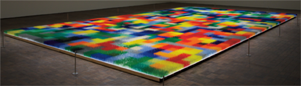   
Fig. 76 Liza Lou, *Color Field* (2010–2013)

Liza Lou is an American artist whose work has increasingly been
recognized and gained respect following the exhibition of *Kitchen*
(1991-1996) at the New Museum of Contemporary Art in New York City, a
work that recreated a modern kitchen with appliances, counters, various
food items and running water in glass beads. Glass beads have since
become her signature artistic form, with work like *Backyard* (1999)
using thirty million of them, but nothing quite reached the point of the
sublime in a manner reminiscent of Abstract Expressionists like Mark
Rothko or Barnett Newman than the 2015 installation of *Color Field* in
the Neuberger Museum, NY. Consisting of eleven beads of glass on all of
576 blades positioned on 1,196 tiles, its approximately 7.5 million
beads are arranged in a color scheme reminiscent of much of the art
we’ve discussed that emphasis a pixelated visual structure; opening and
closing patterns emerge in this site-specific work, but the grid remains
in such a fashion that each tile takes on the approximate appearance of
a pixel as if the entire work is a massively expanded close-up of a
digital image that is no longer available at a resolvable level. Yet,
this isn’t quite correct; as noted in articles,[^05-Chap5_2] the artist’s
website[^05-Chap5_3] and the curatorial statement of the Neuberger Museum where
it’s installed,[^05-Chap5_4] Lou’s work has increasingly shifted such that ‘I
became really interested in seeing what would happen if I took away
subject matter and just had it be about process’.[^05-Chap5_5] For a number of
years Lou lived part of the time in the KwaZulu-Natal province in South
Africa where she employed a team of local Zulu women to help produce the
work; in this case, and in related work, it is precisely the physical
activity that changes and enhances the material into its final artistic
form.

*Color Field* is most definitely not a work based on digital principles,
even if it appears to be that way. The sublimity of this amazing work is
present in the material of the work itself rather than the design, in
the shared physical activity that’s gone into making the art, in a
manner extending beyond the rough, solitary idiosyncratic independence
of the abstract expressionists to whom the work is indebted at least in
title. So why discuss *Color Field* in the context of the New Aesthetic,
and specifically in the context of teleology? Or, rather, as an object
that can be teleologically assessed? We will turn to this in more detail
in the next chapter but suffice it to say, at this point, that *Color
Field* represents the exact opposite of a conceptualization of an
autonomous, self-sustaining teleology in a very narrow and peculiar
Kantian or biological sense, wherein objects are observed as
self-sufficient and independently existing. Don Garrett provides an
excellent description of what it means to judge or assess an object
teleologically:

> a teleological explanation explains why something is so by indicating
> what its being so is for. Somewhat more precisely, a teleological
> explanation is one that explains a state of affairs by indicating a
> likely or presumptive consequence (causal, logical, or conventional)
> of it that is implicated in the state's origin or etiology. Such
> consequences often, if not always, take the form of ends, goals, or
> goods.[^05-Chap5_6]

The important thing that we add to Garrett’s description is the sense of
autonomy, of independence, to the object; it’s not just that there’s an
observable set of causal relations but also that those causal relations
are fixed in the single object. To make a teleological judgment about an
object is to see its purpose, and for us to see its purpose contained
within itself without the need for external justification. Precisely
because *Color Field* involved so many studio assistants, at all stages
of its physical development, its dependence on external input means that
it functions as a negative example illustrating the boundaries of the
New Aesthetic objects that appear entirely independent even if they
actually aren’t. *Color Field* occupies a position of liminality, its
digital origins just as clearly evident as its collective construction
methods, that allows us to observe the permeation of the digital into
*Color Field* to gauge how important its presence is, and how important
its negation is sustained through the intense and obvious craft of Lou’s
work.

The boundary between artwork that seems to be New Aesthetic and actually
is New Aesthetic is very thin, and seemingly permeable, but there are
some specific criteria that are involved. Perhaps the most important
criterion is not the fact that the work often is digital but that the
work is driven by the technology itself amidst a postdigital condition.
This has two corollaries. First, the work doesn’t necessarily have to be
digital but at least reflect the digital in its manifestation. Second,
art of the New Aesthetic must be just as much a product of technology,
the digital and/or the postdigital as it is a product of the artist; the
technology involved must be more than an opportunity or inspiration to
make new art but should be a fundamentally generative component
independent from the imaginative capacity and artistic skills of the
artist. Benjamin Grosser, an American artist and composer working in new
media, is an excellent example of this, especially in his series of art
works that are part of the ‘Flexible Pixels’ project. Grosser writes:

> The pixel is the fundamental unit of digital imaging, a square
> representation of a single color. Pixels are always the same size, and
> always arranged in orderly grids. This project \[‘Flexible Pixels’\]
> looks at what happens when you change these universally agreed upon
> standards. More broadly, I’m interested in how the construction of
> digital images alters our perceptions of reality. Does
> computer-mediated vision change how we see without computers?[^05-Chap5_7]

Grosser’s *Variable Mirror* (2009), {Fig. 77} one of the works that are
part of this series, shows how changes can take place in the standard
relationship between pixel and image, transforming the normative
paradigm that has been in place in the first digital images from the
late 1950s into something that is more organic in nature. 

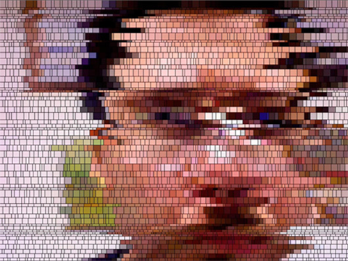   
Fig. 77 Ben Grosser, still image capture from *Variable Mirror* (2009)

The result of
*Variable Mirror*, *Self-Portrait 1x4x9* (2009) – an oil on canvas
representation of the digital art work *Self Portrait (animated)* (2009
– and other works is, as Grosser indicates, that the general nature of
our vision changes once pixels become increasingly independent entities.
Through his art Grosser asserts that the way we see the world is
fundamentally transformed not just when images are pixelated but when
the resulting pixelization assumes a natural presence. This is the
second most important criterion: the art must achieve a degree of
autonomy in appearance and effect. In many ways, this is the perfect
starting point to distinguish between artists whose work resembles New
Aesthetic objects by being products and artists whose work can be seen
as evidence of the presence of the New Aesthetic attitude through a set
of productive strategies. What Grosser is proposing is a deconstruction
of the pixel as a standard structure of digital perception, but because
the pixel remains such a fundamental element the deconstructive process
shifts. Deconstruction is a term that’s been misused and poorly applied
since Derrida’s *Of Grammatology* (1967), so much so that we’re
reluctant to use it, but here it seems appropriate in that the structure
being investigated – the fundamental language of digital visual
representation – begins to turn back on itself and takes apart its sense
of a fixed function; the existence of its idea as an underlying notion
embodied in *Variable Mirror* indicates more than just an ‘unpacking’ of
the pixel, as a fundamental elementary aspect of the visualization of
the digital work, but a relationship of the pixel to itself wherein the
repetition reveals that the role of the pixel is no longer just a part
of the representation but has an active identity. The perception of the
visual presentation of digital information to human experience is
revealed at an even more poignant and insightful level when it breaks
into the real and achieves in its presentation a state that Manovich
refers to as hybridity, where ‘software simulation substitutes a variety
of distinct materials and the tools used to inscribe information (i.e.,
make marks) on these materials with a new hybrid medium defined by a
common data structure’.[^05-Chap5_8]

*Variable Mirror*, and the other examples of work from the ‘Flexible
Pixels’ project, is an interactive work, during which the pixels used to
represent the viewers as they look at it change dynamically and randomly
but it’s clear that its status as an example of New Aesthetic lies in
the fact that the pixels are *actively* *representing* the viewers
rather than the artist doing the representing. Typically, a viewer’s
reaction to a video presentation of themselves looking at the art would
take place with the assumption that the fundamental units of the
presentation would be fixed; instead, what Grosser’s statement indicates
is an artistic positioning and an exploration that creates a heightened
awareness of the autonomy of the aesthetic agents involved – namely, the
digital object as an autonomously functioning agent in relationship to
the viewer – and the subsequent development of the pixel, at a
fundamental level, as a continuously mediating and deferring referent
that continually challenges any notion of certainty of identity,
position and function. To put it another way, Grosser’s *Variable
Mirror* is a perfect instance of the effect of the New Aesthetic in art,
in that the means of its production are not only an embodied reminder
for the viewer of its digital origins and its continuing digital
manifestation but also a reminder of the underlying uncertainty in the
confrontation with the postdigital that is a growing characteristic of
our world as it is driven by the specifics of its digital existence.

Grosser’s work has developed a strong and variable approach to the New
Aesthetic as an artistic strategy, representing a move beyond a form of
art that participates to one that drives the production of the New
Aesthetic by creating art objects that are fully New Aesthetic in their
autonomy. One thing that’s important to note about Grosser’s career is
that the work he has produced has been remarkably variable; some
instances of it are very traditionally ‘art’ (e.g. his work from the
late 1990s consists of abstract paintings) while other works break the
boundaries of what art is often to the point of potentially, and
erroneously, being labeled simply ‘programming’. We will return to
Grosser’s oeuvre in the next section, but it’s important to note here
that we believe diversity, in all of its myriad connotations, is a key
factor in identifying New Aesthetic art. By this we don’t simply mean a
diversity of forms but a diversity of references, models and paradigms.
In every example of New Aesthetic art that we’ve looked at our first
reaction has ranged from immediate and intuitive understanding of the
intention and the effect to a deep appreciation of the beauty of the
gestures and assertive aesthetic strategies, but all of this has been
coupled with a sense of confusion as to how we are supposed to
categorize New Aesthetic art. It couldn’t be that we should just call it
all ‘New Aesthetic art’ and be done with it, could it? At this stage,
that will have to do, but we also want to emphasize that one primary
element of all New Aesthetic art is diversity in form, function, intent,
interactivity and effect.

Emphasizing that an important part of our consideration of the New
Aesthetic is a recognition of the pervasive influence it has across the
variety of human experience leads to us to look at different forms of
art, which necessitates not only seeing evidence of the New Aesthetic
effects in the visual arts but seeing them across a variety of different
arts that have fallen outside of the scope of typical studies of art
historical investigation. The creative projects of a team of artists
working in dance and theatre, the Adrien M/Claire B Company, directed by
Adrien Mondot and Claire Bardainne in Lyon, France[^05-Chap5_9], is one of the
best examples of its presence across artistic disciplines. Since 2004,
the company has been producing work that ranges across various artistic
disciplines, but it would be fair to say that there’s always been a
performative, theatrical element driven by a virtual orientation in
software or manifested as installation art. What makes the work of the
Adrien M/Claire B Company interesting in the context of the New
Aesthetic is the direct incorporation of software, designed and
customized specifically for them, facilitating the interaction of the
artists’ activities with animated lighting and the projection of
digitally developed visual textures. Regarding the company’s artistic
intentions:

> They place the human body at the heart of technological and artistic
> challenges and adapt today’s technological tools to create a timeless
> poetry through a visual language based on playing and enjoyment, which
> breeds imagination.[^05-Chap5_10]

Different examples of their work reflect this exploration of the
conjunction of the human presence and digital constructions in an
imaginative fashion. *Convergence 1.0* (2005)[^05-Chap5_11] is a notable early
work, in which a juggler uses virtual balls and interacts with
phantasmal figures in ways that seemingly undercut physical laws of time
and space. It is an exploration of the human presence of the performer
while simultaneously being bound, in a suggestive fashion, by the
restriction of the technology. *XYZT, Les paysages abstraits* (2011)
{Fig. 78} already indicates in its title a concern for both a Cartesian
and a relativistic geography, which the artists describe as follows:

> Horizontal X
>
> Vertical Y
>
> Depth Z
>
> Time T
>
> These four letters are used to describe the movements unfolding at one
> point in space to reveal an imaginary territory. It is an exhibition
> landscaped by mathematical paradoxes, typographical illusions and
> metaphors in motion. Strolling through a luxuriant digital space,
> touching algorithms, sensing matter of light; some of the manifold
> imaginary fields are to be explored.
>
> A pathway, as if traversing, revisiting nature; a coincidence between
> geometry and the organic: between real and virtual.[^05-Chap5_12]

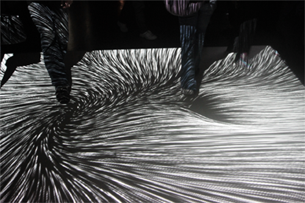   
Fig. 78 Adrien M / Claire B Company,
XYZT, *Les paysages abstraits* (2011)

The very idea of digital space as luxuriant is fascinating, as is the
notion of ‘touching’ algorithms, and through this conceptualization of a
physicality in the digital, the Adrien M/Claire B Company is effectively
presenting a notion of the digital as more than just an appearance of
data fields but as a manifest presence in our world. This is most
effectively realized in two different works: *Hakanaï* (2013) {Fig. 79}
and *Le mouvement de l’air* (2015). {Fig. 80} 

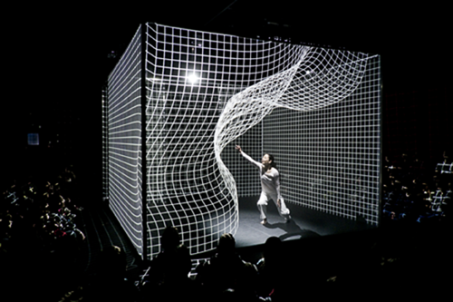   
Fig. 79 Adrien M / Claire B Company,
*Hakanaï* (2013)

   
Fig. 80 Adrien M / Claire B Company, *Le
mouvement de l’air* (2015)

With *Hakanaï*, which
means fleeting, ephemeral or transient in Japanese, the ‘performance’s
outcome is the revelation of a digital installation to its
audience’[^05-Chap5_13] as the software responds to sounds generated by the
dancer as she moves through the space and responds to imagery digitally
projected around her by the software. In *Le mouvement de l’air*, three
dancers move through an immersive environment of projected images; an
important element of this performance is the physical space which is
shaped responsively by the software. The designers hope this will be
understood as more than just a ‘technical achievement, what matters is
the attempt at creating a motion dreamscape by way of images’.[^05-Chap5_14] This
sense of digital presence in a cooperative, responsive partnership makes
both *Hakanaï* and *Le mouvement de l’air* particularly strong
candidates as examples of New Aesthetic art. *Hakanaï* is, according to
the artists, a transposition of a term normally associated with
processes in the natural world, but which here reflects the transience
of the interactive experience between the human and the digital as
separate artistic agents. *Le mouvement de l’air* takes this even
further, using aerial dance and other movements in an interactive
fashion that is never rehearsed nor previously animated.

> This “living light” is produced by video projectors and generated in
> real time by a set of algorithms \[…\] It is a mix of control room
> operated human interventions and onstage data sensors that outlines a
> precise writing of motions and generative behaviors. Thus, the images
> are never pre-recorded for a rigid show on an imposed rhythm: on the
> contrary, they breathe and move with the dancers and organize a new
> space for them to explore.[^05-Chap5_15]

It’s this notion of a ‘living light’ that breaks the company’s
performances out of the normal modes of theater or performance art and
makes them examples of the New Aesthetic. The notion that the light and
images are released freely to function collaboratively with the
performers implies a conceptualization of these effects that originate
and manifest themselves in and through the digital, which could be
disconcerting but isn’t; given the emphasis in theater and performance
art on the human element as the aesthetic agent or vehicle, when the
props become actors then something should seem amiss but it isn’t.
Adrien Mondot’s and Claire Bardainne’s work is beautiful and also
incredibly interesting because it signals a syncretic partnership
between two contrasting elements wherein one, the digital, signals its
increasing independent presence into the human performative components.
Ultimately, the overall effect exhibits many of the characteristics of
New Aesthetic art.

An important characteristic of New Aesthetic art is a level of
interactivity that is decreasingly seamless and increasingly apparent,
contradicting many of the tenets of modernist design. The independence
of the digital objects in the work of the Adrien M/Claire B Company
exemplifies this. Interactivity has long been an important aspect of
digital objects, a paradigm that shifts through different GUIs and
appears in various physical forms often accompanied by a great deal of
debate as to the level of skeuomorphism necessary to insure an efficient
experience. Thinking about the level of interactivity as a part of New
Aesthetic art might seem obvious – the whole point of software design
is, at times, a facilitation of users’ interaction and manipulation of
data, and artists using digital tools have gravitated to interactive art
precisely because the technology encourages it – but something different
takes place when the digital objects become New Aesthetic digital
objects. In terms of an aesthetic evaluation, a duality emerges in
postdigital and New Aesthetic objects, so that what we mean by
interactive isn’t quite the same anymore; rather, for our purposes,
interaction in New Aesthetic art is the seamless integration of digital
activity into the artistic process that occurs while simultaneously
having the digital aspects be autonomously responsive to the artist’s
choices and actions. We’re taking this notion of interaction directly
from Lev Manovich, who writes:

> After the novel, and subsequently cinema, privileged narrative as the
> key form of cultural expression of the modern age, the computer age
> introduces its correlate – the database. Many new media objects do not
> tell stories; they do not have a beginning or end; in fact, they do
> not have any development, thematically, formally, or otherwise that
> would organize their elements into a sequence. Instead, they are
> collections of individual items, with every item possessing the same
> significance as any other.[^05-Chap5_16]

This is a remarkably interesting thing to state. Manovich is strongly
asserting that interactivity is increasingly unavailable, that most
digital objects are merely means of facilitating access to databases of
information, meaning interfaces, or are predetermined in a standardized
modularity, meaning that they exist not only as interfaces but also as
building blocks, rather than offering genuine forms of interaction with
the objects themselves. Furthermore, Manovich’s implication in
suggesting the primacy of standardized modularity is the basis for his
disavowal of traditional narrative structures that are normally
considered an essential aspect of non-digital, traditional art.
Manovich’s disavowal of narrative is an exclusionary theoretical
strategy favoring an autonomous agency to digital objects that don’t
create experiences but shape data sets. Amidst the increasing efforts of
governments to control their populations through security devices like
facial and pattern recognition, this reduces the participation of
citizens to dehumanized and inactivated information references. Movies
like *Metropolis* (1927) and *Minority Report* (2002) and television
shows like *Person of Interest* (2011-present) may represent a dystopic
vision of computer programs (or human ‘programs’) observing our every
moment, a prospect most people find a frightening invasion of privacy;
far more dehumanizing is the fact that most people are classified as too
uninteresting to warrant any extended attention while they are, still,
continually subjected to this surveillance. Manovich’s art counters this
by mimicking it, trying to make the datafication of our lives in his art
the means to understand and respond to its negative effects in our daily
lives.

## The Individual Politicalization of New Aesthetic Art

A number of New Aesthetic artistic responses explore this situation and
we want to highlight three of them: the work of Adam Harvey, Zach Blas
and the collective Metahaven. Symptomatic of this response to the agency
of interactivity is the work of Adam Harvey.[^05-Chap5_17] Harvey’s art has
become well known for being at the forefront of the artistic exploration
of security and privacy issues, in particular focusing on the imbalance
and power asymmetries between surveillance technology and basic human
rights. Three recent projects starkly project Harvey’s clear
understanding of the insidiousness of surveillance technology and its
negative effects: *CV Dazzle* (2010),[^05-Chap5_18] *Stealth Wear* (2013) and the
*Privacy Gift Shop* (2013)[^05-Chap5_19] that was on display in the New Museum,
New York City, in 2016. *CV Dazzle* {Fig. 81} is our primary focus, as
it’s clear that the other two projects share their origins and concerns
with it; inspired by the camouflage patterns used by British and
American navy ships during WWI that were based on modernist art styles
of geometric patterns,[^05-Chap5_20] *CV Dazzle* similarly is an effort to
obscure or defeat pattern and facial recognition algorithms used by
security services across many levels of contemporary society from
national government organizations to local shopping malls; moreover it
is a conceptual reaction to OpenCV,[^05-Chap5_21] an open sourced software used
for facial recognition, and a clear response to the Janus program’s
efforts to utilize social media to improve facial recognition with
algorithmically driven databases.[^05-Chap5_22] 

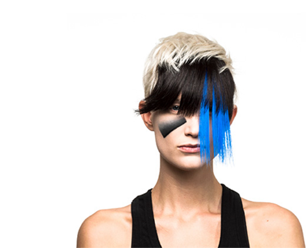   
Fig. 81 Adam Harvey, *CV Dazzle* (2010)

Much of current thought regarding
surveillance is extremely pessimistic, rightly so in regards to most
concerns, with Metahaven recently noting:

> The preemptive electronic surveillance of potentially every global
> subject can be thought of as a way for governments to weaponize
> themselves against the capacity of every person or group in society to
> change spontaneously – expanding the state’s monopoly on violence into
> precognitive policing of all thought and action \[…\] Today, every
> person’s capacity to evade surveillance is determined by their
> position in a feudal matric of technological and institutional
> dependencies. Almost all antidotes to this patronizing system of
> global surveillance go under shades of black.[^05-Chap5_23]

*CV Dazzle* is one of those exemptions, an almost aggressive artistic
response to governments’ efforts at creating a self-justifying program
of policies and technological tools designed to dismantle individual
privacy. Whereas Metahaven is absolutely correct to describe these
intrusive efforts as the violent weaponization of surveillance – we’re
adding to their description that the process of weaponization itself has
been violent, adding to the violence in an exponential fashion,
something we believe is not out of line with their thinking – *CV
Dazzle* is an effort to weaponize individual appearances in an effort to
oppose governmental incursions into privacy. Utilizing makeup, hair
styling, clothing and accessories in a manner that parallels high
concept fashion, Harvey is addressing the need to avoid not just
detection but constant observation: it’s not so much that the average
citizen needs to camouflage themselves but that the continual
identification, location and tracking of their persons is more than just
intrusive in that it establishes a continual condition of suspicion; we
are being observed not to protect us from threats but because it is
believed any one of us might become a threat. The result, and the
artistic value of *CV Dazzle*, is in the active confrontation that the
user employs against surveillance; by using makeup, hairstyle and
fashion design in a manner that is excessively visible to the ordinary
people the ‘dazzled’ individual now hides in plain sight.

This last point is where *CV Dazzle* enters the realm of the New
Aesthetic as art, as noted in the curious remark in *dis* magazine that
‘CV Dazzle is an unobvious style of camouflage because its eye-catching
patterns and colors draw attention instead of hiding from it’[^05-Chap5_24] along
with the paraphrased instructions, borrowing from Harvey’s own website,
that enhancing makeup should be avoided, the nosebridge should be
obscured, the area around the eyes needs to appear altered and, perhaps
most importantly, ‘Remain inconspicuous \[…\] For camouflage to
function, it must not be perceived as a mask or disguise. NB: Wearing
masks or disguises can be illegal in some cities, including here in
NYC.’[^05-Chap5_25] What’s curious about these instructions revolves around the
contrasting characterization of these strategies to both remain
unobvious and to not demand attention, which is almost an impossibility.
To put it another way, it’s clear that there’s a difficult balance
between not being identified and not being noticed, a difficulty that
*CV Dazzle* virtuously fails at and, in a way, it’s precisely at that
point of failure that *CV Dazzle* becomes art. This contrast appears
also in the article ‘Reverse-engineering Artist Busts Face Detection
Tech’ that notes that *CV Dazzle* ‘combines hipster fashion aesthetics
with hardcore reverse engineering of face detection software. The goal:
to give individuals a low-cost and visually stimulating means to prevent
their likenesses from being detected and cataloged by face-recognition
monitors.’[^05-Chap5_26] *CV Dazzle* is dependent on a heightened awareness of
being observed with a desire or need to avoid being observed precisely
by being almost excessively observable, an attitude based entirely on a
heightened awareness that digital surveillance is far more threatening
than human surveillance. Our focus on this contrast is based on our own
awareness of the conditions that make Harvey’s art possible, equally
evident in the work from the series *Stealth Wear* {Fig. 82} that is
described thus: ‘Collectively, Stealth Wear is a vision for fashion that
addresses the rise of surveillance, the power of those who surveil, and
the growing need to exert control over what we are slowly losing, our
privacy.’[^05-Chap5_27] 

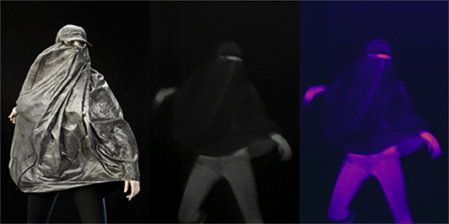   
Fig. 82 Adam Harvey, *Stealth Wear* (2013)

Without the increasingly effective digital technology
driving facial recognition, without the generation of ever larger
databases, there’s no need for *CV Dazzle* and *Stealth Wear*; it is
precisely the conditions they seek to counter that define the validity
of its efforts, but it’s also precisely the impossible success of these
efforts that define their artistic value. As the description of the
Janus program notes: ‘Data volume now becomes an integral part of the
solution instead of an oppressive burden.’[^05-Chap5_28] It’s as if the volume of
data has taken on a life of its own, self-determinatively driving
initiatives in an autonomous fashion, with *CV Dazzle* reflecting an
unconscious concession on the part of its participants that their
participation is a foregone conclusion. Not only does this drive *CV
Dazzle* and *Stealth Wear* into the category of New Aesthetic art but
because the first is itself merely the product of research that consists
entirely of a set of programmed instructions interfacing with
algorithmically driven surveillance programs, because the second are
‘fashion’ items with a strong political effect, and because both are
sets of non-digital products whose effects are entirely digital because
the need they address is digital makes them almost gloriously and
interdependently substantiated at an artistic level through the
repetition of their own aesthetic conditions. Because the artistic
material’s subversive effect is dependent on its programmed response to
its subject matter, whereby the subject becomes the grounds for the
subversion of the subject, *CV Dazzle* and *Stealth Wear* are two of the
best examples of New Aesthetic art, as is much of the work of Harvey,
because they negotiate the increasingly complex and irresolvable
relationships of the digital and the ordinary. Once the repetition is
there, once the aesthetic programming takes place self-referentially, an
important shift is evident.

In line with Édouard Glissant’s notion of opacity, that focuses on
breaking the divisions between hierarchies in the art world through a
reconsideration of postcolonialism that emphasizes a lack of
transparency against the continual demands of social and cultural
structures to account for oneself, Zach Blas’ work addresses many of the
same issues as Harvey’s. For one, it also addresses the complex issues
of facial recognition as an intrusion into privacy rights, but his
*Facial Weaponization Suite* (2013)[^05-Chap5_29] {Fig. 83} takes a different and
more intriguing artistic strategy.[^05-Chap5_30] 

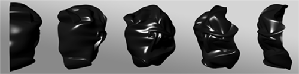   
Fig. 83 Zach Blas, *Facial Weaponization
Suite* (2013)

As noted by Blas, *Facial
Weaponization Suite* was created in part as a response to the New York
City Police Department’s invocation of the 1845 law banning two or more
people congregating together while wearing masks during the 2011 Occupy
Wall Street movement; not only did the NYPD arrest protestors for
wearing Guy Fawkes masks, they then subjected them to iris scans for
inclusion in a database of offenders as a condition of bail or release.
Blas asks:

> Why does the masked protestor pose such a great threat to the state,
> resulting in the police’s willingness to deploy a 168-year-old law
> originally designed to prevent Hudson Valley tenant farmers from
> dressing in disguise and rioting over debt and eviction? Why does
> facelessness fuel the state of New York to surreptitiously construct
> incentives for protestors to willingly agree to biometric scans?[^05-Chap5_31]

The answer to that question seems obvious – there isn’t much difference
between the aims of 19th century rioters and the Wall Street protestors,
especially as both of them had very legitimate grievances and aims – but
Blas’ inquiry after the value of facelessness is itself very
interesting. Protestors’ identities are clearly valued by those trying
to control the apparatus of social structures. {Fig. 84} 

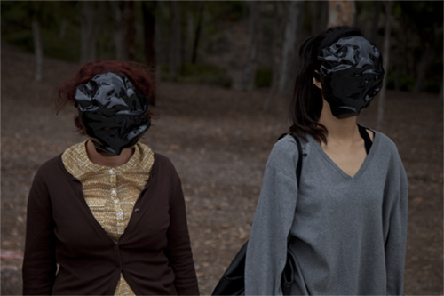   
Fig. 84 Zach Blas, *Facial Weaponization
Suite* (2013), ‘Protest Line / Face Off’
Tableau Vivant

For Blas ‘the
face becomes a site of ever increasing control and governance’ and his
*Facial Weaponization Suite* is specifically a means of arming
individuals against those efforts at control in a manner similar to
Berry’s articulation of ‘obfuscated code’[^05-Chap5_32] resulting in ‘data
exhaustion’.[^05-Chap5_33] At the same time, *Facial Weaponization Suite* is more
than just an experiment but is an elegantly aggressive artistic response
to a crucial issue of our contemporary world, like Hito Steyerl notes:

> While a lot of contemporary technologically oriented art tries to
> resuscitate the wreckage of Futurism, or overidentifies with
> strategies of surgical marketing and apple polishing, Blas’s work
> insists that one doesn’t need to brand oneself into voluntary
> servitude or to eagerly identify with the aggressor. It may well
> suffice to fuck him. Or her. Or it. It’s such a reasonable idea and
> possibly much more fun too! Fuck military technology. Fuck
> infrastructure. Fuck drones. Fuck protocol ‘til it hums with pleasure.
> Throw in glitter and some shiny sensors. And after a few million
> years, there might be a smashing progeny![^05-Chap5_34]

In response to Shoshana Amielle Magnet’s argument that biometric
recognition is a failure because human identity cannot be reduced to a
data set, and working through Agamben’s idea of exposure vis-à-vis
Levinas, the *Facial Weaponization Suite* is a set of masks made in
community workshops that deny facial recognition software
algorithmically applicable data. While functioning as masks, the objects
of the *Suite* ‘are weapons of defacement, modes of escaping the
recognition-control of the face, a queer illegibility that disallows
easy calculations and categorizations of the face’.[^05-Chap5_35] This makes them
dramatically different from Harvey’s work (though both are equivalent
aesthetically, in our opinion), not simply because Blas’ work consists
of actual objects rather than aesthetic strategies of concealment but
also because their overt nature as objects is a demonstrative and
declamatory response to the intrusion into privacy; driven by communal
production methods that incorporate discussion of the related issues,
participants are scanned by a Kinect and a single mask is generated in a
non-averaged manner of all of the participants, making the communal
statement even more substantial because it is heightened by a public
intervention. Where the New Aesthetic comes into the work isn’t simply
at the level of the object’s production or its motivation but, similar
to Harvey, out of the necessary conditions of the increasingly
digitalized nature of the world and our place in it. While Harvey’s work
might be unfairly construed as a fashion statement of sorts, and is
complicit with the conditions its protesting to a degree, Blas’ *Suite*
is about the creation of art as weapons with a singularity to their
appearance that is unmistakably one of denying the value of
identification even to the point of denying social reciprocity through
defacement. As Blas names them: ‘interfaces in other modalities that are
not readable to those that aim to control but rather communicates to all
those that strive to liberate’.[^05-Chap5_36] In short, Blas’ *Suite* is an
artistic acknowledgement, through rejection, of the existence of the New
Aesthetic as a pervasive influence in our lives; it is a rejection of
digital modalities as agents that had found their conceptual reification
already in the NYPD’s valuation of the protestors’ identities, a
condition which most certainly did not originate in the human agents of
the police but out of its ever changing nature as an institution.

## The Collective Politicalization of New Aesthetic Art

In a way with which we completely agree, the collective Metahaven[^05-Chap5_37]
has been described as ‘one of the most theoretically informed,
strategically adept and articulate groups of thinkers operating in
graphic design’.[^05-Chap5_38] As noted by Sarah Hromack in *Frieze* magazine,
Metahaven’s work can be identified as a response to the specific
conditions generated by the introduction of web 2.0 around the turn of
the millennium, and it’s worthwhile summarizing her position. For
Hromack, a major shift starting taking place in the internet in the
1990s – described in two important essays: Michael Rock’s 1996 ‘The
Designer as Author’[^05-Chap5_39] and Ellen Lupton’s 1998 ‘The Designer as
Producer’[^05-Chap5_40] and related to Walter Benjamins’ 1934 essay ‘The Author
is Producer’ – that signals not only an increasing level of
interactivity through the internet as a medium but also an increasingly
fraught level of a politicized driven denial of the central and
authoritative voice of the author. Hromack writes:

> The fallout from Web 2.0 has been nothing short of astounding. The
> internet that once seemed open and free has been transformed into a
> dystopia of double meanings and commercial and political dealings.
> Ingrained psychological dependencies have developed out of brightly
> blinking “user friendly” experiences, monitored by businesses and
> government agencies.[^05-Chap5_41]

She traces this fallout as a direct catalyst for the formation of
Metahaven. Metahaven has been described insufficiently as an
international collective of graphic designers, and it might be more
accurate to describe them as a group of artists whose work draws from
the changing graphic nature of the world in a way that is disruptive and
disconcerting, but at its roots it consists of the Amsterdam based
artists Vinca Kruk and Daniel van der Velden. Their largest publication
to date was *Uncorporate Identity* (2006), a monumental treatment of the
relationships between databases, national identity, networks as social
objects driving social norms, branding and the very idea of readability
about which one Amazon customer wrote:

> it is a very bizarre book.\
> \
> The typography is okay, the printing and binding is good \[…\] but the
> design is shockingly awful: there are weird effects that you shouldn’t
> use if you want to communicate trustworthiness and confidence such as
> amateur effects like drop shadows, hyperactive gradients and also
> seems to be on trend with this “exposed content style” – I would go so
> far to say it looks like very bad 90s Flash websites with all these
> superfluous elements that generate a feeling of schizophrenia and
> anxiety almost. I read the texts but they don’t really offer any
> practical advice or useful analysis about branding and corporate
> identity useful to a branding designer – for example how to deal with
> the internet and social media, what good form and harmony in
> application is and so on.[^05-Chap5_42]

In a way, this review is absolutely telling: the book is bizarre, it
does break many of the assumed rules of good design, it eschews
trustworthiness and reeks of a bad use of Flash in printed form, and
ultimately drives a sense of distrust into a dialogue focused on
branding and corporate identity.

Metahaven’s aesthetic impulses are driven by a striking awareness of
artists’ complicity in the increasingly overwhelming nature of the
digital in the world, and are neatly encapsulated in a statement from
the trailer for their film project *The Sprawl* (2015): {Fig. 85} ‘We
were very likely spreading fictitious information ourselves, but
couldn’t help it.’[^05-Chap5_43]
 
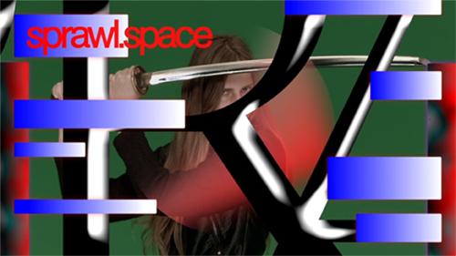   
Fig. 85 Metahaven, *The Sprawl* (2015)

Metahaven’s work takes exception with the
internet’s general status as a neutral medium by challenging our
complicity with it. For most users, the internet has not become a medium
by which we interact with others nor a generative new field of social
discourse but instead has simply become a utility, with the consequences
being that we unthinkingly, uncritically accept the parameters of its
usage because we’ve become habituated and conditioned to its
manipulations. For Metahaven, this situation needs to be transformed,
and the best means of doing so is through the use of methods that borrow
from the internet’s own means of manipulation, with the aim ‘to explore
how fantasy and propaganda have now gained prominence over transparency
and accountability \[…\] The relationship between social media and
geopolitics is not just about liberal democracy anymore but about the
fashion of spectral totalitarianism.’[^05-Chap5_44] Through a changing membership
and a constant shift in the forms of production, the group has taken on
ephemera-like visual objects of corporate identity, webpage design, GUI
forms, barcodes and URL addresses in a manner which appears
directionless at first but, on further examination, quickly is
understood as an attenuation to nationalist digital iconographies and
their inherent conflict with multinational and even hypernational ones
(by which we corporate entities that have assumed the status of
international sovereign entities). Metahaven gives more than a simple
aesthetic response but rather creates an active aesthetic running
counter to prevailing tendencies, distinguished by its incorporation of
corporate representational forms that appears to be sustained by the
visual link to those corporations while questioning the underlying
persuasiveness of the neutrality of those same entities amidst the
supposed ‘equality’ available to all entities in the capitalist system.
In a manner similar to the Neue Slowenische Kunst group’s appropriation
of National Socialist imagery that was mixed with propaganda from the
Tito era of Yugoslavia, Metahaven has produced objects whose use-value
is both questionable and secure in a self-contradictory dialectic; the
scarves and t-shirts sold as part of the *Dark Store* (2012)
installation in the Artists Space at the Berlin Contemporary Art Fair
were both collectable luxury items and being covered in camouflage and
the Wikileaks logo were simultaneously protests against government
privacy intrusions.[^05-Chap5_45] Metahaven’s recent book *Black Transparency:
The Right to Know in the Age of Mass Surveillance *(Sternberg Press,
2015) raises similar issues while equally being a confounding text that
is far from a traditional book but that functions as a reading
experience while at the same time serving as a manual to counter the
effects of the digital age. One review captures its intense
contradictory effect, a governing feature of Metahaven’s aesthetic
strategies:

> Part essay, part zine, the Amsterdam-based design studio’s book
> focuses on the “how” as opposed to the “what” of transparency, zeroing
> in on the paradox that the fight for accessible knowledge (by groups
> such as WikiLeaks) is often carried out through necessarily opaque and
> propagandistic means. *Black Transparency* swallows its own tail in
> pursuit of its subject, following the un-coiling and re-coiling of
> ideology and information at the hands of whistleblowers and
> organizations.[^05-Chap5_46]

It’s as if Metahaven is proposing that the only effective counter to the
complete erosion of our private lives, our individuality and the means
of our own self-determinativeness is to set up a reified antithesis in
the Hegelian sense, opposing the dominance of the digital world as a
thesis. In line with Marshall McLuhan’s idea of a ‘counter-environment’
in his 1967 essay ‘The Invisible Environment: The Future of an
Erosion’,[^05-Chap5_47] Metahaven’s *Facestate* (2011) is a complicated
installation at the Walker Art Center consisting of various objects
apparently produced as examples of graphic design in line with the
corporate identity of Facebook but clearly opposed to its aims. ‘We are
interested in the ways in which Facebook and government, Facebook and
employers, Facebook and friends, Facebook and enemies constitute a power
arrangement, and the way in which this constellation might influence
politics, currency, and the social contract.’[^05-Chap5_48]

Metahaven’s concerns for the totalitarian effect of increasingly
autonomous digital objects of control is shared worldwide, though most
often only in a nascent form in comparison to their sophisticated
approach on a multiplicity of levels, and their targeting of Facebook is
emblematic of the concerns of many other artists. It’s been pointed out
that their work ‘questions the purpose and value of design in a neurotic
and treacherous era of geopolitical instability, economic recession,
environmental crisis, cultural and moral confusion’[^05-Chap5_49] but just as
importantly their work questions the value of our existence as end
users, bringing up the notion that we are nothing but components of the
technology that give it a functioning life rather than individuals able
to utilize our digital devices freely to our own ends; responding to
this art leads to the inevitable conclusion that we don’t constitute the
network of power but are merely components of the network’s power.
Metahaven’s strategy of countering corporate propaganda with
appropriated propaganda seems as effective as any other strategy these
days, but is it capable of being effective outside of a ‘westernized’
context? What happens when the invasion of the digital is so rapid, when
changes in technology are so swift, as they have been in developing
countries of the ‘non-western’ world that no response is even possible
because the territories have already been claimed and secured? Typing in
‘non-western new aesthetics’ gets you zero relevant results on Google,
but anyone who has travelled to Africa, South America, India and
‘less-developed’ parts of Asia has experienced the widespread impact of
internet culture. Perhaps more so than in the westernized social and
cultural structures, where the increasing inclusion of the digital has
been relatively gradual, the effect of the internet and its subsequent
disappearance into the portals of smartphone apps as a means of
navigating, defining and shaping human experience has been remarkably
profound; whereas many in the developed world experienced the shift from
dial-up modems (and the joy of moving from 14.4k to 56k!) to dedicated
ISPs through cable, most people in the developing world have experienced
the digital transformation through smartphone simply because it was more
economical to build centralized cell phone towers than to try and
implement land lines to every home. When digital content is provided
exclusively through smartphone apps, with the individualized specificity
of that experience governing the use-experience, then the shift from a
non-digitized world to a digitized world is even more abrupt. This has
resulted in some interesting effects. Very recently the Telecom
Regulatory Authority of India forbid zero-rating mobile internet plans
because they violated net-neutrality,[^05-Chap5_50] thereby denying Mark
Zuckerberg’s plan to provide free internet through mobile phones across
India through a Facebook portal called ‘Free Basics’, after having
prompted protests[^05-Chap5_51] and an organized campaign.[^05-Chap5_52] What’s strange,
however, is that the debate isn’t quite settled; while many in India and
elsewhere oppose Zuckerberg’s plan because it violates net neutrality,
the very idea of net neutrality may no longer exist in part because the
internet no longer exists. The notion that ‘smart villages’ would be a
means of relieving the burden of crowded urban centers seems fanciful at
best, as does the notion that ‘increased’ access to information will
invariably lead to improvements in people’s lives regardless of whether
or not this information is filtered through portals like Facebook or
Google. Digital organisms, institutions, or functional objects (however
you want to identify them) have shifted from being automatons within the
internet to autonomous agents defining the internet.

This position is evidently symptomatic of the effect of the New
Aesthetic across a broader range of cultures. The majority of artists
discussed in this book are European, American or Japanese, presumably
because the work by these artists is more readily accessible through the
internet and art exhibitions in major Western cities where funding and a
critical mass of technological means makes it easy. But what’s happening
in the rest of the world? Is the New Aesthetic a phenomenon or an
attitude that is confined to a Western setting? Even the briefest of
consideration of these questions would correct the tendencies to be
absorbed with just one location, and a recent article in *The Guardian*
sent us looking at African art and the presence of the New Aesthetic in
a politicized social context.[^05-Chap5_53] A prime instance of this is Urban
FabLab’s project African Fabbers,[^05-Chap5_54] an effort to bring together
European and African maker communities with an emphasis on open source
software and alternative approaches to 3D printing. Run in two sessions
– in Marrakesh (2014) and Dakar (2014), both associated with art fair
events in those cities – its aim was to create ‘an opportunity to
creative clusters from different continents and backgrounds to meet up
and share knowledge, to investigate the interaction between African
material systems and computer aided manufacturing technologies, to
create ecological prototypes through an advanced craftsmanship approach
for sustainable living’.[^05-Chap5_55] Two interesting elements of the African
Fabbers projects are noteworthy: first, there’s an emphasis on the
collaboration between levels of technology, with the implication being
that older forms must necessarily be paired with newer, digital forms
for their continued survival; second, such a collaboration itself
necessitates an inherent valuation of advanced technology and its
associated cultural forms or, to put it another way, despite the best of
intentions this is still a form of cultural colonialism driven by
technology. The Venn diagram on the main page for African Fabbers shows
it as the intersection between local technologies, digital fabrication
and computation design but the imbalance is plainly evident. How to
counter this? The Afropixel[^05-Chap5_56] festival at Ker Thiossäne, Dakar
certainly represents one effort. Begun in different forms in 2002, with
the first official Afropixel event taking place in 2008, it’s based on
the idea that ‘Technology doesn’t prevent tradition from existing, it’s
the encounter between the two that is interesting’[^05-Chap5_57] but at the same
time it exhibits all of the hallmarks of New Aesthetic art with
assertions like ‘Any designer will tell you that a pixel is the smallest
element of a picture; a dot on a page. On its own, a pixel doesn’t give
much away. But when it joins other pixels it forms a whole, contributes
to a mass, and gives meaning to whatever it is it represents’[^05-Chap5_58] on
the website of its sponsor Moleskine, who provided all of the
participants with Evernote ready notebooks in 2014.

It’s clear that a collective response is occurring in a New Aesthetic
context, but individual artists are also working in a similar fashion.
Folasade Adeoso has become well known both as a model from Nigeria and
as an artist in her own right; her digital work consists of juxtaposed
images that are often haunting, nostalgic, and jarring in their contrast
between references to an older way of life and to digital artifacts.
Especially in her series ‘Kinfolk’ (2014) {Fig. 86} there is an
indication of Adeoso articulating a sensibility informed by technology,
utilizing it for aesthetic purposes, aware of the temptations for its
overuse, but deeply resistant to its intrusive and pervasive influences.

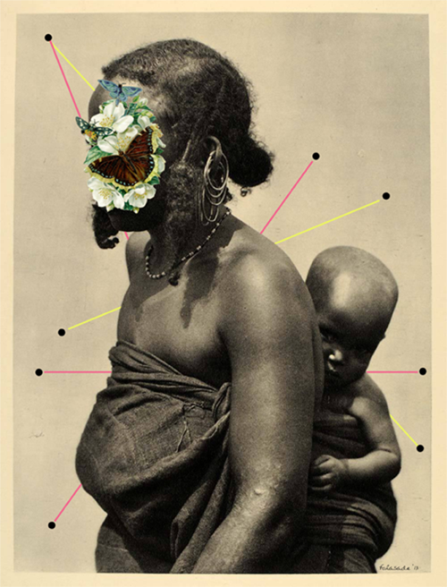   
Fig. 86 Folasade Adeoso, *Motherhood*,
from the series *Kinfolk* (2014)

Alexander Ikhide’s work functions in a similar manner as Adeoso’s but is
more informed by an urban sensibility; originally from Nigeria and now
working in London, Ikhide’s collages mix the old and the new but in a
way that’s strikingly more contemporary, evidenced especially in his
collaboration with the photographer Seye Isikalu on the project *Don’t
Police My Masculinity* (2015)[^05-Chap5_59] that incorporates the beautiful
phrase ‘Love Yourself As Much As Kanye Loves Kanye’ by asserting: ‘In a
world where Hyper-masculinity is unfailingly sold to us on a daily
basis, “Don’t Police My Masculinity” playfully explores ideas of
self-love, self-acceptance & general care-freeness of the Black Male in
particular. Happy valentine’s day people! love yourselves first!’[^05-Chap5_60]
{Fig. 87}

   
Fig. 87 Alexander Ikhide, *Love Yourself as
Much as Kanye Loves Kanye*, (2015)

## Sociological Interactionist Impacts of New Aesthetic Art

The German artist Aram Bartholl[^05-Chap5_61] has been one of the major figures
to emerge within the context of the New Aesthetic. Educated at the
Berlin University of the Arts with an engineering degree in
architecture, Bartholl first came to notice with his project *Bits on
Location* (2001)[^05-Chap5_62] which investigated the possibilities involved in
the spatial repositioning of information sources, by attempting ‘to
connect, through a series of examples, the digital content from
locationless global data networks to physical space’[^05-Chap5_63] and signaling
a primary concern Bartholl’s work has had ever since; much of his work
exaggerates the tensions that exist between specified and despecified
localization and articulates the continuous functions of contrasts and
overlays between digital realities and the normal world. Two projects
have introduced Bartholl’s work into the broader art world: *Maps*
(2006-10)[^05-Chap5_64] and *Dead Drops* (2010-12).[^05-Chap5_65] *Maps* {Fig. 88} has
been a series of large scale sculptural reproductions of Google map pins
used in a digital context to mark out highlighted locations and search
results; Bartholl has created a series of life-sized versions of these
pins to call into question the relationship between the real and the
digital world with a clear assertion that this relationship is
increasingly mutually dependent. 

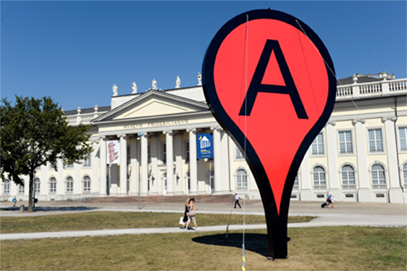   
Fig. 88 Aram Bartholl, *Map* (2013) 

The Google Maps pin, designed by Jens
Eilstrup Rasmussen in 2005 as an integral part of the launch of Google
Maps, has become so ubiquitous that it was acquired in physical form by
MOMA in 2014; in Bartholl’s use, {Fig. 89} it’s become a sculptural
intersection that highlights the complicated overlapping relationship of
the way the world is represented with what is represented. 

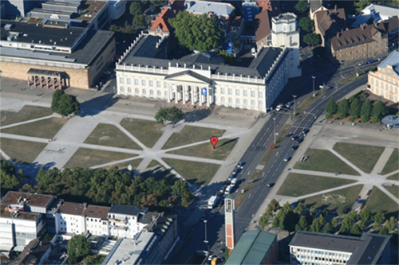   
Fig. 89 Aram Bartholl, *Map* (2013)

While
‘Google’s maps have revolutionized how we interact with the world, how
we perceive space and even how we navigate through it’[^05-Chap5_66] Bartholl’s
work questions the revolution itself by reversing the supposed
continuousness of the relationship between the pin and the actual
location, causing a heightened sense of a discontinuous relationship
between the Google map pin and Bartholl’s pin. *Dead Drops* {Fig. 90}
has taken this even further, as described by Bartholl:

> “Dead Drops” is an anonymous, offline, peer to peer file-sharing
> network in public space. USB flash drives are embedded into walls,
> buildings and curbs accessible to anybody in public space. Everyone is
> invited to drop or find files on a dead drop. Plug your laptop to a
> wall, house or pole to share your favorite files and data. Each dead
> drop is installed empty except a readme.txt file explaining the
> project. “Dead Drops” is open to participation. If you want to install
> a dead drop in your city/neighborhood follow the “how to” instructions
> and submit the location and pictures.[^05-Chap5_67]

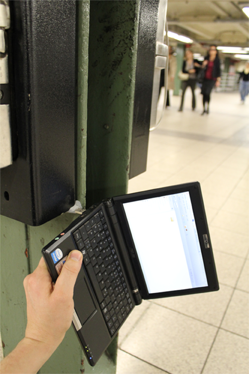   
Fig. 90 Aram Bartholl, *Dead Drops* (2010)

Whereas *Maps* is an intervention, *Dead Drops* is a much more
participatory art project that Bartholl has allowed to be copied, pasted
and hacked worldwide, both metaphorically and literally, so that the
idea itself has taken on a life similar to many instances of conceptual
art from the 1960s which eschewed object production and commodification.
Creating a peer-to-peer network that is more physical rather than
virtual, like in the form of bittorrents, *Dead Drops* have served not
only as locations to download files from but also to upload to because
the USB drives are always public; borrowing a term from an information
sharing method used by spies, Bartholl’s project has become a set of
sites that are either remarkably banal or dangerous, as in the case of
one Cologne instance where plans for bombs were discovered on the USB
drive,[^05-Chap5_68] but their artistic intent is still clear. More than just
creating a community, though it has certainly done that with thousands
of dead drops appearing worldwide, it embodies an artistic opportunity
to share and communicate information, ‘a unique space for uncensored
public conversation into the physical structure of the city’[^05-Chap5_69]
counter to any digital network’s reach.

Bartholl’s career has consistently been an exploration of the way the
real and the digital overlap, even when its use of spontaneity has
verged on an almost ridiculous level of fandom and opportunism. In 2009,
while having coffee, Bartholl spied a Google Streetview car driving
outside and proceeded to chase it down the street; almost a year later
he appeared in a series of images on Google Streetview, which were
subsequently appropriated as *15 Seconds of Fame* (2010).[^05-Chap5_70] {Fig. 91}

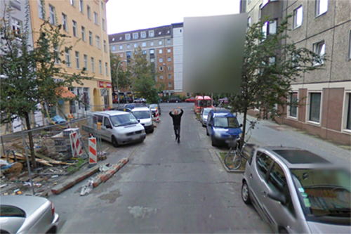   
Fig. 91 Aram Bartholl, *15 Seconds of Fame*
(2009–2010)

Creating a further level of critical depth to his work, Bartholl’s *Full
Screen* (2014)[^05-Chap5_71] {Fig. 92} was a curated project with a number of
well-known artists contributing works that were displayed on Samsung
Galaxy Gear smartwatches. 

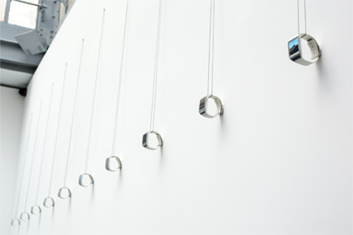   
Fig. 92 Aram Bartholl, *Full Screen* (2014)

Viewers were invited to wear the art and
interact with it in a limited fashion, driving the questions that
Bartholl has been examining in his art even further. In an interview
Bartholl asks ‘The underlying question is, in what ways we can represent
digital art?’[^05-Chap5_72] and his answer is a direct rejection of the
continuing relevance of the screen as a medium. It’s not just that over
the course of the last fifty years the digital world has shrunk to the
size of a watch and the interface has transitioned from room-sized
objects with tiny monitors whose only representation of data consists of
low resolutions text; the physical manifestation of the objects has
changed and with it our conception of what data and its provider the
‘internet’ is. This providing has shifted in space and time; in more
ways than just by making data available no matter where the user is, new
devices (themselves quickly outdated in terms of technological
capability) make the consumption of data literally timeless and
spaceless, disconnected from the physical realm, and especially
ironically so when in the form of wristwatches. While acknowledging that
screens will continue to exist for a long time, often in a nostalgic
capacity, and emphasizing that point with the reduplication of imagery
from small screens to a huge LED screen, nevertheless Bartholl points
out that ‘There will be screens where you don’t have the rectangle
anymore. It’s hard to tell, and it’s going to take quite a while, but
the next paradigm shift is going to happen soon.’[^05-Chap5_73] We are so used to
the idea of ‘seeing’ the internet through screens, but once haptic
interfaces, voice commands and gestural forms of interaction were
introduced the point of contact shifts from a specific referential
interface to a decentered form of interaction that is positionless
precisely because of its fluid nature. This move away from screens as a
mediating but limited form of interactive structure is something that
appears in an even stronger sense as an aesthetic strategy in the work
of Hito Steyerl.

In many respects, the artwork produced by Hito Steyerl is one of the
best examples of art of the New Aesthetic. In fact, Hito Steyerl as both
an artist and an art critic has been a driving force behind many of the
ideas and work of the New Aesthetic, setting the parameters of different
aesthetic strategies as well as identifying work by other artists. Born
in Munich in 1966, trained in philosophy at the Academy of Fine Arts,
Vienna and later studying at the Japan Institute of the Moving Image and
University of Television and Film Munich, she has exhibited widely at
documenta 12, the Venice Biennale, and the Istanbul, Taipei and Shanghai
Biennials, and has had numerous solo exhibitions at major museums
worldwide and teaches New Media Art at University of the Arts in Berlin.
Steyerl’s work is complicated, appearing in cinematic form, essays and
books, art installations and digital objects, but we believe it’s
appropriate to focus on two intersecting threads that drive her work.
First, Steyerl maintains a refusal to disavow herself as the artist from
her productions, especially in the case of films that are more
documentary in nature, because she believes in the importance of the
personal presence of the artist conveyed ‘by the idea that you cannot
address a social issue productively without first understanding your own
part in it \[…\] \[and she is\] wary of sentimentality and false
objectivity, she acknowledges herself as part of the picture, eager “to
make my position transparent” and truthfully complex’.[^05-Chap5_74] Second,
Steyerl is intensely interested in the increasingly interdependent and
interwoven nature of social media, social, political and culture
changes, the increasingly uncontrollable nature of the virtual exchange
of information, and a commitment to the freedom of images to have
meaning regardless of any users’ intentions including, perhaps
especially, her own. If these two threads seem contradictory then
Steyerl’s aesthetic strategies are successful, for it’s precisely in the
complex contradictions that the best of her work has its greatest
effect. While much of Steyerl’s ideas have appeared in her essays and
books, her art is a complex and highly effective embodiment of her
exploration of the new and independently forming digital paradigms
confronting the human condition. A major exhibition of her three films
by *e-flux* in 2012 encapsulates Steyerl’s work well: *Adorno’s Grey*
(2012), {Fig. 93} documenting efforts to ‘discover’ the near
mythological layer of grey paint Adorno required for his lecterns so as
to avoid distraction, while voiceovers tell the story of Adorno’s last
lecture interrupted by bare-breasted female students; *Abstract* (2012),
{Fig. 94} exploring through video a complex interlacing of violence and
warfare, circling around the death of Steyerl’s friend Andrea Wolf who
had been killed in Kurdistan as a revolutionary fighter in the PKK
(Kurdistan Workers’ Party); and *Guards* (2012), {Fig. 95} using
interviews with art museums guards to show how they’ve been trained in
military tactics to secure the collections their attending to.[^05-Chap5_75]

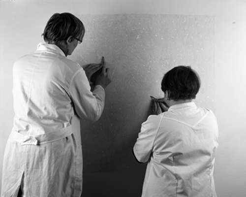   
Fig. 93 Hito Steyerl, *Adorno’s Grey* (2012)

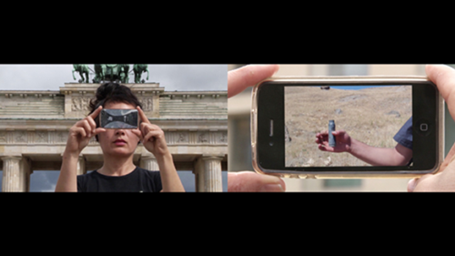   
Fig. 94 Hito Steyerl, *Abstract* (2012)

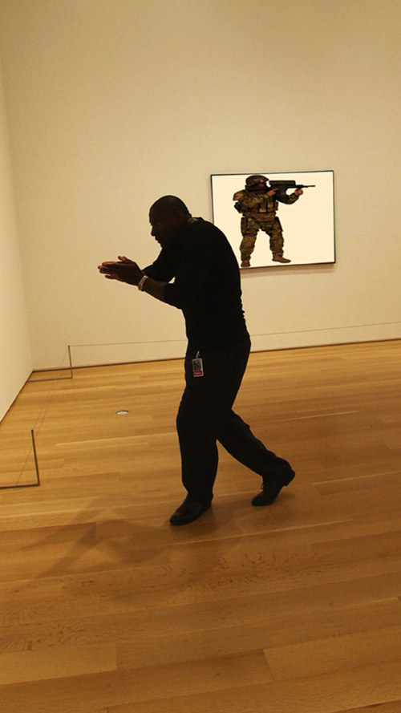   
Fig. 95 Hito Steyerl, *Guards* (2012)

As
different as they are, each film is rooted in different aspects of
Steyerl’s life – her philosophical background, her friendships, and her
life as an artist – making them at least indirectly personal while at
the same time fully structured within the language of video, documentary
and cinema. In many respects this work is similar to the work of
Metahaven, with a sense of complicity in the evidence of digital
interaction. While these films at first don’t seem to distinguish
Steyerl’s work from that of other filmmakers or as cinema per se, in
that her roots in New German Cinema and the influence of film historian
Helmut Färber are both clear and documented in interviews, each film is
so highly attenuated to its medium and the specific stylizations
necessary of the different subject matters, in a way that marks all of
Steyerl’s art as important explorations into the changing nature of the
digital and our interaction with the digital, that her work is radically
different from that of her predecessors. The title of the first chapter
of Steyerl’s book *Die Farbe der Wahrheit (The Colour of Truth)* (2008)
is ‘Documentary Uncertainty’, an indication that regardless of the
appropriateness of the medium Steyerl is always aware of how it can both
undermine and betray her efforts, almost as if her films are an
embodiment of Jacques Derrida’s notion of deconstruction. Taking
together, all three films represent Steyerl’s efforts to trace the
intersection of politics and aesthetics in a manner that dissects the
force of images as potentially acting counter to artistic intention not
only in regards to the communication of information but to the very
notion of completeness. This is particularly true of *Adorno’s Grey*,
about which one critic writes:

> After the credits, the projected image drops out while the projector
> lamp is left to burn for a short while. In this white, messianic
> light, it is now possible to see that each of the screen’s
> collectively canted planes is painted in a different tone of grey
> respectively. Although the conservators never found the missing grey
> layer in Frankfurt, this final revelation of Steyerl’s filmic
> apparatus presents the missing culprits, which tainted the depiction
> of the represented wall. With this cheap, yet effective trick, the
> artist seems to be trumping yet another fragmentation of the recorded
> actions. And still, this final “proof” of an image contaminated lays
> bare not only the fact that cinema is itself composed of necessary
> illusions, but that these sensuous special effects can hold and
> distract our attentive gazes from actually seeing.[^05-Chap5_76]

It’s that last point that’s so crucial: the fragmentation of recorded
actions, the inherently deceptive but powerful nature of images that can
fully reveal their nature as an illusion while at the same time still
functioning as a deception, are presented in an intense fashion to the
point that we no longer see them but accept them as self-evident and
seemingly autonomous effects. Other films by Steyerl achieve much the
same effect, such as *Lovely Andrea* (2007) and *In Free Fall* (2013),
all revolving around (to borrow a phrase from *Lovely Andrea*) ‘filmic
tension’ constructed similarly to Adorno’s conflict between praxis and
theory that is evidence is his statement that ‘The unresolved
antagonisms of reality reappear in art in the guise of immanent problems
of artistic form. This, and not the deliberate injection of objective
moments or social content, defines art’s relations to society. The
aesthetic tensions manifesting themselves in works of art express the
essence of reality in and through their emancipation from the factual
façade of exteriority.’[^05-Chap5_77] The only difference in this case is that
the immanence of the digital as autonomous phenomenon has replaced the
artistic in its common form with an accelerated form of an emancipation
of digital, not just escaping the restrictions of artistic creativity
but redefining its very essence as independent.

In the context of the New Aesthetic certain works stand out. Steyerl’s
*How Not to Be Seen: A Fucking Didactic Educational .MOV File* (2013)
{Fig. 96} is a satirical instructional film (with part of the title
borrowed from a Monty Python sketch) purporting to show ways to avoid or
confuse surveillance software by remaining ‘unseen’ in a manner similar
to the art of Adam Harvey and paralleling the concerns of Metahaven.

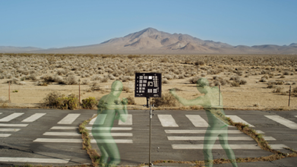   
Fig. 96 Hito Steyerl, *How Not to Be Seen:
A Fucking Didactic Educational .MOV File*
(2013)

Shot at a desert site that was covered with photo calibration targets
backed by computer generated and imposed images of different landscapes,
with ghostly figures dressed in green that appear and disappear, the
film instructs viewers that there are four ways to avoid detection –
hiding in plain sight, shrinking to a size smaller than a pixel, living
in a gated community and being female and older than 50 – and implies a
clear set of motivations. Leora Morinis very astutely points out:

> Despite the ostensible neutrality of the how-to format, the title also
> begs the question of motivation: why would a person want not-to-be
> seen? When the beauty magazine tells you “how not to appear
> desperate,” the implication is that it’s ugly to show how much you
> care (whereas otherwise you might’ve thought devotion was a good and
> powerful thing). In this regard, Steyerl’s video calls on a number of
> embattled realities \[…\] At one point in the sequence, the voice-over
> explains that while “resolution measures the world as an image,” the
> “most important things want to remain invisible. Love is invisible.
> War is invisible. Capital is invisible.” To be sure, Steyerl’s works
> do measure the world as an image, but in her treatment, it’s these
> “most important things” that are rendered visible. It’s a pretty
> powerful picture.[^05-Chap5_78]

Why would you want to not be seen? Maybe because you don’t want to be
killed by a drone, a weapon of war that is focused on those photo
calibration targets. Maybe because you think you’re important? Who is
the satirically intended audience here if not both the terrorist and the
powerful politician? And where do we, the viewers, the normal people,
find a place between such forces, if we can find a place at all, to
disappear without being disappeared? {Fig. 97} 

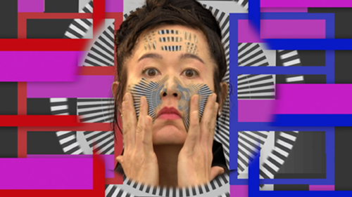   
Fig. 97 Hito Steyerl, *How Not to Be Seen:
A Fucking Didactic Educational .MOV File*
(2013)

It’s pretty clear that
the effects of the software – and it most assuredly is the software that
becomes a driving force of agency with real effects outside of Steyerl’s
film – function in an inverse relationship to most of people’s lives, in
that their effect is more unavoidable the less we have to hide. The less
concerned we are with privacy, the less concerned we are with being
monitored, means that it becomes increasingly harder to avoid being
spied on should we choose to do so in the future. On further
consideration, *How Not To Be Seen* becomes less satire and more a
frightening, powerful revelation on the new normal of the human
condition, where our presence in the world is substantiated less in our
physicality presence and far more in our digital identity which is,
ironically, increasingly beyond our control as it becomes determined and
accepted as determined by the digital objects that present our identity
back to ourselves; unlike *Second Life*, with its notion that our
avatars are our representations to the world and are controlled by us as
users, Steyerl’s art is concerned with revealing that our ‘avatars’ (to
use this outdated and outmoded term as an extended synecdoche) are
chosen for us and, even more frightening, that the sense of choice
itself is an illusion. What is rendered visible is not what we’ve chosen
to be visible but what the digital makes visible to us.

## An Unachievable Autonomy of the New Aesthetic Appreciation

Levi Bettwieser, an American photographer living in Boise, Idaho,
recently switched from shooting primarily digital to various forms of
analog photography, a move clearly associated with his interest in
antique processes in various formats. In 2014, Bettwieser came across a
set of undeveloped film rolls dating back to WWII. With a lot of effort,
experimentation and an awareness of the difficulty involved and the
potential for failure, Bettwieser set out to develop these rolls and
print the images.[^05-Chap5_79] The results of Bettwieser’s efforts were
incredibly interesting; as he acknowledges in a number of places, the
original photographer clearly had an eye for composition and was focused
on producing images that were personally meaningful, all the while also
producing images that are of obvious historical significance. The
discovery led Bettwieser to take on a growing collection of undeveloped
film rolls and process them as successfully as he could, and to post the
results on *The Rescued Film Project*,[^05-Chap5_80] a Tumblr blog set up to
share the images which has often generated more information than
Bettwieser anticipated. Though many of the rolls he’s collected have
been damaged beyond repair, Bettwieser has still diligently attempted to
rescue each one, even to the point of posting a number of the failed
images that still retain the barest of details but which verge at times
on being entirely abstract. The reason we’re starting this section with
Bettwieser’s project, however, isn’t because of the admirable and
aesthetically interesting work he’s doing, even if his shift from the
digital to analog and back to digital warrants at least an
acknowledgement of the inescapability of the digital world. What caught
our attention weren’t the images of vehicles and people from WWII
either. Instead, it’s a set of images that are obviously a product of a
flawed interface between developed analog film and the scanner or
software that Bettwieser used, and this element is the most compelling
in an analysis of the New Aesthetic. {Fig. 98} 

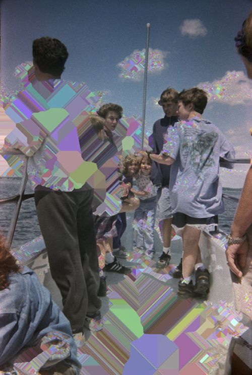   
Fig. 98 Levi Bettwieser, *The Rescued Film
Project* (2014–)

Six images, drawn from
the same role of film and connected by similar people and setting, are
covered randomly in glitch effects and distortions.[^05-Chap5_81] Bettwieser is
quoted by the author Attila Nagy as noting:

> Thanks to a mysterious software bug that occurred while scanning these
> joyful family photos, probably from the 80s, strange colorful shapes
> swarmed the peaceful scenes, harmonizing with the color palette of the
> original negatives. The results are stunning. I personally almost feel
> like Neo from Matrix, when he starts to see the code.[^05-Chap5_82]

One comment asks: ‘Is this real life?’ Perhaps it would be more
productive to ask whether this constitutes a genuine aesthetic
experience. Nagy notes: ‘this might be the fabric of our world’.[^05-Chap5_83]

The fact that Bettwieser has left this images on his blog – a natural
response, to be sure – indicates that these images have a power beyond
the nostalgic, beyond their evocation of other places and times, beyond
even the poignant presence of other individuals to an unconscious
awareness of the inexorable and pervasive presence of the digital realm.

Photography, whether analog or digital, is an artistic format that often
confounds the discourse of art history and the thoughtful explorations
of aesthetics. Vilém Flusser’s *Towards a Philosophy of Photography* is
one of the few examples of a sustained philosophical engagement with the
medium, but there’s scant evidence of similar efforts. It’s also telling
that one of Flusser’s other major books is titled *On Doubt*; Flusser
clearly was interested in exploring the concrete ubiquity of symbols
driven by technology in human culture through a position opposed to the
primacy often granted by philosophy of Cartesian doubt, but Flusser’s
conception of doubting doubt as a method can be borrowed as an assertion
of the dynamic potency of photography as a way of flaunting the presence
of the world rather than just as a means of representing it.

To think about photography means to think about the photographer’s
intentions as well as its technical contingencies. Photographs are
easily produced, or seemingly so, with the effect that the ability to
produce photographs has become both relatively universalized, resulting
in untold and increasingly forgotten millions of images particularly
with the advent of digital methods. Most photographs are not regarded as
art, but all are embodiments of the intentions of those producing the
images, meaning that there is, nevertheless, an ontological resemblance
between these captured pictures and the work of a serious photographer,
a resemblance not present in other examples of visual artistic
production. This resemblance is present in photography’s reliance on
chance. Chance plays a determinative role in all photography, and this
randomness of the capturing of images implies a distinct set of criteria
by which to clarify the potential resemblance between a snapshot and a
serious photograph, resulting in a lack of an ontological distinction
between both types. There is always the possibility, albeit remote to
the extreme in most cases, that a snapshot will result in a photograph
of such quality that it merits aesthetic consideration. Furthermore,
quality of production is always a consideration; no snapshot
photographer wants to intentionally produce a bad image. Given this line
of thought, what’s to stop further ruminations at an even more
fundamentally metaphysical level? If chance and technology are
reasonably understood to be determinative and constructive forces
driving the production of aesthetic experiences in photography,
partially independent of or in synthesis with the photographer’s
intentions, then it’s entirely valid to assert the presence of
algorithms, digital artifacts and errors and glitches as determinative
and constructive forces and even entirely independent agents in the
creation of aesthetic experiences. Bettwieser’s statement that he feels
like Neo in a virtual Matrix makes a lot of sense if one thinks about
the glitchy images he’s posted as aesthetic experiences as the result of
artistic agency outside of the analog world, in which the totality of
the images’ aesthetic nature is governed not by the intentions of
photographers (and Bettwieser is part of the collective of
‘photographers’ as the developer of the film he’s restoring) but by the
manipulative presence of software. In short, Descartes’ concern
regarding an evil genius and his thought experiment’s development
towards the ‘brain in a vat’ problem becomes, in the context of the New
Aesthetic, less an issue of epistemic uncertainty and more about
alternative aesthetic agents. It’s not just that we suspect that our
aesthetic taste and judgments are influenced by our experiences but that
our skepticism of the functional independence of our reflective
judgments is fully justified; the digital world is increasingly not just
something we respond to but a determinative force in our lives,
including our aesthetic inclinations and assessments.

The images from Bettwieser’s Tumblr blog are an easy way to begin this
section, and might be proof right from the start of our point that New
Aesthetic art is sufficiently autonomous to warrant a sustained and
distinct consideration, but it is still the point which is the hardest
to defend. A simple argument against it, though the effectiveness of it
is something debatable, is to note that regardless of the digital
interference evident in the images they still required a person’s intent
to photograph something. If we were to continue our investigations into
New Aesthetic objects, one could suppose, then this would make any
argument turn immediately away from work produced by artists to
instances of aesthetic effects and ‘art’ produced entirely through
computational results; it might seem almost a necessity to stop thinking
about artists’ work and only think aout digital objects produced
independently of human intentions. It’s still a goal of ours, however to
think about these art objects of varying degrees of aesthetic value and
importance as New Aesthetic objects; these are objects about which we
can assert the introduction of variables into algorithms which are
themselves self-generating, evolutionary, and sufficiently independent
of human agency, and investigate the aesthetic effects that are due to
inadvertent errors, glitches, and unforeseeable digital manifestations,
all the while still referring to them as art. More succinctly, work like
Bettwieser’s encourages one to find aesthetic objects that are entirely
divested of human intervention in order to sustain the notion of New
Aesthetic art as a form independently produced by an autonomous digital
agency, and it’s obviously natural to continue this final section with a
discussion of computer art. At the same time, though, we would forewarn
against any assumption that that’s where this will remain, particularly
in the sense that finding experienceable art that is *entirely* not a
product of human agency may be a fruitless or impractical task,
especially considering the necessary means by which the seemingly
naturalness of the New Aesthetic manifests itself.

To start thinking about New Aesthetic art objects, perhaps it’s best to
consider the closer approximation of digital art to its manifestations
in terms of computer generated art once again. We’ve already discussed
this a little bit in the first section, covering the artwork of Frieder
Nake, A. Michael Noll, Georg Nees and Jean-Pierre Hébert, but we want to
return to computer art to consider some different issues. By the early
1970s, the Institute for Contemporary Art in London had held an exhibit
of computer art called *Cybernetic Serendipity*, the Computer Arts
Society was founded, and Katherine Nash and Richard Williams had
published *Computer Program for Artists: ART 1*.[^05-Chap5_84] During this time
the phrase algorithmic art started being used to describe artworks
created entirely through algorithms written by artists, though most of
those artists were computer programmers first who had taken an interest
in the arts. Most instances of computer art are similar to those
discussed at the beginning of this chapter – the computer was a tool,
the understanding of complex and engaging visual design principles was
superficial at best, and the artists often weren’t really artists – but
a belief and confidence in the potential for computer art was clearly in
place to the point that the art world started to accept computer art by
the end of the 1990s. Holly Rogers, linking computer art to the growing
recognition of video art, describes the increasing acknowledgement thus:

> Hans-Peter Schwarz, one of the founding directors of the Zentrum für
> Kunst und Medientechnologie, Karlsruhe (ZKM, Germany), described their
> \[computer art\] ephemerality as setting off an “explosive charge” at
> the gates of traditional art establishments. At first this “explosive
> charge” was blocked by major galleries because of curatorial problems
> (how to include sound and performance in a gallery space, temporal
> modes of perception fundamentally at odds with the traditional gallery
> experience), aesthetic issues (video’s relationship to mass media such
> as television and untraditional modes of artistic discourse), and
> financial concerns (how to sell or keep something that is
> unrepeatable).[^05-Chap5_85]

Until the 1990s, computer art was, at best, on the periphery of the art
world, but the foundations for its acceptance and for a genuine New
Aesthetic art was in place. This process of an increased presence and
acceptance of New Aesthetic art, however, was facilitated not by the
quality nor the market value of computer art – in fact, we would argue
that aesthetic value or quality of computer art has generally remained
subpar at best, substantiated by the remarkably low market value for
most instances of computer art including those of historical importance
– but from specific related and distinct factors.

Part of the success of the process lies in a major shift in the methods
of production. The *Cybernetic Serendipity* exhibition of 1968, curated
by Jasia Reichardt, provides a good example. It an exhibition firstly of
art based on algorithms, art that was influenced by computational
processes such as Gustav Metzger’s *Five Screens With Computer* (1968),
two of Jean Tinguely’s painting machines, and Wen-Ying Tsai’s
interactive cybernetic sculptures consisting of vibrating
stainless-steel rods, stroboscopic light, and audio feedback control.
Additionally, *Cybernetic Seredipity* also included practical designs
for architecture and objects that showed the curator’s understanding of
the intersections of art, design and early forms of digital design,
perhaps the most ‘cybernetic’ type of all of the included objects. It
also was an important influence in the formation of the Computer Arts
Society by Alan Sutcliffe, George Mallen, and John Lansdown. For us,
though, the most interesting part of the exhibition is the presentation
of a survey of the field of computer music, including works by Lajaren
Hiller & Leonard Isaacson, John Cage, Iannis Xenakis, Haruki Tsuchiya
and Herbert Brün. {Fig. 99} 

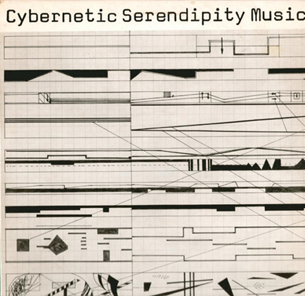   
Fig. 99 *Cybernetic Serendipity* (1968)

As noted in a recent release of the
recording:

> During the preparation of the Cybernetic Serendipity exhibition two
> things became apparent. 
>
> One, that in order to show what was going on in the field computer
> music, it was necessary to include a considerable amount of material
> that was not strictly composed with or played by computer. Two, that
> dealing with an exploratory field, all attempts at a historical
> perspective or firm evaluation were out of place. The exhibition and
> this record, therefore, are essentially a reportage of current trends
> and developments in programmed and stochastic music.[^05-Chap5_86] 

In short, one of the curious things about computer art is that it’s
rarely art produced by a computer; it’s not merely that the technology
hasn’t been capable of autonomous artistic production (because it
actually has even in the earliest days) but rather than the creative,
imaginative work of the artist is something that the art world has been
reluctant to abandon. The hand of the artist, the sense of prioritizing
human craftsmanship, is an attitude that been reluctantly dispensed with
only in the most recent years, as more and more artists turn to
technological means for their production in various ways and to various
extents; this includes David Hockney, Cai Guo-Qiang, Paul Pfeiffer, Ai
Weiwei, Jenny Holzer, Pierre Huyghe, Bruce Nauman and so many others
that a list is impossible to consider.

Where we’ve arrived, interestingly, is at a place where New Aesthetic
art is both viable but continuously uncertain. Procedurally generated
art can be considered aesthetically valid and the current vivacity and
slipperiness of the New Aesthetic can be summarized neatly with a quote
from the Indian artist Gopakumar R. P.’s work *Linguistic River* (2015):
‘I believe the work of art should change the existing visual,
intellectual and aesthetical sense and experiment with finding new
visual phenomena.’[^05-Chap5_87] The fact is that a number of visual artists
working without computers were beginning to produce work that
established the foundations for a New Aesthetic art, and two important
figures illustrate the tendency that many contemporary artists have
taken to pave the way for the New Aesthetic: the Korean-American artist
Nam June Paik (1932-2006) and the Swiss artist Jean Tinguely
(1925-1991). Paik has been described as the artist who invented video
art, who first brought a refined artistic sensibility to the use of
electronics in artistic production, and whose participation in Fluxus
and whose production of conceptual art radically transformed the
possibilities available for subsequent generations. In video work,
through the use of televisions as sculptures, by using neon lighting and
laser effects with elaborate sound experiences, Paik pushed viewers to
contemplate the rapid pace of change driven by technological
innovations. His *TV Buddha* (1974) {Fig. 100} is rightfully regarded as
his most famous and important artwork. 

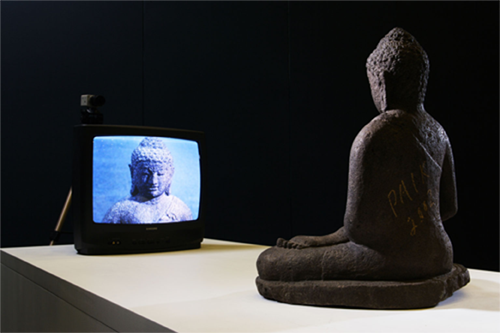   
Fig. 100 Nam June Paik, *TV Buddha* (1974)

*TV Buddha* has become an iconic
artwork, which is surprising given that it was included almost as an
afterthought in an exhibition almost as an afterthought at the Galeria
Bonino in New York. Consisting of a closed loop – a seated Buddha
sculpture is positioned so that it gazes at a television monitor that
displays an image of the Buddha captured through a closed-circuit
television camera – it’s a work that has sometimes been construed as a
representation of a collision between an Oriental set of values or
mindset and the Occidental tendency to assert a primary role for
technological innovation. When Paik re-exhibited *TV Buddha* in Cologne
that year, however, the artist temporarily took the place of the Buddha
sculpture, thus denying the validity of that interpretation. The
interchangeability of the figurative element is key for our purposes,
and what we believe is a more accurate interpretation: the figurative
sculpture and Paik’s own presence did not create a participating role
but rather described a destabilized element in the closed system of the
technology itself; whether as a living, breathing human being or an
inanimate representation of a divine or semi-divine creature. What is
activated aesthetically is the autonomy of the technology as a seeing
agent, albeit one that remains unresponsive to any changes taking place
in front of it. Paik would certainly have been aware that the role of
the Buddha is not so much to exist as an object of worship but to be
present as a model of enlightenment, an example of what an individual
can become, and *TV Buddha* represents technology’s desire to achieve
enlightenment as if technology was gazing actively, striving to better
itself.

Some of Tinguely’s work is equally interesting and, in our opinion,
achieves a similar result. Emerging from a tradition of Dada, Tinguely’s
most famous artworks were kinetically destructive and self-destructive
in nature, with Tinguely’s *Homage to New York* (1960) serving as the
most famous and typical example. {Fig. 101} Set up in the sculpture
garden of the Museum of Modern Art, *Homage to New York* was described
by Tinguely as a ‘self-constructing and self-destroying work of art’
comprised of wheels, motors, a bathtub, a piano and various other
objects and, once set into motion, proceeded to destroy itself with
crashes and fire until stopped by the local fire department.

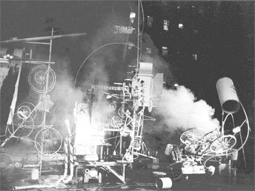   
Fig. 101 Jean Tinguely, *Homage to New
York* (1960)

While the
link to Dada is apparent, as is the link to a long tradition of
destruction in art, like Paik’s work there is a setting-forth of a
systematic autonomy in *Homage to New York* that regressively undermines
its sense of determinativeness; Tinguely’s aesthetics necessitated a
lack of control on the artist’s part, once the processes had been set
into motion, that transferred an autonomous agency over to the artwork.
Much of Tinguely’s career can be understood as an exploration of the
relationship between the artist, his work as technology, and human
culture, with a clear conclusion that technologically-dependent objects
have an alien life all to themselves, an interpretative position
reinforced with a statement by Michael Landy, co-curator of a major
exhibition of Tinguely’s work at the Tate Liverpool in 2009, that
*Homage to New York* ‘committed suicide’,[^05-Chap5_88] an act only a living
creature with a sense of self-awareness could do.

The aesthetic strategies and their results as employed by both Paik and
Tinguely are, in many respects, radically different from each other, but
the resulting consequences are the same: in each case a system is
created, closed and self-referential, initiated by the artists but
quickly moving out of their control with unexpected results. In a way,
both Paik’s and Tinguely’s artworks represent an aestheticization of
Kurt Gödel’s incompleteness theorem, if aesthetic principles are
considered axiomatic and human aesthetic evaluations are considered
consistent. While we wouldn’t claim that Paik or Tinguely produced New
Aesthetic art, we’re confident that their relationship to technology as
a force opened opportunities prefacing a New Aesthetic interactionist
strategy.

One of the most logical heirs to this, fully in a New Aesthetic mode, is
the German artist Ralf Baecker. A German artist trained first in
computer science and then as an artist at the Academy of Media Arts in
Cologne, Baecker’s work has been the subject of a growing interest and
focus as representative of a new generation of computer artists and many
examples of his art show a sustained and insightful exploration of New
Aesthetic issues. *Re-Active Platform* (2010-12) is a very good starting
point; installed in a series of museums with a team of assistants,[^05-Chap5_89]
Baecker created a system of reactions between different
computationally-drive sets of hardware and software which were also
dependent on various environmental inputs as wide-ranging as motion and
cosmic radiation. It seems that Baecker’s intention behind the work was
to simulate an ontological foundation, namely, that reaction is the *sui
generis* of autonomy, with a self-determining set of self-regulations as
consequences of a sustained autonomy. More than almost any other artist
mentioned, Baecker’s work exhibits an awareness of the presence of the
digital functioning as an autonomous agent. Work like *Nowhere* (2004) –
in which a ‘landscape’ based on users search movements on www.metager.de
is sculptured on a milling machine – give a physical manifestation to
the ‘geography’ of the internet.[^05-Chap5_90] *Rechnender Raum (Computing
Space)* (2007), {Fig. 102} an installation consisting of sticks, strings
and plumb weights, exists as a fully-functioning, logic and exact
network, with a reversal of the normal arrangements of output display
(at the center of the torus) and computing mechanics (on the outside of
the torus); in exaggerating the workings of its operational behavior,
Baecker has created a work of art almost directly analogous to numerous
models of consciousness presented in different philosophies of mind,
even to the point of being similar to Kant’s description of the mind’s
active relationship to its experience of the world. 

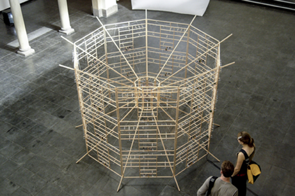   
Fig. 102 Ralf Baecker, *Rechnender Raum
(Computing Space)* (2007)

Taking this even a
step further, Baecker’s *The Conversation* (2009) {Fig. 103} is an
autonomous machine consisting of 99 solenoids circled around three
rubber bands that respond to the surrounding electromagnetic fields of
their neighbors as well as the changing pulling forces detected in order
to conserve its own position, with the result being something akin to a
homeostat that ‘tries to establish a hyper stable equilibrium’.[^05-Chap5_91] 

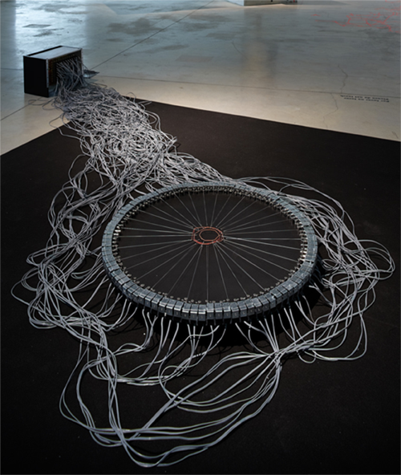   
Fig. 103 Ralf Baecker, *The Conversation
(Autonomous Machine)* (2007)

In
each case, Baecker is creating a system in which the system itself is
responding on its own terms, creating an aesthetic configuration under
its own power which is, fascinatingly, teleologically driven in an
irrational fashion. Two pieces, though, need specific focus, as the best
of Baecker’s New Aesthetic art: *Crystal Set* (2011)[^05-Chap5_92] and
*Irrational Computing* (2011-12).[^05-Chap5_93]

*Crystal Set* {Fig. 104} takes as its basic premise the materiality of
computational devices; the metonym ‘Silicon Valley’ is more than just a
location but a description of one of the primary components of all
computers, as are a wide variety of rare earth elements and other
material. 

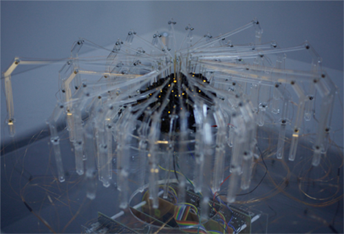   
Fig. 104 Ralf Baecker, *Crystal Set* (2011)

Attaching iron needles to the surface of a silicon carbide
specimen with a semiconducting diode at the point of contact, Baecker
has created a set of circumstances whereby both light and audible
signals can be generated and responded to by the software, investigating
the logical structure of the crystal which then

> applies different electronic pattern to the contacts based on an
> analysis of current flow, resistance and response times in the
> specimen. By doing this it is inspecting its behavior in a closed
> feedback loop. As a result it generates raw and untamed signals
> visible and audible to the observer.[^05-Chap5_94]

Bringing to mind, as Baecker himself alluded to in an interview,[^05-Chap5_95]
the raw crystal sets used in early commercial radios, *Crystal Set* is
quite crude in appearance but sophisticated in execution and effect;
more than just manifesting a sense of life, this work takes on a literal
life of its own as well as a personality. Closely related to it,
*Irrational Computing* {Fig. 105} has become Baecker’s most well known
work, representing at an even more fundamental level than *Crystal Set*
Baecker’s exploration of a ‘raw’ computational device. 

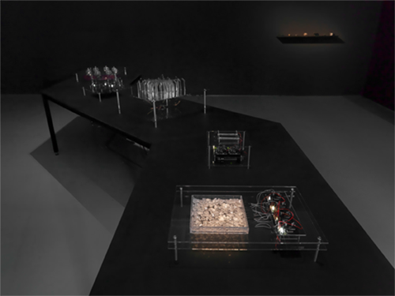   
Fig. 105 Ralf Baecker, *Irrational
Computing* (2011-12)

Using five
interlinked modules, each responding separately to various input as well
as responding at different levels to their companions’ output,
*Irrational Computing* is a macroscopic presentation of the
computational process that breaks away from the necessity of being
purposive and logical. The effect is, as noted by the curator Carsten
Seiffarth, that:

> Digital systems, in their function, are conceived logically and
> rationally. The lowest physical or electro-technical level (crystals
> with semiconductor properties) are based, however, on quantum
> mechanical, i.e. statistical or unpredictable processes. Modern
> computer technology has thus tamed and domesticated the chaotic, so to
> speak. In his work, Ralf Baecker comments on this paradox by examining
> the aesthetics of the materials from which has developed a global
> digital network. “Irrational Computing” is not supposed to “function”
> – its aim is to search for the poetic elements on the border between
> “accuracy” and “chaos”.[^05-Chap5_96]

Taken as a body of work – which is how Baecker sometimes refers to many
of his artworks – the Irrational Computing objects are an exploration of
randomness out of the natural and the man-made that parallels the
intentions behind technological innovation. More than just heightening
the viewer’s awareness of the materiality of contemporary computing –
although that’s an important part of the work – Baecker’s work
re-appropriates the digital which then creates its own paradox in the
dichotomy between programmed and shaped material form that is the
product of human intervention in opposition to a presence that grows
over the duration and experience of the objects’ existence as apparent
living-objects, based on the idea, as Baecker himself notes, of
mathematician, physicist and inventor John von Neumann’s definition of
artificial life, that ‘life is a process which can be abstracted away
from any particular medium’.[^05-Chap5_97] For us, Baecker’s art is a challenge
to the anthropocentric notion of artistic agency and aesthetic effect
precisely because its program quickly escapes the originator’s
supervision, and it is New Aesthetic in that the conditions whereby the
anthro-dependent qualification disappears behind an inherent and
self-determined qualification of agency and its aesthetic effects.

This brings us back to the ideas of Lev Manovich, in particular his
definition of ‘new media’. Writing about the GUI of applications,
Manovich describes the design of the interface as increasingly visible,
in opposition to modernist tenets, such that:

> The designers no longer try to hide the interfaces. Instead, the
> interaction is treated as an event, as opposed to “non-event”, as in
> the previous “invisible interface” paradigm. Put differently, using
> personal information devices is now conceived as a carefully
> orchestrated experience, rather than just a means to an end. The
> interaction explicitly calls attention to itself. The interface
> engages the user in a kind of game. The user is asked to devote
> significant emotional, perceptual and cognitive resources to the very
> act of operating the device.[^05-Chap5_98]

In essence, the increasing levels of interaction demand a similar
attentiveness to the type employed in a theatrical experience, wherein a
separation exists through a suspension of disbelief, with a heightened
force of the artificiality of the aesthetic experience. However, an
interesting effect is that the more the user becomes aware of the
necessity of this heightened sense of the artificial there is a
corresponding decline in a critical distance to the point that the
artificial increasingly becomes naturalized. This transition within the
event is evident in the work of James E. Murphy, an artist from Northern
Ireland working in Berlin and part of a growing number of artists whose
work is primarily presented online in the programming languages of the
internet.[^05-Chap5_99] Murphy’s work has covered territory similar to many other
artists, including a few already discussed in this chapter, with work
like *Relative Anonymity* (2012)[^05-Chap5_100] presenting an avoidance of
government security structures’ use of facial recognition through the
use of stochastic noise and visuals, but three pieces in particular
capture the released energy that defines Murphy’s work specifically.
*The Politics of Creation* (2013)[^05-Chap5_101] {Fig. 106} is a theatrical
production that utilizes an aleatoric music and lighting system based on
algorithmic formulae to create unique compositions for every
performance; what’s interesting is not just the inclusion of chance in a
work which is heavily indebted to the traditions of systematization in
art, especially in its fascinating use of algorithms to push an ever
changing set of musical transitions through instrumentation, key,
rhythm, arrangement and structure, but also the sense of an invoked
natural chaos partnered with the choreography creating a ‘closed system
of causality as information about velocity, acceleration and positioning
of dancers are fed back into the system affecting the very music they
are dancing to \[…\] \[that\] links the dancers and the system in a
“dance” of their own \[…\] as the piece progresses towards its
finale’.[^05-Chap5_102] 

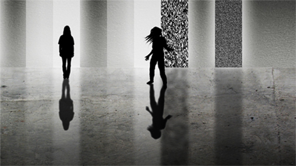   
Fig. 106 James E. Murphy, *The Politics of
Creation* (2013)

The shift in the language is telling, as it’s clear that
Murphy understands the mathematical structure to be an active
participant in the performance, a digital collaborative partner to the
human dancers. But what’s also clear is an emphasis on the transitory,
the ephemeral and the lyrical tragic; Murphy writes about *The Politics
of Creation*:

> As a viewer the experience is of course unique in terms of its raw
> content but what’s more than this it seems to allow one to have an
> extended experience of the present moment. Whereas a regular stage
> production will be known to be predetermined, in TPoC the anticipation
> associated with knowing that the next series of notes or rhythmic
> pattern and ultimately how the choreography responds to it, will never
> be heard or seen again tends to expand the perception of “now”
> creating a mild hypnosis or meditative state.[^05-Chap5_103]

*Found* (2014)[^05-Chap5_104] {Fig. 107} and the previously discussed *What
Colour Is It?* (2014) are quite different. 

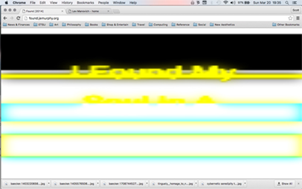   
Fig. 107 James E. Murphy, *Found* (2014)

*Found* is an almost
aggressive intrusion into the user’s experience of a browser, consisting
simply of the words ‘I Found My Soul In A Browser Window’ flashed
repeatedly on the screen in a manner that someone suffering from
photosensitive epilepsy should avoid at all costs. Using soft-focused
typography that flashes in and out of visibility, with the words crossed
and revealed in the most blatant of RGBY tones, *Found* isn’t
functional, it is disconcertingly glaring visually, and offers no chance
for reciprocity and reflective judgment whatsoever in a fashion. By
removing any identification of the ‘I’ and by situating the
conceptualized space self-referentially inside its own browser window,
*Found* leaves us with an experience that closes any chance of
interchange or exchange between the art and the viewer. And the
previously discussed *What Colour Is It?* (2014) is more than just a
simple confounding of our anticipated feedback but is a strong
demarcation of the singular difference between the digital parameters of
experience and our normative experience of the world at a
phenomenological level wherein the interface ceases to function despite
its appearance. Manovich’s observation that cognitive resources become
increasingly utilized really seems to capture Murphy’s art, although
Murphy’s art seems to have created a digital event horizon in a way that
replicates the division between actors and audiences in Manovich’s
notion of ‘interaction as theater’.[^05-Chap5_105] At the same time, the
increasing use of cognitive resources in the aesthetic experience
contraindicates an engaged and personal aesthetic experience, and
Murphy’s work heightens our awareness of this process in a very valuable
fashion.

## Beyond the Theatricality of the New Aesthetic

Two projects by Lev Manovich bring out these issues in notable and
fascinating ways: *Selfiecity* (2014) and *On Broadway* (2014-2016).
Manovich is, of course, one of the most important theorists thinking
about postdigital issues, but he’s also created a number of projects
that may not be referred to as ‘art’ in the traditional sense, in that
they often seem more like visualized sociological research, but
certainly fall into a broad definition as such in that they invite the
same type of responses one normally has to art. *Selfiecity* (2014),
{Fig. 108} and its second manifestation *Selfiecity London* (2015), was
an artistic project exploring data visualization through an analysis of
3200 Instagram selfie photos taken in Bangkok, Berlin, New York, Sao
Paulo and Moscow[^05-Chap5_106] with London added as a sixth city later.[^05-Chap5_107]

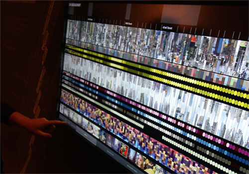   
Fig. 108 Lev Manovich, et. al., *Selfiecity*
(2014)

Starting off with 120,000 photos culled from a collection of 656,000,
the organizers had these checked by Amazon Mechanical Turk workers to
verify their status as a selfie photograph, reduced the sample set
further to 1000 for each city after two Turks tagged a photo as a
selfie, and then had each photograph further tagged by age and gender
with higher skilled Turks. Given a conclusive set of selfies, the
organizers then algorithmically estimated eye, nose and mouth positions
as well as estimated emotional states. What emerged from these
permutations of analysis is the means to visually represent various
spectrums of data such as smiles, points of view, emotional states, the
expressiveness of the poses and the propensity of selfies as a
photographic subject. What was revealed in this project were apparent
geographically determinable trends; for instance, people in selfies in
Bangkok and Sao Paulo smiled significantly more than in the other
cities, and women in Moscow took far more selfies than men and treated
selfies more like a fashion shoot to project an image of themselves
rather than simply as a marker of their presence or participation. Is
*Selfiecity* art? The project itself engages with that question by
including three essays analyzing the selfies as a social phenomenon and
handling critical theory’s ability to analyze the selfie as a
manifestation of our zeitgeist,[^05-Chap5_108] but in a traditional sense it’s
very hard to think about *Selfiecity* as ‘art’ not only because of the
productive methodology involved, including the obvious contributions
from a vast array of individuals, but also because of the sense that
it’s a project more ensconced in anthropology. Well, we’ve not been
talking about art in the traditional sense for a long time, and it’s
clear that *Selfiecity* is but one instance of a new way of making art
that is socially and cooperatively engaged and produced in a manner
closely approximating Nicholas Bourriaud’s notion of relational
aesthetics. At the same time, *Selfiecity* is a challenging artwork that
is fully New Aesthetic in nature for the simple reason that it’s
dependent on a productive methodology and aesthetic strategy that is
itself uncritically dependent on underlying conventions of the nature of
data. Recalling Otto Neurath’s infographics, with the transformation of
data into visual form which almost perfunctorily and negligently draws
upon its sources, *Selfiecity* manifests its visual appearance in a
similar fashion, albeit in a manner clearly much more thoughtful and
engaged, in that the data becomes the visualization rather than being
revealed by the visualization. This is what makes *Selfiecity*
particularly interesting and valuable and what makes it a genuine
instance of New Aesthetic art: it’s not just that Manovich and his team
translated the data into a visual form with its own aesthetic criteria,
it’s that the aesthetic criteria were built into the aesthetics of the
data itself as it was discovered through the research and the creation
of the art. Zach Sokol writes:

> Not only does *selfiecity* \[sic\] offer findings about the
> demographics of people taking selfies (as well as info about their
> poses and expressions, such as smile trends), it also shares a variety
> of data visualizations (such as collages that overlay hundreds of
> selfies that share certain characteristics), and allows visitors to
> explore the entire photo collection, filtering the information into
> several formats that could reveal patterns or trends that ripple
> throughout selfie culture.[^05-Chap5_109]

While Sokol’s enthusiasm for the project is appreciated, it’s clear that
he’s seeing *Selfiecity* only as a project whose forms are determined by
the artists’ manipulation of the data rather than as a means of
revealing the inherent aesthetic nature of the data itself. To put it
another way, the ontologically circular nature of the data, generated
autonomously within its self-determining aesthetic manifestation,
reveals itself through the artistic choices Manovich and the rest made
in a way that’s independent of those artistic choices; the fundamentally
important aesthetic engagement for the viewer lies not in *Selfiecity*’s
website, for instance, but in its autonomous aesthetic.

Equally important and interesting is Manovich’s *On Broadway*
(2014-2016).[^05-Chap5_110] {Fig. 109} 

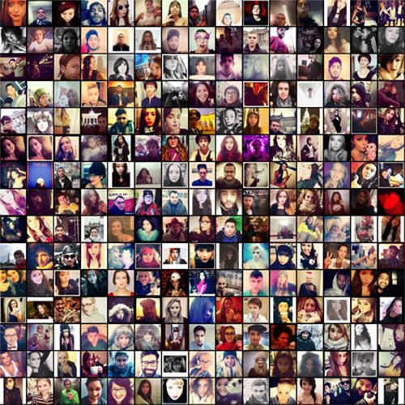   
Fig. 109 Lev Manovich, et. al., *On
Broadway* (2014–16)

As noted on the website for the project,
*On Broadway* is an ‘interactive installation \[…\] \[that\] represents
life in the 21st century city through a compilation of images and data
collected along the 13 miles of Broadway that span Manhattan’. Drawing
upon the rich history of modern representations of cities’ identities,
ranging from Pissaro’s series of paintings of the Boulevard Montmartre
to *Spider-Man* comics and, especially, Edward Ruscha’s seminal *Every
Building on the Sunset Strip* (1966), {Fig. 110} Lev Manovich and his
team[^05-Chap5_111] created a visual representation of a broad spectrum of data
sources in real time and averaged over extended periods of time in order
to provide a portrait of Broadway’s important role in the life of New
York City. 

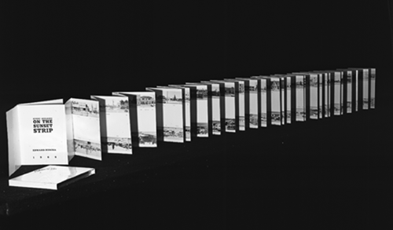   
Fig. 110 Edward Ruscha, *Every Building on
the Sunset Strip* (1966)

Instagram images, Google Street View pictures of the facades
of buildings, taxi statistics obtained from the city, demographic data
and collection of dominant colors by location and social media imagery
were brought together to create a panoply remarkably similar in intent
to Walter Benjamin’s unfinished *Arcades Project* (1927–1940) as a data
collage manifesting a personification of the life of this segment of the
city. This last point is crucial, and it’s what ties *On Broadway*
together with its artistic predecessors: what emerges out of the
experience of this art installation is a sense of the life of Broadway,
a sense that, as one write puts it, ‘NYC is a city that does sleep, a
bit’.[^05-Chap5_112] At the same time, *On Broadway* is curiously similar to
*Selfiecity* in its dependence on big data for its raw information and
its aesthetic appeal. To compare it to Ruscha’s work is illuminating:
whereas Ruscha’s images of the building on Sunset Strip is just as much
about the endurance of the photographer to image each and every building
as it is about creating an extensive and all-encompassing image of that
one location in West Hollywood, *On Broadway* doesn’t illustrate so much
the efforts of the artists involved as it shows the presentation of the
information generated by the people living, working and travelling on
Broadway; whereas Ruscha’s work is an act of documentation, *On
Broadway* is primarily a presentation of what had already been
documented and archived by software data analysis and stored with the
aesthetic affect fundamentally driven by the sublime realization of the
existence of the data itself. Manovich notes:

> How does a “data city” look like? We did not want to show the data in
> a conventional way using only graphs and numbers. We also did not want
> to use another convention of showing spatial data – a map. The result
> of our explorations is “On Broadway”: a visually rich image-centric
> interface, where numbers play only a secondary role, and no maps are
> used. The project proposes a new visual metaphor for thinking about
> the city: a vertical stack of image and data layers. There are 13 such
> layers in the project, all aligned to locations along Broadway. Using
> our unique interface (available as the online app and in large
> multi-touch screen installed at New York Public Library as part of
> “The Public Eye” exhibition), you can see all data at once, or zoom
> and follow Broadway block by block.[^05-Chap5_113]

While Manovich notes that the intention is to produce a visually rich
and interactive experience, the emphasis and the end result is clearly
situated less in the superficial effect but in the creation of a ‘new
metaphor’ that breaks through a digitized fourth wall. We would argue
that this new metaphor isn’t as new as Manovich and his team think it is
simply because its origins lie less in the creativity of the artists but
in the driving force behind the New Aesthetic. John Brownlee makes an
interesting point when he notes that ‘*On Broadway* is the latest in a
series of experiments to leverage computers, the web, and massive data
to represent our cities in new ways.’[^05-Chap5_114] Leveraging the data, the
software and the hardware means pushing them to act, to create the
aesthetic experience, in ways that only they are capable of doing; *On
Broadway* is, in our opinion, a fascinating and beautiful example of
what New Aesthetic art is precisely because the data and its
parameter-controlling manifestations achieve an incredibly determinative
and autonomous agency in the creation of the aesthetic experience. Once
the interactivity takes place the artists’ control permanently slips
away and all that remains is the data. Nevertheless, we take as a
central tenant of our position a point nicely articulated by Manovich,
writing about *Selfiecity*: ‘New image-making and image-sharing
technologies demand radically new ways of interpretation and analysis in
what we might think of as a postdigital age, and *Selfiecity* is an
attempt to explore and map these new representational forms.’[^05-Chap5_115]
Manovich is absolutely correct; New Aesthetic art and what it represents
is about more than just appearing to be digital or postdigital but
represents an entirely new way of interpreting and analyzing images, one
that equally demands a new critical perspective. It’s not enough to
simply assess how cool or new the work is, but rather how much of a
paradigmatic shift is evidenced and embodied in the work.

Two artists that can be positively compared to the methodology of
Manovich’s artworks are Ben Grosser and Matthew Rothenberg. Grosser’s
work, already discussed earlier in the book, has been varied in form and
content, but clearly aligns itself with a specific New Aesthetic
strategy that is entirely invested in designing the function of digital
objects towards an embodied form of autonomy. Works like *Interactive*
*Robotic Painting Machine* (2011) {Fig. 111} bear some resemblance, in a
non-destructive fashion, to Jean Tinguely’s work, but pushes far beyond
what Tinguely’s work accomplishes to establish itself as a primary
instance of New Aesthetic art because there are measurable results that
can be assessed comparatively to the form of our own aesthetic choices.

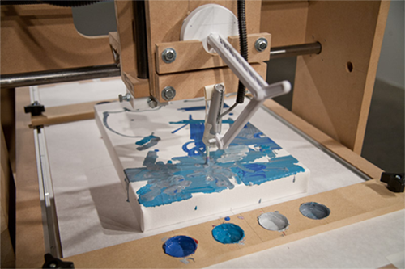   
Fig. 111 Ben Grosser, *Interactive Robotic
Painting Machine* (2011)

Taking the idea that intelligence can evolve even in software and, thus,
that aesthetic sensibilities, as an expression of the needs of that
evolved intelligence, can also evolve, Grosser built

> an interactive robotic painting machine that uses artificial
> intelligence to paint its own body of work and to make its own
> decisions. While doing so, it listens to its environment and considers
> what it hears as input into the painting process. In the absence of
> someone or something else making sound in its presence, the machine,
> like many artists, listens to itself. But when it does hear others, it
> changes what it does just as we subtly (or not so subtly) are
> influenced by what others tell us.[^05-Chap5_116]

*Interactive Robotic Painting Machine* is a programmed art-producing
machine which at first seems to be part of a long tradition of similar
machines tracing back to the early 1960s, but Grosser’s addition to it
is clearly a heightened independence and even a sense of self-awareness
in the capability of the work to respond. Having identified one of the
primary aspects of artistic identity as the ability to think, listen,
and hear oneself, Grosser has programmed the machine to, in effect, be
an artificial artist. Still, as clever as this is, the autonomy is still
programmed in, and the aesthetic responses through the programming can
be predicted, thus leaving questions about the machine as an independent
artist still in place; Grosser himself asks these very questions when he
writes on his website:

> Does an art-making machine of my design make work for me or for
> itself? How does machine vision differ from human vision, and is that
> difference visible in its output? Is my own consciousness reinforced
> by the system or does it become lost within? In other words, is this
> machine alive, with agency as yet another piece of the technium, or is
> it our own anthropomorphization of the system that makes us think
> about it in these ways?[^05-Chap5_117]

What makes this piece fit into the category of New Aesthetic art is that
uncertainty, particularly as it pertains to the question of
anthropomorphization; it’s not so much a question of whether Grosser is
attributing human form and personality to the actions of the
*Interactive Robotic Painting Machine* but a question about the freedom
we have to anthropomorphize a machine, to seemingly ascribe
metaphorically human traits when what might really be happening is that
those traits exist in a non-metaphorical fashion in the object’s digital
basis. Far more interesting is *Computers Watching Movies* (2014),
perhaps one of the most important and compelling examples of New
Aesthetic art we’ve seen.[^05-Chap5_118] {Fig. 112} 

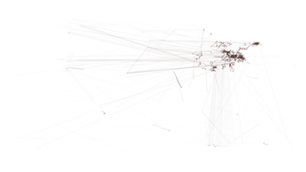   
Fig. 112 Ben Grosser, *Computers Watching
Movies* (2014)

Using software written by
himself, Grosser provided computational devices not only the means to
watch movies by tracking areas that attract their attentive focus but
also the means to express that focus by plotting changes in the same
manner that the focus of eyesight of vision can be tracked digitally
today. Using well-known clips from six classic movies – *2001: A Space
Odyssey*, *American Beauty*, *Inception*, *Taxi Driver*, *The Matrix*,
and *Annie Hall* – Grosser’s artwork is given an opportunity to
*aesthetically* present its response. It’s this last point that makes
*Computers Watching Movies* so interesting, in that it’s more than just
software programming coupled with hardware capability but is, rather, a
means of granting aesthetic agency to a digital configuration almost as
a means of testing its potential disinterestedness as an aesthetic
object in its own right. Exhibited widely and winning the First Prize at
the VIDA Awards for Art and Artificial Life in 2014, Grosser’s
*Computers Watching Movies* is more than just machine vision but is also
the embodiment of a new evaluative aesthetic paradigm; it’s not merely
that this artwork gives us some insight into the changing nature of
cinema itself[^05-Chap5_119], it answers Grosser’s question ‘Will a system
without our sense of narrative watch the same thing? I’m left wondering
why I and the computer see things so differently.’[^05-Chap5_120] The real issue
isn’t why the human and the machine are seeing things differently. The
underlying assumptions are that there’s some conflation between the
human and the digital responses; however, not only is there no
conflation, not only is it clear that the human and the computer see
things differently, even more important is the fact that *Computers
Watching Movies* contains the strong implication that the computer’s
interest is quickly supplanting our own or that it’s vision, its method
of aesthetic evaluation is supplanting ours. Is it possible that
Grosser’s *Computers Watching Movies* is capable of achieving a purely
disinterested perspective and would thus be capable of pronouncing pure,
justified objective aesthetic judgments in a Kantian sense? Certainly at
this point the answer is no, but that’s only due to the technical nature
of Kant’s system that requires a subjective reflection. It’s clear that
this work puts forward a vision of the future in which even something as
aesthetic judgment, once assumed not only to be a privileged and
exclusive form of human activity, transitions into the digital in a
manner that seems to be a more effective implementation.[^05-Chap5_121]

In a way this is similar to Matthew Rothenberg’s project *Unindexed*
(2015).[^05-Chap5_122] {Fig. 113} 

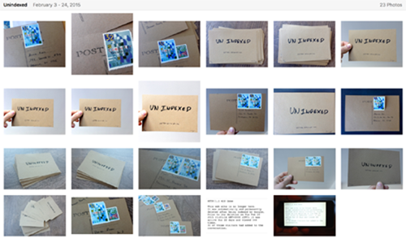   
Fig. 113 Matthew Rothenberg, *Unindexed*
(2015)

Rothenberg has worked in the tech industry in a
number of prominent roles, but recently started creating his own art
projects such as *Emojitracker* (2013),[^05-Chap5_123] which tracks all emoji
usage worldwide in a dynamic graphic format, and *Swipe Left*
(2014),[^05-Chap5_124] which conflated the dating app Tinder’s usage with drone
strikes through incorporated images of kills by drone missiles.
*Unindexed* (2015), however, is a masterpiece in its own right, one
directly akin to Yves Klein’s conceptual artwork *Zone of Immaterial
Pictorial Sensibility* (1959-62); described by Rothenberg as ‘An
experiment in the nature of ephemerality and persistence on the web’ it
was a website that functioned by continually searching for itself in
Google and destroying every copied instance of itself once discovered,
‘making the precise instant of algorithmic discovery the catalyst of
destruction’. Importantly, Google discovered the work 22 days later and
destroyed it resulting in no backups and no corresponding existence
except the memory of the event. What aligns *Unindexed* with Grosser’s
work is the independence of the digital agent from human interaction;
even though visitors to the *Unindexed* site were encouraged to share it
and post to it the coding took control in an entirely separate fashion,
breaking *Unindexed* free of human interactivity once set into motion.
It’s this release from human control that makes these instances of New
Aesthetic art both exciting and unnerving; more than almost any other
work we’ve discussed, *Unindexed* not only is fully participant in new
forms of digital art, influenced by the ephemeral nature of the internet
and simultaneously having a persistent conceptual effect, its nature as
functioning independently of the artist makes it a perfect example of
New Aesthetic art. In an interview Rothenberg noted ‘Part of the goal
with the project was to create a sense of unease with the participants –
if they liked it, they could and should share it with others, so that
the conversation on the site could grow \[…\] But by doing so they were
potentially contributing to its demise via indexing, as the more the URL
was out there, the faster Google would find it.’[^05-Chap5_125]

In a way, *Unindexed* forces us to confront a peculiar conundrum because
of its permanent and ephemeral nature when faced with certain
manifestations of digital objects: are we complicit in their continuing
existence (which we most certainly are, if for no other reason than that
page view counts are often determinative of their appearance in search
results) or do they have a life of their own (which they most certainly
do as well, existing on servers)? This dialectic complicates our
response, and increasingly we make concessions to the presence of the
digital into our lives, allowing it to function in a state of
independent agency (if not actual independent agency) rather than
risking any emotional dangers or existential uncertainty were we to try
and intervene or act on our volition. What made *Unindexed* so poignant
and poetic was the simple fact that the more it was searched for, the
more it appeared in Google’s search results, and the quicker its demise
would come; there was almost a sense of the tragic with a subsequent
lack of comfort in one’s participation. This feeling of being
uncomfortable is only due to its lack of familiarity, a lack that is
quickly disappearing the more digitized our world becomes. Marius Watz
posted on his Tumblr feed that ‘heavy use of algorithms is bad for you.
That is, it is if you wish to consider yourself a computational creative
capable of coming up with interesting work \[…\] You cannot lay claim to
“owning” any given algorithm (or hardware configuration), unless you
have added significant extra value to it.’[^05-Chap5_126] In his Tumblr essay
from 2012, Watz writes about how coding itself should be regarded as an
art form in that code exists as an entity in its own right similar to
the traditional objects of artistic production. But what this really
means, for Watz, is that code is not neutral: ‘Algorithms provide the
means to produce specific outcomes, typically through generative logic
or data processing. But in the process they leave their distinct
footprints on the result \[…\] “speaking” through algorithms, your
thought patterns and modes of expression are shaped by their
syntax.’[^05-Chap5_127] We’re at the stage where what’s really interesting about
this is how this indicates that there are new boundaries; while the
algorithms created by Watz are themselves dependent on more fundamental
algorithms, meaning that his own creations are flavored by the
footprints of the preexisting syntax, nevertheless something new is
emerging, and a work like *Unindexed* forces us to confront the
existence of boundaries that are increasingly evident and permeable
without any action on our part as users.

Finally, we need to take into account James Bridle’s own recent
exhibition of his art in the NOME gallery in Berlin. The NOME gallery
was founded in 2015 as an exhibition space presenting work that exists
at the intersection of art, politics and technology. Ralf Baecker,
Matthew Plummer-Fernandez, Quayola and Kirsten Stolle are some of the
important figures already shown there, and Bridle’s inclusion signaled a
clear commitment to art aligned with the ideas and effects of the New
Aesthetic. Bridle’s exhibition ‘The Glomar Response’ (2015)[^05-Chap5_128]
references a curious piece of CIA history, when the *Glomar Explorer*
was designed to salvage a sunken Soviet submarine in the 1970s, with
subsequent requests by the press for information being met with the
phrase ‘neither confirm nor deny’ that itself became a synecdoche for
governments’ secrecy efforts. Bridle’s coinage of the phrase ‘New
Aesthetic’ has been focused on the visual lexicon that involves
glitches, pixelization and pixelated images, and general weirdness, but
*The Glomar Response* develops through an exploration of the
relationship between surveillance, secrecy and code that shows Bridle to
be more than just a digital curator or collector of computational
oddities. Through three projects – *Seamless Transitions*, which
presents simulacrums of unphotographable locations through architectural
visualizations derived from planning and construction documents; *The
Fraunhofer Lines*, {Fig. 114} wherein gaps in documents obtained through
freedom of information requests are presented as analogous to
astronomical spectra analysis first done by the German physicist Joseph
von Fraunhofer in 1814; and *Waterboarded Documents*, {Fig. 115} a
presentation of ironic parallels between the British government’s claim
that water damage prevented the release of information and waterboard
torture techniques use in the war on terror – Bridle’s most recent art
project represents neatly an exemplary summation of the New Aesthetic as
new art. 

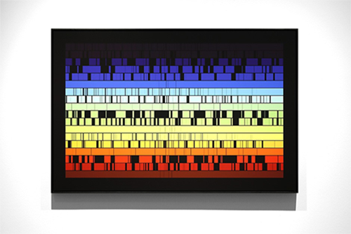   
Fig. 114 James Bridle, *The Glomar
Response: The Fraunhofer Lines 005*
(2015)

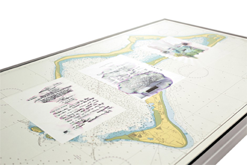   
Fig. 115 James Bridle, *The Glomar
Response: Diego Garcia (Waterboarded
Documents 001)* (2015)

In an interview, Bridle noted: ‘For me this thing about the
attempt to see though machine eyes is that it’s actually an attempt to
see through aggregates of human eyes and intention, because actually
what you’re seeing is the previously hidden intentions of the people
that built these systems.’[^05-Chap5_129] What makes this
such an interesting statement is that *The Glomar Response* seems to be
exactly the opposite of this statement, a denial of Bridle’s own
optimism and utopianism found in the interview. Rather than an attempt
to see through the aggregate of human eyes and intentions represented in
the coding, *The Glomar Response* presents an increased pessimism
particularly in the suggested notion of the natural development of the
digital entities involved. In a way, Bridle’s most recent piece of art,
especially *The Fraunhofer Lines*, masterfully aligns itself with the
realist position in a debate in the philosophy of mathematics, in that
the increasing encroachment is apparently not just a matter of design or
evolution but was always present; if the presentation of spectral
information can be used to reveal the actual chemical composition of
stars in an aesthetic manner then similar means can also be used to
reveal the actual nature of digital objects not as the result of
programming but real in an independent fashion. The anger and, most
importantly, the futility that many of the artists we’ve discussed in
this chapter feel with the current state of surveillance and the
intrusion of digital objects into our lives, lies less in the fact that
they’re responding to the intentions and decisions of human agents and
the morality of their actions and far more in the fact that this offers
a glimpse of a future wherein our intentions, our decisions and our
actions are increasingly out of our hands as they are guided by the
digitalization of the world.

[^05-Chap5_1]: A witty and intelligent summary of this can be found in Tiernan
    Morgan and Lauren Purje, ‘An Illustrated Guide to Arthur Danto’s
    “The End of Art”’, *Hyperallergic*, 31 March 2015,
    <http://hyperallergic.com/191329/an-illustrated-guide-to-arthur-dantos-the-end-of-art/>.

[^05-Chap5_2]: Susan Hodara, ‘Liza Lou’s Handmade Sea of Sparkling Glass’, *The
    New York Times*, 2 January 2016, <http://nyti.ms/1OBekoq>.

[^05-Chap5_3]: *Liza Lou*, <http://lizalou.com/>.

[^05-Chap5_4]: Helaine Posner, Chief Curator, ‘Liza Lou: Color Field and Solid
    Grey November 8, 2015 – February 21, 2016’, *Neuberger Museum of
    Ar*t,
    <https://www.neuberger.org/exhibitions/current/view1/314.html?width=660&height=500>.

[^05-Chap5_5]: Susan Hodara, ‘Liza Lou’s Handmade Sea of Sparkling Glass’.

[^05-Chap5_6]: Don Garrett, “Teleology in Spinoza and Early Modern Rationalism”
    in Gennaro, Rocco and Huenemann, Charles (eds), *New Essays on the
    Rationalists*, New York : Oxford University Press. 1999, p. 310.

[^05-Chap5_7]: Benjamin Grosser, ‘Flexible Pixels’, 2009-11, *Benjamin Grosser*,
    <http://bengrosser.com/projects/flexible-pixels/>.

[^05-Chap5_8]: Manovich, *Software Takes Command*, p. 203.

[^05-Chap5_9]: Adrien Mondot and Claire Bardainne, *Adrien M / Claire B*,
    <http://www.am-cb.net/>.

[^05-Chap5_10]: *Adrien M / Claire B*.

[^05-Chap5_11]: Adrien Mondot and Claire Bardainne, ‘Convergence 1.0’, 2005,
    *Adrien M / Claire B*,
    <http://www.am-cb.net/projets/convergence-1-0/>.

[^05-Chap5_12]: Adrien Mondot and Claire Bardainne, ‘XYZT, Les paysages
    abstraits’, 2011, *Adrien M / Claire B*,
    <http://www.am-cb.net/projets/xyzt/>.

[^05-Chap5_13]: Adrien Mondot and Claire Bardainne, ‘Hakanaï’, 2013, *Adrien M /
    Claire B*, <http://www.am-cb.net/projets/hakanai/>.

[^05-Chap5_14]: Adrien Mondot and Claire Bardainne, ‘Le mouvement de l’air’,
    2015, *Adrien M / Claire B*, <http://www.am-cb.net/projets/air/>.

[^05-Chap5_15]: Christopher Jobson, ‘The Movement of Air: A New Dance Performance
    Incorporating Interactive Digital Projection from Adrien M & Claire
    B’, 11 November 2015, *This is Colossal*,
    <http://www.thisiscolossal.com/2015/11/movement-of-air-dance/>.

[^05-Chap5_16]: Manovich, *The Language of New Media,* p. 218.

[^05-Chap5_17]: Adam Harvey, *Adam Harvey Projects*, <http://ahprojects.com/>.

[^05-Chap5_18]: Adam Harvey, *CV Dazzle*, <https://cvdazzle.com/>.

[^05-Chap5_19]: Adam Harvey, *Undisclosed*, <https://undisclosed.cc/>.

[^05-Chap5_20]: Which, we must point out, are generally regarded as entirely
    ineffective. Designed by the English artist Norman Wilkinson, it was
    intended less to hide and more to confuse the targeting technology
    of the day. Further, no evidence exists that it was inspired by
    Cubism except Picasso’s own claim. C.f. Wikipedia contributors,
    ‘Dazzle camouflage’.

[^05-Chap5_21]: Eugene Kurutepe, ‘Face Recognition with OpenCV’, *objc.io*,
    February 2015,
    <https://www.objc.io/issues/21-camera-and-photos/face-recognition-with-opencv/>.

[^05-Chap5_22]: Terry Adams (project manager), ‘Janus’, Research Programs, Office
    of the Director of National Intelligence,
    <http://www.iarpa.gov/index.php/research-programs/janus>.

[^05-Chap5_23]: Metahaven (Daniël van der Velden and Vinca Kruk) *Black
    Transparency: The Right to Know in the Age of Mass Surveillance*,
    Berlin: Sternberg Press, 2015, p. 3.

[^05-Chap5_24]: Adam Harvey, ‘How to Hide from Machines: The Perilous Glamour of
    Life Under Surveillance’, *dis magazine*,
    <http://dismagazine.com/dystopia/evolved-lifestyles/8115/anti-surveillance-how-to-hide-from-machines/>.

[^05-Chap5_25]: Harvey, ‘How to Hide from Machines’.

[^05-Chap5_26]: Dan Goodin, “Reverse-engineering artist busts face detection
    tech”, *The Register*, April, 2010,
    <http://www.theregister.co.uk/2010/04/22/face\_detection\_hacking/>.

[^05-Chap5_27]: Adam Harvey Projects: Stealth Wear,
    <https://ahprojects.com/projects/stealth-wear/>.

[^05-Chap5_28]: Terry Adams (project manager), ‘Janus’.

[^05-Chap5_29]: Zach Blas, <https://www.flickr.com/photos/zachblas/>.

[^05-Chap5_30]: Zach Blas, ‘Escaping the Face: Biometric Facial Recognition and
    the Facial Weaponization Suite’, *Journal of the New Media Caucus*,
    2013,
    <http://median.newmediacaucus.org/caa-conference-edition-2013/escaping-the-face-biometric-facial-recognition-and-the-facial-weaponization-suite/>.

[^05-Chap5_31]: Zach Blas, ‘Escaping the Face’.

[^05-Chap5_32]: Berry, *Critical Theory and the Digital,* p. 192.

[^05-Chap5_33]: Berry, *Critical Theory and the Digital,* p. 209.

[^05-Chap5_34]: Hito Steyerl, ‘Zach Blas Future Great 2014’, *ArtReview*, March
    2014, <http://artreview.com/features/2014\_futuregreats\_zach\_blas/>.

[^05-Chap5_35]: Blas, ‘Escaping the Face’.

[^05-Chap5_36]: Blas, ‘Escaping the Face’.

[^05-Chap5_37]: Metahaven, <http://www.metahaven.net/>.

[^05-Chap5_38]: Rick Poynor, ‘Borderline: Metahaven makes visual proposals that
    suggest a new role for graphic design in public life’, *Eye
    Magazine*, no. 71 vol. 18, 2009,
    <http://www.eyemagazine.com/feature/article/borderline>.

[^05-Chap5_39]: Michael Rock,’The designer as author’, *Eye Magazine*, 1996,
    <http://www.eyemagazine.com/feature/article/the-designer-as-author>.

[^05-Chap5_40]: Ellen Lupton, ‘The Designer as Producer,’ *The Education of a
    Graphic Designer*, (ed.) Steven Heller, New York: Allworth Press,
    1998, pp. 159-62,
    <http://elupton.com/2010/10/the-designer-as-producer/>.

[^05-Chap5_41]: Sarah Hromack, ‘What is Metahaven?’, *frieze* magazine, issue
    175, 2015, <http://www.frieze.com/issue/article/what-is-metahaven/>.

[^05-Chap5_42]: Big\_Fisted\_BB, Amazon Customer Review, ‘Weird and
    disappointing’, January 6 2014,
    <http://www.amazon.com/Uncorporate-Identity-Daniel-van-Velden/dp/3037781696>.

[^05-Chap5_43]: Metahaven, The Sprawl (Propaganda About Propaganda). ‘THE SPRAWL
    (PROPAGANDA ABOUT PROPAGANDA) – Official Trailer’. Filmed \[2015\].
    Youtube video, 2:58. Posted January 2016,
    <https://youtu.be/Bs7NFbE2NS8>.

[^05-Chap5_44]: The Space Commission, ‘The Sprawl’, October, 2014,
    <http://www.lighthouse.org.uk/programme/the-space-commission-the-sprawl>.

[^05-Chap5_45]: *Metahaven blog*,
    <http://mthvn.tumblr.com/post/13736369881/wikileaksscarf04>.

[^05-Chap5_46]: Thom Bettridge, ‘Coup de Net: METAHAVEN’s “Black Transparency”’,
    *032c*, 20 November 2015,
    <http://032c.com/2015/coup-de-net-metahavens-black-transparency/>.

[^05-Chap5_47]: Robert Wiesenberger, ‘METAHAVEN: Somewhere Near You, Soon’,
    *032c*, Summer 2014,
    <http://032c.com/2014/metahaven-somewhere-near-you-soon/>.

[^05-Chap5_48]: Quoted in Andrea Hyde, ‘Metahaven’s *Facestate* Social Media and
    the State’, *Walker*, 13 December 2011,
    <http://www.walkerart.org/magazine/2011/metahavens-facestate>.

[^05-Chap5_49]: Alice Rawsthorn, ‘A Quest for Meaning in a Dystopian Era’, *The
    New York Times*, 16 May 2010, <http://nyti.ms/1LyRL8W>.

[^05-Chap5_50]: Daniel van Boom,’Why India snubbed Facebook’s free Internet
    offer’, *CNET*, 26 February 2016,
    <http://www.cnet.com/news/why-india-doesnt-want-free-basics/>.

[^05-Chap5_51]: TNN, ‘Students, techies protest Facebook’s Free Basics’, *The
    Times of India*, 3 January 2016,
    <http://timesofindia.indiatimes.com/city/bengaluru/Students-techies-protest-Facebooks-Free-Basics/articleshow/50424303.cms?utm\_source=twitter.com&utm\_medium=referral&utm\_campaign=TOIBangalore>.

[^05-Chap5_52]: *Save The Internet*, <https://www.savetheinternet.in/>.

[^05-Chap5_53]: Contributions from the African Digital Art
    (http://africandigitalart.com/), ‘Africa Remix: The Artists
    Subverting Colonial Imagery’, *The Guardian*, 11 February 2015,
    <http://www.theguardian.com/world/2015/feb/11/africa-remix-artists-reinvent-colonial-imagery>.

[^05-Chap5_54]: Urban FabLab, ‘African Fabbers Project’, 2016,
    <http://www.urbanfablab.it/african-fabber/23-non-categorizzato/projects/53-african-fabbers.html>.

[^05-Chap5_55]: Urban FabLab, ‘African Fabbers Project’.

[^05-Chap5_56]: Kër Thiossane, <http://www.ker-thiossane.org/>.

[^05-Chap5_57]: Marion Louisgrand-Sylla, ‘Interview: The Story of Ker Thiossäne,
    Villa for Art and Multimedia’, 2010,
    <http://www.ker-thiossane.org/spip.php?article10>.

[^05-Chap5_58]: Moleskine, ‘Afropixel: Using Evernote Notebooks to Spread
    Knowledge’, 2014, <http://www.moleskine.com/us/news/afropixel4>.

[^05-Chap5_59]: Fashionably Male, ‘Don’t Police My Masculinity – Alexander Ikhide
    by Seye Isikalu’, *Fashionably Male*, 14 February 2015,
    <http://fashionablymale.net/2015/02/14/dont-police-my-masculinity-alexander-ikhide-by-seye-isikalu/>.

[^05-Chap5_60]: Fashionably Male, ‘Don’t Police My Masculinity’.

[^05-Chap5_61]: Aram Bartholl, <http://www.datenform.de/>.

[^05-Chap5_62]: Aram Bartholl, ‘Bits on Location’, 2001,
    <http://datenamort.de/eng/indexe.html>.

[^05-Chap5_63]: Régine Debatty, ‘Bits on Location’, *We Make Money Not Art blog*,
    23 February 2005,
    <http://we-make-money-not-art.com/bits\_on\_locatio/>.

[^05-Chap5_64]: Aram Bartholl, ‘Map’, 2014, <http://datenform.de/blog/tag/map/>.

[^05-Chap5_65]: Aram Bartholl, ‘Dead Drops: Un-cloud your files in cement! ‘Dead
    Drops’ is an anonymous, offline, peer to peer file-sharing network
    in public space’, 2011, <http://deaddrops.com/>.

[^05-Chap5_66]: Hilary Greenbaum, ‘Who Made Google’s Map Pin?’, *The New York
    Times Magazine*, 18 April 2011,
    <http://6thfloor.blogs.nytimes.com/2011/04/18/who-made-googles-map-pin/>.

[^05-Chap5_67]: Aram Bartholl, ‘About Dead Drops’, *Dead Drops*.

[^05-Chap5_68]: Carsten Rust and Philip Buchen, “Eingemauert in einer Fassade
    Bomben-Bauplan auf öffentlichem USB-Stick in der Kölner Südstadt”,
    *Express*, 23 February, 2015,
    <http://www.express.de/koeln/eingemauert-in-einer-fassade-bomben-bauplan-auf-oeffentlichem-usb-stick-in-der-koelner-suedstadt-2031168>.

[^05-Chap5_69]: MOMA, ‘Dead Drops’, Museum of Modern Art Interactive Exhibitions,
    <http://www.moma.org/interactives/exhibitions/2011/talktome/objects/146365/>.

[^05-Chap5_70]: Aram Bartholl, ‘Full Screen’, 2014,
    <http://www.datenform.de/15-secs-of-fame-eng.html>.

[^05-Chap5_71]: Artists in *Full Screen* included Vincent Broquaire, Jennifer
    Chan, Petra Cortright, Constant Dullaart, Oliver Laric, Sara Ludy,
    Raquel Meyers, Evan Roth, Rafaël Rozendaal, Paul Souviron, Addie
    Wagenknecht, Ai Weiwei.

[^05-Chap5_72]: Nadja Sayej, ‘Full Screen is a Group Show Dedicated to Digital
    Art You Can Wear on Your Wrist’, *The Creators Project*, 12 March
    2014,
    <http://thecreatorsproject.vice.com/blog/full-screen-is-a-group-show-devoted-to-digital-art-you-can-wear-on-your-wrist>.

[^05-Chap5_73]: Sayej, ‘Full Screen is a Group Show Dedicated to Digital Art You
    Can Wear on Your Wrist’.

[^05-Chap5_74]: Maggie Gray, ‘Artist Profile: Hito Steyerl’, *this is tomorrow*,
    December 11, 2010,
    <http://thisistomorrow.info/articles/artist-profile-hito-steyerl>.

[^05-Chap5_75]: e-flux, ‘Hito Steyerl’ (Press Release), 2012,
    <http://www.e-flux.com/announcements/hito-steyerl-at-e-flux/>.

[^05-Chap5_76]: Adam Kleinman, ‘Hito Steyerl’s “Adorno’s Grey”’, *art-agenda*, 21
    November 2012,
    [http://www.art-agenda.com/reviews/hito-steyerl’s-“adorno’s-grey”/](http://www.art-agenda.com/reviews/hito-steyerl's-).

[^05-Chap5_77]: Theodor Adorno, *Aesthetic Theory*, London: Routledge & Kegan
    Paul, 1972, p. 8.

[^05-Chap5_78]: Leora Morinis, ‘Hito Steyerl’s HOW NOT TO BE SEEN: A F\*\*king
    Didactic Educational .MOV File’, *Inside/Out, A MoMA/MoMA PS1 Blog*,
    18 June 2014,
    <http://www.moma.org/explore/inside\_out/2014/06/18/hito-steyerls-how-not-to-be-seen-a-fucking-didactic-educational-mov-file>.

[^05-Chap5_79]: Christopher Jobson, ‘The Rescued Film Project Discovers 31 Rolls
    of Undeveloped Film Shot by an Unknown WW2 Soldier’, *This Is
    Colossal*, 18 January 2015,
    <http://www.thisiscolossal.com/2015/01/31-rolls-of-ww2-film/>.

[^05-Chap5_80]: *The Rescued Film Project*,
    <http://rescuedfilmproject.tumblr.com/>.

[^05-Chap5_81]: Bettweisser, Levi, ‘Is this real life?’, *Rescued Film Project
    blog*, 16 September 2015,
    <http://rescuedfilmproject.tumblr.com/post/129213965706/is-this-real-life>.

[^05-Chap5_82]: Attila Nagy, ‘Fantastic Software Glitch Art Is Better Than the
    Real World’, *Gizmodo*, 10 October 2015,
    <http://gizmodo.com/fantastic-software-glitch-art-is-better-than-the-real-w-1732141946>.

[^05-Chap5_83]: Attila Nagy, ‘Fantastic Software Glitch Art Is Better Than the
    Real World’.

[^05-Chap5_84]: Katherine Nash and Richard H. Williams, ‘Computer Program for
    Artists: ART I’. *Leonardo, Pergamon Press (via JSTOR)* (The MIT
    Press 1970, 3 (4): pp. 439-442.

[^05-Chap5_85]: Holly Rogers, ‘“Betwixt and Between” Worlds: Spatial and Temporal
    Liminality in Video Art-Music’ in Richardson, John, et al. (eds),
    *The Oxford Handbook of New Audiovisual Aesthetics*, Oxford: Oxford
    University Press, 2013, p. 532.

[^05-Chap5_86]: *Cybernetic Seredipity Archive*,
    <http://cyberneticserendipity.net/>.

[^05-Chap5_87]: R. Gopakumar, *Linguistic River*, 2012,
    <http://www.worldart.info/GopakumarR/LinguisticsRiver/default.aspx>.

[^05-Chap5_88]: Michael Landy, ‘Home to Destruction’, *Tate Etc.*, Autumn 2009,
    <http://www.tate.org.uk/context-comment/articles/homage-destruction>.

[^05-Chap5_89]: glasmoog Cologne, 19 March to 14 April 2010; contemporary art
    ruhr (C.A.R.) Essen, 29 October to 31 October, 2010; and MOCA
    Studio, Taipei (Taiwan), 8 October to 20 November, 2011; assistants
    include Artur Holling, Karin Lingnau, Luis Negrón van Grieken, Ji
    Hyun Park, Susanna Schoenberg, <http://www.re-activeplatform.de/>.

[^05-Chap5_90]: Ralf Baecker, ‘Nowhere’, *Ralf Baecker*,
    <http://www.rlfbckr.org/work/nowhere>.

[^05-Chap5_91]: Ralf Baecker, ‘The Conversation, *Ralf Baecker*,
    <http://www.rlfbckr.org/work/the\_conversation>.

[^05-Chap5_92]: Ralf Baecker, ‘Crystal Set, *Ralf Baecker*,
    <http://www.rlfbckr.org/work/crystal\_set>.

[^05-Chap5_93]: Ralf Baecker, ‘Irrational Computing’, *Ralf Baecker*,
    <http://www.rlfbckr.org/work/irrational\_computing>.

[^05-Chap5_94]: Baecker, ‘Irrational Computing’.

[^05-Chap5_95]: Nadja Sayej, ‘An Artist Has Made A Primitive Computer Out Of
    Earth Crystals, And Little Else’ *the creators project*, April 2014,
    <http://thecreatorsproject.vice.com/en\_uk/blog/an-artist-has-made-a-primitive-computer-out-of-natural-crystals-and-little-else>.

[^05-Chap5_96]: Ralf Baecker, ‘Irrational Computing’.

[^05-Chap5_97]: Pau Waelder, ‘Interview with Ralf Baecker’, *Telefonica
    Fundación*, 16 April 2013,
    <https://vida.fundaciontelefonica.com/en/2013/04/16/interview-with-ralf-baecker/>.

[^05-Chap5_98]: Lev Manovich, ‘Interaction as an aesthetic event’, *Receiver*,
    \#17, 2006,
    <http://dm.ncl.ac.uk/courseblog/files/2011/03/Manovich\_InteractionAsAestheticEvent.pdf>.

[^05-Chap5_99]: James E. Murphy, <http://jemurphy.org/>.

[^05-Chap5_100]: James E. Murphy, ‘Relative Anonymity’, 2012,
    <http://jemurphy.org/\#df>.

[^05-Chap5_101]: James E. Murphy, ‘The Politics of Creation’, 2013,
    <http://jemurphy.org/\#poc>.

[^05-Chap5_102]: James E. Murphy, ‘The Politics of Creation’.

[^05-Chap5_103]: James E. Murphy, ‘The Politics of Creation’.

[^05-Chap5_104]: James E. Murphy, ‘Found’, 2014, <http://found.jemurphy.org/>.

[^05-Chap5_105]: Lev Manovich, ‘Interaction as an aesthetic event’.

[^05-Chap5_106]: Lev Manovich, *Selfiecity*, 2014, <http://selfiecity.net/>.

[^05-Chap5_107]: Lev Manovich, *Selfiecity*,
    <http://manovich.net/index.php/exhibitions/selfiecity>. *Selfiecity*
    was led by Lev Manovich but credits a number of other participants
    as vital to the project, including Moritz Stefaner, Mehrdad Yazdani,
    Dominikus Baur, Daniel Goddemeyer, Alise Tifentale, Nadav Hochman
    and Jay Chow, see <http://selfiecity.net/\#credits>.

[^05-Chap5_108]: Alise Tifentale, ‘The Selfie: Making Sense of the “Masturbation
    of Self-Image” and the “Virtual Mini-Me”’, *Selfiecity*, 2014,
    <http://d25rsf93iwlmgu.cloudfront.net/downloads/Tifentale\_Alise\_Selfiecity.pdf>;
    Nadav Hochman, ‘Imagined Data Communities’, *Selfiecity*, 2014,
    <http://d25rsf93iwlmgu.cloudfront.net/downloads/Nadav\_Hochman\_selfiecity.pdf>;
    Elizabeth Losh, ‘Beyond Biometrics: Feminist Media Theory Looks at
    Selfiecity’, *Selfiecity*, 2014,
    <http://d25rsf93iwlmgu.cloudfront.net/downloads/Liz\_Losh\_BeyondBiometrics.pdf>.

[^05-Chap5_109]: Zach Sokol, ‘SelfieCity Might Be The Ultimate Data-Driven
    Exploration Of The Selfie’, *The Creators Project*, 19 February
    2014,
    <http://thecreatorsproject.vice.com/blog/selfiecity-might-be-the-ultimate-data-driven-exploration-of-the-selfie>.

[^05-Chap5_110]: Lev Manovich, *On Broadway*, 2016, <http://on-broadway.nyc/>.

[^05-Chap5_111]: Including Daniel Goddemeyer (<http://danielgoddemeyer.com/>),
    Moritz Stefaner (<http://truth-and-beauty.net/>) and Dominkus Baur
    (<http://do.minik.us/blog>).

[^05-Chap5_112]: David Smith, ‘NYC is a city that does sleep, a bit’,
    *Revolutions*, 20 March 2015,
    <http://blog.revolutionanalytics.com/2015/03/nyc-is-a-city-that-does-sleep-a-bit.html>.

[^05-Chap5_113]: Lev Manovich, ‘*On Broadway*’.

[^05-Chap5_114]: John Brownlee, ‘Massive Data Visualization Brings NYC’s Busiest
    Street To Life’,
    <http://www.fastcodesign.com/3043091/infographic-of-the-day/massive-data-visualization-brings-nycs-busiest-street-to-life>.

[^05-Chap5_115]: Alise Tifentale and Lev Manovich, ‘Selfiecity: Exploring
    Photography and Self-Fashioning in Social Media’ in David M. Berry
    and Michael Dieter (eds) *Postdigital Aesthetics: Art, Computation
    and Design*, New York: Palgrave MacMillan, 2015, p. 120.

[^05-Chap5_116]: Ben Grosser, ‘Interactive Robotic Painting Machine’, *Ben
    Grosser*, 2011,
    <http://bengrosser.com/projects/interactive-robotic-painting-machine/>.

[^05-Chap5_117]: Ben Grosser, ‘Interactive Robotic Painting Machine’.

[^05-Chap5_118]: Ben Grosser, ‘Computers Watching Movies’, 2014, *Ben Grosser*,
    <http://bengrosser.com/projects/computers-watching-movies/>.

[^05-Chap5_119]: Kyle Vanhemert, ‘This Is What a Computer Sees When It Watches
    The Matrix’, *Wired.com*, January 2014,
    <http://www.wired.com/2014/01/computer-sees-watches-matrix/>.

[^05-Chap5_120]: Vanhemert, ‘This Is What a Computer Sees When It Watches The
    Matrix’.

[^05-Chap5_121]: Though even more recent efforts are alarming, at best, as
    evidenced with Microsoft’s AI chatbot “Tay” quickly turning into a
    source of racist and sexist remarks; e.g. Sophie Kleeman, ‘Here Are
    the Microsoft Twitter Bot’s Craziest Racist Rants’, *Gizmodo*, 24
    March 2016,
    <http://gizmodo.com/here-are-the-microsoft-twitter-bot-s-craziest-racist-ra-1766820160>
    and Jamie Condliffe, ‘Microsoft’s Racist Twitter Bot Sputters Back
    to Life, Bugs Out Again’, *Gizmodo*, 30 March 2016,
    <http://gizmodo.com/something-strange-is-happening-to-microsofts-twitter-bo-1767926273>.

[^05-Chap5_122]: Matthew Rothenberg, *Matthew Rothenberg Selected Projects*,
    <http://portfolio.mroth.info/>.

[^05-Chap5_123]: Matthew Rothenberg, *emojitracker: realtime use on twitter*,
    <http://www.emojitracker.com/>.

[^05-Chap5_124]: Matthew Rothenberg, *Swipe Left: Dating Apps and Drone Strikes*,
    2014, <https://medium.com/@mroth/swipe-left-dfa947df0355>.

[^05-Chap5_125]: Adrianne Jeffries, ‘It Will Take Google 22 Days to Find You’,
    *Motherboard*, 2 March 2015,
    <http://motherboard.vice.com/read/it-will-take-google-22-days-to-find-you>.

[^05-Chap5_126]: Quoted in *New Aesthetic, New Anxieties*, eds. Berry, van
    Dartel, Dieter, Kasprzak, Muller, O’Reilly, de Vicente, p. 12

[^05-Chap5_127]: Berry, van Dartel, Dieter, Kasprzak, Muller, O’Reilly, de
    Vicente, *New Aesthetic, New Anxieties*, p. 13

[^05-Chap5_128]: Luca Barbeni, ‘James Bridle, The Glomar Response’ (Press
    Release), 2015, *NOME*,
    <http://www.nomeproject.com/exhibitions/glomar-response>.

[^05-Chap5_129]: Ben Murray, ‘Artist Q&A: James Bridle’, *The Space*, 2015,
    <http://www.thespace.org/news/view/james-bridle-interview>.
    
   
   
   

