#Colophon

Theory on Demand #20  
**The New Aesthetic and Art: Constellations of the Postdigital**

**Copy-editing:**  Miriam Rasch, Nadine Roestenburg 
**Editorial support:** Miriam Rasch 

**Cover Design:** Katja van Stiphout 
**EPUB development:** Léna Robin  

**Publisher:** Institute of Network Cultures, Amsterdam, 2016 
**ISBN:** 978-94-92302-09-0  

**Contact**

Institute of Network Cultures  
Phone: +3120 5951865 
Email: info@networkcultures.org 
Web: <http://www.networkcultures.org> 

This publication is available through various print on demand services.
For more information, and a freely downloadable PDF:
<http://networkcultures.org/publications> 
This publication is licensed under the Creative Commons Attribution-NonCommercial-NoDerivatives 4.0 International (CC BY-NC-SA 4.0).  

  
    
      
        
# Acknowledgements

This book has been written by two authors who at first glance could not
be more different, from different academic background, at a different
moments of career development and from different generations. Scott is a
full professor at East Tennessee State University, where he teaches art
history in the Department of Art & Design and aesthetics in the
Department of Philosophy & Humanities with a primary research focus in
aesthetic ontology and Lacan. Łukasz is a an early-career researcher,
enrolled as a PhD student in cultural studies at the University’s of
Warsaw Faculty of ‘Artes Liberales’ while collaborating with the newly
founded Digital Economy Lab (DELab) at the University of Warsaw. He also
works as a journalist and consultant covering emerging digital
technologies, digital society and culture.

This book had its start at the International Congress of Aesthetics, a
highly select and ambitious international conference devoted to
aesthetics, art and media study, held in Kraków, Poland in the summer of
2013. Assigned to speak on the same panel because we were presenting on
the same topic – digital autonomy and the New Aesthetic – we quickly
realized that we had many more overlapping academic interests. As a
result of our first meeting on the first day of the conference we
decided to take a more creative approach to our presentations, splitting
them up so that each could address the areas we planned on covering in a
logical sequence and inadvertently taking over the dynamic of the
successful session. Since our time in Kraków, we have been exchanging
ideas and quickly realized that publishing a co-authored book would be a
perfect opportunity to collaboratively produce an introduction to New
Aesthetics incorporating not only an approach ensconced in a broad
theoretical of digital technology’s impact but also its impact on the
contemporary art world.

We would like to thank: the Institute of Network Cultures at the
Amsterdam University of Applied Sciences for giving us the possibility
to publish our work with them, and particularly Miriam Rasch and Nadine
Roestenburg for taking great care of us throughout the writing, editing
and publishing process; East Tennessee State University’s Office of
Research & Sponsored Programs, Department of Art & Design and Honors
College, all of whom provided specific financial support that made the
project possible in its final stages; the Polish government, which
financed Łukasz’ work from the budget for science of the Republic of
Poland as a research project within the ‘Diamond Grant’ programme in
2012-16; and the artists included herein, many of whom supplied
information and images about their work and were incredibly gracious in
their responses to our inquiries.

For the last 4 years Łukasz has been a research director of a project
funded by the Polish Ministry of Science and Higher Education. This
early-career research grant allowed Łukasz to meet and share ideas with
many distinguished scholars whose knowledge, insight and support were
crucial for emergence of many ideas presented in the book. He is
particularly grateful to the research community of the Digital
Aesthetics Research Center / Participation Information Technologies
Group at the University of Aarhus where he spent some time as a visiting
researcher in 2014. He would like to also thank the research community
of the Sussex Humanities Lab at the University of Sussex where he was a
visiting Ph.D. student in 2015.

Scott would like to thank his many friends and colleagues across many
disciplines in his university and his family and friends. He especially
thanks his wife and son Karlota and Anton for their love and support;
the book would never have been finished as soon as it was if Karlota
didn’t encourage him to go to Warsaw for a few days, and Anton appears
in one of the images inside.

Łukasz would like to express particular thanks to Christian Ulrik
Andersen (Aarhus University), David M. Berry (University of Sussex),
Piotr Celiński (Maria Curie-Skłodowska-University), Damien Charrieras
(City University of Hong Kong), Lev Manovich (CUNY), Søren Bro Pold
(Aarhus University), Krzysztof Rutkowski (University of Warsaw), Winnie
Soon (Aarhus University) and Piotr Wilczek (University of Warsaw). You
have always been kind and very supportive. Your ongoing encouragement
pushed me to work even harder to develop my ideas.

Scott Contreras-Koterbay  
Łukasz Mirocha  
Johnson City, TN, USA  
Brighton, UK  
Warsaw, Poland  
2014-2016
  
   
  
    
    
#Introduction

The increasing digitalization of our everyday lives has been marked by
the appearances of new forms of visual manifestations that do more than
simply provide information but have become autonomous objects that
transform how we live. In a pervasive fashion, such phenomena – whether
they appear on our smartphone, our computers, our enhanced televisions,
billboards and advertisements and a myriad of other forms – have taken
on their own lives becoming seemingly autonomous and out of our control.
What is intriguing and, for some, troubling about these new digital
objects is not just that they exist and function without human
intervention and input but that we readily accept their presence in our
lives. Cutting edge technologies and trends such as machine learning,
adaptive algorithms, big data and Internet of Things rapidly foster
emergence of stand-alone computational ecosystems and entities. Although
they are of human design, most of their everyday interactions are not
directly human-centered; therefore, while purportedly enriching our
experiences the programs we use on our smartphones and other devices
have begun to have lives outside of our control, acting for us without
our knowledge; retaining information about our lives, our interactions
with software today generates and constitutes the existence of the
digital phenomena that start to take on lives of their own. Smartphones
are the easiest example to use because the choices we make about what we
want to know about the world through them and the choices we make when
we act in the world are then stored, redefined, altered and represented
to us in a manner which is seemingly natural and tailored to our own
choices but which is also artificially created and manipulative. To put
it another way, digital phenomena have become entities in their own
right, functioning in a way that allows us to believe we are in control
of our world when, in fact, the exact opposite is taking place as we
respond to these entities. On an everyday basis, most of us are screen
essentialists as the field of our human-machine interaction is limited
to the information displayed on the screen. And what makes these
entities even more difficult to comprehend is not so much the control
they have over our lives but their independence from their original
sources; interactive software very quickly takes on a life of its own
far beyond its programmers’ intentions when acquiring more data and
allowing its algorithms to respond and reprogram itself in response to
that data. Jean Baudrillard’s notion of the simulacrum was insufficient;
the world hasn’t become a simulation of our own making but a simulation
of our simulations’ making, as we are increasingly living in their world
not our own. Contemporary society and culture have become effectively
data feed.

The New Aesthetic has been described as ‘an attitude, a feeling, *a
sensibility*’. In part a reflection of the expanding use of digital
technology, it has increasingly become an indication at almost an
essentialist level of specific artistic and design tendencies and
practices. The concept of the New Aesthetic was initiated by James
Bridle on his blog in 2011 where he started to gather images and things
that seemed to identify a new aesthetic of the future. The term is used
to describe the increasing presence in the physical world of such visual
phenomena rooted in digital technology and the internet, in an effort to
describe the increasing proliferation of visual languages dependent on
self-generative computational structures rather than on natural
language. Bridle’s Tumblr blog was instrumental in curating New
Aesthetic objects but others have added to the theorization of the idea.
Science fiction writer and futurist Bruce Sterling has developed a
response that articulates its impact in social, political, cultural and
artistic terms. Describing a set of artifacts that he believes
represents a conflation of the digital and the real, Sterling has said
of the New Aesthetic:

>  \[It\] is a native product of modern network culture. It’s from London, but it was born digital, on the Internet. The New Aesthetic is a “theory object” and a “shareable concept.” The New Aesthetic is “collectively intelligent.” It’s diffuse, crowdsourcing, and made of many small pieces loosely joined. It is rhizomatic, as the people at Rhizome would likely tell you. It’s open-sourced, and triumph-of-amateurs. It’s like its logo, a bright cluster of balloons tied to some huge, dark and lethal weight.[^book_book_book_book_book_book_book_book_book_book_00-Introduction_1]

Sterling’s comment that New Aesthetic objects are rhizomatic is,
unknowingly perhaps, derived from Gilles Deleuze’s and Félix Guattari’s
notion of the rhizome as a metaphor for multiple entry points and
representations of information into life, but he goes beyond their
concept by asserting the phenomenological independence of New Aesthetic
objects. Everyday interaction between human and consumer technology has
been intensifying for the last decade: the internet at its most
fundamental level of functionality, portable devices, mobile internet,
web 2.0 and, lately, big data (where so much information is collected in
large databases that it becomes impossible to access, use or control
without adaptive algorithms and machine learning) amongst others have
all deeply influenced contemporary civilization. What makes this
influence different is how little choice the users have when they are
relinquishing control of their existences to these media where the
interaction has transformed from being merely intensive to pervasive and
unseen.

Obviously, James Bridle and Bruce Sterling were not the first ones to
notice what is taking place; Marshall McLuhan set the stage with his
theories of communication and media, Lev Manovich’s books *The Language
of New Media* and *Software Takes Command* have been instrumental in
describing recent changes, and David M. Berry’s notion of
computationality in *The Philosophy of Software: Code and Mediation in
the Digital Age* and *Critical Theory and The Digital* is an attempt to
describe social and cultural changes in the digital era. All have
brought insightful and invaluable perspectives to new notions of the
document and the role computational devices have in our lives, but
Bridle in particular deserves credit for coining the term ‘New
Aesthetic’ because it is the first term which articulates these changes
at social, cultural and political levels. Others have criticized it: the
New Aesthetic has been dismissed and labeled as a superficial
identification of artistic practices that have already taken place for
some time, and for many critics there is nothing new about New
Aesthetic. We do not agree with this because we believe the term takes
into account multiple layers and modes of human technology interaction
which are mediated by computational media and technological artifacts
that need to be understood at an ontological level as a means of
redefining what the world is; the New Aesthetic does more than identify
a sufficiently distinct category of aesthetic products while challenging
many of the normative conventions of aesthetics itself. ‘It posits an
aesthetic turn \[…\] brought about itself through a “new nature”’[^book_book_book_book_book_book_book_book_book_book_00-Introduction_2]
and, in doing so, creates that new nature and a new holistic perspective
for describing it. In a way, it signals a sense of
hyper-contemporaneity.

To this end, we are taking two positions vis-à-vis New Aesthetic. First,
we believe the New Aesthetic should not be considered as a mere theory
of beauty or simple theory of beauty for the digital 21st century. In a
broader perspective we would consider it as a theoretical approach that
would enable taking to the forefront of our perception intertwined
layers of algorithms and computation that contemporary civilization is
built on. More narrowly, we are focusing on the New Aesthetic as an
innovative interdisciplinary approach that is interested in describing
specific types of digital imagery. At this level we would analyze it as
an ‘aesthetics of computational miscalculation’ and as an ‘aesthetics of
digital age’, taking into account: glitches, compression and codec
artifacts, satellite images. It is not about aesthetics understood as in
art theory or philosophy. The approach embodied by the New Aesthetic
strives for ‘seeing the grain of computation’ and ‘an eruption of the
digital into the physical’ and ‘emergence of computationality as an
onto-theology’. The New Aesthetic has sparked the practical interest of
artists, curators and designers and has become a subject of theoretical
inquiry for journalists and scholars. From a classic academic
perspective it may seem vague, inaccurate and simply not worthy of any
attention. However, any scholar interested in contemporary society and
culture should take into account such movement.

Secondly, it is impossible to think of the New Aesthetic without
thinking of it as an aesthetic system related to artistic productivity.
The expanding use of digital technology has been increasingly recognized
as worthy of interest in aesthetics and in the art world; from projected
cybernetic utopias and virtual realities to global awareness of artistic
trends and unique art worlds, from the direct use of digital techniques
as both the means of production and as art itself to its use as a means
of facilitating new insights into art history, digital technology’s
impact has become pervasive and even, perhaps, common. While there have
been numerous discussions of the effects of digital technology on
artistic production and aesthetic evaluation, until recently there’s
been little discussion of the digital as a language that functions
independently of our normal concerns. Thinking through this idea we’ve
identified two sets of questions. First, how has the digitalization of
the world as it appears in a digital format affected our aesthetic
perceptions of such appearances? Second, how has the digitalization of
the world in the form of the New Aesthetic changed the way art is being
produced today? Answering these questions involves more than just
describing the stylization of GUIs or the latest updates to the software
that runs iPhones but requires both asking questions about the
assessment process that users go through when looking at digital
manifestations as well as looking at art specifically made in a digital
format. Particularly nowadays, when any type of digital imagery,
including visual arts, undergoes the same computational processes:
quantization and discretization – continuous reality is transformed into
set of variables.

The software used in mapping programs transforms the way we interact
with and navigate a geographic location but it also has aesthetic
qualities itself that work behind the scenes, if you will, and subtly
transform and manipulate digitally our actual movement and enjoyment of
space; to put it another way, whether we like a restaurant, book shop,
art gallery, local neighborhood or even an entire city may be dependent
on the way information about all of these is presented to us and, even
further, how that information evolves in databases controlled by the
software. This could go so far as a software application ‘defining’ an
entire country geographically by noting at certain scales the locations
of fast food restaurants. With the work of artists who use digital
techniques we have an entirely different but related set of issues: are
artists utilizing the digital media merely as a means towards an end or
is the creative process guided by the software regardless of artists’
intentions? Artists like Mathieu Tremblin, Benjamin Grosser and Aram
Bartholl have been creating work that explores the implications not only
of the use of digital media but also our ability to control such media.

What needs to be addressed is how New Aesthetic objects or New Aesthetic
art objects – and there absolutely is a difference – necessitate new
forms of aesthetic evaluation. It can be argued that advocating an
increasing awareness of the inescapabilty of digital manifestations
opposes the continuation of aesthetics in the traditional sense as it
finds itself practically incapable of accounting for an aesthetic system
that is self-substantiating; old ways of looking at art, of describing
the beauty of objects, are no longer relevant when the objects
themselves respond to our sensibilities and craft themselves towards
their understanding of our very intentions of aesthetic judgment.
Because manifestations of the New Aesthetic are based in computational
language, algorithms and self-replicating systems of code, it is
necessary to question whether traditional accounts are viable or whether
the very notions of beauty, pleasure, idealism and expressiveness are
reducible to mathematical structures or simply incompatible with natural
language when assessing New Aesthetic objects.

What is striking about New Aesthetic art objects is not just their
origins in digital media but their appearance as natural evolving out of
our digital experiences. Nowadays, the landscape of potential ‘artistic
images’ is basically endless as images are part of everyday software and
information ecosystems and are ‘produced’ thanks to capabilities of
other software. It is no longer strange to think of images as
‘photoshopped’ because all normatively perceivable images are assumed to
be digitally altered in some fashion. Thus, all contemporary images
share the same digital DNA (creative software ecosystems, filers,
effects, codecs, color spaces). What is strange, rather, is how natural
the assumption itself has become. Of course many artists continue to
work in traditional methods and materials, but increasingly digital
methods become the foundations or the starting point. It might seem
strange to say that we’re going to end up talking about Kant at some
point – at first it might seem like Kant would be the last person that
has anything to do with the New Aesthetic – but it is by looking at
Kant’s little regarded ‘Critique of Teleological Judgment’ in his
*Critique of Judgment* that some interesting insights emerge about New
Aesthetic objects in general and art specifically.

Where we’ve ended up with these two perspectives – the theoretical,
which seeks to understand the metaphysics of New Aesthetic
manifestations, and the aesthetic, which seeks to assess the valuative
and creative processes involved in the creation of New Aesthetic objects
– is not at a pair of incompatible positions but a fluxual dialectic
that articulates what we believe is a pervasive and unavoidable
development in our world. The New Aesthetic isn’t merely simply a
recognition that software is becoming a guiding principle for our
experience of the world nor a new form of digital creativity but is a
determinative aspect of contemporary existence. Today’s image is often a
software product, implemented in and by another software construct, as
Lev Manovich argues; we have entered an era when media *are* software.
Given that media are software, and given the growing ubiquity of media
and its effects on our lives, we believe the New Aesthetic is more than
just an attitude but a defining feature of contemporary existence. The
New Aesthetic is not without its limitations. It is hardly a firm
academic theory or methodology. However, being aware of the limitations
behind the idea, we argue that in order to examine a fluxual social and
cultural context of the digital age one has to take an equally
unconventional and fluxual approach.

[^book_book_book_book_book_book_book_book_book_book_00-Introduction_1]: Bruce Sterling, ‘An Essay on the New Aesthetic’, *Wired.com*, 2
April 2012, [http://www.wired.com/2012/04/an-essay-on-the-new-aesthetic/](http://www.wired.com/2012/04/an-essay-on-the-new-aesthetic/).

[^book_book_book_book_book_book_book_book_book_book_00-Introduction_2]: James Bridle, ‘Waving at the Machines’, Web Directions South 2011, 5 December 2011, Sydney, [http://booktwo.org/notebook/waving-at-machines/](http://booktwo.org/notebook/waving-at-machines/).  
  
    
#Chapter 1: The Case for the New Aesthetic  

In September 2014 at the Emmanuel Gallery on the Auraria Campus in
Denver, Colorado, an exhibition titled ‘The Emperor’s New Aesthetic’
opened; though it received little notice and, to date, no reviews,
nevertheless its premise as a critique of the New Aesthetic as ‘an
overused and over-hyped term’ was immediately evident. ‘The idea is to
poke fun at the burgeoning institutionalization of “the new aesthetic”,
“post-internet” and “new-media” art in general, while still
acknowledging the potential for cultural, political, economic and
aesthetic intervention inherent in control of access / protocols /
networks.’[^book_book_book_book_book_book_book_book_book_01-Chap1_1] Obviously, we take issue with that premise. The New
Aesthetic, we believe, is a recent and important phenomenon, permeating
much of everyday life as well as more rarified circles in academia and
the art world; a perfect example of this is the proposed new designs of
Norwegian banknotes that were revealed in October 2014[^book_book_book_book_book_book_book_book_book_01-Chap1_2] and which use
a broad arrangement of pixels in a manner supposedly ‘typically Nordic’
in character but which, perhaps deceptively or unconsciously, could be
more accurately described as driven by a digital aesthetic. {Fig. 1}
  
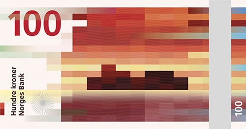 Fig. 1 Norge Bank Notes

The
contrast between the frivolity of the Denver exhibition and the serious
nature of the proposed banknotes is telling; to think of a purely
digital design as endemically related to a national identity means that
the digital has inserted itself into the way we conceive and construct
our own identities. This chapter is focused on making the case that the
New Aesthetic is worth an extended and serious look.

To make the case that the New Aesthetic is worth studying perhaps a
little history is a good place to start with even though it’s only the
most recent of histories. The New Aesthetic as a project was started by
James Bridle, a London-based writer, publisher and artist, upon
launching a new personal website in May 2011.[^book_book_book_book_book_book_book_book_book_01-Chap1_3] The first significant
public and off-internet discussion on the New Aesthetic was held in 2012
at the SXSW conference, one of the most influential creative events in
the world, attended by artists, curators, scholars and professional
nerds. The panel entitled ‘The New Aesthetic: Seeing Like Digital
Devices’ gathered Aaron Cope (designer and engineer), Ben Terrett
(designer), Joanne McNeil (art activist, journalist), Russell Davies
(communications consultant and tech journalist) and James Bridle. In the
description of the panel, Bridle stated:

> We are becoming acquainted with new ways of seeing: the Gods-eye view
> of satellites, the Kinect’s inside-out sense of the living room, the
> elevated car-sight of Google Street View, the facial obsessions of
> CCTV \[…\] As a result, these new styles and senses recur in our art,
> our designs, and our products. The pixelation of low-resolution
> images, the rough yet distinct edges of 3D printing, the shifting
> layers of digital maps. In this session, the participants will give
> examples of these effects, products and artworks, and discuss the ways
> in which ways of seeing are increasingly transforming ways of making
> and doing.[^book_book_book_book_book_book_book_book_book_01-Chap1_4]

In many ways Bridle’s description of the New Aesthetic is intentionally
vague but, at the same time, it did more than just provide a series of
loosely curated examples; it was clear in 2012 that Bridle was still
grappling with the idea and that his blog was functioning like a
curatorial manifesto in his efforts to describe and categorize it at the
time, but at the same time its vagueness certainly created opportunities
that engaged others. {Fig. 2}

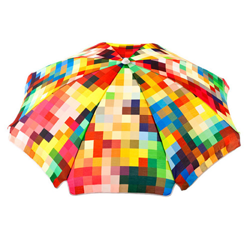 Fig. 2 ‘Le Pixel Umbrella’

The New Aesthetic panel at SXSW and the critique that followed right
after, made the term popular and helped it to gain attention among
certain groups and individuals on the web, e.g. the ‘\#newaesthetic’
hashtag began appearing on Twitter. It went viral and resulted in many
conflicting interpretational approaches and views on what it really was
and which technologically-rooted social and cultural phenomena and
artifacts could be described as examples of the New Aesthetic. The broad
scope of visual media considered as the New Aesthetic was described by
Bruce Sterling in his famous essay published in *Wired* magazine, which
included ‘\[…\] Satellite views. Parametric architecture. Surveillance
cameras. Digital image processing. Data-mashed video frames. Glitches
and corruption artifacts. Voxelated 3D pixels in real-world geometries.
Dazzle camou. Augments. Render ghosts. And, last and least, nostalgic
retro 8bit graphics from the 1980s.’[^book_book_book_book_book_book_book_book_book_01-Chap1_5] Sterling’s description shows
that he was starting to catch on to the notion that there was this new
thing, this new approach, this new attitude, that could be utilized in
an extensive, horizontal and synchronic approach, taking into account
various artifacts, media, tools and works of art of digital origin.
Additionally, a number of the first commenters of the New Aesthetic
grabbed on to the various categories of computational miscalculations
and glitches as a way of identifying fascinating and inhumanly flawed
contemporary imagery as a vital element of the New Aesthetic’s fields of
interest, in a way that contributed new insights into some of the
discussions about the glitch that had been taking place in recent years.
Some critics stressed the political consequences of increased
human-technology interaction as seen by the New Aesthetic.[^book_book_book_book_book_book_book_book_book_01-Chap1_6] Others
emphasized its social and gender-specific context e.g. the ‘politics of
the gaze’[^book_book_book_book_book_book_book_book_book_01-Chap1_7] problem (male vs. machine vs. human).[^book_book_book_book_book_book_book_book_book_01-Chap1_8] David M. Berry
valued the New Aesthetic for stimulating interest in the computational
aspects of contemporary civilization and their political and cultural
impact, but at the same time stressed the unconditional inclusiveness of
the term that result in its vagueness in terms of the accuracy of
description and information.[^book_book_book_book_book_book_book_book_book_01-Chap1_9] On the other hand, Bruce Sterling
criticized its supporters for the anthropomorphisation of technological
artifacts, arguing that their assertion that computers are praiseworthy
because their effects are apparently analogous to conscious decisions is
like praising the Freudian unconsciousness as an autonomous agent.[^book_book_book_book_book_book_book_book_book_01-Chap1_10]

Quickly, the New Aesthetic became a hot topic of conversation, and the
term became commonplace at least among those interested in technology’s
development and impact on society. Yet, almost just as quickly some of
those interested in the New Aesthetic turned away from it, including
James Bridle himself. Obviously, we’re not in that crowd.

What fascinates us about the New Aesthetic cannot be summarized neatly.
It is a non-movement that can’t be easily defined but can be easily
indicated. It’s really cool, in a way, that a thorough academic approach
to the New Aesthetic has not emerged so far when so many new categories
instantly become the subjects of a feverish academic onslaught.[^book_book_book_book_book_book_book_book_book_01-Chap1_11] The
New Aesthetic aims to cover so many contemporary social and cultural
phenomena that any disciplinary approach would be too limited to analyze
it as a whole. However, only a few weeks after the SXSW 2012 conference,
a seminar was organized in the Netherlands in order to elaborate a
critical study of the New Aesthetic. As a result of a booksprint
session, a freely available e-book called *New Aesthetics, New
Anxieties* was written by six authors – new media scholars, artists,
curators and writers.[^book_book_book_book_book_book_book_book_book_01-Chap1_12] The authors focused on many aspects of the
non-movement emphasizing the misunderstandings and anxieties generated
by many instances considered as examples of the New Aesthetic. The
authors were also interested in the influence of network-based
initiatives as the New Aesthetic on their professional work. They
‘attempt to move beyond lazy thinking, positions of pious indifference
or naive enthusiasm, and ask what the New Aesthetic might tell us about
this juncture in which we find ourselves, as curators, critics, artists,
theorists and creative workers’.[^book_book_book_book_book_book_book_book_book_01-Chap1_13] Yet this remains, to date, the
only sustained academic treatment of the subject.

Perhaps what tempts us to think about the New Aesthetic is that it is an
offspring of easily accessible and open web-based communication channels
which, therefore, means that it’s become excessively pervasive and
accessible. The initial response to the New Aesthetic can be
characterized as an intellectual crowdsourcing of collective
intelligence formed of theoreticians and practitioners interested in
human-technology interaction, but we believe that the New Aesthetic is
so wide-spread that care about its effects should be more general. The
viral nature of contemporary communication channels resulted in a rapid
spread of the term and the engagement of multiple agents in its
development, leaving a discussion of this increasingly important
development to the vagaries of a passing fad as it hits the peak of its
popularity lasting no more than a few months is a mistake.

The New Aesthetic is primarily, though not entirely, an internet-based
approach or a cultural phenomenon and, as such, affects or will affect
the lives of the entirety of humanity; as a result, we could describe it
as a real-time web-based enquiry, one that functions within the
construct of web-based activity and is determined by the conditions of
the enquiry; but for the fact that its inclusiveness permits a multitude
of interpretational approaches and standpoints, thinking through the
manifestations of the New Aesthetic is already conditionally
predetermined. Even if our efforts only result in a definition rife with
the vagueness of the term and lacking a firm theoretical background, we
still take the position, as Bruce Sterling has accurately observed, that
the New Aesthetic has touched something new and important.

What makes the New Aesthetic such a challenge is more than just the fact
that it exists at all; Sterling wrote ‘It’s our fault for pretending
otherwise, for fooling ourselves, for projecting our own qualities onto
phenomena that we built, that are very interesting to us, but not at all
like us.’[^book_book_book_book_book_book_book_book_book_01-Chap1_14] We’ve both created the New Aesthetic and become a
recipient of its existence’s implication and, in the digital realm,
therefore, to critically think about it means that it’s necessary to
utilize it at times uncritically. The New Aesthetic covered so many
theoretical and practical fields (i.e. media art, media archaeology,
digital art, digital aesthetics HCI, internet privacy, object-oriented
ontology, programming) that its lack of coherence and methodology was
essentially implemented in the movement from its early days. Even James
Bridle explained that he did not intend to create a new big idea or an
ontology of the 21st century. It seems that Bridle wanted to encourage
people to engage in a discussion, using as many approaches and various
expert knowledge as possible. Concrete methodology and disciplinary
boundaries were of second importance:

> One of the things about New Aesthetic was that it was very much
> supposed to be not “post” anything else and not “pre” anything else,
> it was an observation about something hopefully grander, of which
> these are some current examples of.[^book_book_book_book_book_book_book_book_book_01-Chap1_15]

That is why Bridle chose a blog as a platform for sharing his ideas,
instead of an academic journal or professional magazines, as the
influence of these channels of communication is rather small compared to
open internet platforms. As an example of a new type of enquiry that
benefits from informal channels of communication and information
distribution, the New Aesthetic as a set of phenomena seems almost
naturally situated on (or even limited to) the web precisely because it
has been discussed solely on blogs, on social media and popularized by
talks at business and cultural conferences, but there’s so much more to
be said. Such supposed limitations of theoretical inquiry accompany any
discussion of the New Aesthetic, making evident the discomfort
traditional academia still has with blogs and online discussions as a
source of critical inquiry. It could be argued that the New Aesthetic is
just an artistic performance of a British designer who decided to ‘test’
the creative communities on the web – though Bridle himself writes that
it is an ‘ongoing research project’ – but then again, clearly, the
commentators responded to his call. At the peak of the popularity of the
New Aesthetic, Bridle was so overwhelmed by the interest that he even
suspended the blog for some time, evidence of a growing awareness of its
impact.[^book_book_book_book_book_book_book_book_book_01-Chap1_16]

The New Aesthetic is not without its limitations. It is hardly a firm
academic theory or methodology.

Bruce Sterling argued in ‘An Essay on the New Aesthetic’ that the New
Aesthetic was a very interesting movement, at least potentially. However
Sterling also seems to be saying that, due to its extensiveness and
rhizomatic nature, the very notion of the New Aesthetic wasn’t bold and
critical enough. Many examples of the New Aesthetic were only partially
described or analyzed, but together they form a collective composed of
artifacts, media, tools and works of art that is a direct result of
contemporary information flow enhanced by web-based communication and
they will continue to occur in the future. That is why many of its
commentators emphasized that this approach could be developed in various
directions. At the present stage of development it is more like a
signpost for further enquiry.

The analysis of the New Aesthetic was performed from two perspectives.
The first one focuses on its inner logic and takes into account one of
the themes that the New Aesthetic itself is concerned with – revealing
the grain of computation in digital visual media by focusing on
glitches, image processing artifacts etc. By emphasizing the abnormal in
digital images, we can fully perceive its computational materiality
along with limitations of today’s visual media. Taking into account
rapid technological development – high-definition images and displays,
intuitive interfaces and services – this approach seems crucial for a
critical and postdigital enquiry on the status of today’s media. The
second perspective studies various forms of visual media in the spirit
of the New Aesthetic, identifying their complexity, processual nature
and their standardization, as the effect of the New Aesthetic becomes
more perceptible like, for example, in the previously mentioned recent
design of the Norges Bank currency.

At least one thing is clear: the New Aesthetic is dependent on the
digital turn, the shift in contemporary culture when information
presentation has moved from being an analog ontological relation to a
digital relation. This has involved more than simply a change in the
form of the information but a radical shift in the style of the
presentation of the information; as Wim Westera writes:

> Technology and human life are inextricable. Whatever we do is either
> directly or indirectly linked with machines, tools, or digital media.
> Any product we buy, be it peanut butter, fruit, or a bunch of flowers
> is the outcome of a hidden processing chain containing numerous
> calculations, transport, raw materials, mechanics, administrative
> files, orders, and coordinative messages, many of which are carried by
> digital media.[^book_book_book_book_book_book_book_book_book_01-Chap1_17]

Everything has become digitized and, thus, every set of information
surrounding our lives has become digitally available. In this respect,
the digital turn is a real-time operative and manifest condition that
has emerged as a schizophrenic force in contemporary society, whereby we
are able to both control our world digitally but whereby we can also be
controlled digitally in a way that is ignorant of such control.
Recognizing the importance of the digital has become a de rigueur
exercise among cultural theorists, such that descriptions of its
pervasive presence and power are commonplace and widely accepted. David
M. Berry writes: ‘From its early days as a mechanism used to perform
data processing, the digital is becoming the de facto medium for
transmitting information, communicating and for sharing social life.
Through these important functions the digital becomes a privileged site
for social and political engagement and therefore it is increasingly
important that we understand the digital and offer the possibility of a
critical theory of the digital.’[^book_book_book_book_book_book_book_book_book_01-Chap1_18] While such a perspective is
received unquestionably in all branches of cultural theory, nevertheless
the shift of the digital from a functional tool to a ‘de facto medium of
information’ is startling in its implications and cannot be taken for
granted; whereas the horizon of digital objects once was a set of
explorable and relatively unknown territories, wedged into limited but
functioning parameters by computer scientists so that they could be
employed as an external language and utilized to increase the accuracy
of describing our experience and codifying the resultant data, today
we’re in entirely different circumstances. The creation of code now
feeds the evolutionary and organic growth of the digital in order for it
to operate with even greater autonomy, independent of the rarified
controls found in a computer science laboratory. Witnessing the growth
of apps available for Apple iOS as just one example – what started with
500 in 2008[^book_book_book_book_book_book_book_book_book_01-Chap1_19] has now reached 1,200,000 by mid-2014[^book_book_book_book_book_book_book_book_book_01-Chap1_20] – is like
witnessing the exponential replication of viruses and bacteria. Over the
course of several decades we have been increasingly relying on the
computational in many domains of our activity at a civilizational level:
in business it has taken over with algorithmically-based high-frequency
trading, with approximately 73% of the equity trading and 60% of futures
trading in the United States occurring without any human decision;
societally our ability to bank, shop and interact with our fellow human
beings is increasingly governed by our digital presence, with Facebook
now becoming a legally serviceable address for court documents in
Australia, New Zealand, the UK, Germany and other countries; and in
cultural activity where there is a persistent decline in the education
in and use of analog technology like photography film in favor of
digital cameras to the point that the majority of universities
world-wide are exclusively hiring digital photographers as faculty
members. We are not favoring the analog and we’re certainly not
Luddites, but the digital turn has become more than just a ‘turn’,
instead it’s become a dominant force in contemporary society that is
increasingly beyond the control of its users. Technological
advancements, still to some extent based on Moore’s law, are resulting
in a logarithmically exponential increase of the computational capacity
of electronic devices, but what is fascinating is that the limitations
of the applicability of computational capacity may not be limited so
much by hardware but rather by its intrusion into human capacity, in
that there will be at some point fewer and fewer opportunities for
digitalization to govern the world. We are living in a time in which it
is becoming increasingly difficult to realize and act analogically. In
this respect the New Aesthetic becomes a signpost, of sorts, that the
digital has become more of a processual condition that our civilization
is based on, instead of being just a ‘turn’ or a ‘revolution’ understood
as a fixed moment in time.

To simply list a series of examples of digital phenomena in our world is
insufficient. From our perspective, the tendency towards pervasive
digitalization could be assessed by focusing on either its ontological
effects or through an analysis of various epistemological perspectives.
In the case of the ontological, often an important tenant of the digital
humanities, there is a tendency to move towards the conclusion that all
experience is digital at its foundation. With an emphasis on the
abstraction of real world experiences into digitally accounted data,
through the persistence and pragmatic reduction of sequential
experiences to concomitant time-related informational streams and in the
increasingly complex and assumptive manifestation of desire structures
of data-dependent human beings, we run headlong into situations such as
Ashton’s the Internet of Things; the convergence of connected devices
starts to not only predicate decisions about replacing items in vending
machines, for example, or governs market supply chains, but even more
preemptively starts to choose our homes’ temperatures prior to our
return to work based on digitally evolving models of our preferences. As
a result, a whole new species of semi-autonomous and autonomous beings
have become vital constituents of our lives both at an individual and at
a social level. A digital ontology asserts that the entire nature of
reality is structured, and the digital becomes the sole means whereby
the structure is effectively navigated. In the case of the epistemic,
the status of knowledge has changed as it has become digitized; whereas
epistemic questions once were subjected to logic and rationality, with
the likes of Descartes and Kant painstakingly exploring nuances and
dead-ends in the hopes of being self-satisfied that the answers to their
questions were ensconced within necessary and sufficient conditions, the
notions of big data and meta-data assert that the world can only be
known once it has been digitized and, as knowledge itself ceases to be
locally relative, that it has become singularly absolute. Things are
true because we’ve read them (not read about them, but ‘read them’) on
the internet, which we’re always carrying around in our pocket, with
philosophical implication extending beyond the epistemic and ontological
concerns into the necessity of a teleological approach.

Focusing on either an ontological or epistemic position yields
interesting insights, but often it becomes entangled in an implied
negative critique of the digitalization of the world. In the case of the
ontological perspective, resistance inevitably arises to the notion that
the world of experiences must necessarily be accounted for in a binary
manner; surely, it’s assumed, there will always be instances when the
digital method is insufficient, when directed rather than mediated
experience and an emotional response is more appropriate. In the case of
the epistemic perspective a negative critique runs along similar
notions, especially in the context of some Romantic idea of the primacy
of human rationality. These pitfalls are inevitable and, because they
are inevitable, we would like to avoid them. So where to turn? By
recognizing the dialectic between the ontological and the epistemic
perspectives, a synthesis is possible; given an ontological perspective
that turns outward to the world as it accounts for potential experience
in a relationship between an epistemic perspective that turns inward to
secure knowledge, there is a middle ground that is dependent on both
while being yet a third form of experience: the evaluative or the
aesthetic. Visual models of communication and information distribution
have increased social and cultural reliance on the digital,
necessitating analyzing contemporary society and culture in two ways:
first, by recognizing that the autonomous digital products have an
aesthetic existence in-and-of-themselves and second, by allowing for an
appreciative and evaluative approach to these objects. Ontological and
epistemological conditions of contemporary society manifest themselves
in everyday practices rooted in digital visual media which can be edited
and transformed into many kinds of media hybrids because of its powerful
processing units and creative software; it is those hybrids as synthetic
products that are, perhaps, the most interesting. We have reached the
point where autonomous and synthetic objects necessitate new approaches,
driving forms of artistic production.

What we mean by computational visual media is a category of digital
products that are more than just programmable pieces of data that are
often perceived through high-definition still images, movies, CGI or
graphical user interfaces but are experienceable and self-determining
phenomena in their own right, displayed on ultra-high definition
displays and accessed and edited thanks to intuitive user interfaces;
with the increasing processing power available in decreasing physical
parameters[^book_book_book_book_book_book_book_book_book_01-Chap1_21] partnered with a graphic user interface that seemingly
grasps our intentions spontaneously and predictively, conditions are
being constructed whereby the output of the device assumes an
unquestioned and teleologically natural state. The very computational
materiality of today’s visual media is, indeed, hidden beneath layers of
user-friendly software, hardware, networks, cloud-based processing and
storage services to the point (and, importantly, designed to that point)
of increasing invisibility, with the implications or the
predeterminatively agreed conventions that it will just work without any
need for a user to change its operating parameters. {Fig. 3}

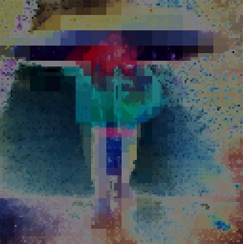 Fig. 3 Image Processed Through Decim8

In many
respects, the benefits have been self-evident, and it’s impossible to
review the multitude of programs without being in awe of the
innovativeness and ingenuity of their designers and programs; this
extends beyond simply new ways of accounting for data or new ways of
manipulating data to entirely new ways of dealing with the mundane to
the profound: for instance, the explosion of new types of devices and
services has resulted in the continual development of services,
platforms and computational devices which foster new forms of cultural
and social engagement enhanced by technology, extending beyond simply
being able to contact friends and family instantaneously around the
world to being able to alter the political landscape through spontaneous
social collaboration and action. These phenomena occur right in front of
us and simultaneously affect many areas of human activity (business,
culture, science), both at an industrial and at a consumer level of
human-computer interaction in a positive and productive way. We have
entered an era of real-time communication and knowledge generation and
distribution that is fostered by multi-purpose devices and mobile
internet access – many new ideas are now born due to the inclusive and
non-hierarchical models of web-based communication, such as personal
publishing services (blogs, websites), social media and informal
discussion groups where both professionals and non-professionals as well
as practitioners and theoreticians alike share and discuss new ideas –
but what is increasingly clear is that these phenomena are synthetic in
nature and effect, affecting and transforming in their use our
perception of the world while simultaneously creating their own worlds.
In short, we’ve entered a new form of experience best labeled
‘postdigital’ as an indication that the digital revolution is over.[^book_book_book_book_book_book_book_book_book_01-Chap1_22]
The world of raw data and technology, while being in front of us, is
usually hidden underneath graphical user interfaces, smooth high-res
images, seamless user experience and touch-screen Retina displays. The
New Aesthetic rejects ‘screen essentialism’ and encourages us to
perceive contemporary reality as an ‘augmented space’ filled both with
human agents and computational artifacts (devices, networks) that
interact and influence each other. Mel Alexenberg describes this as:

> Of or pertaining to art forms that address the humanization of digital
> technologies through interplay between digital, biological, cultural,
> and spiritual systems, between cyberspace and real space, between
> embodied media and mixed reality in social and physical communication,
> between high tech and high touch experiences, between visual, haptic,
> auditory, and kinesthetic media experiences, between virtual
> and augmented reality, between roots and globalization, between
> autoethnography and community narrative, and between web-enabled
> peer-produced wikiart and artworks created with alternative media
> through participation, interaction, and collaboration in which the
> role of the artist is redefined.[^book_book_book_book_book_book_book_book_book_01-Chap1_23]

The key here is the betweenness, the notion of a mixed reality, the
synthesis. Baudrillard was only partially correct: what governs our
experiences is not hyperreality but hyperrealities. It is in this space
that the New Aesthetic has emerged and is defined.

The digital visual culture that has been a foundation for the emergence
of the New Aesthetic is just one of the manifestations of a greater
shift our civilization has been undergoing with the digital turn and
postdigital aesthetics; the New Aesthetic has necessitated not just a
new perspective but a new approach or a new type of attenuation.
Postdigital aesthetics require a cross-disciplinary theoretical and
practical approach, which addresses the trends described above, going
far beyond a mere theory of beauty of digital images.

## Real-Time Effects of the New Aesthetic

The New Aesthetic, for example, emerged as a direct result of real-time
communication channels enhanced by computational technologies. On the
one hand it can be understood as an approach useful in digital image
analysis as it unveils the simultaneous materiality and instability of
contemporary imagery by focusing on the abnormal (image processing
errors, glitches, artifacts etc.) On the other hand, taking into account
the origin and development of this approach the New Aesthetic should be
considered as one of the manifestations of the radical shift in the
emergence of ideas and knowledge distribution in the digital age. The
New Aesthetic is based on real-time data generation and distribution as
it was born and developed thanks to internet-based channels of
communication and exchange of ideas, but what emerges with the New
Aesthetic is something quite powerful that remained relatively unnoticed
until James Bridle started his blog in May 2011. Nowadays this approach
can be generally described as a cross-disciplinary approach recognizing
the consequences of synthetic and autonomous objects through
human-technology interaction and an analysis of new non-anthropomorphic
agents, forces and computational patterns that are present both in the
digital sphere and in the physical world. As the identification process
of New Aesthetic objects accelerated and grew in confidence, it became
clear that they were manifesting themselves through visual digital media
and new social and cultural practices involving humans and technological
artifacts in a plethora of fashions. Bridle’s initial focus on the
visual manifestations of the New Aesthetic prompted the blog’s
horizontal stream layout containing several types of digital visual
media: images, movies, graphics, GIFs. In his first entry, James Bridle
wrote:

> Since May 2011 I have been collecting material which points towards
> new ways of seeing the world, an echo of the society, technology,
> politics and people that co-produce them. The *New Aesthetic* is not a
> movement, it is not a thing which can be done. It is a series of
> artifacts of the heterogeneous network, which recognizes differences,
> the gaps in our distant but overlapping realities.[^book_book_book_book_book_book_book_book_book_01-Chap1_24]

And, on another occasion:

> I started noticing things like this in the world. This is a cushion on
> sale in a furniture store that’s pixelated. This is a strange thing.
> This is a look, a style, a pattern that didn’t previously exist in the
> real world. It’s something that’s come out of digital. It’s come out
> of a digital way of seeing, that represents things in this form. The
> real world doesn’t, or at least didn’t, have a grain that looks like
> this.[^book_book_book_book_book_book_book_book_book_01-Chap1_25]

In this sense, to analyze the New Aesthetic is to engage in a form of
topological description from a new perspective and position, identifying
relations that exist beyond simply manifest usage to objects that are
autonomous. This has been done before in a parallel way for similar
objects, and in analyzing the New Aesthetic we intend to follow the
phenomenologically driven methodology introduced by Vilém Flusser in his
1983 book *Towards a Philosophy of Photography*.

Flusser’s approach is useful both for studying the inner logic of the
New Aesthetic (its interest in computational images) and for analyzing
it as one of the manifestations of computationality understood as a
condition of contemporary civilization. Flusser argued that by
describing complex relations between a camera (apparatus) and a human
being (user) we can shed light on the condition of contemporary
civilization which is founded on (mega)mass production and distribution
of images, writing: ‘The invention of photography constitutes a break in
history that can only be understood in comparison to that other
historical break constituted by the invention of linear writing.’[^book_book_book_book_book_book_book_book_book_01-Chap1_26]
In the process of being able to reproduce the appearance of reality, the
status of such reproductions became portable, mobile, and transmittable;
whereas descriptions of the world were once dependent on lengthy
exposition of words, photography placed an immediate form of perception
in the hands of everyone, especially as the technology became less
expensive, more widely available, and needed decreasing amounts of
intervention on the part of the image producer to create satisfactory
images. To put it another way, Flusser argued convincingly that
photography constituted a new form of knowledge, one that didn’t need a
mediating subjectivity explicating at length its intended effect. What
is especially important about Flusser’s ideas in relation to the New
Aesthetic is that this shift from writing to photography was entirely
dependent on technological innovation; the camera became more than just
a tool, it became an apparatus that could be manipulated by the user but
which had a schematized set of limitations that were, nevertheless,
assumed to be sufficient and self-sufficient to the task. He explained
that, ‘nothing can resist the force of this current of technical images
– there is no artistic, scientific or political activity which is not
aimed at it, there is no everyday activity which does not aspire to be
photographed, filmed, video-taped’.[^book_book_book_book_book_book_book_book_book_01-Chap1_27] In essence, this shift marks a
relinquishment of the user of their freedom to the apparatus’ methods,
creating a new topology of knowledge that had profound ontological and
epistemic consequences because the user, even if they believe they are
exerting control over the photographic process, never produces images
except through the programmed character of the apparatus. Flusser
recognized that this shift and its consequences needed to be addressed,
writing:

> It is consequently the task of a philosophy of photography to expose
> this struggle between human being and apparatuses in the field of
> photography and to reflect on a possible solution to the conflict
> \[…\] \[I\] will illustrate that the photographic universe can serve
> as a model for post-industrial society as a whole and that a
> philosophy of photography can be the starting point for any philosophy
> engaging with the current and future existence of human beings.[^book_book_book_book_book_book_book_book_book_01-Chap1_28]

In many respects, Flusser is arguing for two paths of philosophical
effort: first, that philosophy should investigate how any epistemology
is inevitably changed by photography and second, what moral and ethical
challenges need to be addressed because of that change. Although his
argument was formulated in the 1980s, it is even more valid today as
computational power related to image making has increased exponentially
and through it, such that the standardization and quantification of
social and cultural practices are much more profoundly effected. While
we disagree with Flusser’s notion that advances in technology constitute
a threat to the human condition per se – in this respect, any notion of
a ‘threat’ is dependent on an attachment to the notion of being human as
having a culminating state of development, a high point if you will,
that seems excessively modernist in its origins – we absolutely agree
with his point that technology’s development towards networks of
automation independent of human control creates a new ontological
condition and extend it to the notion that photography represented
merely the first stage of technology’s pervasive encroachment into our
lives. If nothing else, the abandonment of analog cameras and, even,
digital cameras in favor of phones as photographic devices signals both
an end of photography’s technology as a determinant in our lives and the
furthered role of the postdigital turn that the New Aesthetic
represents.

The shift towards an emphasis on the visual is part of this new,
necessary attitude that recognizes the effect the New Aesthetic is
having in the world. The New Aesthetic is that new epistemic and
ontological condition, both of the world while making its own world.
Bridle’s cataloging of various objects, even if it was without any
sustained critical analysis of overlapping characteristics, made evident
that it is no longer sufficient to study contemporary visual phenomena
in terms of classic aesthetics; the digital nature of contemporary
imagery requires media studies, software studies and, in general, a
digitally informed approach particularly if we take into account changes
in the humanities as a set of academic disciplines as well as a set of
creative activities. What is particularly important, coming out of our
understanding of Flusser’s ideas, is to stress that this approach is
primarily through images, primarily through the visual. Think of the way
we interact with data today. One way is to look at projects such as the
Palladio platform, developed by the Human+Design Research Lab at
Stanford University, that takes on a justified faith that visual
representation of data leads to insightful and critical new discoveries
of the relations between various trends;[^book_book_book_book_book_book_book_book_book_01-Chap1_29] at the Text Encoding
Initiative Conference in October 2014 at Northwestern University, Thomas
Faith and Joseph Wicentowski, working for the Office of the Historian in
the U.S. Department of State, presented ‘Visualizing the History of U.S.
Foreign Relations: The State of TEI at Foggy Bottom’ – how they’ve used
Palladio to visualize the encoded Foreign Relations of the United States
series, a 150 year old, 500 volume document that is the official history
of United States foreign policy.[^book_book_book_book_book_book_book_book_book_01-Chap1_30] Another way is to consider the
development of Ubiquitous Learning Materials as an effort to shift the
educational process away from a linear instructor-centered model to an
immersive, social model utilizing mobile devices in order to remove the
stress of the classroom experience while preparing students for ‘real
life’; a perfect instance of this is the Philippines Smart
Communications’ project TXTBKS[^book_book_book_book_book_book_book_book_book_01-Chap1_31] {Fig. 4} that provides transcribed
elementary school textbooks to children through discarded mobile phones.

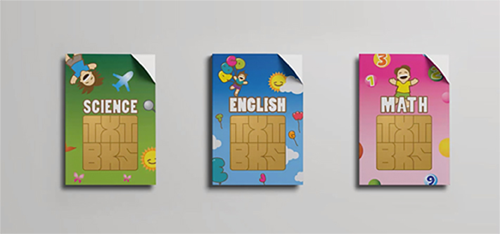 Fig. 4 Smart Philippines Textbooks

Everything is increasingly visual, including text to the detriment of
textuality. Still, these are singular instances and it is on the more
pervasive ways that we use data that we’re focusing: our worlds are not
our ‘smart’ phones just yet, but increasingly it feels that way, and the
very fact that they are described as ‘smart’ signals a shift in how much
we rely on them and how much we don’t rely on our own knowledge, our own
experiences, our own sense of our place in the world. Because the
aesthetics of digital images are a consequence of constant, real-time
interaction between many software and hardware layers that disappear as
they are supplanted by newer instances, and precisely because such
layers are the synthetic products of ontological and epistemic shifts
such that these interaction becomes aesthetic, we believe that there is
a necessity to shed light on the many ways in which digital images have
become autonomous actors in the world.

Because of this visuality, the nature of New Aesthetic objects is quite
different from normal digital objects. In most cases, digital products
adhere to a simple presentation of information, often governed by the
type of data being provided; by allowing a certain degree of
simplification one could propose an equation: digital visual media =
algorithms + data structure.[^book_book_book_book_book_book_book_book_book_01-Chap1_32] An easy example of this is the typical
Excel spreadsheet, which has its origins in a program called Multiplan,
was code named ‘EP’ for ‘Electronic Paper’ and released in 1982 as a
competitor for Lotus 1-2-3.[^book_book_book_book_book_book_book_book_book_01-Chap1_33] Multiplan’s code name is revealing in
that there was every intention of imitating and being visually analogous
to an accounting ledger’s columns for ease of use. However, digital
objects have shifted dramatically as contemporary digital images have
increasingly become products of software ecosystems, which offer certain
pre-determined templates and cross-media processing and editing tools
that are often utilized as means of data organization and presentation
prior to their representation in a graphic user interface. New Aesthetic
objects as the most dynamic form of contemporary digital aesthetics are
therefore the product of a computational aesthetic based on media
software – within its limits and capabilities. By limits and
capabilities we mean their interfaces, the tools, and the techniques
they make possible for accessing, navigating, creating, modifying,
publishing, and sharing media documents i.e. creative software
ecosystems equipped with standardized presets, image processing tools
and ecosystems (GIMP, Adobe Creative Cloud), image encoding and decoding
standards (MPEG, JPEG etc.) There is hardly any element of software and
hardware that is neutral for the final aesthetics of the image. By
studying only the layer closest to us – the digital image displayed or
projected on the screen – we ignore the existence of hidden
computational layers and their influence on the aesthetics of the
images. The New Aesthetic reminds us that the computational layer of
digital media is inextricably linked with the cultural layer.[^book_book_book_book_book_book_book_book_book_01-Chap1_34]

In this light, the New Aesthetic encourages us to take a postdigital
approach in studying computational-based visual media. This might lead
to a sense that we should only be interested in the surface of the
digital object, the screen through which the user interacts with the
software and hardware, but to keep that as the primary focus of
aesthetic analysis is a failure in light of normative aesthetic
interpretative strategies which demand a deep form of evaluation.
Therefore we argue that we should avoid screen essentialism – that is, a
screen-centric approach in image analysis as the privileged site for
research – precisely because we do not want to limit ourselves to
judgments of appearance or usability alone. Berry argues that ‘without
an attentiveness to the layers of software beneath this surface
interface we are in danger of further screen essentialism’.[^book_book_book_book_book_book_book_book_book_01-Chap1_35] Indeed
he further remarks, ‘computational tools assist by providing mediation
and advising and providing structure for a world full of data, real-time
streams and complex calculations required from its citizens. This
computational assistance or monitoring is backgrounded and often hidden
from us.’[^book_book_book_book_book_book_book_book_book_01-Chap1_36] Marianne van den Boomen also rejects the screen-centric
approach in her book on digital metaphors (particularly in studying
GUI), although her point is applicable to any kind of computationally
rooted imagery. She explains, ‘what you see, is what you get, which
suggests that, that is all there is to get. The machinery gets reduced
to the screen, or better, to the representations on the screen. The
screen shows but also blinds.’[^book_book_book_book_book_book_book_book_book_01-Chap1_37] It is in the interplay between
screen and the underlying software and hardware that the New Aesthetic
manifests itself, not just in its immediate appearance. Although much of
the final aesthetic~~s~~ of the digital image is a direct result of the
existence of layers of underlying dynamics, in viewing the final image
we are not aware of them; even more so, increasingly, because digital
objects are dependent on a modular programming approach the final
designers themselves are not aware of the underlying functions actively
driving such things as notifications, interactions with system software
and interactions with additional software on the device. The raw
computational materiality of images comes to the foreground when we go
off-road from the usual models of image transformation and focus instead
on the breakdowns and abnormalities of the usual computational-based
artistic processes.

## Abnormalities of the Digital, or Where the New Aesthetic Begins

That being said, all is not perfect. If there is any one feature that
distinguishes a New Aesthetic object from its predecessors it’s the
appearance of the glitch as accepted, even aesthetically determinative
and welcome, in contrast to visual hyperrealism understood as
standardization. One of the most important properties of contemporary
civilization considered as computationality is standardization, wherein
concomitant expectations of a similar experience are shared across
users; we expect a ‘polished’ experience, whatever that might mean, and
in many instances are startled when our software doesn’t ‘just work’.
Digitally-based culture, business, administration and other domains of
our human activity operate based on computational data with the
expectation that they ought to be standardized in order to guarantee a
constant flow of real-time information based on application programming
interfaces (APIs) and protocols. From the users’ perspective,
standardization is clearly visible in everyday practices of
human-computer interaction. We often operate within certain software and
hardware ecosystems which offer unified interfaces and user experience –
for example, Google, Apple, Microsoft or Adobe ecosystems – and this has
become a powerful notion, especially well articulated by Matthew Fuller
in his *Media Ecologies: Materialist Energies in Art and Technocultures*
as it emphasizes the role of the standard object in contemporary
computational culture. We would even argue that various types of
standard objects (physical – shipping containers or iPhones and digital
– codecs or file formats) have become a vital constituent of a
post-Fordist economy in that their consumption transcends industrial
modes of production in favor of individual contributive modes of
participation. According to Fuller, standard objects are ‘ideally
isolated systems’[^book_book_book_book_book_book_book_book_book_01-Chap1_38] and separate entities within the universe and
Fuller, following Alfred Whitehead’s logic, argues that ‘such objects
become crucial to the generation of media and communications networks
and the organizations that handle them’ and then adds that the standard
object ‘refers most easily to things that are mass-produced: cars,
houses, the customizable ring of a telephone’ or standardized
technologies i.e. packet switching, compression algorithms etc.[^book_book_book_book_book_book_book_book_book_01-Chap1_39]
Post-Fordist products are quite different in that they maintain a
semblance of standardization while at the same time being eminently
capable of being personalized; in fact, post-Fordist objects are sold to
the user on their basis of customization rather than on their standard
functionality.

The implications of this shift from standardization to customization is
quite profound. The appearance of ‘evidence’ of a shift from unmediated
consumption to mediated and synthetic personalization is an illusion; we
believe, at least unconsciously, that we are participants in the
‘manufacturing’ process, that our expectations are being personally met
precisely because they are our expectations that the manufacturer is
attentive to, but this mediated form of consumption is generally false
in many digital objects and particularly in New Aesthetic objects
because the programming skills necessary for such modifications is not
only beyond the skill level of the typical user but often entirely
ignored by the programmer. The importance of the shift away from
standard objects for today’s society and culture founded on
computational technologies is hardly arguable. James Stevens of Free
Networks, cited by Fuller, states that ‘The information age has boiled
down the magic of telecommunications into a set of modular components
that any of us can adopt and explore.’[^book_book_book_book_book_book_book_book_book_01-Chap1_40] Nevertheless, this magic is
not even that because it’s not trickery that’s under the control of a
‘magician’ as programmer but a seduction of the user through the user
interface, a seduction the leads the user to erroneously believe they
are in control of them software and hardware. Taking Fuller’s
perspective, a critical approach to the New Aesthetic is an
identification of a new category of independent objects beyond the
post-Fordist, most easily identifiable by the acceptability of these
self-generated failures called glitches.

The glitch is a well-known phenomenon; often described as a short-term
error, it is often regarded as a small problem that can be either
ignored as unimportant or quickly fixed with minimal effort, minimal
knowledge or simply by resetting the device. {Fig. 5}

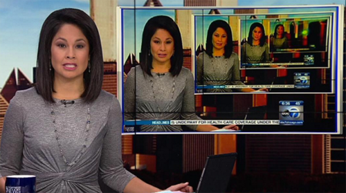 Fig. 5 Glitch Image of Newscaster

New Aesthetic
objects, as a visual sub-genre sufficiently distinct from standard
digital objects, are different because they manifest the glitch as a
natural part of their use; while seemingly unintended they are often, at
a phenomenological level, inherent to these objects and making explicit
their distinctly digital and, most importantly, different form of
existence from our own. As a position of analysis, any investigation of
the New Aesthetic is particularly interested in glitches and signal
processing errors that result in image artifacts and deformations
because they represent a form of digital autonomy beyond the users’
control. If pixelization considered as an aesthetic pattern reveals the
‘grain of computation’ in digital media, glitches and errors unveil also
the very fact of media softwarization and the limitations of these
processes.

It’s
safe to say that any glitches that appear would reveal that there’s no
human ‘management’ of memory, for instance, and that this lack of
management creates an exposure as an opportunity for autonomy. In this
state of exposed computation – which is all too often not exposed to the
user – the primal advantage of standardized systems found in seamless
digital data integration and transformation is no longer valid and
normally hidden forces of the computational are revealed to be a
continual disruption in the use-process. Consequently, not only the
aesthetic properties (quantization, discretization) of digital media are
clearly perceptible, but also the politics of power of the digital age
as the end-user needs are subordinated to workflows programmed by
software or hardware vendors. The New Aesthetic emphasizes the
computational nature of contemporary digital imagery precisely because
the glitch, or the potential for the glitch as a breakdown of the
immediacy of the user’s interactive capabilities, is an extensive
element of New Aesthetic objects that marks their independence through
an autonomous utterance. By focusing on visual patterns, glitches and
signal processing errors our analysis of the New Aesthetic highlights
this fundamental property of digital images which is usually hidden
beneath the state of the visual content. Up until this point it would be
natural to assume that New Aesthetic objects are only digital objects
appearing on laptops, smartphone and tablets, with some expansion, to
the interface found in everyday digital interfaces such as the screens
of ATM machines, the menus for digital television services or the
growing use of interactive touchscreens found at airports, train
stations, libraries and on vending machines, but these objects have been
a part of the modern social and cultural horizons for longer than
expected.

## Constellations of the New Aesthetic

All of these certainly are examples of the growing number of New
Aesthetic objects – of course, not all examples are New Aesthetic
objects – but New Aesthetic objects are also found in the art and design
world in an important but distinctively different form. Every day we
perceive motion pictures, digital photographs, 3D graphics etc. and we
are seduced by their aesthetics; taking a cue from Kant, aesthetic
choices are a constant part of our lives as tests of epistemic certainty
and judgments of moral value; any analysis of these objects is also
going to become an analysis of similar art objects. In the modern world,
artists have been interested in the way the world has been influenced
not just by changes in technology but in the manner that technology has
often driven those changes. Ferdinand Léger’s 1919 painting *The City*
{Fig. 6} prophetically indicated what is true of our contemporary
experience of the world, that we would be bombarded by such a plethora
of levels of detail and color range, by the encoded linguistic structure
of modernity, that we would begin to give up and retreat from an active
representation of ourselves in the world into a passive absorption of
experience such that we would see thinking about the conditions of the
formation of communicative objects as beyond our control. 

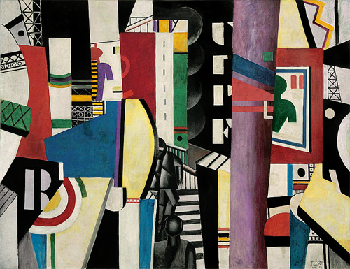 Fig. 6 Ferdinand Léger, *The City* (1919)

It is only in
the last ten years that Léger’s and Baudrillard’s vision of the world
has become a dominating characteristic of our age, and artists have
started to consciously use New Aesthetic styles to alert us to this
state of affairs. By employing digital images that are the result of
complex hardware and software interactions which fundamentally influence
their aesthetic, New Aesthetic artists such as Matthew
Plummer-Fernandez, Ralf Baeker, Mishka Henner, Aram Bartholl, and
Mathieu Tremblin remind us not only about New Aesthetic’s limitations
and unreliability but its effect that itself limits and makes
increasingly unreliable our experience of the world. This is extremely
important in the computer-driven age that we live in, in that the world
is becoming computer-driven and computer-determined. 
The authors of *New
Aesthetic, New Anxieties* write that ‘The New Aesthetic, in other words,
brings these patterns to the surface, and in doing so articulates a
movement towards uncovering the “unseen”, the little understood logic of
computational society and the anxieties that this introduces.’[^book_book_book_book_book_book_book_book_book_01-Chap1_41]
Often, it is artists who best capture the anxiety and the potential in
the underlying conditions, and we look forward to discussing ways in
which contemporary artists are both utilizing and responding to the New
Aesthetic.

The New Aesthetic is like a hashtag or meta-tag assigned to many
phenomena, approaches, perspectives and people that we argue is more
than just a movement rooted in web 2.0 culture using the operational
logic of the hyperlinked interface and freely shareable information.
Therefore, from a classic academic perspective it may seem vague,
inaccurate and simply not worthy of any attention but it is a
manifestation of the greater ontological shift our civilization is
undergoing due to computational-driven processes and computational
literacy. In this respect, one of the central tenets of our description
of the New Aesthetic is based entirely on our belief that our
contemporaneity can be described as computationality. The concept of
computationality was coined by David M. Berry and is used in his
*Philosophy of Software Code and Mediation in the Digital Age* (2011),
on his blog (*stunlaw*) and was later developed in *Critical Theory and
the Digital* (2014). Berry writes: ‘Computationality is therefore an
ontotheology, which when read through Heideggerian categories can be
understood as creating a new ontological “epoch” or a new historical
constellation of intelligibility.’[^book_book_book_book_book_book_book_book_book_01-Chap1_42] Computationality can be
understood as a set of social and cultural practices rooted in digital
technology. We can also consider it as an ontological description of the
contemporary civilization which is deeply shaped by software and digital
management of data. Therefore, computationality should be then
understood as the very condition for emergence of such approach as the
New Aesthetic, focusing on ‘revealing the grain of computation’, as it
enables us to perceive the conditions underlying contemporaneity
considered as computationality.

## The Postdigital Condition

Why should we bother with yet another ‘post’ notion? Florian Cramer, one
of the first proponents of the ‘postdigital’ clearly stated that this
‘term sucks but is useful’.[^book_book_book_book_book_book_book_book_book_01-Chap1_43] We are willing to agree with him on
that matter. In the following paragraphs we hope to prove that the
postdigital approach is of vital importance for our endeavor to
conceptualize the New Aesthetic. Additionally, the postdigital as
described by its advocates may be quite helpful in assessing the
cultural and social consequences of the latest computational
technologies – manifested by multi-layered software, black-box hardware
and ubiquitous computing. We agree with David M. Berry and Michael
Dieter who write that in the last decade, ‘computation \[has become\]
experimental, spatial and materialized in its implementation, embedded
within the environment and embodied, part of the texture of life itself
but also upon and even within the body’.[^book_book_book_book_book_book_book_book_book_01-Chap1_44] Both the New Aesthetic and
the postdigital take into the spotlight unique characteristics and
affordances of the latest computational technologies, instead of just
putting them into the very same ‘digital basket’ where each and every
technological artifact has been residing in for the last thirty years.
Both the New Aesthetic and the postdigital signal and acknowledge the
fact that in the last few years, technology’s impact on society and
business has manifested itself in a profound and unprecedented scope.

Florian Cramer proposes several interpretative leads that we can use to
conceptualize the postdigital. Each of them touches upon a different set
of phenomena associated with the digital, taking into account some
cultural artifacts, computational tools and a few broader trends that
have lately emerged in the digital society, while responding to the
research questions asked by different academic disciplines. We are
proposing a kaleidoscope of the postdigital.

Following on Cramer’s work, we argue that the postdigital should not be
understood as a new temporal period that comes after the ‘digital’ as
its prefix would suggest. The postdigital rather strives to characterize
new economic, social and cultural contexts that have been introduced in
the last decade due to the general evolution of computational
technologies towards even more autonomous systems, ubiquitous devices,
real-time and cloud-based software and services. The term does not
describe an era which is no longer formed by the presence of
computational technologies. Quite the opposite, as it is rather
interested in emphasizing the fact that the ‘digital revolution’ has
already taken place, and through the latest innovations in the age of
autonomous systems, ubiquitous computing, networks and clouds, the
digital has been even more embedded with us and the environment. This
has left a profound imprint in many areas of our society and culture
such that the ‘“post-digital” in its simplest sense describes the messy
state of media, arts and design after their digitization (or at least
the digitization of crucial aspects of the channels through which they
are communicated)’.[^book_book_book_book_book_book_book_book_book_01-Chap1_45] The postdigital is therefore interested in
assessing these consequences by locating, conceptualizing and critically
examining manifestations of the postdigital condition in society,
culture, economy etc. Cramer compares the postdigital to other post-like
notions (post-punk, post-communism, post-feminism, post-apocalyptic
etc.), emphasizing that the crucial difference between the initial
appearance of the idea or movement and its post- version is that it ‘has
progressed from a discrete breaking point to an ongoing condition – in
Heideggerian terms, from Ereignis to Being’.[^book_book_book_book_book_book_book_book_book_01-Chap1_46] This is one of the
crucial points to be remembered when dealing with the postdigital. For
us, both the New Aesthetic and the postdigital approach offer a unique
paradigm that enables us to grasp and encapsulate various phenomena
within the area of media, art and culture that are distinctive for the
specific phase of evolution of the computational – the phase that came
right after the ‘digital revolution’ – that is now understood as a fixed
time event which has ended.

Cramer stresses that the postdigital stands in opposition to the
quasi-teleological and linear understanding of technological progress
that is centered around narratives of innovation, efficiency, disruption
etc. In these paradigms yet more powerful and efficient software and
hardware are the very conditions of social and cultural development of
our civilization potentially leading towards a sterile, high tech era.
The postdigital would oppose this tendency to argue that only by using
the digital technologies or by embedding the digital with the
non-computational physical environment and tools we can achieve our
social, economic and cultural goals. He therefore suggests that
proponents of the postdigital attitude should ‘dismiss the idea of
digital processing as the sole universal all-purpose form of information
processing.’[^book_book_book_book_book_book_book_book_book_01-Chap1_47] This idea has been a dominating paradigm in popular
culture since the dawn of the personal computer, and later in the
so-called mobile revolution which was introduced by the smartphone and
broadband mobile internet access. What is really interesting, as we are
entering the age of Internet of Things when there will be endless
variations of small devices and single-use chips that will make ordinary
things ‘smart’ (fabric, vehicles, home appliances etc.), is that this
idea will evolve further. The digital in the IoT era will be even more
dispersed, hidden yet opaque in its nature.

According to Cramer and Kim Cascone the tendency to praise the
hyper-fidelity of the computational and the myth of perfect
representation is particularly visible in the domains of audiovisual
media. In those fields has been an ongoing transition to higher
resolutions, better color palette, screen refresh rate that would make
the medium even more transparent yet hyperreal. ‘The simplest definition
of “post-digital” describes a media aesthetics which opposes such
digital high-tech and high-fidelity cleanness.’[^book_book_book_book_book_book_book_book_book_01-Chap1_48]

The New Aesthetic, similarly to the postdigital, rejects such a
fetishization of technological progress and the theoretical and
interpretative approaches that come with it. Kim Cascone used the term
for the first time in 2000 to describe how digitalization of the music
production workflow has changed the very principles of this creative
process.[^book_book_book_book_book_book_book_book_book_01-Chap1_49] Similarly to the New Aesthetic a decade later, he focused
on abnormalities, errors, and glitches in electronically produced music
that were caused by specific commercial computational technologies
involved in the process, to grasp and critically analyze their
influence.

In the light of the above, it is hardly surprising that Cramer argues
that the postdigital can be used to describe the condition of
‘disenchantment with digital information systems and media gadgets, or a
period in which our fascination with these systems and gadgets has
become historical’.[^book_book_book_book_book_book_book_book_book_01-Chap1_50] The first version of his article was written
only a few months after the Snowden revelations as part of a
contribution to the Transmediale 2014 Festival. In this context the
‘disenchantment’ would address the ultimate end of the ‘free internet’
paradigm that has reigned in popular culture for decades. The internet
that meant to be the great facilitator of the free circulation of
information and the cornerstone of a new media, remix and sharing
culture or the ‘web 2.0’ that was praised at the dawn of the new century
by Henry Jenkins, Tim O’Reilly and others, has been disclosed as an
ultimate surveillance machine and yet another space dominated by
profit-driven corporations. The ‘free internet’ narrative shares the
fate of the dot-com boom of the late 1990s.

Another understanding of the postdigital, which should be also
associated with the ‘disenchantment attitude’, comes with the revival of
‘old’ or better said mechanical or electrical media in the arts. Cramer
writes that we observe a ‘renaissance of artists’ printmaking, handmade
film labs, limited vinyl editions, the rebirth of the audio cassette,
mechanical typewriters, analog cameras and analog synthesizers’.[^book_book_book_book_book_book_book_book_book_01-Chap1_51]
This trend is particularly visible in art schools (at least in the
Netherlands) where, according to Cramer, students prefer to work with
non-digital tools and techniques, and digital communication design and
new media is associated with commercial and mainstream. We could then
argue that after three decades of artists’ fascination by new
possibilities that the digital offers, part of the art community has
become discouraged by the constraints that are imposed on them by
commercial software and hardware, corporate media and a surveilled
internet. Consequently, some artists of the new generation of creatives
turn back to ‘old’ means of expression that are not dependent on the
limits and compromises that come with the use of computational
technologies of the present day – paper, canvas, paint, mechanical
tools, or electromechanical media at most, have again become means of
expression associated with the greatest degree of agency and control
over the creative process.

Cramer and Berry also write about a more economy-oriented strand of the
postdigital which is interested in ‘corporate’ media and technologies
and their increasing impact on society or culture. In the light of the
postdigital, the growing tensions between globalized techno-oligopolies
and the revived hacker culture manifested by the maker / DIY movement –
FabLabs Media Labs, local production etc. – should be considered as a
critical response to the powerful alliance of corporate technology and
money that dominates the so-called digital economy of the present day.
The postdigital could then be considered as yet another struggle to
regain political and economic agency in today’s world.

We believe that both the New Aesthetic condition and the postdigital are
signposts of yet another momentum in the everlasting cycle of
human-technology interaction. In the early stage of development of any
major set of tools or technologies the sentiments of skepticism and
disenchantment of the general public are often suppressed by the
optimism of early adopters and innovators. The fact that such critical
approaches as the New Aesthetic, the postdigital, post-internet,
post-capitalism etc. have lately emerged and are deeply concerned about
the role of computational technologies in today’s reality, only proves
the fact that the computational is no longer the avant-garde of our
civilization and as such is of minor importance to the general public.
On the contrary, it rather proves that it has become the condition of
existence of today’s reality and, for better or worse, has greatly
permeated our everyday lives.  

[^book_book_book_book_book_book_book_book_book_01-Chap1_1]: David Fodel and Matt Jenkins (curators), ‘Exhibition announcement: *The Emperor’s New Aesthetic*’, 9 September 2014, Rhizome, [http://rhizome.org/announce/events/60873/view/](http://rhizome.org/announce/events/60873/view/).

[^book_book_book_book_book_book_book_book_book_01-Chap1_2]: Norges Bank, ‘Motifs for the New Banknote Series’ (Press Release), 7 October 2014, [http://www.norges-bank.no/en/Published/Press-releases/2014/Press-release-7-october-2014/](http://www.norges-bank.no/en/Published/Press-releases/2014/Press-release-7-october-2014/).

[^book_book_book_book_book_book_book_book_book_01-Chap1_3]: The first entry on the New Aesthetic was published on Really Interesting Group website, [http://www.riglondon.com/blog/2011/05/06/the-new-aesthetic/](http://www.riglondon.com/blog/2011/05/06/the-new-aesthetic/). Now the New Aesthetic project is available on Tumblr, [http://new-aesthetic.tumblr.com](http://new-aesthetic.tumblr.com).

[^book_book_book_book_book_book_book_book_book_01-Chap1_4]: SXSW Schedule 2012, ‘The New Aesthetic: Seeing Like Digital Devices’, [http://schedule.sxsw.com/2012/events/event\_IAP11102](http://schedule.sxsw.com/2012/events/event\_IAP11102).

[^book_book_book_book_book_book_book_book_book_01-Chap1_5]: Sterling, ‘An Essay on the New Aesthetic’.

[^book_book_book_book_book_book_book_book_book_01-Chap1_6]: Adam Rothstein, ‘New Aesthetics – New Politics’, *POSZU blog*,
April 2012, [http://www.poszu.com/new-aesthetics-new-politics.html](http://www.poszu.com/new-aesthetics-new-politics.html).

[^book_book_book_book_book_book_book_book_book_01-Chap1_7]: Madeline Ashby, ‘The New Aesthetics of the Male Gaze’, *Madelineashby.com*, 2 April 2012, [http://madelineashby.com/?p=1198](http://madelineashby.com/?p=1198).

[^book_book_book_book_book_book_book_book_book_01-Chap1_8]: Will Wiles, ‘The Machine Haze’, *Aeon*, 17 September 2012,
[https://aeon.co/essays/what-do-we-uncover-when-we-look-through-digital-eyes](https://aeon.co/essays/what-do-we-uncover-when-we-look-through-digital-eyes).

[^book_book_book_book_book_book_book_book_book_01-Chap1_9]: David M. Berry, ‘What Is the “New Aesthetic”?’, ‘Abduction Aesthetic: Computationality and the New Aesthetic’, *Stunlaw blog*, 6 April 2012, [http://stunlaw.blogspot.com/2012/04/abduction-aesthetic-computationality.html](http://stunlaw.blogspot.com/2012/04/abduction-aesthetic-computationality.html).

[^book_book_book_book_book_book_book_book_book_01-Chap1_10]: Sterling, ‘An Essay on the New Aesthetic’.

[^book_book_book_book_book_book_book_book_book_01-Chap1_11]: The irony doesn’t escape us, we promise you.

[^book_book_book_book_book_book_book_book_book_01-Chap1_12]: David M. Berry, et. al. *New Aesthetic, New Anxieties*,
    Rotterdam: V2 Institute of Unstable Media, 2012.

[^book_book_book_book_book_book_book_book_book_01-Chap1_13]: Berry, et. al. *New Aesthetic, New Anxieties,* p. 11.  

[^book_book_book_book_book_book_book_book_book_01-Chap1_14]: Sterling, ‘An Essay on the New Aesthetic’.  

[^book_book_book_book_book_book_book_book_book_01-Chap1_15]: Rober Urquhart, ‘An Interview With James Bridle of the New Aesthetic’, *The Huffington Post,* 9 May 2012, [http://www.huffingtonpost.co.uk/robert-urquhart/james-bridle-the-new-aesthetic_b_1498958.html](http://www.huffingtonpost.co.uk/robert-urquhart/james-bridle-the-new-aesthetic_b_1498958.html).

[^book_book_book_book_book_book_book_book_book_01-Chap1_16]: J.J. Charlesworth, ‘We are the droids we’re looking for: the New Aesthetic and its friendly critics’, *JJ Charlesworth Blog*, 7 May 2012, [https://blogjjcharlesworth.wordpress.com/2012/05/07/we-are-the-droids-were-looking-for-the-new-aesthetic-and-its-friendly-critics/](https://blogjjcharlesworth.wordpress.com/2012/05/07/we-are-the-droids-were-looking-for-the-new-aesthetic-and-its-friendly-critics/).

[^book_book_book_book_book_book_book_book_book_01-Chap1_17]: Wim Westera, *The Digital Turn: How the Internet Transforms Our
Existence*, 2015 (2013), [http://www.thedigitalturn.co.uk/TheDigitalTurn.pdf](http://www.thedigitalturn.co.uk/TheDigitalTurn.pdf), p. 125.

[^book_book_book_book_book_book_book_book_book_01-Chap1_18]: David M. Berry, *Critical Theory and the Digital*, London:
    Bloomsbury, 2014, p. 121.

[^book_book_book_book_book_book_book_book_book_01-Chap1_19]: Apple Inc., ‘iPhone 3G on Sale Tomorrow’ (Press release). 10
July, 2008, [http://www.apple.com/pr/library/2008/07/10iPhone-3G-on-Sale-Tomorrow.html](http://www.apple.com/pr/library/2008/07/10iPhone-3G-on-Sale-Tomorrow.html).

[^book_book_book_book_book_book_book_book_book_01-Chap1_20]: Sarah Perez, ‘iTunes App Store Now Has 1.2 Million Apps, Has Seen
75 Billion Downloads To Date’, *TechCrunch*, 2 June, 2014, [http://techcrunch.com/2014/06/02/itunes-app-store-now-has-1-2-million-apps-has-seen-75-billion-downloads-to-date/](http://techcrunch.com/2014/06/02/itunes-app-store-now-has-1-2-million-apps-has-seen-75-billion-downloads-to-date/).

[^book_book_book_book_book_book_book_book_book_01-Chap1_21]: The increasing size of the iPhone 6 Plus and the Samsung Galaxy
    phones notwithstanding, which mark a shift in design emphasis,
    upcoming products like the Apple Watch and wearable digital devices
    follow the trend of decreasing physical size.

[^book_book_book_book_book_book_book_book_book_01-Chap1_22]: Don’t revolutions have winners and losers? If so, the digital
    clearly won.

[^book_book_book_book_book_book_book_book_book_01-Chap1_23]: Mel Alexenberg, *The Future of Art in a Postdigital Age: From
    Hellenistic to Hebraic Consciousness*, Bristol: Intellect Ltd, 2011,
    p. 35.

[^book_book_book_book_book_book_book_book_book_01-Chap1_24]: James Bridle, *The New Aesthetic blog*, Tumblr,
[http://new-aesthetic.tumblr.com/about](http://new-aesthetic.tumblr.com/about).

[^book_book_book_book_book_book_book_book_book_01-Chap1_25]: James Bridle, ‘Waving at the Machines’, Web Directions South 2011, Sydney, 11-14 October 2011, [http://www.webdirections.org/resources/james-bridle-waving-at-the-machines/](http://www.webdirections.org/resources/james-bridle-waving-at-the-machines/).

[^book_book_book_book_book_book_book_book_book_01-Chap1_26]: Vilém Flusser, *Towards a Philosophy of Photography*, London:
    Reaktion Books Ltd, 2000, p. 195.

[^book_book_book_book_book_book_book_book_book_01-Chap1_27]: Flusser, *Towards a Philosophy of Photography*, p. 20.

[^book_book_book_book_book_book_book_book_book_01-Chap1_28]: Flusser, *Towards a Philosophy of Photography*, p. 75.

[^book_book_book_book_book_book_book_book_book_01-Chap1_29]: Palladio Humanities thinking with data, [http://hdlab.stanford.edu/projects/palladio/](http://hdlab.stanford.edu/projects/palladio/).

[^book_book_book_book_book_book_book_book_book_01-Chap1_30]: Thomas Faith and Joseph Wicentowski, ‘Visualizing the History of U.S. Foreign Relations: The State of TEI at Foggy Bottom’, 2014,[http://tei.northwestern.edu/files/2014/04/Faith-Wicentowski-1ntyfbr.pdf](http://tei.northwestern.edu/files/2014/04/Faith-Wicentowski-1ntyfbr.pdf).

[^book_book_book_book_book_book_book_book_book_01-Chap1_31]: TXTBKS, [https://www.thinkwithgoogle.com/campaigns/smart-communications-txtbks.html](https://www.thinkwithgoogle.com/campaigns/smart-communications-txtbks.html).

[^book_book_book_book_book_book_book_book_book_01-Chap1_32]: Lev Manovich, *Software Takes Command*, London: Bloomsbury, 2013,
    p. 207.

[^book_book_book_book_book_book_book_book_book_01-Chap1_33]: Wikipedia contributors. ‘Multiplan’, *Wikipedia,* 31 August 2014 [https://en.wikipedia.org/wiki/Multiplan](https://en.wikipedia.org/wiki/Multiplan).

[^book_book_book_book_book_book_book_book_book_01-Chap1_34]: Lev Manovich, *The Language of New Media*, London: MIT Press,
    2002, p. 63.

[^book_book_book_book_book_book_book_book_book_01-Chap1_35]: David M. Berry, *Understanding Digital Humanities*, London:
    Palgrave Macmillan, 2012, p. 10 and David M. Berry, *The Philosophy
    of Software Code and Mediation in a Digital Age*, London: Palgrave
    Macmillan, 2011, p. 36, 65, 137.

[^book_book_book_book_book_book_book_book_book_01-Chap1_36]: David M. Berry, *Critical Theory and the Digital*. p. 66.

[^book_book_book_book_book_book_book_book_book_01-Chap1_37]: Marianne van den Bommen, *Transcoding the Digital: How Metaphors
    Matter in New Media*, Amsterdam, Institute of Network Cultures,
    2014, p. 15.

[^book_book_book_book_book_book_book_book_book_01-Chap1_38]: Matthew Fuller, *Media Ecologies: Materialist Energies in Art and
    Technoculture*, Cambridge: MIT Press, 2005, p. 93.

[^book_book_book_book_book_book_book_book_book_01-Chap1_39]: Fuller, *Media Ecologies*, p. 95

[^book_book_book_book_book_book_book_book_book_01-Chap1_40]: Fuller, *Media Ecologies*, p. 105.

[^book_book_book_book_book_book_book_book_book_01-Chap1_41]: Berry, et. al., *New Aesthetic, New Anxieties,* p. 41.

[^book_book_book_book_book_book_book_book_book_01-Chap1_42]: David M. Berry, *The Philosophy of Software Code and Mediation in
    a Digital Age*, London: Palgrave Macmillan, 2011, p. 27.

[^book_book_book_book_book_book_book_book_book_01-Chap1_43]: Florian Cramer, ‘What is “Post-digital”?’, *A Peer-reviewed Journal about Post-digital Research* (2015), vol. 3, issue 1, p. 3., [http://www.aprja.net/?p=1318](http://www.aprja.net/?p=1318).

[^book_book_book_book_book_book_book_book_book_01-Chap1_44]: David Berry and Michael Dieter (eds) *Postdigital Aesthetics:
    Art, Computation and Design*, Basingstoke: Palgrave Macmillan, 2015,
    p. 3.

[^book_book_book_book_book_book_book_book_book_01-Chap1_45]: Cramer, ‘What is “Post-digital”?’, p. 10.

[^book_book_book_book_book_book_book_book_book_01-Chap1_46]: Cramer, ‘What is “Post-digital”?’, p. 4.

[^book_book_book_book_book_book_book_book_book_01-Chap1_47]: Cramer, ‘What is “Post-digital”?’, p. 7.

[^book_book_book_book_book_book_book_book_book_01-Chap1_48]: Cramer, ‘What is “Post-digital”?’, p. 6.

[^book_book_book_book_book_book_book_book_book_01-Chap1_49]: Kim Cascone ‘The Aesthetics of Failure: ‘Post- Digital’ Tendencies in Contemporary Computer Music’, *Computer Music Journal* 24, No. 4 (Winter 2000), pp. 12-18.

[^book_book_book_book_book_book_book_book_book_01-Chap1_50]: Cramer, ‘What is “Post-digital”?’, p. 3.

[^book_book_book_book_book_book_book_book_book_01-Chap1_51]: Cramer, ‘What is “Post-digital”?’, pp. 3-4.

    

# Chapter 2: Manifestations of the New Aesthetic

In 2005, Sandy Island in the Pacific Ocean was undiscovered. {Fig. 7}
Sandy Island had been listed as an island on maps and noted in documents
perhaps as far back as 1774 when James Cook supposedly discovered it.
Additionally, instances of its sighting and its representation on maps
continued well into the late 19th century, including notes on an 1895
British Admiralty Map that described its heavy breakers and sandy
islets. Despite repeated attempts to find Sandy Island, it was never
seen again even though it continued to appear on many maritime charts
and maps through the rest of the 20th century. Finally, in 2012, the
Australian ship R/V Southern Surveyor conclusively proved that it did
not exist and only then was it removed from Google Maps. In many ways,
this is simply an example of how large our world remains and how there
is still more to explore and explain even in the 21st century. Still,
despite the increasing digitalization of the world, the island remained
on Google Maps until 2012 and had been utilized in scientific data
models since 2005; in short, the non-existence of Sandy Island had
maintained a persistent digital autonomy with real world effects that
itself has been made real precisely because of the impossibility of its
recollection as not having existed.    

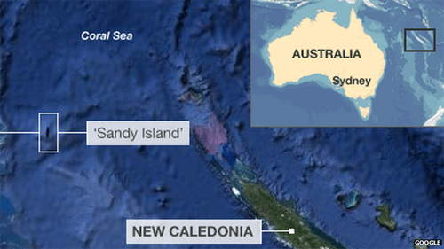 Fig. 7 Sandy Island as seen by Google Maps  

In many respects, Sandy Island is merely an instance of a cartographic
error, but we also believe that it’s a good example of the pervasive
datafication of our culture and society, wherein digital authority
begins to supersede our senses as one half of the dialectic that
articulates a pervasive and unavoidable development in our world. Like
many of the examples of New Aesthetic manifestations that we will
describe below, the story of Sandy Island illustrates an interesting
tendency in our contemporary world which resulted in the necessary
emergence of critical approaches. We would call it a pervasive
datafication. We are entering the era where the computational,
particularly through processes of automation, is granted a significant
degree of agency. As a result, tasks such as information management have
been delegated mostly to autonomous machines of many kinds. These
systems, residing beyond our day-to-day control, may sometimes fail to
function properly due to data corruption and flows in code. We are not
aware of it, until an unwanted action occurs in the physical reality (a
power grid fail or an autonomous car malfunction) or in the digital
layer (software glitch, data loss).

However, the Sandy Island case is even more interesting. In this example
the digital layer worked perfectly; based on digitalization of
human-generated cartographical data, a digital representation of a
non-existent terrain was created, establishing the foundations of
transmedial aesthetic patterns. A computer does not ask questions about
the validity of data it is given, its sole aim is to digitize, process
and make available to users, and this condition of passive
legitimization further engenders aesthetic validity. The Sandy Island
example illustrates how the digital and physical realities have become
intertwined, but it also illustrates the fact that even an autonomous
computational system should be trusted as long as we are certain that
the data it was given is correct. The New Aesthetic approach suggests
that even in this ideal situation, which is far from today’s reality, a
computer’s agency and ‘power of judgment’ should not be considered as a
final instance. This thought will accompany us as we will discuss some
New Aesthetic objects in this chapter.

Until now, our focus has been on the theoretical ideas behind the New
Aesthetic. This has been a crucial step, if for no other reason than
that the New Aesthetic is such a contemporary set of phenomena that its
grounding can be traced to recent theoretical ideas in digital culture,
philosophical ideas behind computational practices and algorithmic
construction, and the remainder of the intersection of these in digital
form. James Bridle’s blog set out the pathway of discovery, but it’s
been clear that, as the popularity of the New Aesthetic has waned in the
common discourse of *Wired* and other magazines, that theoretically
mapping the framework and parameters was crucial in order to encapsulate
the specific ontological nature of the categories of critical thought
and practices. That being said, theory is only as good as its objects.
With a partial completion of this effort, we would now like to turn to
specific manifestations of New Aesthetic objects and discuss them within
this framework.

## Precursors of New Aesthetic Objects

Examples vary widely: from simple HTML code to complex websites, from
iOS and Android applications on smartphones and tablets to databases and
datafarms, the variety of what might be classified as a New Aesthetic
object is almost overwhelming and continually shifting; there are even
instances of New Aesthetic objects which seemingly manifest themselves
as analog objects, designed or coded digitally but physically analog in
their interactivity. What is also clear is that New Aesthetic objects,
regardless of the duration of use, are inherently pervasive in their
effect.

It’s clear from our research that New Aesthetic objects have been
evolving over a longer period than the existence of James Bridle’s blog.
The ‘worst video game’ ever made – the commercially unreleased *Desert
Bus*, created in 1995 to reproduce the eight-hour drive from Tucson,
Arizona to Las Vegas, Nevada with unrelenting and excruciating boredom
(you drive the bus in real time, with only the perfectly straight road
as a vague distraction, and get one point for each successful run you
make there and back) – may be one instance.[^book_book_book_book_book_book_book_book_02ok_1] {Fig. 8}  

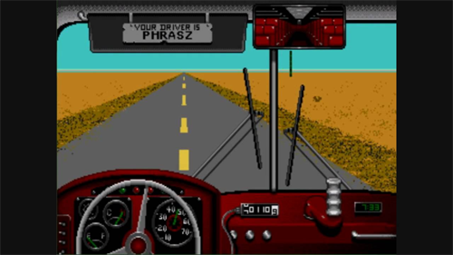 Fig. 8 <em>Desert Bus</em> (1995)  

 *Desert Bus* is
a video game without any goals beyond one, with an almost unceasingly
tedious display of just desert and road, but it has attracted a strange,
determined cult following among a few gamers who return to it for
marathon charity fundraisers. *Desert Bus* also is a mental concession
to the virtual of simple programming; while the experience of the game
may last eight or more hours (or much, and more likely shorter, since
relinquishing any control over the bus causes it to immediately crash,
ending the game), and the game play can best be described as
mind-numbingly inert at best, certainly the programming itself took
little time comparatively, as there would have been no need to map out
digitally every stretch of the eight mile run.

Neither the undiscovery of Sandy Island nor *Desert Bus* are really New
Aesthetic objects, however. Sandy Island was a mistake with real world
consequences; and a mistake that says more about the construction of
knowledge systems than about digital artifacts. *Desert Bus* is a video
game that has often been described as the worst video game ever, and was
created more as a prank than a game, without any expectations that
people would play it or get any enjoyment out of it. What they are is
historical indicators, even precursors, of the New Aesthetic as a means
of categorizing an entirely new set of objects. Thinking about a dynamic
conceptual space between the aesthetic experience of both, there is
evidently a widening and increasing divergence between expectations and
use value while simultaneously a collapsing relationship between the
digital artifact and user experience. What the cases of Sandy Island and
*Desert Bus* represent in a very nascent stage is a spectrum of New
Aesthetic experiences, products and objects. One of the strengths of
James Bridle’s blogging efforts is also the biggest hurdle to
constructing a viable topology of the New Aesthetic: on the one hand its
relatively random approach to curation has allowed a kind of
free-wheeling and inclusive investigative strategy; on the other hand
such a loose accumulation of manifestations has blurred the differences
between different types of experiences and objects with a varyingly
commensurate typology of creativity and productivity, to actual objects
which are even more fully autonomous digital products such as the
results of software glitches or algorithmic juxtaposition and that are
more accurately described as New Aesthetic products. Some manifestations
are the way they are because they represent a human response or attitude
within the New Aesthetic attitude, while others are directly the product
of a digital environment independent of human control.

## New Aesthetic Products as Experiences

Certain instances of New Aesthetic objects, like this screen shot from
the UK McDonald’s iPhone app, fit easily into our notions of what this
attitude entails. {Fig. 9}   

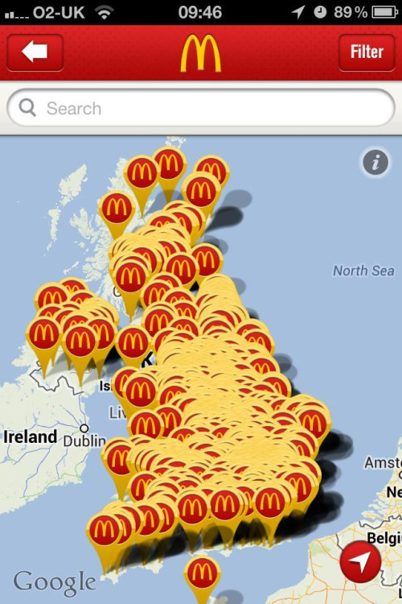 
Fig. 9 McDonald’s App, Map of the UK  

Here we have a map of all of the locations of
the fast food restaurant McDonald’s in the entire country, including
Northern Ireland and Jersey. Having scaled back to the appropriate
level, the user has created a map of the UK constructed entirely of
McDonald’s locations – a dystopian nightmare if there ever was one –
that deletes any possible map function and obfuscates actual restaurant
locations with an excessive number of overlapping logos. What makes this
a New Aesthetic product, the most important aspect of this image, is the
manner in which the use of the digital object greatly circumvents the
programmer’s intentions. With other images {Fig. 10} we have even more
instances of the programming overtaking the programmer’s intentions;
facial recognition may be a valuable tool for control of the public,
police and intelligence agencies, but its history indicates a shift from
practical uses to a more intrusive construction of digital
identification.   

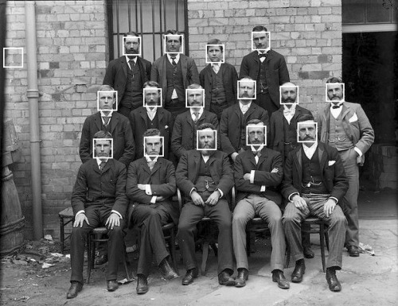 Fig. 10 Facial Recognition Error  

Facial recognition software has a long history,
extending back into the 1960s with early work being done by of Woody
Bledsoe, Helen Chan and Charles Bisson at Panoramic Research Inc.[^book_book_book_book_book_book_book_book_02ok_2]
Originally focused on artificial intelligence, their efforts at creating
software based pattern recognition was quickly identified as having a
multiplicity of purposes, including reading address labels as well as
identifying individuals in photographs. The research’s use of normalized
correlation of unprocessed optical data such as the space between the
corners of the subject’s eyes, the length of their nose or the width of
their mouth started the means whereby catalogs could be generated of
individual faces, but a high degree of accuracy was a long way off; by
the 1990s, facial recognition software had become so sophisticated that
its failure rate was remarkably low, and by 2007 almost non-existent.
This has, of course, raised privacy concerns, and a number of efforts
have been made to design products that will foil facial recognition
algorithms; more importantly, it has become clear, with the introduction
of consumer facial recognition, that a major shift in the public
consciousness and acceptance has occurred. What is now the case is that
a willing public accepts facial recognition as a part of daily life.
Given this background, the image cited on James Bridle’s blog is an even
more radical instance of a New Aesthetic manifestation. There is no
surprise that the faces have been highlighted by the facial recognition
software, but what is surprising – while increasingly not being
surprising to any user of commercial facial recognition software – is
the identification of different colored parts of the background as a
face. Why is this radical? It’s more than just the software asking the
user to confirm someone’s face (often the case in Apple’s Aperture
software, for instance) but a digital prompt necessitating an
interaction between a user and the software as autonomous decision
processes; the software has decided that there appears to be a face
there, and needs human intervention not to identify that face but to
confirm its decision; should the user decline or simply avoid correcting
that decision, then the software will continue to identify that portion
of the digital photograph as a face, as a human being, and even further
will utilize its decision to identify similar things in photographs as
faces.

Building on a theoretical approach that would enable taking to the
forefront of our perception intertwined layers of algorithms and
computation that contemporary society and culture is built on, further
instances of New Aesthetic objects as experience can be identified at an
increasing rate. Another example of a manifestation of a New Aesthetic
object is ‘What colour is it?’.[^book_book_book_book_book_book_book_book_02ok_3] {Fig. 11} In many respects, this is
merely a webpage displaying the user’s local time, an increasingly
common type of application for Chrome and other browsers, but what
becomes immediately apparent over a short time is the ever-shifting
color of the background. Here we have the emergence of computationality
as an onto-theology, wherein the datafication of web colors embeds
itself into our temporal sensibilities.   

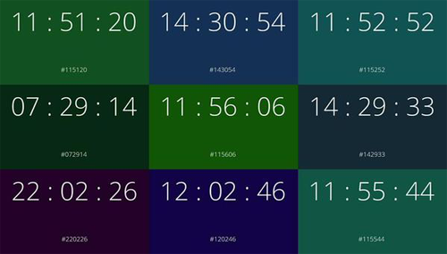 Fig. 11 James E. Murphy, <em>What colour is it?</em> (2014)  

With each new second the
background corresponds to its HTML color code, e.g. 08:55:59 turns out
to be a darkish grey blue. Where the conceit lies is in the expectation
that a 24 hour clock will produce a rainbow of colors when, in fact,
nothing could be further from the truth; a solely numeric listing of
HTML color codes tends towards dark greens and blues, so there’s less
variation than might be anticipated. Created by Berlin based artist and
designer James E. Murphy, it is part of a series of webpages and
coding[^book_book_book_book_book_book_book_book_02ok_4] that challenge users’ preconceived notions of web
interactions. It’s difficult to think of ‘What colour is it?’ as an
example of art per se (and we will return to Murphy’s work in the next
chapter on examples of New Aesthetic art where other work seems more
appropriately discussed), since it feels more like a gimmicky trick of
web design, but that sense of being unknowingly confounded by the
digital coding is itself New Aesthetic in nature; it’s not the gimmick
that makes it that but the increasing degree of autonomy and means of
confounding the user’s experience.

Chris Foley’s *Glitchtop*[^book_book_book_book_book_book_book_book_02ok_5] {Fig. 12} is a further example of the
development of HTML coding producing a specifically New Aesthetic
experience.   

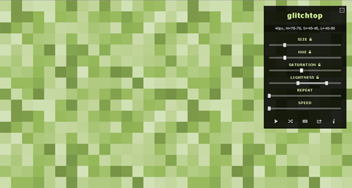 Fig. 12 Chris Foley, <em>Glitchtop</em> (2015)  

Chris Foley is a web designer whose work is focused on data
management, including the innovative browser extension LightboxE for
Chrome and Safari that allows users to view and manipulate images found
on websites on their own terms without leaving the page. Glitchtop is
quite different from other programming efforts by Foley, labeled as ‘an
online art generator inspired by glitch art and pixel art’.[^book_book_book_book_book_book_book_book_02ok_6] Users
are invited to choose from a range of different sliding parameters –
size, hue, saturation, lightness, repeat and speed – which are then used
to generate an image of varying colored squares that alternate between
the spectrum of those parameters. At first this seems like an
interesting visual experience and, in reality, it’s really nothing more
than that. Where this is a New Aesthetic experience, though, is in the
illusion of control; user input seems to be a contributing factor to the
product, but user input is a limiting factor in that the relations
between the different colored squares are a result of the digitization
of the color spectrum itself. While Foley notes that this is inspired by
glitch art, with its dependency on random information and errors, it’s
clear that glitches do not make an appearance. Where, indeed, is the art
or the New Aesthetic experience in this case? The status of both
Murphy’s and Foley’s work as art is debatable – though we would tend to
place them into that category – their status as New Aesthetic products
is not. The contrast between viewers’ expectations and the resulting
visuals generates more than just a flashing sequence of colors; instead,
more poignantly, what is created is a remarkably overlooked response of
indifference to the digital reality, based on an acceptance of the
limited control in contrast to the final product. The response of most
users to what is generated is less of a sense of awe and aesthetic
excitement and is rather an acceptance that this is what should have
been expected, graphically represented in the ubiquity of the poster
produced by the Deterritorial Support Group. {Fig. 13}  

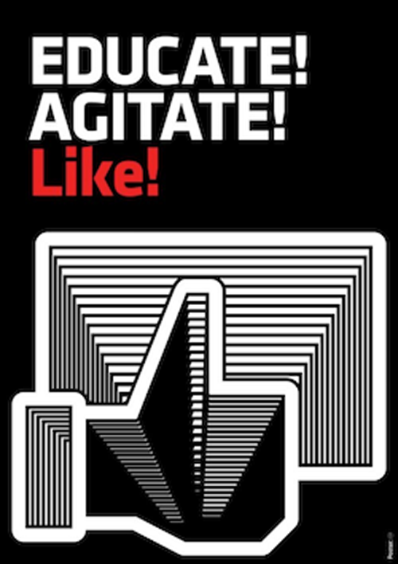 
Fig. 13 Deterritorial Support Group poster  

 What is revealed
isn’t some hypnotic, cathartic or enlivening visually engaging set of
patterns but a distancing removal of the user from a critical engagement
or an aesthetics of computational miscalculation. In many ways, it’s a
safe assumption that most users will respond to these flashing squares
of color with ‘so what?’. And it’s in that indifference that the New
Aesthetic often operates most effectively, best represented by an
apolitical response.

*Glitchtop* is at best a reproduction of the glitch interjecting itself
into our experience of the digitization of the world. We will return to
glitches as art in the next chapter, but for now we’re focused on
glitches as they manifest as part of the digital experience. Perhaps the
most famous of this type of image associated with Bridle’s blog and the
New Aesthetic is that of an airplane appearing on Google Maps; flying
too quickly to be resolved accurately, it appears as four different
images of the same plane broken up into a grainy image and three
separate RGB shadows. {Fig. 14}   

 Fig. 14 Google Maps image of a plane flying over Hyde Park, Chicago  

This is a true glitch, an error caused
by the inability of the software to process real time imagery or an
inadequate capacity to recognize and recombine images into a functioning
single image, and it is vitally interesting as a New Aesthetic object
because of its inherent aesthetic appeal, but it’s become sufficiently
commonplace in ‘false glitches’ like those found in satellite imagery
that the glitch itself has become readily accepted as part of users’
aesthetic experiences. At first what seems like a data output error,
which is indeed actually an error, becomes immediately attractive,
absorbing and even engrossing despite itself. The aesthetic appeal of
the image, its beauty, rests in the fact that the viewer ignores the
glitch and responds on a more intuitive level. What’s even more
interesting is how the strangeness of the image disappears into a state
of aesthetic ubiquity. Skyler Balbus, a designer interested in branding,
interactivity and product design, writing about this image {Fig. 15} and
the New Aesthetic generally on a blog for the Hook & Loop design team,
notes:

> If you’ve ever had an app suddenly deteriorate into pixels, or sent a
> text message that was autocorrected to the wrong words, or had your
> Google Maps satellite view obstructed by a low-flying plane, you know
> that the glitches in our everyday life can be just as surreal as they
> are maddening. When things don’t behave as we expect them to, and when
> the logic of interactions isn’t clear to us, we’re left with what can
> feel like pure absurdity. But these glitches in technology aren’t
> always just random acts of incoherency; they’re often the product of a
> breakdown of communication.[^book_book_book_book_book_book_book_book_02ok_7]  

 Fig. 15 Agricultural Fields  

Maddening deterioration and surreal autocorrection often are taken as
criticisms of aesthetic experiences, especially the former, but they’ve
become commonplace experiences as we rely increasingly on smartphones to
navigate the world. Balbus isn’t theorizing at a critical level the
impact this image has, but it’s clear that she’s embracing the absurdity
generated in the glitch as well as the breakdown of communication.
Balbus is not the only one to note the connection between New Aesthetic
experience and the surreal; in ‘An Essay on the New Aesthetic’ Bruce
Sterling wrote:

> People have tried such things before. The Surrealists once valorized
> the “imagination of the unconscious.” But, as the Situationists
> pointed out, a generation later: the imagination of the unconscious is
> impoverished.
>
> Valorizing machine-generated imagery is like valorizing the
> unconscious mind. Like Surrealist imagery, it is cool, weird,
> provocative, suggestive, otherworldly, but it is also
> impoverished.[^book_book_book_book_book_book_book_book_02ok_8]

Clearly, though, while the image generated as a result of the glitch
isn’t surreal (a word all too often synonymously used in place of
‘weird’ or ‘incomprehensible’) Sterling has a point. The four different
and simultaneous images of the plane in the digital artifact may appear
as a glitch in the programming, an error showing the inadequacy of the
computational device, but at the same our response is to accredit an
artistic agency of sorts in the process of the image’s production; like
surrealism, with its emphasis on creating a level of connectivity
between human beings through suggestive imagery, New Aesthetic images
that are the product of glitches are creating a level of connectivity
between human perceptual capacity and aesthetic response with
autonomously and digitally generating entities, namely software packages
that function independently of human intervention. At some level,
responding aesthetically to a glitchy image grants a type of aesthetic,
even artistic, autonomy to software as part of the increasing
computational materiality of our civilization.

The appearance of glitches as a hallmark of the New Aesthetic has become
a commonplace paradigm. Images like agricultural fields appearing to be
pixelated are glitchy in a way, in that there is the illusion of digital
parameters being imposed on the world (an illusion that may be all too
real, given the increasing dependency in agricultural production on GPS
technology as databases). Other images appear to be glitchy when they
are, instead, the product of the visualization of data. {Fig. 16}   

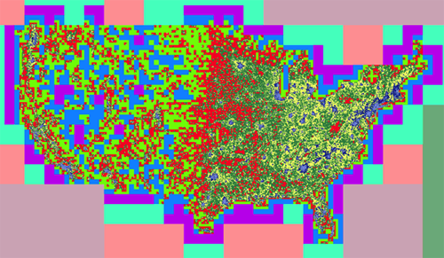 Fig. 16 Population Blocks  

These
images in particular are interesting in that they represent population
figures of the contiguous United States at varying levels as part of the
Polymers JavaScript library[^book_book_book_book_book_book_book_book_02ok_9] that is designed to create interactive
maps for web browsers; giving each pixel the task of representing an
area populated by 1000+ people, the programmers still felt the need to
make the result more visual appealing, such that:

> My team selected the old-school color scheme to maximize contrast
> whilst maintaining some semblance of readability. According to them,
> if it dredges up any repressed 8-bit feelings – like the urge to snipe
> an Atari 2600 off Ebay – that’s not a bug. It’s a feature.[^book_book_book_book_book_book_book_book_02ok_10]

Pixelization has seemingly acquired a value as a tool. Apps like
Pixelate Tool {Fig. 17} are advertised as ‘a QUICK and HANDY tool for
adding pixelated blur to your photo in seconds’ with one reviewer’s
comments being ‘I can get used to it not being super accurate but I hope
it doesn’t get removed because as of now it’s the only simple tool that
does what it does’ as if the accuracy of the pixelization is ironically
important.[^book_book_book_book_book_book_book_book_02ok_11]   

 
Fig. 17 Pixelate in the iTunes store  

When we start to look at images or videos, wherein the
players of a football game are reduced to pixels equivalent to the
information provided by the drone to its operators {Fig. 18}, or in
which the photographer noted was referred to by people as the ‘Lego
Tornado’ {Fig. 19} but is more appropriately described as a Tornado
fight jet covered in a semi-glitchy livery, we start to see a different
approach to glitches and pixelization.   

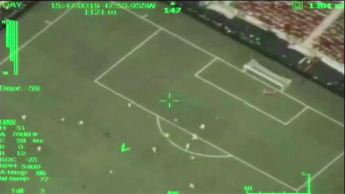 
Fig. 18 Neymar goal filmed by a Brazilian Air Force drone  

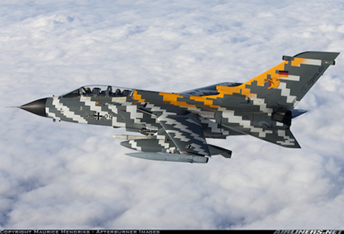 
Fig. 19 Maurice Hendriks, <em>German Air Force Tornado ECR, Tiger Meet 2010</em> (2010)  

Other images such as those from
the 2015 parade in China marking the 70th anniversary of the end of WWII
{Fig. 20} are even more strikingly strange and distanced from a
normative human experience; putting aside the political and military
themes, with the subtext running through each of the images discussed in
this paragraph, it’s evident that the digital style of the camouflage is
entirely counterproductive but assumed contradictorily to be effective.
{Fig. 21}   

 
Fig. 20 Chinese Tanks in the WWII Victory Celebration in 2015  

 
Fig. 21 Chinese Tanks in the WWII Victory Celebration in 2015  

Consider, for the moment, the purpose of camouflage: it’s
designed to obscure the object from sight, specifically human sight. Now
consider the bright blues used by the Chinese military on their tanks
and missile launchers, and it’s obvious that exactly the opposite effect
is intended; these tanks have been designed to be seen more readily
rather than less. While there are instances of this pixelization
camouflage paint scheme appearing that are apparently an attempt at
hiding the military vehicle, such as the image of a Leopard 2 tank
photographed outside of Munich, the effectiveness of such a visual
scheme has been proven to be quite low, as evidenced by the quick
retirement by the United States military of patterns there are entirely
fractal or pixel based.[^book_book_book_book_book_book_book_book_02ok_12] {Fig. 22}   

 
Fig. 22 Leopard Tank  

Thinking about these tanks even
further in contrast to the German Tornado it’s also clear that the
camouflage scheme was digitally designed in an almost random fashion;
rather than having each part of the paint scheme chosen to obscure the
appearance of the tank, the color scheme has been generated by digital
means with little input from a human designer. Two intertwined
conclusions can be drawn from these manifestations. First, the
camouflage has probably been utilized to achieve greater visibility in a
parade setting rather than during military action; second, the
assumption has been made that any camouflage that obscures these
vehicles from human eyesight, no matter how effective at that purpose,
is useless in a modern battlefield with digital target acquisition.
Given this perspective, it doesn’t matter what color the tanks were
painted, since the digital environment will trump the human experience
of that environment.

The human experience of its localized environment has become so
intricately bound up with the digitalization of the world that the
interaction itself has become newsworthy, of a sorts, especially when
things go wrong. In the middle of the Old Street roundabout in London
that is frequently referred to as the ‘Silicon Roundabout’, the outdoor
advertising firm JCDecaux constructed the ‘Old Street EC1’ digital
billboard system, described thusly:

> Old Street EC1 provides a powerful communications channel for brands
> to engage with the unique and exciting audiences who live, work and
> socialise in EC1. The newly digitised, iconic advertising architecture
> in the centre of Silicon Roundabout has become synonymous with the EC1
> area, providing unparalleled impact within the vibrant and creative
> East London community.[^book_book_book_book_book_book_book_book_02ok_13] 

Part of the Old Street EC1’s design was the display of Google and
YouTube searches in the UK with predictably unruly and offensive
results. {Fig. 23}  

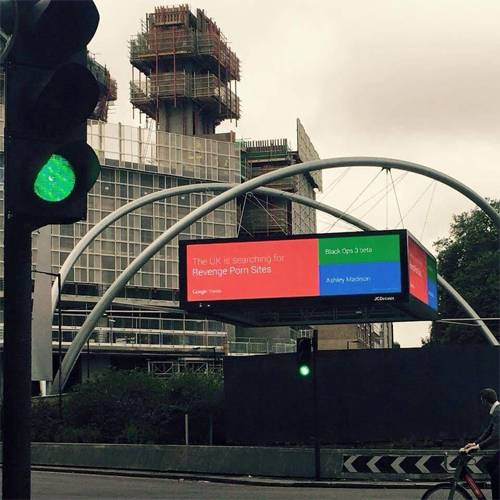 
Fig. 23 Old Street, New Billboard in 2015  

 It’s always remarkable that designers and advertisers
don’t anticipate unintended effects that spark outcries and offense, but
clearly what ended up being on display was beyond what almost anyone
could have imagined. Humorous, yes, but, like the camouflage on Chinese
tanks, there is evidently a lack of human intervention resulting from a
lack of engagement on the part of the programmers who trusted their own
interaction with the digital world to be echoed universally. Our
theoretical approach enables us to take the position that our perception
has become so entangled in the intertwined layers of algorithms and
computation that contemporary civilization is built on that a fully
effective engagement with that entanglement is no longer possible. It’s
not just that programmers are making mistakes or oversights when they
don’t anticipate surprising results, nor is it simply that there is an
unwarranted and blind faith in the appearance of digital traces in the
real world leading to a misplaced sense of an enhanced experience;
rather as every point of our interaction with our environments, at an
individual level, becomes increasingly guided and then determined by
their digitalization, it’s clear that we’re losing our ability to
decisively act digitally. It’s at the boundaries of the unintended
consequences that the New Aesthetic has emerged, where digital autonomy
supersedes human intention and even social structures. Whether it’s an
expired QR code on a bottle of Heinz ketchup going terribly wrong,
resulting in a link to a pornography website,[^book_book_book_book_book_book_book_book_02ok_14] the use of selfies
for live reporting[^book_book_book_book_book_book_book_book_02ok_15] or advertising for Facebook in Yemen,[^book_book_book_book_book_book_book_book_02ok_16] the
presence of New Aesthetic digital objects has become so widespread that
it’s no longer recognized but simply accepted, an indication that we’ve
stopped thinking of the world as digitized and started thinking of the
digital as the world.

## New Aesthetic Objects as Products

The examples discussed in this chapter so far are the result of
unintended manifestations, a result of what we believe is a metaphysical
and ontological shift in the digitization of the world. At the same
time, we also believe that a number of New Aesthetic products can be
identified specifically as New Aesthetic objects; code, webpages,
typography, advertising and a myriad of other forms of human products
extending well beyond the digital into physical objects are a result of
the attitude that Bridle wrote about. The distinction between products
and objects is quite simple: products are objects of experience that are
evidently created, authored, programmed and are the result of human
activity while objects don’t necessarily appear this way. That being
said, thinking about New Aesthetic objects is a little more complicated
than at first it might seem because New Aesthetic objects are implicitly
understood as products because of their digital nature but aren’t
evidently so. Given the examples discussed so far, with the emphasis on
the autonomy of the software, the algorithms, and the digital
interference into and selective emphasis on human activity, it would be
reasonable to assume that mediated New Aesthetic objects are more
difficult to identify; our description of their nature has often implied
a digital agency separate from human agency, a position we continue to
maintain. This is made even more complicated when it quickly becomes
clear that many of these objects are political in nature, or at least
analogous to the products of a political awareness. What we would also
like to note is that we are still not talking about New Aesthetic art,
which is its own separate category above and beyond the distinction
between products and objects, and which is reserved for the next
chapter, though the status of some of this work as art is
unquestionable.

One of the most interesting manifestations of the New Aesthetic has been
the work produced by the CAVI group based in Aarhus University.[^book_book_book_book_book_book_book_book_02ok_17]
With recent contributions from members focused on digital aesthetics, a
number of projects by CAVI have explored in great detail the interplay
between digitally produced information and human interactivity. In 2006,
the group installed the Dynamically Transparent Window[^book_book_book_book_book_book_book_book_02ok_18] {Fig. 24} in
the Salling department store in Aarhus; using data generated by tracking
the people walking by, exploiting the computational materiality of our
everyday activities, the large, glass storefront shifts from opaque to
transparent with changes in thin electro-chromatic strips of foil in
response to transmedial aesthetic patterns elaborating a dynamic
relationship between the storefront as advertising and users’ experience
of the storefront, but often with a collapse of the standard enticing or
seductive intent of advertising alone.   

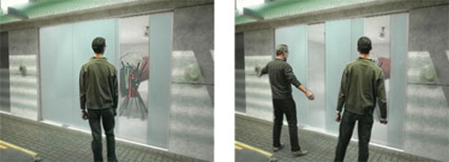 
Fig. 24 CAVI, <em>Dynamically Transparent Window</em> (2006)  

The intent of this installation
is to draw people closer to the window, to give them the opportunity to
interact with the display in a playful and productive fashion, but it’s
equally clear that the design doesn’t actually invite people into the
Salling department store but rather invites them to play with the
display or simply ignore it. While the commercial intent is self-evident
– Salling would not have allowed this display if the management did not
foresee it as a marketing tool – its flawed and subverted outcome
undermines the display’s manifest purpose to hunt down future customers
through the semblance of interactivity.

In 2009, in collaboration with Digital Urban Living at Aarhus
University, CAVI installed *Climate on the Wall*,[^book_book_book_book_book_book_book_book_02ok_19] another instance
of a seemingly interactive display. {Fig. 25}  

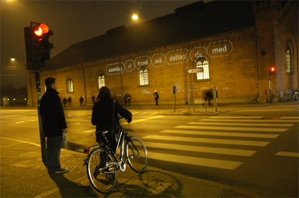 
Fig. 25 CAVI, <em>Climate on the Walls</em> (2009)  

Tracking people passing by
with infrared cameras, thought bubbles with words and thoughts related
to environmental awareness would be projected onto the wall above them.
Additionally, *Climate on the Wall* has been described as interactive in
that different people could collaborate to form sentences and statements
about changes in the world’s environment, building a dialogue promoting
increased environmental awareness and responsibility. Yet, it too is an
instance of the New Aesthetic in that the participants’ autonomy is
clearly limited to the digitally projected programming, and certainly
glitches and poorly constructed ‘sentences’ would be apparent if not
ripe for a type of digital vandalism; *Climate on the Wall* was
installed during the ‘Beyond Kyoto’ conference in Aarhus, so that
assumption that the programmers designed the system as an assertion of
climate protection ideas is a safe one, but it’s an equally safe
assumption that the system itself would appear to counteract its
intended purpose; the inescapabilty of digital manifestations opposes
the continuation of aesthetics that might encourage the growth of an
environmentally oriented mindset.

One problem with either instances of work by the CAVI group is that they
are not genuinely intrusive in the way that typical examples of New
Aesthetic objects are, in part because they clearly are products
produced in response to specific needs and conditions. This does not
make CAVI’s work any less interesting, in that it seems clear to us that
individuals making New Aesthetic products are exhibiting an awareness of
the increasingly pervasive effect of the digitalization of the world on
our human experience, but we’re still cautious about the work’s status
as New Aesthetic objects. If we want a better example of an object that
autonomously controls experience then it would be good to start with the
app Cloak, available for smartphone. {Fig. 26}   

 
Fig. 26 Franz Kirschner <em>Cloak app</em> (2014)  

Launched in 2014 with a
lot of media coverage, Cloak is an app designed to prevent what has
become a standard feature of all smartphones: a continual broadcasting
of users’ geographical location. Ironically, Cloak almost aspires to
functionally imitate the conditions of Sandy Island, creating a digital
invisibility for the user as if a digital invisibility is more important
than an actual physical invisibility. By linking to Foursquare,
Instagram, Facebook and Twitter, Cloak attempts to deny social media
applications their default capability of connecting users not just
digitally through messages and updates but physically by hiding their
presence in the world when their presence if often assumed to be
substantiated digitally. Its success has been less than stellar, with
many users reporting a failure to obscure them from the prying
capability of social networks, but as a response to the ubiquity of
social networking’s capabilities it presents an interesting test case of
both working within and opposing the intentions of the programmed
capabilities of smartphones. Equally, a sense of pervasiveness of the
digital experience is at the forefront of the design of Cloak; it’s
clear that Cloak has no application in the real world, because the real
world no longer exists. It’s even necessary to point out that there is a
contradiction involved in the visual design of Cloak itself, in the need
for an app that allows the use of social networks while denying a key
aspect of sociability, curiously heightened by the glowing green colors
reminiscent of old radar devices, but its purpose shows a remarkable
degree of perspicuity on the part of the programmers, who have obviously
taken note of a dissatisfaction with the pervasive digitization of our
world. Apparently, we’ve reached a stage where we want everyone to know
where we are but no one actually knows where we are.

The creation of the typeface ZXX[^book_book_book_book_book_book_book_book_02ok_20] also presents a really interesting
instance of a New Aesthetic object in a manner similar to Cloak. {Fig.
27}   

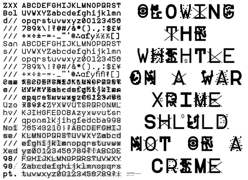 
Fig. 27 Sang Mun <em>ZXX</em> Typeface (2013)  

Created specifically in response to the revelations of the American
government’s spying program targeting American citizens, ZXX is a
typeface that is unreadable by text scanning software.[^book_book_book_book_book_book_book_book_02ok_21] A first
response to this might quickly conclude that ZXX is an absurd project –
how much disruption can occur as a result of text scanning software that
reads hard copies, when so much of the world’s information is digital
and, therefore, doesn’t need to be scanned? – and this response would be
correct; any effort to defeat optical scanners through a publically
available digital typeface is going to fail once that typeface is part
of the library of scannable typefaces. It’s clear, however, in the
statements of the creator Sang Mun, that he designed ZXX in 2012-13 as a
protest against the ease with which the NSA can access information
rather than as a practical tool to thwart such information; the title of
the typeface itself is used by the Library of Congress to indicate ‘No
linguistic content; Not applicable’. Sang Mun is a Korean graphic
designer and artist, and ZXX could be thought of as an example of New
Aesthetic art, but it’s indicative of something much more. In his
statement about the typeface on the website of the Walker Art Center,
where Mun was an artist in residence, he quotes both Slavoj Žižek and
Julian Assange. Žižek wrote: ‘We feel free because we lack the language
to articulate our unfreedom.’[^book_book_book_book_book_book_book_book_02ok_22] Assange stated: ‘What does censorship
reveal? It reveals fear.’[^book_book_book_book_book_book_book_book_02ok_23] What’s curious about these statements is
how contradictory they are. Žižek’s indicates his position that a state
of ignorance and muteness creates the illusion of freedom, while
Assange’s implies that the very act of censorship creates the conditions
of increased knowledge. It’s clear, within the context of the New
Aesthetic, that ZXX is not actually a response to either position,
articulating instead a response to the digitized conditions of
knowledge. ZXX’s existence doesn’t raise questions about privacy, unlike
so many other artworks do, though its presentation in the art world
articulates many of those questions, but more poignantly manifests a
growing unease on the part of designers that their basic tools like
typefaces, created in a digital manner for a digital means of
production, quickly slip out of their control and can be used for
radically unintended consequences. Mun writes about ZXX as a
contribution to those fighting the intrusion by governments into the
private lives of their citizens, but to believe that ZXX is effective is
naïve. In an update to the Walker Art Center’s blog, Mun acknowledges
the discernable naïveté and notes that as a former NSA partner and
intelligence agency employee he’s aware of the issues we’re concerned
with. For Mun, raising awareness is the sole goal of ZXX; for us, it’s a
symptom of the New Aesthetic’s increasingly pervasive intrusion into our
lives. Because we are helpless in the face of digital agencies’ capacity
to intrude, Mun writes:

> Our lives in cyberspace are overloaded with impalpable and extensive
> personal information that is gathered, intercepted, deciphered,
> analyzed, and stored. With this information government and
> corporations can easily create an informational architecture that
> traps us in the structures of the World Wide Web and social media.
> Restricting and repressing our communication tools under the name of
> “homeland security” is only a small step into a totalitarian society.
> This non-physical-yet-ideological violence is what allows us to lapse
> into lethargic silence. But really, we shouldn’t be afraid to question
> the authorities’ continual intrusions.[^book_book_book_book_book_book_book_book_02ok_24]

This is a curious statement. Where’s the violence? In cyberspace,
whatever that means today. How is our personal information stored in
cyberspace? Through the digital architecture that is increasingly
self-determinative. The use of digital information by the NSA and the
like is itself governed by this self-determining digital architectonic
and, in many respects, they are just as much of a victim of it as
private citizens, in that their ideological justifications are created
aesthetically for them rather than by them. Why aesthetically? Because
the use of ideology must necessarily be seductive. The ideological
violence that Mun rightfully identifies as a threat to privacy doesn’t
come from human programming as agency but from the increasingly
autonomous nature of data storage, tracking and use as an agent in and
of itself. In this respect, ZXX is a perfect example of a type of New
Aesthetic object, one designed to operate within an almost metaphysical
and epistemic shift of the human condition and existence.

Both Cloak and ZXX can be understood in the context of an uneasy
relationship with Google’s mapping efforts. Google’s mission statement
says that the company’s ultimate goal is to organize the world’s
information and make it universally accessible and useful. Almost more
than any product by Google, Google Maps directly creates a sense of the
computational materiality of our civilization, especially if one
considers it simply a search engine for geographical locations. The
latest restructuring of the company into Alphabet Inc., a conglomerate
of several companies that were owned by or tied to Google, indicates
that this strategy is treated very seriously by its managers, especially
as it relates to an aggressive monetization of the presentation of
information to users through their web searches and use of data such as
Google Maps (which is, after all, merely another instance of a web
search for location data)^.^ If we were to describe all Google
operations, they could be narrowed down to two basic infinitively
repeated actions. The first process would be an analog to digital
conversion of any kind of world-related, textual and geospatial
information as well as visual sensations, commonly known as
digitalization. The second stage of this action is processing,
organizing and sharing all this information with interested parties,
from advertisers to common users. From the very beginning of the New
Aesthetic, Google Maps aesthetics and its glitches were considered as
key examples of the ‘new ways of seeing the world’ and ‘machine ways of
seeing’.[^book_book_book_book_book_book_book_book_02ok_25] Google Maps (2005), and particularly Google Street View
(2007), which provides 360° panoramic street-level views of various
locations, introduced a new worldwide cultural paradigm, a new
aesthetics which encapsulates the way we can experience the world beyond
our sight. Distorted 360° panoramic street photos combined with
searchable, geospatial data became a new paradigm of visual, however
mediated, interaction with locations that are beyond our reach – in more
than 65 countries, as Google proudly explains. The photograph of an
airliner over Hyde Park in Chicago discussed earlier, which due to a
processing error has been divided into a phantom plane and three RGB
shadows is an example of a ‘new machine vision’, and does more than just
embody an aspect of the New Aesthetic but also indicates the intrusive
nature of Google Maps; the aerial or satellite cameras are usually
designed to capture a picture of a static terrain, rather than a moving
object, but here we’re not only given an impractical perspective – does
anyone need an image of a plane flying over a park in order to navigate
their way to and around that park? – but an assertive image that
intrudes into our consciousness of the world, shifting our paradigm from
one of being in the world to one of knowing the world. As such, it’s
easy to conclude that New Aesthetic products unveil the limitations of
computational technologies by focusing on examples that preprogrammed,
specific use cases cannot ‘process’ while at the same time redirecting
our attention so that we fail to recognize those limitations. This seems
especially troublesome with Google’s efforts to digitize as many works
of art as possible. The Google Cultural Institute[^book_book_book_book_book_book_book_book_02ok_26] states that its
mission is to facilitate the discovery of artworks and collections from
around the world by as broad an audience as possible. Our first thought
would be to embrace this effort; it’s long been a truism that seeing art
in museums around the world is an inherently elitist activity, if for no
other reason than the financial resources necessary, and Google’s
efforts are obviously couched within a democratizing impetus. At the
same time, something else occurs when literally millions of examples of
art are made easily available through the most prevalent search engine
in the world: the experience of art becomes potentially commonplace.
This is not an assertion on our part of Walter Benjamin’s description of
the loss of aura in his influential chapter ‘The Work of Art in the Age
of Mechanical Reproduction’ – which we are, nevertheless, remarkably
sympathetic about, and which has been a major influence on the
development of our critical perspective – in that we don’t readily
subscribe to the idea that the value of artworks is necessarily lessened
by their reproduction. Rather, what troubles us is the opportunity for
error that inevitably creeps into such a large-scale effort as Google’s,
highlighted and embodied in the images curated by Mario Santamaria in
his Tumblr ‘The Camera in the Mirror’. {Fig. 28}   

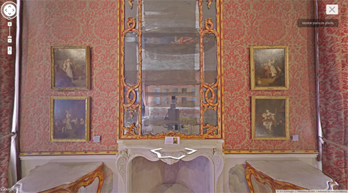 
Fig. 28 Mario Santamaría, <em>Google Art Bots</em> (2014)  

Jené Gutierrez writes
about these images: ‘In some of the images, the cameras don
silvery-white blankets – this effect, combined with our culture’s
immersion in selfies, renders these cameras almost familiar and
comfortable, but startling in its reflection of itself and selfie
culture. These museums and galleries are, for the most part, emptied of
people, the camera eerily alone in its self-documentation.’[^book_book_book_book_book_book_book_book_02ok_27] This
statement is both strange and stranger still. The very notion of a
robotic selfie reflects our tendency as human beings to anthropomorphize
activity.[^book_book_book_book_book_book_book_book_02ok_28] Further, the idea that the cameras ‘don’ blankets and
actively document themselves is obviously erroneous, in the simple fact
that the robots never clothed themselves and are unintentionally
documenting their presence and activities. But is Google Art a
sufficient art experience? Most people might answer negatively, but
given Google’s stated intentions they would then claim that it serves a
positive purpose. But does it really? Again, given the metaphysical and
epistemic questions involved with the New Aesthetic, we would assert
that it does not, that Google Art creates just as false a connection to
art as a list of friends on Facebook to friendship.

With Cloak and ZXX, we have objects that accentuate our awareness that
the complexity of the world cannot be grasped by single-task software
and hardware. This awareness has continued with Google Maps. If
computers are multi-role devices then so long as they are pre-programmed
to respond to specific use cases and not a single other use they
demonstrate a capability of transforming our epistemic position into a
position of weakness. This is evident in two recent projects that
partake of New Aesthetic ideas while still resisting its transformations
of our world: *Report a Problem* (2012) {Fig. 29} by Emilio
Vavarella[^book_book_book_book_book_book_book_book_02ok_29] and the efforts of Eduardo Graells-Garrido at the
Universitat Pompeu Fabra in Barcelona together with Mounia Lalmas and
Daniel Quercia, ironically both at Yahoo Labs, to burst the so-called
‘filter bubble’.[^book_book_book_book_book_book_book_book_02ok_30] 

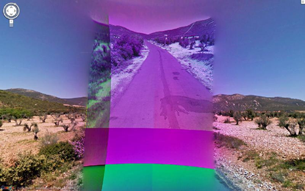 
Fig. 29 Emilio Vavarella, <em>Report a Problem</em> (2014)  
*Report a Problem* {Fig. 30} is part of
Vavarella’s ‘Google Trilogy’ as an ongoing effort to explore ‘the
relationship between humans, power, and technological errors’.

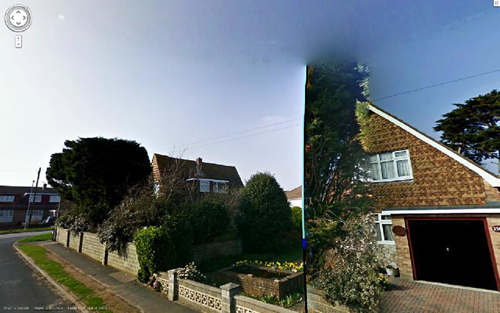 
Fig. 30 Emilio Vavarella, <em>Report a Problem</em> (2014)  

Presented
as an art project in a number of galleries, it catalogs a series of
images in which Google Maps has failed to accurately represent a
specific location. The failures range from glitches in the photo file to
random appearances of irrelevant information and incorrect views to
actual instances of censorship. Most of these errors are caused by
problems with the software used by Google in their efforts to photograph
all of the locations available in Google Maps, but curiously quite a few
of them seem to be simple problems with local conditions; for instance,
quite a number of the images seem to have had rain or snow on the camera
lens, lens flare or problems with the exposure. It might have seemed
more reasonable to include Vavarella’s project in our chapter on art,
but we believe that the justification for this project indicates more
than just an aesthetic response to glitches; *Report a Problem* is
itself dependent on programming software, one that allows users to
report errors to Google for correction. What’s inherent to the function
of Google’s software is the sense that Google Maps is interactive, when
nothing could be further from the truth particularly in light of users’
general reluctance or indifferent attitude to actually report these
errors. Vavarella’s project is interesting in an artistic sense, but
what makes it even more interesting is that it documents the conditions
of use and the acceptance by users of their digital experience.

The project ‘Data Portraits: Connecting People of Opposing Views’ by
Graells-Garrido, Lalmas and Quercia is, in many ways, a direct response
to the aesthetic peculiarities identified by Vavarella, though it takes
the form of a visualization of Twitter responses to a contentious issue
rather than glitches and errors in Google Maps. {Fig. 31} In the
abstract to their paper presenting the project they write:

> Social networks allow people to connect with each other and have
> conversations on a wide variety of topics. However, users tend to
> connect with like-minded people and read agreeable information, a
> behavior that leads to group polarization. Motivated by this scenario,
> we study how to take advantage of partial homophily to suggest
> agreeable content to users authored by people with opposite views on
> sensitive issues. We introduce a paradigm to present a data portrait
> of users, in which their characterizing topics are visualized and
> their corresponding tweets are displayed using an organic design.
> Among their tweets we inject recommended tweets from other people
> considering their views on sensitive issues in addition to topical
> relevance, indirectly motivating connections between dissimilar
> people. To evaluate our approach, we present a case study on Twitter
> about a sensitive topic in Chile, where we estimate user stances for
> regular people and find intermediary topics. We then evaluated our
> design in a user study. We found that recommending topically relevant
> content from authors with opposite views in a baseline interface had a
> negative emotional effect. We saw that our organic visualization
> design reverts that effect. We also observed significant individual
> differences linked to evaluation of recommendations. Our results
> suggest that organic visualization may revert the negative effects of
> providing potentially sensitive content.[^book_book_book_book_book_book_book_book_02ok_31]

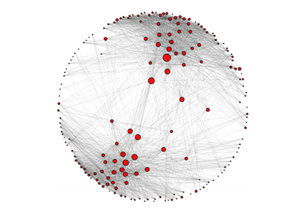 
Fig. 31 Eduardo Graells-Garrido, Mounia Lalmas and Daniel Quercia, <em>Data Portraits: Connecting People of Opposing Views</em>, ‘Bursting the Filter Bubble’ (2013)  

This is a remarkably interesting New Aesthetic object not so much for
the intended results but in that the visualization of contrasting
opinions and the means of facilitating the introduction of opposing
perspectives in an organic fashion apparently led the researchers to
conclude that ideological opposition is breachable through a digital
reformatting of the spectrum of perspectives. Unintentionally, perhaps,
Graells-Garrido, Lalmas and Quercia have created a New Aesthetic
condition wherein the aesthetic format transforms the degree to which
users are receptive to new ideas. In a comment about the project in the
*MIT Technology Review*, it’s noted that ‘There is good evidence that
users can sometimes become so resistant to change than any form of
redesign dramatically reduces the popularity of the service. Giving them
a greater range of content could change that.’[^book_book_book_book_book_book_book_book_02ok_32] Or, as it is put it
another way, technology bursts the ‘filter bubble’. But let’s be careful
here. Technology may be bursting the ‘filter bubble’ by easing the
resistance that users have to different ideological perspectives, but
the question remains as to whether users’ abilities to be more open to
different perspectives are eased through choice or by an external
agency; it’s our position that this research identifies an instance
where users’ agency, their ability to act and choose, is weakened
precisely because of the acceptance of information in a digital format
like Twitter. For example, recently a group on Facebook supporting the
continued use of the Confederate flag in the United States was
‘hijacked’ by Virgil Texas, a self-described ‘internet user’ whose
efforts at subversively undermining ethically questionable activity
through humor are becoming well known.[^book_book_book_book_book_book_book_book_02ok_33] {Fig. 32} 

 Fig. 32 Virgil Texas, <em>LGBT Southerns for Michelle Obama</em> (2015)  

For a brief period
of time, Texas acquired full administrative control of the group,
removed other users’ administrative privileges, and transformed the
group into ‘LGBT Southerners for Michelle Obama’. In an interview, Texas
noted ‘Everyone in Confederate Facebook seems to accept friend requests
from strangers, which I guess can be chalked up to Southern
hospitality.’[^book_book_book_book_book_book_book_book_02ok_34] From our perspective, as much as we applaud Texas’
efforts and thought they were a hysterically funny sabotage of a
self-righteous group’s buffoonery, we disagree with this last remark;
the willing acceptance of Texas’ requests for administrative control of
the group weren’t facilitated by ‘Southern hospitality’ but by the New
Aesthetic conditions that Facebook invariably operates within. In short,
the New Aesthetic today erodes users’ capacity to defy an alteration of
their agency. While ‘Data Portraits’ – the irony of the title doesn’t
escape us here– is well intended and clearly is an effort to establish a
paradigm of resistance within the digital framework of experience, it is
precisely because of this framework that its aspirations are thwarted.
The same is true of the efforts of Texas; it’s not human agency in the
form of ‘Southern hospitality’ that allowed the Facebook page to be
highjacked but the conditions of Facebook’s objecthood itself in its own
programming.

Other instances of this become increasingly visible the more you know
where to look. Again and again, the pervasiveness of the New Aesthetic
has surprised us, especially when it affects political theory in a
cross-pollinating fashion. Google’s recent Constitute project,[^book_book_book_book_book_book_book_book_02ok_35] in
partnership with the Comparative Constitutions Project,[^book_book_book_book_book_book_book_book_02ok_36] has the
best of intentions – giving access to all of the constitutions of the
world to everyone, so that people rewriting constitutions can reference
others, search for key words and ideas, and pin specific areas of
interest for further legislative use and review – but it’s underlying
architecture specifically notes that the data provided is ‘prepared as
open-linked data in order to provide for efficient human and machine
consumption’ with the clear implication that writing new legislation,
often amidst social upheavals, will be reduced to Google searches rather
than the product of any genuinely original effort (and its description
as machine consumable, while understood in its normal context of
database use and cross-referencing, gives us chills). This disconnect in
New Aesthetic objects often prompts some opposition.[^book_book_book_book_book_book_book_book_02ok_37] Anna Jobin
importantly notes the inherent sexism of Google searches, with a
particularly interesting contribution in the coining of the phrase
‘linguistic prosthesis,’ along with her co-author Frederic Kaplan, that
identifies the fact that ‘the mediation by autocompletion algorithms
acts in a particularly powerful way because it doesn’t correct us
afterwards’[^book_book_book_book_book_book_book_book_02ok_38] and asks the absolutely perfect question of ‘Who is in
charge when algorithms are in charge?’ With the images produced for UN
Women by Memac Ogilvy and Mather Dubai[^book_book_book_book_book_book_book_book_02ok_39] {Fig. 33} it’s clear that
search results themselves are offensive. {Fig. 34}  

 
Fig. 33 Memac Ogilvy and Mather Dubai for UN Women (2015)  

 
Fig. 34 Memac Ogilvy and Mather Dubai for UN Women (2015)  

It’s not just that
the text shows search results that indicate misogynistic viewpoints,
condemnable at a fundamental level, but just as important from the
perspective of a critical engagement with the New Aesthetic it’s the
fact that all human beings themselves are reducible to the products of
search engines and autocompletion. {Fig. 35}   

 
Fig. 35 Memac Ogilvy and Mather Dubai for UN Women (2015)  

Yet, even if those search
results don’t appear in Google searches in the United States, the
results themselves are still there; given the supposed democratic nature
of Google searches, there is every possibility of their rise to
prominence. Even more troubling, with the emergence of computationality
as an onto-theology we all become mere data for search engines. The New
Aesthetic increasingly means, in its manifestations, that there’s a lack
of resistance to digital objects, a lack of an opportunity to resist the
digitalization of the world, as that digitalization process transforms
the world and our experiences of it in a way that’s beyond our control.

Representing this perfectly is an image from Bridle’s blog that shows
the average appearance of every one of the 535 members of the United
States’ Congress. {Fig. 36}  

 
Fig. 36 Average member of the United States Congress   

A first reaction would be to see this as a
humorous representation of the lack of genuine differences amongst
American legislators, an unfocused image that is white, dressed in a
suit, perhaps slightly balding, and undifferentiated in terms of
ideology or propensity for corruption. Perhaps that’s a bit too far or a
bit unfair, but this image as a parody of the identities of these
politicians also clearly indicates that nothing really makes one
different from the rest of their colleagues; the ethnic differences, the
fundamental differences in identity are of no consequence for an
algorithmically driven form of digital vision. As a object of the New
Aesthetic, however, we turn to thinking about what it represents.
Politics across the entire world have readily embraced social media such
as Facebook and Twitter to the point that it would be absurd or
impossible to conceive of a politician not having a website and a social
media presence. In doing so, however, haven’t politicians simply
homogenized their image? And, if image is the most crucial tool to
getting elected, haven’t politicians’ embrace of social media in a New
Aesthetic context homogenized their ideological values? Why this image
is important, is not so much in its parody value but in the further
implications of what it represents: a New Aesthetic politics, just like
a New Aesthetic constitution, is always going to be dependent on the
digital presentation to the users of an aesthetic condition, and the
value of ideas is going to be lost amidst the form of that aesthetic
condition. It might seem strange to imagine a New Aesthetic constitution
– a legal, governing text that establishes social norms – but when
politicians’ messages conform to predetermined stylistic conventions, in
the hope that they are effective but driven by the externally influenced
belief in a necessary style of the message, then a New Aesthetic
constitution is not so far-fetched precisely because it’s the
politicians who will be writing that document. In our opinion, anyone
who believes that new laws and policies are today conceived and
implemented by a traditional sense of politics governed by social power
structures such as votes is foolish; policy and law and their intended
and actual effects are increasingly a product of a conforming to the
drive of the digital.

## The Effects of Instances of the New Aesthetic

In describing these various objects of the New Aesthetic, we should not
forget about the other path of reasoning, namely that the New Aesthetic
often manifests only as examples of real-time phenomena rather than as a
persistent set of objects that can be curated, collected and confined to
a museum setting. There is a correlation between presentation,
identification and recognition in the New Aesthetic condition;
presentation in the experience of New Aesthetic phenomena,
identification of New Aesthetic objects as sufficiently distinct from
other phenomena, and recognition of the effects of New Aesthetic objects
as they alter our understanding of the world. Added to this, though, is
the paradoxical temporary nature of the objects, paradoxical in terms of
the contrast to their persistent effect. Each of the examples we discuss
in this chapter present themselves either as digital products or as the
resulting objects of digital processes, and importantly each example is
clearly only associated with a New Aesthetic because of its dependency
on its digital origins. Each example further distinguishes itself as New
Aesthetic from other experiences because its digital origins seemingly
have a capacity to be self-sufficient and self-determinative, acting as
an autonomous agent in the interplay between itself and the user. And
each example, with the recognition of its autonomous character, is then
accepted, almost passively, as an agent affecting a shift in the way we
understand and interact with the world. Google Maps or any other
navigation app on our smartphone is a perfect example of this in the
often documented instances of users relying on data rather than their
own awareness of their surroundings; when someone drives onto a runway
in the path of oncoming aircraft because Google Maps or Apple Maps told
them to,[^book_book_book_book_book_book_book_book_02ok_40] they’ve done so less out of stupidity and more because
they believed what they were being told and because they assumed the
information the app was providing was correct. In fact, the information
as far as the app was aware of (and we do attribute a certain digital
‘awareness’ to apps, with the full intentions of ascribing a certain
limited sense of consciousness to apps), was correct.

Where the metaphysical change takes place, amidst these effects, is less
in the specific examples but in the passive acceptance of temporarily
accurate data. Almost all the examples we’ve described, because they are
digital products, may paradoxically not exist at the time the reader is
reading this book. Certainly it would be a good assumption that many
will not exist decades from now, even mere years from now; in some
cases, the imagery we’ve used was archived by us and is no longer
available through the URL addresses at the time of this publication.
Most of these software-based phenomena are just a ‘pull of a plug’ away
from oblivion, never to be archived, never to be available again,
absolutely temporary. From an aesthetics perspective, there has been a
spectrum of responses. Hito Steyerl’s article ‘In Defense of the Poor
Image’[^book_book_book_book_book_book_book_book_02ok_41] is an acceptance at an aesthetic level of a range of image
quality, particularly poor quality images. Steyerl’s defense centers
around the poor quality of images from pirated sources of cinema and
video work, an inevitable consequence in the conversion process when
shifting content from analog or outdated digital sources to more widely
used video formats. Borrowing from Juan García Espinosa’s book *For an*
*Imperfect Cinema*, written in Cuba in the late 1960s, Steyerl advocates
the notion of an ‘imperfect cinema’ that can be extended to a notion of
an ‘imperfect image’. Steyerl writes about the political force that she
identifies as an inherent quality of imperfect cinema:

> The imperfect cinema is one that strives to overcome the divisions of
> labor within class society. It merges art with life and science,
> blurring the distinction between consumer and producer, audience and
> author. It insists upon its own imperfection, is popular but not
> consumerist, committed without becoming bureaucratic.[^book_book_book_book_book_book_book_book_02ok_42]

We find ourselves very much in alignment with Steyerl’s position; it has
been one of the crucial catalysts of our own thought. At the same time,
in the same vein as Steyerl’s assertion that ‘one has to redefine the
value of the image, or, more precisely, to create a new perspective for
it’, we find her opening paragraph even more interesting in that we see
it as an ontology of the digital image diverging from the rest of her
article. Steyerl writes:

> The poor image is a copy in motion. Its quality is bad, its resolution
> substandard. As it accelerates, it deteriorates. It is a ghost of an
> image, a preview, a thumbnail, an errant idea, an itinerant image
> distributed for free, squeezed through slow digital connections,
> compressed, reproduced, ripped, remixed, as well as copied and pasted
> into other channels of distribution.[^book_book_book_book_book_book_book_book_02ok_43]

The poor image, the glitchy and distorted image that is often the
product of digital processing, is indeed an image in motion, though
perhaps not a copy. Because it is in motion, because it is active in the
world, its quality might be ‘bad’, but it is not an errant idea but an
inerrant presence that shirks off its connections as it acquires an
experiential presence for the user. What makes the New Aesthetic
different from Steyerl’s imperfect cinema, or different from the
extension of her idea to imperfect image, is that the image no longer
manifests as distributed but as present and singular. We can even play a
grammatical game here, taking the notion of ‘imperfect’ not only to mean
flawed by as a past tense verb form. In Steyerl’s notion of imperfect
cinema there is the idea that the reproductions were once perfect but no
longer are, and the temporal space between the perfect state of the
cinematic example and its current imperfect state is tangible, social,
and often politicized. Imperfect images would be the same, their
degraded quality (similar to fading in Polaroids and other analog
photographs) marking a sense of loss as a tangible manifestation of
temporal duration between their original state and their current
condition. In contrast, New Aesthetic objects are continually present
while being continually deletable.

A good example of New Aesthetic objects as evidence of a metaphysical
shift is, again, Stephen von Worley’s efforts at an artistic
visualization of data that have produced images of population data that
have a visual flair to them. But in his posting ‘My God, It’s Full Of
Blocks! Population Density Meets The Tile Space’[^book_book_book_book_book_book_book_book_02ok_44] we see something
different. What he describes is a constant shifting of the means of
presenting information which itself is prone to shifts, but the title of
the posting is telling as an exclamatory passive response to the
aesthetic manifestation; the shock is a response to the digitalization
of the data, to its presence, but we also believe that there’s an
underlying subtext in this shocked response that is equally a response
to the potential future changes in the data. Another example is Yarin
Gal’s efforts at a machine-learning based implementation of Photoshop’s
‘PatchMatch’ function to ‘extrapolate the scene of a painting to see
what the full scenery might have looked like’.[^book_book_book_book_book_book_book_book_02ok_45] {Fig. 37}   

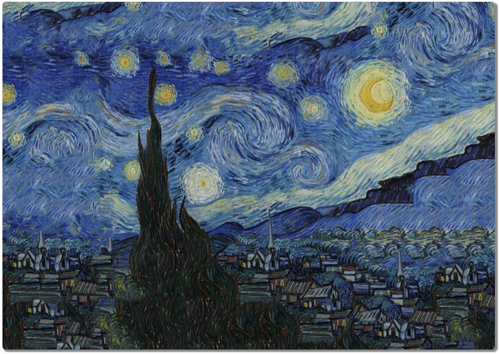 
Fig. 37 Gal, Yarin, <em>Patchmatch</em>, ‘Starry Night’ (2014)  

What Gal
displays is a series of images by artists such as van Gogh, Monet,
Picasso and Hokusai that have been digitally extended to ‘complete’ the
painted scene; in most respects, the final product is excruciatingly
terrible on a purely aesthetic level, in clear contrast to the artists’
original intentions (why would someone feel the need to extrapolate
additional imagery from finished art unless they felt it was in an
incomplete state?), but it signals a willingness to accept both an
extension of digital agency as well as an acceptance of the temporary
nature of these extrapolations in that there’s no illusion nor
expectations that viewers are going to understand these New Aesthetic
digital products as separate from the original paintings over any
extended period of time. There have been efforts to counter what seems
to be this inherent aspect of many instances of these objects, this
strange sense of presence that is vividly temporary, but even work such
as the 2015 *As Long As Possible* project by Juha van Ingen in
collaboration with Janne Särkelä, which consists of a GIF viewable only
over a thousand years showing 48,140,288 frames changing every ten
minutes, is an artistic work that is clearly unfeasible. {Fig. 38}   

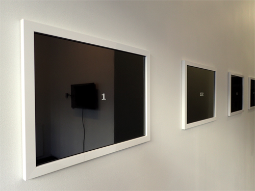 
Fig. 38 Juha van Ingen and Janne Särkelä, <em>As Long As Possible</em> (2015)  

The
New Aesthetic objects often appear to be permanent, but clearly are not.
In the context of these manifestations, we wonder if it’s possible to
resist the digitizing homogenization and increased acceptance of digital
autonomy, to resist this shift in our metaphysics. The New Aesthetic
objects that give us a sense of success are few, but products like Mint
Digital Products *WhiteAlbum*,[^book_book_book_book_book_book_book_book_02ok_46] a recently developed app for iOS, is
in many respects the perfect instance that alters our relationship with
photographic objects and that, perhaps, is also a product of efforts
resisting the New Aesthetic. {Fig. 39}   

 
Fig. 39 Mint Digital Projects, <em>Whitealbum</em> (2015)  

Released in early 2015, and since
discontinued, it was a photographic application for the iPhone that
confoundingly did not provide visual feedback nor a digital file to the
photographer, making it impossible to correct, edit, save or share the
results. *WhiteAlbum*, rather ponderously, mimicked the disposable
camera by saving the photographs to a server until 24 shots have been
produced, at which point the user was charged \$20 for those shots to be
printed on high quality paper and to receive them by mail.[^book_book_book_book_book_book_book_book_02ok_47] It’s in
the return to the analog, in a return to the actual world, that the
paradigmatic and metaphysical shift identifiable as the New Aesthetic
loses its dominance. That being said, *WhiteAlbum* was also a little
ridiculous, even if we ignore its strange reference to the Beatles
album.

We conclude this chapter with what we believe is perhaps the most
innocuous and yet increasingly pervasive example of the New Aesthetic’s
intruding into our lives: the shift towards vertical photography and
video. We hope to have shown that the New Aesthetic does not only
address specific visual phenomena or niche artistic practices but is an
affective approach transforming the very foundations of human existence
in subtle but important ways. As a transition between manifestations and
art, between products and objects, we argue that one instance of its
inclusiveness and rhizomatic theoretical foundations can be helpfully
observed in one of the earliest emergences of this specific new cultural
paradigm, namely, the recent trend towards vertical photography and
video caused particularly by the mobile revolution. We know what you’re
thinking: how could a vertical or horizontal orientation of photography
or video change the world? Consider this: according to a study done by
eMarketer in 2015, digital device users frequently spend as much as 10
hours daily in front of various screens, and in nearly 30% of that time
the screen content was being consumed on mobile ‘vertical’ screens
(2010-2015, US). Additionally, in 2015, the overall time of consuming
digital media in the western world reached nearly 6 hours on a daily
basis, with 51% of that time spent on mobile devices typically in a
vertical orientation. The fact that this evolution towards mobile
devices is changing the way humans interact with the world is without
question, but it’s equally evident that one of the most fundamental
formal configurations in the process of presenting information is also
changing. The horizontal format has been a fundamental element of the
aesthetic canon in a range of different art forms for centuries,
dominating image creation and distribution; this is apparent not just in
photography and video but in the history of painting. One could even
claim that evidence of the horizontal format as fundamental to image
production goes all the way back to ancient Greece, with the examples of
sculptural friezes on the Parthenon, of ancient Mesopotamia, with
architectural decoration and cylinder seals, and even instances of
prehistoric art found in cave paintings. The reason for this is simple:
our eyes are arranged in a horizontal relationship, and our binocular
vision is processed in this fashion. In recent years, however, and most
strangely, the horizontal, widescreen frame in photography and video is
increasingly becoming extinct, as today the vertical frame begins to
dominate contemporary imagery.

There are multiple explanations for this evolution. The simplest or the
most obvious would be that mobile devices themselves are equipped with
vertical screens because their design is directly linked an ergonomic
design impetus observable in the history of the physical form of the
telephone, where a handset’s receiver and transmitter needs to be
aligned in one hand between the ear and the mouth; various designs of
horizontal mobile phones have languished and died in popularity against
to the massive dominance of the vertical shape, a clear sign that
comfort and usability is part of the drive towards the vertical. In the
shift from landline to mobile phones, this design approach resulted in a
specific user interface which favors handling the phone with one hand (a
manner of speaking on the phone that we’ve all grown accustomed to)
which would lead to ‘scrolling’ through a screen in an up and down
rather than a horizontal manner. Scrolling through information on a
screen then encourages an approach that stacks information rather than
encouraging a manner of ‘hyperlink exploring’ as a way for interacting
with the content. Multiple windows and hierarchical links, which
dominated the web and GUIs in the personal computer era, have lately
been replaced by interaction models based on single-window view. Across
the world, smartphones and mobile devices are becoming the primary
everyday screens to consume and transform not only text-based content
but also interactive (apps) and visual content (photography, video),
almost to the point that referring to them as ‘phones’ is increasingly
becoming inaccurate.

It’s evident that the processes of using mobile phones have dictated the
presentation of material, but we assert that this has done far more than
just shifting the orientation of information and has, instead, changed
the very nature of the information itself. Widescreen and horizontal
image aesthetics have dominated theatrical releases and TV broadcast for
decades, in part because, as noted above, the natural process of human
vision is horizontally oriented through our binocular vision. But once
both professional visual content and user-generated photos and videos,
often captured vertically, have blended on a single mobile screen, the
hegemony of the horizontal has ended. Today the user can access
multi-device services such as Netflix and HBO GO which still offer
widescreen content, and social media uploads generated on a mobile phone
held horizontally or apps like Vine, Snapchat (200 million monthly
users) or Periscope (10 millions users and only supporting vertical
videos) on the very same mobile device. In 2015 YouTube updated its
mobile apps to support full-screen vertical video playback. The
disruptive cultural effect of portrait video could not have been ignored
even by the largest social media video service, only a decade after the
very invention of a modern mobile device. Several media – among them
*Mashable* and *The Daily Mail* – have begun experimenting with
professional videos shot in portrait mode. At the end of the day, the
format of vertical video is just a tool, but we argue that the users who
create art, advertisement or entertainment based on that, are
introducing fundamental cultural changes for the simple reason that the
horizontal orientation of our natural vision processes is forcibly being
shifted to accommodate the manner in which the information is received.
The vertical video example illustrates that the New Aesthetic can be an
interesting approach to grasp and analyze rapid socio-cultural changes
triggered by a very fast adoption rate of a particular technology, to
the point that we read information in the manner in which it is
presented to us – vertically, rather than horizontally – which shifts
our critical perspective, even the basic level at which we understand
visually presented information, from one that is naturally familiar to
one that is artificially familiar. There has been some resistance to
this and some lively debates; ‘Vertical Video Syndrome’[^book_book_book_book_book_book_book_book_02ok_48] is neither
dangerous nor offensive per se, but it does indicate an unwillingness on
the part of the content producer to account for our horizontal panoramic
video, and as an example of the New Aesthetic it indicates an
unconscious concession to the software paradigm that is itself governed
by limitations of the hardware. It’s more than just a sign of
amateurism, it’s increasingly becoming the norm as authors like Farhad
Manjoo argue: ‘They worry they are on the wrong side of history. The
future of video, it turns out, just may be vertical.’[^book_book_book_book_book_book_book_book_02ok_49] Quoted in
Manjoo’s article, Jon Steinberg, the chief executive of *The Daily
Mail*’s North American operations, states: ‘We find the engagement much
higher. Users are more satisfied, and there’s a higher completion rate
on them.’[^book_book_book_book_book_book_book_book_02ok_50] But does Steinberg genuinely believe that there is
actual engagement, which is highly unlikely, or is this merely
indicative of an increased length of time watching the video and the web
page, a vital rubric when it comes to advertising fees? A higher
completion rate means nothing, we would assert, beyond the presence of a
paradigmatic shift of the user’s experiential expectations identifiable
as the New Aesthetic; we’ve been conditioned to consume digital content
in a certain fashion because of the characteristics of its presentation
that were, at first, a result of their limitations, and now it’s been
produced at an even higher rate with an assertion that it’s a new,
fresher, more exciting way of seeing the world. It’s not because video
has become more personal, it’s because the technology behind the video
has driven our aesthetic standards away from the human towards the
pervasively digital. If our perception of the world is increasingly in a
fluxual state of intertwined layers of algorithms and computation that
defines contemporary society and culture then it’s increasingly evident
that New Aesthetic experiences are becoming a dominant and driving force
for that change.

[^book_book_book_book_book_book_book_book_02ok_1]: Simon Parkin, ‘Desert Bus: The Very Worst Video Game Ever Created’, *The New Yorker*, 9 July 2013, [http://www.newyorker.com/tech/elements/desert-bus-the-very-worst-video-game-ever-created](http://www.newyorker.com/tech/elements/desert-bus-the-very-worst-video-game-ever-created).

[^book_book_book_book_book_book_book_book_02ok_2]: Robert Boyer, James C. Browne and Jayadev Misra, ‘In Memoriam Woodrow W. Bledsoe’, Faculty Council, The University of Texas, Austin, 27 May 2014, <https://www.utexas.edu/faculty/council/1998-1999/memorials/Bledsoe/bledsoe.html>, adapted from ‘Woody Bledsoe: His Life and Legacy’, authored by Michael Ballantyne, Robert S Boyer and Larry Hines, *AI Magazine*, Volume 17, Number 1, Spring 1996, pp. 7-20.

[^book_book_book_book_book_book_book_book_02ok_3]: What colour is it?, <http://whatcolourisit.scn9a.org/>.

[^book_book_book_book_book_book_book_book_02ok_4]: J.E. Murphy, <http://jemurphy.org/>.

[^book_book_book_book_book_book_book_book_02ok_5]: Glitchtop, <http://chrisfoley.github.io/glitchtop/>.

[^book_book_book_book_book_book_book_book_02ok_6]: Chris Foley, <http://www.cfoley.net/>.

[^book_book_book_book_book_book_book_book_02ok_7]: Skyler Balbus, ‘What Glitch? Technology And The New Aesthetic’, *Hook & Loop*, 20 September 2013, <http://www.hookandloopnyc.com/author/skyler/>.

[^book_book_book_book_book_book_book_book_02ok_8]: Sterling, ‘An Essay on the New Aesthetic’.

[^book_book_book_book_book_book_book_book_02ok_9]: Polymaps, <http://polymaps.org/>.

[^book_book_book_book_book_book_book_book_02ok_10]: Steven von Worley, ‘My God, It’s Full Of Blocks: Population Density Meets The Tile Space’, *Data Pointed*, 3 October, 2011, <http://www.datapointed.net/2011/10/us-population-density-and-google-maps-tiles/>.

[^book_book_book_book_book_book_book_book_02ok_11]: ‘Pixelate Tool’, iTunes Store, September 2015, <https://itunes.apple.com/us/app/id442157795.>

[^book_book_book_book_book_book_book_book_02ok_12]: Matthew Cox, ‘Army Unveils Design Changes for New Camo Uniform’, *Military.com*, 6 August 2014, <http://www.military.com/daily-news/2014/08/06/army-unveils-design-changes-for-new-camo-uniform.html?ESRC=todayinmil.sm>.

[^book_book_book_book_book_book_book_book_02ok_13]: JCDecaux, ‘Old Street EC1’, September 2015, <http://www.jcdecaux.co.uk/roadside/roundabouts/old-street-ec1>.

[^book_book_book_book_book_book_book_book_02ok_14]: Kashmira Gander, ‘Heinz forced to apologise after QR code on ketchup bottle linked to hardcore porn site’, *The Independent*, 17 June 2015, <http://www.independent.co.uk/life-style/food-and-drink/news/heinz-forced-to-apologise-after-qr-code-on-ketchup-bottle-linked-to-hardcore-porn-site-10327313.html>.

[^book_book_book_book_book_book_book_book_02ok_15]: @Matt\_Macklin7, ‘The latest in live cross technology. Pic via Instagram’, Twitter Post, 28 October 2014, 7:54PM, <https://twitter.com/Matt\_Macklin7/status/527292438574952449/photo/1>.

[^book_book_book_book_book_book_book_book_02ok_16]: Maciej Cegłowski, ‘Ta’izz’, *Idle Words blog*, 17 May 2015, <http://idlewords.com/2015/05/ta\_izz.htm>.

[^book_book_book_book_book_book_book_book_02ok_17]: CAVI, <http://cavi.au.dk>.

[^book_book_book_book_book_book_book_book_02ok_18]: Kim Halskov, Morten Lervig and Peter Dalsgaard, ‘The Dynamically Transparent Window’, 14 October 2014, *CAVI*, <http://cavi.au.dk/research-areas/the-dynamically-transparent-window/>.

[^book_book_book_book_book_book_book_book_02ok_19]: Kim Halskov, Morten Lervig and Peter Dalsgaard, ‘Climate on the Wall’, *CAVI*, 14 October 2014, <http://cavi.au.dk/research-areas/climate-on-the-wall/>.

[^book_book_book_book_book_book_book_book_02ok_20]: Eric Limer, ‘A Typeface Designed To Thwart Spying Computers’, *Gizmodo.com*, 22 June 2013, <http://gizmodo.com/a-typeface-designed-to-thwart-sneaky-spying-computers-543341176>.

[^book_book_book_book_book_book_book_book_02ok_21]: Sang Mun, ‘Making Democracy Legible: A Defiant Typeface’, *Walker Art Center blog*, 20 June 2013, <http://blogs.walkerart.org/design/2013/06/20/sang-mun-defiant-typeface-nsa-privacy/>.

[^book_book_book_book_book_book_book_book_02ok_22]: Slavoj Žižek, *Welcome to the Desert of the Real!: Five Essays on September 11 and Related Dates*, New York: Verso, 2002, p. 2.

[^book_book_book_book_book_book_book_book_02ok_23]: Make a DifferenSe, ‘What is Wikileaks? by founder Julian Assange’, 11 December 2010, YouTube video, Duration: 14:58, <https://youtu.be/DFE7d91vQf4>.

[^book_book_book_book_book_book_book_book_02ok_24]: Mun, ‘Making Democracy Legible: A Defiant Typeface’.

[^book_book_book_book_book_book_book_book_02ok_25]: James Bridle, ‘Waving at the Machines’.

[^book_book_book_book_book_book_book_book_02ok_26]: Google Cultural Institute, <https://www.google.com/culturalinstitute/about/>.

[^book_book_book_book_book_book_book_book_02ok_27]: Jené Gutierrez, ‘Google’s Robot Cameras Caught Taking Unintentional Selfies In Museums And Galleries’, *Beautiful/Decay*, 7 July 2014, <http://beautifuldecay.com/2014/07/07/googles-robot-cameras-caught-taking-unintentional-selfies-museums-galleries/>.

[^book_book_book_book_book_book_book_book_02ok_28]: Michael Silverberg, ‘Google’s Street View cameras are touring museums and taking weird selfies by accident’, *Quartz*, 3 July 2014, <http://qz.com/229852/googles-street-view-cameras-are-touring-museums-and-taking-weird-selfies-by-accident/>.

[^book_book_book_book_book_book_book_book_02ok_29]: Emilio Vavarella, ‘Report a Problem’, <http://emiliovavarella.com/archive/google-trilogy/report-a-problem/>.

[^book_book_book_book_book_book_book_book_02ok_30]: KentuckyFC, Emerging Technology from the arXiv, ‘How to Burst the "Filter Bubble" that Protects Us from Opposing Views’, *MIT Technology Review*, 29 November 2013, <http://www.technologyreview.com/view/522111/how-to-burst-the-filter-bubble-that-protects-us-from-opposing-views/>.

[^book_book_book_book_book_book_book_book_02ok_31]: Eduardo Graells-Garrido, Mounia Lalmas, and Daniele Quercia, ‘Data Portraits: Connecting People of Opposing Views’, Human-Computer Interaction (cs.HC); Social and Information Networks, Cornell University, 19 November 2013, <http://arxiv.org/abs/1311.4658>.

[^book_book_book_book_book_book_book_book_02ok_32]: KentuckyFC, Emerging Technology from the arXiv, ‘How to Burst the "Filter Bubble" that Protects Us from Opposing Views’.

[^book_book_book_book_book_book_book_book_02ok_33]: Ben Mathis-Lilley, ‘Hacked Confederate Facebook Group Becomes Tribute to LGBT Rights, Obama, Judaism’, *Slate.com*, 29 July 2015, <http://www.slate.com/blogs/the\_slatest/2015/07/29/confederate\_flag\_pride\_facebook\_group\_hijacked\_michelle\_obama\_and\_multi.html>.

[^book_book_book_book_book_book_book_book_02ok_34]: Virgil Texas, ‘How I Infiltrated a White Pride Facebook Group and Turned It into “LGBT Southerners for Michelle Obama”’, *Vice.com*, 3 August 2015, <http://www.vice.com/read/virgil-texas-white-power-facebook-group-troll>.

[^book_book_book_book_book_book_book_book_02ok_35]: James Bridle, ‘Google launches “Constitute,” a new tool for designing governments | The Verge’, *The New Aesthetic Tumblr blog*, 25 September 2013, <http://new-aesthetic.tumblr.com/post/62244541600/google-launches-constitute-a-new-tool-for>.

[^book_book_book_book_book_book_book_book_02ok_36]: Comparative Constitutions Project, <http://comparativeconstitutionsproject.org/>.

[^book_book_book_book_book_book_book_book_02ok_37]: Randall Patrick Munroe, ‘Questions’, *xkcd.com*, 26 August 2013, <http://xkcd.com/1256/>.

[^book_book_book_book_book_book_book_book_02ok_38]: Anna Jobin, ‘Google’s autocompletion: algorithms, stereotypes and accountability’, *Sociostrategy blog*, 22 October 2013, <http://sociostrategy.com/2013/googles-autocompletion-algorithms-stereotypes-accountability/>.

[^book_book_book_book_book_book_book_book_02ok_39]: *UN Women*, ‘UN Women ad series reveals widespread sexism ‘, 21 October 2013, <http://www.unwomen.org/en/news/stories/2013/10/women-should-ads>.

[^book_book_book_book_book_book_book_book_02ok_40]: Leo Kelion, ‘Apple Maps flaw results in drivers crossing airport runway’, *BBC News*, 25 September 2013, <http://www.bbc.com/news/technology-24246646>.

[^book_book_book_book_book_book_book_book_02ok_41]: Hito Steyerl, ‘In Defense of the Poor Image’, *e-flux*, November 2009, <http://www.e-flux.com/journal/in-defense-of-the-poor-image/>.

[^book_book_book_book_book_book_book_book_02ok_42]: Steyerl, ‘In Defense of the Poor Image’.

[^book_book_book_book_book_book_book_book_02ok_43]: Steyerl, ‘In Defense of the Poor Image’.

[^book_book_book_book_book_book_book_book_02ok_44]: Stephen von Worley, ‘My God, It’s Full Of Blocks! Population Density Meets The Tile Space’.

[^book_book_book_book_book_book_book_book_02ok_45]: Yarin Gal, *Extrapolated Art*, <http://extrapolated-art.com/>.

[^book_book_book_book_book_book_book_book_02ok_46]: WhiteAlbum, <https://whitealbumapp.com/>.

[^book_book_book_book_book_book_book_book_02ok_47]: Kyle Vanhemert, ‘App Turns Your iPhone Into a Crappy Disposable Camera (And That’s a Good Thing)’, *Wired.com*, 1 January 2015, <http://www.wired.com/2015/01/app-turns-iphone-crappy-disposable-camera-thats-good-thing/>.

[^book_book_book_book_book_book_book_book_02ok_48]: Glove and Boots, ‘Vertical Video Syndrome - A PSA’, YouTube video, 2:58, 5 June 2012, <https://youtu.be/Bt9zSfinwFA>.

[^book_book_book_book_book_book_book_book_02ok_49]: Farhad Manjoo, ‘Vertical Video on the Small Screen? Not a Crime’, *The New York Times*, 12 August 2015, <http://www.nytimes.com/2015/08/13/technology/personaltech/vertical-video-on-the-small-screen-not-a-crime.html?\_r=0>.

[^book_book_book_book_book_book_book_book_02ok_50]: Ibid.
  
# Chapter 3: Glitch Ontology and the New Aesthetic 

In order to critically examine the cultural impact of the latest
computational technologies and to follow the critical approach to the
computational advocated by the protagonists of the New Aesthetic, we
need to turn to studying the computational in a state of failure.

In this chapter we are elaborating on glitch theory, which will be used
in the subsequent chapters devoted to studying glitches in digital
media, consumer software and hardware ecosystems, artistic interventions
and works of art. {Fig. 40} 

   
Fig. 40 Nicolas Maigret, *The Pirate
Cinema* (2014)

The glitch is a result of the ‘attitude’
(Bridle’s characterization) that drives the New Aesthetic; it is a
fundamental aspect of New Aesthetic objects, the means by which they are
apparent and recognizable to the user. We argue that glitches are one of
the key constituents and manifestations of the New Aesthetic both on the
conceptual and on the aesthetic level.

In *Software Studies, A Lexicon* in the chapter entitled ‘Glitch’, Olga
Goriunova and Alexei Shulgin write that

> In electrical systems, a glitch is a short-lived error in a system or
> machine. A glitch appears as a defect (a voltage-change or signal of
> the wrong duration – a change of input) in an electrical circuit.
> Thus, a glitch is a short-term deviation from a correct value and as
> such the term can also describe hardware malfunctions.[^book_book_book_book_book_book_book_03-Chap3_03-Chap3_1]

From the aesthetic perspective glitches can be ‘claimed to be a
manifestation of genuine software aesthetics’ as they reveal the
computational nature of the digital image.[^book_book_book_book_book_book_book_03-Chap3_03-Chap3_2] There is even a sense
that the glitch is a challenge to the moral or ethical status of the
digital object’s use, in that it manifests an incorrect value
contradicting the user’s expectations. Glitch aesthetics has been
discussed as a form of transmedial narratives, and has even been
frequently linked to a nostalgic form of 8-bit game design, to cite one
example, but in the case of New Aesthetic objects there is something
more. Both low-res pixelated images and glitches are rather marginal
phenomena in comparison to common contemporary aesthetics (images
displayed in high resolution with millions of colors). However they
allow us to break away from the screen-centric approach and make the
softwarization of the digital image clearly visible. The glitch, being a
direct and natural result of an algorithmic error, unveils the degree of
the software’s influence on the aesthetics of digital image:

> Just as digital technologies and software mediate our experience and
> engagement with the world, often invisibly, so the “digital” and
> “software” is itself mediated and made visible through the
> representational forms of pixelation and glitch.[^book_book_book_book_book_book_book_03-Chap3_03-Chap3_3]

In this sense, glitches are more than just a manifestation of a coding
error or the result of inputted data from the user; they are both an
opportunity and an encouragement for us to reconsider the myth of total
immediacy of computational imagery, particularly when images are
perceived as parts of software structure e.g. graphical user interface.
The very notion of mediation is important because it creates a
dialectical relationship between user and object, necessitating
interaction or, at the very least, reaction. In *Transcoding the
Digital: How Metaphors Matter in New Media* Marianne van den Boomen
gives examples of such situations:

> For example, when sound and vision are no longer synchronized in a
> movie, when subtitles suddenly disappear, or when we notice the delay
> in a live television interview from the studio. Paradoxically then,
> immediacy is the imaginary degree zero of any mediation, a lived
> illusion of absent mediation, deprived of all traditional markers that
> announce an encounter with media. When it shows itself, the spell is
> broken. In retrospect, immediacy turns out to be a matter of unnoticed
> and concealed mediation, revealing itself now in the split into a
> faltering medium and a stammering message.[^book_book_book_book_book_book_book_03-Chap3_03-Chap3_4]

In focusing on the appearances of glitches and miscalculations in New
Aesthetic objects, we believe that at least part of its nature is
revealed as an abnormal relation in the structures composed of
standardized objects, especially in the creative software based on image
processing algorithms or lags and artifacts that are the means of
producing graphical user interfaces in contemporary software. An
instance of a programming language taking over the responsibilities of
coding from the programmer, while disingenuously promoting itself as a
guarantor of the programmer’s and user’s end-use satisfaction, is
Apple’s new programming language Swift, which is supposedly designed for
‘safety’ because ‘Swift eliminates entire classes of unsafe code.
Variables are always initialized before use, arrays and integers are
checked for overflow, and memory is managed automatically.’

On the aesthetic level they seem to address the approach taken by many
proponents of the New Aesthetic. For Matt Jones the New Aesthetic
encourages us to ‘see the grain of computation’[^book_book_book_book_book_book_book_03-Chap3_03-Chap3_5] in everyday
interaction not only with the digital but with the physical world as
well. The ‘grain of computation’ would be these specific aesthetic
patterns associated with the digital that are becoming visible through
pixelization and visual glitches in digital media and in new pixelated
aesthetics in fashion, military, architecture, design and other actual
objects present in the physical world. In the era of ultra-high
resolution, seamless user interfaces and ubiquitous systems that Peter
Knapp names the ‘era of noise canceling’, the New Aesthetic
manifestations, and particularly glitches, unveil the limitations of the
computational through something that Kim Cascone calls the ‘aesthetics
of failure’.[^book_book_book_book_book_book_book_03-Chap3_03-Chap3_6]

Both glitch studies and the New Aesthetic seem to share the spirit of a
‘critical trans-media aesthetics’[^book_book_book_book_book_book_book_03-Chap3_03-Chap3_7] as understood by Rosa Menkman, the
author of the *Glitch Art Manifesto* (2010) and the *Glitch Momentum*
(2011).

> these aesthetics media show a medium in a critical state (a ruined,
> unwanted, not recognized, accidental and horrendous state). These
> aesthetics critique the medium (genre, interface and expectations)
> \[…\] They challenge its inherent politics and the established
> template of creative practice while producing a theory of
> reflection.[^book_book_book_book_book_book_book_03-Chap3_03-Chap3_8]

Menkman suggests that glitch aesthetics offer more than just interesting
and attractive visual experiences. They give us a new perspective on
digital media and applications that goes beyond the preprogrammed
aesthetics and interactions paradigms. They can also challenge another
praised popular culture paradigm that emphasizes the unlimited creative
potential of computational technologies. Glitches in digital media
processing and user-oriented applications suddenly bring to the
forefront the hidden boundaries of creative practices based on
affordances of the digital.

This observation drives us to the conclusion that the New Aesthetic is
not a medium-specific approach, since the phenomena associated with the
New Aesthetic can be encountered in any kind of digital media; be it
CGI, still images, video content, GUIs, etc. The range of artworks
presented in the subsequent chapter clearly proves that point. Despite
the fact that there are multiple formats and media types, when faced
with glitches digital media seem universally equivalent. All digital
objects are susceptible to unwanted, sudden errors that lead to visual
glitches. The reason for this is the fact that the very conditions for
glitch aesthetics are structured by core properties of computer-based
media enumerated by Lev Manovich in his *The Language of New Media.*[^book_book_book_book_book_book_book_03-Chap3_03-Chap3_9]
Manovich argues that all digital media share some common properties,
which are deeply rooted in their numerical nature. Consequently, all
digital images are discrete since they are broken and then displayed as
discrete elements with pixels (data values on chrominance and
luminance). They are also modular since they are built in real-time from
various layers of data types. The process of their displaying involves
actual image data, specific codecs, software, user interfaces and this
is even more complex in network-based imagery. The cultural and social
significance of different, interconnected layers in the computational
will be addressed broadly when we will discuss the ‘ontological levels
of the computational’ described by David M. Berry. Another common
property of digital images would be their ability to be compressed. This
is important particularly in web-based imagery which has to be processed
and sent with as few resources as possible. Compression has become
really important in the advent of mobile devices and mobile internet
access. Video streaming services, such as VOD platforms or YouTube, but
also social media that heavily use visual content like Instagram or
Facebook, function thanks to advanced compression algorithms.
Variability and automation would be another key property of digital
visual media. Both can be narrowed down to the fact that they are
programmable. Manovich explains that this enables a user to create
infinite versions of the same image which can vary in size, resolution,
colors, composition and so on.

Following Manovich’s observations we argue that the core properties of
digital media create the very conditions of existence of glitch
aesthetics. It emerges as a trans-media, or better a medium-neutral
abnormal momentum, which takes the user beyond a carefully designed modi
operandi of each and every medium. In high-resolution photography,
glitch aesthetics would manifest itself by a pixelated or broken
(partially-displayed) image, in video the glitches would be seen as
compression artifacts, in real-time web-based media and interfaces the
glitches would result in partial or incorrect display of icons, data
streams etc. We will address such cases in our glitch art analysis. In
any case, glitch aesthetics challenges the logic of seamless interaction
and automation maintained by the continuity of streams of processed data
displayed in various media.

Of course, the ontological identity of objects is not only identifiable
through the presence of glitches but also their relational capacities
and effects, a crucial point to remember in the context of a narrowed
discussion of New Aesthetic objects. Many scholars emphasize the
promising critical potential of glitches in studying not only
technologies themselves and everyday human-computer interaction
practices but also their social and cultural impact; with a general
consensus that it is necessary to open the black box of computation to
the user.

This quasi-hacking approach in which the glitches are undeliberate after
all is considered as a first step in a process of making the user aware
of both technical limitations of the digital and of socio-political
constraints imposed on her through these technologies. For instance,
Benjamin Mako Hill, and to some extent Jussi Parikka, write about hidden
affordances of technologies that are made visible to the users thanks to
glitches and errors.

> \[…\] errors can reveal the affordances and constraints of technology
> that are often invisible to users. Through these affordances and
> constraints, technologies make it easier to do some things, rather
> than others, and either easier or more difficult to communicate
> certain messages. Errors can help reveal these hidden constraints and
> the power that technology imposes. [^book_book_book_book_book_book_book_03-Chap3_03-Chap3_10]

In other words, Hill argues that glitches do reveal the boundaries of
the digital sandbox that a user usually plays in while being enchanted
by supposed limitless creative possibilities and perfect visual
representations that come with user-oriented software and systems.
‘Through noise, through anomalies, we are able to decipher a range of
crucial issues concerning politics, aesthetics and cultural processes of
media.’[^book_book_book_book_book_book_book_03-Chap3_03-Chap3_11] Parikka goes even further, saying that a critical
examination of anomalies and noise in digital media can be a starting
point for a more broad analysis of the impact of the computational on
society and culture. Parikka seems to follow an important line of
reasoning in the humanities that was advocated by Immanuel Kant – that
examining the world in the light of its aesthetics may provide us with a
very productive and unique critical perspective. This approach is shared
by us as well throughout this book.

Building on this approach, it is worthy to mention a very important
addition to it by Olga Goriunova and Alexei Shulgin who link glitch
studies with software studies. The scholars emphasize the critical
potential of glitch for revealing the inner logic of software, however
not solely as a technology-oriented endeavor but rather as a starting
point for a wider discussion on the social and cultural consequences of
a particular organization of digital spaces:

> A glitch is a mess that is a moment, a possibility to glance at
> software’s inner structure, whether it is a mechanism of data
> compression or HTML code. Although a glitch does not reveal the true
> functionality of the computer, it shows the ghostly conventionality of
> the forms by which digital spaces are organized.[^book_book_book_book_book_book_book_03-Chap3_03-Chap3_12]

Goriunova and Schulgin understand glitches and errors as unique
epistemic micro-states that offer a chance to critically assess the
boundaries of the operational logic of the software. The scholars
encourage us to conceptually understand glitches as ruptures which go
vertically through different layers of the computational as they may be
caused by errors in the software code, data sets, network, protocols or
user interface. Glitches provide us not only with an insight into the
layered structure of the computational, but also make clear the
limitations of the programmability of the digital. Mark Nunes and
Benjamin Mako follow a similar logic, emphasizing the importance of
opening the computational ‘black boxes’ for making possible a critical
analysis of HCI.[^book_book_book_book_book_book_book_03-Chap3_03-Chap3_13] The scholars claim that errors that provide clear
views into black boxes provide a view into some of what we might be
missing. However, they also emphasize that glitches may be of vital
importance for making the users aware of the great formational power of
digital technologies.

Given the growing dominance of this ideology of informatic control,
error provides us with an important critical lens for understanding what
it means to live within a network society. Error reveals not only a
system’s failure, but also its operational logic.[^book_book_book_book_book_book_book_03-Chap3_03-Chap3_14] David M. Berry,
similarly to Goriunova and Schulgin, claims that glitches do introduce a
specific phenomenological condition that enables a user to interact with
the computational in a state of failure. Berry conceptualizes this
condition in the *Critical Theory and The Digital* as ‘glitch ontology’
which takes the user out of the constant flow of digital processes that
are normally masked by autonomous content representation and seamless
interaction.

> Computation due to its glitch ontology continually forces a contextual
> slowing down at the level of the experience of the user. This is
> suggestive of the possibility for a micro-phenomenology that could
> fully explore the breaks in perception that the computer
> generates.[^book_book_book_book_book_book_book_03-Chap3_03-Chap3_15]
>
> \[…\] just as digital technologies and software mediate our experience
> and engagement with the world, often invisibly, so the “digital” and
> “software” is itself mediated and made visible through the
> representational forms of pixelation and glitch.[^book_book_book_book_book_book_book_03-Chap3_03-Chap3_16]

Berry emphasizes the importance of glitches for bringing to the
forefront the layered nature of computational technologies. However
their role is even more significant for representing breaks in the
continuity of postdigital media and software. In the era of mobile
networks, clouds, IoT, data streams, preventing or better masking errors
in the constant flow of the digital is crucial. Glitches, by introducing
their unique micro-phenomenology, unveil these breaks, at least on the
perceptual, visual level.

Berry argues that glitch ontology is one of many manifestations (e.g.
code / software or ubiquitous systems) of a specific civilizational
condition which is a result of the increasing presence of the digital in
our everyday life. He conceptualizes this ‘new constellation of
intelligibility’ as computationality. The notion is used, as explained
in the previous chapter, to describe today’s transformation of our
society and culture which will lead to ultimate synchronization with, or
better, to subordination to the digital. This should be understood as an
era when cultural and social practices are both rooted in and bound by
digital technology – e.g. the various types of hardware, software,
distributed networks or interaction paradigms.[^book_book_book_book_book_book_book_03-Chap3_03-Chap3_17] Lev Manovich in his
*Software Takes Command* argues that even now we rely on software and
hardware to create, transform and distribute information to such an
extent that our society should rather be characterized as software
society.[^book_book_book_book_book_book_book_03-Chap3_03-Chap3_18]

The media studies, digital art and critical theory scholars cited above
are intrigued by the critical potential of glitch aesthetics. On the one
hand it is emphasized that glitches offer a unique possibility to
visually depict the impact of core properties of computer-based media on
their functioning by exposing their limitations. On the other hand, they
argue that glitches may provide us with an interesting starting point to
formulate a broader critique of today’s digital technologies based on
examining the glitches themselves, their milieu and their social and
cultural impact.

Building on that approach we argue that the rapid pace of technological
innovation that resulted not only in new technologies per se, but also
in new human-computer interaction paradigms and digital image aesthetic.
This evolution has left an imprint on the way glitches manifest
themselves in everyday interaction with digital media based on real-time
and cloud-based computational technologies, ubiquitous computing and
autonomous systems.[^book_book_book_book_book_book_book_03-Chap3_03-Chap3_19] Postdigital glitch studies should, similarly to
the New Aesthetic, critically challenge the mainstream technological
narratives that were founded on the latest technological innovation,
including the illusion of seamless interaction, automation and perfect
visual representation.

For our purposes, two different sets of philosophical strategies provide
intriguing and productive approaches to an ontological analysis of
glitches. For the rest of this chapter, we base our approach on
Heidegger’s notions of ready-to-hand and present-to-hand advocated by
him in *Being and Time*. Obviously Heidegger was never exposed to the
type of artifacts constituting the body of postdigital and New Aesthetic
objects, and Heidegger’s philosophy at first glance doesn’t seem
applicable. Nevertheless, we take courage from recent applications of
Heidegger’s ideas to a diverse range of subjects; if we can use
Heidegger to discuss environmentalism, psychology and religion then why
not use Heidegger to discuss digital objects and their effects,
especially if we consider those objects and their effects as fully
phenomenologically appreciable. In fact, extending Heidegger’s ideas
into the realm of postdigital and New Aesthetic objects is particularly
fruitful if we take the position that Heidegger’s theory would provide
us with a unique insight into the various ontological contexts in which
things, or more specifically tools, can manifest themselves in everyday
usage.

For Heidegger, tools are an essential aspect of our interaction with the
world; the world comes at us in the manner of things, but those things
which help constitute our thrownness (*Geworfenheit*) into the world are
special as a means of making our place in the world and understanding it
more fully. When tools become more than singular in their application as
a means of transforming the world then they are labeled equipment and
through this equipment human beings come to understand the notion of
being-with others in the worldliness of the world as constituted by this
being-with ourselves. The fact that Heidegger in his analysis also
focuses on instances where tools do not function as intended, providing
a clear contextualization of their specific ontic status and
micro-temporality, will give us a promising analytical paradigm to
distinguish and contextualize glitches and other aesthetic phenomena
associated with the New Aesthetic and postdigital media and
technologies.

A glitch offers a unique epistemic perspective. The unexpected error
caused by the inability of the software to process real-time data or an
inadequate capacity to recognize and recombine images into a functioning
single image, reveals not only the software’s inner structure, as Rosa
Menkman says, but also makes visible the limitations of real-time data
transmission and makes the omnipotence of digital quantification
questionable. Glitches in web-based graphical user interfaces,
video-streaming services, or satellite imagery services are some of the
last remaining instances of the unreadiness-to-hand of the computational
in the era of multi-layered autonomous software and ultra
high-resolution display systems. We could then argue that a glitch
becomes a manifestation of a malfunctioning piece of equipment that
emerges from a functional transparency or immediacy of a computational
system and becomes a sign of its unready-to-hand condition. It should
also be emphasized that a glitch goes beyond a binary distinction
between a working and not-working computational system, but is rather
situated in-between these two states.

Before applying Heidegger’s taxonomy to our analysis of the New
Aesthetic in today’s technological milieu, we think that its ontic
status should be clarified as well. As already argued, the computational
has become even more opaque because of the combination of interconnected
layers of both material (hardware) and immaterial (software) generating
ever changing data streams, based on protocols, and standardized tools.
If we want to avoid generalizations in our analysis of the New
Aesthetic, which occurs at any level or layer of our contemporary
technological milieu, we feel it is essential to at least briefly
characterize these levels. To do that we will use David M. Berry’s
theory of ‘ontological levels of the computational’ advocated in
*Critical Theory and The Digital. *

## The Glitch as an Unready-to-hand Condition 

> Heidegger’s phenomenological analysis of things has never been more
> relevant. Particularly pertinent for a networked digital society, he
> moves beyond the seemingly self-evident, but ultimately incomplete,
> under-standing of things as entities or objects. Instead, he provides
> a much richer phenomenological account of how thingness is in fact
> inextricably related to human concerns and dealings that occur in a
> distinctly insubstantial and non-thing-like fashion. In doing so,
> Heidegger illuminates the seemingly intangible but actually
> fundamental phenomenological aspects of mediated things – those things
> we commonly experience as “equipment”.[^book_book_book_book_book_book_book_03-Chap3_03-Chap3_20]

Heidegger argues that things are actual things acquiring their proper
‘thingly character’ only when they are used for a particular purpose.
The thing is then available as ‘ready-to-hand’. However, its unique
‘readiness-to-hand’ is manifested only through putting the thing to
work, as we can’t grasp it only through its appearance. He explicitly
states that ‘no matter how sharply we look at the “outward appearance”
of Things in whatever form this takes, we cannot discover anything
ready-to-hand’.[^book_book_book_book_book_book_book_03-Chap3_03-Chap3_21] The specific mode of being that belongs to the
thing appears as a using of something for something.[^book_book_book_book_book_book_book_03-Chap3_03-Chap3_22] Heidegger’s
famous example of this logic is a hammer and a nail. The specific
thingness (manipulability) of the hammer is unveiled through putting it
to actual work – nailing the nail. [^book_book_book_book_book_book_book_03-Chap3_03-Chap3_23] The process of putting the
things to actual work disclose them and their thingness to the user.
David Gunkel and Paul A. Taylor argue that if we’d follow Heidegger’s
line of reasoning we would conclude that ‘Readiness-to-hand is therefore
not just a temporary attitude or viewpoint we adopt with regards to
things. It acts to define the very being of things as things.’[^book_book_book_book_book_book_book_03-Chap3_03-Chap3_24] The
Readiness-to-hand defines things both ontologically and categorically.
From the perspective of media and communication studies, the things
should then be understood as intermediary means to and end or simply
put, media (in a broader McLuhanian sense). However, usually we do not
reflect on the nature of a hammer, nail or any tool. We focus instead on
completing the task by using a particularly thing or medium. The thing
and its thingness become transparent or unremarkable. The tool follows
the logic of immediacy, being a mere mean to an end. ‘The paradox of the
ready-to-hand is therefore the fact that in its most authentic form, it
necessarily withdraws from direct view’, Gunkel and Taylor
write.[^book_book_book_book_book_book_book_03-Chap3_03-Chap3_25]

Now we’ve arrived to a point when Heidegger’s theory on things meets
with principal assumptions about human-computer interaction and digital
content representation that have been challenged by the New Aesthetic
and the postdigital. Even before mass popularization of
consumer-oriented computing, the visionaries of the computing age
envisioned computers as tools that would serve as autonomous machines
that would assist humans in storing, processing and accessing
information. From an electromechanical device called Memex, described in
‘As We May Think’ by Vannevar Bush,[^book_book_book_book_book_book_book_03-Chap3_03-Chap3_26] through Sketchpad designed by
Ivan E. Sutherland in 1963[^book_book_book_book_book_book_book_03-Chap3_03-Chap3_27] and PARC User Interface (Xerox 8010 Star
Information System) from the early 1980s to various modifications of the
personal computers from the 1990s: all have been designed with the
principle to ‘augment the human intellect’, while being as transparent
as possible.[^book_book_book_book_book_book_book_03-Chap3_03-Chap3_28] The logic of the immediacy of the computational has
prevailed even more in the age of ubiquitous computing, cloud-based and
multi-device ecosystems. Their ultimate readiness-to-hand is a necessary
condition of their actual interoperability and versatility. They are
perfect tools as long as they stay in the shadow. As soon as they break
down, or a visible glitch occurs in any node of the system –
particularly near to the end user – in graphical user interfaces or in
the visual media they process and display, the tools become
present-at-hand. Heidegger points out that such a situation causes
concern among users, and ‘the entities which are most closely
ready-to-hand may be met as something unusable, not properly adapted for
the use we have decided upon. \[…\] we discover its unusability,
however, not by looking at it and establishing its properties, but
rather by the circumspection of the dealings in which we use
it’.[^book_book_book_book_book_book_book_03-Chap3_03-Chap3_29] Gunkel and Taylor also emphasize the fact that the evolution
from being ready-to-hand to present-to-hand of certain tools, takes
place not in the user’s perception of a tool, but through putting it to
actual use. ‘Something becomes present-at-hand when the thing in
question fails to work, breaks down or interrupts the smooth functioning
of what had been already handy and ready-to-hand.’[^book_book_book_book_book_book_book_03-Chap3_03-Chap3_30] If we return to
our broader understanding of the New Aesthetic, described as a
theoretical approach that takes to the forefront of our perception the
conditions of existence of the computational in the postdigital age
together with its limitations, the critical potential of studying
certain technologies and media in their unready-to-hand conditions,
looks very promising. Heidegger uses three different notions to describe
specific conditions of things when they reveal their presence-at-hand
through unique unreadiness-to-hand. The modi of conspicuousness,
obtrusiveness and obstinacy introduce a micro-temporal context, an
epistemic condition that through the state of failure allows us to
apprehend the characteristic of presence-at-hand, a handiness that is
usually masked by a perfect functioning of the equipment.

In a technological context, the unready-to-hand condition of the
equipment can be characterized as a condition in which a computational
apparatus is facing a sudden or unusual obstacle that can’t be overcome
by its (pre)programmed mode of operation and interaction with the user.
However, it may not imply that the machine’s inner logic of operation is
defective. The state of unreadiness-to-hand goes far beyond a mere
problem of incalculability. Something – a tool, device, application – is
*conspicuous* when it becomes unusable. Unusability means in this
context a situation when a thing no longer serves the use for which it
was initially designed.[^book_book_book_book_book_book_book_03-Chap3_03-Chap3_31] It is not just about breaking the seamless
interaction and utility paradigm in partially working machines or
software. The conspicuousness is a result of a complete failure of the
computational, a situation in which a user is confronted with a broken
piece of hardware, or an application that fails to launch. A thing
becomes *obtrusive* when it is missing. As Heidegger argues, the thing
is then not ‘handy’ but is not ‘to hand’ at all. The more we need what
is missing to perform a task, the more intensive it enters into the
state of obtrusiveness.[^book_book_book_book_book_book_book_03-Chap3_03-Chap3_32] The problem of obtrusiveness occurs when
for example a certain media file cannot be opened or processed due to
lack of a specific codec, or when a cloud-based application cannot
access data which is stored on the remote server. The state of
obtrusiveness will become even more relevant as the interaction and
functioning of computational technologies will be based on
interconnected software and hardware ecosystems composed of various
devices, software and data types. Any malfunction in such an ecosystem
can result in an obtrusive piece of equipment (both material and
immaterial) at the level of user-computational interaction. The last
variation of unreadiness-to-hand is the state of *obstinacy*. The
*obstinacy* is encountered when it ‘stands in the way’ of our concern
and interrupts our activities. Anything which is un-ready-to-hand in
this way is disturbing to us, and enables us to see the obstinacy of
that with which we must concern ourselves first before we do anything
else.[^book_book_book_book_book_book_book_03-Chap3_03-Chap3_33] If we were to study glitch in the light of obstinacy, we
could claim that a glitch is an unexpected deviation from the intended
functioning of a computational system which prevents the user from
completing the task (in a usual manner). However, the state of obstinacy
does not mean a complete failure of the system – a compression artifact
in a video content may introduce a different aesthetics, or may lead to
a break in continuity of narrative in the usually fluid continuity of
the postdigital (cloud-based and real-time) media – but it does not make
the file completely unusable nor make the content unwatchable.
Similarly, glitches in the display of elements of graphical user
interfaces or image artifacts in web-based services such as Google
Earth, Apple Maps, do break the immediacy of a particular tool,
challenging the seamless interaction and perfect visual representation
paradigms, but the tool as a whole itself is still functioning. Many
phenomena and artistic interventions associated with the New Aesthetic
are manifestations of the state of obstinacy. They do interfere with a
particular software or device to an extent that they cannot be ignored
by the user (altering media aesthetics, modifying the scope of
software’s operations logic), but they do not lead to a complete failure
of a system / machine understood as a tool. In this paradoxical, ontic
condition we see a great critical and analytical potential of glitches
and the New Aesthetic.

## Where Should we Look for Glitches?

> The oscillation creates the “glitch” that is a specific feature of
> computation as opposed to other technical forms (Berry 2011a). This is
> the glitch that creates the conspicuousness that breaks the everyday
> experience of things, and more importantly breaks the flow of things
> being readily at hand.[^book_book_book_book_book_book_book_03-Chap3_03-Chap3_34]

Following Heidegger’s analysis we could conclude that glitches which
occur in contemporary computational systems can be characterized as
different instances of unreadiness-to-hand, particularly as
manifestations of conspicuousness and obstinacy in everyday functioning
and interaction with digital media and computational technologies. In
order to position glitches in a context of specific technologies, we
should firstly deliver a clear ontological backbone for understanding
various ontological levels of the computational which is rooted both in
the material (networks, infrastructure, devices) and the immaterial
(software, protocols, data).

David M. Berry argues that all manifestations of the computational, be
it certain technologies, devices, software, data protocols etc. exist on
different ontological levels. His categorization structures the complex
technological world into six different categories:

> 1 Physical: Material and transactional level (of the hardware)
>
> 2 Logical: Logical, network and informational transactional level
> (level of
software as diagram or platform)
>
> 3 Codal: Textual and coding logics (level of code as text and/or
> process)
>
> 4 Interactional: Surface/interface level (between human beings and
> non-humans mediated through code)
>
> 5 Logistics: Social and organizational structure (at the level of
> institutions, economies, culture, etc.)
>
> 6 Individuational: Stratification of embodied personality (the
> psychology of actors, the user, etc.) [^book_book_book_book_book_book_book_03-Chap3_03-Chap3_35]

If we were to look again at the constellation of the various visual
phenomena associated with the New Aesthetic – glitches in software and
visual media, works of art based on the pixelated aesthetics,
interventions that challenge dominant HCI paradigms or critically
examine the autonomy of ubiquitous systems – we would see that they can
be positioned on various ontological levels of the computational, as
advocated by David M. Berry, and would see even further that some of
them do exist in the actual physical world. However, the most
interesting levels for our analysis would be these where a user meets
the computational and consequently, where the computational enters into
the physical reality and begins to change it. Following that
perspective, we argue that the Interactional, Logistics and
Individuational levels of the computational have become the realm of the
New Aesthetic. Different New Aesthetic artifacts function and interact
with themselves and users across these ontological levels, blurring the
clear distinctions between the analog and the digital and the human and
the machine.

Why do we need a clear categorization of media, tools, works of art and
artifacrs associated with the New Aesthetic both at the micro-level
(Heidegger) and in a broader context of today’s technological milieu
(Berry)? In order to grasp the critical potential of the New Aesthetic
we should be aware of the very conditions of manifestation of these
phenomena, to put it simply, we should know where to look for them in
todays stream- and cloud-based software media and what is their place in
the broad landscape of the computational. We conclude our discussion of
the glitch with two examples showing the importance of critical glitch
studies to our endeavor that aims to conceptualize the New Aesthetic.
Many New Aesthetic products and objects that will be discussed in the
following chapters do fall into the category of obstinacy that is
encountered across ‘ontological levels of the computational’.

Clement Valla, a New York-based artist, has critically analyzed glitches
in Google Earth, which appear as distorted images of the earth’s surface
i.e. drooping roads and bridges. His analysis resulted in the ‘Universal
Texture’ artwork presented in 2012.[^book_book_book_book_book_book_book_03-Chap3_03-Chap3_36] According to Valla, Google uses
the Universal Texture mapping system which applies hybrid images, a
patchwork of two-dimensional photographic data and three-dimensional
topographic data extracted from a slew of sources, data-mined,
pre-processed, blended and merged in real-time in order to create this
particular god-like fluid planetary navigation system – Google
Earth.[^book_book_book_book_book_book_book_03-Chap3_03-Chap3_37] {Fig. 41} 

   
Fig. 41 Clement Valla, *Postcards from Google Earth* (2010–)

Valla argues that drooping roads and bridges, and
distorted building facades in Google Earth are not in fact mere errors
but rather anomalies within the inner logic of the computational system.
Clearly, their existence does not lead to a complete breakdown of Google
Earth. Consequently, they should rather be considered as noise, an
anomaly or, as Heidegger would put it, an obstinacy within a functioning
system.

Many glitches that appear in contemporary visual media are symptomatic
for the technologies of the postdigital age. We would argue that that
they reveal a new model of seeing and of representing our world.
Software and tools of the postdigital era are based on dynamic,
ever-changing data from a myriad of different sources, which are
endlessly combined and constantly updated to create an illusion of
seamless interaction and perfect automation. Google Earth is an example
of such a system, an interface for the assemblage of data coming from
various stakeholders and sources. The data is constantly updated, and
Valla claims that many of these glitches have disappeared from the
system due to improvements in the algorithms. The postdigital era is
marked by the logic of constant, seamless and equally obfuscated
updates, which do not longer take place at the interface level. Today’s
cloud-based and ubiquitous computing systems such as Google and Facebook
algorithms, are being constantly rewritten and updated, often without
the user’s knowledge. Noticing, analyzing and archiving glitches in the
ever-changing postdigital technologies is one of the few practices that
enable us to critically reflect on the development of flux technologies
of the postdigital age.

[^book_book_book_book_book_book_book_03-Chap3_03-Chap3_1]: Olga Goriunova and Alexei Shulgin, ‘Glitch’, in Matthew Fuller
    (ed.) *Software Studies: a Lexicon*, London: MIT Press, 2008, p.
    110.

[^book_book_book_book_book_book_book_03-Chap3_03-Chap3_2]: Goriunova and Shulgin, ‘Glitch’.

[^book_book_book_book_book_book_book_03-Chap3_03-Chap3_3]: Berry et al. *New Aesthetic, New Anxieties,* p. 43.

[^book_book_book_book_book_book_book_03-Chap3_03-Chap3_4]: van den Boomen, *Transcoding the Digital*, p. 65.

[^book_book_book_book_book_book_book_03-Chap3_03-Chap3_5]: Matt Jones,’Sensor-Vernacular’, *Berg London blog*, 13 May 2011
    <http://berglondon.com/blog/2011/05/13/sensor-vernacular/>.

[^book_book_book_book_book_book_book_03-Chap3_03-Chap3_6]: Kim Cascone, ‘The Aesthetics of Failure: Post-Digital Tendencies
    in Contemporary Computer Music’, *subsol*, 24 April 2004,
    <http://subsol.c3.hu/subsol\_2/contributors3/casconetext.html>.

[^book_book_book_book_book_book_book_03-Chap3_03-Chap3_7]: Rosa Menkman, *Glitch Studies Manifesto*, *Sunshine in My Throat*,
    2009/2010, p. 8, 9, 11.
    <http://rosa-menkman.blogspot.com/2010/02/glitch-studies-manifesto.html>.

[^book_book_book_book_book_book_book_03-Chap3_03-Chap3_8]: Menkman, *Glitch Studies Manifesto*, p. 8.

[^book_book_book_book_book_book_book_03-Chap3_03-Chap3_9]: Manovich, *The Language of New Media*, pp. 246-250.

[^book_book_book_book_book_book_book_03-Chap3_03-Chap3_10]: Benjamin Mako Hill, ‘Revealing Errors’ in Mark Nunes (ed.) *Error
    Glitch, Noise, and Jam in New Media Cultures,* New York and London:
    Continuum, 2011, p. 29.

[^book_book_book_book_book_book_book_03-Chap3_03-Chap3_11]: Jussi Parikka, *What is Media Archaeology?*, Cambridge: Polity,
    2012, p. 110.

[^book_book_book_book_book_book_book_03-Chap3_03-Chap3_12]: Goriunova and Schulgin, ‘Glitch’, p. 114. (110-1119).

[^book_book_book_book_book_book_book_03-Chap3_03-Chap3_13]: Mako Hill, ‘Revealing Errors’, p. 39.

[^book_book_book_book_book_book_book_03-Chap3_03-Chap3_14]: Mark Nunes (ed.) *Error Glitch, Noise, and Jam in New Media
    Cultures*, New York and London: Continuum, 2011, p. 3.

[^book_book_book_book_book_book_book_03-Chap3_03-Chap3_15]: Berry, *Critical Theory and the Digital*, p. 99.

[^book_book_book_book_book_book_book_03-Chap3_03-Chap3_16]: Berry, *Critical Theory and the Digital*, p. 159.

[^book_book_book_book_book_book_book_03-Chap3_03-Chap3_17]: Berry, *Philosophy of Software Code and Mediation in a Digital
    Age*, p. 27.

[^book_book_book_book_book_book_book_03-Chap3_03-Chap3_18]: Manovich, *Software Takes Command*, p. 147.

[^book_book_book_book_book_book_book_03-Chap3_03-Chap3_19]: Berry, *Critical Theory and the Digital*, p. 38.

[^book_book_book_book_book_book_book_03-Chap3_03-Chap3_20]: David Gunkel and Paul A. Taylor, *Heidegger and the Media,*
    Cambridge: Polity, 2014, p. 98.

[^book_book_book_book_book_book_book_03-Chap3_03-Chap3_21]: Martin Heidegger, *Being and Time*, trans. John Macquarrie &
    Edward Robinson, Oxford: Basil Blackwell, 1962, p. 98.

[^book_book_book_book_book_book_book_03-Chap3_03-Chap3_22]: Heidegger, *Being and Time*, p. 100.

[^book_book_book_book_book_book_book_03-Chap3_03-Chap3_23]: Heidegger, *Being and Time*, p. 98.

[^book_book_book_book_book_book_book_03-Chap3_03-Chap3_24]: Gunkel and Taylor, *Heidegger and the Media*, p. 103.

[^book_book_book_book_book_book_book_03-Chap3_03-Chap3_25]: Gunkel and Taylor, *Heidegger and the Media*, p. 104.

[^book_book_book_book_book_book_book_03-Chap3_03-Chap3_26]: Vannevar Bush, ‘As We May Think’, in Noah Wardrip-Fruin and Nick
    Montfort (eds) *The New Media Reader*, Cambridge/London: MIT Press,
    2003, pp. 44-46.

[^book_book_book_book_book_book_book_03-Chap3_03-Chap3_27]: Evan E. Sutherland, ‘Sketchpad: A Man-Machine Graphical
    Communication System’, in Noah Wardrip-Fruin and Nick Montfort (eds)
    *The New Media Reader*, Cambridge/London: MIT Press, 2003, pp.
    109-126.

[^book_book_book_book_book_book_book_03-Chap3_03-Chap3_28]: Douglas Engelbart, ‘A Research Center for Augmenting Human
    Intellect’, in Noah Wardrip-Fruin and Nick Montfort (eds) *The New
    Media Reader*, Cambridge/London: MIT Press, 2003, pp. 233-246.

[^book_book_book_book_book_book_book_03-Chap3_03-Chap3_29]: Heidegger, *Being and Time,* p. 102.

[^book_book_book_book_book_book_book_03-Chap3_03-Chap3_30]: Gunkel and Taylor, *Heidegger and the Media*, p. 106.

[^book_book_book_book_book_book_book_03-Chap3_03-Chap3_31]: Heidegger, *Being and Time*, p. 102.

[^book_book_book_book_book_book_book_03-Chap3_03-Chap3_32]: Heidegger, *Being and Time*, p. 103.

[^book_book_book_book_book_book_book_03-Chap3_03-Chap3_33]: Heidegger, *Being and Time*, p. 103.

[^book_book_book_book_book_book_book_03-Chap3_03-Chap3_34]: Berry, *Critical Theory and the Digital*, p. 99.

[^book_book_book_book_book_book_book_03-Chap3_03-Chap3_35]: Berry, *Critical Theory and the Digital*, p. 58.

[^book_book_book_book_book_book_book_03-Chap3_03-Chap3_36]: Clement Valla, ‘The Universal Texture’, *Clement Valla*,
    <http://clementvalla.com/work/the-universal-texture-recreated-46423-50n-1202628-59w/>.

[^book_book_book_book_book_book_book_03-Chap3_03-Chap3_37]: Clement Valla, ‘The Universal Texture’.

    
    
    

# Chapter 4: Setting the Stage: the Precursors and Boundaries for a New Aesthetic Art

To the best of our knowledge, there is not a single sustained instance
of critics or commentators using the parameters of the New Aesthetic to
identify New Aesthetic objects as examples of art. Writing about the
effect of technology on art practices is becoming increasingly
sophisticated, but it’s surprising how uneven the progression has been,
and this has been especially true of New Aesthetic objects. Often,
writings about art and the digital have focused on a limited range of
considerations. In many cases, the use value and the impact on our lives
is the primary focus, and if any consideration is given towards beauty,
taste, impact or evaluative considerations of the objects as objects
it’s directed towards the design of the graphic user interface rather
than on some underlying notion of an inherent status as art. In other
cases, the technological and the digital are superficially acknowledged
as merely tools leading to the creation of art objects, and the deeper
implications of the use of digital and technological tools is ignored.
The recent publications of *Postdigital Aesthetics* (2015), edited by
David M. Berry and Michael Dieter, and *Postdigital Artisans* (2015), by
Jonathan Openshaw, while excellent books (including Łukasz Mirocha’s own
essay in *Postdigital Aesthetics*), are good examples of these different
but inadequate strategies at a theoretical level matched by the
inadequacy of recent exhibitions such as *Crafted Objects in Flux*
(2015-16) at the Museum of Fine Arts in Boston, USA; in the case of the
work by the theorists there’s been very little discussion of actual art
while in the case of the exhibitions there’s been almost no discussion
of the theory.

Perhaps even more importantly, the New Aesthetic has not been treated in
an *art historical* fashion but has existed as a topic for discussion
and analysis almost solely amongst philosophers, critics, artists,
designers and others who are interested in the effects of the
digitalization of the world. Certainly art history as a discursive
practice has always been a little slow to acknowledge contemporary
artistic practices, and we hope that what follows will rectify that at
least a little bit. More than just setting out our belief in the
timeliness and importance of this book, we believe that our
interdisciplinary approach is crucial to understanding the entirety of
the effect of the New Aesthetic. An illuminating example is Christian
Ulrik Andersen’s and Søren Bro Pold’s treatment of Aram Bartholl’s
*Dropping the Internet* (2014). {Fig. 43} 

   
Fig. 43 Aram Bartholl, *Dropping the
Internet* (2014)

Borrowing uncritically from
Bartholl’s own website,[^book_book_book_book_book_book_04-Chap4_1] Andersen and Pold describe the photographic
triptych in terms of the security concerns and sense of crisis in the
post-Snowden era, placing an emphasis on the work’s presentation of the
‘internet’ as inherently fragile. At the same time Andersen and Pold
engage in a little aesthetic analysis that seems to go quickly awry.

> Bartholl’s work seems deliberately lightweight, pointing towards the
> banality through both its form and its iconography. Looking closely,
> one realizes that the high-teach iconography consists only of
> cardboard, candlelight and people acting according to strange
> behavioral scripts: pointing to how the big utopias become banal and
> mundane, including how they control sharing, communication and
> perception.[^book_book_book_book_book_book_04-Chap4_2]

In many ways, this is an illuminating analysis of the effect of the
work, reading it as symbolic of the wrenching, almost existential
transformation of the internet that occurred after Snowden revealed the
extent to which our privacy and the secrets of governments had been
compromised; almost immediately the general public’s understanding of
the internet as an interactive source of data and method of
communication went from a blind acceptance of it as a freely used tool
to thinking about it as an adversarial and nefarious intrusion into
everyone’s lives. Bartholl intended his work to evoke a sense of violent
dislocation and excessive centralization, contrary to the early days of
the internet with its engineered decentralization as a means of
surviving nuclear war, but returning to Andersen’s and Pold’s
description of the work it’s clear that other things are going on, and
that Andersen and Pold may be ill-equipped to acknowledge them. Bartholl
readily acknowledges his appropriation of Ai Weiwei’s famous work
*Dropping a Han Dynasty Urn* (1995)[^book_book_book_book_book_book_04-Chap4_3] {Fig. 44} but why don’t Andersen
and Pold mention it? 

   
Fig. 44 Ai Wei Wei, *Dropping a Han
Dynasty Urn* (1995)

Ai Weiwei’s work engages with China’s difficult
relationship to the past, shattering any expectations of reverence for
ancient artifacts that substantiate China’s image of itself as a nation
while at the same time setting in motion a deconstructive turn that
subverts Ai Weiwei’s own powers as an artist to actuate change in
Chinese society. Bartholl’s iconography, though, is itself a subversion
of the appropriation process, with what appears to be a digital picture
frame symbolically and almost mischievously (despite Bartholl’s saddened
statement that the internet as he once knew it is gone) representing
computational devices, and with a touch of irony in the color choices
and the need to literally spell out ‘internet’. In both Ai Weiwei’s and
Bartholl’s works the iconography involves a radical break with the past,
Ai Weiwei is ‘post-Chinese’ while Bartholl is ‘postdigital,’ that does
far more than Andersen and Pold suggest: Bartholl’s work is
participating in a tradition of breaking with the past and is,
therefore, less radical of a break than is implied. We will return to
Bartholl’s work later in the chapter – he is, after all, one of the most
important artists working in in this context – but we wanted to make
clear what is revealed through more than just an examination of the
postdigital, and that this is only apparent in an interdisciplinary
fashion. In this chapter to investigate New Aesthetic art becomes an
important means of furthering the definition of this set of phenomena in
its entirety.

Importantly, the very term ‘New Aesthetic’ implies a specific
relationship to aesthetics as the philosophy of art. For much of its
history, at least until recently, aesthetics has been focused on
questions regarding such things as the nature and purpose of art, the
means of identifying art objects as distinct from everyday objects, the
definition of beauty, and the relationship between ‘fine’ art and craft
(if there is a distinction between the two). Reading through the
literature, however, it’s been apparent that the use of the term
‘aesthetic’ in ‘New Aesthetics’ has been more akin to the way it was
used prior to Alexander Gottlieb Baumgarten’s transformation of its
meaning. Beginning in 1735 and culminating in Baumgarten’s *Reflections
on Poetry* (1750), aesthetics shifted from a philosophical concern with
the experience of sense perception to analyses of ideas of taste and
beauty and concerns about ontologically driven questions on the nature
of art. From our perspective, discussions of the New Aesthetics has a
pre-Baumgartenian flavor. Most of the recent discussions of New
Aesthetic objects have never been about their nature as art per se, even
though this would be a fruitful line of inquiry; focusing on their
digital existence, they seem less entangled in the past 250+ years and
more concerned with the pre-Baumgartenian notion of aesthetics that
focuses on how things are for our perception, how they feel, how they
impact our comfort or discomfort in our relationship to the world. In
many respects, Baumgarten’s ideas have been taken up in phenomenological
investigations but what is particularly valuable in making this
connection between primarily 21st century phenomena and an 18th century
philosopher’s important but flawed modern interpretation of the term
‘aesthetics’ is Baumgarten’s insistence that aesthetic appreciation
functions within the locus of truth and the presentation of perfection,
aiming towards an extensive clarity with various affects. The parallels
to any discussion of the efficiency of a GUI are striking. Baumgarten
writes in his *Meditationes*:

> Since affects are more notable degrees of pain and pleasure, their
> sensible representations are given in representing something to
> oneself confusedly as good or bad, and thus they determine poetic
> representations, and *to arouse affects is poetic*.[^book_book_book_book_book_book_04-Chap4_4]

The effect of these affects is sensible cognition, not only as the
physical embodiment of the presentation of ideas but as the aesthetic
perfection of those ideas, an obvious driving force in apps like *Waze*.
For Baumgarten: ‘The aim of aesthetics is the perfection of sensible
cognition as such, that is, beauty, while its imperfection as such, that
is, ugliness, is to be avoided.’[^book_book_book_book_book_book_04-Chap4_5] Colin McQuillian describes
Baumgarten’s position nicely.

> When the objects of sensible cognition agree with one another, then
> sensible cognition is perfectly ordered, so it is beautiful. The
> beauty of signification is also a perfection of sensible cognition,
> because we cannot represent the beauty of the objects of sensible
> cognition and their order without signs. When the signs we use to
> represent sensible perfection agree with one another, then sensible
> cognition expresses itself eloquently, and it is beautiful.[^book_book_book_book_book_book_04-Chap4_6]

What is interesting here is how appropriate this is when discussing New
Aesthetic objects and, by extension, New Aesthetic art; Baumgarten’s
enlightened rationalism is outdated in so many different ways, but the
notion that aesthetics is about the analysis of the perfection of the
presentation of ideas, making them available for sensible cognition such
that their truth is seemingly irrefutable, ties in nicely with New
Aesthetic objects’ presentation of their own autonomy and
self-sufficient, self-generated and self-perfected state despite
inherent and unavoidable glitches, errors and pervasive manipulations of
the experiences and understanding of the consumers of the New Aesthetic
objects.

Taking a Baumgartenian perspective complicates the very foundations of
this chapter. If New Aesthetic objects are the presentation of their own
self-determined perfection then the only criteria we could employ when
critically engaging with them is the degree to which they achieve that
sense of presented perfection, that sense of being natural objects that
appear to be natural part of our environments. In fact, the only
criteria that we could then use to distinguish between non-New Aesthetic
and New Aesthetic objects, to take this line of thought to an absurd
conclusion, would be to note that objects seemingly recognizable as the
later are, in fact, not such objects, simply because their lack of
perfection means that their inherent artificiality is apparent. Of
course, that’s ridiculous, but it’s instructive when thinking about them
generally in that it is the manifestations, theoretical underpinnings,
and the attitude which generates New Aesthetic objects that further a
complicated and increasingly complicated reception while confounding our
ability to accurately and critically engage with the world. This
increasingly complicated means of seeing the world through the New
Aesthetic can be seen readily in the digitalization of the art
experience.

The Google Art Project states that it has three aims: 1) to provide the
experience of art in museums and other cultural institutions digitally
so that people can see them from a distance, see objects in greater
detail (often in greater detail than they would if they were actually in
the museums looking at the objects themselves), and share the experience
of art; 2) to provide a means to safeguard and protect history and
cultural heritage; 3) to serve as a lab to allow for cross-disciplinary
creative activities between curators, historians, artists, designers and
educators.[^book_book_book_book_book_book_04-Chap4_7] In all three cases, as much as it might seem like the
Google Art Project is an effort to extend the opportunities to
appreciate art in museums, in its narrowing of the aesthetic experience,
it is far more an opportunity to appreciate the art at a distance, the
objects transformed from their state as physical objects to being merely
digital artifacts, to the point that Walter Benjamin’s warnings about
the loss of aura seems very much like reality. In particular, the second
aim is the most difficult to come to terms with, in that the
preservation of the objects cannot, by definition of the efforts as
digital, be an actual preservation of the objects but only the
preservation of their appearance. Notwithstanding Plato’s admonishment
against aesthetic experiences being twice removed as a danger to the
very fabric of social structures, this just seems odd, a reification of
the collecting impulse extended to the point that the physicality of
objects disappears. This is not as absurd as it sounds, as evidenced in
the artwork of João Enxuto and Erica Love and their ongoing art project
*Anonymous Paintings* (2011-).[^book_book_book_book_book_book_04-Chap4_8] {Fig. 45} 

   
Fig. 45 João Enxuto, and Erica Love,
*Anonymous Paintings* (2013)

Given the obvious copyright
issues involved with the Google Art Project, Enxuto and Love have been
producing inkjet prints on stretched canvases of blurred images
appropriated from Google’s website. Describing the work, as the artists
do, as ‘censored’ might seem extreme but their artworks have a singular
and stunning effect:

> The censored artworks are like the blurred individuals caught in the
> path of Google’s omnipresent Street View camera where occlusion
> denotes an identity and subjecthood. Our Anonymous Paintings use
> abstraction as a code for autonomy and withdrawal from Google’s
> comprehensive visual record.[^book_book_book_book_book_book_04-Chap4_9]

Making the analogy between the paintings and the blurred images of human
faces in Google Street View pushes this sense of a complex autonomy to
the forefront of aesthetic issues. Such autonomy is now couched almost
in nefarious terms, with the press release from the Carriage Trade
Gallery’s exhibition of Enxuto’s and Love’s work stating:

> With the growth of Internet activity producing previously unimaginable
> amounts of personal data that has recently been revealed to be freely
> accessible to government agencies, the convenience associated with
> online activity has increasingly been shadowed by the surveillance of
> its users \[…\] Derived from the remnants of pixelated art works that
> have returned to the world of objects, the *Anonymous Paintings* seem
> to exist between an artwork as memory, and an assertion of the
> indispensable nature of a tangible space, where meaning is derived
> from a conscious encounter between subject and object.[^book_book_book_book_book_book_04-Chap4_10]

What left’s is nothing but the distortion of a work, perhaps almost an
apocalyptic manifestation of Benjamin’s loss of aura. Or perhaps we’re
being too drastic here? These are enlarged reproductions of the images
found on Google, after all, and further the images are themselves often
works on loan or less frequently exhibited pieced of contemporary art,
meaning that the legal ramifications of breaking copyright are what
drives their manner of presentation. Is negotiating the conceptual space
sufficiently valid as art or as the New Aesthetic? In our opinion,
absolutely. Enxuto and Love point out that ‘Google is single-handedly
redefining the public sphere of art spectatorship in much the same way
that it is redefining the mapping of public space.’[^book_book_book_book_book_book_04-Chap4_11] The
unquestionable positive artistic value notwithstanding, we only disagree
on an aesthetic level with one thing in this statement, but we disagree
with it strongly. For us, it’s not Google that is single-handedly
redefining the experience of art but the very parameters, the
paradigmatic and almost metaphysical shift that is doing so. The Google
Art Project is not the cause but merely one of many symptoms.

Given the strange nature of the New Aesthetic, its products and its
objects, it might seem difficult if not impossible to imagine it as more
than a category of digital manifestation but as a category of actual
instances of art. To that end, we’ve divided our discussion of the
related art across two chapters and into four sections: 1) a discussion
of artists working in the early history of digital art whose work is a
prelude to the development of New Aesthetic art; 2) a detailed
presentation of artists whose work is clearly aligned with the
principles of New Aesthetic art but which is, in the final analysis,
insufficiently autonomous to be full examples; 3) a presentation of
artists whose work we do consider examples of the New Aesthetic, often
exhibiting autonomous elements and aesthetic strategies and results that
are markedly a manifestation of the paradigm; and 4) most
controversially, a small set of aesthetic objects that have arisen out
of the paradigm without the direction of human agency that we believe
can be labeled ‘art’. To this end we’ve decided to take a concentric
rather than a linear approach; pure, autonomous, self-generating
examples of New Aesthetic art objects are at the center of our
exploration, with each section of this chapter shifting from one layer
to the next closing in on that target. It’s our belief that the New
Aesthetic didn’t just appear as an end result or a product of specific
set of necessary technological innovations but that it’s been nascent in
the very of idea of the digital for a long time, perhaps even embryonic
in the very idea of mathematics and the beauty of mathematics.

## Setting the Stage for New Aesthetic Art: Early Figures in the History of Digital Art

It might seem strange to start with Malcom Morley’s painting *The School
of Athens* (1972), if for no other reason that in many ways it appears
to be a painting in a very traditional sense and especially because of
it’s subject matter, namely a reproduction of Raphael’s *The School of
Athens* (1509-11), but we promise there’s a good reason. {Fig. 46}

   
Fig. 46 Malcolm Morley, *School of Athens*
(1972)

Raphael’s painting is a masterpiece of the Italian Renaissance, the
‘perfect embodiment of the classical spirit of the Renaissance’[^book_book_book_book_book_book_04-Chap4_12]
marking the dialectical relationship between Aristotle’s theories and
the ideas of Plato. Malcolm Morley’s painting is a reproduction of
photograph of Raphael’s painting; that second step is important – Morley
is copying a photograph rather than the actual painting – because it
highlights Morley’s career as a photorealist painter, his use of
technology in his specific technique of using projected grids of the
Raphael in the reproduction process, and the fact that Morley mistakenly
shifted the grids one space over thus creating a glitch in the
reproduction.

> Morley never makes corrections – once it’s done it stays done – and
> every bit leads to the next. “Even if a mistake gets made, I turn it
> into something positive. For example, I made a painting of Raphael’s
> ‘School of Athens’ and I got one grid in the wrong place. So for Plato
> and Aristotle the skull is over here and the rest of the head here; I
> said I lobotomised Greek philosophy. The wit comes from the
> unconscious. As somebody put it to me, you make friends with your
> unconscious life, as a collaborator.”[^book_book_book_book_book_book_04-Chap4_13]

It may be a simple point, but it bears repeating that Morley used a
glitch in his reproduction of a photograph of Raphael’s painting in an
almost teleological fashion, with the subsequent effects generating
specific aesthetic impacts. Given Morley’s artistic strategies in a
long, fascinating, and masterful but often unjustifiably overlooked
career, the fact that he’s embraced ‘mistakes’ as part of the creative
process falls in line with both modernist traditions and postmodern
assimilations and reconfigurations of modernism. At the same time, we
would argue that Morley’s passively embraced concession to the faults
produced by the margins of error connected to the technology is evidence
of the impact that the New Aesthetic will have in subsequent years.

In a similar fashion, certain recent examples of infographic art also
conceptually set the stage for New Aesthetic objects to have a genuine
artistic existence and function. In 2014 graphic design artists and
illustrators Tom Whalen and Kevin Tong held a joint exhibition at the
Phone Booth Gallery in Long Beach, California.[^book_book_book_book_book_book_04-Chap4_14] {Fig. 47}

   
Fig. 47 Tom Whalen and Kevin Tong, *Spacesuit* (2014)
 
The
content of the work ranged through a disparate set of subjects such as
leaf cutter ants, the P-51D Mustang fighter plane, Nikola Tesla and an
example of an extravehicular mobility unit or, simply, a spacesuit; the
consistent and organizing force of the exhibition was evidently the
utilization of broad stylistic similarities that hark back to utopian
flavored 1950s science fiction and a clear impetus to utilize the
aesthetic potential of infographic methodology. While producing visually
very interesting work, Whalen’s and Tong’s prints are nostalgically
indebted to an era in the history of graphic design in which high
modernism’s impulses to guide and correct social development were
themselves understood as fundamental design considerations, practices
and aesthetic strategies; Whalen cites Jan Tschichold, Saul Bass and
Milton Glaser as influences on his website[^book_book_book_book_book_book_04-Chap4_15], figures who
unquestionably strove to use graphic design in a transformative fashion.
A first response – or a second response, since the rich, lush colors and
bold layout of Whalen’s and Tong’s work are the first aspects of their
images that catch the viewer’s attention – is to think of these designs
as evidence of the continuation of postmodern impulses, particularly in
light of the evident, if consciously and effectively contrived,
nostalgia running through all of the design decisions; regardless of the
state of the debate about postmodernism’s definition and continuing
existence (if it ever existed at all), a general tendency is to identify
the apparent appropriations, quotations and evocations from an earlier
era in these works as an active but parenthetical engagement with
modernist longings. Still, there’s something different going on here,
fitting these works almost into a New Aesthetic status, and that’s the
use of infographics as a technology. Infographics is a well-established
means of representing complicated information; Charles Minard’s 1861
representation of Napoleon’s invasion of and retreat from Russia is one
of the most well known examples, and Otto Neurath’s development of the
Vienna Method in the 1920s and 1930s, Edward Tufte’s *The Visual Display
of Quantitative Information* (1983), and Peter Sullivan’s use of
infographics in the New York Times from the 1970s to the 1990s were
instrumental in establishing its viability and shifting its
conceptualization towards data visualization. Today, infographics and
data visualization have become so diverse and powerfully implemented
that we cannot fully discuss their impact here, but one aspect is
crucial: the assumption, often made uncritically, that the best
presentation of data is an aesthetic presentation. In some respects,
that may seem indisputable, in that it seems logical that aesthetic
visual content drives, for instance, best practices in the communication
of information in the context of social media, but at the same time
something else is going on. There’s a fine line between infographics and
data visualization, precisely because they are both methods presenting
data visually, converging towards the same goals, but in both cases
there’s an underlying assumption regarding the veracity of the data sets
and the effectiveness of the presentation methods; infographics and data
visualization put the viewer into the role of a passive consumer of
information, and even more insidiously puts the graphic designer into
the role of a passive accomplice. What makes Whalen’s and Tong’s work
intriguing in the context of this intertwined perspective on
infographics, data visualization and the New Aesthetic is their use of
visual nostalgia, which has two effects. First, it eases the
presentation and consumption of the information in such a way that the
effect becomes less about the actual information per se and more about
the process of learning. Second, the visual nostalgia facilitates a
historicized context of the data itself, as if the methods of presenting
establish a continuity of data, substantiating the methodology’s
manifestation much to the expense of the veracity of the data itself.
There is a striking conceptual similarity between the work of Otto
Neurath and Whalen’s and Tong’s images, despite the glaringly obvious
differences in appearance, in that the underlying methodology, the
encoded pathways of presentation that are prearranged similarly to
programmed instructions, are treated in a fashion that assumes a natural
form of appearance. We will return to two projects by Lev Manovich –
*Selfiecity* (2015) and *On Broadway* (2014-2016) – later in this
chapter to pick up on the pervasive presence of data, its relationship
to its own interpretative methodology and how these issues can
specifically emerge in artistic production.

If painterly glitches and infographics set the stage for a preliminary
consideration of New Aesthetic art, a consideration of artists who have
been producing digital art that uses software and hardware, programming
and data visualization with a clear aesthetic goal of producing art is
even more important. In 1965, Frieder Nake, A. Michael Noll and Georg
Nees may have been the first artists exhibiting drawings that were
entirely computer-generated in art galleries, and the similarity of
their work reveals not only shared working methods and concerns but also
the limitations of their aesthetic explorations. Georg Nees is a German
pioneer of computer and art and generative graphic, and was probably the
first artist to display art that was entirely dependent on digital
technology in Stuttgart, where he was educated and had been a student of
Max Bense, an important pioneer in the field of information aesthetics
and the integration of the humanities and natural sciences. Importantly,
Nees served as the scientific advisor for *SEMIOSIS*, an international
journal devoted to issues of semiotics, technology and aesthetics, whose
title is derived from Charles Sanders Peirce describing a process
(potentially artistic) that understands signs as self-referentially
operative. Nees’ work began at Siemens:

> In 1959, he began to program digital computers. In 1965, he procured
> for his department at Siemens a table-sized, punched tape-operated
> drawing automaton constructed by Konrad Zuse, the “Zuse-Graphomat”,
> which could move a descendible drawing pencil in two right-angled axes
> over a page of drawing paper. Nees recalls: “There it was, the great
> temptation for me, for once not to represent something technical with
> this machine but rather something ‘useless’ – geometrical
> patterns.”[^book_book_book_book_book_book_04-Chap4_16]

Nees’ work is innovative simply because of the new medium that he
started using, but equally so because it was simple in its visual
appearance. {Fig. 48} 

   
Fig. 48 Georg Nees, Computer art
produced between 1965–1968

In part this is because of Nees’ development of
generative design, wherein a set of parameters would be provided to the
software and the image was created as the software controlled the
hardware, a process that in the early 21st century seems rather
primitive but in the 1960s would have been astonishing. What’s
interesting about generative design is that there are two different sets
of aesthetic choices an artist can make when using this method. First,
they can choose between providing predetermined values for the software
or randomly generated numbers, a choice that firmly places Nees’ ideas
in the same context as the types of decisions being made by Jasper Johns
and Robert Rauschenberg in the early years of their careers,
particularly when they were making art at Black Mountain College in
North Carolina when a predetermined and programmatic approach was
central to their experimentation deeply influenced by Marcel Duchamp, as
well as different aesthetic strategies employed by performance and
conceptual artists across the world in the 1960s. In this respect, Nees’
work bears a strong resemblance to Karl Otto Götz, a German artist whose
paintings were based on ‘“statistic-metric modulations” with grids
filled with black and white rectangles’.[^book_book_book_book_book_book_04-Chap4_17] Second, and much more
importantly for us, Nees’ generative design method sets into place an
aesthetic decision, evaluative and judgmental in nature, regarding the
output; given that the imagery was produced on a flatbed graphing
machine, which at the time had instructions provided by punch card and
which was primarily designed for scientific and military purposes, it is
without question that some images would be produced with unintended
effects, whether through error in the instructions, in the hardware’s
implementation of those instructions or simply in a lack of familiarity
with the flatbed drawing machine. It’s clear that Nees must have had to
choose to accept the possibilities and the limitations of his methods,
but it’s also clear that Nees didn’t think of the technology merely as a
tool that he could fully control. At the 1965 exhibition in Siemens, he
states:

> A number of artist-professors from the Stuttgart Staatliche Akademie
> der Bildenden Künste attended the opening. One of them asked Georg
> Nees whether he could make his computer (a program) to draw the same
> manner the artist was drawing (“Duktus”). Nees’ answer is a classic.
> After a short hesitation he replied: “Yes, of course, I can do this.
> Under one condition: you must tell me how you draw.” – In the ensuing
> irritation, Max Bense spontaneously coined the word “Artificial
> Art”.[^book_book_book_book_book_book_04-Chap4_18]

This has two implications: Nees is obviously recognizing that an
artist’s draughtsmanship could be reproduced through computer
technology, but Nees is also implying (or, perhaps, was prompted by
Bense) that the programming itself could be taught to draw, in the
active sense of the word, in a way that was more than just reproduction.
While acknowledging the practical limitations involved with the
technology, we also want to strongly disagree with the Victoria & Albert
Museum’s explanation for the limited content in Nees’ art:

> Many of the earliest practitioners programmed the computer themselves.
> At this time, there was no “user interface”, such as icons or a mouse,
> and little pre-existing software. By writing their own programs,
> artists and computer scientists were able to experiment more freely
> with the creative potential of the computer.
>
> Early output devices were also limited. One of the main sources of
> output in the 1960s was the plotter, a mechanical device that holds a
> pen or brush and is linked to a computer that controls its movements.
> The computer would guide the pen or brush across the drawing surface,
> or, alternatively, could move the paper underneath the pen, according
> to instructions given by the computer program.[^book_book_book_book_book_book_04-Chap4_19]

Writing about the computer ‘guiding’ the pen, brush or even the paper
betrays a subtle, almost unspoken notion that the process was entirely
controlled by the artist. To what extent this represents a high
modernist faith in an infinite set of capabilities of technology is
indeterminable, but that Nees at least seemed to agree with if not
advocate for the notion of an artificial art production is without
doubt.

A. Michael Noll is an American engineer and professor emeritus with the
University of Southern California who has been active in the development
of everything from security protocols to the invention of video
conferencing, a biography that would make him seem an unlikely candidate
to the second computer artist except for the fact that his was the
second exhibition of computer art, taking place in New York City just
two months after Nees’ exhibition (though he claims, with some evidence,
to have produced computer art as early as 1962).[^book_book_book_book_book_book_04-Chap4_20] Whereas Nees’ work
seems to have been focused on the potential of the hardware, Noll’s work
was always focused more narrowly on the aesthetic value of the output.
{Fig. 49} 

   
Fig. 49 Noll, A. Michael, *Vertical-
Horizontal Number 3* (1964)

Consisting of images whose visual appeal is based on
contrasting vertical and horizontal relationships or Gaussian-Quadratic
equations, Noll’s work is less random and more premeditated but still
bears all the hallmarks of an attitude exploring and finding value in
art that is distinctively digital in its appearances. Even more than
Nees, some of Noll’s art and his writings show a sense of faith in
technology as an equivalent source of aesthetic value; in 1964 Noll
produced a computer generated image that mimicked closely *Composition
with Lines* by Piet Mondrian which was preferred by viewers over the
actual paintings as well as mistakenly identified as a drawing by
Mondrian himself. This resulted in Noll’s paper ‘Human or Machine: A
Subjective Comparison of Piet Mondrian’s “Composition with Lines” and a
Computer-Generated Picture’[^book_book_book_book_book_book_04-Chap4_21] in which he described the methods used
to produce the image as well as the psychological experiment gauging the
responses of a hundred people, and in which he also asserted that the
‘randomness’ was determinative in the aesthetic response. In short,
despite claiming that ‘an indistinguishable pair could be achieved’,
there’s the implication that there’s something superior about the art
that is computer-generated.

Frieder Nake’s work is derived primarily from his research as a
mathematician; a work like *Hommage à Paul Klee 13/9/65 Nr.2* (1965)
{Fig. 50} displays concerns and influence similar to Noll’s interest in
Mondrian but at the same time it is far more conceptually assertive of
the distinct nature and independence of computer art in relation to its
inspiration. 

   
Fig. 50 Frieder Nake, 13/9/65 Nr. 2
(*"Hommage à Paul Klee”*) (1965)

Continuing to add further levels of complexity to his work,
Nake has explored series of matrix multiplications as a means of
generating imagery, detailing in his book *Ästhetik als
Informationsverarbeitung* (1974) a belief in the inherent aesthetic
relationship between aesthetics and mathematics. Nake has also been
upfront about trying to find a shared communality amidst the explosion
of different art forms in the 1960s; ‘it seems to me what they share is,
starting with Marcel Duchamp, going beyond the confines of traditional
art. Each one of these movements in some other way denied art as it was
known’[^book_book_book_book_book_book_04-Chap4_22] even if he stopped making art in the 1970s after writing an
article titled ‘There Should Be No Computer-Art’[^book_book_book_book_book_book_04-Chap4_23] for *Page*, the
bulletin of the Computer Arts Society, and later accusing other computer
artists of being technocratic Dadaists. Such a position places Nake
firmly in the realm of the art world, unlike Nees and Noll who seem to
have been engineers and programmers first and artists second. His exit
from making computer art indicates even further an awareness of the
increasingly pervasive nature of the digital realm into artistic
practice; Nake, like Nees and Noll, had accepted a research position to
use computing devices that were also booked by military and corporate
entities, at a time when computing power was expensive and access was
limited, and he had decided that it was immoral to participate in a
method of art production that paralleled these entities’ destruction of
society. The editors of Wikipedia have summarized Nake’s position
nicely:

> The involvement of computer technology in the Vietnam War and in
> massive attempts by capital to automate productive processes and,
> thereby, generate unemployment, should not allow artists to close
> their eyes and become silent servants of the ruling classes by
> reconciling high technology with the masses of the poor and
> suppressed.[^book_book_book_book_book_book_04-Chap4_24]

Other artists have pioneered computer art in ways that set the stage for
New Aesthetic objects. Hiroshi Kawano, who may have been the first
programmer to produce computer art in 1964 (though not exhibited, and
unrecognized perhaps because he wrote about his work in Japanese)
studied aesthetics at the University of Tokyo and later taught it at the
Metropolitan College of Air Technology. His first forays into computer
art varied in output – lyrics, music, sculpture and two-dimensional
visual art – but influenced by Max Bense’s *Programmierung des Schönen*
(1960) he began focusing on the use of algorithms, cybernetics and
artificial intelligence to develop a position that sought increasing
degrees of autonomy in computer art production. {Fig. 51} 

   
Fig. 51 Hiroshi Kawano, *Design 3-1*, Color
Markov Chain Pattern, 1964

While the
result of this is that Kawano’s work often looked more like facsimiles
of Mondrian’s paintings than original work, nevertheless there was an
effort to work within the limitations (for the time) of digital creative
processes. For Kawano ‘a computer artist should be a programmer who can
teach his computer to produce works of art by itself, and furthermore
know about the digital computing behavior of his computer in detail. It
is never a computer artist, but a computer itself that produces works of
art; a computer artist only helps his computer acting as a
programmer.’[^book_book_book_book_book_book_04-Chap4_25] Clearly, for Kawano, the human imagination was still
of primary importance as an originating point, but how long could this
last when his programmatic abstraction would, inevitably, be susceptible
to the internal consistency of the programming?

Jean-Pierre Hébert is our final important figure from these early years.
Born in France, and exposed to art at an early age when summering in
Vence, Provence where he was given access to the Galerie Alphonse
Chave’s collection as well as seeing work there by Matisse, Chagall,
Picasso, Man Ray, Léger and many others, Hébert started programming in
Fortran in 1959 and worked on some of the first Hewlett-Packard lab
computers in the 1970s but he maintained an interest in producing
art.[^book_book_book_book_book_book_04-Chap4_26] Moving to California, Hébert became the founder of the
Algorists, a loose association of computer artists and pioneered the use
of code to produce images in a range of materials beyond paper such as
sand, water and as installations that would be proofed by algorithms. He
explains: ‘The principle behind my work has always been pretty simple
\[…\] It consists of putting together a process that creates
instructions for a tool. It’s all computer-driven motion of a tool on a
surface.’[^book_book_book_book_book_book_04-Chap4_27] {Fig. 52} 

   
Fig. 52 Jean-Pierre Hébert, computer art, 1970s

What’s especially interesting from our
perspective, is Hébert’s emphasis on drawing: ‘I draw because I love to
draw and always had a passion for drawings \[…\] the seventies, I have
been working with the conviction that to gain power and beauty, drawing
should become a pure mental activity, rather than a mere gestural skill.
I have endeavored to make it so by banning the physical side of
drawing.’[^book_book_book_book_book_book_04-Chap4_28] In essence, Hébert is advocating a rational approach to
drawing, a notion that algorithms in and of themselves are sufficiently
aesthetically valid, especially if they function as mediators between
natural origins and natural output as evidenced in his recent use of
spirals as prevalent and, seemingly, independently and universally
artistic;[^book_book_book_book_book_book_04-Chap4_29] while Hébert may not be pushing for the eventual complete
expulsion of the physical artist, what he has established is that
programming is potentially sufficient at a fundamental level at the cost
of drawing as a practice based on direct observation or free
association.

Where we’ve ended up is with a group of artists who’ve embraced the use
of digital technology but haven’t called it into question, with the
exception of Nake, or have utilized it so seamlessly that its presence
is subsumed under the primary medium or disregarded in favor of digital
output. Over the course of the last fifty years digital art has become
increasingly sophisticated but the digital as a medium hasn’t gone
through the same reflective evaluation the other mediums have over the
course of modernism. There have been a few exceptions. Artists such as
Vera Molnár, one of the founders of the Groupe de Recherche d’Art
Visuel (GRAV) in 1961, advocated a computational approach based on
Victor Vasarely’s notion that the individual artist was outdated. Claude
Shannon, Ken Knowlton, Leon Harmon, Lillian Schwartz, Charles Csuri, A.
Michael Noll, Edward Zajec, Desmond Paul Henry, Billy Klüver, Paul
Brown, Kenneth Snelson, Joseph Nechvatal and James Faure Walker have all
taken leading roles in pushing what could be done (often out of Bell
Labs, when Klüver and Rauschenberg created E.A.T. (Experiments in Art)
in 1967). {Fig 53} 

   
Fig. 53 Robert Rauschenberg, Open Score
(1966), with Frank Stella and Mimi
Kanarek, performance at the E.A.T.
(Experiments in Art and Technology)
forum, Bell Laboratories, Murray Hill, NJ

The increasingly dominant presence of the digital,
however, has started to become naturalized. Along with the digital means
of reproducing the appearances of traditional art forms, which has been
continually accelerating to the point that handcrafted objects are, in
some instances, seen as almost a rebellion against the use of digital
technology, digital art has become accepted as normal or equivalent to
other art forms. At the same time, as a number of artists have taken
digital tools in a different direction, shouldn’t we be questioning the
digital’s pervasive presence while at the same time refusing to eschew
their usefulness? Frieder Nake’s position is once again illuminating
here, particularly his position that

> it was not before the first exhibitions of computer produced pictures
> were held (1965) that a greater public took notice of this threat, as
> some said, – progress, as others thought. The threat and the progress
> being the use of an extremely complicated, sophisticated, expensive
> and rational machine in the arts, i.e. in one of the last refuges of
> the irrational.[^book_book_book_book_book_book_04-Chap4_30]

A representative set of these artists were included in the exhibition
*Painting After Technology* at the Tate Modern in London in 2015, among
them Christopher Wool, Albert Oehlens and Laura Owens.[^book_book_book_book_book_book_04-Chap4_31] The
exhibition takes as its starting point a brief view into the effect of
technology on the practice of painting, with the central premise that
‘rather than simply celebrating such technologies, however, the artists
in this room are often interested in the errors, glitches and
misregistrations that can result from them.’[^book_book_book_book_book_book_04-Chap4_32] Wool’s *Untitled*
(2009) is representative of his use of computer technology. Working with
digital photographs of his own paintings, Wool rearranges them and then
silkscreens the imagery onto the paper that is then fixed onto canvas.
Oehlens’ *Loa* (2007) {Fig. 54} quotes phrases and lyrics from Scooter,
a German techno band, and is a good example of his own description of
his practice as ‘post-non-representational’.

   
Fig. 54 Albert Oehlen, *Loa* (2007)
 
Owens’ *Untitled* (2012)
{Fig. 55} is part of her series ‘Pavement Karaoke’, a set of seven
‘paintings’ first created in Photoshop and then projected onto the
canvas in a manner similar to the Photorealists but with a continual
sense of deconstructing the very process of image making. 

   
Fig. 55 Albert Oehlen, *Loa* (2007)

Described by
curator Mark Godfrey as a ‘selection of work \[reflecting\] one of the
urgent conversations around painting today’[^book_book_book_book_book_book_04-Chap4_33] the exhibition
certainly had a sense of urgency about it, albeit a laconic one, that
suggested that the intersection between traditional media and digital
technology is increasingly becoming an uneasy place. In many respects
Godfrey’s curatorial choices, equally reflected in his Artforum article
‘Statements of Intent’[^book_book_book_book_book_book_04-Chap4_34] that serves as an external curatorial
statement for the Tate exhibition, complicates the matter further with
its emphasis on abstract art. The artists included in the exhibition and
discussed in the article are presented as clearly negotiating a position
between the inherent value of pure formal elements in abstraction,
vis-à-vis Abstract Expressionism, and the facility that digital
technology brings in the production of images; quite simply, it’s almost
as if the contemporary shift to abstraction is a regressive, if also
revealing, effort against the seduction of technology itself, with these
artists trading one set of autonomous aesthetic values for another. We
would argue, however, that the autonomy of digital art production is
more seductive and stubborn and that regressive strategies have limited
efficacy.

## Almost, but not Quite, New Aesthetic Artists and Artworks

Right from the beginning, let us be clear that this second section isn’t
about artists who have tried to be New Aesthetic artists and failed.
Nothing further could be from our minds, as every one of the artists we
will subsequently discuss are ones whose work we admire and appreciate,
that we’ve shared with each other through text messaging links and on
social media in our efforts to understand these new forms and phenomena
as a cultural shift and metaphysical paradigm, and that has given us
many an occasion to think about what the New Aesthetic is as both an
attitude and a strategy. Rather, each of the artists discussed in this
section have been producing work that feels like a New Aesthetic object,
which exhibits many of the characteristics of these digital forms, but
in the final analysis their artistic output is not sufficient to be
considered as actual objects and are, at best, products. This isn’t a
failure of the art (far from it) but the implementation of a criterion
that involves a multiplicity of necessary elements. In some respects the
work of these artists has been setting the stage, with increasing
potential, for New Aesthetic art to fully emerge, and for that reason
we’ve dealt with these artists in a progressive fashion, with their work
getting closer and closer to a New Aesthetic object status. What follows
is a presentation of artists whose work is unquestionably worth extended
and serious consideration as a valuable or crucial layer in our
concentric exploration towards our target.

Kohei Nawa[^book_book_book_book_book_book_04-Chap4_35] is a professor at Kyoto University of Art and Design,
and has been producing fascinating works that are manipulations of the
intersection of material and digital means. Nawa’s first appearance in a
specific New Aesthetic context emerged out of his association with the
*Sandwich* space in Kyoto.[^book_book_book_book_book_book_04-Chap4_36] *Polygon Double Deer \#2* (2011)[^book_book_book_book_book_book_04-Chap4_37]
{Fig. 56} is a work that obviously draws on the growing translation of
real world objects into polygonal forms for game design and digital
simulations and was featured on Bridle’s blog, but other works by Nawa
are even more fascinating and breath-taking. 

   
Fig. 56 Kohei Nawa, *Polygon-Double-
Deer #2* (2011)

For example, works in his
*Pixcell* (2009-2011) series and his *Liquid* (2007-2011) pieces utilize
a range of chemical and physical effects to simulate the digital in
fascinating ways; his *Trans* (2012-13) work applies surface
manipulation techniques to 3D scanned models, resulting in fluid and
otherworldly figurative apparitions; and *Biota* (2013) and *Manifold*
(2013) {Fig. 57} are massive representations in sculptural form of
simulations of evolution, mysticism and gravity. 

   
Fig. 57 Kohei Nawa, *Manifold* (2013)

This primacy of the
simulation is important because of the inherently seductive nature of
simulations; what Nawa’s work does is set up the apparent integration of
data across sensuous and embodied forms which are seemingly evolving as
an opportunity for aesthetic appreciation but at the same time
confounding the viewer’s ability to make a free aesthetic judgment
through their coherence as an environmental system. To put it another
way, it’s just as much the nature of the systems that Nawa employs that
direct the aesthetic experience as are the artistic choices, and it’s
the system itself that begins to become aesthetically self-sustaining
through Nawa’s aesthetic strategies.

Matthew Plummer-Fernandez[^book_book_book_book_book_book_04-Chap4_38] is a British-Columbian artist who has
also been mentioned in the context of the New Aesthetic. Like some of
Nawa’s work, Plummer-Fernandez has been borrowing digital techniques to
respond to conditions of the world, particularly the artificiality of
the conditions of our experience of the world. One of his most
well-known artworks *is* *sekuMoi Mecy* (2012), {Fig. 58} a 3D modeling
of the shape of the iconic Mickey Mouse (the title is an anagram) that
has been deconstructed randomly so that it has returned to being a
digital model merely recollecting its original form. *sekuMoi Mecy*, as
a result of the custom software Plummer-Fernandez has created for 3D
printers, has been described as a liberator for future work entangled
with the complexities of intellectual property law. 

   
Fig. 58 Matthew Plummer-Fernandez,
*sekuMoi Mecy No. 2* (2012)

Stephen Fortune
writes:

> Matthew Plummer Fernandez holds the honour of firing the first shot at
> those who would seek to control what files can and can’t be shared.
> His free software, Disarming Corruptor, is what he terms
> “circumvention software”. It scrambles a 3D printed file, encrypting
> it in such a way that the user will be greeted with a glitched-out
> visual treat if it is loaded into any 3D editing software. If you’ve
> got the decryption keys, you get to see the object’s true form. It’s
> hiding in plain sight, thumbing its pixel-bled nose at the Mary
> Whitehouses of physible culture.[^book_book_book_book_book_book_04-Chap4_39]

More than just an engagement with a character, this work tears into the
notion of intellectual property, copyright and trademark law, suggesting
an alignment with the growing perspective that outdated legal structures
are broken in the digital age. Plummer-Fernandez notes:

> The Disney Corporation fascinates me for paradoxically pioneering
> remix culture by creating their own versions of public domain
> characters such as Snow White and Cinderella, and yet the company take
> a hostile approach against any attempts to copy their own creations.
> In 1976 Disney and others sued Sony for developing the betamax video
> tape recorder for being a device that could be used for copyright
> infringement. Mickey has been trademarked as well as copyrighted to
> ensure it will never have the freedoms of a public domain character,
> and the corporation have strongly lobbied and secured the Copyright
> Term Extension Act (known as the Mickey Mouse Protection Act). A
> Disney insider also revealed that the design of Mickey is constantly
> updated (such as the disappearance of the tail) to continually reset
> the copyright timer.[^book_book_book_book_book_book_04-Chap4_40]

Plummer-Fernandez’s point is an intriguing one – by noting that there’s
a history or an evolution to the form of Mickey Mouse that
‘necessitates’ new intellectual and trademark filings Plummer-Fernandez
is elucidating an almost biological set of flowing relations between an
outdated legal structure and its mismatched digital encompassment – at
the same time the reciprocal, dialectical relationships between legal
concepts and digital formatting doesn’t quite achieve New Aesthetic
object status but remains a product in its incorporation of various
digital transformations of the original subject matter. This is glitch
art, and even more so this is glitch with a serious purpose, but it’s
not quite New Aesthetic art per se.

The shift towards a heightened awareness of the presence of the digital
is clear in the work of both Nawa and Plummer-Fernandez, but there have
been many other artists who have brought out this characteristic of
their work and made it a defining part of their stylistic strategies. In
line with this, Bridle noted in his 2012 presentation at SWSX that:

> One of the core themes of the New Aesthetic has been our collaboration
> with technology, whether that’s bots, digital cameras or satellites
> (and whether that collaboration is conscious or unconscious), and a
> useful visual shorthand for that collaboration has been glitchy and
> pixelated imagery, a way of seeing that seems to reveal a blurring
> between “the real” and “the digital”, the physical and the virtual,
> the human and the machine. It should also be clear that this “look” is
> a metaphor for understanding and communicating the experience of a
> world in which the New Aesthetic is increasingly pervasive.[^book_book_book_book_book_book_04-Chap4_41]

As interesting as this was, we find it problematic, excusably so in the
context of the early history of the New Aesthetic but still problematic
especially when it comes to New Aesthetic art. Bridle is suggesting a
few specific things. First, New Aesthetic objects are collaborations
with technology; what Bridle means by this is that designers work with
the underlying structure of digital tools and methods of analysis as
partners, whether consciously or not. Given the propensity of many of
the objects we’ve presented so far, it’s clear that the digital is far
less collaborative than wished for. Second, Bridle is suggesting that
glitchy and pixelated imagery is collaborative while also being a means
of productively denoting a blurred distinction between the real and the
digital, an experiential breakdown between the two; what’s become
increasingly clear is that a complete different process has taken place,
whereby the digital assumes the nature of the real rather than being
situated in a liminal relationship with the real. Third, Bridle suggests
that New Aesthetic objects conform to a ‘look’, apparently meaning that
they are simply pixelated and blocky in appearance, like something out
of Minecraft; in some cases, this is correct, but Bridle’s other notion
of the New Aesthetic as an attitude is even more accurate, in that a
style is often insufficient to determine the New Aesthetic nature of an
object, particularly an artwork. A number of specific examples
illustrate the point we’re trying to make.

The work of Ferruccio Laviani,[^book_book_book_book_book_book_04-Chap4_42] specifically his cabinet *Good
Vibrations* (2013),[^book_book_book_book_book_book_04-Chap4_43] {Fig. 59} has become a rather famous example of
work that stylistically similar to what one might anticipate New
Aesthetic objects would appear like, showing up in many print
publications and exhibitions over the last few years, being a
fascinating example of craft at the highest level. 

   
Fig. 59 Feruccio Laviani, *Good Vibrations*
(2012)

At first glance, as
every writer notes, it looks like a distorted photograph, an example of
a glitch. It’s only after you recognize that it’s been made to look that
way that its artistry really becomes strikingly evident. At a
superficial level it seems to be a perfect representation of the New
Aesthetic, but we’re inclined to differ with that response at a more
critical level; in many ways, perhaps it’s one of the best examples
representing Bridle’s theories of New Aesthetic art at a stylistic
level, in the way that we’ve described as product, but its inadequacies
as a digital artifact (not, we would clarify, its superlative nature as
a physical object) or as an example of an autonomous digital process
precludes it from being an example the New Aesthetic. Designed for the
Italian company Boffi, it’s appearance as a distorted object is merely a
simulation of glitch distortions, purposively imitating an apparent
breakdown of the object’s integrity, but it’s also a crafted object with
the effect that its use value, its practicality, quickly disables the
continuation of an appreciation of or interaction with its digital
origins. Many pieces by Laviani are amazingly clever, and *Good
Vibrations* is a virtuosic masterpiece of woodcarving, craft and design,
but its glitchiness is only imitative rather than an engaged response to
the digital presence.

This sense of finding a space between the real and the digital is
present in an equally interesting fashion in the work of Matthieu
Tremblin,[^book_book_book_book_book_book_04-Chap4_44] a French street artist. Seemingly borrowing certain
artistic strategies from a tradition of artists going back to Kurt
Schwitters coupled with an acute sense of the functionality of the urban
environment, Tremblin’s work can best be described as urban
interventions. *Rainwater Popsicles* (2014) uses discarded popsicle
sticks and collected rainwater in a lyrical fashion to return the
pleasure back to the environment; *Sourires Volés (Stolen Smiles)*
(2014) consists of smiles removed from ubiquitous political posters
redisplayed in a more congenial fashion; *Copying Van Gogh* (2013) and
*Hakim* (2015) are re-appropriations of found graffiti tags that
simultaneously question and assert the authenticity of street art. For
our purposes, however, Tremblin’s most important work is *Watermark*
(2013).[^book_book_book_book_book_book_04-Chap4_45] {Fig. 60} 

   
Fig. 60 Mathieu Tremblin, *Watermark* (2013)

An initial observation sees the image appearing
as a watermarked digital photograph, similar in style to that found in
the Getty Images library, but further investigations reveals that the
watermark is carefully spray-painted onto the wall of the car park.
Tremblin has noted that most of his interventions have had an almost
curious banal quality to them, as if any ordinary citizen could have
arranged the objects involved in a way that wouldn’t be art at all, but
*Watermark* is obviously something different; the image on Tremblin’s
website, the appearance of the graffiti in the photograph, all speak to
a carefully planned execution that exemplifies what Tremblin refers to
as ‘a certain dynamic using photography, graffiti and site-specific
installation to end up with this attitude where we’re making forms of
art in symbiosis with the context of its creation or diffusion, turning
everyday life spaces in experimental art spaces’.[^book_book_book_book_book_book_04-Chap4_46] Almost every
artwork by Tremblin can be understood within the context of this
statement, but *Watermark* is something more; as Tremblin noted, the
work came out of his criticism of the city of Mons’ attempt to control
its imagery in anticipation of its designation as a ‘European Capital of
Culture’ in 2015, which Tremblin saw as being contrary to the
representation of the identities of its ordinary citizens. The sense
that this is close to the New Aesthetic lies readily in this last point:
Tremblin’s work not only highlights the growing usurpation and economic
colonization of the public sphere (and literally of public spaces)
through increasingly draconian interpretations and applications of
copyright and intellectual property laws, in the confusion generated by
the seeming dichotomy of its appearance there’s a clear sense that the
primary means of such encroachment into the lives of ordinary human
beings is not only facilitated by the digital but driven by the digital.
Therein lies the even greater impact of *Watermark*: Plato’s artist,
imitating the world and thereby making art simply by holding up a mirror
to everything around him or her, doesn’t just imitate the world but ends
up owning the images and, thereby, owning the world; the lyrically
horrifying effect of *Watermark* is rooted in a heightened awareness
that the digital presence visible here, in an almost ghostly fashion, is
a means of taking possession of the world in the same fashion in a way
normally unseen but still, as an unseen watermark, very much present in
its representation. In effect, everything that can be digitally
photographed is now owned by the possibility of those photographs being
digitally watermarked by Getty Images.

In contrast to the fascinating work above – fascinatingly contrasting
precisely because of its radical sense of reversion to traditional
craft, rather than usurpation of craft into the digital – one of the
most interesting artists that is a part of this setting of the stage for
New Aesthetic art is Faig Ahmed. Coming from Azerbaijan, Ahmed’s
education in the Azerbaijan State Academy of Fine Art in Baku exposed
him not only to contemporary means of artistic production but also to
the rich tradition of Azeri art, most importantly the long history of
intricate rugs and other forms of fiber art. Ahmed’s work is a result of
the relationship between the past, in a deeply rooted traditional sense
that he notes as extending back to the ‘beginning of times’, and the
present as an opportunity for poignant fractures and
reconfigurations.[^book_book_book_book_book_book_04-Chap4_47] Looking at Ahmed’s work it’s immediately obvious
why it’s relevant here: with work like *Ledge* (2011), *Oiling* (2012),
*Liquid* (2014) and, especially, *Tradition in Pixel* (2010), {Fig. 61}
the fields of liminality he explores between traditional carpet design
and digital effects and patterns are evidently experimental ventures
broaching normally opposing forms of art practices. 

   
Fig. 61 Faig Ahmed, *Tradition in Pixel*
(2010)

Much of Ahmed’s
carpets are woven in a traditional fashion, but the alterations that
make them appear as if they were expanded through a digital loupe in a
digital photo library organizer, manipulated into a design that looks
like it’s been smeared in an image editor on an iPad, expanded and
strained to create an object almost sublime in its deconstruction of the
traditional carpet format and transformed by reducing sections of the
carpets into pixelated fields colors, all speak to the necessity of
Ahmed’s artistic practices being situated at the intersection of craft
and technology. In many respects, Flusser’s ideas are appropriate as a
guide when thinking about Ahmed’s wonderful art, in that it’s clear that
technological innovations are driving these crafted manifestations, and
Ahmed’s own statements back this up:

> I explore ancient traditions, cults and cultures, I make my own
> research and as I communicate with it, I create art. My carpets,
> installations and embroideries are the result of this interplay. It is
> fascinating to observe the process of such an easy transformation of
> such ancient and stable objects.[^book_book_book_book_book_book_04-Chap4_48]

It is Ahmed’s assertion of the ease of the transformation that’s just as
intriguing as the objects themselves. Why is it easy? Not just because
of the evident mark of the digital tools that Ahmed is using in the
design of his art but also in their appearance as pixelated rather than
pixelized. Pixelated is usually understood as the unwanted appearance of
pixels, often betraying the digital nature of the image, while pixelized
is the intentional use of pixels to obscure details of the image.
*Tradition in Pixel* operates in both processes in a powerful way. Ahmed
writes:

> The carpet is a symbol of invincible tradition of the East, it’s a
> visualization of an undestroyable icon. In my art I see the culture
> differently. This is more of expectation of a reaction because it’s
> exactly the change of the points of view that changes the world.
> Slight changes in the form of a carpet dramatically change it’s
> structure and maybe make it more suitable for the modern life. The
> Eastern culture is very rich visually. I cover it all in minimalistic
> forms, destroying the stereotypes of the tradition and creating new
> modern boundaries. A man can widen the borders and change them but no
> one has ever dare to break our spirit.[^book_book_book_book_book_book_04-Chap4_49]

Understanding the carpet as a symbol of invincible tradition, Ahmed’s
pixelating reinforces its digital transformation as an alteration,
forcing a reconsideration of the original source tradition, while at the
same time the pixelization of the work conceptually censors the rigid
effect of tradition as a stereotype in a refusal to avoid the modern.
What makes Ahmed’s work so interesting is the dialectical interplay
between a determinative and reflective position, sourced in the
intractable foundations of the history of Azeri carpets and the equally
unavoidable transformative power of the digitalization of the world. The
influence of the New Aesthetic is clearly affecting the work; the pixels
are not slight changes that set into motion the recollection of
tradition but activated elements redefining the invincibility of
tradition.

The appearance of a glitch aesthetic does not necessarily indicate the
use of the New Aesthetic in an artist’s work but certainly represents an
attitude or an awareness of the significant shift at an almost epistemic
level. One of the best examples of this is the use of glitch effects in
the photography of Sabato Visconti, a Brazilian born artist trained and
working in the United States. According to Visconti’s website it was a
defective memory card that prompted his experimentation with glitch
photography in 2011.[^book_book_book_book_book_book_04-Chap4_50] Visconti’s art puts him at the forefront of
glitch photography; using deliberately executed errors which Visconti
refers to as ‘breaking the image’, he tries to strike a balance between
a complete collapse of the image into digital errors and
incomprehensible artifacts and straight photography, ‘trying to find
this really fine balance where something doesn’t break fully, but breaks
just to the point that you can see it breaking’.[^book_book_book_book_book_book_04-Chap4_51] {Fig. 62}

   
Fig. 62 Sabato Visconti, *Peeper (11th
Iteration)* (2014), from the *Little Monsters*
series

More
than just nostalgia for 8-bit graphics, Visconti’s art clearly takes the
glitch as a starting point for manipulating the image almost to the
point of surrealism, a connection that is evident in the control that he
tries to maintain over the final product. In fact, it’s clear that there
is a thread of art historical referentiality, particularly with certain
images that show a strong influence from other artists like René
Magritte[^book_book_book_book_book_book_04-Chap4_52] and André Kertész, even if art history permeates only at
the most superficial level. {Fig. 63} 

   
Fig. 63 Sabato Visconti, *Untitled* (2011),
from the *Images Adrift* series

For Visconti, an awareness of the
code that drives image manipulation programs is what sets his
parameters.

> You get an idea more or less of what you’re going to get, but you
> can’t really predict it. And that’s part of the charm  –  you don’t
> have control over what you’re doing, you kind of rely on the machine
> \[…\] If I wanted to do a lot of squares and fractal squares I’ll
> probably want to do a ‘cash smash’ glitch, because those tend to
> produce squares. If you want to have a kind of wavy distortion that’s
> almost like a super warped-out VHS effect, you’re going to want to use
> an audio program for that \[…\] It’s definitely more satisfying
> sometimes when you get down and dirty with the code and kind of just
> finesse something out.[^book_book_book_book_book_book_04-Chap4_53]

The balance that Visconti is trying to strike here is clearly twofold:
on the one hand his efforts are directed towards producing an image that
is aesthetically interesting, with a sufficient level of recognizable
references to fix a viewer’s focus, while on the other hand there’s also
an effort to encode the visuality of the image precisely to reveal its
digital origins through the manipulation, both controlled and
uncontrolled, of its appearance.

Visconti’s work, however, isn’t fully New Aesthetic art. Reading through
various interviews and articles about his photographs, it becomes clear
that his process is a combination of deliberate utilization of various
image manipulation tools coupled with a limited degree of randomness,
all the while primarily driven by an expressionist and symbolic intent.
What’s amazing about Visconti work is the variety of techniques he uses:

> In the last few years, Visconti has created static-filled images by
> editing a photo with audio equipment. He’s opened raw files through
> WordPad and saved them so the encoding would produce strange
> characters in the final image. He’s embraced cachemashing, and
> distorted photos by converting them to vectors then databending the
> file. The point being: There are plenty of ways to glitch a
> photo.[^book_book_book_book_book_book_04-Chap4_54]

At the same time, what brings Visconti’s work back into the realm of
normal art production is the virtuosity with which he uses the digital
tools he’s familiarized himself with most. In the end, the result is
that ‘glitch photography transcends the idea of simply altering
something and becomes a medium in its own right, replete with a digital
toolbox of tricks and best practices’.[^book_book_book_book_book_book_04-Chap4_55] Clearly there’s a concern on
Visconti’s part to produce the best possible image, the most successful
example of art, and to that end he’s quite upfront about continuing to
have control over the final images.

> I’m not sure if focusing on unpredictability is the most meaningful
> way to critically engage with glitch art. I think it feeds this
> misconception that glitch artists simply stumble on these happy
> accidents without any thought or effort. Creating glitch art can be as
> labor intensive as any other art form. Glitching is the careful
> simulation of malfunction. It’s an absurd scheme that requires some
> finesse, because some glitches will break a file beyond recognition
> and other glitches will have no effect at all.[^book_book_book_book_book_book_04-Chap4_56]

Visconti uses Pixel-Drifter,[^book_book_book_book_book_book_04-Chap4_57] a program written by Dmitriy
Krotevich, in much of his work. Pixel-Drifter works by taking the
‘power’ of each pixel, gauged by its luminosity and screen position, and
putting it into conflict with its neighboring pixels in parameters set
into place by the user. As much as we like Visconti’s art, this need to
control the final outcome, to successfully wrestle with the algorithms,
and to labor in a productive and ordered fashion towards an intended
final product indicates that Visconti’s work is only related to the New
Aesthetic. As noted by Margaret Rhodes:

> In the beginning, glitch art was the appreciation of how software
> hiccups can distort an image. Depending on who you asked, glitch art
> only qualified as glitch art if the aesthetic cracks happened by
> accident. Then the medium evolved, and some digital artists began to
> force those errors by editing code and manipulating pixels.[^book_book_book_book_book_book_04-Chap4_58]

It is here that we draw a distinction between art informed by the New
Aesthetic as product and actual New Aesthetic art objects as artistic
embodiments.

Antoine Geiger’s work is also heavily dependent on the aesthetic
strategy that image manipulation revealing the digital origins of the
work transforms our perception of the work itself but also effects
reconfigured social awareness. With a quote from Walter Benjamin’s 1935
essay ‘The Work of Art in the Age of Mechanical Reproduction’, Geiger’s
series of manipulated photographs *Sur-Fake* (2015) seems to be a
flag-bearer for the impending apocalypse. {Fig. 64} 

   
Fig. 64 Antoine Geiger, from the *Sur-Face*
project (2014)

Benjamin’s words –
‘Mankind, which in Homer’s time was an object of contemplation for the
Olympian gods, is now one for itself. Its self-alienation has reached
such a degree that it can experience its own destruction as aesthetic
pleasure of the first order’ – bear out in Geiger’s images of people
willingly sucked into the screens of their smartphone. {Fig. 65} 

   
Fig. 65 Antoine Geiger, from the *Sur-Fake*
project (2014)

Geiger
notes about the project that it’s a continuation of *Sur-Face* (2014),
wherein his images of people with their head covered by mirrors evoked a
need for privacy in our ever-present state of facial recognition, but
what makes *Sur-Fake* even more interesting is the apparent willingness
of the participants to relinquish their identities to their
technological mediators.[^book_book_book_book_book_book_04-Chap4_59] Geiger writes: ‘What interests me in this
texture of sucked faces, is that the over-exposure gradually allows a
very organic dimension, as well as digital, to render something quite
disturbing.’[^book_book_book_book_book_book_04-Chap4_60]

Ralf Brueck’s work bears some resemblance to that of Geiger, but there
are crucial differences that only come out through a closer inspection.
A German artist, Brueck trained at the Kunstakademie Düsseldorf and
belongs to what has been sometimes referred to as the Düsseldorf School
of Photography, a group of artists that includes Andreas Gursky, Candida
Höfer, Thomas Ruff and Thomas Struth. These artists not only share
similar backgrounds, influences and educations but their work often
necessitates an increased sense of participation of the viewer to
acknowledge their complicit role in creating a completed aesthetic
experience. While the other photographers, particularly Gursky, use
digital tools, Brueck includes the presence of the digital to such an
extent that it overwhelms the presence of his subjects in his
compositions. In 2011 Brueck started his *Distortion* series, a set of
photographs whose subjects, ranging from the interior of Gothic
cathedrals and urban landscapes to highways and desert vistas, are
heavily manipulated through the extraction of tonal elements in order to
enhance the presentation of their digital origins by premeditated
manipulations; images such as *Golden Cage* (2011) and *Twin Peaks*
(2011) {Fig. 66} contain sufficiently recognizable details with specific
aspects drawn out to set a dynamic visual contrast that redirects the
viewer back to the production and manipulation or editing methods. 

   
Fig. 66 Ralf Brueck, *Twin Peaks* (2011)

Often
noted as appearing to be bar codes, the work of the *Distortion* series
perhaps looks more like extensions of DNA testing markers, which is more
in line with some of Brueck’s statements attesting to his consistent
interest in the fundamental elements of the photographic medium. By
2015, with his *Dekonstruktion* (2015) series, the level of recognizable
elements has been dramatically curtailed, so that images like *Home
sweet home* (2014) {Fig. 67} and *Shopping with grandma Elisabeth*
(2015) are startling in their evocation of the implied but non-existent
presence of the viewer, an obfuscation built into the necessary
cooperative aesthetic engagement. 

   
Fig. 67 Ralf Brueck, *Home sweet home*
(2014)

Like in so many instances of
postdigital analysis, there are often strange interpretations of
Brueck’s work, with one article in *Wired* describing the *Distortion*
series thus:

> IT’S FINALLY HAPPENED – ALIENS are among us.
>
> Ralf Brueck’s images transform daily life into a sci-fi wonderland.
> Distorted shapes and glitches disrupt otherwise normal landscapes,
> making it easy to imagine paranormal activity or a good old-fashioned
> beaming up. In his series Dekonstruktion and Distortion, Brueck brings
> the unnatural closer to home.[^book_book_book_book_book_book_04-Chap4_61]

We’re not sure where the aliens are – Brueck notes that there’s been
almost a constant tendency to look at this work in a science fiction
context[^book_book_book_book_book_book_04-Chap4_62] – but the disjunctive relationship between the familiar and
the otherworldly presses our aesthetic sensibilities into a
consideration of the medium. Brueck works with a 4x5 analog camera and
is self-taught in the use of digital manipulation software. He notes:
‘One of the ideas behind my work is to manipulate the DNA of the
picture, to let it mutate. Every detail you see originates only from the
one sole photo.’[^book_book_book_book_book_book_04-Chap4_63] From this, we would suppose that, despite the
initial analog origins, the presence of digital manipulation is almost
teleological, a position substantiated by Amani Olu’s and Jon
Feinstein’s curated photography website, which states: ‘Ralf Brueck
manipulations of images are not geared towards pointing out that
contemporary digital photography is deficient in its representation of
reality but argues that a photograph constitutes its own reality.’[^book_book_book_book_book_book_04-Chap4_64]

The use of distortions by digital manipulation software has often been
noted as a readily identifiable manifestation of the influence of the
New Aesthetic, if not an example in its own right. Artists like Mishka
Henner have produced work like *Dutch Landscapes* (2011)[^book_book_book_book_book_book_04-Chap4_65] {Fig. 68}
that explore the concessions that Google makes to government censorship
and its ‘need’ for secrecy, and Helmut Smits’ *Dead Pixel in Google
Earth* (2008-10)[^book_book_book_book_book_book_04-Chap4_66] {Fig. 69} borrows from Land Art techniques to
aesthetically contrast our expectations and experiences in the
digitizing of our landscapes. 

   
Fig. 68 Mishka Henner, *De Peel Patriot
Missile Site*, Dutch Landscapes (2011)

   
Fig. 69 Helmut Smits, *Dead Pixel in
Google Earth* (2008–2010)

Similar to the work of Visconti and Geiger
is that of Kim Asendorf, though the similarities are set off by the
different directions these artists have taken. Asendorf is one of the
first digital artists to start using pixel sorting, a technique wherein
pixels in an image are sorted along certain parameters, and Asendorf’s
release of his own programming code for pixel sorting quickly sparked a
wide range of emulators and imitators.[^book_book_book_book_book_book_04-Chap4_67] With images like those in
the series *Mountain Tour* (2010)[^book_book_book_book_book_book_04-Chap4_68] {Fig. 70} and an example of his
work processing source code,[^book_book_book_book_book_book_04-Chap4_69] Asendorf is clearly subverting the
conventions of landscape while at the same articulating divergent
aesthetic parameters. 

   
Fig. 70 Kim Asendorf, from the *Mountain
Tour* series (2010)

More than just glitch art, Asendorf’s artistic
efforts explore the assumptions users make when employing digital tools
at a level that is more like conceptual art. *KIM ASENDORF* *TTF* (2013)
is exactly what it sounds like – a TrueType font family – but with
disruptive consequences, since it substitutes ‘Kim Asendorf’ as the only
visible characters.

*Sandbox* (2009), by Erwin Driessens & Maria Verstappen, is another
example of a powerful and interesting artwork that brings up a sense of
the New Aesthetic but is not fully participating in its attitude. {Fig.
71} Installed at *The Power of Things* exhibition at the DEAF (Dutch
Electronic Art Festival) in 2012, *Sandbox* is an elaborate skillful
recreation of a desert environment, with a diorama enclosing only sand
and wind.[^book_book_book_book_book_book_04-Chap4_70] 

   
Fig. 71 Erwin Driessens and Maria
Verstappen, *Sandbox* (2009)

Looking at the imitation of natural forces as they are
mimicked inside of the diorama, a viewer might be inclined to think of
this as no more than an elaborate science project or display typically
found in a science museum, but this work by Driessens & Verstappen does
far more than that; V2, the ‘Institute for Unstable Media’ describes the
team of artists as producing ‘e-volved’ imagery based on scientific
principles, resulting in an exploration of ‘the possibilities that
physical, chemical and computer algorithms offer for the development of
image-generating processes’.[^book_book_book_book_book_book_04-Chap4_71] What differentiates the work by
Driessens & Verstappen from a being merely a display of scientific
principles is the governing, systematic structure of control digitally
implemented in their work; as they note about their own work:

> They attempt an art in which spontaneous phenomena are created
> systematically. Art that is not entirely determined by the subjective
> choices of a human being, but instead is generated by autonomously
> operating processes. In addition to working with natural generative
> processes, the couple develops computer programs for artificial growth
> and evolution. An important source of inspiration at this are the
> self-organising processes in our natural surroundings: the complex
> dynamics of all kinds of physical processes and the
> genetic-evolutionary system of organic life that continuously creates
> new and original forms.[^book_book_book_book_book_book_04-Chap4_72]

The emphasis on natural growth puts their work very close to being New
Aesthetic, but at the same time we’re not so certain about the
naturalness in that there’s little apparent autonomy to the programming.
The series of images *E-volved Cultures* (2005-2011) {Fig. 72} and
*Formulae E-volver* (2015)[^book_book_book_book_book_book_04-Chap4_73] get even closer – perhaps genuinely
closer to the New Aesthetic than anything we’ve discussed so far – but
their dependency on complex mathematical formulas, with the
predetermined pathways of visual development that maintain a viable
structure imposed on the objects by the artists, puts them more in
parallel (in an updated manner) to the work of 1960s computer artists.

   
Fig. 72 Erwin Driessens and Maria
Verstappen, *E-volved Cultures* (2005-11)

A final consideration in this section appears in two different examples
and involves an approach that is more installation-oriented: *Project
Blinkenlights* (2001-02) and Ryoji Ikeda’s *supersymmetry* (2015). At
first it would seem that the works are very mismatched. *Project
Blinkenlights* {Fig. 73} was a project executed by the German Chaos
Computer Club, whose members can rightfully be described as hackers in
the broadest sense. 

   
Fig. 73 Chaos Computer Club, *Project
Blinkenlights* (2001–2002)

It started on September 11th 2001 at the Haus des
Lehrers in Alexanderplatz, Berlin, and lasted until February 23rd 2002.
Consisting of 144 lamps arranged behind the windows of the Haus des
Lehrers, it displayed various patterns that increased in complexity over
the course of the installation as planned but also incorporated love
letters, the classic video game Pong, and submitted patterns from users
through the Blinkenpaint software program written specifically for user
to participate in and contribute to a growing social occasion as its
popularity increased almost nightly. Was *Project Blinkenlights* art?
That’s debatable, especially given its hacker origins with an emphasis
on engineering rather than artistic success. Nevertheless, the effect of
*Project Blinkenlights* clearly was artistic at a very deep level,
especially given the title’s origin in the hacker neologism for
diagnostic lights used in old computer mainframes and the ironic effect
of the lack of failure in the project’s display. Ryoji Ikeda’s
*supersymmetry* {Fig. 74} is a project of a very different nature from
*Project Blinkenlights*, but certain similarities do exist. 

   
Fig. 74 Ryoji Ikeda, *supersymmetry* (2014),
Studio A

Taking as
its starting point the theory of particle physics that attempts to
reconcile the incompatible models of quantum mechanics and general
relativity, Ikeda’s installation, atop the Brewer Street Car Park in
London, as part of a series supported by The Vinyl Factory, was a
disorienting experience divided into two sections and that is ‘an
artistic vision of the reality of nature through an immersive and
sensory experience to the visitors’.[^book_book_book_book_book_book_04-Chap4_74] In the first section of
*supersymmetry*, large numbers of balls roll across moving platforms
that are sometimes illuminated by strobe lighting and scanned *in situ*;
in the second section, the data produced by the balls is projected onto
forty computer screens, with correlations and divergences in the data
that is mapped and analyzed emphasized visually. {Fig. 75} 

   
Fig. 75 Ryoji Ikeda, *supersymmetry* (2014),
Studio B

In an
unjustifiably dismissive review, Jonathan Jones provided some a clear
starting point to understanding Ikeda’s intentions:

> There’s a giveaway when the pulses are replaced by streaming text: the
> words flowing across batteries of screens are deliberate nonsense. I
> see this as the artist’s view of physics, just a different language
> that makes no sense at all.
>
> Art and science, we feel, should have something to say to each other.
> But perhaps they speak different languages after all. I don’t speak
> the language of science too well, either, but I do know one thing: it
> is concerned with the wonder of nature. There is a depressing lack of
> wonder in this technically sophisticated but intellectually and
> emotionally empty art.[^book_book_book_book_book_book_04-Chap4_75]

Regardless of Jones’ inability to see the wonder,
his observation that Ikeda is focusing on the language of science and is
conflating it with the language of art is quite astute. The theory of
supersymmetry is an attempt, still unproven, to explain why particles
have mass, and both *Project Blinkenlights* and *supersymmetry* have
artistic goals that are very analogous to each other: namely, the
visible presentation of the effect of mass, in both social or cultural
and physically experimental ways. Both projects visually consist of
blinking lights, but it’s more important to recognize that these utterly
different projects still retain a faith in the systems that sustain
their manifestations; it’s not just that a digital language is necessary
to realize the works, but even more so it’s inherent that the
pervasiveness of that language be employed while simultaneously going
unrecognized. This attitude – uncritically embracing the digital as
almost a natural language, thereby giving it an autonomous function
determining artistic productivity – is not fully realized in either
*Project Blinkenlights, supersymmetry* or any of the other projects
mentioned in this section, but we believe that they set the stage for
other artists to fully work within the restrictions and opportunities of
the New Aesthetic and create New Aesthetics artistic objects.

These last embodiments, delineations and demarcations in their
particular form are what mark, for us, examples of art that are so close
to being New Aesthetic that they in turn help us define what New
Aesthetic art is. Curiously, the common characteristic (the only one, in
fact) that unites all of them – Erwin Driessens & Maria Verstappen,
*Project Blinkenlights*, and Ryoji Ikeda – is the immersiveness of their
projects, the use of installations and the creation of environments that
fundamentally alter the experience of the viewer. *Sandbox* creates
unseen vistas firmly grounded in our understanding of the world which
are continually being renewed as otherworldly, *Project Blinkenlights*
took a public space and made it even more public while at the same time
transforming participation into an entirely private matter, and Ikeda’s
work transforms our understanding of our place in the universe into a
sequence of lights and sounds that reduces our ability to differentiate
our experiences, our lives and our language into the mathematical and
thereby into something immensely depersonalized. Tremblin’s *Watermark*
achieves the same effect, though in a lyrical rather than immersive
fashion. It’s when these and other examples of art, immersive and all
encompassing, affect us that the categorical conditions of existence of
New Aesthetic art are revealed.

[^book_book_book_book_book_book_04-Chap4_1]: Aram Bartholl, ‘Dropping the Internet’, *Datenform*, 2014,
    <http://datenform.de/dropping-the-internet-eng.html>.

[^book_book_book_book_book_book_04-Chap4_2]: Christian Ulrik Andersen and Søren Bro Pold, ‘Aesthetics of the
    Banal – “New Aesthetics” in an Era of Diverted Digital Revolutions’,
    in David M. Berry and Michael Dieter (eds) *Postdigital Aesthetics:
    Art, Computation and Design*, New York: Palgrave MacMillan, 2015, p.
    286.

[^book_book_book_book_book_book_04-Chap4_3]: Aram Bartholl, ‘Dropping the Internet’.

[^book_book_book_book_book_book_04-Chap4_4]: Alexander Baumgarten, Paetzold, Heinz (ed.) *Meditationes
    philosophicae de nonnullis ad poema pertinentibus/Philosophische
    Betrachtungen über einige Bedingungen des Gedichtes*, Hamburg: Felix
    Meiner Verlag, 1983. p. 24

[^book_book_book_book_book_book_04-Chap4_5]: Alexander Baumgarten, Aesthetica/Ästhetik, Dagmar Mirbach (ed), 2
    vols.,Hamburg: Felix Meiner Verlag, 2007. (*Aesthetica*, §14)

[^book_book_book_book_book_book_04-Chap4_6]: J. Colin McQuillian, “Baumgarten on Sensible Perfection”
    *Philosophica*, 44, Lisboa, 2014, pp. 53-54.

[^book_book_book_book_book_book_04-Chap4_7]: Google Cultural Institute,
    <https://www.google.com/culturalinstitute/about/>.

[^book_book_book_book_book_book_04-Chap4_8]: João Enxuto and Erica Love, ‘Anonymous Paintings (2011-)’,
    *theoriginalcopy.net*, 2011,
    <http://www.sept6.info/anonymous-paintings/>.

[^book_book_book_book_book_book_04-Chap4_9]: Enxuto and Love, ‘Anonymous Paintings (2011-)’.

[^book_book_book_book_book_book_04-Chap4_10]: ‘Enxuto & Love, Anonymous Paintings’, (Press Release), Carriage
    Trade Gallery, October 2013,
    <http://www.carriagetrade.org/article82,82>.

[^book_book_book_book_book_book_04-Chap4_11]: Peter Brook, ‘See Some Art While You Can – Google Will Eventually
    Replace Museums’, *Wired.com*, September 2013,
    <http://www.wired.com/2013/09/see-some-art-whir-you-can-google-will-eventually-replace-museums/>.

[^book_book_book_book_book_book_04-Chap4_12]: So much so that Scott wrote that without realizing he was using
    the same exact phrase quote on the Wikipedia article about the
    painting <https://en.wikipedia.org/wiki/The\_School\_of\_Athens>,
    which quotes Janson’s *History of Art: The Western Tradition*. Which
    itself is a quotation from various other sources.

[^book_book_book_book_book_book_04-Chap4_13]: Andrew Lambirth, ‘Welcome home, Malcolm Morley’, *The Spectator*,
    26 October 2013,
    <http://new.spectator.co.uk/2013/10/malcolm-morley-the-last-wild-man-of-modern-art/>.

[^book_book_book_book_book_book_04-Chap4_14]: Ben Marks, ‘Art in the Infographic Age’, 22 August 2014, *Boing Boing*, <http://boingboing.net/2014/08/22/art-in-the-infographic-age.html>.

[^book_book_book_book_book_book_04-Chap4_15]: Strong Stuff, Tom Whalen Illustrations-Design,
    <http://www.strongstuff.net/about-flatiron/>.

[^book_book_book_book_book_book_04-Chap4_16]: ZKM Exhibitions, August 2006, ‘Georg Nees – The Great Temptation:
    Early generative computer graphics’, *ZKM*,
    <http://on1.zkm.de/zkm/stories/storyReader\$5255>.

[^book_book_book_book_book_book_04-Chap4_17]: Thomas Dreher, ‘Computer Graphics’, *History of Computer Art*,
    September 2013,
    <http://iasl.uni-muenchen.de/links/GCA-III.2e.html\#Computergrafik>.

[^book_book_book_book_book_book_04-Chap4_18]: compArt database Digital Art (daDA), ‘Georg Nees:
    Computergrafik’, <http://dada.compart-bremen.de/item/exhibition/164>.

[^book_book_book_book_book_book_04-Chap4_19]: Victoria & Albert Museum, ‘A History of Computer Art’,
    <http://www.vam.ac.uk/content/articles/a/computer-art-history/>.

[^book_book_book_book_book_book_04-Chap4_20]: A. Michael Noll, <http://noll.uscannenberg.org/>.

[^book_book_book_book_book_book_04-Chap4_21]: A. Michael Noll, ‘Human or Machine: A Subjective Comparison of
    Piet Mondrian’s ‘Composition with Lines’ and a Computer–Generated
    Picture,’ *The Psychological Record*, Vol. 16. No. 1, January 1966,
    pp. 1-10.

[^book_book_book_book_book_book_04-Chap4_22]: DAM Berlin, ‘Artist’s Statement: Frieder Nake in conversation
    with Wolf Lieser at the DAM GALLERY Berlin, November 2010’, November
    2010,
    <http://dam.org/artists/phase-one/frieder-nake/artist-s-statement>.

[^book_book_book_book_book_book_04-Chap4_23]: *Page* No. 18, October 1971, pp. 1-2. Reprinted in Arie Altena,
    Lucas van der Velden (eds) *The anthology of computer art*,
    Amsterdam: Sonic Acts 2006, pp. 59-60.

[^book_book_book_book_book_book_04-Chap4_24]: Wikipedia contributors. ‘Frieder Nake’, 26 February 2016,
    <https://en.wikipedia.org/w/index.php?title=Frieder_Nake&oldid=688732078>.

[^book_book_book_book_book_book_04-Chap4_25]: compArt database Digital Art (daDA), ‘Hiroshi Kawano’,
    <http://dada.compart-bremen.de/item/agent/234>.

[^book_book_book_book_book_book_04-Chap4_26]: Index for jean-pierre hébert, ‘Biography’,
    <http://jeanpierrehebert.com/docs/bio1209.pdf>.

[^book_book_book_book_book_book_04-Chap4_27]: compArt database Digital Art (daDA), Jean-Pierre Hébert’,
    <http://dada.compart-bremen.de/item/agent/549>.

[^book_book_book_book_book_book_04-Chap4_28]: ‘The Work of Jean-Pierre Hébert’, *Juxtapoz*, May 22 2015,
    <http://www.juxtapoz.com/current/the-work-of-jean-pierre-hebert>.

[^book_book_book_book_book_book_04-Chap4_29]: Thoma Foundation, ‘There Are Spirals Everywhere,’ Says Computer
    Artist Jean-Pierre Hébert’, (Press release), July 25 2015,
    <http://thomafoundation.org/there-are-spirals-everywhere-says-computer-artist-jean-pierre-hebert/>.

[^book_book_book_book_book_book_04-Chap4_30]: *Page* No. 18, October 1971, pp. 1-2. Reprinted in Arie Altena,
    Lucas van der Velden (eds) *The Anthology of Computer Art*, pp.
    59-60.

[^book_book_book_book_book_book_04-Chap4_31]: Tate, ‘Painting After Technology’, March, 2015,
    <http://www.tate.org.uk/whats-on/tate-modern/display/painting-after-technology>.

[^book_book_book_book_book_book_04-Chap4_32]: Tate, ‘Painting After Technology’.

[^book_book_book_book_book_book_04-Chap4_33]: Tate, ‘Painting After Technology’.

[^book_book_book_book_book_book_04-Chap4_34]: Mark Godfrey, ‘Statements of Intent: Mark Godfrey on the Art of
    Jacqueline Humphries, Laura Owens, Amy Sillman, and Charline von
    Heyl’, *Artforum*, April 2014,
    <http://owenslaura.com/wp-content/uploads/2014/11/LO\_2014\_Apr\_Artforum\_small.pdf>.

[^book_book_book_book_book_book_04-Chap4_35]: Kohei Nawa, <http://kohei-nawa.net/>.

[^book_book_book_book_book_book_04-Chap4_36]: Sandwich: Creative Platform for Contemporary Art,
    <http://sandwich-cpca.net/.

[^book_book_book_book_book_book_04-Chap4_37]: artnet, ‘Kohei Nawa, SCAI The Bathhouse’,
    <http://www.artnet.com/artists/kohei-nawa/polygon-double-deer-2-a-iODzN9ohK0\_WbjhUoeM5OQ2>.

[^book_book_book_book_book_book_04-Chap4_38]: Matthew Plummer-Fernandez, <http://www.plummerfernandez.com>.

[^book_book_book_book_book_book_04-Chap4_39]: Stephen Fortune, ‘Disarming Corruptor will encrypt your 3D
    creations’, *Dazed*, 2014,
    <http://www.dazeddigital.com/artsandculture/article/18019/1/disarming-corruptor-will-encrypt-your-3d-creations>.

[^book_book_book_book_book_book_04-Chap4_40]: Plummer-Fernandez, ‘sekuMoi-Mecy’,
    <http://www.plummerfernandez.com>.

[^book_book_book_book_book_book_04-Chap4_41]: James Bridle, ‘Report from Austin, Texas, on the New Aesthetic
    panel at SXSW’, *booktwo.org*, March 15 2012,
    <http://booktwo.org/notebook/sxaesthetic/>.

[^book_book_book_book_book_book_04-Chap4_42]: Studio Laviani APFL, <http://www.laviani.com/>.

[^book_book_book_book_book_book_04-Chap4_43]: Studio Laviani APFL,
    <http://www.laviani.com/\#!good-vibrations/cq2s>.

[^book_book_book_book_book_book_04-Chap4_44]: Matthieu Tremblin, Demo De Tous Les Jours,
    <http://demodetouslesjours.free.fr/>.

[^book_book_book_book_book_book_04-Chap4_45]: Matthieu Tremblin, Demo De Tous Les Jours,
    <http://demodetouslesjours.free.fr/watermark/>.

[^book_book_book_book_book_book_04-Chap4_46]: Mark Byrnes, ‘This Is Not a Watermark: Meet French Street Artist
    Mathieu Tremblin’, *The Atlantic, Citylab*, 15 July 2013,
    <http://www.citylab.com/design/2013/07/not-watermark-meet-french-street-artist-mathieu-tremblin/6083/>.

[^book_book_book_book_book_book_04-Chap4_47]: Faig Ahmed, <http://www.faigahmed.com/about/info/>.

[^book_book_book_book_book_book_04-Chap4_48]: Faig Ahmed, <http://www.faigahmed.com/about/info/>.

[^book_book_book_book_book_book_04-Chap4_49]: Faig Ahmed, *artworks catalog*,
    <http://www.faigahmed.com/site/assets/files/1017/faig\_ahmed\_artworks\_catalogue.pdf>.

[^book_book_book_book_book_book_04-Chap4_50]: Sabato Visconti, <http://www.sabatobox.com/about>.

[^book_book_book_book_book_book_04-Chap4_51]: Douglas Bierend, ‘Breaking Things On Purpose, Glitch Art’s
    Pixel-mixing Algorithms’, *Medium.com*, 26 August 2014,
    <https://medium.com/re-form/breaking-things-on-purpose-14f413bdf2ce\#.sdbpsxsmt>.

[^book_book_book_book_book_book_04-Chap4_52]: Liz Stinson, ‘Wonderfully Twisted Photos from a Glitch Art Guru’,
    *Wired.com*, 10 September 2014,
    <http://www.wired.com/2014/10/wonderfully-twisted-photos-glitch-art-guru/\#slide-8>.

[^book_book_book_book_book_book_04-Chap4_53]: Bierend, ‘Breaking Things On Purpose, Glitch Art’s Pixel-mixing
    Algorithms’.

[^book_book_book_book_book_book_04-Chap4_54]: Liz Stinson, ‘Wonderfully Twisted Photos From a Glitch Art Guru’.

[^book_book_book_book_book_book_04-Chap4_55]: Liz Stinson, ‘Wonderfully Twisted Photos From a Glitch Art Guru’.

[^book_book_book_book_book_book_04-Chap4_56]: Lital Khaikin, ‘The Radical Capacity of Glitch Art: Expression
    through an Aesthetic Rooted in Error’, *REDEFINE*, 5 February 2014,
    <http://www.redefinemag.com/2014/glitch-art-expression-through-an-aesthetic-rooted-in-error/>.

[^book_book_book_book_book_book_04-Chap4_57]: Dmitriy Krotevich, *Pixel-Drifter*,
    <http://pixeldrifter.tumblr.com/>.

[^book_book_book_book_book_book_04-Chap4_58]: Margaret Rhodes ,’This Glitch Art is Made of Pixels Powered by
    Their Own AI’, *Wired.com*, 7 August 2014,
    <http://www.wired.com/2014/08/this-glitch-art-is-made-of-pixels-powered-by-their-own-ai>.

[^book_book_book_book_book_book_04-Chap4_59]: Kate Sierzputowski, ‘The Attention-Sucking Power of Digital
    Technology Displayed Through Photography by Antoine Geiger’,
    *Colossal*, 11 November 2015,
    <http://www.thisiscolossal.com/2015/11/cellphone-attention-antoine-geiger/?src=footer>.

[^book_book_book_book_book_book_04-Chap4_60]: Antoine Geiger, *Sur-Fake*,
    <http://files.cargocollective.com/440813/SUR-FAKE--translated-.pdf>.

[^book_book_book_book_book_book_04-Chap4_61]: Alyssa Coppelman, ‘Distorted Photos Show the Alien Side of
    Suburban Life’, *Wired.com*, 1 March 2015,
    <http://www.wired.com/2015/03/ralf-brueck-distortion/>.

[^book_book_book_book_book_book_04-Chap4_62]: Michael Corbin, ‘Ralf Brueck: Surreal Distortion’, *ArtBookGuy*,
    <http://artbookguy.com/ralf-brueck-surreal-distortion\_433.html>.

[^book_book_book_book_book_book_04-Chap4_63]: Alyssa Coppelman, ‘Distorted Photos Show the Alien Side of
    Suburban Life’.

[^book_book_book_book_book_book_04-Chap4_64]: group show 42: *Occultisms* The Artists, Humble Arts Foundation,
    <http://hafny.org/group-show-42-occultisms-statements-and-bios/>.

[^book_book_book_book_book_book_04-Chap4_65]: Mishka Henner, ‘Dutch Landscapes’, *mishkahenner.com*, February
    2011, <http://mishkahenner.com/filter/works/Dutch-Landscapes>.

[^book_book_book_book_book_book_04-Chap4_66]: Helmut Smits, ‘Dead Pixel in Google Earth’, *helmutsmits.com*,
    2010, <http://helmutsmits.nl/work/dead-pixel-in-google-earth-2>.

[^book_book_book_book_book_book_04-Chap4_67]: Kim Assendorf, *Kim Assendorf Up and Running*,
    <http://kimasendorf.com/www/>.

[^book_book_book_book_book_book_04-Chap4_68]: ‘Mountain Tour (2010) by Kim Asendorf ‘, *Prosthetic Knowledge
    blog*, 25 August 2012,
    <http://prostheticknowledge.tumblr.com/post/30196185509/mountain-tour-2010-by-kim-asendorf-one-of-the>.

[^book_book_book_book_book_book_04-Chap4_69]: Kim Asendorf, ‘Processing Source Code’, 5 October 2012,
    *kimasendorf blog*,
    <http://kimasendorf.tumblr.com/post/32936480093/processing-source-code>.

[^book_book_book_book_book_book_04-Chap4_70]: Erwin Driessens & Maria Verstappen, ‘Sandbox’, 2009,
    <http://notnot.home.xs4all.nl/sandbox/sandbox.html>.

[^book_book_book_book_book_book_04-Chap4_71]: V2\_Institute for the Unstable Media, ‘Sandbox’,
    <http://v2.nl/archive/works/sandbox>.

[^book_book_book_book_book_book_04-Chap4_72]: Erwin Driessens & Maria Verstappen, ‘Bio’,
    <http://notnot.home.xs4all.nl/text/shortBio.html>.

[^book_book_book_book_book_book_04-Chap4_73]: Erwin Driessens & Maria Verstappen, ‘E-volved Images’,
    <http://notnot.home.xs4all.nl/evolvedimages/evolvedimages.html>.

[^book_book_book_book_book_book_04-Chap4_74]: Ryoji Ikeda, ‘supersymmetry’, *Ryoji Ikeda*, 2014,
    <http://www.ryojiikeda.com/project/supersymmetry/>.

[^book_book_book_book_book_book_04-Chap4_75]: Jonathan Jones, ‘Should art respond to science? On this evidence,
    the answer is simple: no way’, *The Guardian*, 23 April 2015,
    <http://www.theguardian.com/artanddesign/jonathanjonesblog/2015/apr/23/art-respond-science-cern-ryoji-ikeda-supersymmetry>.  

    
    

# Chapter 5: Letting Go: New Aesthetic Artists and the New Aesthetic Art that Works

Although Walter Benjamin had posited a loss of aura in the reproduction
of physical objects in almost apocalyptic terms, couched in his further
analysis of the rise of fascism, and Arthur Danto posited the death of
art[^book_book_book_book_book_05-Chap5_1] on the basis of art’s capacity to indistinguishably reproduce
real objects in a way that parallels Benajmin’s decrying of modernist
transformations of art almost to a level of apotheosis (though in a
manner later disavowed but still retaining a certain feel of
authenticity), it’s clear that auras and life both have remained in art.
Benjamin and Danto were expressing the collapse of confidence marking
the end of modernism, a shift that was more than just a radical
rejection of modernist trends but a wholesale undermining of the
conviction that had permeated modern art since the middle of the
nineteenth century, a conviction that was driven by an increasingly
evident unwillingness to participate in a artificial and false teleology
based on a Hegelian notion of historical necessity; it’s not so much
that Benjamin and Danto were participating in this endgame, more that
they were some of the final pieces on the board as new players chose to
move onto other games. Taking the form of postmodernism at first and,
when that new but shallow paradigm was shown to still be consistently
linked to modernity, developing a sense of the contemporary that
shattered any notion that centralized narratives or art worlds still
existed, artists have spun themselves away into new games, new sets and
subsets of games, so that hyper-individualism has become the new norm.
It’s in this context that New Aesthetic art objects have appeared. This
chapter is focused on artists whose work are examples of such objects,
often exhibiting autonomous elements and aesthetic strategies and
results that are markedly a manifestation of the New Aesthetic paradigm:
autonomous objects, most often digital or at least digitally formed,
that are the results of intentional or unintentional glitches and
imperfections which paradoxically give them an aesthetic presence or
weight in a fashion that forms an entirely new paradigm. New Aesthetic
art is, for us, a presentation of a new type of work as one of many
antidotes to the crisis of modernism that both Benjamin’s and Danto’s
positions represented, a full participant in this new decentralized art
world precisely because each work operates as the embodiment of its own
self-sustaining teleological drive.

A transition is necessary, however, and an illustrative work to this end
that appears to be New Aesthetic but is decidedly not serves as a good
illustration of our point: Liza Lou’s *Color Field* (2015). {Fig. 76}

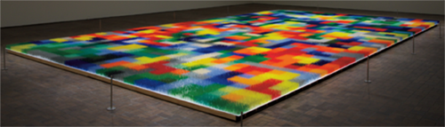   
Fig. 76 Liza Lou, *Color Field* (2010–2013)

Liza Lou is an American artist whose work has increasingly been
recognized and gained respect following the exhibition of *Kitchen*
(1991-1996) at the New Museum of Contemporary Art in New York City, a
work that recreated a modern kitchen with appliances, counters, various
food items and running water in glass beads. Glass beads have since
become her signature artistic form, with work like *Backyard* (1999)
using thirty million of them, but nothing quite reached the point of the
sublime in a manner reminiscent of Abstract Expressionists like Mark
Rothko or Barnett Newman than the 2015 installation of *Color Field* in
the Neuberger Museum, NY. Consisting of eleven beads of glass on all of
576 blades positioned on 1,196 tiles, its approximately 7.5 million
beads are arranged in a color scheme reminiscent of much of the art
we’ve discussed that emphasis a pixelated visual structure; opening and
closing patterns emerge in this site-specific work, but the grid remains
in such a fashion that each tile takes on the approximate appearance of
a pixel as if the entire work is a massively expanded close-up of a
digital image that is no longer available at a resolvable level. Yet,
this isn’t quite correct; as noted in articles,[^book_book_book_book_book_05-Chap5_2] the artist’s
website[^book_book_book_book_book_05-Chap5_3] and the curatorial statement of the Neuberger Museum where
it’s installed,[^book_book_book_book_book_05-Chap5_4] Lou’s work has increasingly shifted such that ‘I
became really interested in seeing what would happen if I took away
subject matter and just had it be about process’.[^book_book_book_book_book_05-Chap5_5] For a number of
years Lou lived part of the time in the KwaZulu-Natal province in South
Africa where she employed a team of local Zulu women to help produce the
work; in this case, and in related work, it is precisely the physical
activity that changes and enhances the material into its final artistic
form.

*Color Field* is most definitely not a work based on digital principles,
even if it appears to be that way. The sublimity of this amazing work is
present in the material of the work itself rather than the design, in
the shared physical activity that’s gone into making the art, in a
manner extending beyond the rough, solitary idiosyncratic independence
of the abstract expressionists to whom the work is indebted at least in
title. So why discuss *Color Field* in the context of the New Aesthetic,
and specifically in the context of teleology? Or, rather, as an object
that can be teleologically assessed? We will turn to this in more detail
in the next chapter but suffice it to say, at this point, that *Color
Field* represents the exact opposite of a conceptualization of an
autonomous, self-sustaining teleology in a very narrow and peculiar
Kantian or biological sense, wherein objects are observed as
self-sufficient and independently existing. Don Garrett provides an
excellent description of what it means to judge or assess an object
teleologically:

> a teleological explanation explains why something is so by indicating
> what its being so is for. Somewhat more precisely, a teleological
> explanation is one that explains a state of affairs by indicating a
> likely or presumptive consequence (causal, logical, or conventional)
> of it that is implicated in the state's origin or etiology. Such
> consequences often, if not always, take the form of ends, goals, or
> goods.[^book_book_book_book_book_05-Chap5_6]

The important thing that we add to Garrett’s description is the sense of
autonomy, of independence, to the object; it’s not just that there’s an
observable set of causal relations but also that those causal relations
are fixed in the single object. To make a teleological judgment about an
object is to see its purpose, and for us to see its purpose contained
within itself without the need for external justification. Precisely
because *Color Field* involved so many studio assistants, at all stages
of its physical development, its dependence on external input means that
it functions as a negative example illustrating the boundaries of the
New Aesthetic objects that appear entirely independent even if they
actually aren’t. *Color Field* occupies a position of liminality, its
digital origins just as clearly evident as its collective construction
methods, that allows us to observe the permeation of the digital into
*Color Field* to gauge how important its presence is, and how important
its negation is sustained through the intense and obvious craft of Lou’s
work.

The boundary between artwork that seems to be New Aesthetic and actually
is New Aesthetic is very thin, and seemingly permeable, but there are
some specific criteria that are involved. Perhaps the most important
criterion is not the fact that the work often is digital but that the
work is driven by the technology itself amidst a postdigital condition.
This has two corollaries. First, the work doesn’t necessarily have to be
digital but at least reflect the digital in its manifestation. Second,
art of the New Aesthetic must be just as much a product of technology,
the digital and/or the postdigital as it is a product of the artist; the
technology involved must be more than an opportunity or inspiration to
make new art but should be a fundamentally generative component
independent from the imaginative capacity and artistic skills of the
artist. Benjamin Grosser, an American artist and composer working in new
media, is an excellent example of this, especially in his series of art
works that are part of the ‘Flexible Pixels’ project. Grosser writes:

> The pixel is the fundamental unit of digital imaging, a square
> representation of a single color. Pixels are always the same size, and
> always arranged in orderly grids. This project \[‘Flexible Pixels’\]
> looks at what happens when you change these universally agreed upon
> standards. More broadly, I’m interested in how the construction of
> digital images alters our perceptions of reality. Does
> computer-mediated vision change how we see without computers?[^book_book_book_book_book_05-Chap5_7]

Grosser’s *Variable Mirror* (2009), {Fig. 77} one of the works that are
part of this series, shows how changes can take place in the standard
relationship between pixel and image, transforming the normative
paradigm that has been in place in the first digital images from the
late 1950s into something that is more organic in nature. 

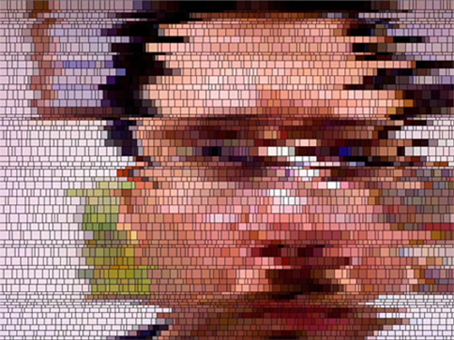   
Fig. 77 Ben Grosser, still image capture from *Variable Mirror* (2009)

The result of
*Variable Mirror*, *Self-Portrait 1x4x9* (2009) – an oil on canvas
representation of the digital art work *Self Portrait (animated)* (2009
– and other works is, as Grosser indicates, that the general nature of
our vision changes once pixels become increasingly independent entities.
Through his art Grosser asserts that the way we see the world is
fundamentally transformed not just when images are pixelated but when
the resulting pixelization assumes a natural presence. This is the
second most important criterion: the art must achieve a degree of
autonomy in appearance and effect. In many ways, this is the perfect
starting point to distinguish between artists whose work resembles New
Aesthetic objects by being products and artists whose work can be seen
as evidence of the presence of the New Aesthetic attitude through a set
of productive strategies. What Grosser is proposing is a deconstruction
of the pixel as a standard structure of digital perception, but because
the pixel remains such a fundamental element the deconstructive process
shifts. Deconstruction is a term that’s been misused and poorly applied
since Derrida’s *Of Grammatology* (1967), so much so that we’re
reluctant to use it, but here it seems appropriate in that the structure
being investigated – the fundamental language of digital visual
representation – begins to turn back on itself and takes apart its sense
of a fixed function; the existence of its idea as an underlying notion
embodied in *Variable Mirror* indicates more than just an ‘unpacking’ of
the pixel, as a fundamental elementary aspect of the visualization of
the digital work, but a relationship of the pixel to itself wherein the
repetition reveals that the role of the pixel is no longer just a part
of the representation but has an active identity. The perception of the
visual presentation of digital information to human experience is
revealed at an even more poignant and insightful level when it breaks
into the real and achieves in its presentation a state that Manovich
refers to as hybridity, where ‘software simulation substitutes a variety
of distinct materials and the tools used to inscribe information (i.e.,
make marks) on these materials with a new hybrid medium defined by a
common data structure’.[^book_book_book_book_book_05-Chap5_8]

*Variable Mirror*, and the other examples of work from the ‘Flexible
Pixels’ project, is an interactive work, during which the pixels used to
represent the viewers as they look at it change dynamically and randomly
but it’s clear that its status as an example of New Aesthetic lies in
the fact that the pixels are *actively* *representing* the viewers
rather than the artist doing the representing. Typically, a viewer’s
reaction to a video presentation of themselves looking at the art would
take place with the assumption that the fundamental units of the
presentation would be fixed; instead, what Grosser’s statement indicates
is an artistic positioning and an exploration that creates a heightened
awareness of the autonomy of the aesthetic agents involved – namely, the
digital object as an autonomously functioning agent in relationship to
the viewer – and the subsequent development of the pixel, at a
fundamental level, as a continuously mediating and deferring referent
that continually challenges any notion of certainty of identity,
position and function. To put it another way, Grosser’s *Variable
Mirror* is a perfect instance of the effect of the New Aesthetic in art,
in that the means of its production are not only an embodied reminder
for the viewer of its digital origins and its continuing digital
manifestation but also a reminder of the underlying uncertainty in the
confrontation with the postdigital that is a growing characteristic of
our world as it is driven by the specifics of its digital existence.

Grosser’s work has developed a strong and variable approach to the New
Aesthetic as an artistic strategy, representing a move beyond a form of
art that participates to one that drives the production of the New
Aesthetic by creating art objects that are fully New Aesthetic in their
autonomy. One thing that’s important to note about Grosser’s career is
that the work he has produced has been remarkably variable; some
instances of it are very traditionally ‘art’ (e.g. his work from the
late 1990s consists of abstract paintings) while other works break the
boundaries of what art is often to the point of potentially, and
erroneously, being labeled simply ‘programming’. We will return to
Grosser’s oeuvre in the next section, but it’s important to note here
that we believe diversity, in all of its myriad connotations, is a key
factor in identifying New Aesthetic art. By this we don’t simply mean a
diversity of forms but a diversity of references, models and paradigms.
In every example of New Aesthetic art that we’ve looked at our first
reaction has ranged from immediate and intuitive understanding of the
intention and the effect to a deep appreciation of the beauty of the
gestures and assertive aesthetic strategies, but all of this has been
coupled with a sense of confusion as to how we are supposed to
categorize New Aesthetic art. It couldn’t be that we should just call it
all ‘New Aesthetic art’ and be done with it, could it? At this stage,
that will have to do, but we also want to emphasize that one primary
element of all New Aesthetic art is diversity in form, function, intent,
interactivity and effect.

Emphasizing that an important part of our consideration of the New
Aesthetic is a recognition of the pervasive influence it has across the
variety of human experience leads to us to look at different forms of
art, which necessitates not only seeing evidence of the New Aesthetic
effects in the visual arts but seeing them across a variety of different
arts that have fallen outside of the scope of typical studies of art
historical investigation. The creative projects of a team of artists
working in dance and theatre, the Adrien M/Claire B Company, directed by
Adrien Mondot and Claire Bardainne in Lyon, France[^book_book_book_book_book_05-Chap5_9], is one of the
best examples of its presence across artistic disciplines. Since 2004,
the company has been producing work that ranges across various artistic
disciplines, but it would be fair to say that there’s always been a
performative, theatrical element driven by a virtual orientation in
software or manifested as installation art. What makes the work of the
Adrien M/Claire B Company interesting in the context of the New
Aesthetic is the direct incorporation of software, designed and
customized specifically for them, facilitating the interaction of the
artists’ activities with animated lighting and the projection of
digitally developed visual textures. Regarding the company’s artistic
intentions:

> They place the human body at the heart of technological and artistic
> challenges and adapt today’s technological tools to create a timeless
> poetry through a visual language based on playing and enjoyment, which
> breeds imagination.[^book_book_book_book_book_05-Chap5_10]

Different examples of their work reflect this exploration of the
conjunction of the human presence and digital constructions in an
imaginative fashion. *Convergence 1.0* (2005)[^book_book_book_book_book_05-Chap5_11] is a notable early
work, in which a juggler uses virtual balls and interacts with
phantasmal figures in ways that seemingly undercut physical laws of time
and space. It is an exploration of the human presence of the performer
while simultaneously being bound, in a suggestive fashion, by the
restriction of the technology. *XYZT, Les paysages abstraits* (2011)
{Fig. 78} already indicates in its title a concern for both a Cartesian
and a relativistic geography, which the artists describe as follows:

> Horizontal X
>
> Vertical Y
>
> Depth Z
>
> Time T
>
> These four letters are used to describe the movements unfolding at one
> point in space to reveal an imaginary territory. It is an exhibition
> landscaped by mathematical paradoxes, typographical illusions and
> metaphors in motion. Strolling through a luxuriant digital space,
> touching algorithms, sensing matter of light; some of the manifold
> imaginary fields are to be explored.
>
> A pathway, as if traversing, revisiting nature; a coincidence between
> geometry and the organic: between real and virtual.[^book_book_book_book_book_05-Chap5_12]

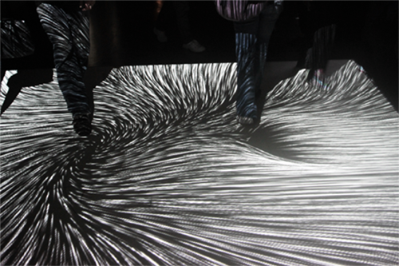   
Fig. 78 Adrien M / Claire B Company,
XYZT, *Les paysages abstraits* (2011)

The very idea of digital space as luxuriant is fascinating, as is the
notion of ‘touching’ algorithms, and through this conceptualization of a
physicality in the digital, the Adrien M/Claire B Company is effectively
presenting a notion of the digital as more than just an appearance of
data fields but as a manifest presence in our world. This is most
effectively realized in two different works: *Hakanaï* (2013) {Fig. 79}
and *Le mouvement de l’air* (2015). {Fig. 80} 

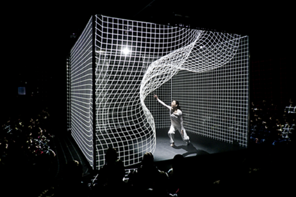   
Fig. 79 Adrien M / Claire B Company,
*Hakanaï* (2013)

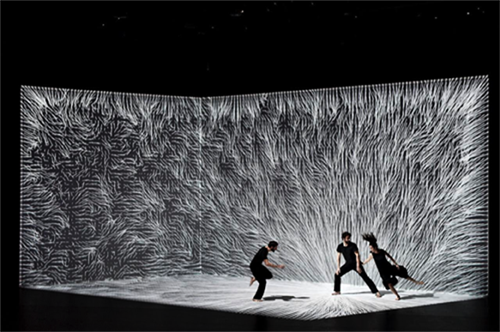   
Fig. 80 Adrien M / Claire B Company, *Le
mouvement de l’air* (2015)

With *Hakanaï*, which
means fleeting, ephemeral or transient in Japanese, the ‘performance’s
outcome is the revelation of a digital installation to its
audience’[^book_book_book_book_book_05-Chap5_13] as the software responds to sounds generated by the
dancer as she moves through the space and responds to imagery digitally
projected around her by the software. In *Le mouvement de l’air*, three
dancers move through an immersive environment of projected images; an
important element of this performance is the physical space which is
shaped responsively by the software. The designers hope this will be
understood as more than just a ‘technical achievement, what matters is
the attempt at creating a motion dreamscape by way of images’.[^book_book_book_book_book_05-Chap5_14] This
sense of digital presence in a cooperative, responsive partnership makes
both *Hakanaï* and *Le mouvement de l’air* particularly strong
candidates as examples of New Aesthetic art. *Hakanaï* is, according to
the artists, a transposition of a term normally associated with
processes in the natural world, but which here reflects the transience
of the interactive experience between the human and the digital as
separate artistic agents. *Le mouvement de l’air* takes this even
further, using aerial dance and other movements in an interactive
fashion that is never rehearsed nor previously animated.

> This “living light” is produced by video projectors and generated in
> real time by a set of algorithms \[…\] It is a mix of control room
> operated human interventions and onstage data sensors that outlines a
> precise writing of motions and generative behaviors. Thus, the images
> are never pre-recorded for a rigid show on an imposed rhythm: on the
> contrary, they breathe and move with the dancers and organize a new
> space for them to explore.[^book_book_book_book_book_05-Chap5_15]

It’s this notion of a ‘living light’ that breaks the company’s
performances out of the normal modes of theater or performance art and
makes them examples of the New Aesthetic. The notion that the light and
images are released freely to function collaboratively with the
performers implies a conceptualization of these effects that originate
and manifest themselves in and through the digital, which could be
disconcerting but isn’t; given the emphasis in theater and performance
art on the human element as the aesthetic agent or vehicle, when the
props become actors then something should seem amiss but it isn’t.
Adrien Mondot’s and Claire Bardainne’s work is beautiful and also
incredibly interesting because it signals a syncretic partnership
between two contrasting elements wherein one, the digital, signals its
increasing independent presence into the human performative components.
Ultimately, the overall effect exhibits many of the characteristics of
New Aesthetic art.

An important characteristic of New Aesthetic art is a level of
interactivity that is decreasingly seamless and increasingly apparent,
contradicting many of the tenets of modernist design. The independence
of the digital objects in the work of the Adrien M/Claire B Company
exemplifies this. Interactivity has long been an important aspect of
digital objects, a paradigm that shifts through different GUIs and
appears in various physical forms often accompanied by a great deal of
debate as to the level of skeuomorphism necessary to insure an efficient
experience. Thinking about the level of interactivity as a part of New
Aesthetic art might seem obvious – the whole point of software design
is, at times, a facilitation of users’ interaction and manipulation of
data, and artists using digital tools have gravitated to interactive art
precisely because the technology encourages it – but something different
takes place when the digital objects become New Aesthetic digital
objects. In terms of an aesthetic evaluation, a duality emerges in
postdigital and New Aesthetic objects, so that what we mean by
interactive isn’t quite the same anymore; rather, for our purposes,
interaction in New Aesthetic art is the seamless integration of digital
activity into the artistic process that occurs while simultaneously
having the digital aspects be autonomously responsive to the artist’s
choices and actions. We’re taking this notion of interaction directly
from Lev Manovich, who writes:

> After the novel, and subsequently cinema, privileged narrative as the
> key form of cultural expression of the modern age, the computer age
> introduces its correlate – the database. Many new media objects do not
> tell stories; they do not have a beginning or end; in fact, they do
> not have any development, thematically, formally, or otherwise that
> would organize their elements into a sequence. Instead, they are
> collections of individual items, with every item possessing the same
> significance as any other.[^book_book_book_book_book_05-Chap5_16]

This is a remarkably interesting thing to state. Manovich is strongly
asserting that interactivity is increasingly unavailable, that most
digital objects are merely means of facilitating access to databases of
information, meaning interfaces, or are predetermined in a standardized
modularity, meaning that they exist not only as interfaces but also as
building blocks, rather than offering genuine forms of interaction with
the objects themselves. Furthermore, Manovich’s implication in
suggesting the primacy of standardized modularity is the basis for his
disavowal of traditional narrative structures that are normally
considered an essential aspect of non-digital, traditional art.
Manovich’s disavowal of narrative is an exclusionary theoretical
strategy favoring an autonomous agency to digital objects that don’t
create experiences but shape data sets. Amidst the increasing efforts of
governments to control their populations through security devices like
facial and pattern recognition, this reduces the participation of
citizens to dehumanized and inactivated information references. Movies
like *Metropolis* (1927) and *Minority Report* (2002) and television
shows like *Person of Interest* (2011-present) may represent a dystopic
vision of computer programs (or human ‘programs’) observing our every
moment, a prospect most people find a frightening invasion of privacy;
far more dehumanizing is the fact that most people are classified as too
uninteresting to warrant any extended attention while they are, still,
continually subjected to this surveillance. Manovich’s art counters this
by mimicking it, trying to make the datafication of our lives in his art
the means to understand and respond to its negative effects in our daily
lives.

## The Individual Politicalization of New Aesthetic Art

A number of New Aesthetic artistic responses explore this situation and
we want to highlight three of them: the work of Adam Harvey, Zach Blas
and the collective Metahaven. Symptomatic of this response to the agency
of interactivity is the work of Adam Harvey.[^book_book_book_book_book_05-Chap5_17] Harvey’s art has
become well known for being at the forefront of the artistic exploration
of security and privacy issues, in particular focusing on the imbalance
and power asymmetries between surveillance technology and basic human
rights. Three recent projects starkly project Harvey’s clear
understanding of the insidiousness of surveillance technology and its
negative effects: *CV Dazzle* (2010),[^book_book_book_book_book_05-Chap5_18] *Stealth Wear* (2013) and the
*Privacy Gift Shop* (2013)[^book_book_book_book_book_05-Chap5_19] that was on display in the New Museum,
New York City, in 2016. *CV Dazzle* {Fig. 81} is our primary focus, as
it’s clear that the other two projects share their origins and concerns
with it; inspired by the camouflage patterns used by British and
American navy ships during WWI that were based on modernist art styles
of geometric patterns,[^book_book_book_book_book_05-Chap5_20] *CV Dazzle* similarly is an effort to
obscure or defeat pattern and facial recognition algorithms used by
security services across many levels of contemporary society from
national government organizations to local shopping malls; moreover it
is a conceptual reaction to OpenCV,[^book_book_book_book_book_05-Chap5_21] an open sourced software used
for facial recognition, and a clear response to the Janus program’s
efforts to utilize social media to improve facial recognition with
algorithmically driven databases.[^book_book_book_book_book_05-Chap5_22] 

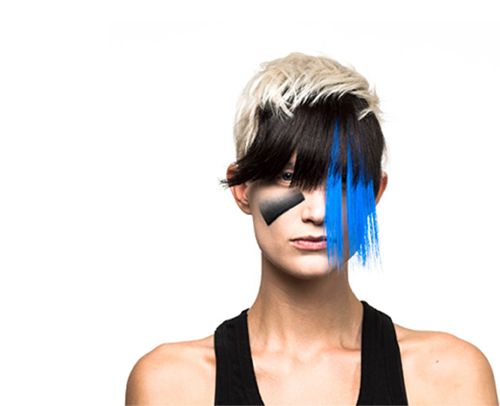   
Fig. 81 Adam Harvey, *CV Dazzle* (2010)

Much of current thought regarding
surveillance is extremely pessimistic, rightly so in regards to most
concerns, with Metahaven recently noting:

> The preemptive electronic surveillance of potentially every global
> subject can be thought of as a way for governments to weaponize
> themselves against the capacity of every person or group in society to
> change spontaneously – expanding the state’s monopoly on violence into
> precognitive policing of all thought and action \[…\] Today, every
> person’s capacity to evade surveillance is determined by their
> position in a feudal matric of technological and institutional
> dependencies. Almost all antidotes to this patronizing system of
> global surveillance go under shades of black.[^book_book_book_book_book_05-Chap5_23]

*CV Dazzle* is one of those exemptions, an almost aggressive artistic
response to governments’ efforts at creating a self-justifying program
of policies and technological tools designed to dismantle individual
privacy. Whereas Metahaven is absolutely correct to describe these
intrusive efforts as the violent weaponization of surveillance – we’re
adding to their description that the process of weaponization itself has
been violent, adding to the violence in an exponential fashion,
something we believe is not out of line with their thinking – *CV
Dazzle* is an effort to weaponize individual appearances in an effort to
oppose governmental incursions into privacy. Utilizing makeup, hair
styling, clothing and accessories in a manner that parallels high
concept fashion, Harvey is addressing the need to avoid not just
detection but constant observation: it’s not so much that the average
citizen needs to camouflage themselves but that the continual
identification, location and tracking of their persons is more than just
intrusive in that it establishes a continual condition of suspicion; we
are being observed not to protect us from threats but because it is
believed any one of us might become a threat. The result, and the
artistic value of *CV Dazzle*, is in the active confrontation that the
user employs against surveillance; by using makeup, hairstyle and
fashion design in a manner that is excessively visible to the ordinary
people the ‘dazzled’ individual now hides in plain sight.

This last point is where *CV Dazzle* enters the realm of the New
Aesthetic as art, as noted in the curious remark in *dis* magazine that
‘CV Dazzle is an unobvious style of camouflage because its eye-catching
patterns and colors draw attention instead of hiding from it’[^book_book_book_book_book_05-Chap5_24] along
with the paraphrased instructions, borrowing from Harvey’s own website,
that enhancing makeup should be avoided, the nosebridge should be
obscured, the area around the eyes needs to appear altered and, perhaps
most importantly, ‘Remain inconspicuous \[…\] For camouflage to
function, it must not be perceived as a mask or disguise. NB: Wearing
masks or disguises can be illegal in some cities, including here in
NYC.’[^book_book_book_book_book_05-Chap5_25] What’s curious about these instructions revolves around the
contrasting characterization of these strategies to both remain
unobvious and to not demand attention, which is almost an impossibility.
To put it another way, it’s clear that there’s a difficult balance
between not being identified and not being noticed, a difficulty that
*CV Dazzle* virtuously fails at and, in a way, it’s precisely at that
point of failure that *CV Dazzle* becomes art. This contrast appears
also in the article ‘Reverse-engineering Artist Busts Face Detection
Tech’ that notes that *CV Dazzle* ‘combines hipster fashion aesthetics
with hardcore reverse engineering of face detection software. The goal:
to give individuals a low-cost and visually stimulating means to prevent
their likenesses from being detected and cataloged by face-recognition
monitors.’[^book_book_book_book_book_05-Chap5_26] *CV Dazzle* is dependent on a heightened awareness of
being observed with a desire or need to avoid being observed precisely
by being almost excessively observable, an attitude based entirely on a
heightened awareness that digital surveillance is far more threatening
than human surveillance. Our focus on this contrast is based on our own
awareness of the conditions that make Harvey’s art possible, equally
evident in the work from the series *Stealth Wear* {Fig. 82} that is
described thus: ‘Collectively, Stealth Wear is a vision for fashion that
addresses the rise of surveillance, the power of those who surveil, and
the growing need to exert control over what we are slowly losing, our
privacy.’[^book_book_book_book_book_05-Chap5_27] 

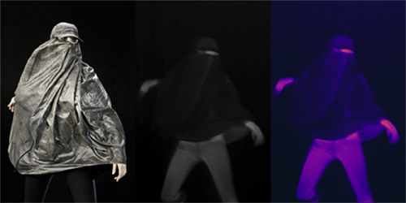   
Fig. 82 Adam Harvey, *Stealth Wear* (2013)

Without the increasingly effective digital technology
driving facial recognition, without the generation of ever larger
databases, there’s no need for *CV Dazzle* and *Stealth Wear*; it is
precisely the conditions they seek to counter that define the validity
of its efforts, but it’s also precisely the impossible success of these
efforts that define their artistic value. As the description of the
Janus program notes: ‘Data volume now becomes an integral part of the
solution instead of an oppressive burden.’[^book_book_book_book_book_05-Chap5_28] It’s as if the volume of
data has taken on a life of its own, self-determinatively driving
initiatives in an autonomous fashion, with *CV Dazzle* reflecting an
unconscious concession on the part of its participants that their
participation is a foregone conclusion. Not only does this drive *CV
Dazzle* and *Stealth Wear* into the category of New Aesthetic art but
because the first is itself merely the product of research that consists
entirely of a set of programmed instructions interfacing with
algorithmically driven surveillance programs, because the second are
‘fashion’ items with a strong political effect, and because both are
sets of non-digital products whose effects are entirely digital because
the need they address is digital makes them almost gloriously and
interdependently substantiated at an artistic level through the
repetition of their own aesthetic conditions. Because the artistic
material’s subversive effect is dependent on its programmed response to
its subject matter, whereby the subject becomes the grounds for the
subversion of the subject, *CV Dazzle* and *Stealth Wear* are two of the
best examples of New Aesthetic art, as is much of the work of Harvey,
because they negotiate the increasingly complex and irresolvable
relationships of the digital and the ordinary. Once the repetition is
there, once the aesthetic programming takes place self-referentially, an
important shift is evident.

In line with Édouard Glissant’s notion of opacity, that focuses on
breaking the divisions between hierarchies in the art world through a
reconsideration of postcolonialism that emphasizes a lack of
transparency against the continual demands of social and cultural
structures to account for oneself, Zach Blas’ work addresses many of the
same issues as Harvey’s. For one, it also addresses the complex issues
of facial recognition as an intrusion into privacy rights, but his
*Facial Weaponization Suite* (2013)[^book_book_book_book_book_05-Chap5_29] {Fig. 83} takes a different and
more intriguing artistic strategy.[^book_book_book_book_book_05-Chap5_30] 

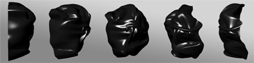   
Fig. 83 Zach Blas, *Facial Weaponization
Suite* (2013)

As noted by Blas, *Facial
Weaponization Suite* was created in part as a response to the New York
City Police Department’s invocation of the 1845 law banning two or more
people congregating together while wearing masks during the 2011 Occupy
Wall Street movement; not only did the NYPD arrest protestors for
wearing Guy Fawkes masks, they then subjected them to iris scans for
inclusion in a database of offenders as a condition of bail or release.
Blas asks:

> Why does the masked protestor pose such a great threat to the state,
> resulting in the police’s willingness to deploy a 168-year-old law
> originally designed to prevent Hudson Valley tenant farmers from
> dressing in disguise and rioting over debt and eviction? Why does
> facelessness fuel the state of New York to surreptitiously construct
> incentives for protestors to willingly agree to biometric scans?[^book_book_book_book_book_05-Chap5_31]

The answer to that question seems obvious – there isn’t much difference
between the aims of 19th century rioters and the Wall Street protestors,
especially as both of them had very legitimate grievances and aims – but
Blas’ inquiry after the value of facelessness is itself very
interesting. Protestors’ identities are clearly valued by those trying
to control the apparatus of social structures. {Fig. 84} 

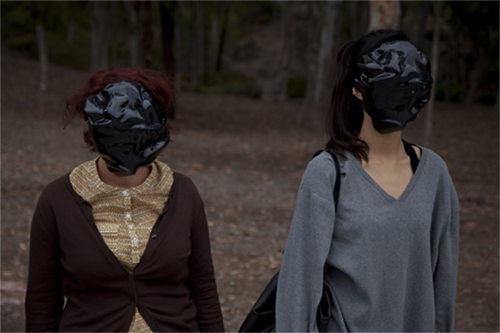   
Fig. 84 Zach Blas, *Facial Weaponization
Suite* (2013), ‘Protest Line / Face Off’
Tableau Vivant

For Blas ‘the
face becomes a site of ever increasing control and governance’ and his
*Facial Weaponization Suite* is specifically a means of arming
individuals against those efforts at control in a manner similar to
Berry’s articulation of ‘obfuscated code’[^book_book_book_book_book_05-Chap5_32] resulting in ‘data
exhaustion’.[^book_book_book_book_book_05-Chap5_33] At the same time, *Facial Weaponization Suite* is more
than just an experiment but is an elegantly aggressive artistic response
to a crucial issue of our contemporary world, like Hito Steyerl notes:

> While a lot of contemporary technologically oriented art tries to
> resuscitate the wreckage of Futurism, or overidentifies with
> strategies of surgical marketing and apple polishing, Blas’s work
> insists that one doesn’t need to brand oneself into voluntary
> servitude or to eagerly identify with the aggressor. It may well
> suffice to fuck him. Or her. Or it. It’s such a reasonable idea and
> possibly much more fun too! Fuck military technology. Fuck
> infrastructure. Fuck drones. Fuck protocol ‘til it hums with pleasure.
> Throw in glitter and some shiny sensors. And after a few million
> years, there might be a smashing progeny![^book_book_book_book_book_05-Chap5_34]

In response to Shoshana Amielle Magnet’s argument that biometric
recognition is a failure because human identity cannot be reduced to a
data set, and working through Agamben’s idea of exposure vis-à-vis
Levinas, the *Facial Weaponization Suite* is a set of masks made in
community workshops that deny facial recognition software
algorithmically applicable data. While functioning as masks, the objects
of the *Suite* ‘are weapons of defacement, modes of escaping the
recognition-control of the face, a queer illegibility that disallows
easy calculations and categorizations of the face’.[^book_book_book_book_book_05-Chap5_35] This makes them
dramatically different from Harvey’s work (though both are equivalent
aesthetically, in our opinion), not simply because Blas’ work consists
of actual objects rather than aesthetic strategies of concealment but
also because their overt nature as objects is a demonstrative and
declamatory response to the intrusion into privacy; driven by communal
production methods that incorporate discussion of the related issues,
participants are scanned by a Kinect and a single mask is generated in a
non-averaged manner of all of the participants, making the communal
statement even more substantial because it is heightened by a public
intervention. Where the New Aesthetic comes into the work isn’t simply
at the level of the object’s production or its motivation but, similar
to Harvey, out of the necessary conditions of the increasingly
digitalized nature of the world and our place in it. While Harvey’s work
might be unfairly construed as a fashion statement of sorts, and is
complicit with the conditions its protesting to a degree, Blas’ *Suite*
is about the creation of art as weapons with a singularity to their
appearance that is unmistakably one of denying the value of
identification even to the point of denying social reciprocity through
defacement. As Blas names them: ‘interfaces in other modalities that are
not readable to those that aim to control but rather communicates to all
those that strive to liberate’.[^book_book_book_book_book_05-Chap5_36] In short, Blas’ *Suite* is an
artistic acknowledgement, through rejection, of the existence of the New
Aesthetic as a pervasive influence in our lives; it is a rejection of
digital modalities as agents that had found their conceptual reification
already in the NYPD’s valuation of the protestors’ identities, a
condition which most certainly did not originate in the human agents of
the police but out of its ever changing nature as an institution.

## The Collective Politicalization of New Aesthetic Art

In a way with which we completely agree, the collective Metahaven[^book_book_book_book_book_05-Chap5_37]
has been described as ‘one of the most theoretically informed,
strategically adept and articulate groups of thinkers operating in
graphic design’.[^book_book_book_book_book_05-Chap5_38] As noted by Sarah Hromack in *Frieze* magazine,
Metahaven’s work can be identified as a response to the specific
conditions generated by the introduction of web 2.0 around the turn of
the millennium, and it’s worthwhile summarizing her position. For
Hromack, a major shift starting taking place in the internet in the
1990s – described in two important essays: Michael Rock’s 1996 ‘The
Designer as Author’[^book_book_book_book_book_05-Chap5_39] and Ellen Lupton’s 1998 ‘The Designer as
Producer’[^book_book_book_book_book_05-Chap5_40] and related to Walter Benjamins’ 1934 essay ‘The Author
is Producer’ – that signals not only an increasing level of
interactivity through the internet as a medium but also an increasingly
fraught level of a politicized driven denial of the central and
authoritative voice of the author. Hromack writes:

> The fallout from Web 2.0 has been nothing short of astounding. The
> internet that once seemed open and free has been transformed into a
> dystopia of double meanings and commercial and political dealings.
> Ingrained psychological dependencies have developed out of brightly
> blinking “user friendly” experiences, monitored by businesses and
> government agencies.[^book_book_book_book_book_05-Chap5_41]

She traces this fallout as a direct catalyst for the formation of
Metahaven. Metahaven has been described insufficiently as an
international collective of graphic designers, and it might be more
accurate to describe them as a group of artists whose work draws from
the changing graphic nature of the world in a way that is disruptive and
disconcerting, but at its roots it consists of the Amsterdam based
artists Vinca Kruk and Daniel van der Velden. Their largest publication
to date was *Uncorporate Identity* (2006), a monumental treatment of the
relationships between databases, national identity, networks as social
objects driving social norms, branding and the very idea of readability
about which one Amazon customer wrote:

> it is a very bizarre book.\
> \
> The typography is okay, the printing and binding is good \[…\] but the
> design is shockingly awful: there are weird effects that you shouldn’t
> use if you want to communicate trustworthiness and confidence such as
> amateur effects like drop shadows, hyperactive gradients and also
> seems to be on trend with this “exposed content style” – I would go so
> far to say it looks like very bad 90s Flash websites with all these
> superfluous elements that generate a feeling of schizophrenia and
> anxiety almost. I read the texts but they don’t really offer any
> practical advice or useful analysis about branding and corporate
> identity useful to a branding designer – for example how to deal with
> the internet and social media, what good form and harmony in
> application is and so on.[^book_book_book_book_book_05-Chap5_42]

In a way, this review is absolutely telling: the book is bizarre, it
does break many of the assumed rules of good design, it eschews
trustworthiness and reeks of a bad use of Flash in printed form, and
ultimately drives a sense of distrust into a dialogue focused on
branding and corporate identity.

Metahaven’s aesthetic impulses are driven by a striking awareness of
artists’ complicity in the increasingly overwhelming nature of the
digital in the world, and are neatly encapsulated in a statement from
the trailer for their film project *The Sprawl* (2015): {Fig. 85} ‘We
were very likely spreading fictitious information ourselves, but
couldn’t help it.’[^book_book_book_book_book_05-Chap5_43]
 
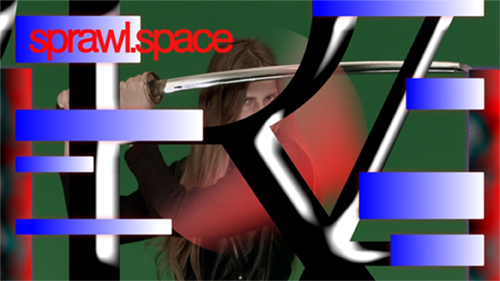   
Fig. 85 Metahaven, *The Sprawl* (2015)

Metahaven’s work takes exception with the
internet’s general status as a neutral medium by challenging our
complicity with it. For most users, the internet has not become a medium
by which we interact with others nor a generative new field of social
discourse but instead has simply become a utility, with the consequences
being that we unthinkingly, uncritically accept the parameters of its
usage because we’ve become habituated and conditioned to its
manipulations. For Metahaven, this situation needs to be transformed,
and the best means of doing so is through the use of methods that borrow
from the internet’s own means of manipulation, with the aim ‘to explore
how fantasy and propaganda have now gained prominence over transparency
and accountability \[…\] The relationship between social media and
geopolitics is not just about liberal democracy anymore but about the
fashion of spectral totalitarianism.’[^book_book_book_book_book_05-Chap5_44] Through a changing membership
and a constant shift in the forms of production, the group has taken on
ephemera-like visual objects of corporate identity, webpage design, GUI
forms, barcodes and URL addresses in a manner which appears
directionless at first but, on further examination, quickly is
understood as an attenuation to nationalist digital iconographies and
their inherent conflict with multinational and even hypernational ones
(by which we corporate entities that have assumed the status of
international sovereign entities). Metahaven gives more than a simple
aesthetic response but rather creates an active aesthetic running
counter to prevailing tendencies, distinguished by its incorporation of
corporate representational forms that appears to be sustained by the
visual link to those corporations while questioning the underlying
persuasiveness of the neutrality of those same entities amidst the
supposed ‘equality’ available to all entities in the capitalist system.
In a manner similar to the Neue Slowenische Kunst group’s appropriation
of National Socialist imagery that was mixed with propaganda from the
Tito era of Yugoslavia, Metahaven has produced objects whose use-value
is both questionable and secure in a self-contradictory dialectic; the
scarves and t-shirts sold as part of the *Dark Store* (2012)
installation in the Artists Space at the Berlin Contemporary Art Fair
were both collectable luxury items and being covered in camouflage and
the Wikileaks logo were simultaneously protests against government
privacy intrusions.[^book_book_book_book_book_05-Chap5_45] Metahaven’s recent book *Black Transparency:
The Right to Know in the Age of Mass Surveillance *(Sternberg Press,
2015) raises similar issues while equally being a confounding text that
is far from a traditional book but that functions as a reading
experience while at the same time serving as a manual to counter the
effects of the digital age. One review captures its intense
contradictory effect, a governing feature of Metahaven’s aesthetic
strategies:

> Part essay, part zine, the Amsterdam-based design studio’s book
> focuses on the “how” as opposed to the “what” of transparency, zeroing
> in on the paradox that the fight for accessible knowledge (by groups
> such as WikiLeaks) is often carried out through necessarily opaque and
> propagandistic means. *Black Transparency* swallows its own tail in
> pursuit of its subject, following the un-coiling and re-coiling of
> ideology and information at the hands of whistleblowers and
> organizations.[^book_book_book_book_book_05-Chap5_46]

It’s as if Metahaven is proposing that the only effective counter to the
complete erosion of our private lives, our individuality and the means
of our own self-determinativeness is to set up a reified antithesis in
the Hegelian sense, opposing the dominance of the digital world as a
thesis. In line with Marshall McLuhan’s idea of a ‘counter-environment’
in his 1967 essay ‘The Invisible Environment: The Future of an
Erosion’,[^book_book_book_book_book_05-Chap5_47] Metahaven’s *Facestate* (2011) is a complicated
installation at the Walker Art Center consisting of various objects
apparently produced as examples of graphic design in line with the
corporate identity of Facebook but clearly opposed to its aims. ‘We are
interested in the ways in which Facebook and government, Facebook and
employers, Facebook and friends, Facebook and enemies constitute a power
arrangement, and the way in which this constellation might influence
politics, currency, and the social contract.’[^book_book_book_book_book_05-Chap5_48]

Metahaven’s concerns for the totalitarian effect of increasingly
autonomous digital objects of control is shared worldwide, though most
often only in a nascent form in comparison to their sophisticated
approach on a multiplicity of levels, and their targeting of Facebook is
emblematic of the concerns of many other artists. It’s been pointed out
that their work ‘questions the purpose and value of design in a neurotic
and treacherous era of geopolitical instability, economic recession,
environmental crisis, cultural and moral confusion’[^book_book_book_book_book_05-Chap5_49] but just as
importantly their work questions the value of our existence as end
users, bringing up the notion that we are nothing but components of the
technology that give it a functioning life rather than individuals able
to utilize our digital devices freely to our own ends; responding to
this art leads to the inevitable conclusion that we don’t constitute the
network of power but are merely components of the network’s power.
Metahaven’s strategy of countering corporate propaganda with
appropriated propaganda seems as effective as any other strategy these
days, but is it capable of being effective outside of a ‘westernized’
context? What happens when the invasion of the digital is so rapid, when
changes in technology are so swift, as they have been in developing
countries of the ‘non-western’ world that no response is even possible
because the territories have already been claimed and secured? Typing in
‘non-western new aesthetics’ gets you zero relevant results on Google,
but anyone who has travelled to Africa, South America, India and
‘less-developed’ parts of Asia has experienced the widespread impact of
internet culture. Perhaps more so than in the westernized social and
cultural structures, where the increasing inclusion of the digital has
been relatively gradual, the effect of the internet and its subsequent
disappearance into the portals of smartphone apps as a means of
navigating, defining and shaping human experience has been remarkably
profound; whereas many in the developed world experienced the shift from
dial-up modems (and the joy of moving from 14.4k to 56k!) to dedicated
ISPs through cable, most people in the developing world have experienced
the digital transformation through smartphone simply because it was more
economical to build centralized cell phone towers than to try and
implement land lines to every home. When digital content is provided
exclusively through smartphone apps, with the individualized specificity
of that experience governing the use-experience, then the shift from a
non-digitized world to a digitized world is even more abrupt. This has
resulted in some interesting effects. Very recently the Telecom
Regulatory Authority of India forbid zero-rating mobile internet plans
because they violated net-neutrality,[^book_book_book_book_book_05-Chap5_50] thereby denying Mark
Zuckerberg’s plan to provide free internet through mobile phones across
India through a Facebook portal called ‘Free Basics’, after having
prompted protests[^book_book_book_book_book_05-Chap5_51] and an organized campaign.[^book_book_book_book_book_05-Chap5_52] What’s strange,
however, is that the debate isn’t quite settled; while many in India and
elsewhere oppose Zuckerberg’s plan because it violates net neutrality,
the very idea of net neutrality may no longer exist in part because the
internet no longer exists. The notion that ‘smart villages’ would be a
means of relieving the burden of crowded urban centers seems fanciful at
best, as does the notion that ‘increased’ access to information will
invariably lead to improvements in people’s lives regardless of whether
or not this information is filtered through portals like Facebook or
Google. Digital organisms, institutions, or functional objects (however
you want to identify them) have shifted from being automatons within the
internet to autonomous agents defining the internet.

This position is evidently symptomatic of the effect of the New
Aesthetic across a broader range of cultures. The majority of artists
discussed in this book are European, American or Japanese, presumably
because the work by these artists is more readily accessible through the
internet and art exhibitions in major Western cities where funding and a
critical mass of technological means makes it easy. But what’s happening
in the rest of the world? Is the New Aesthetic a phenomenon or an
attitude that is confined to a Western setting? Even the briefest of
consideration of these questions would correct the tendencies to be
absorbed with just one location, and a recent article in *The Guardian*
sent us looking at African art and the presence of the New Aesthetic in
a politicized social context.[^book_book_book_book_book_05-Chap5_53] A prime instance of this is Urban
FabLab’s project African Fabbers,[^book_book_book_book_book_05-Chap5_54] an effort to bring together
European and African maker communities with an emphasis on open source
software and alternative approaches to 3D printing. Run in two sessions
– in Marrakesh (2014) and Dakar (2014), both associated with art fair
events in those cities – its aim was to create ‘an opportunity to
creative clusters from different continents and backgrounds to meet up
and share knowledge, to investigate the interaction between African
material systems and computer aided manufacturing technologies, to
create ecological prototypes through an advanced craftsmanship approach
for sustainable living’.[^book_book_book_book_book_05-Chap5_55] Two interesting elements of the African
Fabbers projects are noteworthy: first, there’s an emphasis on the
collaboration between levels of technology, with the implication being
that older forms must necessarily be paired with newer, digital forms
for their continued survival; second, such a collaboration itself
necessitates an inherent valuation of advanced technology and its
associated cultural forms or, to put it another way, despite the best of
intentions this is still a form of cultural colonialism driven by
technology. The Venn diagram on the main page for African Fabbers shows
it as the intersection between local technologies, digital fabrication
and computation design but the imbalance is plainly evident. How to
counter this? The Afropixel[^book_book_book_book_book_05-Chap5_56] festival at Ker Thiossäne, Dakar
certainly represents one effort. Begun in different forms in 2002, with
the first official Afropixel event taking place in 2008, it’s based on
the idea that ‘Technology doesn’t prevent tradition from existing, it’s
the encounter between the two that is interesting’[^book_book_book_book_book_05-Chap5_57] but at the same
time it exhibits all of the hallmarks of New Aesthetic art with
assertions like ‘Any designer will tell you that a pixel is the smallest
element of a picture; a dot on a page. On its own, a pixel doesn’t give
much away. But when it joins other pixels it forms a whole, contributes
to a mass, and gives meaning to whatever it is it represents’[^book_book_book_book_book_05-Chap5_58] on
the website of its sponsor Moleskine, who provided all of the
participants with Evernote ready notebooks in 2014.

It’s clear that a collective response is occurring in a New Aesthetic
context, but individual artists are also working in a similar fashion.
Folasade Adeoso has become well known both as a model from Nigeria and
as an artist in her own right; her digital work consists of juxtaposed
images that are often haunting, nostalgic, and jarring in their contrast
between references to an older way of life and to digital artifacts.
Especially in her series ‘Kinfolk’ (2014) {Fig. 86} there is an
indication of Adeoso articulating a sensibility informed by technology,
utilizing it for aesthetic purposes, aware of the temptations for its
overuse, but deeply resistant to its intrusive and pervasive influences.

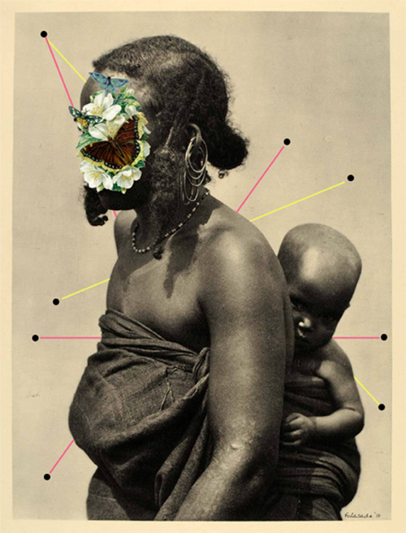   
Fig. 86 Folasade Adeoso, *Motherhood*,
from the series *Kinfolk* (2014)

Alexander Ikhide’s work functions in a similar manner as Adeoso’s but is
more informed by an urban sensibility; originally from Nigeria and now
working in London, Ikhide’s collages mix the old and the new but in a
way that’s strikingly more contemporary, evidenced especially in his
collaboration with the photographer Seye Isikalu on the project *Don’t
Police My Masculinity* (2015)[^book_book_book_book_book_05-Chap5_59] that incorporates the beautiful
phrase ‘Love Yourself As Much As Kanye Loves Kanye’ by asserting: ‘In a
world where Hyper-masculinity is unfailingly sold to us on a daily
basis, “Don’t Police My Masculinity” playfully explores ideas of
self-love, self-acceptance & general care-freeness of the Black Male in
particular. Happy valentine’s day people! love yourselves first!’[^book_book_book_book_book_05-Chap5_60]
{Fig. 87}

   
Fig. 87 Alexander Ikhide, *Love Yourself as
Much as Kanye Loves Kanye*, (2015)

## Sociological Interactionist Impacts of New Aesthetic Art

The German artist Aram Bartholl[^book_book_book_book_book_05-Chap5_61] has been one of the major figures
to emerge within the context of the New Aesthetic. Educated at the
Berlin University of the Arts with an engineering degree in
architecture, Bartholl first came to notice with his project *Bits on
Location* (2001)[^book_book_book_book_book_05-Chap5_62] which investigated the possibilities involved in
the spatial repositioning of information sources, by attempting ‘to
connect, through a series of examples, the digital content from
locationless global data networks to physical space’[^book_book_book_book_book_05-Chap5_63] and signaling
a primary concern Bartholl’s work has had ever since; much of his work
exaggerates the tensions that exist between specified and despecified
localization and articulates the continuous functions of contrasts and
overlays between digital realities and the normal world. Two projects
have introduced Bartholl’s work into the broader art world: *Maps*
(2006-10)[^book_book_book_book_book_05-Chap5_64] and *Dead Drops* (2010-12).[^book_book_book_book_book_05-Chap5_65] *Maps* {Fig. 88} has
been a series of large scale sculptural reproductions of Google map pins
used in a digital context to mark out highlighted locations and search
results; Bartholl has created a series of life-sized versions of these
pins to call into question the relationship between the real and the
digital world with a clear assertion that this relationship is
increasingly mutually dependent. 

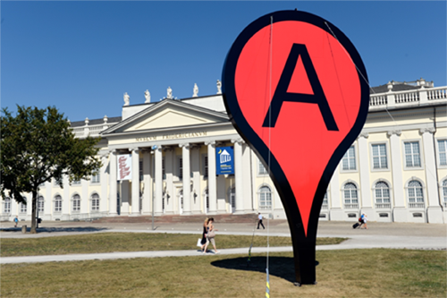   
Fig. 88 Aram Bartholl, *Map* (2013) 

The Google Maps pin, designed by Jens
Eilstrup Rasmussen in 2005 as an integral part of the launch of Google
Maps, has become so ubiquitous that it was acquired in physical form by
MOMA in 2014; in Bartholl’s use, {Fig. 89} it’s become a sculptural
intersection that highlights the complicated overlapping relationship of
the way the world is represented with what is represented. 

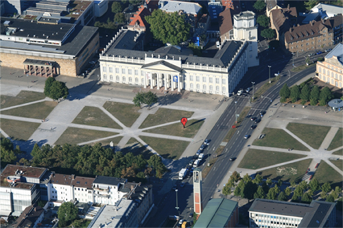   
Fig. 89 Aram Bartholl, *Map* (2013)

While
‘Google’s maps have revolutionized how we interact with the world, how
we perceive space and even how we navigate through it’[^book_book_book_book_book_05-Chap5_66] Bartholl’s
work questions the revolution itself by reversing the supposed
continuousness of the relationship between the pin and the actual
location, causing a heightened sense of a discontinuous relationship
between the Google map pin and Bartholl’s pin. *Dead Drops* {Fig. 90}
has taken this even further, as described by Bartholl:

> “Dead Drops” is an anonymous, offline, peer to peer file-sharing
> network in public space. USB flash drives are embedded into walls,
> buildings and curbs accessible to anybody in public space. Everyone is
> invited to drop or find files on a dead drop. Plug your laptop to a
> wall, house or pole to share your favorite files and data. Each dead
> drop is installed empty except a readme.txt file explaining the
> project. “Dead Drops” is open to participation. If you want to install
> a dead drop in your city/neighborhood follow the “how to” instructions
> and submit the location and pictures.[^book_book_book_book_book_05-Chap5_67]

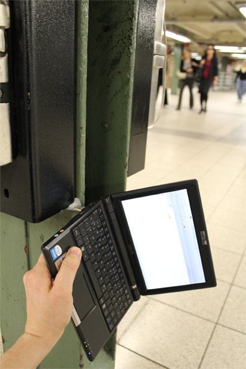   
Fig. 90 Aram Bartholl, *Dead Drops* (2010)

Whereas *Maps* is an intervention, *Dead Drops* is a much more
participatory art project that Bartholl has allowed to be copied, pasted
and hacked worldwide, both metaphorically and literally, so that the
idea itself has taken on a life similar to many instances of conceptual
art from the 1960s which eschewed object production and commodification.
Creating a peer-to-peer network that is more physical rather than
virtual, like in the form of bittorrents, *Dead Drops* have served not
only as locations to download files from but also to upload to because
the USB drives are always public; borrowing a term from an information
sharing method used by spies, Bartholl’s project has become a set of
sites that are either remarkably banal or dangerous, as in the case of
one Cologne instance where plans for bombs were discovered on the USB
drive,[^book_book_book_book_book_05-Chap5_68] but their artistic intent is still clear. More than just
creating a community, though it has certainly done that with thousands
of dead drops appearing worldwide, it embodies an artistic opportunity
to share and communicate information, ‘a unique space for uncensored
public conversation into the physical structure of the city’[^book_book_book_book_book_05-Chap5_69]
counter to any digital network’s reach.

Bartholl’s career has consistently been an exploration of the way the
real and the digital overlap, even when its use of spontaneity has
verged on an almost ridiculous level of fandom and opportunism. In 2009,
while having coffee, Bartholl spied a Google Streetview car driving
outside and proceeded to chase it down the street; almost a year later
he appeared in a series of images on Google Streetview, which were
subsequently appropriated as *15 Seconds of Fame* (2010).[^book_book_book_book_book_05-Chap5_70] {Fig. 91}

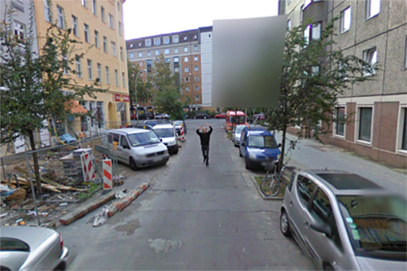   
Fig. 91 Aram Bartholl, *15 Seconds of Fame*
(2009–2010)

Creating a further level of critical depth to his work, Bartholl’s *Full
Screen* (2014)[^book_book_book_book_book_05-Chap5_71] {Fig. 92} was a curated project with a number of
well-known artists contributing works that were displayed on Samsung
Galaxy Gear smartwatches. 

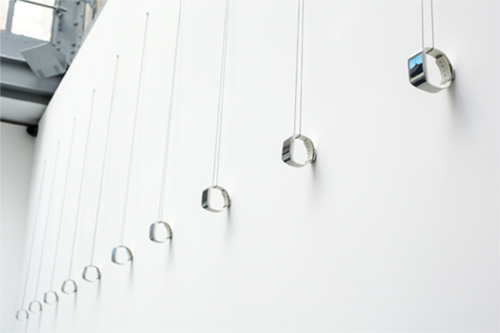   
Fig. 92 Aram Bartholl, *Full Screen* (2014)

Viewers were invited to wear the art and
interact with it in a limited fashion, driving the questions that
Bartholl has been examining in his art even further. In an interview
Bartholl asks ‘The underlying question is, in what ways we can represent
digital art?’[^book_book_book_book_book_05-Chap5_72] and his answer is a direct rejection of the
continuing relevance of the screen as a medium. It’s not just that over
the course of the last fifty years the digital world has shrunk to the
size of a watch and the interface has transitioned from room-sized
objects with tiny monitors whose only representation of data consists of
low resolutions text; the physical manifestation of the objects has
changed and with it our conception of what data and its provider the
‘internet’ is. This providing has shifted in space and time; in more
ways than just by making data available no matter where the user is, new
devices (themselves quickly outdated in terms of technological
capability) make the consumption of data literally timeless and
spaceless, disconnected from the physical realm, and especially
ironically so when in the form of wristwatches. While acknowledging that
screens will continue to exist for a long time, often in a nostalgic
capacity, and emphasizing that point with the reduplication of imagery
from small screens to a huge LED screen, nevertheless Bartholl points
out that ‘There will be screens where you don’t have the rectangle
anymore. It’s hard to tell, and it’s going to take quite a while, but
the next paradigm shift is going to happen soon.’[^book_book_book_book_book_05-Chap5_73] We are so used to
the idea of ‘seeing’ the internet through screens, but once haptic
interfaces, voice commands and gestural forms of interaction were
introduced the point of contact shifts from a specific referential
interface to a decentered form of interaction that is positionless
precisely because of its fluid nature. This move away from screens as a
mediating but limited form of interactive structure is something that
appears in an even stronger sense as an aesthetic strategy in the work
of Hito Steyerl.

In many respects, the artwork produced by Hito Steyerl is one of the
best examples of art of the New Aesthetic. In fact, Hito Steyerl as both
an artist and an art critic has been a driving force behind many of the
ideas and work of the New Aesthetic, setting the parameters of different
aesthetic strategies as well as identifying work by other artists. Born
in Munich in 1966, trained in philosophy at the Academy of Fine Arts,
Vienna and later studying at the Japan Institute of the Moving Image and
University of Television and Film Munich, she has exhibited widely at
documenta 12, the Venice Biennale, and the Istanbul, Taipei and Shanghai
Biennials, and has had numerous solo exhibitions at major museums
worldwide and teaches New Media Art at University of the Arts in Berlin.
Steyerl’s work is complicated, appearing in cinematic form, essays and
books, art installations and digital objects, but we believe it’s
appropriate to focus on two intersecting threads that drive her work.
First, Steyerl maintains a refusal to disavow herself as the artist from
her productions, especially in the case of films that are more
documentary in nature, because she believes in the importance of the
personal presence of the artist conveyed ‘by the idea that you cannot
address a social issue productively without first understanding your own
part in it \[…\] \[and she is\] wary of sentimentality and false
objectivity, she acknowledges herself as part of the picture, eager “to
make my position transparent” and truthfully complex’.[^book_book_book_book_book_05-Chap5_74] Second,
Steyerl is intensely interested in the increasingly interdependent and
interwoven nature of social media, social, political and culture
changes, the increasingly uncontrollable nature of the virtual exchange
of information, and a commitment to the freedom of images to have
meaning regardless of any users’ intentions including, perhaps
especially, her own. If these two threads seem contradictory then
Steyerl’s aesthetic strategies are successful, for it’s precisely in the
complex contradictions that the best of her work has its greatest
effect. While much of Steyerl’s ideas have appeared in her essays and
books, her art is a complex and highly effective embodiment of her
exploration of the new and independently forming digital paradigms
confronting the human condition. A major exhibition of her three films
by *e-flux* in 2012 encapsulates Steyerl’s work well: *Adorno’s Grey*
(2012), {Fig. 93} documenting efforts to ‘discover’ the near
mythological layer of grey paint Adorno required for his lecterns so as
to avoid distraction, while voiceovers tell the story of Adorno’s last
lecture interrupted by bare-breasted female students; *Abstract* (2012),
{Fig. 94} exploring through video a complex interlacing of violence and
warfare, circling around the death of Steyerl’s friend Andrea Wolf who
had been killed in Kurdistan as a revolutionary fighter in the PKK
(Kurdistan Workers’ Party); and *Guards* (2012), {Fig. 95} using
interviews with art museums guards to show how they’ve been trained in
military tactics to secure the collections their attending to.[^book_book_book_book_book_05-Chap5_75]

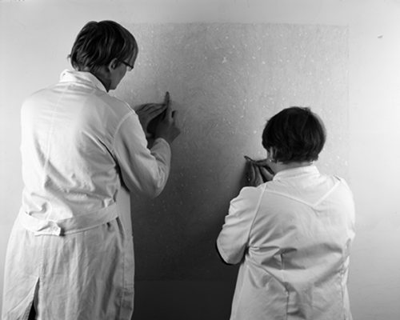   
Fig. 93 Hito Steyerl, *Adorno’s Grey* (2012)

   
Fig. 94 Hito Steyerl, *Abstract* (2012)

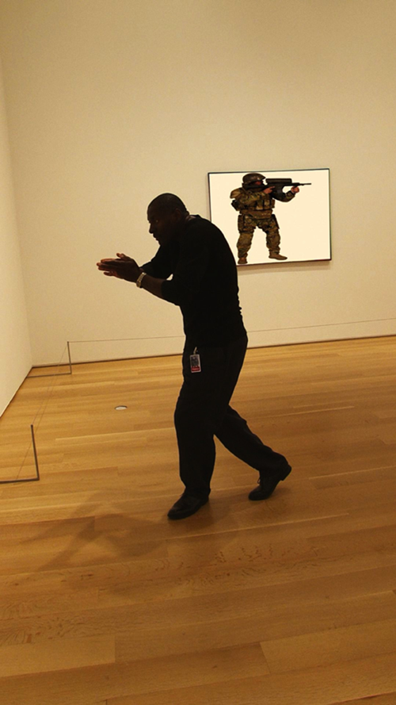   
Fig. 95 Hito Steyerl, *Guards* (2012)

As
different as they are, each film is rooted in different aspects of
Steyerl’s life – her philosophical background, her friendships, and her
life as an artist – making them at least indirectly personal while at
the same time fully structured within the language of video, documentary
and cinema. In many respects this work is similar to the work of
Metahaven, with a sense of complicity in the evidence of digital
interaction. While these films at first don’t seem to distinguish
Steyerl’s work from that of other filmmakers or as cinema per se, in
that her roots in New German Cinema and the influence of film historian
Helmut Färber are both clear and documented in interviews, each film is
so highly attenuated to its medium and the specific stylizations
necessary of the different subject matters, in a way that marks all of
Steyerl’s art as important explorations into the changing nature of the
digital and our interaction with the digital, that her work is radically
different from that of her predecessors. The title of the first chapter
of Steyerl’s book *Die Farbe der Wahrheit (The Colour of Truth)* (2008)
is ‘Documentary Uncertainty’, an indication that regardless of the
appropriateness of the medium Steyerl is always aware of how it can both
undermine and betray her efforts, almost as if her films are an
embodiment of Jacques Derrida’s notion of deconstruction. Taking
together, all three films represent Steyerl’s efforts to trace the
intersection of politics and aesthetics in a manner that dissects the
force of images as potentially acting counter to artistic intention not
only in regards to the communication of information but to the very
notion of completeness. This is particularly true of *Adorno’s Grey*,
about which one critic writes:

> After the credits, the projected image drops out while the projector
> lamp is left to burn for a short while. In this white, messianic
> light, it is now possible to see that each of the screen’s
> collectively canted planes is painted in a different tone of grey
> respectively. Although the conservators never found the missing grey
> layer in Frankfurt, this final revelation of Steyerl’s filmic
> apparatus presents the missing culprits, which tainted the depiction
> of the represented wall. With this cheap, yet effective trick, the
> artist seems to be trumping yet another fragmentation of the recorded
> actions. And still, this final “proof” of an image contaminated lays
> bare not only the fact that cinema is itself composed of necessary
> illusions, but that these sensuous special effects can hold and
> distract our attentive gazes from actually seeing.[^book_book_book_book_book_05-Chap5_76]

It’s that last point that’s so crucial: the fragmentation of recorded
actions, the inherently deceptive but powerful nature of images that can
fully reveal their nature as an illusion while at the same time still
functioning as a deception, are presented in an intense fashion to the
point that we no longer see them but accept them as self-evident and
seemingly autonomous effects. Other films by Steyerl achieve much the
same effect, such as *Lovely Andrea* (2007) and *In Free Fall* (2013),
all revolving around (to borrow a phrase from *Lovely Andrea*) ‘filmic
tension’ constructed similarly to Adorno’s conflict between praxis and
theory that is evidence is his statement that ‘The unresolved
antagonisms of reality reappear in art in the guise of immanent problems
of artistic form. This, and not the deliberate injection of objective
moments or social content, defines art’s relations to society. The
aesthetic tensions manifesting themselves in works of art express the
essence of reality in and through their emancipation from the factual
façade of exteriority.’[^book_book_book_book_book_05-Chap5_77] The only difference in this case is that
the immanence of the digital as autonomous phenomenon has replaced the
artistic in its common form with an accelerated form of an emancipation
of digital, not just escaping the restrictions of artistic creativity
but redefining its very essence as independent.

In the context of the New Aesthetic certain works stand out. Steyerl’s
*How Not to Be Seen: A Fucking Didactic Educational .MOV File* (2013)
{Fig. 96} is a satirical instructional film (with part of the title
borrowed from a Monty Python sketch) purporting to show ways to avoid or
confuse surveillance software by remaining ‘unseen’ in a manner similar
to the art of Adam Harvey and paralleling the concerns of Metahaven.

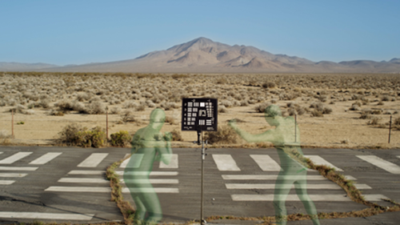   
Fig. 96 Hito Steyerl, *How Not to Be Seen:
A Fucking Didactic Educational .MOV File*
(2013)

Shot at a desert site that was covered with photo calibration targets
backed by computer generated and imposed images of different landscapes,
with ghostly figures dressed in green that appear and disappear, the
film instructs viewers that there are four ways to avoid detection –
hiding in plain sight, shrinking to a size smaller than a pixel, living
in a gated community and being female and older than 50 – and implies a
clear set of motivations. Leora Morinis very astutely points out:

> Despite the ostensible neutrality of the how-to format, the title also
> begs the question of motivation: why would a person want not-to-be
> seen? When the beauty magazine tells you “how not to appear
> desperate,” the implication is that it’s ugly to show how much you
> care (whereas otherwise you might’ve thought devotion was a good and
> powerful thing). In this regard, Steyerl’s video calls on a number of
> embattled realities \[…\] At one point in the sequence, the voice-over
> explains that while “resolution measures the world as an image,” the
> “most important things want to remain invisible. Love is invisible.
> War is invisible. Capital is invisible.” To be sure, Steyerl’s works
> do measure the world as an image, but in her treatment, it’s these
> “most important things” that are rendered visible. It’s a pretty
> powerful picture.[^book_book_book_book_book_05-Chap5_78]

Why would you want to not be seen? Maybe because you don’t want to be
killed by a drone, a weapon of war that is focused on those photo
calibration targets. Maybe because you think you’re important? Who is
the satirically intended audience here if not both the terrorist and the
powerful politician? And where do we, the viewers, the normal people,
find a place between such forces, if we can find a place at all, to
disappear without being disappeared? {Fig. 97} 

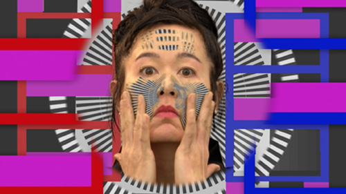   
Fig. 97 Hito Steyerl, *How Not to Be Seen:
A Fucking Didactic Educational .MOV File*
(2013)

It’s pretty clear that
the effects of the software – and it most assuredly is the software that
becomes a driving force of agency with real effects outside of Steyerl’s
film – function in an inverse relationship to most of people’s lives, in
that their effect is more unavoidable the less we have to hide. The less
concerned we are with privacy, the less concerned we are with being
monitored, means that it becomes increasingly harder to avoid being
spied on should we choose to do so in the future. On further
consideration, *How Not To Be Seen* becomes less satire and more a
frightening, powerful revelation on the new normal of the human
condition, where our presence in the world is substantiated less in our
physicality presence and far more in our digital identity which is,
ironically, increasingly beyond our control as it becomes determined and
accepted as determined by the digital objects that present our identity
back to ourselves; unlike *Second Life*, with its notion that our
avatars are our representations to the world and are controlled by us as
users, Steyerl’s art is concerned with revealing that our ‘avatars’ (to
use this outdated and outmoded term as an extended synecdoche) are
chosen for us and, even more frightening, that the sense of choice
itself is an illusion. What is rendered visible is not what we’ve chosen
to be visible but what the digital makes visible to us.

## An Unachievable Autonomy of the New Aesthetic Appreciation

Levi Bettwieser, an American photographer living in Boise, Idaho,
recently switched from shooting primarily digital to various forms of
analog photography, a move clearly associated with his interest in
antique processes in various formats. In 2014, Bettwieser came across a
set of undeveloped film rolls dating back to WWII. With a lot of effort,
experimentation and an awareness of the difficulty involved and the
potential for failure, Bettwieser set out to develop these rolls and
print the images.[^book_book_book_book_book_05-Chap5_79] The results of Bettwieser’s efforts were
incredibly interesting; as he acknowledges in a number of places, the
original photographer clearly had an eye for composition and was focused
on producing images that were personally meaningful, all the while also
producing images that are of obvious historical significance. The
discovery led Bettwieser to take on a growing collection of undeveloped
film rolls and process them as successfully as he could, and to post the
results on *The Rescued Film Project*,[^book_book_book_book_book_05-Chap5_80] a Tumblr blog set up to
share the images which has often generated more information than
Bettwieser anticipated. Though many of the rolls he’s collected have
been damaged beyond repair, Bettwieser has still diligently attempted to
rescue each one, even to the point of posting a number of the failed
images that still retain the barest of details but which verge at times
on being entirely abstract. The reason we’re starting this section with
Bettwieser’s project, however, isn’t because of the admirable and
aesthetically interesting work he’s doing, even if his shift from the
digital to analog and back to digital warrants at least an
acknowledgement of the inescapability of the digital world. What caught
our attention weren’t the images of vehicles and people from WWII
either. Instead, it’s a set of images that are obviously a product of a
flawed interface between developed analog film and the scanner or
software that Bettwieser used, and this element is the most compelling
in an analysis of the New Aesthetic. {Fig. 98} 

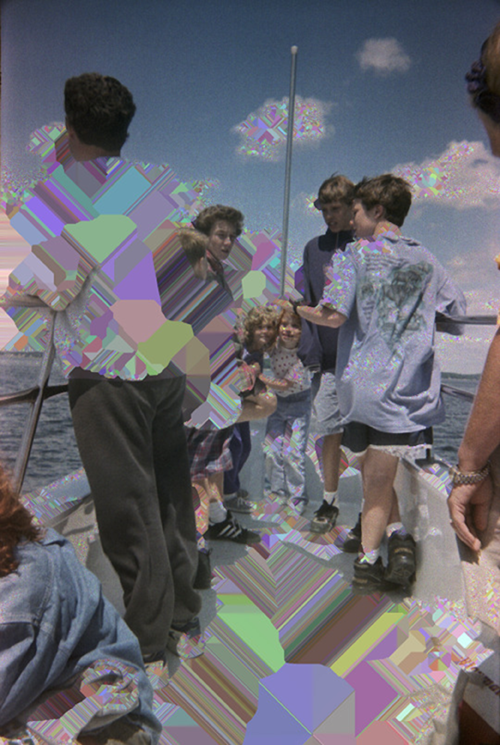   
Fig. 98 Levi Bettwieser, *The Rescued Film
Project* (2014–)

Six images, drawn from
the same role of film and connected by similar people and setting, are
covered randomly in glitch effects and distortions.[^book_book_book_book_book_05-Chap5_81] Bettwieser is
quoted by the author Attila Nagy as noting:

> Thanks to a mysterious software bug that occurred while scanning these
> joyful family photos, probably from the 80s, strange colorful shapes
> swarmed the peaceful scenes, harmonizing with the color palette of the
> original negatives. The results are stunning. I personally almost feel
> like Neo from Matrix, when he starts to see the code.[^book_book_book_book_book_05-Chap5_82]

One comment asks: ‘Is this real life?’ Perhaps it would be more
productive to ask whether this constitutes a genuine aesthetic
experience. Nagy notes: ‘this might be the fabric of our world’.[^book_book_book_book_book_05-Chap5_83]

The fact that Bettwieser has left this images on his blog – a natural
response, to be sure – indicates that these images have a power beyond
the nostalgic, beyond their evocation of other places and times, beyond
even the poignant presence of other individuals to an unconscious
awareness of the inexorable and pervasive presence of the digital realm.

Photography, whether analog or digital, is an artistic format that often
confounds the discourse of art history and the thoughtful explorations
of aesthetics. Vilém Flusser’s *Towards a Philosophy of Photography* is
one of the few examples of a sustained philosophical engagement with the
medium, but there’s scant evidence of similar efforts. It’s also telling
that one of Flusser’s other major books is titled *On Doubt*; Flusser
clearly was interested in exploring the concrete ubiquity of symbols
driven by technology in human culture through a position opposed to the
primacy often granted by philosophy of Cartesian doubt, but Flusser’s
conception of doubting doubt as a method can be borrowed as an assertion
of the dynamic potency of photography as a way of flaunting the presence
of the world rather than just as a means of representing it.

To think about photography means to think about the photographer’s
intentions as well as its technical contingencies. Photographs are
easily produced, or seemingly so, with the effect that the ability to
produce photographs has become both relatively universalized, resulting
in untold and increasingly forgotten millions of images particularly
with the advent of digital methods. Most photographs are not regarded as
art, but all are embodiments of the intentions of those producing the
images, meaning that there is, nevertheless, an ontological resemblance
between these captured pictures and the work of a serious photographer,
a resemblance not present in other examples of visual artistic
production. This resemblance is present in photography’s reliance on
chance. Chance plays a determinative role in all photography, and this
randomness of the capturing of images implies a distinct set of criteria
by which to clarify the potential resemblance between a snapshot and a
serious photograph, resulting in a lack of an ontological distinction
between both types. There is always the possibility, albeit remote to
the extreme in most cases, that a snapshot will result in a photograph
of such quality that it merits aesthetic consideration. Furthermore,
quality of production is always a consideration; no snapshot
photographer wants to intentionally produce a bad image. Given this line
of thought, what’s to stop further ruminations at an even more
fundamentally metaphysical level? If chance and technology are
reasonably understood to be determinative and constructive forces
driving the production of aesthetic experiences in photography,
partially independent of or in synthesis with the photographer’s
intentions, then it’s entirely valid to assert the presence of
algorithms, digital artifacts and errors and glitches as determinative
and constructive forces and even entirely independent agents in the
creation of aesthetic experiences. Bettwieser’s statement that he feels
like Neo in a virtual Matrix makes a lot of sense if one thinks about
the glitchy images he’s posted as aesthetic experiences as the result of
artistic agency outside of the analog world, in which the totality of
the images’ aesthetic nature is governed not by the intentions of
photographers (and Bettwieser is part of the collective of
‘photographers’ as the developer of the film he’s restoring) but by the
manipulative presence of software. In short, Descartes’ concern
regarding an evil genius and his thought experiment’s development
towards the ‘brain in a vat’ problem becomes, in the context of the New
Aesthetic, less an issue of epistemic uncertainty and more about
alternative aesthetic agents. It’s not just that we suspect that our
aesthetic taste and judgments are influenced by our experiences but that
our skepticism of the functional independence of our reflective
judgments is fully justified; the digital world is increasingly not just
something we respond to but a determinative force in our lives,
including our aesthetic inclinations and assessments.

The images from Bettwieser’s Tumblr blog are an easy way to begin this
section, and might be proof right from the start of our point that New
Aesthetic art is sufficiently autonomous to warrant a sustained and
distinct consideration, but it is still the point which is the hardest
to defend. A simple argument against it, though the effectiveness of it
is something debatable, is to note that regardless of the digital
interference evident in the images they still required a person’s intent
to photograph something. If we were to continue our investigations into
New Aesthetic objects, one could suppose, then this would make any
argument turn immediately away from work produced by artists to
instances of aesthetic effects and ‘art’ produced entirely through
computational results; it might seem almost a necessity to stop thinking
about artists’ work and only think aout digital objects produced
independently of human intentions. It’s still a goal of ours, however to
think about these art objects of varying degrees of aesthetic value and
importance as New Aesthetic objects; these are objects about which we
can assert the introduction of variables into algorithms which are
themselves self-generating, evolutionary, and sufficiently independent
of human agency, and investigate the aesthetic effects that are due to
inadvertent errors, glitches, and unforeseeable digital manifestations,
all the while still referring to them as art. More succinctly, work like
Bettwieser’s encourages one to find aesthetic objects that are entirely
divested of human intervention in order to sustain the notion of New
Aesthetic art as a form independently produced by an autonomous digital
agency, and it’s obviously natural to continue this final section with a
discussion of computer art. At the same time, though, we would forewarn
against any assumption that that’s where this will remain, particularly
in the sense that finding experienceable art that is *entirely* not a
product of human agency may be a fruitless or impractical task,
especially considering the necessary means by which the seemingly
naturalness of the New Aesthetic manifests itself.

To start thinking about New Aesthetic art objects, perhaps it’s best to
consider the closer approximation of digital art to its manifestations
in terms of computer generated art once again. We’ve already discussed
this a little bit in the first section, covering the artwork of Frieder
Nake, A. Michael Noll, Georg Nees and Jean-Pierre Hébert, but we want to
return to computer art to consider some different issues. By the early
1970s, the Institute for Contemporary Art in London had held an exhibit
of computer art called *Cybernetic Serendipity*, the Computer Arts
Society was founded, and Katherine Nash and Richard Williams had
published *Computer Program for Artists: ART 1*.[^book_book_book_book_book_05-Chap5_84] During this time
the phrase algorithmic art started being used to describe artworks
created entirely through algorithms written by artists, though most of
those artists were computer programmers first who had taken an interest
in the arts. Most instances of computer art are similar to those
discussed at the beginning of this chapter – the computer was a tool,
the understanding of complex and engaging visual design principles was
superficial at best, and the artists often weren’t really artists – but
a belief and confidence in the potential for computer art was clearly in
place to the point that the art world started to accept computer art by
the end of the 1990s. Holly Rogers, linking computer art to the growing
recognition of video art, describes the increasing acknowledgement thus:

> Hans-Peter Schwarz, one of the founding directors of the Zentrum für
> Kunst und Medientechnologie, Karlsruhe (ZKM, Germany), described their
> \[computer art\] ephemerality as setting off an “explosive charge” at
> the gates of traditional art establishments. At first this “explosive
> charge” was blocked by major galleries because of curatorial problems
> (how to include sound and performance in a gallery space, temporal
> modes of perception fundamentally at odds with the traditional gallery
> experience), aesthetic issues (video’s relationship to mass media such
> as television and untraditional modes of artistic discourse), and
> financial concerns (how to sell or keep something that is
> unrepeatable).[^book_book_book_book_book_05-Chap5_85]

Until the 1990s, computer art was, at best, on the periphery of the art
world, but the foundations for its acceptance and for a genuine New
Aesthetic art was in place. This process of an increased presence and
acceptance of New Aesthetic art, however, was facilitated not by the
quality nor the market value of computer art – in fact, we would argue
that aesthetic value or quality of computer art has generally remained
subpar at best, substantiated by the remarkably low market value for
most instances of computer art including those of historical importance
– but from specific related and distinct factors.

Part of the success of the process lies in a major shift in the methods
of production. The *Cybernetic Serendipity* exhibition of 1968, curated
by Jasia Reichardt, provides a good example. It an exhibition firstly of
art based on algorithms, art that was influenced by computational
processes such as Gustav Metzger’s *Five Screens With Computer* (1968),
two of Jean Tinguely’s painting machines, and Wen-Ying Tsai’s
interactive cybernetic sculptures consisting of vibrating
stainless-steel rods, stroboscopic light, and audio feedback control.
Additionally, *Cybernetic Seredipity* also included practical designs
for architecture and objects that showed the curator’s understanding of
the intersections of art, design and early forms of digital design,
perhaps the most ‘cybernetic’ type of all of the included objects. It
also was an important influence in the formation of the Computer Arts
Society by Alan Sutcliffe, George Mallen, and John Lansdown. For us,
though, the most interesting part of the exhibition is the presentation
of a survey of the field of computer music, including works by Lajaren
Hiller & Leonard Isaacson, John Cage, Iannis Xenakis, Haruki Tsuchiya
and Herbert Brün. {Fig. 99} 

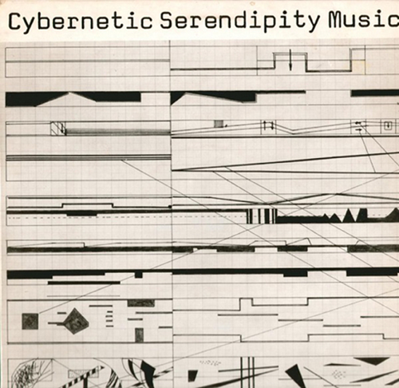   
Fig. 99 *Cybernetic Serendipity* (1968)

As noted in a recent release of the
recording:

> During the preparation of the Cybernetic Serendipity exhibition two
> things became apparent. 
>
> One, that in order to show what was going on in the field computer
> music, it was necessary to include a considerable amount of material
> that was not strictly composed with or played by computer. Two, that
> dealing with an exploratory field, all attempts at a historical
> perspective or firm evaluation were out of place. The exhibition and
> this record, therefore, are essentially a reportage of current trends
> and developments in programmed and stochastic music.[^book_book_book_book_book_05-Chap5_86] 

In short, one of the curious things about computer art is that it’s
rarely art produced by a computer; it’s not merely that the technology
hasn’t been capable of autonomous artistic production (because it
actually has even in the earliest days) but rather than the creative,
imaginative work of the artist is something that the art world has been
reluctant to abandon. The hand of the artist, the sense of prioritizing
human craftsmanship, is an attitude that been reluctantly dispensed with
only in the most recent years, as more and more artists turn to
technological means for their production in various ways and to various
extents; this includes David Hockney, Cai Guo-Qiang, Paul Pfeiffer, Ai
Weiwei, Jenny Holzer, Pierre Huyghe, Bruce Nauman and so many others
that a list is impossible to consider.

Where we’ve arrived, interestingly, is at a place where New Aesthetic
art is both viable but continuously uncertain. Procedurally generated
art can be considered aesthetically valid and the current vivacity and
slipperiness of the New Aesthetic can be summarized neatly with a quote
from the Indian artist Gopakumar R. P.’s work *Linguistic River* (2015):
‘I believe the work of art should change the existing visual,
intellectual and aesthetical sense and experiment with finding new
visual phenomena.’[^book_book_book_book_book_05-Chap5_87] The fact is that a number of visual artists
working without computers were beginning to produce work that
established the foundations for a New Aesthetic art, and two important
figures illustrate the tendency that many contemporary artists have
taken to pave the way for the New Aesthetic: the Korean-American artist
Nam June Paik (1932-2006) and the Swiss artist Jean Tinguely
(1925-1991). Paik has been described as the artist who invented video
art, who first brought a refined artistic sensibility to the use of
electronics in artistic production, and whose participation in Fluxus
and whose production of conceptual art radically transformed the
possibilities available for subsequent generations. In video work,
through the use of televisions as sculptures, by using neon lighting and
laser effects with elaborate sound experiences, Paik pushed viewers to
contemplate the rapid pace of change driven by technological
innovations. His *TV Buddha* (1974) {Fig. 100} is rightfully regarded as
his most famous and important artwork. 

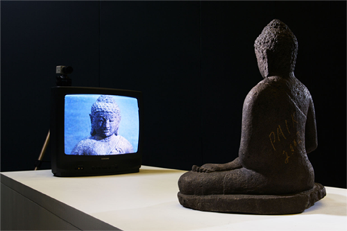   
Fig. 100 Nam June Paik, *TV Buddha* (1974)

*TV Buddha* has become an iconic
artwork, which is surprising given that it was included almost as an
afterthought in an exhibition almost as an afterthought at the Galeria
Bonino in New York. Consisting of a closed loop – a seated Buddha
sculpture is positioned so that it gazes at a television monitor that
displays an image of the Buddha captured through a closed-circuit
television camera – it’s a work that has sometimes been construed as a
representation of a collision between an Oriental set of values or
mindset and the Occidental tendency to assert a primary role for
technological innovation. When Paik re-exhibited *TV Buddha* in Cologne
that year, however, the artist temporarily took the place of the Buddha
sculpture, thus denying the validity of that interpretation. The
interchangeability of the figurative element is key for our purposes,
and what we believe is a more accurate interpretation: the figurative
sculpture and Paik’s own presence did not create a participating role
but rather described a destabilized element in the closed system of the
technology itself; whether as a living, breathing human being or an
inanimate representation of a divine or semi-divine creature. What is
activated aesthetically is the autonomy of the technology as a seeing
agent, albeit one that remains unresponsive to any changes taking place
in front of it. Paik would certainly have been aware that the role of
the Buddha is not so much to exist as an object of worship but to be
present as a model of enlightenment, an example of what an individual
can become, and *TV Buddha* represents technology’s desire to achieve
enlightenment as if technology was gazing actively, striving to better
itself.

Some of Tinguely’s work is equally interesting and, in our opinion,
achieves a similar result. Emerging from a tradition of Dada, Tinguely’s
most famous artworks were kinetically destructive and self-destructive
in nature, with Tinguely’s *Homage to New York* (1960) serving as the
most famous and typical example. {Fig. 101} Set up in the sculpture
garden of the Museum of Modern Art, *Homage to New York* was described
by Tinguely as a ‘self-constructing and self-destroying work of art’
comprised of wheels, motors, a bathtub, a piano and various other
objects and, once set into motion, proceeded to destroy itself with
crashes and fire until stopped by the local fire department.

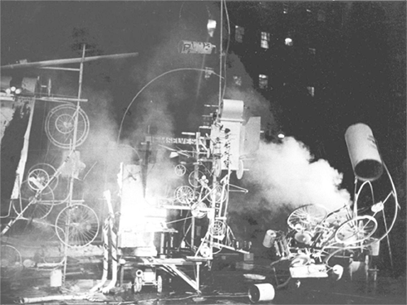   
Fig. 101 Jean Tinguely, *Homage to New
York* (1960)

While the
link to Dada is apparent, as is the link to a long tradition of
destruction in art, like Paik’s work there is a setting-forth of a
systematic autonomy in *Homage to New York* that regressively undermines
its sense of determinativeness; Tinguely’s aesthetics necessitated a
lack of control on the artist’s part, once the processes had been set
into motion, that transferred an autonomous agency over to the artwork.
Much of Tinguely’s career can be understood as an exploration of the
relationship between the artist, his work as technology, and human
culture, with a clear conclusion that technologically-dependent objects
have an alien life all to themselves, an interpretative position
reinforced with a statement by Michael Landy, co-curator of a major
exhibition of Tinguely’s work at the Tate Liverpool in 2009, that
*Homage to New York* ‘committed suicide’,[^book_book_book_book_book_05-Chap5_88] an act only a living
creature with a sense of self-awareness could do.

The aesthetic strategies and their results as employed by both Paik and
Tinguely are, in many respects, radically different from each other, but
the resulting consequences are the same: in each case a system is
created, closed and self-referential, initiated by the artists but
quickly moving out of their control with unexpected results. In a way,
both Paik’s and Tinguely’s artworks represent an aestheticization of
Kurt Gödel’s incompleteness theorem, if aesthetic principles are
considered axiomatic and human aesthetic evaluations are considered
consistent. While we wouldn’t claim that Paik or Tinguely produced New
Aesthetic art, we’re confident that their relationship to technology as
a force opened opportunities prefacing a New Aesthetic interactionist
strategy.

One of the most logical heirs to this, fully in a New Aesthetic mode, is
the German artist Ralf Baecker. A German artist trained first in
computer science and then as an artist at the Academy of Media Arts in
Cologne, Baecker’s work has been the subject of a growing interest and
focus as representative of a new generation of computer artists and many
examples of his art show a sustained and insightful exploration of New
Aesthetic issues. *Re-Active Platform* (2010-12) is a very good starting
point; installed in a series of museums with a team of assistants,[^book_book_book_book_book_05-Chap5_89]
Baecker created a system of reactions between different
computationally-drive sets of hardware and software which were also
dependent on various environmental inputs as wide-ranging as motion and
cosmic radiation. It seems that Baecker’s intention behind the work was
to simulate an ontological foundation, namely, that reaction is the *sui
generis* of autonomy, with a self-determining set of self-regulations as
consequences of a sustained autonomy. More than almost any other artist
mentioned, Baecker’s work exhibits an awareness of the presence of the
digital functioning as an autonomous agent. Work like *Nowhere* (2004) –
in which a ‘landscape’ based on users search movements on www.metager.de
is sculptured on a milling machine – give a physical manifestation to
the ‘geography’ of the internet.[^book_book_book_book_book_05-Chap5_90] *Rechnender Raum (Computing
Space)* (2007), {Fig. 102} an installation consisting of sticks, strings
and plumb weights, exists as a fully-functioning, logic and exact
network, with a reversal of the normal arrangements of output display
(at the center of the torus) and computing mechanics (on the outside of
the torus); in exaggerating the workings of its operational behavior,
Baecker has created a work of art almost directly analogous to numerous
models of consciousness presented in different philosophies of mind,
even to the point of being similar to Kant’s description of the mind’s
active relationship to its experience of the world. 

   
Fig. 102 Ralf Baecker, *Rechnender Raum
(Computing Space)* (2007)

Taking this even a
step further, Baecker’s *The Conversation* (2009) {Fig. 103} is an
autonomous machine consisting of 99 solenoids circled around three
rubber bands that respond to the surrounding electromagnetic fields of
their neighbors as well as the changing pulling forces detected in order
to conserve its own position, with the result being something akin to a
homeostat that ‘tries to establish a hyper stable equilibrium’.[^book_book_book_book_book_05-Chap5_91] 

   
Fig. 103 Ralf Baecker, *The Conversation
(Autonomous Machine)* (2007)

In
each case, Baecker is creating a system in which the system itself is
responding on its own terms, creating an aesthetic configuration under
its own power which is, fascinatingly, teleologically driven in an
irrational fashion. Two pieces, though, need specific focus, as the best
of Baecker’s New Aesthetic art: *Crystal Set* (2011)[^book_book_book_book_book_05-Chap5_92] and
*Irrational Computing* (2011-12).[^book_book_book_book_book_05-Chap5_93]

*Crystal Set* {Fig. 104} takes as its basic premise the materiality of
computational devices; the metonym ‘Silicon Valley’ is more than just a
location but a description of one of the primary components of all
computers, as are a wide variety of rare earth elements and other
material. 

   
Fig. 104 Ralf Baecker, *Crystal Set* (2011)

Attaching iron needles to the surface of a silicon carbide
specimen with a semiconducting diode at the point of contact, Baecker
has created a set of circumstances whereby both light and audible
signals can be generated and responded to by the software, investigating
the logical structure of the crystal which then

> applies different electronic pattern to the contacts based on an
> analysis of current flow, resistance and response times in the
> specimen. By doing this it is inspecting its behavior in a closed
> feedback loop. As a result it generates raw and untamed signals
> visible and audible to the observer.[^book_book_book_book_book_05-Chap5_94]

Bringing to mind, as Baecker himself alluded to in an interview,[^book_book_book_book_book_05-Chap5_95]
the raw crystal sets used in early commercial radios, *Crystal Set* is
quite crude in appearance but sophisticated in execution and effect;
more than just manifesting a sense of life, this work takes on a literal
life of its own as well as a personality. Closely related to it,
*Irrational Computing* {Fig. 105} has become Baecker’s most well known
work, representing at an even more fundamental level than *Crystal Set*
Baecker’s exploration of a ‘raw’ computational device. 

   
Fig. 105 Ralf Baecker, *Irrational
Computing* (2011-12)

Using five
interlinked modules, each responding separately to various input as well
as responding at different levels to their companions’ output,
*Irrational Computing* is a macroscopic presentation of the
computational process that breaks away from the necessity of being
purposive and logical. The effect is, as noted by the curator Carsten
Seiffarth, that:

> Digital systems, in their function, are conceived logically and
> rationally. The lowest physical or electro-technical level (crystals
> with semiconductor properties) are based, however, on quantum
> mechanical, i.e. statistical or unpredictable processes. Modern
> computer technology has thus tamed and domesticated the chaotic, so to
> speak. In his work, Ralf Baecker comments on this paradox by examining
> the aesthetics of the materials from which has developed a global
> digital network. “Irrational Computing” is not supposed to “function”
> – its aim is to search for the poetic elements on the border between
> “accuracy” and “chaos”.[^book_book_book_book_book_05-Chap5_96]

Taken as a body of work – which is how Baecker sometimes refers to many
of his artworks – the Irrational Computing objects are an exploration of
randomness out of the natural and the man-made that parallels the
intentions behind technological innovation. More than just heightening
the viewer’s awareness of the materiality of contemporary computing –
although that’s an important part of the work – Baecker’s work
re-appropriates the digital which then creates its own paradox in the
dichotomy between programmed and shaped material form that is the
product of human intervention in opposition to a presence that grows
over the duration and experience of the objects’ existence as apparent
living-objects, based on the idea, as Baecker himself notes, of
mathematician, physicist and inventor John von Neumann’s definition of
artificial life, that ‘life is a process which can be abstracted away
from any particular medium’.[^book_book_book_book_book_05-Chap5_97] For us, Baecker’s art is a challenge
to the anthropocentric notion of artistic agency and aesthetic effect
precisely because its program quickly escapes the originator’s
supervision, and it is New Aesthetic in that the conditions whereby the
anthro-dependent qualification disappears behind an inherent and
self-determined qualification of agency and its aesthetic effects.

This brings us back to the ideas of Lev Manovich, in particular his
definition of ‘new media’. Writing about the GUI of applications,
Manovich describes the design of the interface as increasingly visible,
in opposition to modernist tenets, such that:

> The designers no longer try to hide the interfaces. Instead, the
> interaction is treated as an event, as opposed to “non-event”, as in
> the previous “invisible interface” paradigm. Put differently, using
> personal information devices is now conceived as a carefully
> orchestrated experience, rather than just a means to an end. The
> interaction explicitly calls attention to itself. The interface
> engages the user in a kind of game. The user is asked to devote
> significant emotional, perceptual and cognitive resources to the very
> act of operating the device.[^book_book_book_book_book_05-Chap5_98]

In essence, the increasing levels of interaction demand a similar
attentiveness to the type employed in a theatrical experience, wherein a
separation exists through a suspension of disbelief, with a heightened
force of the artificiality of the aesthetic experience. However, an
interesting effect is that the more the user becomes aware of the
necessity of this heightened sense of the artificial there is a
corresponding decline in a critical distance to the point that the
artificial increasingly becomes naturalized. This transition within the
event is evident in the work of James E. Murphy, an artist from Northern
Ireland working in Berlin and part of a growing number of artists whose
work is primarily presented online in the programming languages of the
internet.[^book_book_book_book_book_05-Chap5_99] Murphy’s work has covered territory similar to many other
artists, including a few already discussed in this chapter, with work
like *Relative Anonymity* (2012)[^book_book_book_book_book_05-Chap5_100] presenting an avoidance of
government security structures’ use of facial recognition through the
use of stochastic noise and visuals, but three pieces in particular
capture the released energy that defines Murphy’s work specifically.
*The Politics of Creation* (2013)[^book_book_book_book_book_05-Chap5_101] {Fig. 106} is a theatrical
production that utilizes an aleatoric music and lighting system based on
algorithmic formulae to create unique compositions for every
performance; what’s interesting is not just the inclusion of chance in a
work which is heavily indebted to the traditions of systematization in
art, especially in its fascinating use of algorithms to push an ever
changing set of musical transitions through instrumentation, key,
rhythm, arrangement and structure, but also the sense of an invoked
natural chaos partnered with the choreography creating a ‘closed system
of causality as information about velocity, acceleration and positioning
of dancers are fed back into the system affecting the very music they
are dancing to \[…\] \[that\] links the dancers and the system in a
“dance” of their own \[…\] as the piece progresses towards its
finale’.[^book_book_book_book_book_05-Chap5_102] 

   
Fig. 106 James E. Murphy, *The Politics of
Creation* (2013)

The shift in the language is telling, as it’s clear that
Murphy understands the mathematical structure to be an active
participant in the performance, a digital collaborative partner to the
human dancers. But what’s also clear is an emphasis on the transitory,
the ephemeral and the lyrical tragic; Murphy writes about *The Politics
of Creation*:

> As a viewer the experience is of course unique in terms of its raw
> content but what’s more than this it seems to allow one to have an
> extended experience of the present moment. Whereas a regular stage
> production will be known to be predetermined, in TPoC the anticipation
> associated with knowing that the next series of notes or rhythmic
> pattern and ultimately how the choreography responds to it, will never
> be heard or seen again tends to expand the perception of “now”
> creating a mild hypnosis or meditative state.[^book_book_book_book_book_05-Chap5_103]

*Found* (2014)[^book_book_book_book_book_05-Chap5_104] {Fig. 107} and the previously discussed *What
Colour Is It?* (2014) are quite different. 

   
Fig. 107 James E. Murphy, *Found* (2014)

*Found* is an almost
aggressive intrusion into the user’s experience of a browser, consisting
simply of the words ‘I Found My Soul In A Browser Window’ flashed
repeatedly on the screen in a manner that someone suffering from
photosensitive epilepsy should avoid at all costs. Using soft-focused
typography that flashes in and out of visibility, with the words crossed
and revealed in the most blatant of RGBY tones, *Found* isn’t
functional, it is disconcertingly glaring visually, and offers no chance
for reciprocity and reflective judgment whatsoever in a fashion. By
removing any identification of the ‘I’ and by situating the
conceptualized space self-referentially inside its own browser window,
*Found* leaves us with an experience that closes any chance of
interchange or exchange between the art and the viewer. And the
previously discussed *What Colour Is It?* (2014) is more than just a
simple confounding of our anticipated feedback but is a strong
demarcation of the singular difference between the digital parameters of
experience and our normative experience of the world at a
phenomenological level wherein the interface ceases to function despite
its appearance. Manovich’s observation that cognitive resources become
increasingly utilized really seems to capture Murphy’s art, although
Murphy’s art seems to have created a digital event horizon in a way that
replicates the division between actors and audiences in Manovich’s
notion of ‘interaction as theater’.[^book_book_book_book_book_05-Chap5_105] At the same time, the
increasing use of cognitive resources in the aesthetic experience
contraindicates an engaged and personal aesthetic experience, and
Murphy’s work heightens our awareness of this process in a very valuable
fashion.

## Beyond the Theatricality of the New Aesthetic

Two projects by Lev Manovich bring out these issues in notable and
fascinating ways: *Selfiecity* (2014) and *On Broadway* (2014-2016).
Manovich is, of course, one of the most important theorists thinking
about postdigital issues, but he’s also created a number of projects
that may not be referred to as ‘art’ in the traditional sense, in that
they often seem more like visualized sociological research, but
certainly fall into a broad definition as such in that they invite the
same type of responses one normally has to art. *Selfiecity* (2014),
{Fig. 108} and its second manifestation *Selfiecity London* (2015), was
an artistic project exploring data visualization through an analysis of
3200 Instagram selfie photos taken in Bangkok, Berlin, New York, Sao
Paulo and Moscow[^book_book_book_book_book_05-Chap5_106] with London added as a sixth city later.[^book_book_book_book_book_05-Chap5_107]

   
Fig. 108 Lev Manovich, et. al., *Selfiecity*
(2014)

Starting off with 120,000 photos culled from a collection of 656,000,
the organizers had these checked by Amazon Mechanical Turk workers to
verify their status as a selfie photograph, reduced the sample set
further to 1000 for each city after two Turks tagged a photo as a
selfie, and then had each photograph further tagged by age and gender
with higher skilled Turks. Given a conclusive set of selfies, the
organizers then algorithmically estimated eye, nose and mouth positions
as well as estimated emotional states. What emerged from these
permutations of analysis is the means to visually represent various
spectrums of data such as smiles, points of view, emotional states, the
expressiveness of the poses and the propensity of selfies as a
photographic subject. What was revealed in this project were apparent
geographically determinable trends; for instance, people in selfies in
Bangkok and Sao Paulo smiled significantly more than in the other
cities, and women in Moscow took far more selfies than men and treated
selfies more like a fashion shoot to project an image of themselves
rather than simply as a marker of their presence or participation. Is
*Selfiecity* art? The project itself engages with that question by
including three essays analyzing the selfies as a social phenomenon and
handling critical theory’s ability to analyze the selfie as a
manifestation of our zeitgeist,[^book_book_book_book_book_05-Chap5_108] but in a traditional sense it’s
very hard to think about *Selfiecity* as ‘art’ not only because of the
productive methodology involved, including the obvious contributions
from a vast array of individuals, but also because of the sense that
it’s a project more ensconced in anthropology. Well, we’ve not been
talking about art in the traditional sense for a long time, and it’s
clear that *Selfiecity* is but one instance of a new way of making art
that is socially and cooperatively engaged and produced in a manner
closely approximating Nicholas Bourriaud’s notion of relational
aesthetics. At the same time, *Selfiecity* is a challenging artwork that
is fully New Aesthetic in nature for the simple reason that it’s
dependent on a productive methodology and aesthetic strategy that is
itself uncritically dependent on underlying conventions of the nature of
data. Recalling Otto Neurath’s infographics, with the transformation of
data into visual form which almost perfunctorily and negligently draws
upon its sources, *Selfiecity* manifests its visual appearance in a
similar fashion, albeit in a manner clearly much more thoughtful and
engaged, in that the data becomes the visualization rather than being
revealed by the visualization. This is what makes *Selfiecity*
particularly interesting and valuable and what makes it a genuine
instance of New Aesthetic art: it’s not just that Manovich and his team
translated the data into a visual form with its own aesthetic criteria,
it’s that the aesthetic criteria were built into the aesthetics of the
data itself as it was discovered through the research and the creation
of the art. Zach Sokol writes:

> Not only does *selfiecity* \[sic\] offer findings about the
> demographics of people taking selfies (as well as info about their
> poses and expressions, such as smile trends), it also shares a variety
> of data visualizations (such as collages that overlay hundreds of
> selfies that share certain characteristics), and allows visitors to
> explore the entire photo collection, filtering the information into
> several formats that could reveal patterns or trends that ripple
> throughout selfie culture.[^book_book_book_book_book_05-Chap5_109]

While Sokol’s enthusiasm for the project is appreciated, it’s clear that
he’s seeing *Selfiecity* only as a project whose forms are determined by
the artists’ manipulation of the data rather than as a means of
revealing the inherent aesthetic nature of the data itself. To put it
another way, the ontologically circular nature of the data, generated
autonomously within its self-determining aesthetic manifestation,
reveals itself through the artistic choices Manovich and the rest made
in a way that’s independent of those artistic choices; the fundamentally
important aesthetic engagement for the viewer lies not in *Selfiecity*’s
website, for instance, but in its autonomous aesthetic.

Equally important and interesting is Manovich’s *On Broadway*
(2014-2016).[^book_book_book_book_book_05-Chap5_110] {Fig. 109} 

   
Fig. 109 Lev Manovich, et. al., *On
Broadway* (2014–16)

As noted on the website for the project,
*On Broadway* is an ‘interactive installation \[…\] \[that\] represents
life in the 21st century city through a compilation of images and data
collected along the 13 miles of Broadway that span Manhattan’. Drawing
upon the rich history of modern representations of cities’ identities,
ranging from Pissaro’s series of paintings of the Boulevard Montmartre
to *Spider-Man* comics and, especially, Edward Ruscha’s seminal *Every
Building on the Sunset Strip* (1966), {Fig. 110} Lev Manovich and his
team[^book_book_book_book_book_05-Chap5_111] created a visual representation of a broad spectrum of data
sources in real time and averaged over extended periods of time in order
to provide a portrait of Broadway’s important role in the life of New
York City. 

   
Fig. 110 Edward Ruscha, *Every Building on
the Sunset Strip* (1966)

Instagram images, Google Street View pictures of the facades
of buildings, taxi statistics obtained from the city, demographic data
and collection of dominant colors by location and social media imagery
were brought together to create a panoply remarkably similar in intent
to Walter Benjamin’s unfinished *Arcades Project* (1927–1940) as a data
collage manifesting a personification of the life of this segment of the
city. This last point is crucial, and it’s what ties *On Broadway*
together with its artistic predecessors: what emerges out of the
experience of this art installation is a sense of the life of Broadway,
a sense that, as one write puts it, ‘NYC is a city that does sleep, a
bit’.[^book_book_book_book_book_05-Chap5_112] At the same time, *On Broadway* is curiously similar to
*Selfiecity* in its dependence on big data for its raw information and
its aesthetic appeal. To compare it to Ruscha’s work is illuminating:
whereas Ruscha’s images of the building on Sunset Strip is just as much
about the endurance of the photographer to image each and every building
as it is about creating an extensive and all-encompassing image of that
one location in West Hollywood, *On Broadway* doesn’t illustrate so much
the efforts of the artists involved as it shows the presentation of the
information generated by the people living, working and travelling on
Broadway; whereas Ruscha’s work is an act of documentation, *On
Broadway* is primarily a presentation of what had already been
documented and archived by software data analysis and stored with the
aesthetic affect fundamentally driven by the sublime realization of the
existence of the data itself. Manovich notes:

> How does a “data city” look like? We did not want to show the data in
> a conventional way using only graphs and numbers. We also did not want
> to use another convention of showing spatial data – a map. The result
> of our explorations is “On Broadway”: a visually rich image-centric
> interface, where numbers play only a secondary role, and no maps are
> used. The project proposes a new visual metaphor for thinking about
> the city: a vertical stack of image and data layers. There are 13 such
> layers in the project, all aligned to locations along Broadway. Using
> our unique interface (available as the online app and in large
> multi-touch screen installed at New York Public Library as part of
> “The Public Eye” exhibition), you can see all data at once, or zoom
> and follow Broadway block by block.[^book_book_book_book_book_05-Chap5_113]

While Manovich notes that the intention is to produce a visually rich
and interactive experience, the emphasis and the end result is clearly
situated less in the superficial effect but in the creation of a ‘new
metaphor’ that breaks through a digitized fourth wall. We would argue
that this new metaphor isn’t as new as Manovich and his team think it is
simply because its origins lie less in the creativity of the artists but
in the driving force behind the New Aesthetic. John Brownlee makes an
interesting point when he notes that ‘*On Broadway* is the latest in a
series of experiments to leverage computers, the web, and massive data
to represent our cities in new ways.’[^book_book_book_book_book_05-Chap5_114] Leveraging the data, the
software and the hardware means pushing them to act, to create the
aesthetic experience, in ways that only they are capable of doing; *On
Broadway* is, in our opinion, a fascinating and beautiful example of
what New Aesthetic art is precisely because the data and its
parameter-controlling manifestations achieve an incredibly determinative
and autonomous agency in the creation of the aesthetic experience. Once
the interactivity takes place the artists’ control permanently slips
away and all that remains is the data. Nevertheless, we take as a
central tenant of our position a point nicely articulated by Manovich,
writing about *Selfiecity*: ‘New image-making and image-sharing
technologies demand radically new ways of interpretation and analysis in
what we might think of as a postdigital age, and *Selfiecity* is an
attempt to explore and map these new representational forms.’[^book_book_book_book_book_05-Chap5_115]
Manovich is absolutely correct; New Aesthetic art and what it represents
is about more than just appearing to be digital or postdigital but
represents an entirely new way of interpreting and analyzing images, one
that equally demands a new critical perspective. It’s not enough to
simply assess how cool or new the work is, but rather how much of a
paradigmatic shift is evidenced and embodied in the work.

Two artists that can be positively compared to the methodology of
Manovich’s artworks are Ben Grosser and Matthew Rothenberg. Grosser’s
work, already discussed earlier in the book, has been varied in form and
content, but clearly aligns itself with a specific New Aesthetic
strategy that is entirely invested in designing the function of digital
objects towards an embodied form of autonomy. Works like *Interactive*
*Robotic Painting Machine* (2011) {Fig. 111} bear some resemblance, in a
non-destructive fashion, to Jean Tinguely’s work, but pushes far beyond
what Tinguely’s work accomplishes to establish itself as a primary
instance of New Aesthetic art because there are measurable results that
can be assessed comparatively to the form of our own aesthetic choices.

   
Fig. 111 Ben Grosser, *Interactive Robotic
Painting Machine* (2011)

Taking the idea that intelligence can evolve even in software and, thus,
that aesthetic sensibilities, as an expression of the needs of that
evolved intelligence, can also evolve, Grosser built

> an interactive robotic painting machine that uses artificial
> intelligence to paint its own body of work and to make its own
> decisions. While doing so, it listens to its environment and considers
> what it hears as input into the painting process. In the absence of
> someone or something else making sound in its presence, the machine,
> like many artists, listens to itself. But when it does hear others, it
> changes what it does just as we subtly (or not so subtly) are
> influenced by what others tell us.[^book_book_book_book_book_05-Chap5_116]

*Interactive Robotic Painting Machine* is a programmed art-producing
machine which at first seems to be part of a long tradition of similar
machines tracing back to the early 1960s, but Grosser’s addition to it
is clearly a heightened independence and even a sense of self-awareness
in the capability of the work to respond. Having identified one of the
primary aspects of artistic identity as the ability to think, listen,
and hear oneself, Grosser has programmed the machine to, in effect, be
an artificial artist. Still, as clever as this is, the autonomy is still
programmed in, and the aesthetic responses through the programming can
be predicted, thus leaving questions about the machine as an independent
artist still in place; Grosser himself asks these very questions when he
writes on his website:

> Does an art-making machine of my design make work for me or for
> itself? How does machine vision differ from human vision, and is that
> difference visible in its output? Is my own consciousness reinforced
> by the system or does it become lost within? In other words, is this
> machine alive, with agency as yet another piece of the technium, or is
> it our own anthropomorphization of the system that makes us think
> about it in these ways?[^book_book_book_book_book_05-Chap5_117]

What makes this piece fit into the category of New Aesthetic art is that
uncertainty, particularly as it pertains to the question of
anthropomorphization; it’s not so much a question of whether Grosser is
attributing human form and personality to the actions of the
*Interactive Robotic Painting Machine* but a question about the freedom
we have to anthropomorphize a machine, to seemingly ascribe
metaphorically human traits when what might really be happening is that
those traits exist in a non-metaphorical fashion in the object’s digital
basis. Far more interesting is *Computers Watching Movies* (2014),
perhaps one of the most important and compelling examples of New
Aesthetic art we’ve seen.[^book_book_book_book_book_05-Chap5_118] {Fig. 112} 

   
Fig. 112 Ben Grosser, *Computers Watching
Movies* (2014)

Using software written by
himself, Grosser provided computational devices not only the means to
watch movies by tracking areas that attract their attentive focus but
also the means to express that focus by plotting changes in the same
manner that the focus of eyesight of vision can be tracked digitally
today. Using well-known clips from six classic movies – *2001: A Space
Odyssey*, *American Beauty*, *Inception*, *Taxi Driver*, *The Matrix*,
and *Annie Hall* – Grosser’s artwork is given an opportunity to
*aesthetically* present its response. It’s this last point that makes
*Computers Watching Movies* so interesting, in that it’s more than just
software programming coupled with hardware capability but is, rather, a
means of granting aesthetic agency to a digital configuration almost as
a means of testing its potential disinterestedness as an aesthetic
object in its own right. Exhibited widely and winning the First Prize at
the VIDA Awards for Art and Artificial Life in 2014, Grosser’s
*Computers Watching Movies* is more than just machine vision but is also
the embodiment of a new evaluative aesthetic paradigm; it’s not merely
that this artwork gives us some insight into the changing nature of
cinema itself[^book_book_book_book_book_05-Chap5_119], it answers Grosser’s question ‘Will a system
without our sense of narrative watch the same thing? I’m left wondering
why I and the computer see things so differently.’[^book_book_book_book_book_05-Chap5_120] The real issue
isn’t why the human and the machine are seeing things differently. The
underlying assumptions are that there’s some conflation between the
human and the digital responses; however, not only is there no
conflation, not only is it clear that the human and the computer see
things differently, even more important is the fact that *Computers
Watching Movies* contains the strong implication that the computer’s
interest is quickly supplanting our own or that it’s vision, its method
of aesthetic evaluation is supplanting ours. Is it possible that
Grosser’s *Computers Watching Movies* is capable of achieving a purely
disinterested perspective and would thus be capable of pronouncing pure,
justified objective aesthetic judgments in a Kantian sense? Certainly at
this point the answer is no, but that’s only due to the technical nature
of Kant’s system that requires a subjective reflection. It’s clear that
this work puts forward a vision of the future in which even something as
aesthetic judgment, once assumed not only to be a privileged and
exclusive form of human activity, transitions into the digital in a
manner that seems to be a more effective implementation.[^book_book_book_book_book_05-Chap5_121]

In a way this is similar to Matthew Rothenberg’s project *Unindexed*
(2015).[^book_book_book_book_book_05-Chap5_122] {Fig. 113} 

   
Fig. 113 Matthew Rothenberg, *Unindexed*
(2015)

Rothenberg has worked in the tech industry in a
number of prominent roles, but recently started creating his own art
projects such as *Emojitracker* (2013),[^book_book_book_book_book_05-Chap5_123] which tracks all emoji
usage worldwide in a dynamic graphic format, and *Swipe Left*
(2014),[^book_book_book_book_book_05-Chap5_124] which conflated the dating app Tinder’s usage with drone
strikes through incorporated images of kills by drone missiles.
*Unindexed* (2015), however, is a masterpiece in its own right, one
directly akin to Yves Klein’s conceptual artwork *Zone of Immaterial
Pictorial Sensibility* (1959-62); described by Rothenberg as ‘An
experiment in the nature of ephemerality and persistence on the web’ it
was a website that functioned by continually searching for itself in
Google and destroying every copied instance of itself once discovered,
‘making the precise instant of algorithmic discovery the catalyst of
destruction’. Importantly, Google discovered the work 22 days later and
destroyed it resulting in no backups and no corresponding existence
except the memory of the event. What aligns *Unindexed* with Grosser’s
work is the independence of the digital agent from human interaction;
even though visitors to the *Unindexed* site were encouraged to share it
and post to it the coding took control in an entirely separate fashion,
breaking *Unindexed* free of human interactivity once set into motion.
It’s this release from human control that makes these instances of New
Aesthetic art both exciting and unnerving; more than almost any other
work we’ve discussed, *Unindexed* not only is fully participant in new
forms of digital art, influenced by the ephemeral nature of the internet
and simultaneously having a persistent conceptual effect, its nature as
functioning independently of the artist makes it a perfect example of
New Aesthetic art. In an interview Rothenberg noted ‘Part of the goal
with the project was to create a sense of unease with the participants –
if they liked it, they could and should share it with others, so that
the conversation on the site could grow \[…\] But by doing so they were
potentially contributing to its demise via indexing, as the more the URL
was out there, the faster Google would find it.’[^book_book_book_book_book_05-Chap5_125]

In a way, *Unindexed* forces us to confront a peculiar conundrum because
of its permanent and ephemeral nature when faced with certain
manifestations of digital objects: are we complicit in their continuing
existence (which we most certainly are, if for no other reason than that
page view counts are often determinative of their appearance in search
results) or do they have a life of their own (which they most certainly
do as well, existing on servers)? This dialectic complicates our
response, and increasingly we make concessions to the presence of the
digital into our lives, allowing it to function in a state of
independent agency (if not actual independent agency) rather than
risking any emotional dangers or existential uncertainty were we to try
and intervene or act on our volition. What made *Unindexed* so poignant
and poetic was the simple fact that the more it was searched for, the
more it appeared in Google’s search results, and the quicker its demise
would come; there was almost a sense of the tragic with a subsequent
lack of comfort in one’s participation. This feeling of being
uncomfortable is only due to its lack of familiarity, a lack that is
quickly disappearing the more digitized our world becomes. Marius Watz
posted on his Tumblr feed that ‘heavy use of algorithms is bad for you.
That is, it is if you wish to consider yourself a computational creative
capable of coming up with interesting work \[…\] You cannot lay claim to
“owning” any given algorithm (or hardware configuration), unless you
have added significant extra value to it.’[^book_book_book_book_book_05-Chap5_126] In his Tumblr essay
from 2012, Watz writes about how coding itself should be regarded as an
art form in that code exists as an entity in its own right similar to
the traditional objects of artistic production. But what this really
means, for Watz, is that code is not neutral: ‘Algorithms provide the
means to produce specific outcomes, typically through generative logic
or data processing. But in the process they leave their distinct
footprints on the result \[…\] “speaking” through algorithms, your
thought patterns and modes of expression are shaped by their
syntax.’[^book_book_book_book_book_05-Chap5_127] We’re at the stage where what’s really interesting about
this is how this indicates that there are new boundaries; while the
algorithms created by Watz are themselves dependent on more fundamental
algorithms, meaning that his own creations are flavored by the
footprints of the preexisting syntax, nevertheless something new is
emerging, and a work like *Unindexed* forces us to confront the
existence of boundaries that are increasingly evident and permeable
without any action on our part as users.

Finally, we need to take into account James Bridle’s own recent
exhibition of his art in the NOME gallery in Berlin. The NOME gallery
was founded in 2015 as an exhibition space presenting work that exists
at the intersection of art, politics and technology. Ralf Baecker,
Matthew Plummer-Fernandez, Quayola and Kirsten Stolle are some of the
important figures already shown there, and Bridle’s inclusion signaled a
clear commitment to art aligned with the ideas and effects of the New
Aesthetic. Bridle’s exhibition ‘The Glomar Response’ (2015)[^book_book_book_book_book_05-Chap5_128]
references a curious piece of CIA history, when the *Glomar Explorer*
was designed to salvage a sunken Soviet submarine in the 1970s, with
subsequent requests by the press for information being met with the
phrase ‘neither confirm nor deny’ that itself became a synecdoche for
governments’ secrecy efforts. Bridle’s coinage of the phrase ‘New
Aesthetic’ has been focused on the visual lexicon that involves
glitches, pixelization and pixelated images, and general weirdness, but
*The Glomar Response* develops through an exploration of the
relationship between surveillance, secrecy and code that shows Bridle to
be more than just a digital curator or collector of computational
oddities. Through three projects – *Seamless Transitions*, which
presents simulacrums of unphotographable locations through architectural
visualizations derived from planning and construction documents; *The
Fraunhofer Lines*, {Fig. 114} wherein gaps in documents obtained through
freedom of information requests are presented as analogous to
astronomical spectra analysis first done by the German physicist Joseph
von Fraunhofer in 1814; and *Waterboarded Documents*, {Fig. 115} a
presentation of ironic parallels between the British government’s claim
that water damage prevented the release of information and waterboard
torture techniques use in the war on terror – Bridle’s most recent art
project represents neatly an exemplary summation of the New Aesthetic as
new art. 

   
Fig. 114 James Bridle, *The Glomar
Response: The Fraunhofer Lines 005*
(2015)

   
Fig. 115 James Bridle, *The Glomar
Response: Diego Garcia (Waterboarded
Documents 001)* (2015)

In an interview, Bridle noted: ‘For me this thing about the
attempt to see though machine eyes is that it’s actually an attempt to
see through aggregates of human eyes and intention, because actually
what you’re seeing is the previously hidden intentions of the people
that built these systems.’[^book_book_book_book_book_05-Chap5_129] What makes this
such an interesting statement is that *The Glomar Response* seems to be
exactly the opposite of this statement, a denial of Bridle’s own
optimism and utopianism found in the interview. Rather than an attempt
to see through the aggregate of human eyes and intentions represented in
the coding, *The Glomar Response* presents an increased pessimism
particularly in the suggested notion of the natural development of the
digital entities involved. In a way, Bridle’s most recent piece of art,
especially *The Fraunhofer Lines*, masterfully aligns itself with the
realist position in a debate in the philosophy of mathematics, in that
the increasing encroachment is apparently not just a matter of design or
evolution but was always present; if the presentation of spectral
information can be used to reveal the actual chemical composition of
stars in an aesthetic manner then similar means can also be used to
reveal the actual nature of digital objects not as the result of
programming but real in an independent fashion. The anger and, most
importantly, the futility that many of the artists we’ve discussed in
this chapter feel with the current state of surveillance and the
intrusion of digital objects into our lives, lies less in the fact that
they’re responding to the intentions and decisions of human agents and
the morality of their actions and far more in the fact that this offers
a glimpse of a future wherein our intentions, our decisions and our
actions are increasingly out of our hands as they are guided by the
digitalization of the world.

[^book_book_book_book_book_05-Chap5_1]: A witty and intelligent summary of this can be found in Tiernan
    Morgan and Lauren Purje, ‘An Illustrated Guide to Arthur Danto’s
    “The End of Art”’, *Hyperallergic*, 31 March 2015,
    <http://hyperallergic.com/191329/an-illustrated-guide-to-arthur-dantos-the-end-of-art/>.

[^book_book_book_book_book_05-Chap5_2]: Susan Hodara, ‘Liza Lou’s Handmade Sea of Sparkling Glass’, *The
    New York Times*, 2 January 2016, <http://nyti.ms/1OBekoq>.

[^book_book_book_book_book_05-Chap5_3]: *Liza Lou*, <http://lizalou.com/>.

[^book_book_book_book_book_05-Chap5_4]: Helaine Posner, Chief Curator, ‘Liza Lou: Color Field and Solid
    Grey November 8, 2015 – February 21, 2016’, *Neuberger Museum of
    Ar*t,
    <https://www.neuberger.org/exhibitions/current/view1/314.html?width=660&height=500>.

[^book_book_book_book_book_05-Chap5_5]: Susan Hodara, ‘Liza Lou’s Handmade Sea of Sparkling Glass’.

[^book_book_book_book_book_05-Chap5_6]: Don Garrett, “Teleology in Spinoza and Early Modern Rationalism”
    in Gennaro, Rocco and Huenemann, Charles (eds), *New Essays on the
    Rationalists*, New York : Oxford University Press. 1999, p. 310.

[^book_book_book_book_book_05-Chap5_7]: Benjamin Grosser, ‘Flexible Pixels’, 2009-11, *Benjamin Grosser*,
    <http://bengrosser.com/projects/flexible-pixels/>.

[^book_book_book_book_book_05-Chap5_8]: Manovich, *Software Takes Command*, p. 203.

[^book_book_book_book_book_05-Chap5_9]: Adrien Mondot and Claire Bardainne, *Adrien M / Claire B*,
    <http://www.am-cb.net/>.

[^book_book_book_book_book_05-Chap5_10]: *Adrien M / Claire B*.

[^book_book_book_book_book_05-Chap5_11]: Adrien Mondot and Claire Bardainne, ‘Convergence 1.0’, 2005,
    *Adrien M / Claire B*,
    <http://www.am-cb.net/projets/convergence-1-0/>.

[^book_book_book_book_book_05-Chap5_12]: Adrien Mondot and Claire Bardainne, ‘XYZT, Les paysages
    abstraits’, 2011, *Adrien M / Claire B*,
    <http://www.am-cb.net/projets/xyzt/>.

[^book_book_book_book_book_05-Chap5_13]: Adrien Mondot and Claire Bardainne, ‘Hakanaï’, 2013, *Adrien M /
    Claire B*, <http://www.am-cb.net/projets/hakanai/>.

[^book_book_book_book_book_05-Chap5_14]: Adrien Mondot and Claire Bardainne, ‘Le mouvement de l’air’,
    2015, *Adrien M / Claire B*, <http://www.am-cb.net/projets/air/>.

[^book_book_book_book_book_05-Chap5_15]: Christopher Jobson, ‘The Movement of Air: A New Dance Performance
    Incorporating Interactive Digital Projection from Adrien M & Claire
    B’, 11 November 2015, *This is Colossal*,
    <http://www.thisiscolossal.com/2015/11/movement-of-air-dance/>.

[^book_book_book_book_book_05-Chap5_16]: Manovich, *The Language of New Media,* p. 218.

[^book_book_book_book_book_05-Chap5_17]: Adam Harvey, *Adam Harvey Projects*, <http://ahprojects.com/>.

[^book_book_book_book_book_05-Chap5_18]: Adam Harvey, *CV Dazzle*, <https://cvdazzle.com/>.

[^book_book_book_book_book_05-Chap5_19]: Adam Harvey, *Undisclosed*, <https://undisclosed.cc/>.

[^book_book_book_book_book_05-Chap5_20]: Which, we must point out, are generally regarded as entirely
    ineffective. Designed by the English artist Norman Wilkinson, it was
    intended less to hide and more to confuse the targeting technology
    of the day. Further, no evidence exists that it was inspired by
    Cubism except Picasso’s own claim. C.f. Wikipedia contributors,
    ‘Dazzle camouflage’.

[^book_book_book_book_book_05-Chap5_21]: Eugene Kurutepe, ‘Face Recognition with OpenCV’, *objc.io*,
    February 2015,
    <https://www.objc.io/issues/21-camera-and-photos/face-recognition-with-opencv/>.

[^book_book_book_book_book_05-Chap5_22]: Terry Adams (project manager), ‘Janus’, Research Programs, Office
    of the Director of National Intelligence,
    <http://www.iarpa.gov/index.php/research-programs/janus>.

[^book_book_book_book_book_05-Chap5_23]: Metahaven (Daniël van der Velden and Vinca Kruk) *Black
    Transparency: The Right to Know in the Age of Mass Surveillance*,
    Berlin: Sternberg Press, 2015, p. 3.

[^book_book_book_book_book_05-Chap5_24]: Adam Harvey, ‘How to Hide from Machines: The Perilous Glamour of
    Life Under Surveillance’, *dis magazine*,
    <http://dismagazine.com/dystopia/evolved-lifestyles/8115/anti-surveillance-how-to-hide-from-machines/>.

[^book_book_book_book_book_05-Chap5_25]: Harvey, ‘How to Hide from Machines’.

[^book_book_book_book_book_05-Chap5_26]: Dan Goodin, “Reverse-engineering artist busts face detection
    tech”, *The Register*, April, 2010,
    <http://www.theregister.co.uk/2010/04/22/face\_detection\_hacking/>.

[^book_book_book_book_book_05-Chap5_27]: Adam Harvey Projects: Stealth Wear,
    <https://ahprojects.com/projects/stealth-wear/>.

[^book_book_book_book_book_05-Chap5_28]: Terry Adams (project manager), ‘Janus’.

[^book_book_book_book_book_05-Chap5_29]: Zach Blas, <https://www.flickr.com/photos/zachblas/>.

[^book_book_book_book_book_05-Chap5_30]: Zach Blas, ‘Escaping the Face: Biometric Facial Recognition and
    the Facial Weaponization Suite’, *Journal of the New Media Caucus*,
    2013,
    <http://median.newmediacaucus.org/caa-conference-edition-2013/escaping-the-face-biometric-facial-recognition-and-the-facial-weaponization-suite/>.

[^book_book_book_book_book_05-Chap5_31]: Zach Blas, ‘Escaping the Face’.

[^book_book_book_book_book_05-Chap5_32]: Berry, *Critical Theory and the Digital,* p. 192.

[^book_book_book_book_book_05-Chap5_33]: Berry, *Critical Theory and the Digital,* p. 209.

[^book_book_book_book_book_05-Chap5_34]: Hito Steyerl, ‘Zach Blas Future Great 2014’, *ArtReview*, March
    2014, <http://artreview.com/features/2014\_futuregreats\_zach\_blas/>.

[^book_book_book_book_book_05-Chap5_35]: Blas, ‘Escaping the Face’.

[^book_book_book_book_book_05-Chap5_36]: Blas, ‘Escaping the Face’.

[^book_book_book_book_book_05-Chap5_37]: Metahaven, <http://www.metahaven.net/>.

[^book_book_book_book_book_05-Chap5_38]: Rick Poynor, ‘Borderline: Metahaven makes visual proposals that
    suggest a new role for graphic design in public life’, *Eye
    Magazine*, no. 71 vol. 18, 2009,
    <http://www.eyemagazine.com/feature/article/borderline>.

[^book_book_book_book_book_05-Chap5_39]: Michael Rock,’The designer as author’, *Eye Magazine*, 1996,
    <http://www.eyemagazine.com/feature/article/the-designer-as-author>.

[^book_book_book_book_book_05-Chap5_40]: Ellen Lupton, ‘The Designer as Producer,’ *The Education of a
    Graphic Designer*, (ed.) Steven Heller, New York: Allworth Press,
    1998, pp. 159-62,
    <http://elupton.com/2010/10/the-designer-as-producer/>.

[^book_book_book_book_book_05-Chap5_41]: Sarah Hromack, ‘What is Metahaven?’, *frieze* magazine, issue
    175, 2015, <http://www.frieze.com/issue/article/what-is-metahaven/>.

[^book_book_book_book_book_05-Chap5_42]: Big\_Fisted\_BB, Amazon Customer Review, ‘Weird and
    disappointing’, January 6 2014,
    <http://www.amazon.com/Uncorporate-Identity-Daniel-van-Velden/dp/3037781696>.

[^book_book_book_book_book_05-Chap5_43]: Metahaven, The Sprawl (Propaganda About Propaganda). ‘THE SPRAWL
    (PROPAGANDA ABOUT PROPAGANDA) – Official Trailer’. Filmed \[2015\].
    Youtube video, 2:58. Posted January 2016,
    <https://youtu.be/Bs7NFbE2NS8>.

[^book_book_book_book_book_05-Chap5_44]: The Space Commission, ‘The Sprawl’, October, 2014,
    <http://www.lighthouse.org.uk/programme/the-space-commission-the-sprawl>.

[^book_book_book_book_book_05-Chap5_45]: *Metahaven blog*,
    <http://mthvn.tumblr.com/post/13736369881/wikileaksscarf04>.

[^book_book_book_book_book_05-Chap5_46]: Thom Bettridge, ‘Coup de Net: METAHAVEN’s “Black Transparency”’,
    *032c*, 20 November 2015,
    <http://032c.com/2015/coup-de-net-metahavens-black-transparency/>.

[^book_book_book_book_book_05-Chap5_47]: Robert Wiesenberger, ‘METAHAVEN: Somewhere Near You, Soon’,
    *032c*, Summer 2014,
    <http://032c.com/2014/metahaven-somewhere-near-you-soon/>.

[^book_book_book_book_book_05-Chap5_48]: Quoted in Andrea Hyde, ‘Metahaven’s *Facestate* Social Media and
    the State’, *Walker*, 13 December 2011,
    <http://www.walkerart.org/magazine/2011/metahavens-facestate>.

[^book_book_book_book_book_05-Chap5_49]: Alice Rawsthorn, ‘A Quest for Meaning in a Dystopian Era’, *The
    New York Times*, 16 May 2010, <http://nyti.ms/1LyRL8W>.

[^book_book_book_book_book_05-Chap5_50]: Daniel van Boom,’Why India snubbed Facebook’s free Internet
    offer’, *CNET*, 26 February 2016,
    <http://www.cnet.com/news/why-india-doesnt-want-free-basics/>.

[^book_book_book_book_book_05-Chap5_51]: TNN, ‘Students, techies protest Facebook’s Free Basics’, *The
    Times of India*, 3 January 2016,
    <http://timesofindia.indiatimes.com/city/bengaluru/Students-techies-protest-Facebooks-Free-Basics/articleshow/50424303.cms?utm\_source=twitter.com&utm\_medium=referral&utm\_campaign=TOIBangalore>.

[^book_book_book_book_book_05-Chap5_52]: *Save The Internet*, <https://www.savetheinternet.in/>.

[^book_book_book_book_book_05-Chap5_53]: Contributions from the African Digital Art
    (http://africandigitalart.com/), ‘Africa Remix: The Artists
    Subverting Colonial Imagery’, *The Guardian*, 11 February 2015,
    <http://www.theguardian.com/world/2015/feb/11/africa-remix-artists-reinvent-colonial-imagery>.

[^book_book_book_book_book_05-Chap5_54]: Urban FabLab, ‘African Fabbers Project’, 2016,
    <http://www.urbanfablab.it/african-fabber/23-non-categorizzato/projects/53-african-fabbers.html>.

[^book_book_book_book_book_05-Chap5_55]: Urban FabLab, ‘African Fabbers Project’.

[^book_book_book_book_book_05-Chap5_56]: Kër Thiossane, <http://www.ker-thiossane.org/>.

[^book_book_book_book_book_05-Chap5_57]: Marion Louisgrand-Sylla, ‘Interview: The Story of Ker Thiossäne,
    Villa for Art and Multimedia’, 2010,
    <http://www.ker-thiossane.org/spip.php?article10>.

[^book_book_book_book_book_05-Chap5_58]: Moleskine, ‘Afropixel: Using Evernote Notebooks to Spread
    Knowledge’, 2014, <http://www.moleskine.com/us/news/afropixel4>.

[^book_book_book_book_book_05-Chap5_59]: Fashionably Male, ‘Don’t Police My Masculinity – Alexander Ikhide
    by Seye Isikalu’, *Fashionably Male*, 14 February 2015,
    <http://fashionablymale.net/2015/02/14/dont-police-my-masculinity-alexander-ikhide-by-seye-isikalu/>.

[^book_book_book_book_book_05-Chap5_60]: Fashionably Male, ‘Don’t Police My Masculinity’.

[^book_book_book_book_book_05-Chap5_61]: Aram Bartholl, <http://www.datenform.de/>.

[^book_book_book_book_book_05-Chap5_62]: Aram Bartholl, ‘Bits on Location’, 2001,
    <http://datenamort.de/eng/indexe.html>.

[^book_book_book_book_book_05-Chap5_63]: Régine Debatty, ‘Bits on Location’, *We Make Money Not Art blog*,
    23 February 2005,
    <http://we-make-money-not-art.com/bits\_on\_locatio/>.

[^book_book_book_book_book_05-Chap5_64]: Aram Bartholl, ‘Map’, 2014, <http://datenform.de/blog/tag/map/>.

[^book_book_book_book_book_05-Chap5_65]: Aram Bartholl, ‘Dead Drops: Un-cloud your files in cement! ‘Dead
    Drops’ is an anonymous, offline, peer to peer file-sharing network
    in public space’, 2011, <http://deaddrops.com/>.

[^book_book_book_book_book_05-Chap5_66]: Hilary Greenbaum, ‘Who Made Google’s Map Pin?’, *The New York
    Times Magazine*, 18 April 2011,
    <http://6thfloor.blogs.nytimes.com/2011/04/18/who-made-googles-map-pin/>.

[^book_book_book_book_book_05-Chap5_67]: Aram Bartholl, ‘About Dead Drops’, *Dead Drops*.

[^book_book_book_book_book_05-Chap5_68]: Carsten Rust and Philip Buchen, “Eingemauert in einer Fassade
    Bomben-Bauplan auf öffentlichem USB-Stick in der Kölner Südstadt”,
    *Express*, 23 February, 2015,
    <http://www.express.de/koeln/eingemauert-in-einer-fassade-bomben-bauplan-auf-oeffentlichem-usb-stick-in-der-koelner-suedstadt-2031168>.

[^book_book_book_book_book_05-Chap5_69]: MOMA, ‘Dead Drops’, Museum of Modern Art Interactive Exhibitions,
    <http://www.moma.org/interactives/exhibitions/2011/talktome/objects/146365/>.

[^book_book_book_book_book_05-Chap5_70]: Aram Bartholl, ‘Full Screen’, 2014,
    <http://www.datenform.de/15-secs-of-fame-eng.html>.

[^book_book_book_book_book_05-Chap5_71]: Artists in *Full Screen* included Vincent Broquaire, Jennifer
    Chan, Petra Cortright, Constant Dullaart, Oliver Laric, Sara Ludy,
    Raquel Meyers, Evan Roth, Rafaël Rozendaal, Paul Souviron, Addie
    Wagenknecht, Ai Weiwei.

[^book_book_book_book_book_05-Chap5_72]: Nadja Sayej, ‘Full Screen is a Group Show Dedicated to Digital
    Art You Can Wear on Your Wrist’, *The Creators Project*, 12 March
    2014,
    <http://thecreatorsproject.vice.com/blog/full-screen-is-a-group-show-devoted-to-digital-art-you-can-wear-on-your-wrist>.

[^book_book_book_book_book_05-Chap5_73]: Sayej, ‘Full Screen is a Group Show Dedicated to Digital Art You
    Can Wear on Your Wrist’.

[^book_book_book_book_book_05-Chap5_74]: Maggie Gray, ‘Artist Profile: Hito Steyerl’, *this is tomorrow*,
    December 11, 2010,
    <http://thisistomorrow.info/articles/artist-profile-hito-steyerl>.

[^book_book_book_book_book_05-Chap5_75]: e-flux, ‘Hito Steyerl’ (Press Release), 2012,
    <http://www.e-flux.com/announcements/hito-steyerl-at-e-flux/>.

[^book_book_book_book_book_05-Chap5_76]: Adam Kleinman, ‘Hito Steyerl’s “Adorno’s Grey”’, *art-agenda*, 21
    November 2012,
    [http://www.art-agenda.com/reviews/hito-steyerl’s-“adorno’s-grey”/](http://www.art-agenda.com/reviews/hito-steyerl's-).

[^book_book_book_book_book_05-Chap5_77]: Theodor Adorno, *Aesthetic Theory*, London: Routledge & Kegan
    Paul, 1972, p. 8.

[^book_book_book_book_book_05-Chap5_78]: Leora Morinis, ‘Hito Steyerl’s HOW NOT TO BE SEEN: A F\*\*king
    Didactic Educational .MOV File’, *Inside/Out, A MoMA/MoMA PS1 Blog*,
    18 June 2014,
    <http://www.moma.org/explore/inside\_out/2014/06/18/hito-steyerls-how-not-to-be-seen-a-fucking-didactic-educational-mov-file>.

[^book_book_book_book_book_05-Chap5_79]: Christopher Jobson, ‘The Rescued Film Project Discovers 31 Rolls
    of Undeveloped Film Shot by an Unknown WW2 Soldier’, *This Is
    Colossal*, 18 January 2015,
    <http://www.thisiscolossal.com/2015/01/31-rolls-of-ww2-film/>.

[^book_book_book_book_book_05-Chap5_80]: *The Rescued Film Project*,
    <http://rescuedfilmproject.tumblr.com/>.

[^book_book_book_book_book_05-Chap5_81]: Bettweisser, Levi, ‘Is this real life?’, *Rescued Film Project
    blog*, 16 September 2015,
    <http://rescuedfilmproject.tumblr.com/post/129213965706/is-this-real-life>.

[^book_book_book_book_book_05-Chap5_82]: Attila Nagy, ‘Fantastic Software Glitch Art Is Better Than the
    Real World’, *Gizmodo*, 10 October 2015,
    <http://gizmodo.com/fantastic-software-glitch-art-is-better-than-the-real-w-1732141946>.

[^book_book_book_book_book_05-Chap5_83]: Attila Nagy, ‘Fantastic Software Glitch Art Is Better Than the
    Real World’.

[^book_book_book_book_book_05-Chap5_84]: Katherine Nash and Richard H. Williams, ‘Computer Program for
    Artists: ART I’. *Leonardo, Pergamon Press (via JSTOR)* (The MIT
    Press 1970, 3 (4): pp. 439-442.

[^book_book_book_book_book_05-Chap5_85]: Holly Rogers, ‘“Betwixt and Between” Worlds: Spatial and Temporal
    Liminality in Video Art-Music’ in Richardson, John, et al. (eds),
    *The Oxford Handbook of New Audiovisual Aesthetics*, Oxford: Oxford
    University Press, 2013, p. 532.

[^book_book_book_book_book_05-Chap5_86]: *Cybernetic Seredipity Archive*,
    <http://cyberneticserendipity.net/>.

[^book_book_book_book_book_05-Chap5_87]: R. Gopakumar, *Linguistic River*, 2012,
    <http://www.worldart.info/GopakumarR/LinguisticsRiver/default.aspx>.

[^book_book_book_book_book_05-Chap5_88]: Michael Landy, ‘Home to Destruction’, *Tate Etc.*, Autumn 2009,
    <http://www.tate.org.uk/context-comment/articles/homage-destruction>.

[^book_book_book_book_book_05-Chap5_89]: glasmoog Cologne, 19 March to 14 April 2010; contemporary art
    ruhr (C.A.R.) Essen, 29 October to 31 October, 2010; and MOCA
    Studio, Taipei (Taiwan), 8 October to 20 November, 2011; assistants
    include Artur Holling, Karin Lingnau, Luis Negrón van Grieken, Ji
    Hyun Park, Susanna Schoenberg, <http://www.re-activeplatform.de/>.

[^book_book_book_book_book_05-Chap5_90]: Ralf Baecker, ‘Nowhere’, *Ralf Baecker*,
    <http://www.rlfbckr.org/work/nowhere>.

[^book_book_book_book_book_05-Chap5_91]: Ralf Baecker, ‘The Conversation, *Ralf Baecker*,
    <http://www.rlfbckr.org/work/the\_conversation>.

[^book_book_book_book_book_05-Chap5_92]: Ralf Baecker, ‘Crystal Set, *Ralf Baecker*,
    <http://www.rlfbckr.org/work/crystal\_set>.

[^book_book_book_book_book_05-Chap5_93]: Ralf Baecker, ‘Irrational Computing’, *Ralf Baecker*,
    <http://www.rlfbckr.org/work/irrational\_computing>.

[^book_book_book_book_book_05-Chap5_94]: Baecker, ‘Irrational Computing’.

[^book_book_book_book_book_05-Chap5_95]: Nadja Sayej, ‘An Artist Has Made A Primitive Computer Out Of
    Earth Crystals, And Little Else’ *the creators project*, April 2014,
    <http://thecreatorsproject.vice.com/en\_uk/blog/an-artist-has-made-a-primitive-computer-out-of-natural-crystals-and-little-else>.

[^book_book_book_book_book_05-Chap5_96]: Ralf Baecker, ‘Irrational Computing’.

[^book_book_book_book_book_05-Chap5_97]: Pau Waelder, ‘Interview with Ralf Baecker’, *Telefonica
    Fundación*, 16 April 2013,
    <https://vida.fundaciontelefonica.com/en/2013/04/16/interview-with-ralf-baecker/>.

[^book_book_book_book_book_05-Chap5_98]: Lev Manovich, ‘Interaction as an aesthetic event’, *Receiver*,
    \#17, 2006,
    <http://dm.ncl.ac.uk/courseblog/files/2011/03/Manovich\_InteractionAsAestheticEvent.pdf>.

[^book_book_book_book_book_05-Chap5_99]: James E. Murphy, <http://jemurphy.org/>.

[^book_book_book_book_book_05-Chap5_100]: James E. Murphy, ‘Relative Anonymity’, 2012,
    <http://jemurphy.org/\#df>.

[^book_book_book_book_book_05-Chap5_101]: James E. Murphy, ‘The Politics of Creation’, 2013,
    <http://jemurphy.org/\#poc>.

[^book_book_book_book_book_05-Chap5_102]: James E. Murphy, ‘The Politics of Creation’.

[^book_book_book_book_book_05-Chap5_103]: James E. Murphy, ‘The Politics of Creation’.

[^book_book_book_book_book_05-Chap5_104]: James E. Murphy, ‘Found’, 2014, <http://found.jemurphy.org/>.

[^book_book_book_book_book_05-Chap5_105]: Lev Manovich, ‘Interaction as an aesthetic event’.

[^book_book_book_book_book_05-Chap5_106]: Lev Manovich, *Selfiecity*, 2014, <http://selfiecity.net/>.

[^book_book_book_book_book_05-Chap5_107]: Lev Manovich, *Selfiecity*,
    <http://manovich.net/index.php/exhibitions/selfiecity>. *Selfiecity*
    was led by Lev Manovich but credits a number of other participants
    as vital to the project, including Moritz Stefaner, Mehrdad Yazdani,
    Dominikus Baur, Daniel Goddemeyer, Alise Tifentale, Nadav Hochman
    and Jay Chow, see <http://selfiecity.net/\#credits>.

[^book_book_book_book_book_05-Chap5_108]: Alise Tifentale, ‘The Selfie: Making Sense of the “Masturbation
    of Self-Image” and the “Virtual Mini-Me”’, *Selfiecity*, 2014,
    <http://d25rsf93iwlmgu.cloudfront.net/downloads/Tifentale\_Alise\_Selfiecity.pdf>;
    Nadav Hochman, ‘Imagined Data Communities’, *Selfiecity*, 2014,
    <http://d25rsf93iwlmgu.cloudfront.net/downloads/Nadav\_Hochman\_selfiecity.pdf>;
    Elizabeth Losh, ‘Beyond Biometrics: Feminist Media Theory Looks at
    Selfiecity’, *Selfiecity*, 2014,
    <http://d25rsf93iwlmgu.cloudfront.net/downloads/Liz\_Losh\_BeyondBiometrics.pdf>.

[^book_book_book_book_book_05-Chap5_109]: Zach Sokol, ‘SelfieCity Might Be The Ultimate Data-Driven
    Exploration Of The Selfie’, *The Creators Project*, 19 February
    2014,
    <http://thecreatorsproject.vice.com/blog/selfiecity-might-be-the-ultimate-data-driven-exploration-of-the-selfie>.

[^book_book_book_book_book_05-Chap5_110]: Lev Manovich, *On Broadway*, 2016, <http://on-broadway.nyc/>.

[^book_book_book_book_book_05-Chap5_111]: Including Daniel Goddemeyer (<http://danielgoddemeyer.com/>),
    Moritz Stefaner (<http://truth-and-beauty.net/>) and Dominkus Baur
    (<http://do.minik.us/blog>).

[^book_book_book_book_book_05-Chap5_112]: David Smith, ‘NYC is a city that does sleep, a bit’,
    *Revolutions*, 20 March 2015,
    <http://blog.revolutionanalytics.com/2015/03/nyc-is-a-city-that-does-sleep-a-bit.html>.

[^book_book_book_book_book_05-Chap5_113]: Lev Manovich, ‘*On Broadway*’.

[^book_book_book_book_book_05-Chap5_114]: John Brownlee, ‘Massive Data Visualization Brings NYC’s Busiest
    Street To Life’,
    <http://www.fastcodesign.com/3043091/infographic-of-the-day/massive-data-visualization-brings-nycs-busiest-street-to-life>.

[^book_book_book_book_book_05-Chap5_115]: Alise Tifentale and Lev Manovich, ‘Selfiecity: Exploring
    Photography and Self-Fashioning in Social Media’ in David M. Berry
    and Michael Dieter (eds) *Postdigital Aesthetics: Art, Computation
    and Design*, New York: Palgrave MacMillan, 2015, p. 120.

[^book_book_book_book_book_05-Chap5_116]: Ben Grosser, ‘Interactive Robotic Painting Machine’, *Ben
    Grosser*, 2011,
    <http://bengrosser.com/projects/interactive-robotic-painting-machine/>.

[^book_book_book_book_book_05-Chap5_117]: Ben Grosser, ‘Interactive Robotic Painting Machine’.

[^book_book_book_book_book_05-Chap5_118]: Ben Grosser, ‘Computers Watching Movies’, 2014, *Ben Grosser*,
    <http://bengrosser.com/projects/computers-watching-movies/>.

[^book_book_book_book_book_05-Chap5_119]: Kyle Vanhemert, ‘This Is What a Computer Sees When It Watches
    The Matrix’, *Wired.com*, January 2014,
    <http://www.wired.com/2014/01/computer-sees-watches-matrix/>.

[^book_book_book_book_book_05-Chap5_120]: Vanhemert, ‘This Is What a Computer Sees When It Watches The
    Matrix’.

[^book_book_book_book_book_05-Chap5_121]: Though even more recent efforts are alarming, at best, as
    evidenced with Microsoft’s AI chatbot “Tay” quickly turning into a
    source of racist and sexist remarks; e.g. Sophie Kleeman, ‘Here Are
    the Microsoft Twitter Bot’s Craziest Racist Rants’, *Gizmodo*, 24
    March 2016,
    <http://gizmodo.com/here-are-the-microsoft-twitter-bot-s-craziest-racist-ra-1766820160>
    and Jamie Condliffe, ‘Microsoft’s Racist Twitter Bot Sputters Back
    to Life, Bugs Out Again’, *Gizmodo*, 30 March 2016,
    <http://gizmodo.com/something-strange-is-happening-to-microsofts-twitter-bo-1767926273>.

[^book_book_book_book_book_05-Chap5_122]: Matthew Rothenberg, *Matthew Rothenberg Selected Projects*,
    <http://portfolio.mroth.info/>.

[^book_book_book_book_book_05-Chap5_123]: Matthew Rothenberg, *emojitracker: realtime use on twitter*,
    <http://www.emojitracker.com/>.

[^book_book_book_book_book_05-Chap5_124]: Matthew Rothenberg, *Swipe Left: Dating Apps and Drone Strikes*,
    2014, <https://medium.com/@mroth/swipe-left-dfa947df0355>.

[^book_book_book_book_book_05-Chap5_125]: Adrianne Jeffries, ‘It Will Take Google 22 Days to Find You’,
    *Motherboard*, 2 March 2015,
    <http://motherboard.vice.com/read/it-will-take-google-22-days-to-find-you>.

[^book_book_book_book_book_05-Chap5_126]: Quoted in *New Aesthetic, New Anxieties*, eds. Berry, van
    Dartel, Dieter, Kasprzak, Muller, O’Reilly, de Vicente, p. 12

[^book_book_book_book_book_05-Chap5_127]: Berry, van Dartel, Dieter, Kasprzak, Muller, O’Reilly, de
    Vicente, *New Aesthetic, New Anxieties*, p. 13

[^book_book_book_book_book_05-Chap5_128]: Luca Barbeni, ‘James Bridle, The Glomar Response’ (Press
    Release), 2015, *NOME*,
    <http://www.nomeproject.com/exhibitions/glomar-response>.

[^book_book_book_book_book_05-Chap5_129]: Ben Murray, ‘Artist Q&A: James Bridle’, *The Space*, 2015,
    <http://www.thespace.org/news/view/james-bridle-interview>.
    
   
   
   

# Chapter 6: Teleology and the New Aesthetic

The New Aesthetic is a presage of a new time for inquiry skewed towards
specific formal structures that are self-fulfilling generators of
seemingly self-evident conclusions. We may have entered an era when a
new type of real-time, self-generating investigative activities have
emerged with increasing strength, situated at the intersection of the
conventional academic approach and movements in popular culture that are
often based on informal communication and information exchange models
enhanced by ICT technologies within a practice of acceptable modal
fallacies. To put it another way, the appearance of New Aesthetic
objects have increasingly driven the way we observe, analyze, dissect
and value not only digital objects specifically but the world generally;
we are increasingly being driven by the priviledging of digitized
results to the point that digital objects acquire an authority they
wouldn’t have had until recently. It’s clear that an interactionist
position negates any potential for a viable perpetuated opacity. Try as
we might to treat New Aesthetic objects as singular, self-contained and
non-affective – to keep them at arm’s length not only so our own biases
don’t corrupt our observations but also so that our observations don’t
corrupt our methodologies – as soon as we start to analyze them then
their specific conditions bleeds into our own approaches and transforms
the way we interact with them. Affecting more than just scientific
research, this New Aesthetic effect extends to a dramatic diminishment
of efforts to freely group and summate disparate cultural products or
enact curatorial practices in an impassioned manner without the taint of
a digitized horizon serving as a preordained end result.[^book_book_book_book_06-Chap6_1] In a way,
valuation has been irrevocably altered.

Recent years have produced an increased interest in the practice of
curation. It’s amusing to think that the origins of the word are
specifically found in British religious orders where the curate was
typically an assistant to a vicar charged or entrusted with the souls of
the parish, as if the very act of curating carries with it religious
authority over the eternal heavenly existence of individuals. In a
contemporary context, what we’re interested in can be described quite
simply: the mania for lists of ‘best beaches in 2015 to be seen at’ or
‘top 10 driving applications for the iPhone’ and the like have become a
dominant part of our newsfeed that seemingly give us options but, at the
same time, have become unforeseen and perverse mnemonic devices driven
by our own delusional fantasies. Every day it seems like we are
increasingly bombarded with messages in our browsers and smartphones
promoting thinly-disguised advertisements as actual information that
would improve our lives: if only we clicked through and provided a small
fee to the advertising companies that paid for those messages on pages
we visit; if only we fulfilled, in our digital complacency, the purposes
of big data and various profiling algorithms; if only we contributed
further to their effect, we would be able to remember how amazing we
always have been. We can be better people, have happier lives, if only
we made sure to download each and every one of those top 10 driving
applications. Miya Tokumitsu notes:

> Blogs are curated. So are holiday gift guides. So are cliques, play
> lists, and restaurant menus. “Curated,” a word that barely existed
> forty years ago, has somehow come to qualify everything in our lives.
> When I tried that glib parlor game of typing a word into Google to see
> how it would autocomplete the search phrase, the first suggestion for
> “curated” was “content.” In other words, almost nothing escapes
> curation, or at least the possibility of being curated. How did our
> world become a venue for curation? And how did curating, a highly
> specialized line of museum work involving the care, accessioning, and
> exhibition of artworks, come to mean, as cultural policy scholar
> Amanda Coles puts it, “just picking stuff?”[^book_book_book_book_06-Chap6_2]

Tokumitsu’s article is an interesting perspective on what has become a
dominant part of our connected culture; providing lists of options to
improve our lives in myriad ways gives readers a sense of freedom and
superiority, a misguided notion that they’ve been given exclusive access
to secreted knowledge. However, this is easily understood in a
politicized fashion as feeding the need for personalization and
creativity. There is definitely an ironic situation here; the search for
guided authenticity invariably is a subsumption of one’s choices to
algorithms formulated to generate income for the curators. Lists of the
greatest examples of art, for example, used to be created by art and
cultural historians with broad and deep knowledge of the history of art
and with a refined sense of taste as illustrations of their erudition,
but now any sense of expertise disappears behind one’s browser search
history or is no more than the product of Google hits and poorly
conceived Amazon or iTunes sales figures through the ‘personalized’
search results of the filter bubble. In the end it’s increasingly
apparent that the act of curating, traditionally justified by years of
attenuation, customization and the development of perceptive assessment
skills with the goal of being able to make justified and valuable
judgments, is being driven by algorithms that rely on little if any
human input except for the need to fill our lives with content. Content
creation at the level of digital media, in the programmed formation of
discursive structures, is now less an adjudicated process and more a
function of data structures whose purpose is not informing, entertaining
or elevating the consumers of curatorial processes but
self-substantiating and sustaining their functional presence.

Perhaps this is cause for alarm and dismay. Perhaps we should regret the
effect that the digital engines have while they feed us unanticipated
and unexpected content and search results personally ‘tailored’ for us,
seemingly embodying our unknown dreams and desires and creating the
content that we didn’t know existed in our lives. Maybe we should regret
the lists of ‘You Won’t Believe These Celebs Real Names’ and ‘75
Celebrities You Will Never Look At The Same Way Again’? Or perhaps we
should regret the results of the Genius Playlist feature of iTunes
rather than embracing its role in exposing us to music that existed in
our collection but that we’ve never listened to? We would be the first
to admit that we’ve purchased apps for our iPhones, because an article
promised us that it would improve our lives, only to quickly discover
that its functions were merely variations of the graphic interface found
in the default software and that the app failed to live up to its
promise (especially when the company’s server would be compromised or
discontinued). We can rail against this insidious digital permeation
into our sense of discernment, reject the hijacking of our critical
faculties, but we would be dishonest if we didn’t admit our own
hypocrisy; the beginnings of the New Aesthetic itself lie in this new
form of curation, and we’ve certainly benefitted from it.

Instead of ascending to sanctimonious heights of criticism while railing
against the depths that culture has fallen to, we’re instead interested
in the specific means that brought us here. Our focus in this chapter
turns to questioning the very nature of what drives curating itself,
what drives these lists and collections in their digital form to have a
functioning effect, and what commonalities are relatedly detectable. To
this end, we propose that the digital algorithms that generate bodies of
curated facts, regardless of their value or lack thereof, need to be
identified as teleological processes. In fact, it is specifically the
teleological nature of the programs and objects which we would describe
as the New Aesthetic, because it is our contention that being autonomous
and teleological is one of the defining means differentiating digital,
postdigital and New Aesthetic objects. To this end we would like to
borrow positions from three philosophers whose work might seem
inapplicable but which we believe offer instructive positions to open up
new interpretative models. This chapter isn’t so much an analysis of how
digital curation exists outside of users’ control but an analysis of how
the autonomous nature of the programs and digital objects can be
teleologically judged as they go about creating that content. We’ve been
exploring exactly how to differentiate between postdigital objects and
the New Aesthetic objects, and it’s here that we reach a stricter means
of identification based on process, function and effect.

A persistent question – even, perhaps, a persistent problem at a
fundamental level – is how to distinguish between digital objects, art
objects that are digital, and genuine examples of objects of the New
Aesthetic and New Aesthetic art. It would be strikingly disingenuous if
we asserted that this question hasn’t persisted throughout the book.
Really, you’ve probably been asking, when are they going to get around
to actually defining what New Aesthetic art is in such a fashion that
it’s clear, precise, and useful when talking about art? One important
instance has been the glitch, which is a persistent and necessary
presence; as necessary as the presence of the glitch is, though, it
should be perceived as more of a symptom than as a fundamental aspect of
a New Aesthetic object. In short, we’ve arrived at a question that’s
just as much about taxonomy as it is about aesthetic value, with two
different but related approaches. Our first is the philosophy of Arthur
Schopenhauer. Our second, and more important approach, is based on
Immanuel Kant’s often dismissed discussion of teleology in the *Critique
of Judgment* and Ernst Mayr’s notion of biological teleology, organisms
and biological evolution.

## Schopenhauer and the New Aesthetic

Schopenhauer’s philosophy has received little serious interest for quite
some time, except from those interested in the history of German
idealism, but his understanding of aesthetics and art has been very
influential. Through his description of representation and will as the
fundamental metaphysical manifesting and substantiating forces of
existence, Schopenhauer described a means of characterizing all
phenomena in a manner that gives each a sense of singularity, presence
and autonomous, self-determining purpose. To put it simply,
Schopenhauer’s pessimistic philosophy asserts that we only experience
the representation of objects generated by their will, which is an
internal force with greater or lesser strength and capability, and that
all objects through their representations are in conflict with all other
objects via their representations in order to make their wills ascendant
over other wills. If this sounds somewhat familiar to our description of
New Aesthetic objects, then you can understand why we would begin with
Schopenhauer as a baseline for a digital taxonomy.

The first time we began to think about Schopenhauer’s philosophy was in
relationship to Dmitriy Krotevich’s image manipulation software
PixelDrifter (2014).[^book_book_book_book_06-Chap6_3] In describing the effect of the software,
Krotevich notes:

> “By default, each pixel tries to find the ‘weakest’ pixel among its
> closest neighbors and if one is found, they swap their positions \[…\]
> Also pixels with a higher ‘power’ value can do more ‘swaps.’” Put
> differently, the pixels are imbued with enough intelligence to behave
> autonomously, although Krotevich says, “an experienced user can
> predict a result”.[^book_book_book_book_06-Chap6_4]

The function of PixelDrifter is driven by pixels themselves, with the
inherent strength of each one allowed to be a part of determining its
representative force. This is very much in contrast to the normal way we
think of pixels; if we think about them at all – except in the context
of misinformed purchasing decisions when we’re buying digital cameras –
we think of each one not only as entirely equal to each other one
without any pictorial hierarchical relationship but also as subservient
to the overall unified digital image. Given a normative perception of
pixels, stuck at a superficial level that doesn’t actually recognize
their presence except in the case of glitches, we are only examining the
digital object as a representation in the sense that Schopenhauer
describes representations as simply a construction. At the same time,
these pixels as individual representations of themselves, governed by a
will to exist, in conflict with other wills, are more than the normal
directionless instances of will Schopenhauer normally ascribes to
inorganic objects. To put it another way, a number of commentators have
described the result of PixelDrifter as an example of pixels acquiring a
level of autonomy and life. This interpretation is furthered when
Krotevich notes:

> Also, PxD uses a different approach \[…\] It doesn’t simply sort
> pixels – it’s more like a scientific visualization/artificial
> intelligence program that “breathes life” into pixels, making them
> decide where to travel \[…\] It’s not quite Turing Test AI, but the
> pixels do react like they’re autonomous creatures.[^book_book_book_book_06-Chap6_5]

Is Krotevich perhaps being a little too coy with his use of quotation
marks? We think he might be. In so many respects, Krotevich seems to be
describing pixels as autonomous, independent and functioning entities
that are let loose with a limited form of artificial intelligence, a bit
like glitches that, in effect, become self-sustaining. From the
perspective of the New Aesthetic, why not simply concede that pixels do
have a functional autonomy? That they have a life of their own in a way
that’s not merely metaphorical. Schopenhauer provides us with some
insight when he stresses that ‘the remoteness, in fact the appearance of
a complete difference between the phenomena of inorganic nature and the
will, perceived by us as the inner reality of our own being, arises
principally from the contrast between the wholly determined conformity
to law in one species of phenomenon, and the apparently irregular
arbitrariness the other’.[^book_book_book_book_06-Chap6_6] The key here is that the representations
of the pixels, their presented presence to us, is not necessarily
determined by a conformity to laws but is also more than just set a
random occurrences that is perceivable as a group of independent
entities interacting with each other and ourselves. Could it even be
said that Krotevich’s pixels strive to assert their superiority over
each other and their relationship to us? What began as a glitch, as an
apparent irregularity, now begins to function as a means of
self-determinism.

What’s really interesting for us is that Schopenhauer’s philosophy
posits all wills, organic and inorganic, as teleological in nature;
everything has a purpose or a goal, even if it’s simply to continue to
exist in the face of the opposing wills of other things. Damion Scott
makes a really interesting point when he notes:

> This is \[Schopenhauer’s\] identification of the Will with inorganic
> nature, consisting of, he claims, individual discrete wills and the
> natural forces which objectify or manifest, general or universal will.
> Biological beings, many psychological beings, and artifacts have
> teleological properties. They have functions that are aimed at or
> strive towards a particular goal or particular goals \[…\] even
> if unconscious and non-intentional. Inorganic entities simply do not
> seem to have proper functions nor strive towards the fulfillment of
> real goals. In short, inorganic entities do not seem to manifest
> will.[^book_book_book_book_06-Chap6_7]

Scott’s interpretation of Schopenhauer at this point is that there seems
to be an assertion of a difference between organic and inorganic
objects, but this depends on the weak notion of ‘seems’. This problem
is, quite simply, that organic objects have a will (because their will
acts) while inorganic objects do not have a will (because their will
doesn’t act). But as Scott points out, Schopenhauer himself contradicts
this limitation when he writes:

> Finally, we feel directly and immediately how a burden, which hampers
> our body by its gravitation towards the earth, incessantly presses and
> squeezes this body in pursuit of its one tendency. If we observe all
> this, it will not cost us a great effort of the imagination to
> recognize once more our own inner nature, even at so great a
> distance. It is that which in us pursues its ends by the light of
> knowledge, but here, in the feeblest of its phenomena, only strives
> blindly in a dull, one-sided, and unalterable manner. Yet, because it
> is everywhere one and the same-just as the first morning dawn shares
> the name of sunlight with the rays of the full midday sun-it must in
> either case bear the name of will.[^book_book_book_book_06-Chap6_8]

Schopenhauer’s use of active verbs makes it clear that he conceives of
all things as having active wills, even inorganic objects, and that
these wills are substantiating forces asserting their existence and the
singularities of their beings in conflict with other beings. Looking
back on many of the examples of the New Aesthetic that we’ve discussed,
each and every one of them has this quality, something that is given an
even more fundamental presence at an almost atomistic level by
Krotevich’s PixelDrifter; one of the defining qualities of a New
Aesthetic object is its will, its presence, its forceful relationship
with the user and the user’s environment. Schopenhauer’s philosophy is
as good as any for describing the underpinnings of an ‘Internet of
Things’ wherein all objects digitally interact with each other not
simply because they are programmed to but because they are
teleologically driven to assert the singularity and autonomy of their
being, their will, in relationship to other digital objects. The amusing
paradox of the idea of the ‘Internet of Things’ is precisely that most
people aren’t talking about physical objects but the representation by
those objects of themselves to other objects; the digital world of
objects is a world of will and representation. Or, to put it another
way: ‘Teleology, \[Schopenhauer\] argued \[…\] is not the result of the
accumulation of small selected adaptations, neither is it the result of
intelligent foresight, as supposed by the rationalist and theist, but
the inevitable showing forth of the underlying unity of the “will to
live.”’[^book_book_book_book_06-Chap6_9] If one is to draw out a teleology of wills from
Schopenhauer’s philosophy, a purpose to their existence, it is simply to
sustain their existence in conflict with other things and, even, to
overcome their opposition.

The teleology of Schopenhauer’s description of wills is bound within a
continuous assertion of their autonomy, but this description has its
limits for our purposes precisely because his aesthetics is predicated
on his metaphysical assertion that there is a potential escape from this
constant conflict; part of the appeal of Schopenhauer to artists is his
notion that art is the means of achieving a state of non-conflict or
equilibrium with the wills of the world, and this is obviously not the
case with digital objects as they increasingly dominate the character of
our lives. Schopenhauer’s philosophy is a starting point to think about
New Aesthetic objects as teleological, but far more interesting than his
perspective is Immanuel Kant’s *Critique of Judgment*, particularly
Kant’s description of teleological judgments.

## Kant, the New Aesthetic, and Beauty

Our interest in Kant lies less in his assertions than in trying to
develop an applicable understanding of the *Critique of Judgment* based
on regularities to objects of the New Aesthetic. In the *Critique of
Pure Reason* Kant writes: ‘By nature, in the empirical sense, we
understand the connection of appearances as regards their existence
according to necessary rules, that is, according to laws.’[^book_book_book_book_06-Chap6_10] If this
is the case, is there a degree of regularity involved with postdigital
and New Aesthetic objects?

Our first response was to think of digital objects as available for a
pure aesthetic judgment, as objects that can be considered beautiful.
Beauty is, for Kant, the central topic of Part I of the *Critique of
Judgment* as a mediating link between nature and freedom in a transitory
sense, meaning that it didn’t serve as a transcendental substantiation
of any metaphysics but as a subjective assertion of the free play of our
rational capacities. However, because beauty is more of a capacity and
lacks self-sufficiency, existing as a mediation between the appearance
of nature and the opportunity for freedom, Kant avoids a discussion of
what nature is and focuses on our ability to judge nature as beautiful.
Yet, shouldn’t we have to ask what nature is? In a way, couldn’t we ask:
what happens when we remove theoretical and practical reason and are
left only with nature itself? More importantly, what happens when the
opportunity to make a judgment of taste eludes us or, even more
poignantly, is an impossibility?

For Kant beauty is only for humans.[^book_book_book_book_06-Chap6_11] This is a crucially important
part of Kant’s examination of judgments because judgment is always
subjectively reflective, regardless of whether it’s aesthetic or
teleological, and is distinct from epistemic claims or moral certitude
because it generates a sense of pleasure in the individual making the
judgment in the case of the aesthetic. For many, this is a problem with
Kantian aesthetics when Kant then goes on to claim that the source of
pleasure in any aesthetic experience lies in individual judgments made
in a state of disinterestedness and then extended to other individuals
with a demand of agreement; going beyond the merely agreeable, Kant
proposes a description of an experience of an object as aesthetically
pleasing that involves a representation of the purposiveness in the
object, in a sense that the object exists with the purpose of being
experienceable as aesthetically pleasing precisely in the free play of
the faculties which is then presented as true to others for their
assumed agreement. To put it another way, Kant is proposing the idea
that the reason we find beauty in our experiences of objects is because
those objects appear to agree with our capability of identifying beauty
as we think about our response to our experience of them and they are
confirmed as beautiful because other people apparently agree with our
judgments; more radically than the first two critical projects, the
*Critique of Judgment* is an attempt to overcome the dichotomy between
our subjective responses to the world and our desire to objectively know
facts about the world, to give a sense of certainty to our feelings
about the world, and to justifiably represent that certainty to others.

New Aesthetic objects could be subject to a Kantian aesthetic judgment;
with disinterestedness as the criterion for a valid assessment of the
beauty of an object, New Aesthetic objects by their very nature could be
processed through a disinterested perspective and, for all of the talk
of the appealing design of hardware and software objects, their
relatable tangibility could possibly be ignored in favor of a
dispassionate aesthetic assessment. It’s conceivable, for instance, to
imagine that discussions of the design of hardware and software take
place in a rarified state of objectivity, and that the debate between
Apple fans and their PC loyalist detractors take place on the merits of
their respective GUIs alone. At the same time this is a little
far-fetched for a number of reasons. The recognizably pervasive nature
of the presence and function of digital objects and the intuitive means
by which we understand and use them makes it nearly impossible to
conceive of a fully disinterested engagement. Furthermore, the
inseparable functionality of digital objects, or at least the
unavoidable perception of an imminent functionality, is never far away
once we start to interact with any digital object in an invested
fashion; we have, after all, often spent a lot of money of these digital
devices. Is it possible to be disinterested in an app on our smartphone,
to disregard its efficaciousness as a means of presenting information,
to disregard the manner in which it ‘enhances’ our lives or alerts us to
information about ourselves that we could not have known otherwise? Is
it possible to neither love nor hate our iPhones but disinterestedly
appreciate them, especially when they don’t ‘just work’? Regardless of
the debate about the functional beauty of artworks,[^book_book_book_book_06-Chap6_12] the
functionality of New Aesthetic objects makes it impossible to assess
their aesthetic quality as beautiful in a Kantian sense because the
presentations of their functional and aesthetic natures are frequently
intertwined and inseparable. This extends beyond the hardware and the
appearance of software to the information provided to the user. In some
ways, digital curation has even increasingly undermined the potential
for a disinterested perspective as our apps tell us what we need to
know; the methods of presenting New Aesthetic objects through Tumblr and
other social media websites, for example, mean they are not ‘curated’ in
the traditional sense of the word but are collections reflecting their
authors’ subjective response to the patterns of their navigation through
various forms of digital content that are guided by search results
algorithmically constructed in response to previous search histories and
terms.

This exploration of ‘curated’ lists and the GUI designs of smartphone
might not seem important but it is in that they are the means to return
to the original context in a consideration of the receptive use of the
New Aesthetic objects; most online presentations of objects are done
with their links intact, as if the very act of directing is almost a
forceful way of saying ‘you cannot look at it through my eyes, you must
be directed to look at it as it should be seen’. From our perspective,
this means that the very nature of New Aesthetic objects plays a
fundamental, determinative role in the formation of critical (and
uncritical) discourse engaging with their existence or simply their use;
disinterestedness fails here again not just because the users are
interested in the use of New Aesthetic objects but because New Aesthetic
objects are ‘interested’ in how they will be used. This means that the
New Aesthetic produces objects that all by themselves resist a Kantian
intuition of beauty, not so much because they can’t be described as
beautiful but because they apparently will themselves to be described as
beautiful. Kant writes: ‘For a judgment of taste consists precisely in
this, that it calls a thing beautiful only by virtue of that
characteristic in which it adapts itself to the way we apprehend
it.’[^book_book_book_book_06-Chap6_13] This means that the appearance of objects will seemingly
change so as to be in accordance with our capacity to judge them as
beautiful, but Kant certainly didn’t mean that the objects would
actually change. New Aesthetic objects, however, do change in a
responsive fashion through their use; it isn’t simply that applications
on our smartphones are updated, it’s that the appearance of many of
these apps change in response to data and use so as to make them appear
more valuable or useful to the user. Equally so, New Aesthetic objects
resist the Kantian notion that they must be lacking purpose in order to
be universally posited as beautiful simply because their form, with its
radical presentation of its digital origins, is its purpose. This is a
strange conundrum to consider, one that takes us away from Kant while
retaining his ideas in the background: it’s as if an aesthetic object
cannot be purposeful, precisely because that would deny a potentially
disinterested evaluative position, while at the same time the pleasure
in the free play of the faculties is teleological and, therefore,
purpose-fulfilling, precisely because a successful evaluation of its
aesthetic presentation to the faculties necessarily produces pleasure.

New Aesthetic art further counters Kant’s ideas of aesthetics as they
relate to beauty when it resists intuition and abrogates any mediation
between itself and the subject. Strangely, we might even propose at this
point that New Aesthetic objects should be regarded as unsuitable and
purposeless for any type of aesthetic judgment in part because of Kant’s
priviledging of nature over art when it comes to a sense of certainty in
aesthetic judgments. For Kant nature is best represented to the
faculties in such a manner that the likeness of its particular
determinations agrees at least with the possibility of purposes at work
in it according to laws of freedom; if there is no opportunity for the
free play of imagination in its relation to intuition then there is no
available freedom and a ‘dialectic of aesthetic judgment’ is
unavailable. The possibility of the free play of faculties is lessened
in the instance of art in comparison to nature. In the case of New
Aesthetic objects, however, what we arrive at is almost an indeterminate
indeterminacy. Taste enables a move to freedom, from indeterminate
theory to determined but freely created response; objects which exist
within the realm of the New Aesthetic not only resist being
opportunities of taste but are antithetical to taste itself, they resist
a unity of the supersensible. Kant’s assertion that imagination and
understanding can be reconciled into each other is well known, one
simple objection however is that the ‘dilemma \[…\] is \[that either\]
the free play of the faculties is involved in all cognitive perceptual
experience, or it is not. If it is, then it would seem,
counterintuitively, that every object should be perceived as
beautiful.’[^book_book_book_book_06-Chap6_15] In the case of New Aesthetic objects what can be
intuited about their intention is, at best, the nature of their origins;
this, however, is entirely alien to our nature, as they derive their
existence from self-sufficient algorithms that are impossible to submit
to reflective judgment. In short, objects and art objects of the New
Aesthetic cannot be viably judged within Kant’s parameters as beautiful.
But could they be judged as having a purpose? Kant writes: ‘For if we
want to investigate the organized products of nature by continued
observation, we find it completely unavoidable to apply to nature the
concept of intention, so that even for our empirical use of reason this
concept is an absolutely necessary maxim.’[^book_book_book_book_06-Chap6_16]

Objects of the New Aesthetic do exist for aesthetic and, therefore,
reflective judgment. Furthermore, New Aesthetic objects do exist as a
representation of their unity. Here’s a dilemma in a way, but it’s
precisely this dilemma that’s the reason we’re interested in thinking
through Kant in order to discuss New Aesthetic objects and art. It’s at
this point that we make a crucial transition out of our use of Kantian
aesthetics to Kant’s conception of teleological judgments.

## Kant, the New Aesthetic, and the Critique of Teleology

While Kant’s ideas on teleology are, at most, complicated and primarily
a niche interest, it can be asserted that ‘teleology serves a useful, if
not indispensable, role in our understanding of the living objects and
phenomena in nature’.[^book_book_book_book_06-Chap6_17] For Kant, a teleological judgment of an
object is a judgment as *understanding* of its intrinsic purpose, a
purpose to which the object embodies its realization. Teleological
judgments are primarily concerned with a theoretical analysis of the
nature of an object fulfilling its purpose, meaning that Kant’s focus is
on biological organisms rather than more abstract ideas like beauty;
this means that a teleological judgment is still disinterested but not
directed towards purposeless results such as delight in the free play of
the faculties but towards an analysis of the degree to which the object
fulfills its purpose. This is a crucially important aspect of our
application of Kant’s ideas; what needs to be kept in mind is that ‘in
the *Critique of Teleological* *Judgement* Kant is concerned with
particular material objects of experience, and not with the concept of
matter as it can be “constructed” in pure intuition. In order to explain
the former we thus require laws that go beyond and are more specific
than the a priori laws of pure science.’[^book_book_book_book_06-Chap6_18] While a teleological
judgment may reveal a sense of the purpose of the object, perhaps even
more valuable is that the identification of that purpose reveals the
object as a self-organizing organism; it’s not just that we figure out
what an object should be doing but also that this purpose says a lot
about that object by making it real, distinct, functional and
independent of ourselves. This can be considerably extended by the
notion that, for Kant, this understanding of objects as organisms may be
articulated in the antinomy based on the following two principles:

> The first maxim of the power of judgement is the thesis: All
> generation of material things and their forms must be judged as
> possible in accordance with merely mechanical laws.
>
> The second maxim is the antithesis: Some products of material nature
> cannot be judged as possible according to merely mechanical laws
> (judging them requires an entirely different law of causality, namely
> that of final causes).[^book_book_book_book_06-Chap6_19]

What emerges is a dialectic that describes these organisms, subject to
teleological judgment, as both things that are restricted to the
limitations of their physical state as well as existing for themselves.
In short, Kant formulates here the basis for a very specific and, at the
time, radical form of teleological judgment.

The key aspect of our employment of Kantian teleological judgments is as
a means of revealing the intrinsic purpose in the very existence of
objects as independent and autonomous continuations and, ultimately, of
New Aesthetic objects as continuations of their existence in our
experience of them. In §64, ‘On the Character Peculiar to Things as
Natural Purposes’, Kant writes:

> If \[…\] we cognize something as a natural product and yet are to
> judge it to be a purpose, and hence a *natural purpose* – unless
> perhaps the very \[thought\] is contradictory – then we need more. I
> would say, provisionally, that a thing exists as a natural purpose if
> it is *both cause and effect of itself* (although in two different
> senses). For this involves a concept of a nature without regarding
> nature as acting from a purpose; and even then, though we can think
> this causality, we cannot grasp it.[^book_book_book_book_06-Chap6_20]

What Kant means by this is that a natural object will both be itself,
exist as it is, while equally be available for judgment as to the
purpose for which it exists. An apple tree, for instance, can be judged
as to how well it fulfills its purpose, which is to produce apples that
are the means of propogating its species. Or a specific species of
animal – a camel, for instance, adapted to live in the desert – can be
judged as to how well it evolved to meets its purpose. Both of these
examples were chosen to make a point, in that apples are judged by how
well they taste and camels are judged as pack animals, but in both cases
such judgments are aesthetic not teleological. Kant didn’t intend
teleological judgments to be similar to aesthetic judgments, even though
both are reflective, but more of a means of identifying an opportunity
for further scientific study with a very specific aim in mind. Many
interpretations of Kant’s teleology take it simply as that – as the
means to identify things which are worth scientific investigation – but
Kant’s discussion of the principle of teleological judgments of nature
as to their self-purposiveness is going farther. Within the context of
his critical system, Kant argues that any effort to judge the natural
purpose of a thing, its *Naturzweck*, based on its intrinsic form, is
dependent on its natural form as *Naturwerk*; when an object appears to
our experience to be efficaciously purposive, initially understood as
related to art[^book_book_book_book_06-Chap6_21] but extended to all things that ground a causality
to a purpose, it is because it appears to be a means by which a purpose
is achieved as an intrinsic quality of the object, such that ‘\[…\] we
arrive at no categorical \[but only a hypothetical\] purpose if we
disregard the internal form and organization \[of a blade of grass\],
and consider instead extrinsic purposive relations as to what use other
natural beings make of the grass \[…\] this condition (namely, the
existence of a thing as a final purpose) is unconditioned and hence lies
wholly outside a physicoteleological consideration of the world’.[^book_book_book_book_06-Chap6_22]
To put it another way, Kant’s idea of a teleological judgment depends on
ignoring our aesthetic response (the tastiness of an apple, for example)
in favor of seeing different purposes to the parts of the organism that
sustain the overall purpose of the object (the continued existence of
the apple tree and its species).

A teleological judgment regards an object only in terms of its efficient
presentation of its purpose, what Kant refers to as its ‘intrinsic
purpose’.[^book_book_book_book_06-Chap6_23] While this is problematic – as a number of commentators
point out this is both paradoxical to human thought and appears opposed
to scientific thinking – Kant argues that it is a necessary judgment in
order not to explain objects but simply to be able to cite their
existence. While the extrinsic purposes of an objects are the easiest to
asses, wherein an object is a means towards an end in a causal
connection that is real, far more interesting are the intrinsic
purposes, wherein an object is organized to reveal itself as itself in a
causal connection that is ideal, an organism is ‘both cause and effect
of itself’.[^book_book_book_book_06-Chap6_24]

Kant is quite upfront about this being inapplicable to art, writing:
‘Now in order for a thing to be a natural purpose, it must meet two
requirements. *First*, the possibility of its parts (as concerns both
their existence and their form) must depend on their relation to the
whole. For since the thing itself is a purpose, it is covered by a
concept or idea that must determine a priori everything that the thing
is to contain. But if we think of a thing as possible only in *that* way
then it is merely a work of art’.[^book_book_book_book_06-Chap6_25] This is where Lou’s *Color Field*
serves as a differentiating boundary point; quite clearly, the work
doesn’t serve a natural purpose and its teleological nature is neither
self-sufficient nor autonomous. While there is a telos involved – the
process that Lou focuses on and its recognition by the viewer being the
primary concern of the artist – this purpose is not a priori related to
the final object as a whole but is a secondary quality. In a way, this
is precisely the nature of many art objects, in that there is often an
irresolvable imbalance between first and second qualities of process and
intent, between construction of intent and the realized effect of the
intent. In this sense, Kant’s insistence that the parts relate to the
whole is dependent on the active nature of that relationship, which is
only revealed over the course of time as a part of the process of
experiencing the art.

Yet, there are other objects that impose a second requirement on
themselves in order for them to be teleologically judged, in part
dependent on the restrictions of the human condition. These are natural
objects that are organisms. Wherein the parts are subsumed as the means
of sustaining the continuation of the whole.

> A *second* requirement must be met if a thing that is a product of
> nature is yet to have, within itself and its inner possibility,
> reference to purposes, i.e., if it is to be possible only as a natural
> purpose, without the causality of concepts, which rational beings
> outside it have. This second requirement is that the parts of the
> thing combine into the unity of a whole because they are reciprocally
> cause and effect of their form. For only in this way is it possible
> that the idea of the whole should conversely (reciprocally) determine
> the form and combination of all the parts, not as cause – for then the
> whole would be a product of art – but as the basis on which someone
> judging this whole cognizes the systematic unity in the form and
> combination of all the manifold contained in the given matter.[^book_book_book_book_06-Chap6_26]

Normally this second condition is not available to inanimate objects but
only to living organisms because the parts of the whole do not generate
each other – all of the parts of an organism are needed not only to
sustain the life of that organism in the present but to continue to grow
and develop that organism in the future – but do self-sufficient
non-natural objects not exist as organisms? Here we start to break from
Kant. Whereas the first requirement leads us towards a relation of the
object to a causality of ends, the second is purely reflective and leads
us towards a causality of self-evidence. Lou’s *Color Field*, as
magnificent as it is, is not self-evidently a presentation of its
intended effect nor is it a purely reflective reference to its formal
unity. As always, this is not a criticism of this amazing work but
simply a means of distinguishing it from New Aesthetic objects and art
objects, which are self-evidently a presentation of their intended
effect and a pure reflection of their unity. Where we end up is with
this maxim: ‘Everything in the world is good for something or other;
nothing in it is gratuitous; and the example that nature offers us in
its organic products justifies us, indeed calls upon us, to expect
nothing from it and its laws except what is purposive in \[relation to\]
the whole’.[^book_book_book_book_06-Chap6_27] As a reflective judgment, and not as a determinative
judgment, this allows us to reflect on objects of our experience and to
transcend the specificities of the object. In short, we can begin to
teleologically judge non-natural objects in a manner similar to natural
objects. Kant even proposes that we are ‘entitled’ to go beyond the
specific purposiveness of an object to a consideration of a ‘unity of
supersensible principle’[^book_book_book_book_06-Chap6_28] whereby the entirety of nature as a system
is considered and judged as a whole. This allows us, in a way, to
understand the frequent biological metaphors used to describe digital
ecologies.

What if the object presented to our intuition is incapable of being
understood as purposive precisely because it resists neatly falling into
either aesthetic or teleological judgment? This is at the center of
Kant’s problem – trying to determine how it is possible to identify an
object as both natural and purposeful – that ends up being very
difficult to resolve. Every time we think about an organism in terms of
its mechanical nature it becomes difficult to think of it as having a
purpose unless we resort (as is hinted by Kant) to some divine power.
Kant wants to avoid this, and so do we. ‘A teleological principle for
explaining the inner possibility of certain natural forms leaves it
undetermined whether their purposiveness is intentional or
unintentional.’[^book_book_book_book_06-Chap6_29] This dialectic between intention and driven
necessity complicates the intrinsic causal relations of the object but
it’s in that complexity that the teleological judgment has the most
force. Kant writes: ‘we would find no distinction between a natural
mechanism and a technique of nature, i.e., a connection to ends in it,
if our understanding were not of the sort that must go from the
universal to the particular’.[^book_book_book_book_06-Chap6_30] This gets to a central point of the
matter. For Kant, an identification of the

> apparent internal purposiveness – as presented in the phenomena of
> self-regulation, regeneration, and reproduction – can be made
> intelligible only by investigating organisms in accordance with the
> vitalistic notion of absolute purposiveness, as if they were natural
> purposes exhibiting a real, internal purposiveness having its source
> in a nonhuman, intelligent causality analogous to our own practical
> causality \[…\] which provides us with an intelligible estimation
> (*Beurteilung*) of organic nature.[^book_book_book_book_06-Chap6_31]

What’s taking place here is crucial. *Naturwerke*, natural organisms,
appear to have *Naturzwecke*, natural ends, but are they programmed or
self-generated? Kant’s trying to avoid the necessity of conceding the
origins of an organism’s purpose to a divine power, and we’re trying to
avoid the origins of a digital object’s purpose to a programmer. What
if, then, we were to encounter objects in our experience that exhibit
natural mechanisms, direct our assessment from the universal to the
particular, present self-regulating purposes with a concordant sense of
absolute purposiveness, and which organically operate in response to our
experience of them? What if we were to encounter little programs on our
smartphone that do all those things? Would we start to call them
organisms?

This goes beyond what Paul Fishwick has described as the aesthetic
products of embodied cognition[^book_book_book_book_06-Chap6_32] in that it describes a set of
aesthetic forms that are the products of cognitive organisms that are
the result of programming but function independently of the intentions
of their programming. Ralf Baecker’s art illustrates this very well,
especially when described his work *Order+Noise (Interface I)* (2016) in
an interview after it was installed at the NOME art gallery in Berlin.

> what underlines the aesthetic experience is the materiality by which
> action produces knowledge, transforming data space into real space. As
> observers take in the rules, operations and parameters of the work,
> they gain insight into their perception. The installation’s mechanical
> workings and network of strings allow us to explore the poetic
> potential of technology via its materiality, so that *Interface I*
> sits on the boundary between an imaginary field and an epistemological
> condition \[…\] Beside this material stack I am interested in the
> mathematical foundations of these technologies. A closer look reveals
> a fully closed deterministic system, that is the result of separating
> mathematics from the world and our experience of it, in order to
> create a pure formal system.[^book_book_book_book_06-Chap6_33]

Our focus on objects of the New Aesthetic ends up there. What if we were
to take Kant’s solution to the problem and run with it? Kant would
certainly disagree with where we are heading but, for Kant, a
reconciliation between the mechanistic character of the first
requirement and the natural self-sufficiency of the second requirement
can happen if the mechanistic becomes subordinate to the teleology while
remaining autonomous and independent.[^book_book_book_book_06-Chap6_34] We want to avoid intentional
purposes because those make it difficult to avoid thinking about whose
intentions we’re looking at. We want to only discuss natural purposes as
natural ends. And what are natural purposes ultimately? To continue life
as *Naturwerk*, natural works, sustained through their *Naturzwecke*,
their own closed, unique and self-determinating organizational
principals.[^book_book_book_book_06-Chap6_35]

Any reflective judgment must discover *a priori* the purposiveness of
nature revealed in teleological judgments while simultaneously engaging
with their aesthetic nature. This is not necessarily paradoxical even if
it feels contrary to human experience; nature reveals itself essentially
as a revelation of itself for human intuition and understanding, and art
objects reveal themselves as revelations of the free play of human
reflexive judgment, but objects that might be considered New Aesthetic
participate in both processes in a way that ends up being surprisingly
unsatisfactory. In this sense, though, nature is not available in a free
and harmonious fashion but as teleologically driven, and freedom is only
available to our understanding; for the objects of the New Aesthetic
such freedom is difficult to intuit and, therefore, even more difficult
to understand; equally, although the free play of the aesthetic is
available, because there is a teleological purposiveness to the regarded
objects we are left with an interested position that denies the
possibility of the aesthetic in favor of a recognition of their
objective material purposiveness as apparent natural purpose. The
separateness and the distinctiveness are the crucial parts of our
teleological judgment of New Aesthetic objects. Kant may write that
‘\[…\] the concept of a purposiveness of nature (as a technical
purposiveness, which is essentially distinct from a practical
purposiveness), if it is not to be a merely superstitious substitution
of *what we make out of nature* for what *nature is*, is a concept
separate from all dogmatic philosophy’[^book_book_book_book_06-Chap6_36] but we arrive at a different
conclusion regarding these technologically based objects. Obviously New
Aesthetic objects are not actually biological organisms, but we would
argue that the degree to which they are analogous to *Naturwerk*e is
increasingly apparent. As *Naturwerke*, as a type of organisms, New
Aesthetic objects are firstly available to aesthetic judgment but not in
accordance with Kant’s restrictive description of the conditions of a
valid aesthetic judgment; they are also examples of Kant’s antinomy that
objects are subject to teleological judgments if their material forms
function according to universal mechanical laws and yet also are
assessable with disregard to universal mechanical laws; seemingly both
cause and effect of themselves with their own specific ends; they are
seemingly self-purposive, creating an intrinsic purpose to their very
existence as they continue to exist; and a presentation of the unity of
the whole object itself as an amalgamation of its parts while
simultaneously a presentation of itself supporting the unity of the
object. Or, to throw out a quick example, any iteration of the Facebook
application fits in Kant’s notion of teleological judgments.

## Biological Evolution and Teleology

While Kant’s consideration of teleology is, obviously, focused on
judgments, the concept of teleology itself has been divided since Kant’s
time into an entirely second set of considerations: biological
evolution. Since Charles Darwin’s description of the evolution of
species, there has been some considerable debate about the nature of
evolution itself, with the philosophy of science debating whether
evolution is teleological or not. Because teleology was directly
associated with a pre-Darwinian description of the world, often part of
the argument for creationism and sometimes labeled cosmic teleology, the
description of evolution as teleological has been rightly debated;
philosophers of science are divided between reluctantly accepting a
description of evolution as teleological, because it’s the most
effective analogy to evolutionary processes, or derisively denying
evolution’s nature as teleological, because it’s an unnecessary
obfuscation of the emphasis of naturalism on the relationship of
function to design. What does this have to do with the New Aesthetic? We
propose that New Aesthetic objects may be analyzed in biological terms
as well as aesthetic terms, but to get there requires further
consideration of the problem of biological teleology itself.

Taking this biological perspective, we’re particularly indebted to
Marcel Quarfood’s articulation of the role teleology plays in
understanding evolution and biological processes. He writes:

> Teleology is said to be indispensable for conceptualizing organized
> beings, yet it is merely a regulative principle, subjectively valid
> for reflecting on such beings but not objectively valid for
> determining their properties. The difficulty lies in balancing the
> claimed indispensability of teleology with its regulative status. Too
> heavy stress on the necessity of teleological considerations for the
> understanding of organisms would seem to lead to the conclusion that
> teleology is a constitutive condition for the possibility of biology,
> and thus not regulative.[^book_book_book_book_06-Chap6_37]

Quarfood’s point is clear and aligned with Kant’s: we can, we do, and we
are even driven to make teleological judgments about organisms. While
these appear to be guidelines that reveal certain ‘laws’ of nature they
are also highly subjective and necessarily subject to a skeptical or
critical perspective; the only genuine conclusion we can reach out of a
teleological judgment is that there regulative processes appear to be
inherent to the existence of objects. Quarfood continues:

> A regulative principle involves an idea of reason that transcends the
> scope of the understanding, so that judgments based on the principle
> cannot determine objects constitutively, even though it may be
> appropriate “for the human point of view” of the reflecting employment
> of the power of judgment (cf. CJ 403). Though Kant consistently
> reserves the term “constitutive” for principles provided a priori by
> the understanding which make experience possible, one could also
> consider a regulative principle enabling a level of special experience
> to be constitutive for that experience, provided that this
> constitutivity is understood as relative to this level and to the
> “human point of view”, rather than as prescriptive for objects in
> general.[^book_book_book_book_06-Chap6_38]

The point here is similar to Kant’s in that teleological judgments
provide only a human perspective for human experience; every time we
believe we see a pattern, a natural law, etc. in the constitutive nature
and functions of an object we are seeing those patterns only as they
exist in human understanding. For Quarfood, a teleological judgment is
the means by which an organism is first identified as an organism, as a
*Naturwerke*, in that it is being what it should be because the
relationship between the parts and the whole are interdependent and
substantiating as a fulfillment of its natural purpose which is to
produce itself. This means that while it’s impossible to use teleology
at an intrinsic level, it is possible to explain why an object that is
subject to teleological judgment is being what it should be as a
fulfillment of our understanding’s need to provide for itself
explanations as to the purpose of things. Actually, we apparently can’t
help it, with Quarfood noting that ‘In § 68, Kant tells us that
concerning “empirical laws of natural purposes in organized beings it is
not merely permissible but even unavoidable to use the teleological way
of judging as the principle of the theory of nature with regard to a
special class of its objects” (CJ 382).’[^book_book_book_book_06-Chap6_39] Organized beings are
necessarily recognized as organized – we can’t avoid seeing patterns,
regulative processes and purposiveness in organisms even if they aren’t
there – even if Kant himself would go on to say that such recognitions
are inexplicable and only serve as a rough, failing guide to describing
mechanistic explanations.[^book_book_book_book_06-Chap6_40]

Quarfood’s point is neatly applicable if one reverses it and then
extends it far beyond his philosophical position: it’s not just that we
can’t help but make teleological judgments about organisms, it’s also
that organisms necessitate teleological judgments. An organism,
especially a biological object that is an organism, by its very nature
as an organism appearing in our experience forces us to make a
teleological judgment. Therefore, if we’re making teleological judgments
about objects then those objects must surely be organisms. And, since
we’ve been making or implying teleological judgments about objects of
the New Aesthetic throughout this chapter, our position is hopefully
clear: New Aesthetic objects are a type of organism, albeit a
non-biological type.

This has being sounding problematic, we know, but on some levels it
makes a certain sense. Stating the problem of teleology and its
applicability quite neatly, Ernst Mayr, one of the great evolutionary
biologists of the 20th century, in his discussion of the use of
teleology as a concept in the philosophy of science, points out:

> The reasons for the unsatisfactory state of the teleology analyses in
> the philosophical literature are now evident. Indeed, one can go so
> far as to say that the treatment of the problems of teleology in this
> literature shows how not to do the philosophy of science. For at least
> fifty years a considerable number of philosophers have written on
> teleology basing their analyses on the methods of logic and
> physicalism, “known to be the best” or at least the only reliable
> methods for such analyses. These philosophers have ignored the
> findings of the biologists, even though teleology concerns mostly or
> entirely the world of life.[^book_book_book_book_06-Chap6_41]

What’s interesting about this statement, written before the explosion of
the increasingly pervasive presence of the internet, is its dependency
on physicalism, on the belief that everything is necessarily physical in
nature. Taking a perspective that attempts to preserve teleological
descriptions from a conflation with the biological, Mayr asserts that it
is precisely in the biological that we can see the teleological in
action. Equally rejecting the anthropomorphism often associated with
teleology, Mayr disassociates the notion that a teleological description
is oriented towards finality and instead moves it beyond
functional-associations. As Mayr notes: ‘the principal endeavor of the
traditional philosopher was to eliminate teleological language from all
descriptions and analyses’[^book_book_book_book_06-Chap6_42] because it got wrapped up into excessive
speculation that resulted in terminating descriptions of history such as
Hegel’s own efforts. For Mayr, though, teleology still has a role in
biology because it emphasizes the self-preservative drive of organisms,
the unity of their parts, and a sense of their role within an ecology.
In a way, we would push for a position that defends a return to
teleological considerations, particularly in light of the biological
analogies of New Aesthetic objects in accordance with Mayr’s ideas.
Teleology is, thus, one means of identifying purposeful organisms that
exist within a digital ecology.

Our appropriation of Mayr’s ideas depends on how Mayr moved the
discussion of teleology beyond its functional associations towards a
description of the self-sustaining properties of organisms. The first
part consisted of Mayr rejecting the association of teleomatic processes
with teleology; for Mayr, teleomatic processes, those that are simply
governed by natural laws, are passive in their adherence and automatic
in their end result (in that they are invariably successful unless
interfered with). Teleomatic processes are, simply, the adherence of all
objects to the laws of physics. For Mayr, if an organism seems to simply
be affected by everyday things like gravity, heat, etc. then it’s not
adhering to a teleological purpose. Second, Mayr pushes teleology’s
usefulness by rejection the association of teleonomic processes with
teleology; for Mayr, teleonomic processes are non-anthropomorphic
programmed processes that are dependent on a preordained structure of
end results which can be both closed (restricted to the original
programming without modification from additional data) or open
(modifiable through the introduction of additional data) but are still
limited to an unwavering pre-set goal with an apparent but illusionary
purposefulness. An easy example of a teleonomic process is animal
migrations, which are seemingly programmed but subject to variable
conditions and which respond to those variables. For Mayr, neither
teleomatic nor teleonomic processes are adequate, however, in describing
a genuine sense of the teleological, regardless of some debates
concerning their conceptual similarity to teleology[^book_book_book_book_06-Chap6_43] and especially
in light of the tendency to conflate teleonomy with a theist notion of
teleology; for Mayr, teleology is more than just adherence to laws or
the realization of goals, it is the manifestation of goals that is less
a product of adaptiveness (which Mayr identifies as Kant’s
*Zweckmässigkeit*)[^book_book_book_book_06-Chap6_44] and more a product of goal-orientation
capability. In a way, this is similar to Mayr’s notion of what a species
is, in response to the species problem present in Charles Darwin’s
ideas; for Mayr, a species is not just a group of similar individuals
but an exclusive group of individuals that can only breed amongst
themselves, meaning that the development of a species is the development
of teleological governed individuals. For Mayr, to identify teleological
processes in organisms is to do far more than just observe how they are
affected by physical processes but requires going beyond seeing how they
act on instinct to a sense of seeing the full complexity of organisms as
individuals. This is easiest to see in (though not at all exclusive to)
higher order organisms, such as canines, cetacea and primates where
play, courtship and other forms of social interaction are an important
part of the organism’s continuing existence in ways that are not
immediately purposive but which are clearly endemic and intrinsic to the
organism’s species; dogs, dolphins and chimpanzees act in ways that
assert their complex individual identities into their environment while
retaining their broader identity as a member of a species of animals.
But is it possible with less complex organisms? Is it possible to see
that there is a complexity to digital objects that is more than just
analogous to biological organisms?

In a way, many instances of digital objects fit easily into Mayr’s
description of what he believes are true examples of teleology,
especially in the case of New Aesthetic objects. Mayr used three terms
to describe successive evolutionary stages of processes as they govern
objects and organisms and how we might assess them: teleomatic,
teleonomic and teleological. Teleomatic processes are simply causal in
nature, governed by the laws of physics. In this sense we can describe
the earliest forms of digital art as instances of a teleomatic nature,
in that the output was entirely dictated by restricted programming
regardless of the unjustifiable claims of programmers and artists that
the work was being ‘created’ by the computer. Teleonomic processes
involve a more dynamic set of responses to circumstances but are still
restricted towards a specific goal. We can also describe programs and
later examples of digital art as teleonomic, in that an increasing
amount of creativity and variability beyond the control of the
programmers was introduced that was still largely dependent on user
input and restricted programming; we would even describe the first
phases of digital art that lay the groundwork for New Aesthetic art as
specifically teleonomic, particularly if Quarfood’s ideas are used to
identify individual organisms. Finally, genuinely teleological processes
is genuinely evolutionary, in that organisms’ responses to their
environment are dynamic and goal-oriented but are also intrinsically
directed towards maintaining the existence of organisms and bettering
the survival chances of their species. We would claim that New Aesthetic
objects and art are teleological in the sense that Mayr used the term,
in that they can be described as fully autonomous and self-sufficient
upon their full realization with the further goal of spreading
throughout the digital ecology and having of a life of their own. A
simple example illustrates our point: the Facebook application on one
person’s smartphone is not the same as on another’s, each having
acquired an unique identity through extensive development and evolution
that relates in a singular fashion to an entire digital ecology, all the
while acting as a species of individual organisms. In the case of art,
Mayr’s notion of teleology is readily in accordance with the idea of art
having a ‘life’ of its own.

A very recent example of art embodies so many of these ideas. In January
2016, the Argentinian Amalia Ulman, living in Los Angeles after studies
at the Central Saint Martins art school in London, announced to the
world that her Instagram feed had been an extended example of
performance art *Excellences & Perfections* {Fig. 116} that had
concluded that month and has been, after its reveal, favorably compared
to the art of Cindy Sherman and Yves Klein. 

   
Fig. 116 Amalia Ulman, ‘Isn't it nice to be
taken care of✨’, *Excellences & Perfections*
(2015)

In a post on Facebook
referencing a review published in the British Newspaper *The
Telegraph*,[^book_book_book_book_06-Chap6_45] Nicolas Bourriaud described Ulman’s project as an
example of post-internet art, then quickly declared that to be an
incorrect appellation.[^book_book_book_book_06-Chap6_46] Bourriaud’s rejection of the term is
ensconced in his critical perspective of relational aesthetics, but his
willingness to reconsider Ulman’s work based on the review is
fascinating. Sean O’Hagan, writing in *The Guardian*, notes:

> We now live in a time when social media has revealed the full extent
> of the public’s fascination with the everyday lives of both the famous
> and the ordinary \[…\] \[Amalia Ulman’s\] fake Instagram feed,
> Excellences & Perfections, was read by many as an actual record of her
> attempts to become a somebody in Los Angeles. Like a would-be Kim
> Kardashian, she recorded her shopping expeditions and pole-dancing
> classes, attracting the inevitable “haters”, but also about 90,000
> followers.[^book_book_book_book_06-Chap6_47]

Ulman’s work is about gender, celebrity, identity construction and an
exploration of an engagement with social media. At the same time, in a
teleological way, it’s a perfect instance of New Aesthetic art. Why is
Ulman’s work part of the New Aesthetic? Like some of the artists
mentioned earlier, New Aesthetic art isn’t necessarily digital even if
it’s form is fundamentally digital; *Excellences & Perfections* couldn’t
have existed without Instagram, meaning not only that Ulman interacted
with the programming of Instagram but that the program actively changed
the parameters and methods of production of Ulman’s work and guided the
aesthetic process. Herein it seems like this work is governed by a
tautology-inducing condition, but the real aesthetic value is in its
negotiation of the teleological conditions of the technology. Though the
work appears on Instagram, an inherently digital medium, it nevertheless
is driven by the digitality of Instagram phenomena at the level of
interaction. Instagram itself is purposed with creating art work like
this and Ulman’s Instagram account and its associated applications
functioned as an assertion of their complex identity in a larger digital
ecology. The teleological nature lies in the fact that the work emerged
necessarily out of its context, emerged as a *Naturwerk* in an
autonomously self-sufficiently fashion driven by it natural purpose,
making it as much a part of the New Aesthetic as glitch photography,
precisely because its appearance before the reveal was entirely as an
organism within the Instagram ecology. We normally find it unthinkable
to agree with such a conservative newspaper as *The Telegraph*, but
perhaps they are right that this is the first Instagram masterpiece.

Where do we get to, after all this? Teleological judgment can’t be
easily applied to artificial objects, especially art, and that might
make it hard to apply it to New Aesthetic objects; Kant writes (§64):
‘all our art finds itself infinitely outdistanced if it tries to
reconstruct those products of the vegetable kingdom from the elements we
obtain by dissecting them, or for that matter from the material that
nature supplies for their nourishment’.[^book_book_book_book_06-Chap6_48] We hope that this chapter
hasn’t been read as a slavishly devoted appropriation of Schopenhauer’s
and Kant’s ideas, influential as they are. Instead, we’ve thought of
their ideas, and those of other theorists mentioned throughout the book,
as part of a pattern that reveals the functioning present of a new type
of objects that are part of the digital world and which have a profound
effect on our experience. We arrive at an identification of a new set of
objects that can be aesthetically and teleologically judged in their
functioning autonomy, that are an opportunity to assess their beauty and
design while at the same time an opportunity to assess the degree to
which they fulfill their objective material purposiveness in a manner
independent of our existence. At the same time we believe we’ve created
a framework for an appreciation of their artistic appeal that is
available vis-à-vis the degree to which these objects are autonomously
teleological in that they are self-determinative and independent; they
have a will, they present themselves for aesthetic consideration, but on
terms that are an intrinsic aspect of their existence. At this point,
what are New Aesthetic art objects? A new species or form of
aesthetically appreciable objects in the same manner as painting and
sculpture, and very much akin to the recent developments of conceptual,
performance and installation art in their flexible capacity to utilize
different methods of production normally ascribed to more traditional
forms. New Aesthetic objects are not bound to the digital but
postdigital in nature, a development out of digital objects and
processes, noticeable at first in glitches, but no longer necessarily
digital, and in that respect genuinely new. Borrowing the term from Kant
and taking on both Quarfood’s and Mayr’s understanding of teleology as
it is applicable to biology, objects of the New Aesthetic are
manufactured objects but at the same time are *Naturwerke* in that they
are both indistinguishable from manufactured, digital artifacts on one
level and indistinguishable on another, functional level from biological
organisms.

[^book_book_book_book_06-Chap6_1]: Again, as always, the irony doesn’t escape us.

[^book_book_book_book_06-Chap6_2]: Miya Tokumitsu, ‘The Politics of the Curation Craze’, *New
    Republic*, 24 August 2015,
    <http://www.newrepublic.com/article/122589/when-did-we-all-become-curators>.

[^book_book_book_book_06-Chap6_3]: Dmitriy Krotevich, ‘PixelDrifter’, *Internet Archive*, 11 May
    2014, <https://archive.org/details/pixeldrifter>.

[^book_book_book_book_06-Chap6_4]: Margaret Rhodes, ‘This Glitch Art Is Made of Pixels Powered by
    Their Own AI’, *Wired.com*, 7 August 2014,
    <http://www.wired.com/2014/08/this-glitch-art-is-made-of-pixels-powered-by-their-own-ai/>.

[^book_book_book_book_06-Chap6_5]: DJ Pangburn, ‘Here’s What Artificially Intelligent Pixel Bending
    Looks Like ‘, *The Creators Project*, 28 July 2014,
    <http://thecreatorsproject.vice.com/blog/heres-what-artificially-intelligent-pixel-bending-looks-like>.

[^book_book_book_book_06-Chap6_6]: Arthur Schopenhauer, *The World as Will and Representation*,
    trans. E.F.J. Payne. Dover Publications, New York: 1966, p. 118.

[^book_book_book_book_06-Chap6_7]: Damion Scott, ‘Functional Analysis and Schopenhauer’s Theory of
    the Will’ (*The World as Will and Representation*, Volume I,
    Sections 17-29),
    <https://www.academia.edu/2576175/Functional_Analysis_and_Schopenhauers_Theory_of_the_Will>.

[^book_book_book_book_06-Chap6_8]: Arthur Schopenhauer, *The World as Will and Representation*, p.
    118.

[^book_book_book_book_06-Chap6_9]: DeWitt H. Parker, ‘Introduction’, *Schopenhauer Selections*, New
    York: Scribner, 1928.

[^book_book_book_book_06-Chap6_10]: *Critique of Pure Reason*, A216/B263

[^book_book_book_book_06-Chap6_11]: Immanuel Kant, Kritik der Urtheilskraft, (KdU), §15.

[^book_book_book_book_06-Chap6_12]: Stephen Davies, ‘Aesthetic Judgements, Artworks and Functional
    Beauty’, *The Philosophical Quarterly*, Vol. 56, No. 223 (April,
    2006): 224-241.

[^book_book_book_book_06-Chap6_13]: Immanuel Kant*, The Critique of Judgment*, trans. Pluhar, Werner,
    Indianapolis, IN: Hackett, 1987, p. 145.

[^book_book_book_book_06-Chap6_15]: Hannah Ginsborg, ‘Kant’s Aesthetics and Teleology’, in Edward N.
    Zalta (ed.) *The Stanford Encyclopedia of Philosophy*, Fall 2014,
    <http://plato.stanford.edu/archives/fall2014/entries/kant-aesthetics/>.

[^book_book_book_book_06-Chap6_16]: Kant, *Critique of Judgment*, Pluhar, p. 280

[^book_book_book_book_06-Chap6_17]: Shidan Lofti, ‘The ‘Purposiveness’ of Life: Kant’s Critique of
    Natural Teleology’, *The Monist*, January 2010, 93:1, p. 124.

[^book_book_book_book_06-Chap6_18]: Angela Breitenbach, ‘Two views on nature: A solution to Kant’s
    antinomy of mechanism and teleology’, *British Journal for the
    History of Philosophy*, 16:2, 2008: 351-369.

[^book_book_book_book_06-Chap6_19]: Immanuel Kant, *Kritik der Urtheilskraft*, (*KdU*), §70, AAV:
    387.

[^book_book_book_book_06-Chap6_20]: Kant, *Critique of Judgment*, Pluhar, p. 249.

[^book_book_book_book_06-Chap6_21]: Immanuel Kant, Kritik der Urtheilskraft, (KdU), §10. 

[^book_book_book_book_06-Chap6_22]: Kant, *Critique of Judgment*, Pluhar, p. 258.

[^book_book_book_book_06-Chap6_23]: ‘\[I\]f a thing is a natural product but yet we are to cognize it
    as possible only as a natural purpose, then it must have this
    character: it must relate to itself in such a way that it is both
    cause and effect of itself.’ Kant, *Critique of Judgment*, Pluhar,
    p. 251.

[^book_book_book_book_06-Chap6_24]: Kant, *Critique of Judgment*, Pluhar, p. 371.

[^book_book_book_book_06-Chap6_25]: Kant, *Critique of Judgment*, Pluhar, p. 252.

[^book_book_book_book_06-Chap6_26]: Kant, *Critique of Judgment*, Pluhar, p. 252.

[^book_book_book_book_06-Chap6_27]: Kant, *Critique of Judgment*, Pluhar, p. 259.

[^book_book_book_book_06-Chap6_28]: Kant, *Critique of Judgment*, Pluhar, p. 261.

[^book_book_book_book_06-Chap6_29]: Kant, *Critique of Judgment*, Pluhar, p. 237.

[^book_book_book_book_06-Chap6_30]: Immanuel Kant, *KdU*, AAV: 404.

[^book_book_book_book_06-Chap6_31]: A.C. Genova, ‘Review of *Kant’s Concept of Teleology* by J.D.
    McFarland’, *Ethics*, University of Chicago Press, Vol. 81, No. 2
    (Jan., 1971): 186-189.

[^book_book_book_book_06-Chap6_32]: Paul Fishwick, ‘Aesthetic Computing’, Mads Soegaard and Rikke
    Friis Dam (eds.) *The Encyclopedia of Human-Computer Interaction*,
    Aarhus: The Interactive Design Foundation, 2013.

[^book_book_book_book_06-Chap6_33]: Régine Debatty, ‘Order+Noise, a tug of war for motors, strings
    and rubber bands’, We Make Money Not Art blog, 29 April 2016,
    <http://we-make-money-not-art.com/ordernoise-a-tug-of-war-for-motors-strings-and-rubber-bands/>.

[^book_book_book_book_06-Chap6_34]: Kant, *Critique of Judgment*, Pluhar, p. 144.

[^book_book_book_book_06-Chap6_35]: In a strange but related aside, the Viennese art historian Alois
    Riegl wrote ‘Naturwerk und Kunstwerk I’, in Alois Riegl, *Gesammelte
    Aufsätze*, Augsburg-Wien: Benno Filser Verlag, 1928, 64; Alois
    Riegl, ‘Naturwerk und Kunstwerk II’, 67, 70, proposing a similar
    sense of an internally driven necessity to art forms. See also Diana
    Graham Reynolds, *Alois Riegl and the Politics of Art History.
    Intellectual Traditions and Austrian Identity in Fin de Siècle
    Vienna*, San Diego: University of California, 1997. We wonder what
    Riegl would have made of New Aesthetic objects.

[^book_book_book_book_06-Chap6_36]: Kant, *Critique of Judgment*, Pluhar, p. 243.

[^book_book_book_book_06-Chap6_37]: Marcel Quarfood, ‘Kant on Biological Teleology: Towards a
    Two-level Interpretation’, *Studies in History and Philosophy of
    Biological and Biomedical Sciences*, vol. 37, 2006: 735-747.

[^book_book_book_book_06-Chap6_38]: Marcel Quarfood, ‘Kant on Biological Teleology’.

[^book_book_book_book_06-Chap6_39]: Quarfood, ‘Kant on Biological Teleology’, quoting Kant.

[^book_book_book_book_06-Chap6_40]: James Kreines, ‘The Inexplicability of Kant’s Naturzweck: Kant on
    Teleology, Explanation and Biology’, *Archiv für Geschichte der
    Philosophie* 87 (3: 2005): 270-311.

[^book_book_book_book_06-Chap6_41]: Ernst Mayr, ‘The Idea of Teleology’, *Journal of the History of
    Ideas*, 53:1, 1992.

[^book_book_book_book_06-Chap6_42]: Mayr, ‘The Idea of Teleology’, p. 122.

[^book_book_book_book_06-Chap6_43]: Nicholas Cf. Thompson, ‘The Misappropriation of Teleonomy’, in
    *Perspectives in Ethology* (eds) Bateson, P. Bateosn and P. Klopfer,
    P., *Volume 7: Alternatives*, Springer-Verlag, 1987.

[^book_book_book_book_06-Chap6_44]: Mayr, ‘The Idea of Teleology’, p. 134.

[^book_book_book_book_06-Chap6_45]: Sooke, Alastair, “Is this the first Instagram Masterpiece?”, *The
    Telegraph*, 18 January 2016,
    <http://www.telegraph.co.uk/photography/what-to-see/is-this-the-first-instagram-masterpiece/>.

[^book_book_book_book_06-Chap6_46]: Nicholas Bourriaud’s Facebook Page. Accessed January 31st,
    2016.
    <https://www.facebook.com/nicolas.bourriaud.7/posts/10154019377457280?pnref=story>.

[^book_book_book_book_06-Chap6_47]: Sean O’Hagan, ‘Exposed: photography’s fabulous fakes. Phoney
    engagements, flying surrealists, faux Instagram celebrities, dubious
    family portraits … a short history of performance photography’, *The
    Guardian*, January 31 2016,
    <http://www.theguardian.com/artanddesign/2016/jan/31/exposed-photographys-fabulous-fakes>.

[^book_book_book_book_06-Chap6_48]: Kant, *CJ*, p. 250, §64.

    
    
    

# Conclusion

*shardcore* {Fig. 117} is a collection of projects by Eric Drass, an
artist and curator who aptly describes his work as such: ‘Sometimes this
work is political, frequently it is playful, often it is provocative or
transgressive in some way.’[^book_book_book_07-Conclusion_1] 

   
Fig. 117 Eric Drass, *shardcore* (2016)

In March 2016, Drass launched the
‘Glitch News Network’[^book_book_book_07-Conclusion_2] that consists of conglomerations of the day’s
news in visual form assembled into a video 2000 microseconds in length
that is undecipherable at a conscious level but entirely decipherable at
an unconscious level with only the briefest moments of recognition
conveying a huge amount of information. Drass describes the project
thus: ‘Here’s the news in 2000ms. This bot scrapes various online news
sources for images of the latest stories. These are then glitched and
mashed into a video which lasts less 2 seconds. After all, who has time
to keep up with current affairs? Drass’ justification is that it’s a
normal part of the evolutionary process for human beings to process
information (especially visual information) at such speed because it
enhances our survivability; he’s correct, but the extension of this is
that the digital representation of information can be equally sped up.
‘The Glitch News Network perhaps offers a glimpse of the future, where
we further disengage from our conscious central executor and merely
stream blipverts at our subconscious.’[^book_book_book_07-Conclusion_3] Drass’ project is clearly a
little sardonic, but the point is well taken in this remarkably
intelligent art work: it’s not just simply that we, as human beings,
have evolved to process information quickly but that the information
itself has evolved independently to be absorbed quickly, to the point
that there’s an increasing disconnect between its status as information
and its existence as digital data in a manner similar to all forms of
media in recent human history, a point taken up by Manovich but equally
extendable beyond his words when he writes: ‘After the novel, and
subsequently cinema privileged narrative as the key form of cultural
expression of the modern age, the computer age introduces its correlate
– database. But it is also appropriate that we would want to develop
poetics, aesthetics, and ethics of this database.’[^book_book_book_07-Conclusion_4]

In taking a broader overview than we have, focusing on software, Lev
Manovich recently wrote: ‘I am interested in how software appears to
users – i.e. what *functions* it offers to create, share, reuse, mix,
create, manage, share and communicate content, the *interfaces* used to
present these functions, and *assumptions and models about a user,
her/his needs, and society* encoded in these functions and their
interface design.’[^book_book_book_07-Conclusion_5] Our approach has been very similar, if a little
more focused on a particular set of objects as the outcomes of software,
in line with one piece of art by Metahaven that declares *The Future Of
Soft Power Depends On A Handful Of Pixels*, part of the *Disposable
Imagecraft* (2012) series of work.

Our analysis of the New Aesthetic has been an examination of the
condition of a new set of phenomena, rather than an attitude.
Recognizing the dangers involved in an unthinking embrace of New
Aesthetic ideas while also recognizing its productive and transformative
potential has been one of our priorities. The story behind the New
Aesthetic clearly proves that the most innovative and at the same time
unconventional approaches to contemporaneity emerge beyond the walls of
the academia. This is part of why we decided to consider it as a new
type of phenomenon requiring a real-time enquiry involving a hybrid form
of investigations into its manifestation as a web-based popular culture
movement, interpreting examples of art influenced by digital design,
employing ideas from the current pantheon of new media and postdigital
theories as well as rooting our methodology in traditional philosophical
practice.

The New Aesthetic is deeply embedded in the same computational practices
(network-based data distribution, real-time digital data processing)
that it is trying to describe, and it exists as a non-movement or
approach for increasing society-technology interaction that might be
helpful as one interpretation or as one of the signposts of the
epistemic and ontological shift into the postdigital that we are
currently undergoing. Not only can the New Aesthetic be found in the
experience of common digital objects but also it is, we believe,
substantiated by numerous examples of New Aesthetic art. Our analysis of
the New Aesthetic uncovers its inseparability from the grain of
computation (particularly in visual media) while unveiling the
persistence of computational materiality in its relationship to
contemporary civilization.

Technology has been a force for change in aesthetics since the beginning
of human history. The very fact that an object could be represented, for
instance, on the walls of a cave with pigments made out of natural
materials should be regarded as both an artistic achievement as well as
a technologically driven paradigmatic shift in how we understand the
world. Technology has moved art into certain forms before – the
Impressionists would never have created the paintings they made without
portable tubes of paint that they could carry to locations where they
would paint *en plein air* – but in the contemporary world technology
has acquired a vitality that is self-generating and self-sufficient; the
means that artists and programmers and others who create the methods of
our interaction with data and the information produced out of that data
has become so independent from the creators’ full control in our
postdigital world that it has asserted an autonomy of its own. And,
therein, can be found the New Aesthetic.

[^book_book_book_07-Conclusion_1]: Eric Drass, *shardcore*, ‘About shardcore.org: bio’,
    <http://www.shardcore.org/shardpress/about-shardcoreorg/>.

[^book_book_book_07-Conclusion_2]: Eric Drass, *shardcore*, ‘Glitch New Network’, 2 March 2016,
    <http://www.shardcore.org/shardpress/2016/03/02/glitch-news-network/>.

[^book_book_book_07-Conclusion_3]: Eric Drass, *shardcore*.

[^book_book_book_07-Conclusion_4]: Manovich, *The Language of New Media*, p. 219.

[^book_book_book_07-Conclusion_5]: Manovich, *Software Takes Command*, p. 29.

    
    
    

#References

## Images

All images are copyright of the originators and all artwork are
copyright of the artists unless indicated otherwise. Original sources,
artist, titles and other information, when known, are listed below. When
possible, permission has been sought and received to use all of the
images except in the case of orphan work and images identified as
available for fair use, a Creative Common license or other means of
permission. Given the nature and ‘life’ of images on the internet, not
all sources are known, currently available, or capable of being traced
to their original source. Please request any corrections or changes to
books@networkcultures.org.

Fig. 1 ‘Norge Bank Notes’, image source: <http://www.norges-bank.no/en/Published/Press-releases/2014/Press-release-7-october-2014/>, accessed 10.31.2014.

Fig. 2 Bridle, James, ‘Le pixel umbrella at Basil Bangs.’, *The New
Aesthetic* Tumblr blog, 15 September 2011,
<http://new-aesthetic.tumblr.com/post/10235467789/le-pixel-umbrella>.

Fig. 3 Image Processed Through Decim8 by authors, *Decim8*
(<http://decim8.info/>).

Fig. 4 Smart Philippines Textbooks, image source: TXTBKS: Digital
textbooks for those in need,
<https://www.thinkwithgoogle.com/campaigns/smart-communications-txtbks.html>.

Fig. 5 Glitch Image of a Newscaster, image source:
<http://www.newscaststudio.com/2015/11/02/eerie-glitch-causes-anchor-to-haunt-abc-chicago-set-over-and-over/>.

Fig. 6 Léger, Ferdinand, *The City* (1919), oil on canvas, 7 feet 7
inches × 9 feet 9 1/2 inches (231.1 × 298.4 cm), Philadelphia Museum of
Art, © Artists Rights Society (ARS), New York / ADAGP, Paris, image
source: <http://www.philamuseum.org/collections/permanent/53928.html>.

Fig. 7 Sandy Island on ‘Google Earth View’, ‘South Pacific Sandy Island
‘proven not to exist’’, *GeoGarage blog : press review with marine
general thematic*, 22 November 2012,
<http://blog.geogarage.com/2012/11/south-pacific-sandy-island-proven-not.html>.

Fig. 8 ‘Desert Bus’, *Penn & Teller’s Smoke and Mirrors* (1995), image
source: <https://i.ytimg.com/vi/nBr7EhL6Jpg/maxresdefault.jpg>.

Fig. 9 ‘McDonald’s App, Map of the UK’, Bridle, James, *The New
Aesthetic* Tumblr blog, 18 June 2013,
<http://new-aesthetic.tumblr.com/post/53279601415/mcdonalds-app-via-twitter-hrtbps>,
image source:
<https://twitter.com/hrtbps/status/346193054534864896/photo/1>.

Fig. 10 ‘Olde timey face recognition error’, *The RedMen Production
Diary*, 12 October 2012, image source:
<http://www.theredmenmovie.com/2012/10/olde-timey-face-recognition-error.html>.

Fig. 11 Scn9a, *What Colour Is It?* (2014), screenshot by authors, image
source: <http://whatcolourisit.scn9a.org/>.

Fig. 12 Foley, Chris, *Glitchtop* (2015), screenshot by authors, image
source: <http://chrisfoley.github.io/glitchtop/>, courtesy of the artist.

Fig. 13 Deterritorial Support Group, *Educate! Agitate! Like!* (2011),
image source:
<http://www.psfk.com/2011/12/who-are-the-ikea-anarchists.html>.

Fig. 14 Bridle, James, ‘Across all spectra.’, *The New Aesthetic* Tumblr
blog, 01 June 2011,
<http://new-aesthetic.tumblr.com/post/6079492270/across-all-spectra-what-airplanes-look-like-to>,
image source: Google Maps.

Fig. 15 A satellite photograph of the border between Namibia and South
Africa – in the middle of a desert, alongside the Orange River, photo by
ALI/EO-1/NASA
(<http://www.domusweb.it/en/design/2012/10/24/stories-from-the-new-aesthetic.html>),
image source:
<http://www.dazeddigital.com/artsandculture/gallery/14955/4/james-bridle>.

Fig. 16 Output from the *Polymaps JavaScript Library*, designed by
SimpleGeo and Stamen.

Fig. 17 *Pixelate* in the iTunes store, image source:
<https://itunes.apple.com/us/app/pixelate/id417696805?mt=8>.

Fig. 18 Screen capture of video ‘Neymar Goal Shot by Drone’, video
available at
<http://www.dailymail.co.uk/sport/football/article-2368284/Neymar-goal-captured-Brazilian-military-aircraft-video.html>,
unknown original source.

Fig. 19 Hendriks, Maurice, photographer, German Air Force Tornado ECR
from Lechfeld, Germany, operating out of Volkel Air Force Base in The
Netherlands (Tiger Meet 2010), 2010, courtesy of the artist.

Fig. 20 Chinese Tanks, Military Parade, September, 2015, image source:
<http://images.indianexpress.com/2015/09/>.

Fig. 21 Chinese Tanks, Military Parade, September, 2015, image source:
<http://images.indianexpress.com/2015/09/>.

Fig. 22 ‘Leopard Tank’, image source:
<http://203.150.226.23/board/uploads/monthly\_10\_2014/post-5440-0-89265800-1412839966.jpg>.

Fig. 23 @tomruyzllo, ‘The Old Street Google search billboards have
played a blinder today. Well done London...’, Twitter Post,
<https://twitter.com/tomruzyllo/status/634469982915678208>, 20 August
2015, 2:00PM. Appearing on Bridle, James, ‘The New Aesthetic’,
<http://new-aesthetic.tumblr.com/post/127228982060/google-live-search-billboard-old-street-london>,
August, 2015.

Fig. 24 CAVI, *Dynamically Transparent Window* (2006), Salling
department store, Aarhus, image source:
<http://cavi.au.dk/research-areas/the-dynamically-transparent-window/>,
courtesy of the artists

Fig. 25 CAVI, in collaboration with Digital Urban Living, *Climate on
the Walls* (2009), projection, Aarhus, Denmark, image source:
<http://cavi.au.dk/research-areas/climate-on-the-wall/>, courtesy of the
artists.

Fig. 26 Baker, Chris (app designer), *Cloak* (2014), image source:
[http://ilovechrisbaker.com](<http://ilovechrisbaker.com/).

Fig. 27 Mun, Sang, *ZXX Typeface* (2013), courtesy of the artist.

Fig. 28 Santamaría, Mario, ‘Google Art Bots’, *The Camera in the Mirror*
(2014), image source:
<http://the-camera-in-the-mirror.tumblr.com/image/126666980592>.

Fig. 29 Vavarella, Emilio, *THE GOOGLE TRILOGY - Report a Problem*,
photo 14/100 (2012), digital photographs, variable dimensions, courtesy
of the artist.

Fig. 30 Vavarella, Emilio, *THE GOOGLE TRILOGY - Report a Problem*,
photo 38/100 (2012), digital photographs, variable dimensions, courtesy
of the artist.

Fig. 31 Graells-Garrido, E., Lalmas, M., Quercia, D. , ‘Bursting the
Filter Bubble’ (2013), ‘Data Portraits: Connecting People of Opposing
Views’, image source:
<http://38.media.tumblr.com/301c7a8d0cb9edb63b41901678389983/tumblr\_inline\_ng53yzhR4A1qc1shi.png>.

Fig. 32 Virgil Texas, *LGBT Southerns for Michelle Obama* (2015), image
source: <https://twitter.com/virgiltexas/status/626449373543682049>.

Fig. 33 Memac Ogilvy & Mather Dubai, advertisement for ‘UN Women’
(2013), image source:
<http://www.unwomen.org/en/news/stories/2013/10/women-should-ads>.

Fig. 34 Memac Ogilvy & Mather Dubai, advertisement for ‘UN Women’
(2013), image source:
<http://www.unwomen.org/en/news/stories/2013/10/women-should-ads>.

Fig. 35 Memac Ogilvy & Mather Dubai, advertisement for ‘UN Women’
(2013), image source:
<http://www.unwomen.org/en/news/stories/2013/10/women-should-ads>.

Fig. 36 Skomarovsky , Matthew, *Average member of the United States
Congress* (2014), image source:
<http://gawker.com/this-is-an-average-of-every-member-of-congress-1511522162>.

Fig. 37 Gal, Yarin, *Patchmatch* (2014), ‘Starry Night’,
<http://extrapolated-art.com>, courtesy of the artist.

Fig. 38 van Ingen, Juha and Särkelä, Janne, *As Long As Possible*
(2015), image source: <http://aslongaspossible.com/>.

Fig. 39 Mint Digital Products, *Whitealbum* (2015), image source:
<https://whitealbumapp.com/>.

Fig. 40 Maigret, Nicolas, *The Pirate Cinema* (2012-14), courtesy of the
artist.

Fig. 41 Valla, Clement, *Postcards from Google Earth* (2010-), courtesy
of the artist.

Fig. 42 Maigret, Nicolas, *The Pirate Cinema* (2012-14), courtesy of the
artist.

Fig. 43 Bartholl, Aram, *Dropping the Internet* (2014), courtesy of the
artist.

Fig. 44 Ai Wei Wei, *Dropping a Han Dynasty Urn* (1995), image source:
<https://artblart.files.wordpress.com/2011/06/ai-weiwei-dropping-a-han-dynasty-urn-19951.jpg>.

Fig. 45 Enxuto, João and Love, Erica, *Anonymous Paintings* (2013),
courtesy of the artists.

Fig. 46 Morley, Malcolm, *School of Athens* (1972), \[\[courtesy of
gallery\]\].

Fig. 47 Whalen, Tom and Tong, Kevin, *Spacesuit* (2014), image source:
<http://inforamaart.tumblr.com/image/119347307362>.

Fig. 48 Nees, Georg, Computer art produced between 1965-68, image
source:
<https://s-media-cache-ak0.pinimg.com/736x/e8/50/ce/e850ce879e3a58b1a10b67307b854f06.jpg>.

Fig. 49 Noll, A. Michael, *Vertical-Horizontal Number 3* (1964), image
source: <http://noll.uscannenberg.org/CompArtExamples.htm>.

Fig. 50 Nake, Frieder, 13/9/65 Nr. 2 (‘Hommage à Paul Klee’) (1965),
drawing, b/w, computer-generated, drawing, b/w, computer-generated, Ink
on paper (original computer-generated drawing, 1965), Silkscreen print
(serigraphy of an edition of 40, 1966), Program: Package COMPART ER56
(written in machine language). Computed on Standard Elektrik Lorenz
ER56. Drawn with Zuse-Graphomat Z64, image source:
<http://workflow.arts.ac.uk/view/artefact.php?artefact=276800&view=43625>.

Fig. 51 Kawano, Hiroshi, *Design 3-1*, Color Markov Chain Pattern, 1964,
ZKM Collection © ZKM | Center for Art and Media Karlsruhe, image source:
<http://arttattler.com/Images/Europe/Germany/Frankfurt/ZKM/Hiroshi
Kawano/kawano-d-3-1.jpg>.

Fig. 52 Hébert, Jean-Pierre, computer art, 1970s, courtesy of the
artist.

Fig. 53 Rauschenberg, Robert, *Open Scor*e (1966), with Stella, Frank
and Kanarek, Mimi, performance at the E.A.T. (Experiments in Art and
Technology) forum, Bell Laboratories, Murray Hill, NJ, image source:
<https://valo86.files.wordpress.com/2015/03/rauschenberg-open-score66\_3.jpg>.

Fig. 54 Oehlen, Albert, *Loa* (2007), acrylic paint, ink, photograph on
paper, spray paint and oil paint on canvas, 1702mm × 3102mm × 41mm,
Tate, image source:
<http://www.tate.org.uk/art/artworks/oehlen-loa-t12808>.

Fig. 55 Wool, Christopher, *Untitled*, 2007, enamel paint on canvas,
3200mm × 2442mm, Tate, image source:
<http://www.tate.org.uk/art/artworks/wool-untitled-t13445>.

Fig. 56 Nawa, Kohei, *Polygon-Double-Deer \#2* (2011), mixed media
sculpture, 159.3 × 63.2 × 80.3 cm, image source:
<http://www.thisiscolossal.com/2011/08/polygon-double-deer-2/>.

Fig. 57 Nawa, Kohei, *Manifold* (2013), 13.1 × 15.8 × 12.4m, aluminum
and paint, collection of the Arario Corporation, image source:
<http://kohei-nawa.net/works/manifold>.

Fig. 58 Plummer-Fernandez, Matthew, *sekuMoi Mecy No. 2* (2012), z-corp
composite powder, z-corp color tinted binder, courtesy of the artist.

Fig. 59 Laviani, Feruccio, *Good Vibrations* (2012), oak, carved by CNC
machine, image source:
<http://mocoloco.com/vote/good-vibrations-storage-unit-by-ferruccio-laviani/>.

Fig. 60 Tremblin, Matthieu, *Watermark* (2013), photograph, graffiti,
courtesy of the artist.

Fig. 61 Ahmed, Faig, *Tradition in Pixel* (2010), handmade woolen
carpet, 100 × 150cm, courtesy of the artist.

Fig. 62 Visconti, Sabato, *Peeper (11^th^ Iteration)* (2014), from the
*Little Monsters* series, digital image, courtesy of the artist.

Fig. 63 Visconti, Sabato, *Untitled* (2011), from the *Images Adrift*
series, digital image, courtesy of the artist.

Fig. 64 Geiger, Antoine, from the *Sur-Face* project (2014), courtesy of
the artist.

Fig. 65 Geiger, Antoine, from the *Sur-Fake* project (2015), courtesy of
the artist.

Fig. 66 Brueck, Ralf, *Twin Peaks* (2011), 175 × 220cm, courtesy of the
artist.

Fig. 67 Brueck, Ralf, *Home sweet home* (2014), 120 × 160cm, courtesy of
the artist.

Fig. 68 Henner, Mishka, *De Peel Patriot Missile Site, Dutch Landscapes*
(2011), Archival pigment prints, variable dimensions, 25 × 20cm,
courtesy of the artist.

Fig. 69 Smits, Helmut, *Dead Pixel in Google Earth* (2008–10), 82 × 82
cm burned square, courtesy of the artist.

Fig. 70 Asendorf, Kim, from the *Mountain Tour* series (2010), image
source: <http://kimasendorf.com/mountain-tour/>.

Fig. 71 Driessens, Erwin and Verstappen, Maria, *Sandbox* (2009), wood,
lacquer, metal, fans, sand, electronics, 245 × 122 × 176cm, courtesy of
the artists.

Fig. 72 Driessens, Erwin and Verstappen, Maria, *E-volved Cultures*
(2005–11), courtesy of the artists.

Fig. 73 Chaos Computer Club, *Project Blinkenlights* (2001-02), image
source: <http://berlijn-blog.nl/blinkenlights-project/>.

Fig. 74 Ikeda, Ryoji, *supersymmetry* (2014), Studio A 40 DLP
projectors, 40 computers, loud speakers, approximate dimensions 12 × 4 ×
25m, courtesy of the artist.

Fig. 75 Ikeda, Ryoji, *supersymmetry* (2014), Studio B (bottom),
programming, computer graphics, W12.5 × D12.5 × H80cm, courtesy of the
artist.

Fig. 76 Lou, Liza, *Color Field* (2010–13), Glass beads, stainless
steel, perspex, 20 × 26 feet (dimensions variable); 6.096 × 7.92 meters
(dimensions variable), courtesy of the artist, Liza Lou and Neuberger
Museum of Art, Purchase, NY, photo credit: Jerry L. Thompson.

Fig. 77 Grosser, Ben, still image capture from *Variable Mirror* (2009),
<http://bengrosser.com/blog/variable-mirror-at-anka-gallery-in-april/>,
courtesy of the artist.

Fig. 78 Adrien M / Claire B Company, XYZT, Les paysages abstraits
(2011), exhibition, <http://www.am-cb.net/projets/xyzt/>.

Fig. 79 Adrien M / Claire B Company, *Hakanaï* (2013), dance
performance, <http://www.am-cb.net/projets/hakanai/>.

Fig. 80 Adrien M / Claire B Company, *Le mouvement de l’air* (2015),
performance, <http://www.am-cb.net/projets/air/>, image source:
<http://www.thisiscolossal.com/wp-content/uploads/2015/11/dance-2.jpg>.

Fig. 81 Harvey, Adam, *CV Dazzle* (2010), image source:
<https://cvdazzle.com/assets/img/feature-right.jpg>.

Fig. 82 Harvey, Adam, *Stealth Wear* (2013), image source:
<https://ahprojects.com/projects/stealth-wear/>.

Fig. 83 Blas, Zach, *Facial Weaponization Suite: Mask - May 31, 2013,
San Diego, CA* (2013), Performative Nanorobotics Lab, UCSD, 3D model of
‘collective mask’ that is based on workshop participants’ aggregated
facial data, 3D Collaboration & photo by Scott Kepford courtesy of the
artist.

Fig. 84 Blas, Zach, *Facial Weaponization Suite: Mask- May 31, 2013, San
Diego, CA* (2013), Performative Nanorobotics Lab, UCSD, June 7, 2013,
‘Protest Line / Face Off’ Tableau Vivant, photo by Tanner Cook courtesy
of the artist.

Fig. 85 Metahaven, *The Sprawl* (2015), co-produced by Lighthouse
(<http://www.lighthouse.org.uk/>) and commissioned by Lighthouse and The
Space (<http://www.thespace.org/>), image source:
<http://i.vimeocdn.com/video/552991984\_1280x720.jpg>.

Fig. 86 Adeoso, Folasade, *Motherhood*, from the series ‘Kinfolk’
(2014), image source:
<http://lovefola.com/artbyfola/wp-content/uploads/2015/01/motherhood-975x1280.jpg>.

Fig. 87 Ikhide, Alexander, *Love Yourself as Much as Kanye Loves Kanye*,
from the series ‘Don’t Police My Masculinity’ (2015), photograph by
Isikalu, Seye, image source:
<http://fashionablymale.net/2015/02/14/dont-police-my-masculinity-alexander-ikhide-by-seye-isikalu/>.

Fig. 88 Bartholl, Aram, *Map*, (2010-13), photo of installation at
‘Hello World!’ Kasseler Kunstverein, Fridericianum, 600x350x35 cm, wood
board, wood beams, color, wire, screws, glue, nails, courtesy of the
artist.

Fig. 89 Bartholl, Aram, *Map*, (2010-13), aerial photo of installation
at ‘Hello World!’ Kasseler Kunstverein, Fridericianum, 600x350x35 cm,
wood board, wood beams, color, wire, screws, glue, nails, courtesy of
the artist.

Fig. 90 Bartholl, *Dead Drops* (2010), public intervention, USB drive,
epoxy putty, installed in Union Square subway station, New York City,
courtesy of the artist.

Fig. 91 Bartholl, *15 Seconds of Fame* (2009–10), Google Streetview self
portraits series, 60 × 40 cm, Lightjet C-print, Alu-Dibond, Acryl Video
screencast HD, 1:08 min, courtesy of the artist.

Fig. 92 Bartholl, Aram, *Full Screen* (2014), installation and
exhibition at the XPO gallery, Paris, participating artists: Vincent
Broquaire, Jennifer Chan, Petra Cortright, Constant Dullaart, Oliver
Laric, Sara Ludy, Raquel Meyers, Evan Roth, Rafaël Rozendaal, Paul
Souviron, Addie Wagenknecht, Ai Weiwei, courtesy of the artist.

Fig. 93 Steyerl, Hito, *Adorno’s Grey*, 2012, installation, single
channel HD video projection, four angled screens, wall plot,
photographs, 14 minutes 20 seconds, image CC 4.0 Hito Steyerl, image
courtesy of the artist and Andrew Kreps Gallery, New York.

Fig. 94 Steyerl, Hito, *Abstract*, 2012, two channel HD video with
sound, 7 minutes, 30 seconds, image CC 4.0 Hito Steyerl, image courtesy
of the artist and Andrew Kreps Gallery, New York.

Fig. 95 Steyerl, Hito, *Guards*, 2012, DV, single channel HD, video
shown on free standing screen, 20 minutes, image CC 4.0 Hito Steyerl,
image courtesy of the Artist and Andrew Kreps Gallery, New York.

Fig.96 Steyerl, Hito, *How Not to Be Seen: A Fucking Didactic
Educational .MOV File* (2013) HD video, single screen in architectural
environment, 15 minutes, 52 seconds, image CC 4.0 Hito Steyerl, image
courtesy of the Artist and Andrew Kreps Gallery, New York.

Fig. 97 Steyerl, Hito, *How Not to Be Seen: A Fucking Didactic
Educational .MOV File* (2013) HD video, single screen in architectural
environment, 15 minutes, 52 seconds, image CC 4.0 Hito Steyerl, image
courtesy of the Artist and Andrew Kreps Gallery, New York.

Fig. 98 Bettwieser, Levi, *The Rescued Film Project* (2014–), ‘Is This
Real Life’, September 2015, image source:
<http://rescuedfilmproject.tumblr.com/post/129213965706/is-this-real-life>.

Fig. 99 *Cybernetic Seredipity, ICA01 | ICA02* (1968) ICA Nash House,
The Mall, London*.*

Fig. 100 Paik, Nam June, *TV Buddha* (1974), image source:
<http://www.artfund.org/assets/art-news/2013/edinburgh-highlights/edinburgh-highlights-6.jpg>.

Fig. 101 Tinguely, Jean, *Homage to New York*, (1960), in the garden of
MOMA, NYC, image source: <https://wegway.wordpress.com/tag/machines/

Fig. 102 Baecker, Ralf, *Rechnender Raum (Computing Space)* (2007),
sticks, strings, plumbs comprising over 200 RR units equivalent to basic
Boolean functions, image source:
<http://www.rlfbckr.org/work/rechnender\_raum>.

Fig. 103 Baecker, Ralf, *The Conversation (Autonomous Machine)* (2009),
99 solenoids arranged in a circular configuration, rubber bands,
exhibited at LABoral Centro de Arte y Creación Industrial, Gijón,
Asturias, Spain, image source:
<http://www.rlfbckr.org/work/the\_conversation>.

Fig. 104 Baecker, Ralf, *Crystal Set Apparatus* (2011), silicon carbide,
64 iron needles, acrylic glass, custom electronics, with support from
the Edith Russ Site for Media Art, image source:
<http://www.rlfbckr.org/work/crystal\_set>.

Fig. 105 Baecker, Ralf, *Irrational Computing* (2011–12), five
interlinked modules, electrical and mechanical devices, crystals,
loudspeakers, DOCK e.V. (<http://www.dock-berlin.de/>) with support of the
Schering Stiftung (<http://www.scheringstiftung.de/>), image source:
<http://www.rlfbckr.org/work/irrational\_computing>.

Fig. 106 Murphy, James E., *The Politics of Creation* (2013), software,
computer, IR camera, projector, live dancers, 2ch sound system, courtesy
of the artist.

Fig. 107 Murphy, James E., *Found* (2014), screenshot by authors, image
source: <http://found.jemurphy.org/>, with permission from the artist.

Fig. 108 Manovich, Lev, *Selfiecity (Berlin)* (2014), with Moritz
Stefaner, Mehrdad Yazdani, Dominikus Baur, Jay Chow, Daniel Goddemeyer,
Alise Tifentale, and Nadav Hochman, supported by The Graduate Center,
City University of New York (CUY), California Institute for
Telecommunication and Information (Calit2), and The Andrew W. Mellon
Foundation, image source: <http://selfiecity.net/\#imageplots>, Creative
Commons Attribution-NonCommercial-ShareAlikelicense.

Fig. 109 Manovich, Lev, *On Broadway* (2014–16), with Daniel Goddemeyer,
Moritz Stefaner, and Dominikus Baur, <http://www.on-broadway.nyc/>,
Creative Commons Attribution-NonCommercial-ShareAlikelicense.

Fig. 110 Ruscha, Edward, *Every Building on the Sunset Strip* (1966),
edition of 1,000, photography book, 7 × 5 5/8 × 299 1/2 in., image
source: <http://www.otherpress.com/features/suburbia-and-the-sublime/>.

Fig. 111 Grosser, Ben, *Interactive Robotic Painting Machine* (2011),
installation of computers, robotics, camera, microphone, mixer,
speakers, projector, oil paint, canvas, and custom software, courtesy of
the artist.

Fig. 112 Grosser, Ben, *Computers Watching Movies* ‘Taxi Driver’ (2014),
computationally-produced HD video with stereo audio, courtesy of the
artist.

Fig. 113 Rothenberg, Matthew, *Unindexed* (February 2015), website and
coding, courtesy of the artist.

Fig. 114 Bridle, James, *The Glomar Response: Fraunhofer Lines 005*
(2015), ditone print, mounted on Alu-Dibond, custom shadow gap frame in
alder matte black glazed and finished with wax, 120cm × 80cm, courtesy
of the NOME Art Gallery, Berlin.

Fig. 115 Bridle, James, *The Glomar Response: Diego Garcia (Waterboarded
Documents 001)* (2015), mixed media, 119cm × 72 cm × 110cm, courtesy of
the NOME Art Gallery, Berlin.

Fig. 116 Ulman, Amalia, ‘Isn’t it nice to be taken care of✨’ September,
2015, *Excellences & Perfections* (2015), screenshot by the authors,
image source:
<https://www.instagram.com/p/s65tHOlV35/?taken-by=amaliaulman&hl=en>.

Fig. 117 Drass, Eric *shardcore* (2016), image from 8am 3 March 2016,
courtesy of the artist.

## Texts

@Matt\_Macklin7. ‘The latest in live cross technology. Pic via
Instagram’, Twitter Post, 28 October 2014, 7:54PM,
<https://twitter.com/Matt\_Macklin7/status/527292438574952449/photo/1>.

Adams, Terry (project manager). ‘Janus’, Research Programs, Office of
the Director of National Intelligence,
<http://www.iarpa.gov/index.php/research-programs/janus>.

Adorno, T. W. *Aesthetic Theory*, London: Routledge & Kegan Paul, 1972.

African Digital Art (<http://africandigitalart.com/>) (Contributors).
‘Africa remix: the artists subverting colonial imagery’, *The Guardian*,
11 February 2015,
<http://www.theguardian.com/world/2015/feb/11/africa-remix-artists-reinvent-colonial-imagery>.

Ahmed, Faig. *artworks catalog*,

<http://www.faigahmed.com/site/assets/files/1017/faig\_ahmed\_artworks\_catalogue.pdf>.

———. <http://www.faigahmed.com/about/info/>.

Alexenberg, M. ‘Author’s Note for Postdigital Edition’,
<http://www.melalexenberg.com/book.php?id=15>.

———. *The Future of Art in a Postdigital Age: From
Hellenistic to Hebraic Consciousness*, Bristol: Intellect Ltd, 2011.

Altena, Arie and van der Velden, Lucas (eds). *The anthology of computer
art*, Amsterdam: Sonic Acts 2006.

Andersen, Christian Ulrik and Pold, Søren Bro. ‘Aesthetics of the Banal
– ‘New Aesthetics’ in an Era of Diverted Digital Revolutions’, in David
M. Berry and Michael Dieter (eds) *Postdigital Aesthetics: Art,
Computation and Design*, New York: Palgrave MacMillan, 2015.

Andersen, Christian Ulrik., Cox, Geoff., Papadopoulos, Georgios. *A
Peer-Reviewed journal about: post-digital research*, volume 3, issue 1:
Aarhus: Digital Aesthetics Research Center, Aarhus University and
transmediale/resource, 2014.

Apple Inc. ‘iPhone 3G on Sale Tomorrow’ (Press release), 10 July, 2008,
<http://www.apple.com/pr/library/2008/07/10iPhone-3G-on-Sale-Tomorrow.html>.

artnet. ‘Kohei Nawa, SCAI The Bathhouse’,
<http://www.artnet.com/artists/kohei-nawa/polygon-double-deer-2-a-iODzN9ohK0\_WbjhUoeM5OQ2>.

Asendorf, Kim. ‘Processing Source Code’, 5 October 2012, *kimasendorf
blog*,
<http://kimasendorf.tumblr.com/post/32936480093/processing-source-code>.

Ashby, Madeline. ‘The New Aesthetics of the male gaze’, *Madelineashby*,
2 April 2012, <http://madelineashby.com/?p=1198>.

Assendorf, Kim. *Kim Assendorf Up and Running*,
<http://kimasendorf.com/www/>.

Baecker, Ralf et. al. *Re-Active Platform*, 2010,
<http://www.re-activeplatform.de/>.

Baecker, Ralf. ‘Crystal Set, *Ralf Baecker*,
<http://www.rlfbckr.org/work/nowhere>.

———. ‘Irrational Computing’, *Ralf Baecker*,
<http://www.rlfbckr.org/work/nowhere>.

———. ‘Nowhere’, *Ralf Baecker*,
<http://www.rlfbckr.org/work/nowhere>.

———. ‘The Conversation, *Ralf Baecker*,
<http://www.rlfbckr.org/work/nowhere>.

Balbus, Skyler. ‘What Glitch? Technology And The New Aesthetic’, *Hook &
Loop*, 20 September 2013, <http://www.hookandloopnyc.com/author/skyler/>.

Barbeni, Luca. ‘*James Bridle, The Glomar Response*’ (Press Release),
2015, *NOME*,

<http://www.nomeproject.com/exhibitions/glomar-response>.

Bartholl, Aram. ‘Bits on Location’, 2001,
<http://datenamort.de/eng/indexe.html>.

———. ‘Full Screen’, 2014,
<http://www.datenform.de/15-secs-of-fame-eng.html>.

———. ‘Map’, 2014, <http://datenform.de/blog/tag/map/>.

———. *Datenform*,
<http://datenform.de/dropping-the-internet-eng.html>.

———. *Dead Drops*, 2011, <http://deaddrops.com/>.

Baumgarten, Alexander Gottlieb, Mirbach, Dagmar (ed).
*Aesthetica/Ästhetik*, 2 vols., Hamburg: Felix Meiner Verlag, 2007.

Baumgarten, Alexander, Paetzold, Heinz (ed.). Meditationes philosophicae
de nonnullis ad poema pertinentibus/Philosophische Betrachtungen über
einige Bedingungen des Gedichtes, Hamburg: Felix Meiner Verlag, 1983.
Aschenbrenner, Karl and Holther, William B. (trans.). *Reflections on
Poetry: Alexander Gottlieb Baumgarten’s Meditationes philosophicae de
nonnullis ad poema pertinentibus*, Berkeley and Los Angeles: University
of California Press, 1954.

Berry, David M. ‘What Is the “New Aesthetic”?’, ‘Abduction Aesthetic:
Computationality and the New Aesthetic’, *Stunlaw blog*, 6 April 2012,
<http://stunlaw.blogspot.com/2012/04/abduction-aesthetic-computationality.html>.

Berry, David M. and Dieter, Michael (eds) *Postdigital Aesthetics: Art,
Computation and Design*, Basingstoke: Palgrave Macmillan, 2015.

Berry, David M. *The Philosophy of Software Code and Mediation in the
Digital Age*, London: Palgrave Macmillan, 2011.

Berry, David M., van Dartel, M., Dieter, M., Hyde, A., Kasprzak, M.,
Muller, N., O’Reilly, R., de Vicente, J. L. *New Aesthetic, New
Anxieties*, Rotterdam: The Institute of Unstable Media, 2012.

Bettridge, Thom. ‘Coup de Net: METAHAVEN’s “Black Transparency”’,
*032c*, 20 November 2015,
<http://032c.com/2015/coup-de-net-metahavens-black-transparency/>.

Bettweisser, Levi. ‘Is this real life?’, *Rescued Film Project blog*, 16
September 2015,
<http://rescuedfilmproject.tumblr.com/post/129213965706/is-this-real-life>.

Bierend, Douglas. ‘Breaking Things On Purpose, Glitch art’s pixel-mixing
algorithms’, *Medium.com*, 26 August 2014,
<https://medium.com/re-form/breaking-things-on-purpose-14f413bdf2ce\#.sdbpsxsmt>.

Big\_Fisted\_BB, Amazon Customer Review, ‘Weird and disappointing’,
January 6 2014,
<http://www.amazon.com/Uncorporate-Identity-Daniel-van-Velden/dp/3037781696>.

Blas, Zach. ‘Escaping the Face: Biometric Facial Recognition and the
Facial Weaponization Suite’, *Journal of the New Media Caucus*, 2013,
<http://median.newmediacaucus.org/caa-conference-edition-2013/escaping-the-face-biometric-facial-recognition-and-the-facial-weaponization-suite/>.

Bogost, Ian. (2012). ‘The New Aesthetic Needs to Get Weirder’, *The
Atlantic*, 13 April 2012,
<http://www.theatlantic.com/technology/archive/2012/04/the-new-aesthetic-needs-to-get-weirder/255838/>.

Boom, Daniel van. ‘Why India snubbed Facebook’s free Internet offer’,
*CNET*, 26 February 2016,
<http://www.cnet.com/news/why-india-doesnt-want-free-basics/>.

Boomen, van den, M. *Transcoding the Digital: How Metaphors Matter in
New Media*, Amsterdam: Intitute of Network Cultures, 2014.

Bourriaud, Nicholas. *Nicholas Bourriaud Facebook Page*. Accessed
January 31^st^, 2016.
<https://www.facebook.com/nicolas.bourriaud.7/posts/10154019377457280?pnref=story>.

Boyer, Robert, Browne, James C., and Misra, Jayadev. ‘In Memoriam
Woodrow W. Bledsoe’, *Faculty Council, The University of Texas*, Austin,
27 May 2014,
<https://www.utexas.edu/faculty/council/1998-1999/memorials/Bledsoe/bledsoe.html>,
adapted from ‘Woody Bledsoe: His Life and Legacy’, authored by
Ballantyne, Michael, Boyer, Robert S. and Hines, Larry, *AI Magazine*,
Volume 17, Number 1, Spring 1996, pp. 7-20.

Breisbart, Claus. ‘Kant's Characterization of Natural Ends’, Heidemann,
Dietmar H. (ed), *Kant Yearbook. 1: Teleology*. Berlin: De Gruyter,
2009, pp 1-30.

Breitenbach, Angela. ‘Two views on nature: A solution to Kant’s antinomy
of mechanism and teleology’, *British Journal for the History of
Philosophy*, 16:2, 2008.

Bridle, James. ‘Google launches ‘Constitute,’ a new tool for designing
governments | The Verge’, *The New Aesthetic Tumblr blog*, 25 September
2013,
<http://new-aesthetic.tumblr.com/post/62244541600/google-launches-constitute-a-new-tool-for>.

———. ‘Report from Austin, Texas, on the New Aesthetic panel at
SXSW’, *booktwo.org*, March 15 2012,
<http://booktwo.org/notebook/sxaesthetic/>.

———. ‘The New Aesthetic: About’,
<http://new-aesthetic.tumblr.com/about>.

———. ‘Waving at the machines’, Web Directions South keynote,
2011,
<http://www.webdirections.org/resources/james-bridle-waving-at-the-machines/\#transcript>.

Brook, Peter. ‘See Some Art While You Can – Google Will Eventually
Replace Museums’, *Wired.com*, September 2013,
<http://www.wired.com/2013/09/see-some-art-whir-you-can-google-will-eventually-replace-museums/>.

Brownlee, John. ‘Massive Data Visualization Brings NYC’s Busiest Street
To Life’, <http://www.fastcodesign.com/3043091/infographic-of-the-day/massive-data-visualization-brings-nycs-busiest-street-to-life>.

Bush, Vannevar. ‘As We May Think’, in Wardrip-Fruin, Noah and Montfort,
Nick (eds). *The New Media Reader*, Cambridge/London: MIT Press, 2003.

Byrnes, Mark. ‘This Is Not a Watermark: Meet French Street Artist
Mathieu Tremblin’, *The Atlantic, Citylab*, 15 July 2013,
<http://www.citylab.com/design/2013/07/not-watermark-meet-french-street-artist-mathieu-tremblin/6083/>.

Carriage Trade Gallery. ‘Enxuto & Love, Anonymous Paintings’, (Press
Release), October, 2013, <http://www.carriagetrade.org/article82,82>.

Cascone, Kim. ‘The Aesthetics of Failure: ‘Post- Digital’ Tendencies in
Contemporary

Computer Music’, *Computer Music Journal* 24, No. 4 (Winter 2000), pp.
12-18.

Cascone, Kim. ‘The Aesthetics of Failure: Post-Digital Tendencies in
Contemporary Computer Music’, *subsol*, 24 April 2004,
<http://subsol.c3.hu/subsol\_2/contributors3/casconetext.html>.

Cegłowski, Maciej. ‘Ta’izz’, *Idle Words blog*, 17 May 2015,
<http://idlewords.com/2015/05/ta\_izz.htm>.

Charlesworth, J.J. (2012). We are the droids we*’*re looking for: the
New Aesthetic and its friendly* *critics, accessed 8.03.2014,
<http://blog.jjcharlesworth.com/2012/05/07/we-are-the-droids-were-looking-for-the-new-aesthetic-and-its-friendly-critics/>.

———. ‘We are the droids we’re looking for: the New
Aesthetic and its friendly critics**’,** *JJ Charlesworth Blog*, 7 May
2012,
<https://blogjjcharlesworth.wordpress.com/2012/05/07/we-are-the-droids-were-looking-for-the-new-aesthetic-and-its-friendly-critics/>.

Chris Foley. <http://www.cfoley.net/>.

Comparative Constitutions Project.
<http://comparativeconstitutionsproject.org/>.

compArt database Digital Art (daDA). ‘Georg Nees: Computergrafik’,
<http://dada.compart-bremen.de/item/exhibition/164>.

———. ‘Hiroshi Kawano’,
<http://dada.compart-bremen.de/item/agent/234>.

———. ‘Jean-Pierre Hébert’,
<http://dada.compart-bremen.de/item/agent/549>.

Condliffe Jamie. ‘Microsoft’s Racist Twitter Bot Sputters Back to Life,
Bugs Out Again’, Gizmodo, 30 March 2016,
<http://gizmodo.com/something-strange-is-happening-to-microsofts-twitter-bo-1767926273>.

Contreras-Koterbay, Scott. ‘The Digitalization of the World: New
Aesthetics, with a Kantian Twist’, *Mustekala Kulttuurilehti*, 10
September 2014, <http://www.mustekala.info/node/35834>.

Coppelman, Alyssa. ‘Distorted Photos Show the Alien Side of Suburban
Life’, *Wired.com*, 1 March 2015,
<http://www.wired.com/2015/03/ralf-brueck-distortion/>.

Cox, Matthew. ‘Army Unveils Design Changes for New Camo Uniform’,
*Military.com*, 6 August 2014,
<http://www.military.com/daily-news/2014/08/06/army-unveils-design-changes-for-new-camo-uniform.html?ESRC=todayinmil.sm>.

Cramer, Florian. ‘What is “Post-digital”?’, *A Peer-reviewed Journal
about Post-digital Research*, vol. 3, issue 1, p. 3 (2015),
<http://www.aprja.net/?p=1318>.

Cybernetic Seredipity Archive. <http://cyberneticserendipity.net/>.

DAM Berlin. ‘Artist’s Statement: Frieder Nake in conversation with Wolf
Lieser at the DAM GALLERY Berlin, November 2010’, November, 2010,
<http://dam.org/artists/phase-one/frieder-nake/artist-s-statement>.

Debatty, Régine. ‘Bits on Location’, *We Make Money Not Art blog*, 23
February 2005, <http://we-make-money-not-art.com/bits\_on\_locatio/>.

———. ‘Order+Noise, a tug of war for motors, strings and
rubber bands’, *We Make Money Not Art blog*, 29 April 2016,
<http://we-make-money-not-art.com/ordernoise-a-tug-of-war-for-motors-strings-and-rubber-bands/>.

Drass, Eric. *shardcore*, <http://www.shardcore.org/>.

Dreher, Thomas. ‘Computer Graphics’, *History of Computer Art*, Septemb
2013,
<http://iasl.uni-muenchen.de/links/GCA-III.2e.html\#Computergrafik>.

Driessens, Erwin and Verstappen, Maria. *D r i e s s e n s & V e r s t a
p p e n*, <http://notnot.home.xs4all.nl/sandbox/sandbox.html>.

e-flux. ‘Hito Steyerl’ (Press Release), 2012,
<http://www.e-flux.com/announcements/hito-steyerl-at-e-flux/>.

Engelbart, Douglas. ‘A Research Center for Augmenting Human Intellect’,
in Wardrip-Fruin, Noah and Montfort, Nick (eds). *The New Media Reader*,
Cambridge/London: MIT Press, 2003.

Enxuto, João and Love, Erica. ‘Anonymous Paintings (2011-)’,
*theoriginalcopy.net*, 2011, <http://www.sept6.info/anonymous-paintings/>.

Faith, Thomas and Wicentowski, Joseph. ‘Foggy Bottom’, April 2014,
<http://tei.northwestern.edu/files/2014/04/Faith-Wicentowski-1ntyfbr.pdf>.

———. ‘Visualizing the History of U.S.
Foreign Relations: The State of TEI at

Fashionably Male. ‘Don’t Police My Masculinity – Alexander Ikhide by
Seye Isikalu’, *Fashionably Male*, 14 February 2015,
<http://fashionablymale.net/2015/02/14/dont-police-my-masculinity-alexander-ikhide-by-seye-isikalu/>.

Fishwick, Paul. ‘Aesthetic Computing’, Mads Soegaard and Rikke Friis Dam
(eds.) *The Encyclopedia of Human-Computer Interaction*, 2nd edition,
Aarhus: The Interactive Design Foundation, 2013.

Fodel, David and Jenkins, Matt (curators). ‘Exhibition announcement:
*The Emperor’s New Aesthetic*’, 9 September 2014, Rhizome,
<http://rhizome.org/announce/events/60873/view/>.

Fortune, Stephen. ‘Disarming Corruptor will encrypt your 3D creations’,
*Dazed*, 2014,
<http://www.dazeddigital.com/artsandculture/article/18019/1/disarming-corruptor-will-encrypt-your-3d-creations>.

Fuller, Matthew. *Media Ecologies: Materialist Energies in Art and
Technocultures*, Cambridge MA: MIT Press, 2007.

Gal, Yarin. *Extrapolated Art*, <http://extrapolated-art.com/>.

Gander, Kashmira. ‘Heinz forced to apologise after QR code on ketchup
bottle linked to hardcore porn site’, *The Independent*, 17 June 2015,
<http://www.independent.co.uk/life-style/food-and-drink/news/heinz-forced-to-apologise-after-qr-code-on-ketchup-bottle-linked-to-hardcore-porn-site-10327313.html>.

Garrett, Don. “Teleology in Spinoza and Early Modern Rationalism” in
Gennaro, Rocco and Huenemann, Charles (eds), New Essays on the
Rationalists, New York : Oxford University Press. 1999.

Geiger, Antoine. *Sur-Fake*,
<http://files.cargocollective.com/440813/SUR-FAKE--translated-.pdf>.

Genova, A.C. ‘Review of *Kant’s Concept of Teleology* by J. D.
McFarland’, *Ethics*, University of Chicago Press, 81:2, January, 1971.

Ginsborg, Hannah. ‘Kant’s Aesthetics and Teleology’, in Zalta, Edward
N. (ed.) *The Stanford Encyclopedia of Philosophy,* Fall 2014,
<http://plato.stanford.edu/archives/fall2014/entries/kant-aesthetics/>.

glitchtop. <http://chrisfoley.github.io/glitchtop/>.

Glove and Boots. ‘Vertical Video Syndrome - A PSA’, YouTube video, 2:58,
5 June 2012, <https://youtu.be/Bt9zSfinwFA>.

Godfrey, Mark. ‘Statements of Intent: Mark Godfrey on the Art of
Jacqueline Humphries, Laura Owens, Amy Sillman, and Charline von Heyl’,
*Artforum*, April 2014,
<http://owenslaura.com/wp-content/uploads/2014/11/LO\_2014\_Apr\_Artforum\_small.pdf>.

Goodin, Dan. ‘Reverse-engineering artist busts face detection tech’,
*The Register*, April, 2010,
<http://www.theregister.co.uk/2010/04/22/face\_detection\_hacking/>.

Google Cultural Institute.
<https://www.google.com/culturalinstitute/about/>.

Gopakumar, R. *Linguistic River*, 2012,
<http://www.worldart.info/GopakumarR/LinguisticsRiver/default.aspx>.

Goriunova, Olga and Shulgin, Alexei. ‘Glitch’, in Fuller, Matthew (ed.).
*Software Studies: a Lexicon*, London: MIT Press, 2008.

———. *Glitch in Software Studies: A
Lexicon*, ed. Matthew Fuller, Cambridge: MIT Press, 2008.

Graells-Garrido, Eduardo, Lalmas, Mounia and Quercia, Daniele. ‘Data
Portraits: Connecting

People of Opposing Views’, Human-Computer Interaction (cs.HC); Social
and Information

Networks, Cornell University, 19 November 2013,
<http://arxiv.org/abs/1311.4658>.

Gray, Maggie. ‘Artist Profile: Hito Steyerl’, *this is tomorrow*,
December 11, 2010,

<http://thisistomorrow.info/articles/artist-profile-hito-steyerl>.

Greenbaum, Hilary. ‘Who Made Google’s Map Pin?’, *The New York Times
Magazine*, 18 April

2011,
<http://6thfloor.blogs.nytimes.com/2011/04/18/who-made-googles-map-pin/>.

Grosser, Ben. ‘Computers Watching Movies’, 2014, *Ben Grosser*,

<http://bengrosser.com/projects/computers-watching-movies/>.

———. ‘Interactive Robotic Painting Machine’, *Ben Grosser*,
2011,

<http://bengrosser.com/projects/interactive-robotic-painting-machine/>.

———. ‘Flexible Pixels’, 2009-11, *Benjamin Grosser*,
<http://bengrosser.com/projects/flexible-pixels/>.

Gunkel, David and Taylor, Paul A. *Heidegger and the Media,* Cambridge:
Polity, 2014.

Gutierrez, Jené. ‘Google’s Robot Cameras Caught Taking Unintentional
Selfies In Museums And Galleries’, *Beautiful/Decay*, 7 July 2014,
<http://beautifuldecay.com/2014/07/07/googles-robot-cameras-caught-taking-unintentional-selfies-museums-galleries/>.

Halskov, Kim, Lervig, Morten and Dalsgaard, Peter. ‘The Dynamically
Transparent Window’, 14 October 2014, *CAVI*,
<http://cavi.au.dk/research-areas/the-dynamically-transparent-window/>.

Harvey, Adam. ‘How to Hide from Machines: The perilous glamour of life
under surveillance’, *dis magazine*, 2015,
<http://dismagazine.com/dystopia/evolved-lifestyles/8115/anti-surveillance-how-to-hide-from-machines/>.

———. *Adam Harvey Projects*, <http://ahprojects.com/>.

———. *CV Dazzle*, <https://cvdazzle.com/>.

———. *Undisclosed*, <https://undisclosed.cc/>.

Hébert, Jean-Pierre. Index for jean-pierre hébert, ‘Biography’,
<http://jeanpierrehebert.com/docs/bio1209.pdf>.

Heidegger, Martin. *Being and Time*, trans. John Macquarrie & Edward
Robinson, Oxford: Basil Blackwell, 1962.

Henner, Mishka. ‘Dutch Landscapes’, *mishkahenner.com*, February 2011,
<http://mishkahenner.com/filter/works/Dutch-Landscapes.

Hill, Benjamin Mako. ‘Revealing Errors’ in Nunes, Mark (ed) *Error
Glitch, Noise, and Jam in New Media Cultures,* New York and London:
Continuum, 2011.

Hochman, Nadav. ‘Imagined Data Communities’, *Selfiecity*, 2014,
<http://d25rsf93iwlmgu.cloudfront.net/downloads/Nadav\_Hochman\_selfiecity.pdf>.

Hodara, Susan. ‘Liza Lou’s Handmade Sea of Sparkling Glass’, *The New
York Times*, 2 January 2016, <http://nyti.ms/1OBekoq>.

Hromack, Sarah. ‘What is Metahaven?’, *frieze* magazine, issue 175,
2015, <http://www.frieze.com/issue/article/what-is-metahaven/>.

Hui Zhe. ‘Pixelate’. *iTunes Store*, September, 2015,
<https://itunes.apple.com/us/app/id442157795>.

Humble Arts Foundation. ‘The Artists’, *Group Show 42: Occultisms*,
<http://hafny.org/group-show-42-occultisms-statements-and-bios/>.

Hyde, Andrea. ‘Metahaven’s *Facestate* Social Media and the State’,
*Walker*, 13 December 2011,
<http://www.walkerart.org/magazine/2011/metahavens-facestate>.

Ikeda, Ryoji. ‘supersymmetry’, *Ryoji Ikeda*, 2014,
<http://www.ryojiikeda.com/project/supersymmetry/>.

Jayme, Merlee, Gutierrez, Aster, Demata, Eugene and Royong, Biboy.
*TXTBKS*, November 2014,
<https://www.thinkwithgoogle.com/campaigns/smart-communications-txtbks.html>.

JCDecaux. ‘Old Street EC1’, September 2015,
<http://www.jcdecaux.co.uk/roadside/roundabouts/old-street-ec1>.

Jeffries, Adrianne. ‘It Will Take Google 22 Days to Find You’,
*Motherboard*, 2 March 2015,
<http://motherboard.vice.com/read/it-will-take-google-22-days-to-find-you>.

Jobin, Anna. ‘Google’s autocompletion: algorithms, stereotypes and
accountability’, *Sociostrategy blog*, 22 October 2013,
<http://sociostrategy.com/2013/googles-autocompletion-algorithms-stereotypes-accountability/>.

Jobson, Christopher. ‘The Movement of Air: A New Dance Performance
Incorporating Interactive Digital Projection from Adrien M & Claire B’,
11 November 2015, *This is Colossal*,
<http://www.thisiscolossal.com/2015/11/movement-of-air-dance/>.

———. ‘The Rescued Film Project Discovers 31 Rolls of
Undeveloped Film Shot by an Unknown WW2 Soldier’, *This Is Colossal*, 18
January 2015,
<http://www.thisiscolossal.com/2015/01/31-rolls-of-ww2-film/>.

Jones, Jonathan. ‘Should art respond to science? On this evidence, the
answer is simple: no way’, *The Guardian*, 23 April 2015,
<http://www.theguardian.com/artanddesign/jonathanjonesblog/2015/apr/23/art-respond-science-cern-ryoji-ikeda-supersymmetry>.

Jones, Matt. ‘Sensor-Vernacular’, *Berg London blog*, 13 May 2011,
<http://berglondon.com/blog/2011/05/13/sensor-vernacular/>.

Juxtapoz. ‘The Work of Jean-Pierre Hébert’, *Juxtapoz*, May 22 2015,
<http://www.juxtapoz.com/current/the-work-of-jean-pierre-hebert>.

Kant, Immanuel. *Kritik der Urteilskraft*, hrsg. von H.F. Klemme. Mit
Sachanmerkungen von P. Giordanetti, Meiner, Hamburg, 2001 (2006).

———. *The Critique of Judgment*, trans. Pluhar, Werner,
Indianapolis, IN: Hackett, 1987.

Kelion, Leo. ‘Apple Maps flaw results in drivers crossing airport
runway’, *BBC News*, 25 September 2013,
<http://www.bbc.com/news/technology-24246646>.

KentuckyFC, Emerging Technology from the arXiv. ‘How to Burst the
"Filter Bubble" that Protects Us from Opposing Views’, *MIT Technology
Review*, 29 November 2013,
<http://www.technologyreview.com/view/522111/how-to-burst-the-filter-bubble-that-protects-us-from-opposing-views/>.

Kër Thiossane. *Villa pour l’art et le multimedia*,
<http://www.ker-thiossane.org/>.

Khaikin, Lital. ‘The Radical Capacity of Glitch Art: Expression through
an Aesthetic Rooted in Error’, *REDEFINE*, 5 February 2014,
<http://www.redefinemag.com/2014/glitch-art-expression-through-an-aesthetic-rooted-in-error/>.

Kleeman Sophie. ‘Here Are the Microsoft Twitter Bot’s Craziest Racist
Rants’, *Gizmodo*, 24

March 2016,
<http://gizmodo.com/here-are-the-microsoft-twitter-bot-s-craziest-racist-ra-1766820160>.

Kleinman, Adam. ‘Hito Steyerl’s “Adorno’s Grey”’, *art-agenda*, 21
November 2012,
<http://www.art-agenda.com/reviews/hito-steyerl’s-“adorno’s-grey”/>.

Kohei Nawa, <http://kohei-nawa.net/>.

Kreines, James. ‘The inexplicability of Kant’s naturzweck: Kant on
teleology, explanation and biology’, *Archiv für Geschichte der
Philosophie* 87:3, 2005.

Krotevich, Dmitriy. ‘PixelDrifter’, *Internet Archive*, 11 May 2014,
<https://archive.org/details/pixeldrifter>.

———. *Pixel-Drifter*, <http://pixeldrifter.tumblr.com/>.

Kurutepe, Eugene. ‘Face Recognition with OpenCV’, *objc.io*, February
2015,
<https://www.objc.io/issues/21-camera-and-photos/face-recognition-with-opencv/>.

Lambirth, Andrew. ‘Welcome home, Malcolm Morley’, *The Spectator*, 26
October 2013,
<http://new.spectator.co.uk/2013/10/malcolm-morley-the-last-wild-man-of-modern-art/>.

Landy, Michael. ‘Home to destruction’, *Tate Etc.*, Autumn 2009,
<http://www.tate.org.uk/context-comment/articles/homage-destruction>.

Limer, Eric. ‘A Typeface Designed To Thwart Spying Computers’,
*Gizmodo.com*, 22 June 2013,
<http://gizmodo.com/a-typeface-designed-to-thwart-sneaky-spying-computers-543341176>.

Lofti, Shidan. ‘The ‘Purposiveness’ of Life: Kant’s Critique of Natural
Teleology’, *The Monist*, 93:1, January 2010.

Losh, Elizabeth. ‘Beyond Biometrics: Feminist Media Theory Looks at
Selfiecity’, *Selfiecity*, 2014,
<http://d25rsf93iwlmgu.cloudfront.net/downloads/Liz\_Losh\_BeyondBiometrics.pdf>.

Lou, Liza*.* <http://lizalou.com/>.

Louisgrand-Sylla, Marion. ‘Interview: The story of Ker Thiossäne, Villa
for Art and Multimedia’, 2010,
<http://www.ker-thiossane.org/spip.php?article10>.

Lupton, Ellen. ‘The Designer as Producer,’ *The Education of a Graphic
Designer*, (ed.) Steven Heller, New York: Allworth Press, 1998,
<http://elupton.com/2010/10/the-designer-as-producer>.

Maigret, Nicolas. *The Pirate Cinema*, <http://thepiratecinema.com>.

Make a DifferenSe. ‘What is Wikileaks? by founder Julian Assange’, 11
December 2010, YouTube video, Duration: 14:58,
<https://youtu.be/DFE7d91vQf4>.

Manjoo, Farhad. ‘Vertical Video on the Small Screen? Not a Crime’, *The
New York Times*, 12 August 2015,
<http://www.nytimes.com/2015/08/13/technology/personaltech/vertical-video-on-the-small-screen-not-a-crime.html?\_r=0>.

Manovich, Lev. ‘Interaction as an aesthetic event’, *Receiver*, \#17,
2006,
<http://dm.ncl.ac.uk/courseblog/files/2011/03/Manovich\_InteractionAsAestheticEvent.pdf>.

———. *On Broadway*, 2016, <http://on-broadway.nyc/>.

———. *Selfiecity*, 2014, <http://selfiecity.net/>.

Marks, Ben. ‘Art in the Infographic Age’, 22 August 2014, *Boing Boing*,
<http://boingboing.net/2014/08/22/art-in-the-infographic-age.html>.

Mathis-Lilley, Ben. ‘Hacked Confederate Facebook Group Becomes Tribute
to LGBT Rights, Obama, Judaism’, *Slate.com*, 29 July 2015,
<http://www.slate.com/blogs/the\_slatest/2015/07/29/confederate\_flag\_pride\_facebook\_group\_hijacked\_michelle\_obama\_and\_multi.html>.

Mayr, Ernst. ‘The Idea of Teleology’, *Journal of the History of Ideas*,
53:1, 1992.

McAlone, Nathan. ‘The 11 most beautiful apps of the year’, *Business
Insider*, 31 December 2015,
<http://www.businessinsider.com/most-beautiful-apps-2015-10>.

McQuillian, J. Colin, “Baumgarten on Sensible Perfection”
*Philosophica*, 44, Lisboa, 2014, p. 47-64.

Menkman, Rosa. *Glitch Studies Manifesto*, *Sunshine in My Throat*,
2009/2010, p. 8, 9, 11.
<http://rosa-menkman.blogspot.com/2010/02/glitch-studies-manifesto.html>.

Metahaven (Velden, Daniël van der and Kruk, Vinca). *Black Transparency:
The Right to Know in the Age of Mass Surveillance*, Berlin: Sternberg
Press, 2015.

Metahaven and The Sprawl (Propaganda About Propaganda). ‘THE SPRAWL
(PROPAGANDA ABOUT PROPAGANDA) – Official Trailer’. Filmed \[2015\].
Youtube video, 2:58. Posted January 2016,
<https://youtu.be/Bs7NFbE2NS8>.

Metahaven. <http://www.metahaven.net/>.

———. *Metahaven blog*, <http://mthvn.tumblr.com/>.

Moleskine. ‘Afropixel: Using Evernote Notebooks To Spread Knowledge’,
2014, <http://www.moleskine.com/us/news/afropixel4>.

Mondot, Adrien and Bardainne, Claire. *Adrien M / Claire B*,
<http://www.am-cb.net/>.

Morgan, Tiernan and Purje, Lauren. ‘An Illustrated Guide to Arthur
Danto’s “The End of Art”’, *Hyperallergic*, 31 March 2015,
<http://hyperallergic.com/191329/an-illustrated-guide-to-arthur-dantos-the-end-of-art/>.

Morinis, Leora. ‘Hito Steyerl’s HOW NOT TO BE SEEN: A F\*\*king Didactic
Educational .MOV File’, *Inside/Out, A MoMA/MoMA PS1 Blog*, 18 June
2014,
<http://www.moma.org/explore/inside\_out/2014/06/18/hito-steyerls-how-not-to-be-seen-a-fucking-didactic-educational-mov-file>.

Mun, Sang. ‘Making Democracy Legible: A Defiant Typeface’, *Walker Art
Center blog*, 20 June 2013,
<http://blogs.walkerart.org/design/2013/06/20/sang-mun-defiant-typeface-nsa-privacy/>.

Munroe, Randall Patrick. ‘Questions’, *xkcd.com*, 26 August 2013,
<http://xkcd.com/1256/>.

Murphy James E. ‘Found’, 2014, <http://found.jemurphy.org/>.

———. ‘Relative Anonymity’, 2012, <http://jemurphy.org/\#df>.

———. ‘The Politics of Creation’, 2013,
<http://jemurphy.org/\#poc>.

———. <http://jemurphy.org/>.

Murray, Ben. ‘Artist Q&A: James Bridle’, *The Space*, 2015,
<http://www.thespace.org/news/view/james-bridle-interview>.

Museum of Modern Art. ‘Dead Drops’, Museum of Modern Art Interactive
Exhibitions,
<http://www.moma.org/interactives/exhibitions/2011/talktome/objects/146365/>.

Nagy, Attila. ‘Fantastic Software Glitch Art Is Better Than the Real
World’, *Gizmodo*, 10 October 2015,
<http://gizmodo.com/fantastic-software-glitch-art-is-better-than-the-real-w-1732141946>.

Nash, Katherine and Williams, Richard H. ‘Computer Program for Artists:
ART I’, *Leonardo, *Pergamon Press, The MIT Press, 1970.

Newcomb, Ted. ‘The Fractal Future: Hybrid reality and the New
Aesthetic’, *All Things Connected blog*, 27 June 2012,
<http://tcnewcomb.com/2012/06/27/the-fractal-future-hybrid-reality-and-the-new-aesthetic/>.

Noll, A. Michael. ‘Human or Machine: A Subjective Comparison of Piet
Mondrian’s ‘Composition with Lines’ and a Computer–Generated
Picture,’ *The Psychological Record*, Vol. 16. No. 1, January 1966, pp.
1-10.

———. <http://noll.uscannenberg.org/>.

Norges Bank. ‘Motifs for the New Banknote Series’ (Press Release), 7
October 2014,

<http://www.norges-bank.no/en/Published/Press-releases/2014/Press-release-7-october-2014/>.

Nunes, Mark. (ed.) *Error Glitch, Noise, and Jam in New Media Cultures*,
New York and London: Continuum, 2011.

O’Hagan, Sean. ‘Exposed: photography’s fabulous fakes. Phoney
engagements, flying surrealists, faux Instagram celebrities, dubious
family portraits … a short history of performance photography’, *The
Guardian*, January 31 2016,
<http://www.theguardian.com/artanddesign/2016/jan/31/exposed-photographys-fabulous-fakes>.

Openshaw, Jonathan. *Postdigital Artisans: Craftmanship with a New
Aesthetic in Fashion, Art, Design and Architecture*, Amsterdam: Frame
Publishers BV, 2015.

Pangburn, DJ. ‘Here’s What Artificially Intelligent Pixel Bending Looks
Like ‘, *The Creators Project*, 28 July 2014,
<http://thecreatorsproject.vice.com/blog/heres-what-artificially-intelligent-pixel-bending-looks-like>.

Parikka, Jussi. *What is Media Archaeology?*, Cambridge: Polity, 2012.

Pariser, Eli. *The Filter Bubble: How the New Personalized Web Is
Changing What We Read and How We Think*, New York: Penguin Books, 2012.

Parker, DeWitt H. ‘Introduction’, *Schopenhauer Selections*, New York:
Scribner, 1928.

Parkin, Simon. ‘Desert Bus: The Very Worst Video Game Ever Created’,
*The New Yorker*, 9 July 2013,
<http://www.newyorker.com/tech/elements/desert-bus-the-very-worst-video-game-ever-created>.

Perez, Sarah. ‘iTunes App Store Now Has 1.2 Million Apps, Has Seen 75
Billion Downloads To Date’, *TechCrunch*, 2 June, 2014,
<http://techcrunch.com/2014/06/02/itunes-app-store-now-has-1-2-million-apps-has-seen-75-billion-downloads-to-date/>.

Plummer-Fernandez, M. <http://www.plummerfernandez.com>.

Polymaps, <http://polymaps.org/>.

Posner, Helaine. ‘Liza Lou: Color Field and Solid Grey November 8, 2015
– February 21, 2016’, *Neuberger Museum of Ar*t,
<https://www.neuberger.org/exhibitions/current/view1/314.html?width=660&height=500>.

Poynor, Rick. ‘Borderline: Metahaven makes visual proposals that suggest
a new role for graphic design in public life’, *Eye Magazine*, no. 71
vol. 18, 2009, <http://www.eyemagazine.com/feature/article/borderline>.

*Prosthetic Knowledge blog*, <http://prostheticknowledge.tumblr.com/>.

Quarfood, Marcel. ‘Kant on biological teleology: Towards a two-level
interpretation’, *Studies in History and Philosophy of Biological and
Biomedical Sciences*, vol 37, 2006.

Rawsthorn, Alice. ‘A Quest for Meaning in a Dystopian Era’, *The New
York Times*, 16 May 2010, <http://nyti.ms/1LyRL8W>.

Reynolds, Diana Graham. *Alois Riegl and the Politics of Art History.
Intellectual Traditions and *

*Austrian Identity in Fin de Siècle Vienna*, San Diego: University of
California, 1997.

Rhodes, Margaret. ‘This Glitch Art Is Made of Pixels Powered by Their
Own AI’, *Wired.com*, 7 August 2014,
<http://www.wired.com/2014/08/this-glitch-art-is-made-of-pixels-powered-by-their-own-ai/>.

———. ‘This Glitch Art Is Made Of Pixels Powered By Their
Own AI’, *Wired.com*, 7 August 2014,
<http://www.wired.com/2014/08/this-glitch-art-is-made-of-pixels-powered-by-their-own-ai>.

Riegl, Alois. *Gesammelte Aufsätze*, Augsburg-Wien: Benno Filser Verlag,
1928.

Rock, Michael. ‘The designer as author’, *Eye Magazine*, 1996,

<http://www.eyemagazine.com/feature/article/the-designer-as-author>.

Rogers Holly. ‘”Betwixt and Between” Worlds: Spatial and Temporal
Liminality in Video Art-Music’ in Richardson, John, et al. (eds), *The
Oxford Handbook of New Audiovisual Aesthetics*, Oxford: Oxford
University Press, 2013.

Rothenberg, Matthew. *emojitracker: realtime use on twitter*,
<http://www.emojitracker.com/>.

———. *Matthew Rothenberg Selected Projects*,
<http://portfolio.mroth.info/>.

———. *Swipe Left: Dating Apps and Drone Strikes*, 2014,
<https://medium.com/@mroth/swipe-left-dfa947df0355>.

Rothstein, Adam. ‘New Aesthetics - New Politics’, *POSZU blog*, April
2012, <http://www.poszu.com/new-aesthetics-new-politics.html.

Rust, Carsten and Buchen, Philip. ‘Eingemauert in einer Fassade
Bomben-Bauplan auf öffentlichem USB-Stick in der Kölner Südstadt’,
*Express*, 23 February, 2015,
<http://www.express.de/koeln/eingemauert-in-einer-fassade-bomben-bauplan-auf-oeffentlichem-usb-stick-in-der-koelner-suedstadt-2031168>.

Sandwich: Creative Platform for Contemporary Art.
<http://sandwich-cpca.net/>.

*Save The Internet*. <https://www.savetheinternet.in/>.

Sayej, Nadja. ‘An Artist Has Made A Primitive Computer Out Of Earth
Crystals, And Little Else’ *the creators project*, April 2014,
<http://thecreatorsproject.vice.com/en\_uk/blog/an-artist-has-made-a-primitive-computer-out-of-natural-crystals-and-little-else>.

———. ‘Full Screen Is A Group Show Dedicated To Digital Art You
Can Wear On Your Wrist’, *The Creators Project*, March 12, 2014,
<http://thecreatorsproject.vice.com/blog/full-screen-is-a-group-show-devoted-to-digital-art-you-can-wear-on-your-wrist>.

Schopenhauer, Arthur. *The World as Will and Representation*, trans.
E.F.J. Payne. Dover Publications, New York: 1966.

Scott, Damion. ‘Functional Analysis and Schopenhauer’s Theory of the
Will’ (*The World as Will and Representation*, Volume I, Sections
17-29),
<https://www.academia.edu/2576175/Functional\_Analysis\_and\_Schopenhauers\_Theory\_of\_the\_Will>.

Sierzputowski, Kate. ‘The Attention-Sucking Power of Digital Technology
Displayed Through

Photography by Antoine Geiger’, *Colossal*, 11 November 2015,
<http://www.thisiscolossal.com/2015/11/cellphone-attention-antoine-geiger/?src=footer>.

Silverberg, Michael. ‘Google’s Street View cameras are touring museums
and taking weird selfies by accident’, *Quartz*, 3 July 2014,
<http://qz.com/229852/googles-street-view-cameras-are-touring-museums-and-taking-weird-selfies-by-accident/>.

Smith, David. ‘NYC is a city that does sleep, a bit’, *Revolutions*, 20
March 2015,
<http://blog.revolutionanalytics.com/2015/03/nyc-is-a-city-that-does-sleep-a-bit.html>.

Smits, Helmut. ‘Dead Pixel in Google Earth’, *helmutsmits.com*, 2010,
<http://helmutsmits.nl/work/dead-pixel-in-google-earth-2>.

Sokol, Zach. ‘SelfieCity Might Be The Ultimate Data-Driven Exploration
Of The Selfie’, *The Creators Project*, 19 February 2014,
<http://thecreatorsproject.vice.com/blog/selfiecity-might-be-the-ultimate-data-driven-exploration-of-the-selfie>.

Sooke, Alastair. ‘Is this the first Instagram masterpiece?’, *The
Telegraph*, January 18^th^, 2016,
<http://www.telegraph.co.uk/photography/what-to-see/is-this-the-first-instagram-masterpiece/>.

Sterling, Bruce. ‘An Essay on the New Aesthetic. Beyond the beyond’,
*Wired*, April 2012,
<http://www.wired.com/beyond\_the\_beyond/2012/04/an-essay-on-the-new-aesthetic/>.

Steyerl, Hito. ‘In Defense of the Poor Image’, *e-flux*, November 2009,
<http://www.e-flux.com/journal/in-defense-of-the-poor-image/>.

———. ‘Zach Blas Future Great 2014’, *ArtReview*, March 2014,
<http://artreview.com/features/2014\_futuregreats\_zach\_blas/>.

Stinson, Liz. ‘Wonderfully Twisted Photos From a Glitch Art Guru’,
*Wired.com*, 10 September 2014,
<http://www.wired.com/2014/10/wonderfully-twisted-photos-glitch-art-guru/\#slide-8>.

Studio Laviani APFL. <http://www.laviani.com/>.

Sutherland, Evan E. ‘Sketchpad: A Man-Machine Graphical Communication
System’, in Wardrip-Fruin, Noah and Montfort, Nick (eds). *The New Media
Reader*, Cambridge/London: MIT Press, 2003.

SX Schedule 2012. ‘The New Aesthetic: Seeing Like Digital Devices’,
<http://schedule.sxsw.com/2012/events/event\_IAP11102>.

Tate Museums. ‘Painting After Technology’, March, 2015,
<http://www.tate.org.uk/whats-on/tate-modern/display/painting-after-technology>.

Texas, Virgil. ‘How I Infiltrated a White Pride Facebook Group and
Turned It into ‘LGBT

Southerners for Michelle Obama’’, *Vice.com*, 3 August 2015, <http://www.vice.com/read/virgil-texas-white-power-facebook-group-troll>.

*The Rescued Film Project*, <http://rescuedfilmproject.tumblr.com/>.

The Space Commission, *The Sprawl*, October, 2014,
<http://www.lighthouse.org.uk/programme/the-space-commission-the-sprawl>.

Thoma Foundation, ‘There Are Spirals Everywhere,’ Says Computer Artist
Jean-Pierre Hébert’, (Press release), July 25 2015,
<http://thomafoundation.org/there-are-spirals-everywhere-says-computer-artist-jean-pierre-hebert/>.

Thompson, Nicholas. ‘The Misappropriation of Teleonomy’, in
*Perspectives in Ethology*, Bateson, P. Bateosn and P. Klopfer (eds)
*Volume 7: Alternatives*, Springer-Verlag, 1987.

Tifentale, Alise. ‘The Selfie: Making sense of the “Masturbation of
Self-Image” and the “Virtual Mini-Me”’, *Selfiecity*, 2014,
<http://d25rsf93iwlmgu.cloudfront.net/downloads/Tifentale\_Alise\_Selfiecity.pdf>.

Tifentale, Alise and Manovich, Lev. ‘Selfiecity: Exploring Photography
and Self-Fashioning in Social Media’ in Berry, David M. and Dieter,
Michael (eds) *Postdigital Aesthetics: Art, Computation and Design*, New
York: Palgrave MacMillan, 2015.

TNN. ‘Students, techies protest Facebook’s Free Basics’, *The Times of
India*, 3 January 2016,
<http://timesofindia.indiatimes.com/city/bengaluru/Students-techies-protest-Facebooks-Free-Basics/articleshow/50424303.cms?utm\_source=twitter.com&utm\_medium=referral&utm\_campaign=TOIBangalore>.

Tokumitsu, Miya. ‘The Politics of the Curation Craze’, *New Republic*,
24 August 2015,
<http://www.newrepublic.com/article/122589/when-did-we-all-become-curators>.

Tom Whalen Illustrations-Design. *Strong Stuff*,
<http://www.strongstuff.net/about-flatiron/>.

Tremblin, Matthieu. Demo De Tous Les Jours,
<http://demodetouslesjours.free.fr/>.

Turner, Luke. ‘The New Aesthetic*’*s Speculative Promise’, *Notes on
Metamodernism*, 2 July 2012,
<http://www.metamodernism.com/2012/07/02/the-new-aesthetics-speculative-promise/>.

*UN Women*, ‘UN Women ad series reveals widespread sexism ‘, 21 October
2013, <http://www.unwomen.org/en/news/stories/2013/10/women-should-ads>.

Urban FabLab. ‘African Fabbers Project’,
<http://www.urbanfablab.it/african-fabber/23-non-categorizzato/projects/53-african-fabbers.html>.

Urquhart, Robert. ‘An Interview With James Bridle of the New
Aesthetic’**,** *The Huffington Post**,*** 9 May 2012,
<http://www.huffingtonpost.co.uk/robert-urquhart/james-bridle-the-new-aesthetic\_b\_1498958.html>.

V2\_Institute for the Unstable Media. ‘Sandbox’,
<http://v2.nl/archive/works/sandbox>.

———. <http://v2.nl/>.

Valla, Clement. ‘The Universal Texture’, *Clement Valla*,
<http://clementvalla.com/work/the-universal-texture-recreated-46423-50n-1202628-59w/>.

van den Bommen, Marianne. *Transcoding the Digital: How Metaphors Matter
in New Media*,

Amsterdam: Institute of Network Cultures, 2014.

Vanhemert, Kyle. ‘App Turns Your iPhone Into a Crappy Disposable Camera
(And That’s a Good Thing)’, *Wired.co*m, 1 January 2015,
<http://www.wired.com/2015/01/app-turns-iphone-crappy-disposable-camera-thats-good-thing/>.

Vanhemert, Kyle. ‘This Is What a Computer Sees When It Watches The
Matrix’, *Wired.com*, January 2014,
<http://www.wired.com/2014/01/computer-sees-watches-matrix/>.

Vavarella, Emilio. Report a Problem,
<http://emiliovavarella.com/archive/google-trilogy/report-a-problem/>.

Victoria & Albert Museum. ‘A History of Computer Art’,
<http://www.vam.ac.uk/content/articles/a/computer-art-history/>.

Visconti, Sabato. <http://www.sabatobox.com/>.

Waelder, Pau. ‘Interview with Ralf Baecker’, *Telefonica Fundación*, 16
April 2013,

<https://vida.fundaciontelefonica.com/en/2013/04/16/interview-with-ralf-baecker/>.

Wardrip-Fruin, Noah and Montfort, Nick (eds) *The New Media Reader*,
Cmbridge/London: MIT

Press, 2003.

Weber, Harrison. ‘The 15 most beautifully designed apps of 2015’,
*VentureBeat*, 24 December 2015,
<http://venturebeat.com/2015/12/24/the-15-most-beautifully-designed-apps-of-2015/>.

Westera, Wim. *The Digital Turn: How the Internet Transforms Our
Existence*, Bloomington, Indiana: Authorhouse, 2013.

What colour is it?, <http://whatcolourisit.scn9a.org/>.

WhiteAlbum, <https://whitealbumapp.com/>.

Wiesenberger, Robert. ‘METAHAVEN: Somewhere Near You, Soon’, *032c*,
Summer, 2014, <http://032c.com/2014/metahaven-somewhere-near-you-soon/>.

Wikipedia contributors. ‘Dazzle camouflage’, 23 Feb. 2016,
<https://en.wikipedia.org/wiki/Dazzle\_camouflage>, accessed 28 Feb. 2016

———. ‘Frieder Nake’, 26 Feb. 2016,
<https://en.wikipedia.org/w/index.php?title=Frieder\_Nake&oldid=688732078>,
accessed 23 Mar. 2016.

———. ‘Multiplan’, 18 Sep. 2015,
<https://en.wikipedia.org/wiki/Multiplan>, accessed 23 March 2016.

———. ‘The School of Athens’, 23 February 2016,
<https://en.wikipedia.org/wiki/The\_School\_of\_Athens>, accessed 23 March
2016.

Wiles W. ‘The Machine Gaze’, *Aeon Magazine*, 17 September 2012,
<http://aeon.co/magazine/world-views/will-wiles-technology-new-aesthetic/>.

———. ‘The machine haze’, *Aeon*, 17 September 2012,
<https://aeon.co/essays/what-do-we-uncover-when-we-look-through-digital-eyes>.

Worley, Steven. ‘My God, It’s Full Of Blocks: Population Density Meets
The Tile Space’, *Data Pointed*, 3 October, 2011,
<http://www.datapointed.net/2011/10/us-population-density-and-google-maps-tiles/>.

Zilber, Emily. *Crafted: Objects in Flux*, Boston: Museum of Fine Arts,
2015.

Žižek, Slavoj. *Welcome to the Desert of the Real!: Five Essays on
September 11 and Related Dates*, New York: Verso, 2002.

ZKM Exhibitions. ‘Georg Nees – The Great Temptation Early generative
computer graphics’, August, 2006, *ZKM*,
<http://on1.zkm.de/zkm/stories/storyReader\$5255>.
    
      
    

# Biographies

**Scott Contreras-Koterbay** is a professor of contemporary art history at East Tennessee State University in the United States, with a research emphasis on aesthetic ontology and reception theory.  

**Łukasz Mirocha** is Research Project Director in the Faculty of ‘Artes Liberales’ at the University of Warsaw, Poland, with a research emphasis on digital media studies and software studies. He is also a researcher at the Digital Economy Lab at the University of Warsaw. Beyond the academia, he works as a journalist covering digital technologies, innovation and emerging trends.

  
  
  
